# Co-designing the decoder with its quadrature: the N=64 mini-pilot

Answers "can training the autoencoder optimize the empirical-quadrature sample
points?" with a 9-arm controlled experiment at N=64 (branch
`exp/2026-08-26-codesign`, driver `sep_codesign.py`). **Numbers final for
N=64; nothing here has been tested at N≥256 — the project has measured
checkpoint-dependent sign flips before, so no finding below transfers
automatically.** Design: `understand/2026-08-26-codesign-design.md`; chronology:
`understand/2026-08-26-codesign-notes.md`.

## The architecture under test

The decoder is the project's separable EQ-decoder: `u(x; z) = bc(x) · ⟨g(x), h(z)⟩`. All
x-dependence lives in the feature bank `g` (random-Fourier lift → SiLU MLP; at this pilot's
scale R=64 features on the N=64 grid), all z-dependence in the head `h` (SiLU MLP + linear
skip, K=16). Because `g` never sees `z`, the decoder restricted to any fixed point set is a
cached table times `h(z)` — that is what makes an m-point quadrature the whole online cost
story. The residual is the exact-linear (exlin) weak form adopted 2026-08-26: linear terms
computed exactly through the precomputed `A = ΦᵀG` (M=64 sine test modes), so **only the
advection term `ΦᵀN(u)` is sampled** at the m nodes, and the co-design has exactly one term
to serve.

Pilot scale: N=64, K=16, R=64, M=64; shapes from the committed checkpoint
`sep_burgers_N64_K16_R64.pkl`. Color code: **orange = trained by gradient**, **blue =
frozen**, **green = solved (convex NNLS, never gradient-trained)**.

```mermaid
flowchart TB
  classDef trained fill:#f8e0cc,stroke:#c05b1e,color:#7a3a12
  classDef frozen  fill:#e3ecf4,stroke:#48627b,color:#2e4257
  classDef solved  fill:#e0f0e7,stroke:#2e7a5a,color:#1d5340
  classDef plain   fill:#f7f7f2,stroke:#999999,color:#333333

  z(["latent  z &in; R&sup1;&#8310;"]):::plain
  x(["coords  x = (x,y) &in; [0,1]&sup2;"]):::plain

  H["h-track &mdash; TRAINED<br/>MLP 16&rarr;128&rarr;128&rarr;64 (SiLU)<br/>+ linear skip z&middot;h_lin (16&times;64)"]:::trained
  G["g-track (bank) &mdash; FROZEN<br/>Fourier lift sin/cos(2&pi; x&middot;B), B: 2&times;64 &rarr; 128 features<br/>MLP 128&rarr;128&rarr;128&rarr;64 (SiLU)<br/>&times; out_scale&middot;bc(x), bc = 16x(1&minus;x)y(1&minus;y)"]:::frozen

  z --> H
  x --> G
  H --> C["coefficients h(z) &in; R&#8310;&#8308;"]:::plain
  G --> F["features g(x) &in; R&#8310;&#8308;"]:::plain
  C --> U["u(x; z) = &lang; g(x), h(z) &rang;<br/>boundary exactly 0 via bc"]:::plain
  F --> U

  U --> LIN["linear terms &mdash; EXACT, FROZEN<br/>A = &Phi;&#7488;G (64&times;64) precomputed<br/>lin(z) = A(h(z)&minus;h(z&#8319;)) + &Delta;t&middot;&nu;&lambda; &#8857; A&middot;h(z)"]:::frozen
  U --> ADV["advection &mdash; SAMPLED at the m nodes<br/>N(u)|node = c&middot;(ux+uy), sign-upwind on &plusmn;dx stencil<br/>adv(z) = &Phi;(X)&#7488;( w &#8857; N(u)|nodes )"]:::plain
  X["node positions X (m&times;2) &mdash; TRAINED<br/>sigmoid box + min-separation"]:::trained --> ADV
  W["node weights w &ge; 0 &mdash; SOLVED<br/>NNLS re-solve every 500 steps"]:::solved --> ADV

  LIN --> R["r_w(z) = wt &#8857; [ lin + &Delta;t&middot;adv ],  wt = (1+&Delta;t&middot;&nu;&middot;&lambda;)^(&minus;&alpha;)<br/>&rarr; trust-region LM/LSPG solve in z (K=16); the grid never enters the loop"]:::plain
  ADV --> R
```



**Training cadences (co-design arms i/ii/iii; arm n freezes the h-track):** Adam on
(h params, node positions) every step; NNLS re-solve of the weights on the exact
loss-form rows every 500 steps; held-out evaluation + tripwire (recon drift > 3% flags
the run) every 200 steps. The loss is four terms, each normalized by its own warm-start
value:

```
L = REC_W · L_rec/L⁰rec  +  SOB · L_sob/L⁰sob  +  SAMP · L_samp/L⁰samp  +  JAC · L_jac/L⁰jac
```

- `L_rec` — reconstruction anchor: 256 training snapshots vs FOM truth.
- `L_sob` — derivative (&part;x) reconstruction of the same snapshots.
- `L_samp` — &Vert;adv_sampled &minus; adv_full&Vert;&sup2;, both sides from the SAME
  current decoder: a mismatch, so it cannot be reduced by fooling the points.
- `L_jac` — the same mismatch for &part;z of the advection term (what the LM solver
  steps on).

What each arm trains, solves, or freezes:

| object | role | in this pilot |
|---|---|---|
| bank `g`, `bc`, `A = ΦᵀG` | all spatial structure, exact linear terms | **frozen** (every cached identity and the span floor untouched) |
| head `h` (`params["h"]`, `h_lin`) | z → 64 coefficients | **trained** in arms i/ii/iii, frozen in arm n; always warm-started from the committed checkpoint |
| node positions x₁…x_m | where advection is sampled | **trained** (continuous, sigmoid-box reparam, stage-3 machinery) |
| node weights w | quadrature weights | **solved** — NNLS on the exact loss-form rows every 500 steps, never gradient-trained |

Certification never trusts the training loss: every arm is graded by the same external
instrument (held-out ladder rungs + full ROM rollouts against FOM truth).

## Findings

**F1 — The mismatch is trainable, massively.** Fine-tuning the h-track jointly
with continuous node positions against the full-grid advection teacher drives
the held-out sampled-vs-true gradient rung (c1) down 12× at m=64 (5.43 → 0.43,
cos 0.64 → 0.89) and 7× at m=256 (0.239 → 0.032, cos 0.9595 → 0.9983), on
states excluded from every gradient and NNLS row. The co-design mechanism
works exactly as intended at the mismatch level.

**F2 — And it still loses: decoder drift is net-harmful at every budget
tried (the reportable negative).** Every h-training arm degrades held-out
reconstruction ~+12% (2.733e-2 → 3.04–3.05e-2, tripwire fired), and that
drift costs more rollout accuracy than the mismatch gains buy: at m=64 the
best co-train arm reaches −13.5% vs baseline where nodes-only reaches −17.3%;
at m=256 every co-train arm is +11–12% WORSE than baseline. Raising the
reconstruction anchor 10× (REC_W 10 → 100) left the drift essentially
unchanged (3.054e-2 → 3.047e-2) — the drift is not a smooth trade the anchor
prices, consistent with h satisfying the 256 anchor states while degrading
between them (anchor-set sparsity; open, untested). The pre-committed single
adjustment round is spent; per protocol this closes the co-training question
at N=64 as a clean negative.

**F3 — The new positive: at the truly tight budget m=M, learning node
positions alone is worth −17.3% rollout error, free.** Baseline NNLS at
m=64=M leaves an 80% held-out residual mismatch (quadrature badly binding);
frozen-decoder node learning takes rollouts 7.113e-2 → 5.880e-2 with
reconstruction untouched and no tripwire. At m=256=4M (not binding) the same
arm ties baseline (+0.4%) — consistent with the 2026-08-26 stage-3 finding
that node learning pays only where quadrature binds. **The m=M regime was
never tested in stage 3 (all its arms used m=4M)** — this is the regime that
matters for solve cost, and it is open at N≥256.

**F4 — The Jacobian and Sobolev loss terms do not separate at rollout level
at N=64.** samp-only, +jac, and +jac+sob co-train arms land within 1% of each
other on rollouts at both budgets; jac improves the held-out c1 rung only
marginally beyond samp here. (At the co-train drift level this experiment
cannot distinguish them; F4 says nothing about their value in a drift-free
setting.)

**F5 — Caveats.** One checkpoint, one seed, N=64, 4 test trajectories (one
with a poor IC fit, err_t0 0.36, shared by all arms — it inflates every mean
equally). Wall budget: 2000 steps, LR 3e-5. Gates 0/C/D/H/L/R all passed in
every run; two of them caught real wiring bugs before any training (notes,
2026-08-26 entry).

## Interpretation — why co-training does not work as well as it should

Four readings, ordered from most to least certain; the numbers cited are all in T-C1.

**1. The error budget never favored it.** Rollout error decomposes roughly into decoder
representation error plus quadrature-induced solver error. At m=4M the quadrature term is
already small (base held (b)=3.06e-2 against held recon 2.73e-2), so even a perfect
quadrature cannot buy much — and the co-trained arms indeed improve the mismatch 7×
while rollouts get *worse*, because any decoder degradation lands one-for-one in the
larger term. At m=M the quadrature term IS large (b=0.805) — but nodes-only shows that
most of the removable part is removable *without touching the decoder*. Co-training only
pays where there is quadrature error that node placement alone cannot reach, and this
pilot found none worth its price.

**2. The drift is a generalization failure of the anchor, not a priced trade.** If the
optimizer were smoothly exchanging reconstruction for integrability, multiplying the
reconstruction weight by 10 (REC_W 10 → 100) should shrink the drift roughly
proportionally. It did not move it (3.054e-2 → 3.047e-2). The consistent reading: `h` has
enough capacity to keep the 256 anchored snapshots reconstructed while deforming
*between* them, where the mismatch terms push and the anchor cannot see. The anchor
constrains a measure-zero slice of the manifold; the mismatch terms act everywhere the
fit states live. That is an experimental-design gap (anchor density), not necessarily a
refutation of the idea — but as run, the anchor was structurally unable to protect the
decoder.

**3. There is a cheap direction the mismatch loss likes and physics does not.** The
sampled-vs-full advection gap is largest where `N(u) = u·∇u` varies on scales the m
points cannot resolve. Two ways to shrink it: sample better (what we wanted), or make
`u`'s advection field tamer between sample points (what a flexible `h` can also do). The
second is invisible to a sparse anchor and mildly destructive to reconstruction — which
is exactly the observed signature: large mismatch gains, small uniform recon drift,
rollouts that do not improve in proportion to the rungs. The frozen-denominator
normalization blocks the crudest version (globally shrinking the advection term) but not
this local smoothing.

**4. It is the project's recurring pattern, third instance.** A component sitting at its
data-optimum, re-optimized against a different objective, loses more on the original axis
than it gains on the new one: FREEZE_WDEC (training the POD lift destroyed a 1e-4
optimum), the stage-2 same-target refits (+13% test rollout at N=256 despite large
held-out fidelity gains), and now this. The common mechanism is that the new objective is
evaluated on a finite state set and the component has capacity to overfit that set. The
node positions escape the pattern precisely because they are too low-dimensional (2m
numbers) to overfit — which is arguably the deepest reason nodes-only wins: **it puts the
learnable capacity where it cannot collude.**

What would have to change for co-training to be worth revisiting, in order of cost:
anchor on ALL training codes rather than 256 (removes reading 2's gap; one local run);
a hard trust region on `h`'s drift (constraint, not penalty); or a regime where
quadrature error dominates end-to-end error even after node learning — plausibly 2D at
small m, not demonstrated anywhere yet.

## Recommendation

Close co-training (F2) unless the anchor-sparsity hypothesis motivates a
redesign (anchor on ALL training codes — cheap, untested). Carry F3 forward:
the next experiment worth cluster time is **frozen-decoder node learning at
m=M budgets at N=256/1024** — if learned m=M nodes match NNLS m=4M accuracy,
the sampled part of the online solve shrinks 4× at matched accuracy, which
multiplies the paired speedup directly. Needs sign-off before any submission.

## Generated tables

### T-C1. All arms, held-out rungs and test rollouts

N=64, K=16, R=64, M=64; 2000 steps, LR 3e-5; 4 fresh test trajectories; base = frozen decoder + advection-only NNLS nodes (identical across arms at equal m by construction).

| m | arm | trained | REC_W | held (b) | held (c1) | (c1) cos | (c3) cos | held recon | rollout err | vs base | trip |
|---|---|---|---|---|---|---|---|---|---|---|---|
| 64 | base (NNLS) | — | — | 8.050e-01 | 5.428e+00 | 0.6407 | 0.7022 | 2.733e-02 | 7.113e-02 | — | — |
| 64 | i_m64 | h+nodes | 10 | 3.252e-01 | 4.280e-01 | 0.9002 | 0.8662 | 3.050e-02 | 6.383e-02 | -10.3% | Y |
| 64 | ii_m64 | h+nodes+jac | 10 | 3.149e-01 | 4.462e-01 | 0.8752 | 0.8883 | 3.054e-02 | 6.391e-02 | -10.1% | Y |
| 64 | iii_m64 | h+nodes+jac+sob | 10 | 3.192e-01 | 4.640e-01 | 0.8715 | 0.8878 | 3.054e-02 | 6.451e-02 | -9.3% | Y |
| 64 | n_m64 | nodes | 10 | 3.626e-01 | 1.533e+00 | 0.7321 | 0.8354 | 2.733e-02 | 5.880e-02 | -17.3% | n |
| 64 | r100_ii_m64 | h+nodes+jac | 100 | 2.968e-01 | 4.345e-01 | 0.8851 | 0.9053 | 3.047e-02 | 6.154e-02 | -13.5% | Y |
| 256 | base (NNLS) | — | — | 3.062e-02 | 2.393e-01 | 0.9595 | 0.9915 | 2.733e-02 | 5.185e-02 | — | — |
| 256 | i_m256 | h+nodes | 10 | 1.442e-02 | 3.746e-02 | 0.9969 | 0.9997 | 3.043e-02 | 5.800e-02 | +11.9% | Y |
| 256 | ii_m256 | h+nodes+jac | 10 | 1.221e-02 | 3.158e-02 | 0.9983 | 0.9995 | 3.038e-02 | 5.782e-02 | +11.5% | Y |
| 256 | n_m256 | nodes | 10 | 1.405e-02 | 9.296e-02 | 0.9844 | 0.9965 | 2.733e-02 | 5.207e-02 | +0.4% | n |
| 256 | r100_ii_m256 | h+nodes+jac | 100 | 1.250e-02 | 2.816e-02 | 0.9988 | 0.9994 | 3.046e-02 | 5.795e-02 | +11.8% | Y |

### T-C2. Provenance

| arm | backend | gpu | steps | complete |
|---|---|---|---|---|
| i_m256 | gpu | NVIDIA GB10 | 2000 | Y |
| i_m64 | gpu | NVIDIA GB10 | 2000 | Y |
| ii_m256 | gpu | NVIDIA GB10 | 2000 | Y |
| ii_m64 | gpu | NVIDIA GB10 | 2000 | Y |
| iii_m64 | gpu | NVIDIA GB10 | 2000 | Y |
| n_m256 | gpu | NVIDIA GB10 | 2000 | Y |
| n_m64 | gpu | NVIDIA GB10 | 2000 | Y |
| r100_ii_m256 | gpu | NVIDIA GB10 | 2000 | Y |
| r100_ii_m64 | gpu | NVIDIA GB10 | 2000 | Y |

Sources: runs/cd_*/out/sep_codesign_*.json on branch exp/2026-08-26-codesign; base rows deduplicated (bit-identical across arms at equal m).

## Glossary — every term and table column, in plain language

**The objects**

- **FOM** — full-order model: the honest solver on the full N×N grid. Slow; it is the
  ground truth and the thing the ROM must beat on speed.
- **ROM** — reduced-order model: the fast surrogate that solves in K unknowns instead of
  N² by staying on the decoder's manifold.
- **decoder** — the learned map from a small latent vector to a full solution field,
  $u(x;z) = bc(x)\,\langle g(x), h(z)\rangle$.
- **latent $z$, K** — the ROM's actual unknowns; K=16 numbers per time step here.
- **bank / g-track, R** — the frozen library of R=64 spatial functions $g(x)$; every
  decoded field is a weighted mix of them.
- **h-track / head** — the small network turning $z$ into the R mixing coefficients.
  The only network part trained in this experiment.
- **checkpoint / warm start** — a saved, already-trained decoder; all arms start from the
  same committed one rather than training from scratch.

**The residual and the quadrature**

- **weak residual** — how we test that a candidate solution satisfies the PDE: project
  the equation onto M test functions (sine modes). M=64 here.
- **exlin** — the "exact linear terms" form: everything linear in the solution is
  computed exactly through the precomputed matrix $A = \Phi^\top G$; only the nonlinear
  advection term $u\,\nabla u$ still needs sampling.
- **quadrature / EQ / nodes, m** — instead of evaluating the advection term on all grid
  points, it is sampled at m chosen points ("nodes") with learned nonnegative weights.
  Small m = fast solve, but a worse approximation. **m=M** (64 points) is the tight
  budget where the approximation visibly binds; **m=4M** (256) is the comfortable one.
- **NNLS** — nonnegative least squares, the convex solver that picks the node weights.
  "Solved, not trained": it has a unique best answer, no gradient descent involved.
- **variable projection** — the pattern of re-solving the weights by NNLS every few
  hundred steps while the slow-moving things (network, positions) train by gradient.

**The solver**

- **LSPG / LM / trust region** — the online solve: at each time step, find the $z$
  minimizing the weak residual by Levenberg–Marquardt (a damped Newton method), with a
  cap on step size (trust region).
- **rollout** — running the ROM through all 50 time steps of a trajectory from its
  initial condition, like a real deployment. **rollout err** in the tables = relative L2
  error against the FOM truth, averaged over all steps and over 4 fresh test
  trajectories the training never saw. This is the number that decides everything.

**The measurement columns**

- **held-out** — states set aside before training: never used in any gradient or any
  NNLS row. Metrics on them show generalization, not memorization.
- **held (b)** — residual-mismatch rung: relative error of the sampled residual vs the
  exact full-grid residual, $\|R_s - R_f\|/\|R_f\|$. 0.805 at m=64 means the sampled
  residual is 80% wrong — the quadrature is badly binding there.
- **held (c1), (c1) cos** — gradient rung: same comparison for the objective gradient
  $J^\top R$ the solver steps on. The cosine is direction agreement (1.0 = the sampled
  gradient points exactly where the true one does).
- **(c3) cos** — step rung: direction agreement of the actual damped LM step
  $\delta z$ computed from sampled vs exact quantities.
- **held recon** — decoder quality: relative L2 reconstruction error on held-out
  training snapshots vs FOM truth. If this degrades, the decoder itself got worse —
  independent of any quadrature effect.
- **trip** — whether the tripwire fired during training: held-out reconstruction
  drifting more than 3% from the warm start flags the run (the guard against the
  optimizer cannibalizing the decoder).
- **vs base** — percent change in rollout err against the baseline row at the same m
  (negative = better).

**The arms**

- **base** — no training at all: frozen decoder + NNLS-fitted nodes. The incumbent.
  Identical across arms at equal m by construction (same seed, same fit).
- **cot** — the arm's trained ("co-trained") variant, certified with the same
  instrument as base.
- **arm n** — nodes-only: decoder frozen, only node positions learned (+ NNLS weights).
- **arm i / ii / iii** — decoder h-track AND nodes trained; i = value-mismatch loss
  only, ii = + Jacobian mismatch, iii = + derivative-reconstruction term.
- **r100_ prefix** — same as arm ii but with the reconstruction anchor weighted 100×
  instead of 10× (the "can a stronger anchor stop the drift?" test — it could not).
- **REC_W / anchor** — the loss weight on plain reconstruction of training snapshots;
  the term meant to stop the decoder from degrading while it learns to be sampled.
- **gates** — bit-level identity checks run before training (e.g. the continuous node
  machinery must reproduce the grid machinery to ~1e-13); they exist to catch wiring
  bugs before they can fake a result, and caught two in this experiment.
