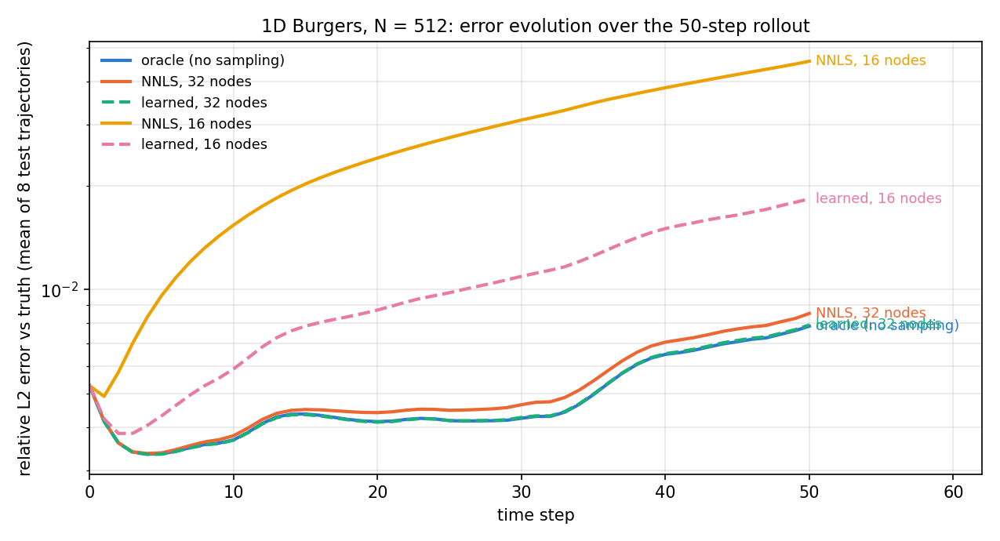

# Separable NM-ROM — presentation notes (28 Aug 2026)

Numbers below are read from the run files of gate-checked A100 jobs (f64), single seed.
Sources: `2026-08-27-b1d-node-screening-and-poisson-qf.md`, `2026-08-27-b1d-scaling-and-fom-cost.md`,
`2026-08-28-b1d-rollout-optimization.md`.

## 1. Architecture

The decoder is a product of two tracks that never see each other's input:

$$u(x;z) = bc(x)\,\langle g(x),\,h(z)\rangle$$

- **Bank $g(x)$** (frozen after training): random-Fourier features → small MLP → $R$ spatial features; $bc(x)$ enforces the boundary condition exactly. Evaluated once at any point set and cached.
- **Head $h(z)$**: MLP + linear skip from the $K$-dimensional latent to $R$ mixing coefficients ($K=8$ Burgers, $K=16$ Poisson).

Because all $x$-dependence factors through $g$, the decoder restricted to any point set is a cached table times $h(z)$ — the online solve never touches the grid.

**Residual.** Project the PDE residual onto $M$ sine test modes $\Phi$ (weak form). Every linear term collapses through one precomputed matrix $A=\Phi^\top G$ $(M\times R)$, so $\Phi^\top u = A\,h(z)$ exactly — no quadrature. Only a nonlinear term is sampled. For Burgers (advection $N(u)=u\,u_x$, sign-upwind) at $m$ nodes $X$ with weights $w$:

$$r(z) = W\odot\Big[A\big(h(z)-h(z^n)\big) + \Delta t\big(\Phi_X^\top (w\odot N_X(u)) + \nu\lambda\odot A\,h(z)\big)\Big]$$

with $W=(1+\Delta t\,\nu\lambda)^{-1}$ and $\lambda$ the Laplacian eigenvalues of the modes. Each time step: damped Levenberg–Marquardt in the $K$ latent unknowns. For Poisson there is no nonlinear term, so the whole residual is exact: $r(z)=W\odot(B\,h(z)) - f_m$ with $B=\Phi^\top\mathrm{diag}(w)G$ built once.

## 2. Loss functions and training

**Stage 1 — train the decoder (auto-decoder).** Joint Adam over the bank $g$, the head $h$, and one latent code $z_s$ per training snapshot $u_s$; full batch, warm-up then cosine decay (LR $10^{-3}\to10^{-5}$), 40 000 steps.

$$L_1 = \frac{\mathrm{mean}_s\,\|G\,h(z_s)-u_s\|^2}{\mathrm{mean}\,\|u\|^2} + \lambda_{\mathrm{orth}}\Big\|\frac{G^\top G}{n\,s^2}-I\Big\|_F^2,\qquad \lambda_{\mathrm{orth}}=10^{-4}$$

First term: relative reconstruction of every training snapshot. Second term: keeps the feature bank well conditioned (conditioning only). After this stage **everything is frozen**; nothing downstream touches $g$, $h$, or the codes.

**How the loss is used at solve time.** The decoder is never asked to predict. It defines a manifold; at each time step the solver finds the latent $z$ whose decoded field best satisfies the weak residual above. Accuracy is graded on fresh test trajectories the training never saw.

**Stage 2 — learn where to sample (Burgers only).** With the decoder frozen, the $m$ node positions $X$ are the only trainable object. The loss asks the sampled advection term to agree with the exact full-grid one, in value and in its $z$-gradient (what the solver follows), on training states plus small latent perturbations:

$$L_{\mathrm{samp}} = \mathrm{mean}_s\,\frac{\|W_s\big(\Phi_X^\top(w\odot N_X(u_s)) - \Phi^\top N(u_s)\big)\|^2}{\|W_s\,\Phi^\top N(u_s)\|^2},\qquad L_{\mathrm{jac}} = \text{same for }\partial_z$$

$$L_2 = \frac{L_{\mathrm{samp}}}{L_{\mathrm{samp}}^0} + \frac{L_{\mathrm{jac}}}{L_{\mathrm{jac}}^0} + w_{\mathrm{sep}}\sum_{i<j}\mathrm{relu}\big(d_{\min}-|x_i-x_j|\big)^2$$

- Each term is divided by its starting value (frozen constants), so both start at 1 and weigh equally.
- Positions $X$ get gradients (Adam, LR $3\times10^{-3}$, 2000 steps), kept inside the domain by a sigmoid box; the last term keeps nodes apart.
- Weights $w\ge0$ are never gradient-trained: every 500 steps they are re-solved by non-negative least squares on the same loss rows (variable projection), so the convex NNLS rule is always the fallback.
- The full-grid teacher and the decoder are frozen, so the loss is a *mismatch*: it cannot be gamed by fooling the points, only by placing them better. Held-out states excluded from every gradient and every NNLS row monitor generalization.

## 3. Poisson 2D results (N = 128 / 256 / 512)

Three ways of evaluating the same residual through the same solver on the same frozen decoders:

| N | path | sample points | solve ms | solution error | residual error vs full grid | gradient direction (cos, min) | setup s |
|---|---|---|---|---|---|---|---|
| 128 | full grid | 15,876 | 3.98 | 3.06e-2 | 0 (reference) | 1.000 | — |
| 128 | sampled (NNLS) | 256 | 3.14 | 3.06e-2 | 7.9e-2 | −0.61 | 28.6 |
| 128 | **quadrature-free** | **0** | **2.93** | 3.06e-2 | **4.2e-14** | **1.000** | **0.9** |
| 256 | full grid | 64,516 | 4.96 | 3.14e-2 | 0 | 1.000 | — |
| 256 | sampled (NNLS) | 256 | 2.75 | 3.14e-2 | 6.2e-2 | −0.60 | 37.3 |
| 256 | **quadrature-free** | **0** | **2.68** | 3.14e-2 | **3.6e-14** | **1.000** | **0.7** |
| 512 | full grid | 260,100 | 11.11 | 3.15e-2 | 0 | 1.000 | — |
| 512 | sampled (NNLS) | 256 | 3.09 | 3.15e-2 | 5.5e-2 | −0.65 | 25.4 |
| 512 | **quadrature-free** | **0** | **2.87** | 3.15e-2 | **3.3e-14** | **1.000** | **0.8** |

- Linear Poisson needs no sample points: the exact residual matches the full grid to ~13 digits at every solver solution (zero gate failures).
- Same accuracy as the other paths (all on the decoder floor), fastest online, flat in N while full-grid grows 4 → 11 ms, and it removes the 25–37 s quadrature fit entirely.
- The sampled rule it replaces was 5–8 % wrong in its residual at solutions, with gradients that can point the wrong way.

## 4. 1D Burgers results (N = 128 … 4096)

Six arms per resolution: a full-grid **oracle** (no sampling), NNLS vs **learned nodes** at a tight budget of 32 nodes and a starved budget of 16, and NNLS at a generous 128. Rollout error = relative L2 vs the truth over 50 implicit steps, mean of 8 fresh test trajectories.

| N | decoder floor | oracle | NNLS 32 | learned 32 (vs NNLS) | NNLS 16 | learned 16 (vs NNLS) |
|---|---|---|---|---|---|---|
| 128 | 3.71e-3 | 5.01e-3 | 5.48e-3 | 5.02e-3 (−8.4%) | 2.10e-2 | 1.01e-2 (**−52%**) |
| 256 | 3.73e-3 | 6.17e-3 | 6.24e-3 | 6.20e-3 (−0.6%) | 2.56e-2 | 1.07e-2 (**−58%**) |
| 512 | 3.80e-3 | 4.88e-3 | 5.19e-3 | 4.89e-3 (−5.9%) | 2.68e-2 | 1.03e-2 (**−62%**) |
| 1024 | 3.79e-3 | 5.54e-3 | 5.62e-3 | 5.45e-3 (−2.9%) | 2.22e-2 | 8.61e-3 (**−61%**) |
| 2048 | 3.83e-3 | 5.08e-3 | 5.53e-3 | 5.15e-3 (−7.0%) | 2.25e-2 | 8.44e-3 (**−63%**) |
| 4096 | 3.83e-3 | 4.49e-3 | 4.89e-3 | 4.53e-3 (−7.3%) | 2.29e-2 | 9.22e-3 (**−60%**) |

- Decoder floor and oracle are flat across a 32× change in resolution.
- At 32 nodes sampling costs only 2–10 % over the oracle in 1D and learned nodes close 84–97 % of that — landing on the oracle, i.e. matching the 128-node rule with a quarter of the points.
- At 16 nodes sampling costs 4–5× the oracle error and learned nodes cut it by 52–63 %, six resolutions out of six.
- Learned nodes improve the budget you have; they do not replace a bigger one (learned-16 never reaches NNLS-32).

**Error evolution over the rollout (N = 512):**

All arms share the same initial-condition fit (step 0). The oracle and the learned-32 arm are indistinguishable step for step; the starved NNLS rule drifts away from step 1 on (4.6e-2 by step 50), and learned nodes at the same 16-point budget hold it to 1.8e-2.

**ROM online cost** per 50-step trajectory (A100), independent of resolution: 49–62 ms end-to-end on the ladder; 22–24 ms after the inner-loop optimization (same algorithm, errors unchanged to 1e-9).

## 5. Takeaways

- Linear problems need no empirical quadrature under this decoder — exact, cheaper than sampling, nothing to fit. Adopted as the Poisson default.
- For nonlinear terms, sample placement is worth learning when the budget binds (2–3× error reduction at a starved budget, stable from 128 to 4096 points), and it can only move points, never damage the decoder.
- The online cost is mesh-independent; the remaining accuracy limit is the decoder floor, not the quadrature.
