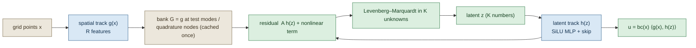

# Separable decoder: results digest

What the separable EQ-decoder ROM has measured on every PDE it has been run on, in one place.
Numbers are **final** for every table unless the table's own status line says otherwise; two
tables are kept only because they are **superseded** and say so. Every table below is copied
verbatim by `gen_2026-09-03-separable-decoder-digest.py` from a source report whose tables were
generated from run JSONs, and the source and its generator are named under each table. The prose
carries no numbers. Current state and the retraction history are in `LAB-LOG.md`.

## The model

$$
u(x; z) \;=\; \mathrm{bc}(x)\,\big\langle g(x),\, h(z) \big\rangle,
\qquad g:\ \mathbb{R}^d \to \mathbb{R}^R,\quad h:\ \mathbb{R}^K \to \mathbb{R}^R .
$$

The spatial track $g$ (random-Fourier lift into a SiLU MLP, linear last layer) carries all
$x$-dependence and never sees $z$; the latent track $h$ (SiLU MLP with a linear skip) carries all
$z$-dependence and all the nonlinearity. Because $g$ is independent of $z$, everything that
depends on space is evaluated once and cached: the weak-form test modes $\Phi$ give a matrix
$A = \Phi^{\mathsf T} G$ so the linear terms of the residual are $A\,h(z)$ exactly, and only a
genuinely nonlinear term needs sampling, or, when it is quadratic, a precomputed tensor. The online
solve is a Levenberg–Marquardt problem in $K$ unknowns whose cost does not depend on the grid.

Blue = trained offline, sand = frozen and cached, green = solved online.

## Scorecard

| PDE | residual degree | what was found | status |
|---|---|---|---|
| Burgers 2D | 2 | ROM cost flat in $N$; beats the preconditioned Newton FOM at the finest mesh only; exact linear terms and the quadratic tensor remove all quadrature error from the linear and advection terms; head generalisation is the accuracy limiter | final, single seed |
| Burgers 1D | 2 | same accuracy picture, scale-stable to $N = 65\,536$; the tridiagonal FOM is cheaper and far more accurate at every $N$, so no speed story | final, single seed |
| Poisson 2D | 1 | quadrature-free residual equals the full grid to machine precision at the decoder floor; ROM cost flat in $N$; the win is against iterative solvers only | final |
| Stokes 2D | 1 (constrained) | decoder passes its predeclared stop gate over POD-8, but a direct linear solve in the bank span is more accurate and cheaper by orders of magnitude, as predicted | final, not a positive result |
| Wave 2D (POD bank) | 1 (conservative) | reflective walls: the ROM fails the accuracy stop gate on every head and both integrators; absorbing walls: the supervised head passes | final, cause = hypothesis |

## Burgers 2D

### Speed against the classical solver

The paired matched-accuracy protocol: the ROM and the swept Helmholtz-preconditioned Newton
ladder run interleaved AB/BA on one GPU, and the FOM rung is the cheapest one at least as accurate
as the ROM. This is the table that replaced the retracted headline speedups.

### T-X1. Stage 1 — the round-4/5 speed protocol, incumbent residual vs exact-linear residual

Same checkpoint, same protocol, same GPU type per row pair; paired = median of AB/BA interleaved end-to-end runs at matched accuracy.  `base` = the un-shortcut ROM arm's mean rollout error over 8 test trajectories.

| N | residual | job | GPU | base rollout err | champion err | paired ROM ms | paired FOM ms | ratio |
|---|---|---|---|---|---|---|---|---|
| 256 | incumbent | 2837431 | NVIDIA A100 80GB PCIe | 8.959e-03 | 9.024e-03 | 43.9 | 16.4 | 0.37x |
| 256 | exact-linear | 2844824 | NVIDIA A100-PCIE-40GB | 8.016e-03 | 8.028e-03 | 46.9 | 16.9 | 0.36x |
| 1024 | incumbent | 2837430 | NVIDIA H200 | 9.685e-03 | 9.722e-03 | 33.2 | 63.2 | 1.90x |
| 1024 | exact-linear | 2844825 | NVIDIA H200 | 7.977e-03 | 8.008e-03 | 33.6 | 62.9 | 1.87x |

*Source: `2026-08-26-exact-linear-terms-and-gradient-eq.md`, generated by `gen_2026-08-26-exlin.py`.*

The earlier four-resolution table is kept for the record. **Its N=1024 row is superseded**: that
decoder was badly under-trained, so its speedup was bought at an accuracy nobody would accept.

### T2. Burgers: end-to-end ROM vs the strong classical baseline

ROM e2e = IC latent fit + 50 implicit steps + full-grid decode, one job, one GPU.

| N | ROM e2e ms | ROM err | cheapest Newton at least as accurate | truth-gen (over-solved) | verdict |
|---|---|---|---|---|---|
| 128 | 84.6 | 2.251e-02 | 68.5 ms @ 3.0e-04 | 948 ms | classical wins (1.2x slower) |
|   | | | | | 2026-08-23-sepdec-n128/experiments/separable-decoder/runs/sepdec_n128_j1/out/sep_burgers_K16_R96.json |
| 256 | 106.9 | 2.453e-02 | 60.5 ms @ 3.0e-04 | 1613 ms | classical wins (1.8x slower) |
|   | | | | | 2026-08-23-sepdec-n256/experiments/separable-decoder/runs/n256_j2/out/sep_burgers_K16_R64.json |
| 512 | 69.9 | 2.941e-02 | 19.6 ms @ 3.1e-04 | 357 ms | classical wins (3.6x slower) |
|   | | | | | 2026-08-23-sepdec-n512/experiments/separable-decoder/runs/sepdec_n512_j2/out/sep_burgers_K16_R64_nff128_ffs4.json |
| 1024 | 59.7 | 1.171e-01 | 310.4 ms @ 4.9e-04 | 1587 ms | **ROM wins 5.2x** |
|   | | | | | 2026-08-23-sepdec-n1024/experiments/separable-decoder/runs/sepdec_n1024_j2/out/sep_burgers_N1024_K16_R64.json |

*Source: `2026-08-24-separable-decoder-architecture-and-results.md`, generated by
`gen_2026-08-24_architecture_study.py`. **Superseded** by T-X1 above.*

### Accuracy: the head-generalisation campaign

### T8. Round-5 Burgers accuracy campaign (N=256): what the h-generalisation work bought

Every row is one *speed* job run on a frozen decoder checkpoint, so error and cost come from the same protocol as T2/PROFILE (end-to-end incl. IC fit and full decode, matched-accuracy paired AB/BA against a swept (newton_tol, lin_tol) Helmholtz-preconditioned classical ladder). `paired` > 1 means the ROM is faster.

> **These rows are ALL N=256, where the classical solver wins regardless of decoder quality (0.39x for the incumbent).** Do not read the sub-1 ratios as a regression against the round-4 speed result: that win was at **N=1024** (1.61x single-query, T2/PROFILE), the only resolution where the ROM leads. The accuracy campaign ran at N=256 because iteration is ~1.5 h there versus 4 h+, and the h gap is resolution-independent (36.8x at N=256 vs 31.7x at N=1024), so its findings transfer. The N=1024 confirmation had not run when this was generated.
>
> **Projection to N=1024, explicitly not a measurement:** the improved decoder costs 1.27x more, and the classical rung it must now match also costs 1.32x more (13.81 -> 18.26 ms, since a more accurate ROM must be compared against a more accurate classical setting). Both sides rise together -- which is why the N=256 ratio held at 0.39x -> 0.40x. Applying the same scaling at N=1024 gives ROM ~34 ms against classical ~57 ms, i.e. the 1.61x roughly preserved at 3x better accuracy. That is what the queued `dn1024` job settles.

| decoder | K | EQ | rollout err | ROM e2e ms | matched classical (ms @ err) | paired | EQ-bank gate |
|---|---|---|---|---|---|---|---|
| round-4 incumbent | 16 | M=64 | **2.751e-02** | 35.60 | 13.81 @ 8.4e-04 | 0.39x | 2.9e-16 |
| k48_N256 | 48 | M=64 | **9.232e-03** | 135.75 | 17.36 @ 3.5e-04 | 0.12x | 3.8e-15 |
| dense_mid_N256 | 16 | M=64 | **8.961e-03** | 45.15 | 18.26 @ 3.5e-04 | 0.40x | 3.2e-15 |
| dense_mid_N256 | 16 | M=256 | **6.184e-03** | 55.65 | 18.07 @ 3.5e-04 | 0.32x | 3.2e-15 |
| dense_K16_N256 | 16 | M=64 | **5.021e-03** | 73.99 | 16.93 @ 3.5e-04 | 0.23x | 2.5e-15 |

=> **At an unchanged position against the classical ladder** (0.39x -> 0.40x), rollout error improves **2.751e-02 -> 8.961e-03 = 3.07x** (`dense_mid_N256`). The ROM costs 1.27x more, and so does the classical rung it must now match -- a Pareto move, not a trade.

=> **Best error of the campaign**: **5.021e-03** (`dense_K16_N256`, 5.48x better than the incumbent), but at 0.23x vs the incumbent's 0.39x -- i.e. 1.7x of the speed ratio spent to buy it.

Full campaign (35 h-arms, the K and mu-density ladders, and the levers that failed) is in `reports/2026-08-25-burgers-h-generalisation-wall.md` on branch `exp/2026-08-25-burgers-accuracy`.

**Reading T5.** These are the hard ceilings from Part I.2 — the best *any* separable
architecture can do at a given bank width. Burgers reaches **7.0e-5** (mean, fresh
states) at R = 512, so the 1e-3 target is feasible with a single span; the worst-state
floor at that width is 2.3e-3, which is the number to watch. The Poisson family floor
hits exactly 0 at R = 512 because the training family has only 512 snapshots.

**Reading T6.** The last layer of `g` is linear, mapping a `G_h`-wide hidden layer to
`R` outputs, so the bank's rank cannot exceed `G_h + 1` regardless of `R`. Both
trained checkpoints collapse at index 256 — nominal `R = 512`, **effective rank 257**.
The `INIT` rows show this is structural (present before any training) and that
`G_h ≥ 2R` fixes it, while `G_h = R` reaches full rank with a badly conditioned tail
(2e-6).

---

*Source: `2026-08-24-separable-decoder-architecture-and-results.md`, generated by
`gen_2026-08-24_architecture_study.py`.*

### What the nonlinearity buys

### T7. What the nonlinearity buys: K nonlinear coefficients vs R linear modes

- trained **K=16** separable decoder, reconstruction **7.082e-03** (`2026-08-23-n256-push/experiments/separable-decoder/runs/push_r2_burgers/out/sep_burgers_r2_K16_R512.json`)
- linear **POD rank 16** floor on the same family: **1.182e-01** (16.7x worse)
- smallest linear POD rank matching that reconstruction: **117**

  => 16 nonlinear coefficients are worth about **117 linear basis functions** on this family.

*Source: `2026-08-24-separable-decoder-architecture-and-results.md`, generated by
`gen_2026-08-24_architecture_study.py`.*

### Where the quadrature error sits

The residual the solver minimises was compared with the exact full-grid weak form along real
solver paths. Most of the error was in the linear terms, which is what motivated making them exact.

### T-L1. Where the quadrature error sits: residual, split into the part that could be exact and the part that cannot

Solver-path states (every LM iterate of a real ROM rollout, 4 fresh test trajectories, all 50 steps). Relative to the full-grid residual norm. `lin` = mass + previous state + Laplacian terms (all `Φᵀu`, exactly computable as `(ΦᵀG)h(z)`); `adv` = `ΦᵀN(u)` (sign-upwind, needs sampling).

| decoder | N | K | EQ set (M/m) | NNLS rel fit | (b) ‖R_s−R_f‖/‖R_f‖ | of which lin | of which adv | (b) worst |
|---|---|---|---|---|---|---|---|---|
| sep_burgers_r3_N256_K16_R512 | 256 | 16 | ctrl (64/256) | 5.2e-03 | 4.3e-01 | 3.1e-01 | 4.4e-01 | 1.2e+00 |
| sep_burgers_r3_N256_K16_R512 | 256 | 16 | M256 (256/1024) | 5.2e-04 | 5.6e-02 | 5.9e-02 | 2.3e-02 | 2.7e-01 |
| sep_hfit_dense_mid_N256 | 256 | 16 | ctrl (64/256) | 4.0e-03 | 3.3e-01 | 3.0e-01 | 1.9e-01 | 1.3e+00 |
| sep_hfit_dense_mid_N256 | 256 | 16 | M256 (256/1024) | 5.4e-04 | 7.6e-02 | 7.4e-02 | 1.9e-02 | 7.3e-01 |
| sep_burgers_r3_N1024_K16_R512 | 1024 | 16 | ctrl (64/256) | 5.4e-03 | 5.3e-01 | 4.1e-01 | 4.6e-01 | 1.4e+00 |
| sep_burgers_r3_N1024_K16_R512 | 1024 | 16 | M256 (256/1024) | 5.9e-04 | 6.7e-02 | 7.1e-02 | 2.6e-02 | 4.4e-01 |
| sep_burgers_r4_N1024_K32_R512_h512x3 | 1024 | 32 | ctrl (64/256) | 5.1e-03 | 4.3e-01 | 3.4e-01 | 4.7e-01 | 1.3e+00 |
| sep_burgers_r4_N1024_K32_R512_h512x3 | 1024 | 32 | M256 (256/1024) | 5.6e-04 | 1.1e-01 | 1.2e-01 | 5.0e-02 | 7.6e-01 |

*Source: `2026-08-25-eq-fidelity-ladder.md`, generated by `gen_2026-08-25-eq-ladder.py`.*

### Learned quadrature nodes

### T-X4. Stage 3 — learned continuous nodes vs the convex baselines

node = m continuous positions optimized against the frozen full-grid teacher (inner NNLS re-solving the weights; loss = ladder rungs b + c1).  Success bar: beat `grad` on held-out (c1)/(c3) AND on test rollout error at the same m.

| arm | N | K | M/m | set | held-out (b) | held-out (c1) | (c1) cos | (c3) cos | test-path (b) | rollout err | opt loss init→final | mean node move |
|---|---|---|---|---|---|---|---|---|---|---|---|---|
| nf1024m256 | 1024 | 32 | 256/1024 | adv | 2.0e-02 | 3.5e-01 | 0.727 | 0.753 | 8.2e-02 | 1.435e-02 | — | — |
| nf1024m256 | 1024 | 32 | 256/1024 | grad | 2.7e-02 | 2.3e-01 | 0.968 | 0.871 | 1.4e-01 | 1.440e-02 | — | — |
| nf1024m256 | 1024 | 32 | 256/1024 | node | 1.3e-01 | 7.4e-01 | 0.772 | 0.708 | 3.4e-01 | 1.458e-02 | 1.28e-05→2.42e-05 | 5.3e-04 |
| nf1024m64 | 1024 | 32 | 64/256 | adv | 4.1e-01 | 6.8e-01 | 0.458 | 0.469 | 3.9e-01 | 2.467e-02 | — | — |
| nf1024m64 | 1024 | 32 | 64/256 | grad | 1.5e-01 | 2.2e-01 | 0.950 | 0.906 | 3.4e-01 | 2.067e-02 | — | — |
| nf1024m64 | 1024 | 32 | 64/256 | node | 7.1e-02 | 1.7e-01 | 0.977 | 0.985 | 2.6e-01 | 2.005e-02 | 1.32e-02→4.86e-04 | 6.9e-03 |
| nf256m256 | 256 | 16 | 256/1024 | adv | 1.0e-02 | 1.3e-01 | 0.944 | 0.859 | 2.3e-02 | 1.105e-02 | — | — |
| nf256m256 | 256 | 16 | 256/1024 | grad | 1.9e-02 | 3.6e-01 | 0.951 | 0.845 | 7.7e-02 | 1.106e-02 | — | — |
| nf256m256 | 256 | 16 | 256/1024 | node | 2.8e-02 | 5.6e-01 | 0.931 | 0.799 | 1.5e-01 | 1.110e-02 | 1.42e-06→4.93e-07 | 7.4e-04 |
| nf256m64 | 256 | 16 | 64/256 | adv | 1.9e-01 | 5.3e-01 | 0.611 | 0.368 | 2.1e-01 | 1.505e-02 | — | — |
| nf256m64 | 256 | 16 | 64/256 | grad | 5.1e-02 | 1.9e-01 | 0.969 | 0.922 | 3.9e-01 | 1.706e-02 | — | — |
| nf256m64 | 256 | 16 | 64/256 | node | 1.7e-02 | 9.5e-02 | 0.992 | 0.989 | 3.2e-01 | 1.591e-02 | 2.41e-03→1.79e-04 | 1.0e-02 |

*Source: `2026-08-26-exact-linear-terms-and-gradient-eq.md`, generated by `gen_2026-08-26-exlin.py`.*

At the tight budget $m = M$ the win transfers across meshes, but learned nodes never reach the
$m = 4M$ baseline, so there is no cheaper-solve-at-matched-accuracy story.

**T-N1 — per-budget: learned nodes vs the NNLS grid-node baseline (same m).**

| N | m | variant | held (b) | held (c1) | (c1) cos | held recon | rollout err | vs base | trip |
|---|---|---|---|---|---|---|---|---|---|
| 64 | 64 | base | 8.050e-01 | 5.428e+00 | 0.6407 | 2.733e-02 | 7.113e-02 | — | n |
| 64 | 64 | cot | 3.626e-01 | 1.533e+00 | 0.7321 | 2.733e-02 | 5.880e-02 | -17.3% | n |
| 64 | 256 | base | 3.062e-02 | 2.393e-01 | 0.9595 | 2.733e-02 | 5.185e-02 | — | n |
| 64 | 256 | cot | 1.405e-02 | 9.296e-02 | 0.9844 | 2.733e-02 | 5.207e-02 | +0.4% | n |
| 256 | 64 | base | 1.021e+00 | 6.315e+00 | 0.6329 | 2.964e-02 | 7.184e-02 | — | n |
| 256 | 64 | cot | 4.118e-01 | 1.421e+00 | 0.7362 | 2.964e-02 | 6.136e-02 | -14.6% | n |
| 256 | 256 | base | 4.140e-02 | 2.507e-01 | 0.9382 | 2.964e-02 | 4.792e-02 | — | n |
| 256 | 256 | cot | 1.316e-02 | 7.783e-02 | 0.9939 | 2.964e-02 | 4.833e-02 | +0.9% | n |
| 1024 | 64 | base | 1.068e+00 | 1.571e+01 | 0.6615 | 1.724e-02 | 1.411e-01 | — | n |
| 1024 | 64 | cot | 6.739e-01 | 3.762e+00 | 0.6715 | 1.724e-02 | 1.309e-01 | -7.2% | n |
| 1024 | 256 | base | 5.902e-02 | 5.146e-01 | 0.9098 | 1.724e-02 | 1.172e-01 | — | n |
| 1024 | 256 | cot | 2.953e-02 | 2.652e-01 | 0.9381 | 1.724e-02 | 1.170e-01 | -0.2% | n |

**T-N2 — the matched-accuracy question: do learned m=M nodes reach the NNLS m=4M baseline?**

| N | learned nodes, m=M rollout | NNLS baseline, m=4M rollout | learned m=M vs NNLS m=4M |
|---|---|---|---|
| 64 | 5.880e-02 | 5.185e-02 | +13.4% |
| 256 | 6.136e-02 | 4.792e-02 | +28.1% |
| 1024 | 1.309e-01 | 1.172e-01 | +11.7% |

*Source: `2026-08-27-nodes-at-mM-transfer.md`, generated by `gen_2026-08-27-nodes-mM-transfer.py`.*

### Co-designing the decoder with its quadrature

Training the head together with the nodes drives the sampled-gradient error down, but every arm
that touches the head pays reconstruction drift and loses to frozen-decoder node learning on
rollouts. A clean negative at N=64; untested at larger N.

### T-C1. All arms, held-out rungs and test rollouts

N=64, K=16, R=64, M=64; 2000 steps, LR 3e-5; 4 fresh test trajectories; base = frozen decoder + advection-only NNLS nodes (identical across arms at equal m by construction).

| m | arm | trained | REC_W | held (b) | held (c1) | (c1) cos | (c3) cos | held recon | rollout err | vs base | trip |
|---|---|---|---|---|---|---|---|---|---|---|---|
| 64 | base (NNLS) | — | — | 8.050e-01 | 5.428e+00 | 0.6407 | 0.7022 | 2.733e-02 | 7.113e-02 | — | — |
| 64 | i_m64 | h+nodes | 10 | 3.252e-01 | 4.280e-01 | 0.9002 | 0.8662 | 3.050e-02 | 6.383e-02 | -10.3% | Y |
| 64 | ii_m64 | h+nodes+jac | 10 | 3.149e-01 | 4.462e-01 | 0.8752 | 0.8883 | 3.054e-02 | 6.391e-02 | -10.1% | Y |
| 64 | iii_m64 | h+nodes+jac+sob | 10 | 3.192e-01 | 4.640e-01 | 0.8715 | 0.8878 | 3.054e-02 | 6.451e-02 | -9.3% | Y |
| 64 | n_m64 | nodes | 10 | 3.626e-01 | 1.533e+00 | 0.7321 | 0.8354 | 2.733e-02 | 5.880e-02 | -17.3% | n |
| 64 | r100_ii_m64 | h+nodes+jac | 100 | 2.968e-01 | 4.345e-01 | 0.8851 | 0.9053 | 3.047e-02 | 6.154e-02 | -13.5% | Y |
| 256 | base (NNLS) | — | — | 3.062e-02 | 2.393e-01 | 0.9595 | 0.9915 | 2.733e-02 | 5.185e-02 | — | — |
| 256 | i_m256 | h+nodes | 10 | 1.442e-02 | 3.746e-02 | 0.9969 | 0.9997 | 3.043e-02 | 5.800e-02 | +11.9% | Y |
| 256 | ii_m256 | h+nodes+jac | 10 | 1.221e-02 | 3.158e-02 | 0.9983 | 0.9995 | 3.038e-02 | 5.782e-02 | +11.5% | Y |
| 256 | n_m256 | nodes | 10 | 1.405e-02 | 9.296e-02 | 0.9844 | 0.9965 | 2.733e-02 | 5.207e-02 | +0.4% | n |
| 256 | r100_ii_m256 | h+nodes+jac | 100 | 1.250e-02 | 2.816e-02 | 0.9988 | 0.9994 | 3.046e-02 | 5.795e-02 | +11.8% | Y |

*Source: `2026-08-26-codesign-minipilot.md`, generated by `gen_2026-08-26-codesign-minipilot.py`.*

### The quadratic tensor: advection projected exactly

Advection is quadratic in $h$, so $\Phi^{\mathsf T}(u \odot D u) = \tfrac12 h^{\mathsf T} Q h$ with $Q$
built once from the frozen bank. Nothing is sampled and nothing is fitted.

### T-4 Accuracy per arm per N (mean rel-L2 over 8 test trajectories x 51 states; fused e2e output of the last timed rep) and tensor-vs-full per-trajectory max |diff|

| N | full err | ex err | tensor err | ex_learned err | tensor-full max abs diff | tensor/full err ratio | tensor/ex err ratio | tensor-full latent dev max | stop hist identical tensor/full (per traj) | attempts identical |
|---|---|---|---|---|---|---|---|---|---|---|
| 64 | 2.308651e-02 | 2.319010e-02 | 2.309414e-02 | 2.730832e-02 | 7.95e-05 | 1.00033 | 0.9959 | 1.3e-04 | True (True) | True |
| 256 | 2.451134e-02 | 2.449564e-02 | 2.451214e-02 | 2.792914e-02 | 7.30e-06 | 1.00003 | 1.0007 | 4.3e-05 | True (True) | True |
| 512 | 2.456215e-02 | 2.449580e-02 | 2.456235e-02 | n/a | 1.95e-06 | 1.00001 | 1.0027 | 1.7e-05 | True (True) | True |
| 1024 | 6.381029e-02 | 6.390634e-02 | 6.381390e-02 | 6.403727e-02 | 1.99e-05 | 1.00006 | 0.9986 | 3.4e-04 | True (True) | True |

### T-7 FOM cost per N (standardised tol-Newton ladder, same GPU as the ROM arms; matched = cheapest rung at least as accurate as the tensor arm; closest = rung with error closest to the tensor arm's in log; tightest = most accurate rung)

| N | GPU | tensor err / e2e ms | matched rung (nt, lt) err / ms | paired tensor vs matched: ROM ms / FOM ms / speedup | closest rung err / ms | tightest rung (nt, lt) err / ms | paired ex vs matched speedup | paired full vs matched speedup |
|---|---|---|---|---|---|---|---|---|
| 64 | NVIDIA A100-PCIE-40GB | 2.309e-02 / 29.60 | (3e-03, 2e-03) 3.75e-04 / 12.36 | 29.57 / 12.37 / 0.42x | 3.46e-02 / 13.34 | (1e-04, 5e-05) 1.35e-04 / 16.29 | 0.41x | 0.36x |
| 256 | NVIDIA A100 80GB PCIe | 2.451e-02 / 29.84 | (3e-03, 2e-03) 3.54e-04 / 17.26 | 29.53 / 17.24 / 0.58x | 3.05e-02 / 18.91 | (1e-04, 5e-05) 1.33e-04 / 23.61 | 0.56x | 0.23x |
| 512 | NVIDIA H200 | 2.456e-02 / 21.10 | (3e-03, 2e-03) 3.51e-04 / 21.06 | 21.50 / 21.01 / 0.98x | 3.00e-02 / 21.41 | (1e-04, 5e-05) 1.35e-04 / 27.35 | 0.92x | 0.22x |
| 1024 | NVIDIA A100 80GB PCIe | 6.381e-02 / 32.56 | (1e-02, 5e-03) 2.97e-02 / 119.99 | 34.11 / 117.69 / 3.45x | 2.97e-02 / 119.99 | (1e-04, 5e-05) 1.39e-04 / 230.72 | 3.31x | 0.18x |

### T-10 Cross-N cost ratios (DIFFERENT jobs and GPUs per N -- ratios, not exponents; the GPU is named per row)

| N | GPU | tensor solve ms | ex solve ms | full solve ms | tensor/ex | tensor/full | tensor ic ms | tensor dec ms | tensor e2e ms |
|---|---|---|---|---|---|---|---|---|---|
| 64 | NVIDIA A100-PCIE-40GB | 27.54 | 28.83 | 32.59 | 0.955 | 0.845 | 1.99 | 0.40 | 29.60 |
| 256 | NVIDIA A100 80GB PCIe | 27.70 | 29.08 | 74.08 | 0.952 | 0.374 | 2.16 | 0.54 | 29.84 |
| 512 | NVIDIA H200 | 19.97 | 20.48 | 97.27 | 0.975 | 0.205 | 1.56 | 0.49 | 21.10 |
| 1024 | NVIDIA A100 80GB PCIe | 27.13 | 29.37 | 670.03 | 0.924 | 0.040 | 4.79 | 1.15 | 32.56 |

*Source: `2026-08-30-b2d-tensor-ladder.md`, generated by `gen_2026-08-30-b2d-tensor.py`. The GPU
differs across rows, so cross-N values are ratios, not exponents.*

## Burgers 1D

A cheap screening testbed. The accuracy findings are scale-stable across a 32× range of $N$, but
the honest tridiagonal Newton FOM is cheaper and more accurate than the ROM at every resolution.

**T-S1 — 1D Burgers scaling ladder: accuracy per arm (rollout err, 8 fresh trajectories, one seed).**

| N | held recon | oracle | NNLS m=32 | learned m=32 (vs base) | NNLS m=16 | learned m=16 (vs base) |
|---|---|---|---|---|---|---|
| 128 | 3.711e-03 | 5.009e-03 | 5.480e-03 | 5.021e-03 (-8.4%) | 2.097e-02 | 1.010e-02 (-51.8%) |
| 256 | 3.730e-03 | 6.165e-03 | 6.236e-03 | 6.197e-03 (-0.6%) | 2.559e-02 | 1.073e-02 (-58.1%) |
| 512 | 3.799e-03 | 4.877e-03 | 5.194e-03 | 4.886e-03 (-5.9%) | 2.676e-02 | 1.029e-02 (-61.5%) |
| 1024 | 3.792e-03 | 5.537e-03 | 5.615e-03 | 5.451e-03 (-2.9%) | 2.218e-02 | 8.609e-03 (-61.2%) |
| 2048 | 3.834e-03 | 5.079e-03 | 5.534e-03 | 5.145e-03 (-7.0%) | 2.254e-02 | 8.440e-03 (-62.6%) |
| 4096 | 3.827e-03 | 4.485e-03 | 4.889e-03 | 4.529e-03 (-7.3%) | 2.294e-02 | 9.219e-03 (-59.8%) |

**T-S3 — 1D Burgers: ROM vs the tridiagonal tolerance-Newton FOM, same job, same GPU.  NOT iso-accuracy: the FOM is far more accurate than the ROM everywhere.**

| N | ROM e2e ms (learned m=32) | ROM err | FOM ms (ntol 1e-3) | FOM err | FOM ms (ntol 1e-8) | ROM/FOM(1e-3) |
|---|---|---|---|---|---|---|
| 128 | 52.23 | 5.021e-03 | 8.27 | 1.370e-04 | 14.20 | 6.3x |
| 256 | 61.50 | 6.197e-03 | 7.81 | 1.396e-04 | 13.91 | 7.9x |
| 512 | 56.76 | 4.886e-03 | 7.87 | 1.439e-04 | 13.98 | 7.2x |
| 1024 | 48.68 | 5.451e-03 | 9.22 | 1.469e-04 | 16.49 | 5.3x |
| 2048 | 52.28 | 5.145e-03 | 31.18 | 7.061e-05 | 61.63 | 1.7x |
| 4096 | 50.36 | 4.529e-03 | 8.77 | 1.497e-04 | 15.30 | 5.7x |

*(N=2048 caveat: the FOM there needs ~4 Newton iterations/step instead of 1
— see F4; its ntol=1e-8 cell is capped on 6/8 trajectories and is not a
converged-tolerance cost. The ROM/FOM ratio at N=2048 is therefore not
comparable to the other rows.)*

*Source: `2026-08-27-b1d-scaling-and-fom-cost.md`, generated by
`gen_2026-08-27-b1d-nodes-and-poisson-qf.py`.*

After the rollout optimisation (broadcast Gauss–Jordan for the $K \times K$ solve, fused
residual and Jacobian, hoisted constants) at bit-level parity:

**T-O2 — where the optimized ROM stands against the tridiagonal FOM (single-query latency, plus the amortized throughput arm; the FOM was NOT batched — its batched cost is unmeasured).**

| N | ROM e2e ms (optimized, learned m=32) | FOM ms (ntol 1e-3) | ROM/FOM | ROM amortized ms/traj (vmap x8) | thru err == baseline |
|---|---|---|---|---|---|
| 512 | 24.0 | 7.87 | 3.0x | 7.9 | 5.194e-03 |
| 4096 | 21.9 | 8.77 | 2.5x | 6.6 | 4.889e-03 |

*Source: `2026-08-28-b1d-rollout-optimization.md`, generated by
`gen_2026-08-27-b1d-nodes-and-poisson-qf.py`.*

The 1D tensor arm, single GPU, resolutions interleaved in one job:

### T-2 — Key table: rollout error (mean rel-L2 over 8 test trajectories, 51 states each) and e2e ms (median over 8 traj x 5 reps; optimized path)

| N | oracle err | tensor err | max per-traj abs diff | NNLS-32 err | learned-32 err | e2e oracle | e2e tensor | e2e tensor_nolean | e2e NNLS-32 | e2e learned-32 |
|---|---|---|---|---|---|---|---|---|---|---|
| 128 | 5.009008e-03 | 5.009175e-03 | 1.20e-06 | 5.480428e-03 | 5.020553e-03 | 29.03 | 24.39 | 26.77 | 25.03 | 24.54 |
| 256 | 6.164551e-03 | 6.164636e-03 | 6.40e-07 | 6.236229e-03 | 6.197230e-03 | 35.02 | 29.18 | 33.12 | 29.46 | 28.93 |
| 512 | 4.876680e-03 | 4.876705e-03 | 2.45e-07 | 5.194389e-03 | 4.886140e-03 | 30.66 | 27.46 | 29.04 | 26.05 | 26.71 |
| 1024 | 5.537167e-03 | 5.537195e-03 | 2.26e-07 | 5.614597e-03 | 5.450604e-03 | 27.42 | 21.82 | 24.14 | 22.02 | 21.97 |

### T-8 — Slopes from JOB A alone: exponent p in ms ~ N^p (least-squares fit of log ms vs log N)

| arm | N range | solve ms | us per LM attempt | ic ms | e2e ms |
|---|---|---|---|---|---|
| oracle | 128..4096 | -0.0374 | +0.0487 | -0.0055 | -0.0322 |
| base_tight | 128..4096 | -0.0652 | +0.0092 | -0.0020 | -0.0455 |
| tensor | 128..4096 | -0.0772 | +0.0095 | -0.0011 | -0.0493 |

*Source: `2026-08-29-b1d-tensor-sample-free-burgers.md`, generated by `gen_2026-08-29-b1d-tensor.py`.*

## Poisson 2D

Poisson is the control problem. The decoder floor is a few percent, the ROM cost is flat in $N$,
and the comparison is against **iterative** solvers: an exact spectral solve beats both.

### P1. Solve cost vs grid size (K=16, held-out sources, tau=1e-3)

| grid N | unknowns | ROM ms | ROM error | classical CG ms | CG error | who wins |
|---|---|---|---|---|---|---|
| 64 | 3,844 | **2.06** | 3.75e-02 | 1.31 | 3.2e-02 | CG 1.6x |
| 128 | 15,876 | **3.09** | 3.06e-02 | 3.75 | 1.7e-02 | **ROM 1.2x** |
| 256 | 64,516 | **2.54** | 2.89e-02 | 8.16 | 1.1e-02 | **ROM 3.2x** |
| 512 | 260,100 | **3.06** | 3.15e-02 | 26.36 | 7.1e-03 | **ROM 8.6x** |
| 1024 | 1,044,484 | **3.50** | 3.48e-02 | 98.31 | 4.9e-03 | **ROM 28.1x** |

*CG column = cheapest tolerance rung at least as accurate as the ROM (falls back to the cheapest rung if none qualifies). Same job, same GPU.*

**Caveat — a fast direct solver beats both.** Poisson here has constant coefficients, so an exact spectral solve is available:

| grid N | solver | ms | error |
|---|---|---|---|
| 1024 | spectral_dense | 0.64 | 7.0e-15 |

*The ROM's win is against **iterative** solvers, on problems where no fast direct method exists. Say it that way.*

### P3. The ceiling: how good could the basis ever be? (diagnostic only)

| basis size R | best possible error, fresh sources |
|---|---|
| 64 | 3.22e-02 |
| 128 | 1.41e-02 |
| 256 | 4.01e-03 |
| 512 | 8.11e-04 |
| 1024 | 8.11e-04 |

*This is a least-squares fit using the truth, so it is a **diagnostic**, not something the solver can reach. It says the basis is rich enough; whether the 16-number recipe can reach into it is a separate question.*

---

*Source: `2026-08-25-poisson-architecture-and-results.md`, generated by
`gen_2026-08-25-poisson-summary.py`. The CG rung is unpreconditioned; the lab log marks the
speedups as soft for that reason.*

### Quadrature-free residual

The whole Poisson residual is $(\Lambda \odot \Phi^{\mathsf T} G)\,h - \Phi^{\mathsf T} f$: no
sampling anywhere, no NNLS fit, identical solutions.

**T-P1 — Poisson 2D: the three residual paths through the same solver (held-out cohort, tau=1e-3; per-source medians of persisted reps).**

| N | path | m | solve ms | err rel-L2 | jac evals | censored |
|---|---|---|---|---|---|---|
| 128 | full | 15876 | 3.98 | 3.063e-02 | 14.2 | 100% |
| 128 | eq | 256 | 3.14 | 3.062e-02 | 14.2 | 100% |
| 128 | qf | 0 | 2.93 | 3.063e-02 | 14.2 | 100% |
| 256 | full | 64516 | 4.96 | 3.141e-02 | 12.1 | 100% |
| 256 | eq | 256 | 2.75 | 3.141e-02 | 12.1 | 100% |
| 256 | qf | 0 | 2.68 | 3.141e-02 | 12.1 | 100% |
| 512 | full | 260100 | 11.11 | 3.154e-02 | 12.6 | 100% |
| 512 | eq | 256 | 3.09 | 3.154e-02 | 12.6 | 100% |
| 512 | qf | 0 | 2.87 | 3.154e-02 | 12.6 | 100% |

**T-P2 — Poisson 2D: residual/gradient fidelity vs the full-grid reference, and one-time setup cost.**

| N | path | b (resid) at solutions | (c1) grad at solutions | (c1) cos min | setup s |
|---|---|---|---|---|---|
| 128 | eq | 7.878e-02 | 8.857e+06 | -0.6078 | 28.6 |
| 128 | qf | 4.227e-14 | 2.623e-05 | 1.0000 | 0.9 |
| 256 | eq | 6.211e-02 | 2.018e+07 | -0.6023 | 37.3 |
| 256 | qf | 3.608e-14 | 6.634e-05 | 1.0000 | 0.7 |
| 512 | eq | 5.496e-02 | 9.238e+06 | -0.6532 | 25.4 |
| 512 | qf | 3.250e-14 | 1.380e-05 | 1.0000 | 0.8 |

**T-P3 — Poisson 2D: gate Q (quadrature-free == full grid, machine precision).**

| N | random states: resid rel max | grad rel max | at solutions: resid rel max | fails |
|---|---|---|---|---|
| 128 | 1.326e-15 | 7.059e-16 | 9.989e-14 | 0 |
| 256 | 7.412e-16 | 1.116e-15 | 2.898e-13 | 0 |
| 512 | 7.339e-16 | 6.187e-16 | 1.369e-13 | 0 |

*Source: `2026-08-27-b1d-node-screening-and-poisson-qf.md`, generated by
`gen_2026-08-27-b1d-nodes-and-poisson-qf.py`.*

## Stokes 2D

The Navier–Stokes dress rehearsal: vector-valued, divergence-free, pressure eliminated. The
decoder passed its predeclared stop gate, and the direct reduced solve in the bank span then won
by the margin the design predicted. On a linear PDE the nonlinear head can never buy accuracy.

***Exactness** — gates S4 (against an *independent* strong-form full-grid path) and the S7 pressure rung*

| N | residual | Jacobian | pressure elim. vs FOM p | rank A | cond A |
|---|---|---|---|---|---|
| 32 | 6.0e-16 | 4.7e-16 | 7.1e-17 | 32 | 26.7 |
| 64 | 1.8e-15 | 1.1e-15 | 1.3e-16 | 32 | 36.3 |
| 128 | 2.3e-15 | 1.6e-15 | 2.8e-16 | 32 | 45.2 |
| 256 | 7.4e-15 | 4.8e-15 | 5.4e-16 | 32 | 50.9 |

***Accuracy** — 64 held-out parameters, one mass-weighted centred norm, K=8, R=32*

| N | nonlinear QF ROM | POD-8 | vs POD-8 | **direct G-span** | POD-32 Galerkin | QF / G-span err | QF / G-span time |
|---|---|---|---|---|---|---|---|
| 32 | 1.890e-02 | 5.013e-02 | 2.65× | **2.91e-14** | 2.78e-14 | 6.5e+11 | 5387× |
| 64 | 1.893e-02 | 4.981e-02 | 2.63× | **4.56e-14** | 4.18e-14 | 4.1e+11 | 7038× |
| 128 | 1.866e-02 | 4.833e-02 | 2.59× | **3.34e-13** | 2.85e-13 | 5.6e+10 | 6743× |
| 256 | 1.423e-02 | 4.618e-02 | 3.25× | **2.07e-12** | 1.36e-12 | 6.9e+09 | 8940× |

| N | FOM | full-grid ROM | EQ ROM | **quad.-free ROM** | direct G-span | QF / G-span |
|---|---|---|---|---|---|---|
| 32 | 0.0015 | 0.1154 | 0.0533 | **0.0256** | 4.8 µs | 5387× |
| 64 | 0.0114 | 0.2829 | 0.0555 | **0.0342** | 4.9 µs | 7038× |
| 128 | 0.0904 | 3.0653 | 0.0629 | **0.0351** | 5.2 µs | 6743× |
| 256 | 0.4120 | 16.4207 | 0.0753 | **0.0517** | 5.8 µs | 8940× |

*Seconds per query (median of 12 timed reps, gate S7); every timed path is NumPy on CPU, host NVIDIA GB10. The FOM column is the back-substitution of a pre-factored MAC system, i.e. the *cheapest honest* full-order query.*

*Source: `reports/tables/cross-pde-stokes-results.tex` and `cross-pde-cost-stokes.tex`, generated
by `gen_2026-08-30-cross-pde-cost.py`; converted to markdown mechanically here.*

## Wave 2D

Same separable form with the spatial track replaced by the leading $R$ POD modes of the training
snapshots, so the head's distance from its own bank ceiling is measurable. Three heads (`auto`,
`sup` on $(\mu, t)$, `auto+vc`), two ROM integrators (arm A: LSPG–Newmark; arm C: variational
Verlet), reflective and absorbing walls.

| N | BC | head | held-out oracle median | train oracle median | POD-K median | POD-R ceiling median | G0b tangent median / POD-K median (n states) |
|---|---|---|---|---|---|---|---|
| 128 | abs | sup | 0.14647 | 0.19993 | 0.47135 | 0.01743 | 0.25511 / 0.78562 (788) |
| 128 | abs | auto | 0.07232 | 0.07243 | 0.34141 | 0.01743 | 0.28232 / 0.67847 (788) |
| 128 | abs | auto+vc | 0.07347 | 0.07580 | 0.34141 | 0.01743 | 0.23188 / 0.67847 (788) |
| 128 | ref | sup | 0.26083 | 0.27249 | 0.38102 | 0.07293 | 0.74116 / 0.82529 (796) |
| 128 | ref | auto | 0.19377 | 0.17960 | 0.30540 | 0.07293 | 0.74147 / 0.77618 (796) |
| 128 | ref | auto+vc | 0.19113 | 0.17833 | 0.30540 | 0.07293 | 0.72639 / 0.77618 (796) |
| 64 | abs | sup | 0.12524 | 0.15256 | 0.47162 | 0.01771 | 0.25035 / 0.78936 (788) |
| 64 | abs | auto | 0.07464 | 0.07561 | 0.34186 | 0.01771 | 0.30094 / 0.68898 (788) |
| 64 | abs | auto+vc | 0.07596 | 0.08029 | 0.34186 | 0.01771 | 0.24565 / 0.68898 (788) |
| 64 | ref | sup | 0.24580 | 0.30217 | 0.37862 | 0.06385 | 0.64902 / 0.75518 (796) |
| 64 | ref | auto | 0.18615 | 0.16633 | 0.30239 | 0.06385 | 0.65304 / 0.68520 (796) |
| 64 | ref | auto+vc | 0.18667 | 0.16902 | 0.30239 | 0.06385 | 0.62695 / 0.68520 (796) |

*Phase 2: held-out reconstruction oracle, POD-K and POD-R comparators, and the tangent-space
residual (how much of the true velocity the head's tangent space can represent, relative to POD-K).*

| N | BC | head | G0 (phase 2) | predicted G0 | W3 arm A | W3 arm C | reading |
|---|---|---|---|---|---|---|---|
| 128 | abs | sup | PASS | PASS | PASS | PASS | absorbing: dissipative comparator, not used for the causal verdict |
| 128 | abs | auto | PASS | FAIL | FAIL | FAIL | absorbing: dissipative comparator, not used for the causal verdict |
| 128 | abs | auto+vc | PASS | PASS | FAIL | FAIL | absorbing: dissipative comparator, not used for the causal verdict |
| 128 | ref | sup | FAIL | PASS | FAIL | FAIL | G0 fail + reflective fail: consistent with the manifold-quality diagnosis (not alone decisive) |
| 128 | ref | auto | PASS | FAIL | FAIL | FAIL | G0 pass + reflective arm C fail: INCONCLUSIVE (structural not refuted on this head; check W4/W6/D2) |
| 128 | ref | auto+vc | PASS | PASS | FAIL | FAIL | G0 pass + reflective arm C fail: INCONCLUSIVE (structural not refuted on this head; check W4/W6/D2) |
| 64 | abs | sup | PASS | PASS | PASS | PASS | absorbing: dissipative comparator, not used for the causal verdict |
| 64 | abs | auto | PASS | FAIL | FAIL | FAIL | absorbing: dissipative comparator, not used for the causal verdict |
| 64 | abs | auto+vc | PASS | PASS | FAIL | FAIL | absorbing: dissipative comparator, not used for the causal verdict |
| 64 | ref | sup | PASS | PASS | FAIL | FAIL | G0 pass + reflective arm C fail: INCONCLUSIVE (structural not refuted on this head; check W4/W6/D2) |
| 64 | ref | auto | PASS | FAIL | FAIL | FAIL | G0 pass + reflective arm C fail: INCONCLUSIVE (structural not refuted on this head; check W4/W6/D2) |
| 64 | ref | auto+vc | PASS | PASS | FAIL | FAIL | G0 pass + reflective arm C fail: INCONCLUSIVE (structural not refuted on this head; check W4/W6/D2) |

*Phase 3 decision table. Source: the cell's `tables/wav2d-phase2-gates.md` and
`tables/wav2d-phase3-gates.md`, generated by `wav2d_tables.py` on branch
`exp/2026-09-03-wave2d-mechanism`. The cost ladder was not run because it was gated on a
reflective pass.*

## Coverage

| PDE class | residual degree | per-N online-cost ladder | crossover vs the FOM |
|---|---|---|---|
| Poisson 2D | 1 (linear) | measured, N=128/256/512 | not measured (soft: vs unpreconditioned CG) |
| Heat 2D/3D | 1 (linear) | *not measured* | *not measured*; only an aggregate: |
|  |  | direct reduced POD–Galerkin 13–38× faster than the FOM (no N ladder behind it) |  |
| Wave 2D | 1 (linear, conservative) | *not measured* | *not measured* — cell retired unimplemented |
| Burgers 1D | 2 (quadratic) | measured, N=128…65 536 | no crossover: launch-bound below ≈10^{4} pts |
| Burgers 2D | 2 (quadratic) | measured, N=64/256/512/1024 | ≈ N=512 (tensor flat, oracle O(n)) |
| Stokes 2D | 1 (linear, vector, constrained) | measured, N=32/64/128/256 | N=128 (QF ROM under the FOM back-solve) |
| Navier–Stokes | 2 (quadratic) | not run yet | not run yet |

*Source: `reports/tables/cross-pde-cost-coverage.tex`, generated by
`gen_2026-08-30-cross-pde-cost.py`. Written before the wave cell ran; the wave row is now
"measured, ROM fails the stop gate on reflective walls, cost ladder withheld".*

## Retracted, so it is not quoted again

- The four-resolution Burgers speedups at N=64 and N=1024 from the first scaling study, and the
  Poisson speedups read as anything but a comparison against an unpreconditioned iterative solver.
- "K is nearly free", "h is capacity-limited", "the codes are unconverged", "more span helps",
  multi-scale Fourier features.
- The tensor arm being "1–9% better" than sampled quadrature (not distinguishable at n=8).
- The 08-16 wave verdict "the ROM fails because it loses energy": the energy-conserving integrator
  fails at the same error, so energy loss is not necessary for the failure.
- Every gate-level retraction of the wave cell (eight, listed in its `WAVE2D-NOTES.md`).

## Glossary

- **ROM / FOM**: reduced-order model (the decoder plus the latent solve) and full-order model (the
  classical grid solver it is compared against).
- **$N$**: grid points per side; $n = N^2$ unknowns in 2D.
- **$K$**: number of latent coordinates, the unknowns of the online solve. **$R$**: width of the
  spatial bank, the number of features $g$ produces. **$M$**: number of weak-form test modes.
  **$m$**: number of quadrature nodes when a term is sampled.
- **head**: the latent track $h$. **bank**: the cached spatial features $G$.
- **paired / AB/BA**: ROM and FOM timed alternately in one job on one GPU so the comparison is fair.
- **matched accuracy**: the FOM rung chosen is the cheapest one at least as accurate as the ROM.
- **e2e**: end to end, including the initial-condition latent fit and the full-grid decode.
- **oracle**: the residual evaluated on the full grid (no quadrature), or, for the wave cell, the
  best reconstruction the head can reach when the latent is fit to the truth.
- **held-out / fresh**: data never seen in training or in fitting the quadrature.
- **rung (b), (c1), (c3)**: the EQ fidelity ladder; (b) is residual error, (c1) gradient error, (c3)
  step error, each relative to the full grid; **cos** is the direction agreement.
- **NNLS**: non-negative least squares, the convex fit that picks quadrature weights.
- **exact-linear / exlin**: linear residual terms computed exactly through $A = \Phi^{\mathsf T} G$.
- **tensor**: the precomputed quadratic form for the advection term.
- **QF**: quadrature-free.
- **trip / tripwire**: a predeclared check that stops a run instead of reporting it.
- **POD-K, POD-R**: linear projection onto the leading K or R proper-orthogonal-decomposition modes;
  the floors a linear model with the same width would reach.
- **G0, D0–D2, W3**: the wave cell's gates; W3 is the accuracy stop gate, G0 the manifold-quality
  gate, its tangent residual the fraction of the true velocity the head's tangent space misses.
- **arm A / arm C**: the wave cell's two integrators, least-squares Petrov–Galerkin with Newmark,
  and variational Störmer–Verlet on the pulled-back Lagrangian.
- **superseded**: replaced by a later measurement; kept only so the history is readable.
