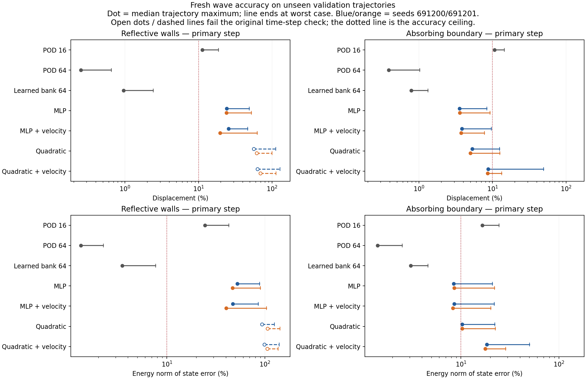
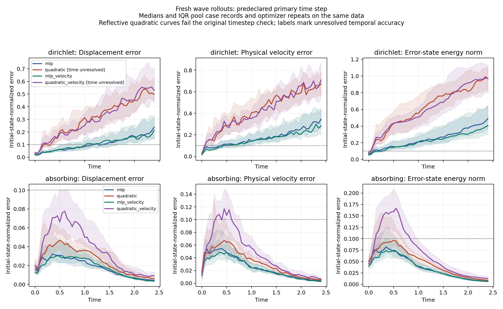
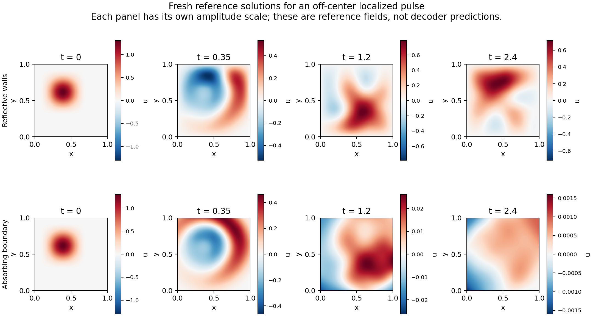

# Fresh waves: learned spatial bank, coefficient heads and actual evolution
This report covers newly verified absorbing and fixed-wall scalar waves, learned-bank reconstruction and actual reduced trajectories. The numerical results below are independently reviewed; all earlier wave experiments are excluded from this evidence.

For `dirichlet`, 0 of 8 head/repeat runs meet the predeclared engineering target. The unrestricted full-bank linear baseline meets the same physical-error ceiling; its time propagation is independent of the nonlinear head.
For `absorbing`, 0 of 8 head/repeat runs meet the predeclared engineering target. The unrestricted full-bank linear baseline meets the same physical-error ceiling; its time propagation is independent of the nonlinear head.

The learned spatial span supports accurate linear evolution at its full dimension. The compressed nonlinear heads have larger representation and trajectory errors; this comparison leaves the smaller state dimension and nonlinear dynamics coupled. It does not isolate a defective spatial bank or establish that nonlinear heads cannot work.
In `dirichlet`, the MLP has 28032 head parameters and the quadratic head has 9792; this is not a parameter-matched architecture comparison. The 2 optimizer repeats share the same data. The velocity penalty improves mean tangent fitting in 4 of 4 matched comparisons, while median trajectory energy-state error worsens in 1 at the original primary step. The latter comparison is qualified by 4 head/repeat runs failing the original timestep check; their temporal accuracy remains unresolved at that step. Selected latent fits include 2 nonstationary states; these remain failures of the declared fitting gate.
In `absorbing`, the MLP has 28032 head parameters and the quadratic head has 9792; this is not a parameter-matched architecture comparison. The 2 optimizer repeats share the same data. The velocity penalty improves mean tangent fitting in 4 of 4 matched comparisons, while median trajectory energy-state error worsens in 3 at the original primary step. All original head/repeat runs pass the timestep check. Selected latent fits include 2 nonstationary states; these remain failures of the declared fitting gate.

The frozen-checkpoint continuation passes the additional finest-pair timestep check in 3 of 4 selected head/repeat runs and 63 of 64 case/repeat comparisons. Remaining failures stay temporally unresolved. These checks preserve the original primary-step verdict; the converged follow-ups still have large physical trajectory errors.

A proposed next controlled test is a latent-dimension ladder using the same frozen spatial bank and MLP training setup, alongside linear models at each matching dimension. That would separate compression from nonlinear evolution before adding more elaborate heads. This proposal has not been run.

## Scope and reference

The `dirichlet` run uses 256 intervals per axis, 64 learned bank functions, 16 latent coordinates, 64 training trajectories and 16 validation trajectories through time 2.4. Its final cohort remains closed. Reference job `3338045` and source `c69bf87439fd2d0ad1673c852e95ec0f322b8c26` precede training; reference uncertainty and the absorber's boundary-model error remain distinct from reduced-model error.
The provisional engineering target requires every validation trajectory to complete with time-maximum displacement, velocity and error-state-energy errors at most 10.0000%. The finest two predeclared steps must agree within 1.0000% on all three physical scales; latent-fit stationarity, rank and budget-stability checks also remain mandatory.
The `absorbing` run uses 256 intervals per axis, 64 learned bank functions, 16 latent coordinates, 64 training trajectories and 16 validation trajectories through time 2.4. Its final cohort remains closed. Reference job `3338045` and source `c69bf87439fd2d0ad1673c852e95ec0f322b8c26` precede training; reference uncertainty and the absorber's boundary-model error remain distinct from reduced-model error.
The provisional engineering target requires every validation trajectory to complete with time-maximum displacement, velocity and error-state-energy errors at most 10.0000%. The finest two predeclared steps must agree within 1.0000% on all three physical scales; latent-fit stationarity, rank and budget-stability checks also remain mandatory.

| Boundary | Reference uncertainty measure | Scope |
|---|---|---|
| dirichlet | 1.2881% | Conditional observed-contraction estimate on the declared empirical sample |
| absorbing | 0.2651% | Conditional observed-contraction estimate on the declared empirical sample |
| dirichlet | 1.0080% | Independent continuum-sine discrepancy plus spectral-self and measured RK4 contributions |

Write $E(u,v)=\tfrac12(v^TMv+u^TKu)$, $U_0=\sqrt{u_0^TMu_0}$ and $V_0=\sqrt{2E(u_0,v_0)}$. The pointwise-in-time normalized errors are $e_u=\sqrt{\delta u^TM\delta u}/U_0$, $e_v=\sqrt{\delta v^TM\delta v}/V_0$, and $e_E=\sqrt{E(\delta u,\delta v)/E(u_0,v_0)}$. These fixed trajectory scales also normalize timestep differences. Error-state energy is the energy of the state difference, rather than a difference of solution energies.

Representation means and medians pool the stored validation states; rollout means and medians summarize each trajectory's maximum over stored times. They are not time-RMS errors or continuous-time supremum bounds. The first-order absorbing condition has physical/model reflection at oblique incidence. Heads receive only latent coordinates: no physical family descriptor or time enters the head.

## Learned bank and fresh linear baselines

| Boundary | Split | Bank displacement mean | Median | Worst | Bank velocity mean | Raw bank rank ratio |
|---|---|---|---|---|---|---|
| dirichlet | train | 0.2655% | 0.2616% | 0.4914% | 0.9016% | 0.0085965951 |
| dirichlet | validation | 0.2705% | 0.2681% | 0.5122% | 0.8946% | 0.0085965951 |
| absorbing | train | 0.1788% | 0.1387% | 0.6619% | 0.3892% | 0.01445985 |
| absorbing | validation | 0.1735% | 0.1130% | 0.6744% | 0.3738% | 0.01445985 |

Bank floors are unrestricted projections onto the trained neural span. QR only changes that span's coordinates. A fresh coefficient PCA initializes each head's affine map; it does not replace the learned spatial network with a POD bank.

| Boundary | Fresh baseline | Dimension | Time-maximum metric | Mean | Median | Worst | Outliers |
|---|---|---|---|---|---|---|---|
| dirichlet | fresh_randomized_pod_k | 16 | displacement | 11.5855% | 11.2802% | 18.6684% | 10 |
| dirichlet | fresh_randomized_pod_k | 16 | velocity | 20.1029% | 19.7252% | 31.7271% | 15 |
| dirichlet | fresh_randomized_pod_k | 16 | energy_state | 25.3839% | 24.5470% | 42.8499% | 16 |
| dirichlet | fresh_randomized_pod_r | 64 | displacement | 0.2739% | 0.2503% | 0.6554% | 0 |
| dirichlet | fresh_randomized_pod_r | 64 | velocity | 1.0032% | 1.0152% | 1.8989% | 0 |
| dirichlet | fresh_randomized_pod_r | 64 | energy_state | 1.2428% | 1.3225% | 2.2534% | 0 |
| dirichlet | learned_bank_linear_r | 64 | displacement | 1.0292% | 0.9548% | 2.4166% | 0 |
| dirichlet | learned_bank_linear_r | 64 | velocity | 2.7960% | 2.4510% | 5.9096% | 0 |
| dirichlet | learned_bank_linear_r | 64 | energy_state | 3.7751% | 3.4991% | 7.7060% | 0 |
| absorbing | fresh_randomized_pod_k | 16 | displacement | 10.5272% | 10.6561% | 14.4230% | 11 |
| absorbing | fresh_randomized_pod_k | 16 | velocity | 11.9019% | 11.4791% | 18.7524% | 10 |
| absorbing | fresh_randomized_pod_k | 16 | energy_state | 17.0719% | 16.6020% | 24.5462% | 16 |
| absorbing | fresh_randomized_pod_r | 64 | displacement | 0.4591% | 0.3871% | 1.0199% | 0 |
| absorbing | fresh_randomized_pod_r | 64 | velocity | 1.0377% | 1.0613% | 1.8285% | 0 |
| absorbing | fresh_randomized_pod_r | 64 | energy_state | 1.4365% | 1.4135% | 2.5237% | 0 |
| absorbing | learned_bank_linear_r | 64 | displacement | 0.8062% | 0.7856% | 1.3255% | 0 |
| absorbing | learned_bank_linear_r | 64 | velocity | 1.4434% | 1.4588% | 2.4773% | 0 |
| absorbing | learned_bank_linear_r | 64 | energy_state | 3.1667% | 3.0784% | 4.6270% | 0 |

Randomized POD is an explicitly approximate linear comparator trained from the fresh training data. Its linear dynamics and the unrestricted learned-bank dynamics use independent matrix-exponential propagation.

## Unseen-state representation

| Boundary | Head/objective | Repeat seed | Head parameters | Reconstruction mean | Median | Worst | Reconstruction outliers | Tangent mean | Nonstationary fits | Rank failures |
|---|---|---|---|---|---|---|---|---|---|---|
| dirichlet | mlp | 691200 | 28032 | 3.1672% | 2.7045% | 9.2839% | 0 | 7.7422% | 0 | 0 |
| dirichlet | quadratic | 691200 | 9792 | 3.8947% | 3.6380% | 11.4019% | 2 | 8.7065% | 0 | 0 |
| dirichlet | mlp_velocity | 691200 | 28032 | 3.0410% | 2.5679% | 8.7297% | 0 | 6.1005% | 0 | 0 |
| dirichlet | quadratic_velocity | 691200 | 9792 | 4.0895% | 3.8446% | 11.9386% | 3 | 7.5216% | 1 | 0 |
| dirichlet | mlp | 691201 | 28032 | 3.1977% | 2.7829% | 9.4682% | 0 | 7.7556% | 0 | 0 |
| dirichlet | quadratic | 691201 | 9792 | 3.9486% | 3.5983% | 12.6208% | 5 | 8.7572% | 0 | 0 |
| dirichlet | mlp_velocity | 691201 | 28032 | 3.1044% | 2.6820% | 10.3593% | 1 | 6.2617% | 0 | 0 |
| dirichlet | quadratic_velocity | 691201 | 9792 | 4.0684% | 3.8424% | 14.0595% | 6 | 7.5761% | 1 | 0 |
| absorbing | mlp | 691200 | 28032 | 0.9553% | 0.6789% | 6.0439% | 0 | 1.7620% | 0 | 0 |
| absorbing | quadratic | 691200 | 9792 | 1.1343% | 0.9379% | 6.0973% | 0 | 1.8455% | 0 | 0 |
| absorbing | mlp_velocity | 691200 | 28032 | 0.8610% | 0.6671% | 6.2597% | 0 | 1.3915% | 1 | 0 |
| absorbing | quadratic_velocity | 691200 | 9792 | 1.0825% | 0.8119% | 6.6308% | 0 | 1.6461% | 0 | 0 |
| absorbing | mlp | 691201 | 28032 | 0.9760% | 0.6189% | 7.4207% | 0 | 1.7953% | 0 | 0 |
| absorbing | quadratic | 691201 | 9792 | 1.1689% | 0.9050% | 6.2738% | 0 | 1.8763% | 0 | 0 |
| absorbing | mlp_velocity | 691201 | 28032 | 0.8829% | 0.6947% | 7.1943% | 0 | 1.4377% | 0 | 0 |
| absorbing | quadratic_velocity | 691201 | 9792 | 1.0503% | 0.7823% | 6.0146% | 0 | 1.5570% | 1 | 0 |

Every validation state is fitted from eight declared starts at both independent budgets. Saved objectives, gradients, projected stationarity, ranks and stopping reasons retain failed fits. These local multistart results do not establish global minima.

## Actual reduced trajectories

| Boundary | Head/objective | Repeat seed | Primary step | Original temporal status | Complete | Failed | Energy-state mean | Median | Worst | Energy outliers | Engineering target passed |
|---|---|---|---|---|---|---|---|---|---|---|---|
| dirichlet | mlp | 691200 | 0.0025 | Pairwise check passed | 16 | 0 | 52.0431% | 52.4463% | 88.2216% | 16 | False |
| dirichlet | quadratic | 691200 | 0.0025 | Time unresolved | 16 | 0 | 94.7100% | 93.3651% | 125.2853% | 16 | False |
| dirichlet | mlp_velocity | 691200 | 0.0025 | Pairwise check passed | 16 | 0 | 50.2322% | 47.2399% | 85.5976% | 16 | False |
| dirichlet | quadratic_velocity | 691200 | 0.0025 | Time unresolved | 16 | 0 | 99.1550% | 99.0776% | 140.6889% | 16 | False |
| dirichlet | mlp | 691201 | 0.0025 | Pairwise check passed | 16 | 0 | 53.3361% | 46.8803% | 90.4396% | 16 | False |
| dirichlet | quadratic | 691201 | 0.0025 | Time unresolved | 16 | 0 | 103.3495% | 106.9539% | 143.3168% | 16 | False |
| dirichlet | mlp_velocity | 691201 | 0.0025 | Pairwise check passed | 16 | 0 | 48.7336% | 40.2908% | 104.2528% | 16 | False |
| dirichlet | quadratic_velocity | 691201 | 0.0025 | Time unresolved | 16 | 0 | 101.4157% | 105.8670% | 137.2699% | 16 | False |
| absorbing | mlp | 691200 | 0.0025 | Pairwise check passed | 16 | 0 | 10.5092% | 8.4457% | 21.0070% | 6 | False |
| absorbing | quadratic | 691200 | 0.0025 | Pairwise check passed | 16 | 0 | 12.8630% | 10.2798% | 22.2061% | 8 | False |
| absorbing | mlp_velocity | 691200 | 0.0025 | Pairwise check passed | 16 | 0 | 10.4612% | 8.5338% | 21.9181% | 5 | False |
| absorbing | quadratic_velocity | 691200 | 0.0025 | Pairwise check passed | 16 | 0 | 22.0002% | 18.3759% | 50.2425% | 15 | False |
| absorbing | mlp | 691201 | 0.0025 | Pairwise check passed | 16 | 0 | 10.9007% | 8.5550% | 22.1054% | 6 | False |
| absorbing | quadratic | 691201 | 0.0025 | Pairwise check passed | 16 | 0 | 12.4900% | 10.3322% | 22.4108% | 9 | False |
| absorbing | mlp_velocity | 691201 | 0.0025 | Pairwise check passed | 16 | 0 | 9.7171% | 8.2816% | 20.1485% | 4 | False |
| absorbing | quadratic_velocity | 691201 | 0.0025 | Pairwise check passed | 16 | 0 | 17.4163% | 17.7051% | 28.6702% | 14 | False |

| Boundary | Head/objective | Repeat seed | Original temporal status | Displacement mean | Median | Worst | Outliers | Velocity mean | Median | Worst | Outliers |
|---|---|---|---|---|---|---|---|---|---|---|---|
| dirichlet | mlp | 691200 | Pairwise check passed | 25.6972% | 24.2567% | 49.2722% | 16 | 38.8123% | 36.6007% | 70.5927% | 16 |
| dirichlet | quadratic | 691200 | Time unresolved | 62.4094% | 56.3384% | 112.6586% | 16 | 74.7327% | 70.9953% | 104.9053% | 16 |
| dirichlet | mlp_velocity | 691200 | Pairwise check passed | 27.3134% | 25.6470% | 46.8490% | 16 | 37.4499% | 33.3184% | 59.9355% | 16 |
| dirichlet | quadratic_velocity | 691200 | Time unresolved | 64.1521% | 63.7021% | 129.0170% | 16 | 75.7007% | 76.6735% | 113.4424% | 16 |
| dirichlet | mlp | 691201 | Pairwise check passed | 26.8754% | 24.1144% | 52.6532% | 16 | 41.4513% | 37.2080% | 71.0360% | 16 |
| dirichlet | quadratic | 691201 | Time unresolved | 64.4682% | 61.8926% | 99.8426% | 16 | 79.7171% | 83.9742% | 117.8620% | 16 |
| dirichlet | mlp_velocity | 691201 | Pairwise check passed | 27.7261% | 19.6934% | 63.1175% | 16 | 35.9963% | 30.8878% | 71.9502% | 16 |
| dirichlet | quadratic_velocity | 691201 | Time unresolved | 71.7351% | 69.7916% | 113.6356% | 16 | 79.4239% | 79.4803% | 113.2245% | 16 |
| absorbing | mlp | 691200 | Pairwise check passed | 4.1619% | 3.5455% | 8.3603% | 0 | 7.5729% | 6.1527% | 15.1207% | 4 |
| absorbing | quadratic | 691200 | Pairwise check passed | 6.1459% | 5.2964% | 12.4827% | 2 | 9.0215% | 7.2082% | 15.8810% | 5 |
| absorbing | mlp_velocity | 691200 | Pairwise check passed | 4.8317% | 3.8323% | 9.6068% | 0 | 7.2230% | 5.8431% | 14.7459% | 4 |
| absorbing | quadratic_velocity | 691200 | Pairwise check passed | 13.0673% | 8.7043% | 49.3420% | 7 | 16.2980% | 13.4975% | 38.3744% | 11 |
| absorbing | mlp | 691201 | Pairwise check passed | 4.5467% | 3.5919% | 9.2488% | 0 | 8.2007% | 6.1796% | 17.3100% | 4 |
| absorbing | quadratic | 691201 | Pairwise check passed | 5.9922% | 5.0185% | 12.5742% | 2 | 9.1329% | 7.2303% | 15.8036% | 6 |
| absorbing | mlp_velocity | 691201 | Pairwise check passed | 4.1598% | 3.7370% | 7.7794% | 0 | 6.6304% | 5.8174% | 13.4047% | 2 |
| absorbing | quadratic_velocity | 691201 | Pairwise check passed | 8.1571% | 8.5462% | 13.3012% | 5 | 12.2982% | 12.6805% | 19.9755% | 12 |

These values summarize each trajectory's maximum error over time. Means, medians and worst values are conditional on finite cases; failed/nonfinite trajectories count as outliers and prevent acceptance. The primary step was fixed before training. Physical velocity is the decoder Jacobian applied to the latent velocity; no finite-difference replacement or phase alignment is used.

## Time-step refinement and phase diagnostics

| Boundary | Head/objective | Repeat seed | Finest-two displacement difference | Velocity difference | Energy-state difference | Both-step completions | Cases passing refinement | Unresolved case indices | Refinement passed | Worst defined phase error (radians) | Vanished-mode observations |
|---|---|---|---|---|---|---|---|---|---|---|---|
| dirichlet | mlp | 691200 | 0.0032% | 0.0039% | 0.0058% | 16 | 16 | — | True | 2.1048936 | 13 |
| dirichlet | quadratic | 691200 | 24.1104% | 34.7972% | 43.4333% | 16 | 15 | 2 | False | 3.1270466 | 15 |
| dirichlet | mlp_velocity | 691200 | 0.0004% | 0.0011% | 0.0013% | 16 | 16 | — | True | 3.1256859 | 6 |
| dirichlet | quadratic_velocity | 691200 | 4.4338% | 7.3708% | 8.1553% | 16 | 14 | 6,9 | False | 3.1133909 | 27 |
| dirichlet | mlp | 691201 | 0.0014% | 0.0024% | 0.0031% | 16 | 16 | — | True | 1.3964698 | 27 |
| dirichlet | quadratic | 691201 | 3.8060% | 5.4263% | 8.1600% | 16 | 15 | 6 | False | 3.0761889 | 28 |
| dirichlet | mlp_velocity | 691201 | 0.0009% | 0.0013% | 0.0016% | 16 | 16 | — | True | 2.6195671 | 10 |
| dirichlet | quadratic_velocity | 691201 | 6.3451% | 9.6660% | 13.9549% | 16 | 13 | 2,3,6 | False | 3.1390999 | 15 |
| absorbing | mlp | 691200 | 1.5353e-05% | 1.9440e-05% | 2.4782e-05% | 16 | 16 | — | True | 0.44564522 | 5 |
| absorbing | quadratic | 691200 | 7.5761e-06% | 1.2615e-05% | 1.5727e-05% | 16 | 16 | — | True | 1.1539816 | 23 |
| absorbing | mlp_velocity | 691200 | 0.0005% | 0.0006% | 0.0007% | 16 | 16 | — | True | 0.73479173 | 13 |
| absorbing | quadratic_velocity | 691200 | 0.0018% | 0.0021% | 0.0033% | 16 | 16 | — | True | 2.8942452 | 17 |
| absorbing | mlp | 691201 | 3.8406e-05% | 3.5413e-05% | 4.2129e-05% | 16 | 16 | — | True | 0.63145662 | 22 |
| absorbing | quadratic | 691201 | 6.6496e-06% | 1.2176e-05% | 1.5587e-05% | 16 | 16 | — | True | 0.87440671 | 20 |
| absorbing | mlp_velocity | 691201 | 3.6444e-05% | 4.8887e-05% | 5.9396e-05% | 16 | 16 | — | True | 0.77090954 | 10 |
| absorbing | quadratic_velocity | 691201 | 7.0622e-05% | 8.5279e-05% | 0.0001% | 16 | 16 | — | True | 1.9880072 | 29 |

A failed timestep gate leaves that trajectory's temporal accuracy unresolved and prevents attributing its error entirely to the trained architecture. Case indices are zero-based. Reflective phases use semidiscrete standing-mode frequencies. Absorbing sine projections are diagnostic coordinates, not absorbing-system eigenmodes. Vanished predicted amplitudes have undefined phase and explicit flags. Raw files also preserve valid-segment unwrapped phase drift, wall-strip peak-time differences, absorbing means, physical boundary power and integrated energy balance.

## Initial fit, zero-state bias and energy balance

| Boundary | Head/objective | Repeat seed | Initial reconstruction mean | Median | Worst | Zero-target fitted mass norm | Primary worst energy-balance defect |
|---|---|---|---|---|---|---|---|
| dirichlet | mlp | 691200 | 2.6837% | 2.2825% | 6.4318% | 0.002666585 | 0.0006% |
| dirichlet | quadratic | 691200 | 3.4630% | 2.9463% | 6.9996% | 0.0018466128 | 0.0020% |
| dirichlet | mlp_velocity | 691200 | 2.2483% | 1.9537% | 5.9863% | 0.0022267472 | 5.4404e-05% |
| dirichlet | quadratic_velocity | 691200 | 3.7919% | 3.7359% | 5.8553% | 0.0016817699 | 0.0037% |
| dirichlet | mlp | 691201 | 2.7459% | 2.3269% | 6.3241% | 0.0022525489 | 0.0001% |
| dirichlet | quadratic | 691201 | 3.6606% | 3.7919% | 8.2717% | 0.0020021308 | 0.0012% |
| dirichlet | mlp_velocity | 691201 | 2.1311% | 1.9294% | 3.8412% | 0.0027431024 | 0.0008% |
| dirichlet | quadratic_velocity | 691201 | 3.7017% | 3.4873% | 6.0037% | 0.0018163789 | 0.0022% |
| absorbing | mlp | 691200 | 2.1090% | 2.0029% | 5.0863% | 0.0003105915 | 5.1963e-06% |
| absorbing | quadratic | 691200 | 2.2010% | 1.8668% | 4.9279% | 0.00029716461 | 5.5653e-06% |
| absorbing | mlp_velocity | 691200 | 1.4655% | 1.1856% | 4.3717% | 0.00035995907 | 0.0004% |
| absorbing | quadratic_velocity | 691200 | 1.7813% | 1.6692% | 4.1302% | 0.00027807662 | 0.0001% |
| absorbing | mlp | 691201 | 2.1931% | 2.0633% | 4.7764% | 0.00019527906 | 1.8387e-05% |
| absorbing | quadratic | 691201 | 2.5136% | 2.1162% | 6.2738% | 0.00034798382 | 5.7049e-06% |
| absorbing | mlp_velocity | 691201 | 1.6060% | 1.3682% | 4.0148% | 0.00023693167 | 2.2294e-05% |
| absorbing | quadratic_velocity | 691201 | 1.8337% | 1.6104% | 4.0637% | 0.00038005507 | 4.6855e-05% |

The zero-target quantity is an absolute mass norm, distinct from normalized trajectory errors. Energy balance uses each ROM's own initial energy and integrated physical boundary power; small balance defect alone does not establish accurate displacement or phase.

## Frozen-checkpoint time-step continuation

| Boundary | Head/objective | Repeat seed | Original primary target passed | Old-fine parity passed | Old-fine energy-state discrepancy | New finest step | Complete | Failed | Finest energy-state mean | Median | Worst | Outliers | New finest-two refinement passed |
|---|---|---|---|---|---|---|---|---|---|---|---|---|---|
| reflective | quadratic | 691200 | False | True | 2.7519e-07% | 0.0003125 | 16 | 0 | 94.7527% | 93.3685% | 125.9644% | 16 | False |
| reflective | quadratic_velocity | 691200 | False | True | 2.1523e-09% | 0.0003125 | 16 | 0 | 99.1893% | 99.0786% | 141.3864% | 16 | True |
| reflective | quadratic | 691201 | False | True | 8.4403e-10% | 0.0003125 | 16 | 0 | 103.3496% | 106.9540% | 143.3129% | 16 | True |
| reflective | quadratic_velocity | 691201 | False | True | 3.5949e-09% | 0.0003125 | 16 | 0 | 101.3825% | 105.8952% | 136.9280% | 16 | True |

These separate numerical follow-ups were selected only because the original time-step refinement failed. They retain the exact trained bank/head and stored initial latent position and velocity, repeat the original finest step for hardware parity, and then evaluate both additional predeclared steps on every validation case. They preserve the original primary-step verdict and cannot be presented as retrained architectural improvements.

| Frozen head/objective | Repeat seed | Coarser step | Finer step | Both-step completions | Cases passing refinement | Unresolved case indices | Worst displacement difference | Worst velocity difference | Worst energy-state difference | Refinement failures |
|---|---|---|---|---|---|---|---|---|---|---|
| quadratic | 691200 | 0.00125 | 0.000625 | 16 | 15 | 2 | 37.2239% | 44.8969% | 62.4926% | 1 |
| quadratic | 691200 | 0.000625 | 0.0003125 | 16 | 15 | 2 | 3.8057% | 5.3371% | 7.3046% | 1 |
| quadratic_velocity | 691200 | 0.00125 | 0.000625 | 16 | 16 | — | 0.2826% | 0.5169% | 0.5635% | 0 |
| quadratic_velocity | 691200 | 0.000625 | 0.0003125 | 16 | 16 | — | 0.0184% | 0.0338% | 0.0368% | 0 |
| quadratic | 691201 | 0.00125 | 0.000625 | 16 | 16 | — | 0.2837% | 0.4025% | 0.6110% | 0 |
| quadratic | 691201 | 0.000625 | 0.0003125 | 16 | 16 | — | 0.0187% | 0.0263% | 0.0402% | 0 |
| quadratic_velocity | 691201 | 0.00125 | 0.000625 | 16 | 16 | — | 0.3784% | 0.5476% | 0.8020% | 0 |
| quadratic_velocity | 691201 | 0.000625 | 0.0003125 | 16 | 16 | — | 0.0229% | 0.0331% | 0.0484% | 0 |

| Frozen head/objective | Repeat seed | Defined-order cases | Median difference contraction | Minimum observed order | Median observed order | Maximum observed order |
|---|---|---|---|---|---|---|
| quadratic | 691200 | 16 | 0.064032824 | 3.0968099 | 3.9650453 | 4.1324786 |
| quadratic_velocity | 691200 | 16 | 0.062336496 | 3.6019808 | 4.0037792 | 4.2803239 |
| quadratic | 691201 | 16 | 0.062839985 | 3.9257735 | 3.9921734 | 4.3709389 |
| quadratic_velocity | 691201 | 16 | 0.063155307 | 3.9095438 | 3.9849524 | 4.2133049 |

Contraction divides each case's finer energy-state difference by its preceding difference; observed order is the negative base-two logarithm of this ratio. It need not be asymptotic, and small roundoff-scale differences can make the order uninformative.

| Frozen head/objective | Repeat seed | Continuation source | Regenerated-vs-original relative scale discrepancy | Bit-identical regenerated truth |
|---|---|---|---|---|
| quadratic | 691200 | 4b2d71741f2829451260e1172fd6ab84edd2555f | 1.6035916e-16 | True |
| quadratic_velocity | 691200 | 1e4a489882c8181d56966be87cae01539e4150a3 | 1.6035916e-16 | True |
| quadratic | 691201 | 1e4a489882c8181d56966be87cae01539e4150a3 | 1.6035916e-16 | True |
| quadratic_velocity | 691201 | 1e4a489882c8181d56966be87cae01539e4150a3 | 1.6035916e-16 | True |

The first continuation wrapper used regenerated normalization values after checking their agreement; its successor restores the original recorded values exactly after the same check. This bookkeeping distinction is retained with source hashes and measured scale discrepancies. Neither version changes the trained coefficients or initial latent position/velocity; the original trajectory verdict remains fixed. Passing a pairwise threshold is empirical timestep agreement, not a rigorous integration-error bound. Cases still failing this bounded continuation remain temporally unresolved; no further refinement was used to select a preferred architecture.

## Provenance and limits

- Source result: `/home/tahmid/Dev/pod-ae-nmrom/Tunable-NM-ROM-Claude/worktrees/2026-09-06-burgers3d-repair/experiments/separable-decoder/runs/fresh_wave_campaign/reflective01/cluster/out/campaign/result.json`; SHA-256 `5e282204d4e86827ee85e4801674b191c50acb56bbbee52e52b5ba632a3d5e28`; GPU job `3338483`; source commit `fdcc6491657363005cc9060a0cae21dac320a974`; devices `['NVIDIA A100-PCIE-40GB']`.
- Source result: `/home/tahmid/Dev/pod-ae-nmrom/Tunable-NM-ROM-Claude/worktrees/2026-09-06-burgers3d-repair/experiments/separable-decoder/runs/fresh_wave_campaign/absorbing02/cluster/out/campaign/result.json`; SHA-256 `43477d18df7ea5644843c98673eba74499bbcf426cf82f8c15ea63581cb73aa3`; GPU job `3338658`; source commit `fdcc6491657363005cc9060a0cae21dac320a974`; devices `['NVIDIA H100 PCIe']`.
- Frozen-checkpoint continuation: `/home/tahmid/Dev/pod-ae-nmrom/Tunable-NM-ROM-Claude/worktrees/2026-09-06-burgers3d-repair/experiments/separable-decoder/runs/fresh_wave_campaign/refquad20001/cluster/out/refinement/result.json`; SHA-256 `21849028f54fe25c4d4ac30ed20dc883ef325907e5fe81b5d750be9f0624efe8`; GPU job `3339304`; pinned mathematical source `fdcc6491657363005cc9060a0cae21dac320a974`.
- Frozen-checkpoint continuation: `/home/tahmid/Dev/pod-ae-nmrom/Tunable-NM-ROM-Claude/worktrees/2026-09-06-burgers3d-repair/experiments/separable-decoder/runs/fresh_wave_campaign/refquadvel20002/cluster/out/refinement/result.json`; SHA-256 `d9081c6bd61cdf5bfa620641a3523f8f7eaa1f478af8f02c64f583d91ec21519`; GPU job `3339553`; pinned mathematical source `fdcc6491657363005cc9060a0cae21dac320a974`.
- Frozen-checkpoint continuation: `/home/tahmid/Dev/pod-ae-nmrom/Tunable-NM-ROM-Claude/worktrees/2026-09-06-burgers3d-repair/experiments/separable-decoder/runs/fresh_wave_campaign/refquad20101/cluster/out/refinement/result.json`; SHA-256 `1e829480c85b45bac6ddb6db09b97791e6c3e5f96dc41436c6f801f112144854`; GPU job `3339615`; pinned mathematical source `fdcc6491657363005cc9060a0cae21dac320a974`.
- Frozen-checkpoint continuation: `/home/tahmid/Dev/pod-ae-nmrom/Tunable-NM-ROM-Claude/worktrees/2026-09-06-burgers3d-repair/experiments/separable-decoder/runs/fresh_wave_campaign/refquadvel20101/cluster/out/refinement/result.json`; SHA-256 `808cf8f8980536c0b56d97657dd6b623deb497ee754cc737d4c0ca1fa19081ff`; GPU job `3339647`; pinned mathematical source `fdcc6491657363005cc9060a0cae21dac320a974`.

The scope is the declared smooth Gaussian-core compact family in two dimensions. Head weights and learned banks are fresh per PDE/boundary configuration. Initial fitting uses full-field initial-state projections, so this first accuracy campaign makes no grid-independent cold-start or speed claim. Results do not establish three-dimensional wave transfer or performance outside this family.

## Figures

Dots show medians of trajectory maxima and lines end at the worst case; they are not confidence intervals. Open dots mark original runs that fail the time-step check. Full-bank linear baselines have a larger state dimension than the nonlinear heads.

These curves pool the same validation trajectories across optimizer repeats. Shading shows descriptive interquartile spread, not uncertainty from independent data replications. Reflective quadratic primary curves retain their time-step qualification; the separately reported continuation does not replace them.

These are independently verified reference fields for a predeclared off-center control. Each panel has its own amplitude scale; this figure does not show decoder predictions.

## Glossary

- **Boundary / fixed wall / absorber:** the physical edge condition; zero wall displacement produces sign-reversing reflection, while the local radiation condition approximates outgoing waves.
- **Bank / head / latent coordinates:** spatial neural features, the coefficient function multiplying them, and its internal coordinates.
- **MLP / quadratic / velocity objective:** a multilayer SiLU neural coefficient map, an affine map plus unique quadratic latent products, and an added training penalty for physical velocities outside the decoder tangent space.
- **Rank ratio / parameters / seed:** smallest-to-largest singular value, number of trainable head coefficients, and the recorded optimizer-repeat random seed.
- **Training / validation / final cohort:** data used to fit models, unseen development trajectories, and reserved unopened trajectories.
- **POD / PCA / QR:** an approximate linear data subspace, a statistical coordinate initialization, and an orthonormal change of basis.
- **Mass norm / energy-state error:** a spatially weighted field norm, and the energy norm of the difference in displacement and physical velocity.
- **Reconstruction / tangent / nonstationary:** fitted displacement accuracy, representable physical-velocity accuracy, and a latent fit that has not met its declared first-order optimality check.
- **Mean / median / worst / outlier:** average, middle value, largest finite value, and a case exceeding the predeclared threshold or failing numerically.
- **Primary step / refinement / completion / contraction / observed order:** the predetermined reported time step, comparison after reducing it, successful finite integration through every required step, reduction in successive timestep differences, and its measured power-law rate.
- **Phase / vanished mode / wall-strip peak:** oscillation angle, an amplitude too small to define that angle, and a boundary-neighborhood signal peak used only as a timing proxy.
- **Boundary power / energy balance / absorbing mean:** instantaneous dissipative power, energy plus integrated power relative to its initial value, and average residual displacement that energy alone cannot control.
- **Engineering target:** the declared provisional accuracy/completion requirement; satisfying it is specific to this bounded family and reference budget.

- **Interquartile spread / confidence interval:** the middle half of plotted case/repeat values, and an interval describing statistical estimation uncertainty; the figures show only the former.
