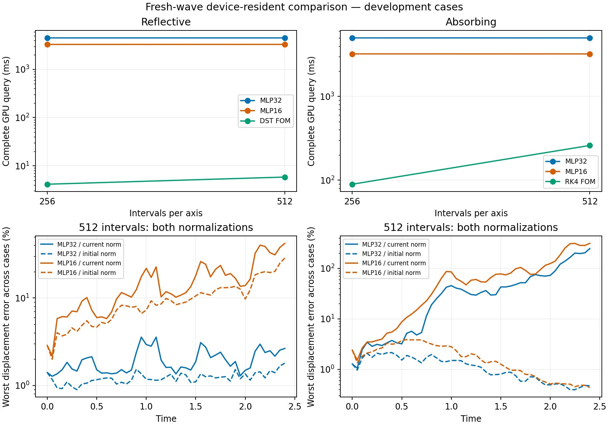

# Fresh reflective and absorbing wave comparison on the GPU

This report measures the fresh, verified wave models under the user-requested device-resident comparison. Numbers are provisional development results from existing validation cases; they do not establish final paper accuracy or a continuum-error guarantee.

At 512 intervals per axis: Reflective: the primary head is 772.398 times slower than its named FOM, with mean/worst current-relative displacement error 1.688% / 3.568%. Absorbing: the primary head is 19.279 times slower than its named FOM, with mean/worst current-relative displacement error 45.663% / 246.553%.

All rows use allocation 3494637 on NVIDIA A100-PCIE-40GB, f64 and highest matrix precision. Source commit: `c729df09cfe02de93ee09e34163578961762bc90`. Only post-reset wave mathematics and checkpoints are used; the discarded earlier wave experiments remain excluded.

The frozen learned spatial bank has rank 64. MLP32 is the preselected primary head and MLP16 is its control, both using optimizer seed 691200. Neither head is retrained for these meshes. Each boundary uses 2 existing development cases, generated from seed 690602, indices [0, 1].

The unit-square wave starts from a Gaussian core with a smooth compact cutoff, with varying position, width, amplitude, propagation speed and initial velocity. Both displacement and velocity fields are supplied to the ROM. The horizon is 2.4, with 49 full outputs. The primary ROM step is 0.0025; 0.00125 is an accuracy-only refinement, excluded from speed selection.

The timer starts with ready full input fields on the GPU and includes full projection, every initial-fit start, speed-dependent operator preparation, evolution, and full GPU displacement/velocity outputs. Mesh-only assembly, compilation and host copies are excluded. Reflective Dirichlet boundaries store interior unknowns with prescribed zero boundary values; absorbing boundaries include boundary unknowns. Intervals per axis therefore differ from stored nodes per axis.

Reduced stiffness and boundary-damping matrices are preassembled; no empirical quadrature fit occurs in these queries. The reduced evolution uses fixed model dimensions, while full-field projection and decoding grow with the mesh.

The replay encloses projection and every initial-fit start in one compiled initializer. A frozen-head GPU smoke check verified numerical parity with the earlier fresh-wave query algorithm. This also changes execution overhead; a difference from earlier host-query timings cannot be attributed only to omitted host transfers. All speed ratios below compare the methods within this allocation.

## Same-grid query costs

The reflective FOM uses an exact propagator for the discrete spatial operator, evaluated by sine transforms. The absorbing FOM uses the verified boundary-damped RK4 solver. These are named same-grid comparisons; there is no coarse-grid FOM selection.

| Boundary | Intervals/axis | Method | Query ms | Initialization / evolution / output ms | FOM / method | Timing outliers |
| --- | --- | --- | --- | --- | --- | --- |
| Reflective | 256 | MLP32 | 4504.968 | 18.638 / 4485.558 / 0.802 | 0.000920046 | 0/6 |
| Reflective | 256 | MLP16 | 3296.770 | 11.382 / 3284.948 / 0.822 | 0.00125722 | 0/6 |
| Reflective | 256 | DST FOM | 4.145 | 0.428 / 3.592 / 0.000 | 1 | 0/6 |
| Reflective | 512 | MLP32 | 4504.802 | 18.883 / 4484.886 / 0.814 | 0.00129467 | 0/6 |
| Reflective | 512 | MLP16 | 3300.307 | 11.018 / 3288.326 / 0.815 | 0.00176718 | 0/6 |
| Reflective | 512 | DST FOM | 5.832 | 0.329 / 5.517 / 0.000 | 1 | 0/6 |
| Absorbing | 256 | MLP32 | 5003.072 | 22.692 / 4979.392 / 0.728 | 0.0178401 | 0/6 |
| Absorbing | 256 | MLP16 | 3222.057 | 10.584 / 3210.820 / 0.711 | 0.0277014 | 0/6 |
| Absorbing | 256 | RK4 FOM | 89.256 | 0.013 / 89.240 / 0.000 | 1 | 0/6 |
| Absorbing | 512 | MLP32 | 4999.115 | 22.833 / 4974.652 / 0.872 | 0.0518708 | 0/6 |
| Absorbing | 512 | MLP16 | 3218.860 | 10.674 / 3207.516 / 0.847 | 0.0805589 | 0/6 |
| Absorbing | 512 | RK4 FOM | 259.308 | 0.014 / 259.294 / 0.000 | 1 | 0/6 |

Times are medians across cases of per-case medians from 3 repetitions. Component medians need not sum exactly to the query median. Timing outliers exceed 1.5 times their own case's repetition median; this diagnostic does not remove any measurement. FOM/method above one means less raw device-query time, independently of accuracy.

At the largest mesh, reduced evolution accounts for the following ratios of median component time to median primary query time: reflective 99.558%, absorbing 99.511%. The frozen RK4 implementation evaluates decoder geometry, QR and SVD at every stage: 3841 evaluations per primary trajectory, including initialization. The timer establishes evolution as the bottleneck. It does not separately identify the contributions of those operations; that requires profiling or a controlled follow-up. Their repeated cost is independent of the full spatial mesh, but it can still exceed a named FOM's cost.

## Accuracy of those timed outputs

Displacement error uses the mass-weighted L2 norm. Current-relative divides by the reference field at that time; initial-normalized divides by its initial displacement norm. The energy-state norm combines displacement-gradient and velocity error. Velocity initial normalization uses the initial energy-state norm so zero initial velocity is defined. Undefined current-relative zero-reference entries remain null in the evidence JSON; vanishing reference fields are flagged rather than hidden.

| Boundary | Intervals | Method | Displacement current mean / median case / worst (%) | Displacement initial worst (%) | Velocity current worst (%) | Energy-state current worst (%) | Completed; stationary initial fits |
| --- | --- | --- | --- | --- | --- | --- | --- |
| Reflective | 256 | MLP32 | 1.688 / 1.688 / 3.569 | 1.794 | 7.819 | 6.212 | 2/2; 2/2 |
| Reflective | 256 | MLP16 | 12.782 / 12.782 / 42.177 | 28.622 | 52.847 | 55.242 | 2/2; 2/2 |
| Reflective | 256 | DST FOM | 0.000 / 0.000 / 0.000 | 0.000 | 0.000 | 0.000 | 2/2; n/a |
| Reflective | 512 | MLP32 | 1.688 / 1.688 / 3.568 | 1.796 | 7.815 | 6.213 | 2/2; 2/2 |
| Reflective | 512 | MLP16 | 12.769 / 12.769 / 42.120 | 28.581 | 52.793 | 55.174 | 2/2; 2/2 |
| Reflective | 512 | DST FOM | 0.000 / 0.000 / 0.000 | 0.000 | 0.000 | 0.000 | 2/2; n/a |
| Absorbing | 256 | MLP32 | 45.658 / 45.658 / 246.539 | 2.140 | 295.848 | 322.436 | 2/2; 2/2 |
| Absorbing | 256 | MLP16 | 64.915 / 64.915 / 312.313 | 3.875 | 323.432 | 410.075 | 2/2; 2/2 |
| Absorbing | 256 | RK4 FOM | 0.000 / 0.000 / 0.001 | 0.000 | 0.040 | 0.037 | 2/2; n/a |
| Absorbing | 512 | MLP32 | 45.663 / 45.663 / 246.553 | 2.139 | 295.720 | 322.745 | 2/2; 2/2 |
| Absorbing | 512 | MLP16 | 64.909 / 64.909 / 312.540 | 3.872 | 323.617 | 410.612 | 2/2; 2/2 |
| Absorbing | 512 | RK4 FOM | 0.000 / 0.000 / 0.000 | 0.000 | 0.000 | 0.000 | 2/2; n/a |

Mean averages valid case-time entries; median case is the median of case time means; worst is the maximum across all cases and output times. A nonstationary initial fit still returns a scored field but does not certify a converged minimizer.

[Download the figure as PDF](2026-09-10-fresh-wave-device-comparison-scaling.pdf). Both figure rows use logarithmic vertical axes.

## Temporal checks and independent audit

The absorbing timing CFL is 0.45. Its scoring reference uses CFL 0.05625, checked against 0.1125 on the same mesh; the declared maximum initial-normalized difference target is 0.0001. The recorded reference checks pass: True. Reflective scoring is exact in time for the discrete spatial operator.

| Boundary | Intervals | Case | Method | Step-halving displacement / velocity / energy difference (%) | Pass |
| --- | --- | --- | --- | --- | --- |
| Reflective | 256 | 0 | MLP32 | 0.00002 / 0.00004 / 0.00006 | True |
| Reflective | 256 | 0 | MLP16 | 0.00004 / 0.00008 / 0.00010 | True |
| Reflective | 256 | 1 | MLP32 | 0.00004 / 0.00009 / 0.00012 | True |
| Reflective | 256 | 1 | MLP16 | 0.00005 / 0.00008 / 0.00010 | True |
| Reflective | 512 | 0 | MLP32 | 0.00002 / 0.00004 / 0.00006 | True |
| Reflective | 512 | 0 | MLP16 | 0.00004 / 0.00008 / 0.00010 | True |
| Reflective | 512 | 1 | MLP32 | 0.00004 / 0.00009 / 0.00012 | True |
| Reflective | 512 | 1 | MLP16 | 0.00005 / 0.00008 / 0.00010 | True |
| Absorbing | 256 | 0 | MLP32 | 0.00000 / 0.00001 / 0.00001 | True |
| Absorbing | 256 | 0 | MLP16 | 0.00000 / 0.00001 / 0.00001 | True |
| Absorbing | 256 | 1 | MLP32 | 0.00001 / 0.00001 / 0.00002 | True |
| Absorbing | 256 | 1 | MLP16 | 0.00001 / 0.00001 / 0.00001 | True |
| Absorbing | 512 | 0 | MLP32 | 0.00000 / 0.00001 / 0.00001 | True |
| Absorbing | 512 | 0 | MLP16 | 0.00000 / 0.00001 / 0.00001 | True |
| Absorbing | 512 | 1 | MLP32 | 0.00001 / 0.00001 / 0.00002 | True |
| Absorbing | 512 | 1 | MLP16 | 0.00001 / 0.00001 / 0.00001 | True |

ROM refinement uses the same physical reference initial scales and target 0.01. Failed refinement rows remain unresolved; their raw timings do not establish a temporally resolved accuracy result. Refined output timings may include compilation and are excluded from comparisons.

Root independently checked 40 full displacement/velocity artifact pairs, 72 timed invocation identities and 3024 metric arrays/scalars with NumPy. The 16 ROM step-halving checks were reconstructed from both saved fields. Later timed repetitions share a full artifact only after both complete output hashes match. Every artifact and staged source hash was checked, including source content against the recorded git commit. All reflective references were also compared against an independent SciPy sine propagator, and the absorbing references' conserved moment was checked from full fields. The recorded absorbing coarse/fine reference difference is retained from the run; root does not claim an independent reconstruction of the unsaved coarser reference.

The maximum recomputed metric absolute departure is 2.220446e-16. This is an audit discrepancy, not a model-error bound. Full fields and original timing arrays are archived in [device04](../worktrees/2026-09-07-mr-wave2d/experiments/multiresolution-wave/runs/device04). The exact remote attempt was checksum-collected and deleted. Existing experiment branches remain separate.

## Glossary

- FOM: the full spatially discretized wave solver. ROM: the reduced model using a learned decoder.
- MLP16 / MLP32: nonlinear decoder heads with the named configuration-space dimensions. The velocity uses the decoder tangent; it is also part of the dynamical state.
- Frozen bank / head: learned spatial functions and nonlinear map whose weights are unchanged for this comparison. Rank is the number of bank functions.
- Reflective / Dirichlet: zero boundary displacement, so outgoing waves reflect. Absorbing: the verified damping boundary operator allows energy to leave.
- DST: discrete sine transform, used to propagate the reflective discrete wave exactly in time. RK4: fourth-order Runge–Kutta stepping. CFL: a step-size factor relative to grid spacing and wave speed.
- QR / SVD: matrix factorizations used to solve the tangent-space equation and check whether the decoder Jacobian is close to losing rank. Decoder geometry includes its value, tangent and directional curvature.
- Device-resident query: ready GPU input through ready full GPU output. Initial fitting finds latent coordinates from the supplied field. Stationary indicates the configured optimization and conditioning checks passed.
- Same-grid: both methods refer to the same spatially discrete equation. Intervals are mesh cells per axis; prescribed reflective boundary values are omitted from stored unknowns.
- Current-relative / initial-normalized: error divided by the current reference norm / the named initial reference scale. Mean, median case and worst use the aggregation described beside the table.
- Energy-state norm: mass-weighted velocity plus stiffness-weighted displacement-gradient norm. Conserved moment: the discrete spatial integral of velocity plus the absorbing boundary contribution.
- Refinement: halve the time step and compare fields. Its pass threshold is a development check, not a proof of total error. Accuracy-only rows cannot be selected for speed claims.
- Development cases: existing validation inputs, not a newly opened independent final-test set. Timing outliers are counted, retained repetitions. Provisional means the limited cohort and declared checks do not certify final paper results.
