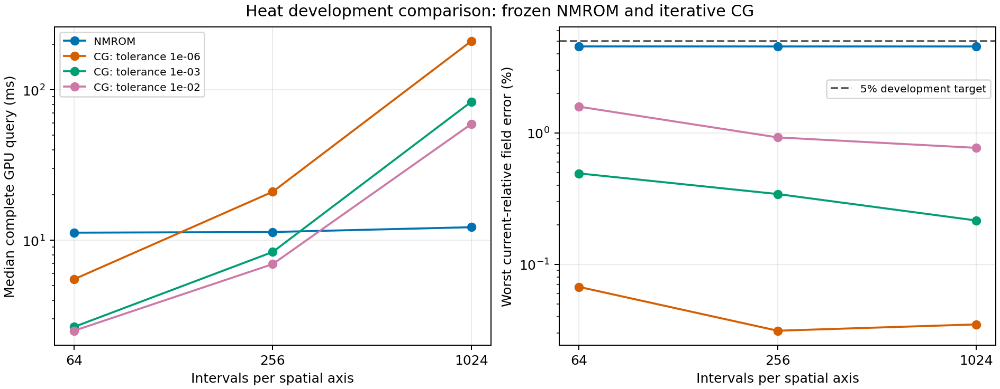

# Heat NMROM versus the iterative CG FOM across resolution

Completed and independently audited development results using the iterative full-order algorithm selected by the user. These numbers remain provisional for paper claims: one frozen training checkpoint and existing development cases are used, with final confirmation cases unopened.

The main comparison uses the same grid, supplied initial field, diffusivity, 20 Crank–Nicolson time steps, and 6 requested full-field outputs. CG uses relative tolerance 1e-06, the historical tolerance, and a cap of 1000 iterations per step. The current Cholesky NMROM and its stopping rule are unchanged.

At 1024 intervals per axis, the Cholesky NMROM takes 12.206228 ms and matched-step CG takes 210.595535 ms: CG/NMROM = 17.253. Their worst current-relative errors are 4.555479% and 0.034909%. Both methods pass the declared 5% development target and solver convergence checks.

Each CG curve keeps its stated tolerance fixed across meshes. The figure uses all retained repetitions for timing medians and the full development cohort for worst errors.

## Main comparison: iterative CG at the historical tolerance

| Intervals/axis | NMROM GPU ms | CG GPU ms | CG/NMROM time ratio | NMROM worst error (%) | CG worst error (%) | NMROM faster cases | GPU outliers, ROM / CG |
| ---: | ---: | ---: | ---: | ---: | ---: | ---: | ---: |
| 64 | 11.226765 | 5.505838 | 0.490 | 4.559260 | 0.067379 | 0 / 12 | 0 / 0 |
| 256 | 11.341400 | 20.997202 | 1.851 | 4.555681 | 0.031261 | 12 / 12 | 0 / 0 |
| 1024 | 12.206228 | 210.595535 | 17.253 | 4.555479 | 0.034909 | 12 / 12 | 0 / 0 |

All 12 cases and 3 repetitions per case are retained. Ratios in the table divide cohort median times; faster-case counts compare within-case medians. GPU timing starts after the supplied initial field is on the device and ends when all requested device outputs and diagnostics are ready. Initialization is included for the ROM. Separate measured host times below include full input/output transfers from the same invocation.

## Accuracy and CG tolerance

The historical tolerance can ask the full solver for substantially more accuracy than the ROM supplies. The following predeclared looser tolerances show that effect. All outcomes, including any physical-target failures, remain in the table. Each linear solve records its actual true residual and iteration count.

| Intervals/axis | CG relative tolerance | CG GPU ms | CG worst error (%) | Physical target and convergence pass | CG/NMROM GPU ratio |
| ---: | ---: | ---: | ---: | --- | ---: |
| 64 | 1e-06 | 5.505838 | 0.067379 | yes | 0.490 |
| 64 | 0.001 | 2.654990 | 0.492451 | yes | 0.236 |
| 64 | 0.01 | 2.503836 | 1.586031 | yes | 0.223 |
| 256 | 1e-06 | 20.997202 | 0.031261 | yes | 1.851 |
| 256 | 0.001 | 8.354508 | 0.342970 | yes | 0.737 |
| 256 | 0.01 | 6.938945 | 0.925464 | yes | 0.612 |
| 1024 | 1e-06 | 210.595535 | 0.034909 | yes | 17.253 |
| 1024 | 0.001 | 83.226939 | 0.215775 | yes | 6.818 |
| 1024 | 0.01 | 59.177982 | 0.770685 | yes | 4.848 |

A time ratio does not establish an acceptable speedup when a method fails the physical target or its stopping rule. The fastest passing tolerance below is selected from these tested development settings; it is not an independent final-cohort result or a global classical-solver optimum.

| Intervals/axis | Fastest passing tested CN-CG tolerance | CG GPU ms | CG/NMROM GPU ratio | CG/NMROM host ratio |
| ---: | ---: | ---: | ---: | ---: |
| 64 | 0.01 | 2.503836 | 0.223 | 0.257 |
| 256 | 0.01 | 6.938945 | 0.612 | 0.655 |
| 1024 | 0.01 | 59.177982 | 4.848 | 2.267 |

## Historical stepping control

The primary pair matches the current ROM time discretization. This separate CG control retains the historical backward-Euler step count, applied to the current heat problem and output times. It is not a replay of the historical geometry, training checkpoint or input family.

| Intervals/axis | BE steps | CG relative tolerance | GPU ms | Worst error (%) | CG/NMROM GPU ratio |
| ---: | ---: | ---: | ---: | ---: | ---: |
| 64 | 50 | 1e-06 | 10.573869 | 0.653825 | 0.942 |
| 256 | 50 | 1e-06 | 33.156005 | 0.572184 | 2.923 |
| 1024 | 50 | 1e-06 | 306.818958 | 0.567120 | 25.136 |

## Complete accounting and diagnostic controls

The direct-transform FOM remains a separately labeled diagnostic; the user-selected primary comparator is iterative CG. The free-coefficient bank diagnostic is a linear model with more freely evolving coefficients than the nonlinear latent model.

| Intervals/axis | Method | Median GPU ms | Median host ms | Worst error (%) | GPU / host outliers |
| ---: | --- | ---: | ---: | ---: | ---: |
| 64 | Original NMROM | 12.649237 | 13.384897 | 4.559260 | 1 / 0 |
| 64 | Cholesky NMROM | 11.226765 | 11.685870 | 4.559260 | 0 / 0 |
| 64 | CG, matched CN, historical tolerance | 5.505838 | 6.023616 | 0.067379 | 0 / 0 |
| 64 | CG, matched CN, moderately loose tolerance | 2.654990 | 3.165223 | 0.492451 | 0 / 0 |
| 64 | CG, matched CN, loosest tolerance | 2.503836 | 2.997431 | 1.586031 | 0 / 0 |
| 64 | CG, historical backward-Euler step count | 10.573869 | 11.072052 | 0.653825 | 0 / 0 |
| 64 | Free-coefficient linear bank diagnostic | 0.108310 | 0.502935 | 1.675754 | 1 / 1 |
| 64 | Direct-transform FOM diagnostic | 0.177714 | 0.543778 | 0.089749 | 12 / 12 |
| 256 | Original NMROM | 12.164992 | 13.915151 | 4.555681 | 0 / 0 |
| 256 | Cholesky NMROM | 11.341400 | 12.748594 | 4.555681 | 0 / 0 |
| 256 | CG, matched CN, historical tolerance | 20.997202 | 22.424818 | 0.031261 | 0 / 0 |
| 256 | CG, matched CN, moderately loose tolerance | 8.354508 | 9.793594 | 0.342970 | 0 / 0 |
| 256 | CG, matched CN, loosest tolerance | 6.938945 | 8.353524 | 0.925464 | 0 / 0 |
| 256 | CG, historical backward-Euler step count | 33.156005 | 34.702905 | 0.572184 | 0 / 0 |
| 256 | Free-coefficient linear bank diagnostic | 0.138152 | 1.401236 | 1.675830 | 2 / 0 |
| 256 | Direct-transform FOM diagnostic | 0.262025 | 1.437297 | 0.005602 | 9 / 9 |
| 1024 | Original NMROM | 13.179174 | 37.012103 | 4.555479 | 0 / 0 |
| 1024 | Cholesky NMROM | 12.206228 | 36.841067 | 4.555479 | 0 / 0 |
| 1024 | CG, matched CN, historical tolerance | 210.595535 | 235.202592 | 0.034909 | 0 / 0 |
| 1024 | CG, matched CN, moderately loose tolerance | 83.226939 | 107.815144 | 0.215775 | 0 / 0 |
| 1024 | CG, matched CN, loosest tolerance | 59.177982 | 83.501660 | 0.770685 | 0 / 0 |
| 1024 | CG, historical backward-Euler step count | 306.818958 | 331.497878 | 0.567120 | 0 / 0 |
| 1024 | Free-coefficient linear bank diagnostic | 0.838064 | 25.340797 | 1.675830 | 0 / 0 |
| 1024 | Direct-transform FOM diagnostic | 1.235903 | 25.920845 | 0.000350 | 0 / 0 |

## Solver and reference checks

| Intervals/axis | CG method | Total timed CG iterations | Nonconverged steps | Largest true relative residual | Worst error versus exact matching time discretization (%) |
| ---: | --- | ---: | ---: | ---: | ---: |
| 64 | CG, matched CN, historical tolerance | 5115 | 0 | 9.8955598385e-07 | 0.000377410 |
| 64 | CG, matched CN, moderately loose tolerance | 1767 | 0 | 0.000994043356046 | 0.482085916 |
| 64 | CG, matched CN, loosest tolerance | 1545 | 0 | 0.00999072013037 | 1.551490488 |
| 64 | CG, historical backward-Euler step count | 9690 | 0 | 9.98826391065e-07 | 0.000611505 |
| 256 | CG, matched CN, historical tolerance | 23319 | 0 | 9.99157743012e-07 | 0.000244418 |
| 256 | CG, matched CN, moderately loose tolerance | 8571 | 0 | 0.000999189996408 | 0.339111237 |
| 256 | CG, matched CN, loosest tolerance | 6819 | 0 | 0.009975349908 | 0.926515550 |
| 256 | CG, historical backward-Euler step count | 36738 | 0 | 9.99610843313e-07 | 0.000447390 |
| 1024 | CG, matched CN, historical tolerance | 103782 | 0 | 9.99561541178e-07 | 0.000131496 |
| 1024 | CG, matched CN, moderately loose tolerance | 41220 | 0 | 0.000999743095863 | 0.209518329 |
| 1024 | CG, matched CN, loosest tolerance | 28281 | 0 | 0.00999814279794 | 0.771634417 |
| 1024 | CG, historical backward-Euler step count | 151011 | 0 | 9.9958441887e-07 | 0.000287540 |

Independent NumPy/SciPy checks cover 864 timed invocations, 372 distinct full arrays and 62640 metric entries, with maximum metric difference 5.26245713672e-14. Every CG field is compared with independent SciPy sine-transform propagation of its exact finite-difference time-step formula. Internal full-grid CG states are not archived, so per-step true-residual diagnostics are checked from their recorded values and source, not independently reconstructed for every step.

The CG fixture agrees with independent dense solves within 1.67701636802e-12 and with installed JAX CG within 0. The local smoke took 23.453828 seconds; its timings are excluded from benchmark evidence.

The nonlinear trajectories retain the frozen decoder: sampled reconstruction mismatch is at most 4.68648919795e-16. Independent nonlinear residual/gradient checks cover 4320 time steps and 432 initial fits. Cholesky field and latent parity passes, and iteration/acceptance/termination counters agree. The original control reproduces earlier archived fields within 3.73953208511e-15.

Maximum continuum-spectral reference refinement is 1.62810884586e-12; this is empirical agreement, not a rigorous continuum bound. The target test adds this allowance to each method's worst physical error. Worst error always includes all cases, requested times and retained repetitions, normalized by the reference norm at that time.

## Scope and reproducibility

CG solves $[I+\theta\Delta t\nu L]u_{j+1}=[I-(1-\theta)\Delta t\nu L]u_j$ on the full requested grid, starting from the previous state. Here $L$ is the positive finite-difference Dirichlet Laplacian, $\nu$ is diffusivity, and $\theta$ selects the time discretization. Both iterations and rollout are compiled. The explicit final residual verification for each linear solve is included in its timing.

The NMROM retains 8 latent variables, 32 spatial-bank functions and 64 weak test modes. No retraining or nonlinear tolerance change was made. This is a same-grid iterative-solver comparison on the current fixed-diffusivity single-bump family; it does not establish a speedup over every full-order algorithm, a global cost-to-accuracy optimum, or performance on other PDEs. The older [direct-transform comparison](2026-09-10-heat-cp-algebra-comparison.md) remains valid for its own baseline.

Job `3529772`, `NVIDIA A100-PCIE-40GB` on `pax003`, scientific source `7e6d2e39aafdf90afc53fad03af8eca6799574bc`. GPU preflight, float64/highest precision, seed regeneration, source/checkpoint hashes, private job directory and complete logs were checked. GPU burn-in precedes timed blocks. Compilation and offline mesh assembly are excluded from every online time and retained separately. Outlier rule: Above 1.5 times the median of the same case/method/mesh repetition group; none excluded.

The archive passed checksum collection and its exact completed remote directory was removed. No historical archive, other session job or merge was changed.

[Native results](../worktrees/2026-09-07-mr-heat2d/experiments/mr-heat2d/runs/iterative_cg09/archive/outputs/results.json) · [Independent audit](../worktrees/2026-09-07-mr-heat2d/experiments/mr-heat2d/runs/iterative_cg09/analysis/audit.json) · [Configuration](../worktrees/2026-09-07-mr-heat2d/experiments/mr-heat2d/runs/iterative_cg09/archive/experiments/mr-heat2d/config-iterative-cg.json) · [Archive manifest](../worktrees/2026-09-07-mr-heat2d/experiments/mr-heat2d/runs/iterative_cg09/ARCHIVE.json)

## Glossary

- **Intervals/axis:** spatial cells along each direction; saved arrays contain interior nodes.
- **NMROM / FOM:** nonlinear-manifold reduced model / full-grid numerical solver.
- **CG / Cholesky:** conjugate-gradient iterative full-grid solve / factorization used for the small nonlinear update system.
- **CN / BE:** Crank–Nicolson / backward Euler, the two stated implicit time discretizations.
- **Relative tolerance / true residual:** stopping threshold relative to the linear-system right-hand side / equation discrepancy recomputed from the actual returned state.
- **Median GPU / host ms:** middle retained blocked device-query time / same invocation including full CPU–GPU input/output transfers, in milliseconds.
- **CG/NMROM ratio:** CG time divided by NMROM time; greater than unity means the NMROM is faster under that timing contract.
- **Worst error:** largest full-field discrepancy divided by the current reference norm across all cases, requested times and repetitions.
- **Faster cases / outliers:** cases whose paired median favors NMROM / repetitions above the stated within-case threshold, all retained.
- **Physical target / development selection:** declared field-error threshold / choice made using the current tested cases, not separate confirmation data.
- **Nonconverged steps / total CG iterations:** linear solves missing their stopping rule / sum of iterations over every timed repetition.
- **Exact matching time discretization:** independent solution of the same grid and time-step formula with linear-solve error removed; it still has discretization error.
- **Bank / latent / weak modes:** learned spatial functions / compressed nonlinear coordinates / smooth tests used for the reduced equation.
- **Direct transform / free-coefficient bank:** full-grid propagation in sine modes / linear reduced model with freely evolving bank coefficients.
- **Parity / checkpoint / refinement:** agreement between implementations / frozen trained parameters / comparison between reference resolutions.
- **Invocation / source hash / checksum collection:** one solve producing both the timing and graded fields / proof of exact code content / verification that collected files match their remote originals.
