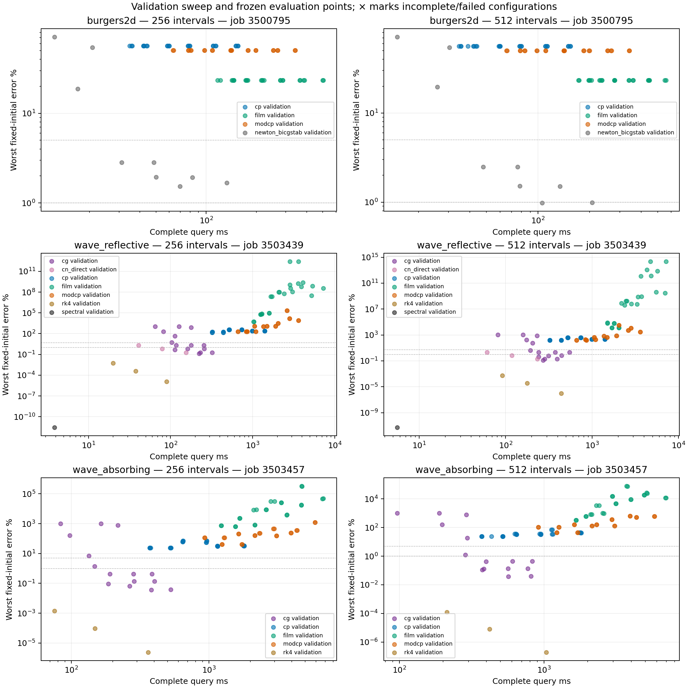
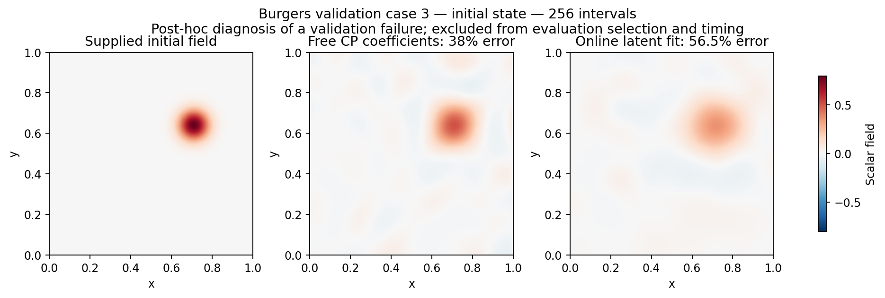

# Modified CP with empirical quadrature: Burgers and waves

This report compares the original CP decoder, latent-modulated CP factors, and a FiLM coordinate decoder. Provisional: one or more owner campaigns is incomplete.

Final architectural conclusions await the remaining frozen evaluation panels.

## Frozen validation settings

| Case | Intervals/axis | Method | Selection role | Configuration | Median case error | Worst error | Median query ms | Failed cases | Nonstationary cases |
| --- | --- | --- | --- | --- | --- | --- | --- | --- | --- |
| burgers2d | 256 | cp | best-error diagnostic | cp_cap10_dt0.005_q4_tol0.0001 | 11.3794% | 56.4571% | 42.2665 | 0 | 0 |
| burgers2d | 256 | modcp | best-error diagnostic | modcp_cap30_dt0.005_q4_tol0.0001 | 7.08915% | 50.3952% | 63.2725 | 0 | 0 |
| burgers2d | 256 | film | best-error diagnostic | film_cap10_dt0.005_q4_tol0.0001 | 4.42208% | 23.2942% | 116.999 | 0 | 0 |
| burgers2d | 256 | newton_bicgstab | 5% target | newton_bicgstab_dt0.005_ltol0.1_ntol0.0001 | 1.11828% | 2.82875% | 31.1702 | 0 | — |
| burgers2d | 512 | cp | best-error diagnostic | cp_cap10_dt0.005_q4_tol0.0001 | 11.4134% | 56.4477% | 38.9502 | 0 | 0 |
| burgers2d | 512 | modcp | best-error diagnostic | modcp_cap30_dt0.005_q4_tol0.0001 | 7.29469% | 50.3541% | 65.4887 | 0 | 2 |
| burgers2d | 512 | film | best-error diagnostic | film_cap10_dt0.005_q4_tol0.0001 | 5.31831% | 23.2758% | 171.912 | 0 | 0 |
| burgers2d | 512 | newton_bicgstab | 1% target | newton_bicgstab_dt0.00125_ltol0.1_ntol0.0001 | 0.236118% | 0.979637% | 105.46 | 0 | — |
| burgers2d | 512 | newton_bicgstab | 5% target | newton_bicgstab_dt0.005_ltol0.1_ntol0.0001 | 1.01474% | 2.4852% | 47.8512 | 0 | — |
| wave_reflective | 256 | cg | 1% target | cg_tol1e-06_dt0.0025 | 0.345611% | 0.492034% | 112.823 | 0 | — |
| wave_reflective | 256 | cg | 5% target | cg_tol1e-06_dt0.005 | 1.4076% | 1.99855% | 116.755 | 0 | — |
| wave_reflective | 256 | cg | best-error diagnostic | cg_tol1e-06_dt0.00125 | 0.0895051% | 0.130182% | 223.661 | 0 | — |
| wave_reflective | 256 | cn_direct | 1% target | cn_direct_dt0.0025 | 0.427052% | 0.642471% | 79.0639 | 0 | — |
| wave_reflective | 256 | cn_direct | 5% target | cn_direct_dt0.005 | 1.53236% | 2.07292% | 40.904 | 0 | — |
| wave_reflective | 256 | cn_direct | best-error diagnostic | cn_direct_dt0.00125 | 0.114382% | 0.189008% | 154.843 | 0 | — |
| wave_reflective | 256 | cp | best-error diagnostic | cp_eq8_cap10_tol1e-06_dt0.005 | 54.548% | 149.353% | 438.878 | 0 | 0 |
| wave_reflective | 256 | film | best-error diagnostic | film_eq4_cap10_tol0.0001_dt0.005 | 264.517% | 5492.6% | 1030.56 | 0 | 3 |
| wave_reflective | 256 | modcp | best-error diagnostic | modcp_eq4_cap10_tol0.0001_dt0.005 | 51.2244% | 203.214% | 661.841 | 0 | 0 |
| wave_reflective | 256 | rk4 | 1% target | rk4_cfl0.6 | 0.00173957% | 0.00548189% | 19.9187 | 0 | — |
| wave_reflective | 256 | rk4 | 5% target | rk4_cfl0.6 | 0.00173957% | 0.00548189% | 19.9187 | 0 | — |
| wave_reflective | 256 | rk4 | best-error diagnostic | rk4_cfl0.12 | 3.31264e-06% | 1.13588e-05% | 89.5232 | 0 | — |
| wave_reflective | 256 | spectral | 1% target | spectral_exact_semidiscrete | 2.42878e-12% | 2.69494e-12% | 3.85803 | 0 | — |
| wave_reflective | 256 | spectral | 5% target | spectral_exact_semidiscrete | 2.42878e-12% | 2.69494e-12% | 3.85803 | 0 | — |
| wave_reflective | 256 | spectral | best-error diagnostic | spectral_exact_semidiscrete | 2.42878e-12% | 2.69494e-12% | 3.85803 | 0 | — |
| wave_reflective | 512 | cg | 1% target | cg_tol1e-06_dt0.0025 | 0.324275% | 0.451669% | 240.913 | 0 | — |
| wave_reflective | 512 | cg | 5% target | cg_tol0.0001_dt0.005 | 2.70656% | 4.07971% | 192.402 | 0 | — |
| wave_reflective | 512 | cg | best-error diagnostic | cg_tol1e-06_dt0.00125 | 0.0900604% | 0.131966% | 271.418 | 0 | — |
| wave_reflective | 512 | cn_direct | 1% target | cn_direct_dt0.0025 | 0.428908% | 0.646223% | 118.114 | 0 | — |
| wave_reflective | 512 | cn_direct | 5% target | cn_direct_dt0.005 | 1.53511% | 2.07655% | 60.9755 | 0 | — |
| wave_reflective | 512 | cn_direct | best-error diagnostic | cn_direct_dt0.00125 | 0.115201% | 0.191794% | 232.618 | 0 | — |
| wave_reflective | 512 | cp | best-error diagnostic | cp_eq4_cap30_tol1e-06_dt0.005 | 55.1062% | 149.972% | 440.087 | 0 | 0 |
| wave_reflective | 512 | film | best-error diagnostic | film_eq8_cap10_tol1e-06_dt0.005 | 163.707% | 13224.1% | 2043.84 | 0 | 4 |
| wave_reflective | 512 | modcp | best-error diagnostic | modcp_eq4_cap30_tol1e-06_dt0.005 | 50.4701% | 156.559% | 859.745 | 0 | 0 |
| wave_reflective | 512 | rk4 | 1% target | rk4_cfl0.6 | 0.000155215% | 0.000529328% | 91.2215 | 0 | — |
| wave_reflective | 512 | rk4 | 5% target | rk4_cfl0.6 | 0.000155215% | 0.000529328% | 91.2215 | 0 | — |
| wave_reflective | 512 | rk4 | best-error diagnostic | rk4_cfl0.12 | 2.71717e-07% | 9.51927e-07% | 437.66 | 0 | — |
| wave_reflective | 512 | spectral | 1% target | spectral_exact_semidiscrete | 4.63612e-12% | 5.04003e-12% | 5.56623 | 0 | — |
| wave_reflective | 512 | spectral | 5% target | spectral_exact_semidiscrete | 4.63612e-12% | 5.04003e-12% | 5.56623 | 0 | — |
| wave_reflective | 512 | spectral | best-error diagnostic | spectral_exact_semidiscrete | 4.63612e-12% | 5.04003e-12% | 5.56623 | 0 | — |
| wave_absorbing | 256 | cg | 1% target | cg_tol1e-06_dt0.005 | 0.278138% | 0.418369% | 190.416 | 0 | — |
| wave_absorbing | 256 | cg | 5% target | cg_tol0.0001_dt0.005 | 0.87584% | 1.38656% | 147.748 | 0 | — |
| wave_absorbing | 256 | cg | best-error diagnostic | cg_tol1e-08_dt0.00125 | 0.0174146% | 0.036865% | 381.612 | 0 | — |
| wave_absorbing | 256 | cp | best-error diagnostic | cp_eq8_cap30_tol0.0001_dt0.005 | 15.5855% | 23.8452% | 370.722 | 0 | 1 |
| wave_absorbing | 256 | film | best-error diagnostic | film_eq8_cap10_tol0.0001_dt0.005 | 123.292% | 639.774% | 1560.59 | 0 | 2 |
| wave_absorbing | 256 | modcp | best-error diagnostic | modcp_eq8_cap10_tol1e-06_dt0.005 | 11.5137% | 41.2187% | 1730.78 | 0 | 0 |
| wave_absorbing | 256 | rk4 | 1% target | rk4_cfl0.6 | 0.000468192% | 0.00139524% | 75.3403 | 0 | — |
| wave_absorbing | 256 | rk4 | 5% target | rk4_cfl0.6 | 0.000468192% | 0.00139524% | 75.3403 | 0 | — |
| wave_absorbing | 256 | rk4 | best-error diagnostic | rk4_cfl0.12 | 7.29609e-07% | 2.41785e-06% | 361.045 | 0 | — |
| wave_absorbing | 512 | cg | 1% target | cg_tol1e-06_dt0.00125 | 0.10126% | 0.131512% | 383.901 | 0 | — |
| wave_absorbing | 512 | cg | 5% target | cg_tol0.0001_dt0.005 | 0.918639% | 1.20216% | 285.021 | 0 | — |
| wave_absorbing | 512 | cg | best-error diagnostic | cg_tol1e-08_dt0.00125 | 0.0179195% | 0.0382139% | 566.177 | 0 | — |
| wave_absorbing | 512 | cp | best-error diagnostic | cp_eq8_cap30_tol0.0001_dt0.005 | 15.625% | 23.7572% | 372.586 | 0 | 1 |
| wave_absorbing | 512 | film | best-error diagnostic | film_eq4_cap10_tol0.0001_dt0.005 | 90.0567% | 328.668% | 1666.06 | 0 | 2 |
| wave_absorbing | 512 | modcp | best-error diagnostic | modcp_eq8_cap10_tol1e-06_dt0.005 | 11.5008% | 44.4693% | 1706.86 | 0 | 0 |
| wave_absorbing | 512 | rk4 | 1% target | rk4_cfl0.6 | 3.8372e-05% | 0.000119694% | 212.96 | 0 | — |
| wave_absorbing | 512 | rk4 | 5% target | rk4_cfl0.6 | 3.8372e-05% | 0.000119694% | 212.96 | 0 | — |
| wave_absorbing | 512 | rk4 | best-error diagnostic | rk4_cfl0.12 | 5.72626e-08% | 1.92226e-07% | 1037.08 | 0 | — |

These are the frozen settings carried forward from validation. Best-error diagnostics did not necessarily meet either accuracy target. Errors and times above use the complete validation cohort, with one paired measured invocation per case and setting; timing-based selection used the separately retained seven repetitions of the predetermined proxy case. Evaluation repeats every frozen setting on every untouched case. Rows for different targets may reuse one configuration. These validation times are not combined with evaluation times from another allocation.

## Evaluation of validation-selected configurations

Queries start with full GPU-resident initial fields and return full GPU-resident output trajectories. Timing includes initialization, evolution, and reconstruction. Compilation, offline setup, and host transfers are excluded.

| Case | Intervals/axis | Method | Target | Configuration | Median query ms | Median case error | Worst error | Outlier cases | Failed cases | Nonstationary cases | Timing outliers | Target attained vs numerical reference | Reference interpretation |
| --- | --- | --- | --- | --- | --- | --- | --- | --- | --- | --- | --- | --- | --- |
| burgers2d | 256 | cp | 1% | No validation-qualified setting | — | — | — | — | — | — | — | no | provisional continuum (16/16 flagged) |
| burgers2d | 256 | cp | 5% | No validation-qualified setting | — | — | — | — | — | — | — | no | provisional continuum (7/16 flagged) |
| burgers2d | 256 | modcp | 1% | No validation-qualified setting | — | — | — | — | — | — | — | no | provisional continuum (16/16 flagged) |
| burgers2d | 256 | modcp | 5% | No validation-qualified setting | — | — | — | — | — | — | — | no | provisional continuum (7/16 flagged) |
| burgers2d | 256 | film | 1% | No validation-qualified setting | — | — | — | — | — | — | — | no | provisional continuum (16/16 flagged) |
| burgers2d | 256 | film | 5% | No validation-qualified setting | — | — | — | — | — | — | — | no | provisional continuum (7/16 flagged) |
| burgers2d | 256 | newton_bicgstab | 1% | No validation-qualified setting | — | — | — | — | — | — | — | no | provisional continuum (16/16 flagged) |
| burgers2d | 512 | cp | 1% | No validation-qualified setting | — | — | — | — | — | — | — | no | provisional continuum (16/16 flagged) |
| burgers2d | 512 | cp | 5% | No validation-qualified setting | — | — | — | — | — | — | — | no | provisional continuum (5/16 flagged) |
| burgers2d | 512 | modcp | 1% | No validation-qualified setting | — | — | — | — | — | — | — | no | provisional continuum (16/16 flagged) |
| burgers2d | 512 | modcp | 5% | No validation-qualified setting | — | — | — | — | — | — | — | no | provisional continuum (5/16 flagged) |
| burgers2d | 512 | film | 1% | No validation-qualified setting | — | — | — | — | — | — | — | no | provisional continuum (16/16 flagged) |
| burgers2d | 512 | film | 5% | No validation-qualified setting | — | — | — | — | — | — | — | no | provisional continuum (5/16 flagged) |
| wave_reflective | 256 | cp | 1% | No validation-qualified setting | — | — | — | — | — | — | — | no | semidiscrete only |
| wave_reflective | 256 | cp | 5% | No validation-qualified setting | — | — | — | — | — | — | — | no | semidiscrete only |
| wave_reflective | 256 | film | 1% | No validation-qualified setting | — | — | — | — | — | — | — | no | semidiscrete only |
| wave_reflective | 256 | film | 5% | No validation-qualified setting | — | — | — | — | — | — | — | no | semidiscrete only |
| wave_reflective | 256 | modcp | 1% | No validation-qualified setting | — | — | — | — | — | — | — | no | semidiscrete only |
| wave_reflective | 256 | modcp | 5% | No validation-qualified setting | — | — | — | — | — | — | — | no | semidiscrete only |
| wave_reflective | 512 | cp | 1% | No validation-qualified setting | — | — | — | — | — | — | — | no | semidiscrete only |
| wave_reflective | 512 | cp | 5% | No validation-qualified setting | — | — | — | — | — | — | — | no | semidiscrete only |
| wave_reflective | 512 | film | 1% | No validation-qualified setting | — | — | — | — | — | — | — | no | semidiscrete only |
| wave_reflective | 512 | film | 5% | No validation-qualified setting | — | — | — | — | — | — | — | no | semidiscrete only |
| wave_reflective | 512 | modcp | 1% | No validation-qualified setting | — | — | — | — | — | — | — | no | semidiscrete only |
| wave_reflective | 512 | modcp | 5% | No validation-qualified setting | — | — | — | — | — | — | — | no | semidiscrete only |
| wave_absorbing | 256 | cp | 1% | No validation-qualified setting | — | — | — | — | — | — | — | no | semidiscrete only |
| wave_absorbing | 256 | cp | 5% | No validation-qualified setting | — | — | — | — | — | — | — | no | semidiscrete only |
| wave_absorbing | 256 | film | 1% | No validation-qualified setting | — | — | — | — | — | — | — | no | semidiscrete only |
| wave_absorbing | 256 | film | 5% | No validation-qualified setting | — | — | — | — | — | — | — | no | semidiscrete only |
| wave_absorbing | 256 | modcp | 1% | No validation-qualified setting | — | — | — | — | — | — | — | no | semidiscrete only |
| wave_absorbing | 256 | modcp | 5% | No validation-qualified setting | — | — | — | — | — | — | — | no | semidiscrete only |
| wave_absorbing | 512 | cp | 1% | No validation-qualified setting | — | — | — | — | — | — | — | no | semidiscrete only |
| wave_absorbing | 512 | cp | 5% | No validation-qualified setting | — | — | — | — | — | — | — | no | semidiscrete only |
| wave_absorbing | 512 | film | 1% | No validation-qualified setting | — | — | — | — | — | — | — | no | semidiscrete only |
| wave_absorbing | 512 | film | 5% | No validation-qualified setting | — | — | — | — | — | — | — | no | semidiscrete only |
| wave_absorbing | 512 | modcp | 1% | No validation-qualified setting | — | — | — | — | — | — | — | no | semidiscrete only |
| wave_absorbing | 512 | modcp | 5% | No validation-qualified setting | — | — | — | — | — | — | — | no | semidiscrete only |

Worst error is the maximum over evaluation cases, stored times, and recorded repetitions; for waves it is also the maximum over displacement, velocity, and energy-state errors. All expected cases and repetitions must be present for a target to qualify. Failure counts retain numerical breakdowns and incomplete trajectories. Diagnostic settings still count physical outliers against the largest declared target, even though those settings cannot establish a target-qualified speedup. Iteration-capped or small-step exits may attain a physical accuracy target, but are separately counted as nonstationary and never described as converged PDE solves. Stationarity concerns the weak least-squares objective; physical accuracy and full-residual diagnostics are assessed separately.

These errors compare against the declared numerical reference. Any unresolved reference uncertainty keeps the corresponding continuum-accuracy interpretation provisional. Reference flags use the evaluation cohort for evaluated settings and the validation cohort for settings that never qualified for evaluation. They do not change the frozen numerical-reference qualification or configuration selection. No configuration is chosen using evaluation accuracy or timing.

Configurations with nonfinite errors have no finite position on the logarithmic axes; their failures remain in the summary tables and raw records.

## Initial fitting and subsequent evolution

Independent evaluation field decompositions are not available yet.

Each column takes its own maximum over the complete evaluation cohort and physical components, so the maximizing case may differ between columns. Every time uses the same initial-reference normalization. These are measured field discrepancies; local snapshot-fitting diagnostics do not establish a mathematical best-approximation floor.

These independently reconstructed diagnostics distinguish energy discrepancies from the energy norm of state error. Energy drift measures change from the prediction's own initial energy; energy discrepancy includes its initial mismatch. The absorbing signed invariant is $I(u,v)=\int_\Omega v\,dx+c\int_{\partial\Omega}u\,ds$, using the discrete area and edge weights with both corner contributions. Invariant error and drift are absolute quantities, not percentages. The table takes the largest absolute defect across the complete cohort, stored times, and repetitions. Close energies alone do not prove that the remaining state discrepancy is a phase error; no boundary-flux accuracy claim is inferred from coarse observation times.

## Matched-accuracy full-solver comparisons

No paired evaluation configurations currently qualify at a common declared target.

Each ratio uses the same owner job and GPU and two validation-selected configurations that both attain the target on the untouched cohort. A ratio above unity means a smaller median ROM query time. Numerical completion and latent convergence remain separate.

## Trained models and online work

| Case | Decoder | Training intervals/axis | Latent dimension | CP rank | Decoder parameters | Completed training updates |
| --- | --- | --- | --- | --- | --- | --- |
| burgers2d | cp | 256 | 16 | 64 | 120577 | 16000 |
| burgers2d | modcp | 256 | 16 | 64 | 135553 | 16000 |
| burgers2d | film | 256 | 16 | — | 30386 | 16000 |
| wave_reflective | cp | 256 | 32 | 64 | 177154 | 16000 |
| wave_reflective | modcp | 256 | 32 | 64 | 204546 | 16000 |
| wave_reflective | film | 256 | 32 | — | 40388 | 16000 |
| wave_absorbing | cp | 256 | 32 | 64 | 177154 | 16000 |
| wave_absorbing | modcp | 256 | 32 | 64 | 204546 | 16000 |
| wave_absorbing | film | 256 | 32 | — | 40388 | 16000 |

Each PDE/boundary has separately trained weights, frozen for both evaluation meshes. Training jointly optimizes decoder weights and a latent code for each training snapshot; this pilot does not reproduce the older ViT encoder training pipeline. CP and modified CP share the same initial CP training stage. FiLM uses the full update budget from its own initialization. Training update budgets match; parameter counts and training costs differ. This pilot compares the declared architectures without a parameter-matched or exhaustive tuning claim.

For each output component, the CP family represents

$$\widetilde u(z;x,y)=m(x,y)\left[\beta+\sum_{r=1}^{R}c_r(z)a_r(x;z)b_r(y;z)\right].$$

Here $z$ is the solved latent state, $R$ is the CP rank, $c_r$ is the nonlinear coefficient head with a linear skip, and $m$ enforces the boundary. Original CP uses factors independent of $z$. Modified CP adds a latent-conditioned nonlinear correction to each one-dimensional factor; its zero correction exactly recovers the shared CP initialization. FiLM instead conditions a two-dimensional coordinate network on the latent state and includes its own linear latent skip. Coordinate-only features are cached offline for all three decoders. Dirichlet mesh transfer uses a boundary strip that preserves training-node values and avoids interpolating untrained masked endpoint parameters into new interior nodes.

Each reduced implicit step minimizes the scaled weak discrete residual,

$$z_{n+1}\approx\operatorname*{arg\,min}_z\frac12\left\|W_{\mathrm{EQ}}\,\mathcal R_n(\widetilde u(z);\widetilde u(z_n),\mu)\right\|_2^2.$$

$\mathcal R_n$ is the fully discrete PDE residual, $\mu$ contains physical parameters, and $W_{\mathrm{EQ}}$ applies the smooth test functions, fitted quadrature, and fixed scaling. The weak residual and its latent Jacobian use JAX automatic differentiation; damped Gauss–Newton solves small dense systems and warm-starts each time step from the preceding latent state. The initial latent fit uses the supplied field at sampled locations and stored starting codes. The full-solver CG comparison belongs to the SPD wave discretization; nonlinear Burgers uses Newton–BiCGStab.

CP precontracts its fixed spatial factors with the selected EQ weights for weak linear terms. The quadrature approximation is preserved. Burgers still evaluates the nonlinear upwind term on its sampled stencil. Modified CP and FiLM retain state-dependent spatial evaluation. On waves, CP's contracted evolution dimensions stay fixed when EQ count changes; EQ count still affects approximation and sampled initialization. Solver iteration limits, tolerance, and time step continue to change work. Full-field output cost grows with the requested mesh for every decoder. This implementation uses EQ-fitted operators, and does not establish an exact quadrature-free operator claim.

Burgers validation preceded the equivalent CP mass contraction and GPU scalar preloading. Its final evaluation keeps those validation-selected settings and uses the optimized runner, whose numerical parity was checked separately. The final timing ratios come entirely from that evaluation allocation. The older validation timings do not establish the fastest configuration for the optimized implementation.

## Frozen quadrature rules

| Case | Intervals/axis | Decoder | Test modes/component | Requested volume nodes | Stored volume nodes | Positive volume weights | Stored boundary entries | Volume fit rows | Relative volume fit defect |
| --- | --- | --- | --- | --- | --- | --- | --- | --- | --- |
| burgers2d | 256 | cp | 64 | 256 | 256 | 256 | 0 | 4097 | 0.0227011 |
| burgers2d | 256 | cp | 64 | 512 | 512 | 512 | 0 | 4097 | 0.0046808 |
| burgers2d | 512 | cp | 64 | 256 | 256 | 256 | 0 | 4097 | 0.0196647 |
| burgers2d | 512 | cp | 64 | 512 | 512 | 512 | 0 | 4097 | 0.00435434 |
| burgers2d | 256 | film | 64 | 256 | 256 | 256 | 0 | 4097 | 0.00743065 |
| burgers2d | 256 | film | 64 | 512 | 512 | 512 | 0 | 4097 | 0.000624868 |
| burgers2d | 512 | film | 64 | 256 | 256 | 256 | 0 | 4097 | 0.00760549 |
| burgers2d | 512 | film | 64 | 512 | 512 | 512 | 0 | 4097 | 0.000591494 |
| burgers2d | 256 | modcp | 64 | 256 | 256 | 256 | 0 | 4097 | 0.0125679 |
| burgers2d | 256 | modcp | 64 | 512 | 512 | 512 | 0 | 4097 | 0.00273991 |
| burgers2d | 512 | modcp | 64 | 256 | 256 | 256 | 0 | 4097 | 0.0123842 |
| burgers2d | 512 | modcp | 64 | 512 | 512 | 512 | 0 | 4097 | 0.0024364 |
| wave_reflective | 256 | cp | 128 | 512 | 512 | 512 | 0 | 8193 | 0.0013806 |
| wave_reflective | 256 | cp | 128 | 1024 | 1024 | 1024 | 0 | 8193 | 0.00070251 |
| wave_reflective | 256 | modcp | 128 | 512 | 512 | 512 | 0 | 8193 | 0.00134954 |
| wave_reflective | 256 | modcp | 128 | 1024 | 1024 | 1024 | 0 | 8193 | 0.000678396 |
| wave_reflective | 256 | film | 128 | 512 | 512 | 512 | 0 | 8193 | 0.00102815 |
| wave_reflective | 256 | film | 128 | 1024 | 1024 | 1024 | 0 | 8193 | 2.31713e-05 |
| wave_reflective | 512 | cp | 128 | 512 | 512 | 512 | 0 | 8193 | 0.00114255 |
| wave_reflective | 512 | cp | 128 | 1024 | 1024 | 1024 | 0 | 8193 | 0.000512249 |
| wave_reflective | 512 | modcp | 128 | 512 | 512 | 512 | 0 | 8193 | 0.00121078 |
| wave_reflective | 512 | modcp | 128 | 1024 | 1024 | 1024 | 0 | 8193 | 0.000531042 |
| wave_reflective | 512 | film | 128 | 512 | 512 | 512 | 0 | 8193 | 0.00095046 |
| wave_reflective | 512 | film | 128 | 1024 | 1024 | 1024 | 0 | 8193 | 2.6365e-05 |
| wave_absorbing | 256 | cp | 128 | 512 | 512 | 512 | 192 | 8193 | 0.00309395 |
| wave_absorbing | 256 | cp | 128 | 1024 | 1024 | 1024 | 384 | 8193 | 0.0012016 |
| wave_absorbing | 256 | modcp | 128 | 512 | 512 | 512 | 192 | 8193 | 0.0030623 |
| wave_absorbing | 256 | modcp | 128 | 1024 | 1024 | 1024 | 384 | 8193 | 0.0010959 |
| wave_absorbing | 256 | film | 128 | 512 | 512 | 512 | 192 | 8193 | 0.00239486 |
| wave_absorbing | 256 | film | 128 | 1024 | 1024 | 1024 | 384 | 8193 | 2.00712e-05 |
| wave_absorbing | 512 | cp | 128 | 512 | 512 | 512 | 192 | 8193 | 0.00270325 |
| wave_absorbing | 512 | cp | 128 | 1024 | 1024 | 1024 | 384 | 8193 | 0.00091571 |
| wave_absorbing | 512 | modcp | 128 | 512 | 512 | 512 | 192 | 8193 | 0.00265974 |
| wave_absorbing | 512 | modcp | 128 | 1024 | 1024 | 1024 | 384 | 8193 | 0.000895284 |
| wave_absorbing | 512 | film | 128 | 512 | 512 | 512 | 192 | 8193 | 0.00193615 |
| wave_absorbing | 512 | film | 128 | 1024 | 1024 | 1024 | 384 | 8193 | 1.97224e-05 |

Quadrature is fitted offline using decoded training snapshots. Each mesh and test space has its own frozen rule; evaluation imports the exact weights used for validation. Requested nodes, stored support, positive weights, and fitting-system rows are different quantities. Boundary entries count separate physical faces, including both corner contributions; they are not a count of unique decoder coordinates. Burgers also evaluates the neighbors required by its exact sign-upwind stencil. The offline fit defect is not an unseen-case quadrature error bound.

## Diagnosis of the Burgers validation failure

| Validation case | Decoder | Intervals/axis | Online initial error | Best tested initial fit | Best tested final-snapshot fit | Online final error | CP affine-image initial floor |
| --- | --- | --- | --- | --- | --- | --- | --- |
| 3 | cp | 256 | 56.4571% | 56.4571% | 2.55919% | 4.54492% | 38.0449% |
| 3 | modcp | 256 | 50.3952% | 50.3952% | 1.79197% | 5.39246% | not established |
| 3 | film | 256 | 23.2942% | 23.2942% | 1.32608% | 3.80169% | not established |
| 9 | film | 256 | 2.77472% | 2.77472% | 6.34099% | 10.2763% | not established |

For validation case 3, independent full-grid least squares over the 64 learned CP spatial products gives an initial error floor of 38.0449%. Its factor matrix has condition number 45.5976. This limits this frozen checkpoint even with freely chosen spatial coefficients; changing only quadrature or nonlinear iteration settings cannot overcome it. The same conclusion is not established for modified CP or FiLM. Their tested stationary snapshot fits are achieved reconstruction errors, which can exceed the unknown global minimum. Later-time snapshot fitting uses the reference solution and is excluded from online timings, initialization, and configuration selection. These cases were chosen to diagnose validation failures.

## Provenance and independent review

| Case | Campaign status | Job ID | GPU | Source commit | Full-field audits |
| --- | --- | --- | --- | --- | --- |
| burgers2d | validation_frozen | 3500795 | NVIDIA A100-PCIE-40GB | b229e8521fa94d7229bbd745290beebbb7c89ae6 | 2592 |
| wave_reflective | validation_frozen | 3503439 | ['NVIDIA A100 80GB PCIe'] | df737ba306f1edac21054939b9241f4f3f221320 | 0 |
| wave_absorbing | validation_frozen | 3503457 | ['NVIDIA A100-PCIE-40GB'] | df737ba306f1edac21054939b9241f4f3f221320 | 0 |

Raw repetition records, validation sweeps, selection declarations, source hashes, and field-audit results are indexed in [2026-09-10-modified-cp-eq-comparison.json](2026-09-10-modified-cp-eq-comparison.json). Timing ratios must use the same job and GPU, and an FOM configuration meeting the same accuracy target. This report does not substitute timings from separate jobs. Every evaluation panel is bound to the same saved global validation freeze, including its unchanged cohort seed, checkpoint identities, selected settings, and quadrature file hashes. Reference arrays must agree across every method and repetition for each case.

The [source audit](2026-09-10-modified-cp-source-audit.json) compares collected code with immutable Git objects. The [raw archive manifest](2026-09-10-modified-cp-raw-artifacts.json) identifies retained field archives and explains checksum verification and extraction. Large raw fields are retained outside Git history.

Wave validation retains full-grid metrics and output hashes but only bounded observation fields. Its audit checks source, reference operators, selection records, and saved observations; the unsaved full-grid validation errors cannot be independently recomputed from those observations. Every finite final evaluation invocation is instead checked against full-grid fields, with independently recomputed errors and matching output hashes.

## Numerical reference checks

| Case | Cohort | Intervals/axis | Reference | Worst temporal difference | Worst nested space/time difference | Largest per-case empirical indicator | Continuum target interpretation | Worst energy balance defect | Worst invariant drift |
| --- | --- | --- | --- | --- | --- | --- | --- | --- | --- |
| burgers2d | validation | 256 | nested_finer_reference | 0.00273575 | 0.0158586 | 0.0176588 | 1%: provisional continuum (16/16 flagged); 5%: provisional continuum (7/16 flagged) | — | — |
| burgers2d | validation | 512 | nested_finer_reference | 0.0029296 | 0.00874686 | 0.0106544 | 1%: provisional continuum (16/16 flagged); 5%: provisional continuum (5/16 flagged) | — | — |
| wave_reflective | validation | 256 | exact_semidiscrete_sine | — | — | — | semidiscrete only | 1.07479e-15 | — |
| wave_reflective | validation | 512 | exact_semidiscrete_sine | — | — | — | semidiscrete only | 7.78349e-16 | — |
| wave_absorbing | validation | 256 | fresh_RK4_with_balance | 3.56623e-08 | — | — | semidiscrete only | 3.2316e-11 | 1.25741e-16 |
| wave_absorbing | validation | 512 | fresh_RK4_with_balance | 2.97842e-09 | — | — | semidiscrete only | 2.12567e-12 | 1.05601e-16 |

The scalar Burgers equation is $\partial_t u+u(\partial_xu+\partial_yu)=\nu\Delta u$ on the unit square with homogeneous Dirichlet boundaries and localized Gaussian initial fields. The full solver uses backward Euler, sign-dependent upwinding, and Newton–BiCGStab. The wave system is $\partial_t u=v$, $\partial_t v=c^2\Delta u$, with reflective $u=0$ or absorbing $\partial_t u+c\partial_nu=0$ boundaries and the fresh localized Gaussian-core family. Its implicit comparison uses a symmetric positive-definite Crank–Nicolson elimination solved by CG. Direct and explicit wave controls are reported separately. Exact parameter generators and recorded cohort parameters remain in the source artifacts indexed above.

Burgers is scored against a finer-grid trajectory restricted to the output grid; its nested difference also contains spatial discretization error. Wave errors use the same-grid discrete system: reflective propagation is exact for that system, and absorbing references have temporal refinement and energy/boundary balance checks. These checks do not establish a rigorous continuum error bound. Differences and energy balance defects are dimensionless; invariant drift is an absolute signed-moment magnitude.

The Burgers empirical indicator is each case's nested space/time difference plus its temporal refinement difference; the table reports the maximum of these per-case sums. A case is flagged when its indicator exceeds one tenth of the target. These flags identify reference-sensitive continuum interpretations, not proven error bounds. Missing reference records are labeled unassessed, and an unflagged target still has no certified continuum bound.

The new wave decoder represents displacement and velocity jointly. Its latent dimension is not the phase-state dimension of the earlier displacement-manifold experiments; changes relative to those earlier results do not isolate decoder architecture.

## Glossary

- **CP:** a sum of products of learned one-dimensional spatial factors.
- **Modified CP:** CP factors with small nonlinear changes conditioned on the solved latent state.
- **FiLM / INR:** feature-wise modulation of a neural coordinate-to-field decoder.
- **EQ:** empirical quadrature, an offline-selected set of spatial samples and nonnegative integration weights.
- **Test modes/component:** smooth spatial functions against which each state component's residual is integrated.
- **Requested / stored / positive volume nodes:** respectively the target sample count, stored quadrature entries, and entries with strictly positive weight.
- **Stored boundary entries:** the sum of samples on separate absorbing faces, counting a shared corner once per face.
- **Volume fit rows / relative fit defect:** the number of offline fitting constraints and their relative residual on the fitted decoder snapshots.
- **FOM:** the full-order numerical PDE solver used as a speed comparison.
- **Weak residual:** the PDE mismatch integrated against smooth spatial test functions.
- **Latent state:** the small vector of unknowns solved inside the decoder.
- **CP rank:** the number of spatial product terms, separate from the latent dimension.
- **Linear skip:** a direct linear dependence on latent coordinates added to the nonlinear decoder head.
- **FiLM conditioning:** latent-dependent scales and shifts applied to hidden coordinate features.
- **Jacobian / automatic differentiation:** respectively derivatives with respect to latent coordinates and their computation by differentiating the implemented numerical operations.
- **Gauss–Newton / damping:** local least-squares iteration using that Jacobian, with regularization and acceptance checks to control the step.
- **CG / SPD:** conjugate gradients and the symmetric positive-definite matrix property required by that solver.
- **Newton–BiCGStab:** nonlinear Newton iteration with a Krylov linear solver that allows nonsymmetric systems.
- **Crank–Nicolson / backward Euler:** implicit time-stepping rules used here for waves and Burgers respectively.
- **Decoder parameters:** trained weights in the field decoder, excluding training-only snapshot codes.
- **Training updates:** optimizer steps completed before validation and evaluation.
- **Affine spatial image:** the fixed CP bias plus every linear combination of its learned spatial products.
- **Reconstruction floor:** the smallest error in the specified fixed linear/affine space, giving a lower bound for a decoder restricted to that space.
- **Snapshot fit:** a local latent optimization against one known reference field; its achieved error is not a proof of the best possible decoder error.
- **Intervals/axis:** subdivisions of the unit domain; the number of stored nodes depends on boundary conditions.
- **Validation-selected configuration:** solver and quadrature settings frozen before evaluation fields are examined.
- **Target / target attained:** the declared error ceiling, and whether every expected invocation completes below it.
- **Median query ms:** median across cases of each case's median recorded duration, in milliseconds.
- **Median case error:** median across the declared cases of each case's worst error across times, components, and repetitions; nonfinite errors and incomplete repetition coverage enter as infinite errors rather than being dropped.
- **Worst error:** the largest fixed-initial-normalized error across the reported cases, times, state components, and repetitions.
- **Outlier cases:** cases with any error above the target or invalid error values; diagnostic settings use the largest declared target for this count.
- **Failed cases:** cases with any incomplete/nonfinite solve or missing trajectory.
- **Nonstationary cases:** ROM cases with any latent fit or weak time step lacking the declared gradient condition; accurate capped rollouts remain labeled. Classical methods show a dash because they use their own completion checks.
- **Timing outliers:** invocations taking more than twice their own case's repetition median; retained in all summaries.
- **Temporal difference:** discrepancy after refining the reference time step, on fixed initial physical scales.
- **Nested space/time difference:** discrepancy against a finer spatial grid and time step, restricted back to the reported grid.
- **Empirical indicator / reference flag:** a Burgers case's summed nested space/time and temporal differences, and whether that sum exceeds one tenth of a target; a sensitivity check, not a certified error bound.
- **Reference interpretation:** whether the result is limited to a semidiscrete reference, has flagged continuum sensitivity, or lacks an assessment; separate from attaining the target against the stored numerical reference.
- **Energy balance defect:** relative failure of reference energy conservation, or energy plus outgoing boundary flux conservation.
- **Invariant drift:** change in the absorbing reference's area integral of velocity plus speed times its boundary integral of displacement.
- **Semidiscrete / continuum:** respectively the spatially discretized PDE and the original PDE before spatial discretization.
- **Median-time ratio FOM/ROM:** the full solver's median query duration divided by the ROM's, for paired qualifying configurations.
- **Energy-state error:** the physical energy norm of the displacement/velocity error, scaled by the initial reference energy.
- **Energy discrepancy / reflective drift:** respectively the absolute prediction-minus-reference energy difference and change from the prediction's own start, divided by reference initial energy.
- **Absorbing invariant error / drift:** absolute difference of the conserved area-plus-boundary moment from the reference or from the prediction's own start.
- **Full-field audit:** independent NumPy recomputation from a saved full-grid prediction and reference.
- **Campaign status / job ID / GPU / source commit:** completion state and identifiers of the recorded scientific execution.
- **Single-seed pilot:** an initial comparison using one training random seed, without a training-variance claim.
