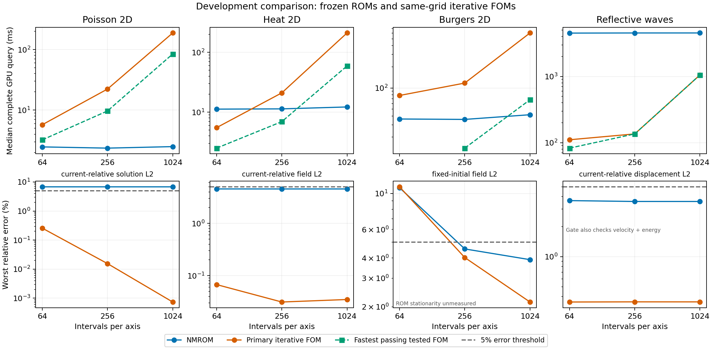

# Multiresolution NMROM versus iterative FOM comparisons

Audited development results for the current frozen separable models, using same-grid iterative full-order solvers. Paper claims remain provisional because these are existing development cohorts, with one frozen trained model per panel and independent final cases unopened.

[Table PDF](2026-09-11-iterative-fom-multiresolution.pdf) · [Editable LaTeX](2026-09-11-iterative-fom-multiresolution.tex) · [Separate scaling figure](2026-09-11-iterative-fom-multiresolution-scaling.pdf). The displayed problems are Poisson, heat, Burgers and reflective waves.

GPU times include input projection or initial fitting, the solve or full rollout, and every requested full-field device output. Where available, complete input/output transfers are measured separately from the same invocation; wave records measure output transfer only, so their complete host times are unavailable. Each PDE ladder uses a single allocation; compare each ROM with its paired FOM, not absolute wall times across PDEs.

## Primary iterative comparisons

The FOM tolerance is fixed across each resolution ladder. Times are medians of all retained repetitions, with the same repetition count for every case. Ratios divide those FOM and ROM medians; values above unity favor the ROM. The error columns retain every case, requested time and repetition. A fast result that fails accuracy or its declared numerical gates is not an accepted speedup. Burgers' declared ROM stopping contract accepts stalls; these are labeled explicitly and do not establish stationarity.

| Problem | Intervals/axis | ROM GPU ms | FOM GPU ms | FOM/ROM | ROM / FOM worst error (%) | ROM / FOM target + declared gates |
| --- | ---: | ---: | ---: | ---: | ---: | --- |
| Poisson 2D | 64 | 2.468 | 5.734 | 2.324 | 6.80256 / 0.257217 | fail / pass |
| Poisson 2D | 256 | 2.355 | 22.279 | 9.460 | 6.80156 / 0.0154597 | fail / pass |
| Poisson 2D | 1024 | 2.495 | 188.212 | 75.448 | 6.80156 / 0.000735144 | fail / pass |
| Heat 2D | 64 | 11.227 | 5.506 | 0.490 | 4.55926 / 0.0673786 | pass / pass |
| Heat 2D | 256 | 11.341 | 20.997 | 1.851 | 4.55568 / 0.0312608 | pass / pass |
| Heat 2D | 1024 | 12.206 | 210.596 | 17.253 | 4.55548 / 0.0349085 | pass / pass |
| Burgers 2D | 64 | 36.226 | 78.240 | 2.160 | 10.8546 / 10.9891 | fail / fail |
| Burgers 2D | 256 | 35.747 | 117.473 | 3.286 | 4.5507 / 4.02651 | accuracy pass; stalled / pass |
| Burgers 2D | 1024 | 41.677 | 605.747 | 14.534 | 3.90762 / 2.14161 | accuracy pass; stalled / pass |
| Reflective waves | 64 | 4510.116 | 110.527 | 0.025 | 3.64074 / 0.352078 | fail / pass |
| Reflective waves | 256 | 4530.336 | 135.462 | 0.030 | 3.56899 / 0.353387 | fail / pass |
| Reflective waves | 1024 | 4532.594 | 1053.343 | 0.232 | 3.56842 / 0.353176 | fail / pass |

## Poisson: fastest and most accurate online settings

17 frozen-checkpoint settings screened at 64 intervals on all 30 Gaussian-source development cases. The fixed shortlist is confirmed at every requested mesh with 3 repeats; endpoint selection remains developmental.

No tested configuration meets the original physical and numerical target on every development case. *Most accurate is restricted to settings with every selected solve stationary at the original threshold; an unrestricted accuracy winner is shown separately when different. The largest reduction in worst error from baseline is 0.00008462 percentage points across the confirmed meshes.

Timings and CG comparators in this section come from the new tuning job. They are not combined with FOM timings from the earlier Poisson allocation.

| Intervals/axis | Selection | Setting | ROM GPU ms | Worst / adjusted error (%) | Stationary invocations | Target + numerical gates | Tight / fastest passing CG to ROM ratio |
| ---: | --- | --- | ---: | ---: | ---: | --- | ---: |
| 64 | Baseline | `nmrom_baseline` (actual M=257) | 2.361 | 6.80256 / 6.80296 | 90/90 | fail | 2.439 / 1.376 |
| 64 | Fastest tested | `budget_1` (actual M=257) | 1.488 | 30.0699 / 30.0704 | 0/90 | fail | 3.869 / 2.182 |
| 64 | Fastest stationary | `stationarity_1e-06` (actual M=257) | 2.210 | 6.80256 / 6.80296 | 90/90 | fail | 2.605 / 1.470 |
| 64 | Most accurate* | `multistart4_M1024` (actual M=1024) | 6.427 | 6.80247 / 6.80288 | 90/90 | fail | 0.896 / 0.505 |
| 64 | Fastest passing | none | — | — | — | — | — |
| 256 | Baseline | `nmrom_baseline` (actual M=257) | 2.616 | 6.80156 / 6.80197 | 90/90 | fail | 9.797 / 4.353 |
| 256 | Fastest tested | `budget_1` (actual M=257) | 1.673 | 29.9995 / 30 | 0/90 | fail | 15.321 / 6.808 |
| 256 | Fastest stationary | `stationarity_1e-06` (actual M=257) | 2.347 | 6.80156 / 6.80197 | 90/90 | fail | 10.920 / 4.852 |
| 256 | Most accurate* | `multistart4_M1024` (actual M=1025) | 6.636 | 6.80155 / 6.80196 | 90/90 | fail | 3.862 / 1.716 |
| 256 | Fastest passing | none | — | — | — | — | — |
| 1024 | Baseline | `nmrom_baseline` (actual M=257) | 2.943 | 6.80156 / 6.80196 | 90/90 | fail | 63.140 / 28.428 |
| 1024 | Fastest tested | `budget_1` (actual M=257) | 1.970 | 29.9951 / 29.9956 | 0/90 | fail | 94.335 / 42.473 |
| 1024 | Fastest stationary | `stationarity_1e-06` (actual M=257) | 2.614 | 6.80156 / 6.80196 | 90/90 | fail | 71.083 / 32.004 |
| 1024 | Most accurate* | `multistart4_M1024` (actual M=1025) | 6.942 | 6.80155 / 6.80195 | 90/90 | fail | 26.768 / 12.052 |
| 1024 | Fastest passing | none | — | — | — | — | — |

Frozen k16/r64 decoder; no retraining or online empirical quadrature. M is the actual retained weak-mode count. These are preassembled, precompiled presets: operators and code caches are prepared for each mesh and M; budgets and gradient thresholds select compiled kernels. New unprepared settings incur offline work. The original stationarity gate is 1e-06; in-loop checks are charged, post-query auditing is excluded for every method.

### Complete Poisson tuning screen

These are the complete coarse-screen measurements, kept separate from confirmation timings. Settings are ranked over the whole cohort; online initialization and selection among starting guesses use the weak objective, never the true field error.

| Setting | Actual / requested M | Iteration budget | Residual reduction threshold | In-loop stationarity threshold | Starts | GPU / host ms | Worst error (%) | Stationary / invocations | Failed target cases | Exit reasons | GPU / host outliers |
| --- | ---: | ---: | ---: | ---: | ---: | ---: | ---: | ---: | ---: | --- | ---: |
| `budget_1` | 257 / 256 | 1 | 0 | disabled | 1 | 1.786 / 2.696 | 30.0699 | 0 / 90 | 30 | budget exhausted: 90 | 2 / 1 |
| `budget_3` | 257 / 256 | 3 | 0 | disabled | 1 | 2.091 / 3.080 | 6.80639 | 0 / 90 | 30 | budget exhausted: 90 | 0 / 0 |
| `budget_8` | 257 / 256 | 8 | 0 | disabled | 1 | 2.726 / 3.675 | 6.80256 | 87 / 90 | 6 | small accepted improvement or step: 75; budget exhausted: 15 | 0 / 0 |
| `multistart4_M1024` | 1024 / 1024 | 300 | 0 | 1e-08 | 4 | 6.720 / 7.696 | 6.80247 | 90 / 90 | 6 | small accepted improvement or step: 87; explicit configured stationarity threshold: 3 | 0 / 0 |
| `multistart4_M256` | 257 / 256 | 300 | 0 | 1e-08 | 4 | 6.421 / 7.440 | 6.80256 | 90 / 90 | 6 | small accepted improvement or step: 87; explicit configured stationarity threshold: 3 | 0 / 0 |
| `nmrom_baseline` | 257 / 256 | 150 | 0.01 | disabled | 1 | 2.760 / 3.738 | 6.80256 | 90 / 90 | 6 | small accepted improvement or step: 90 | 1 / 1 |
| `residual_tau_0.2` | 257 / 256 | 150 | 0.2 | disabled | 1 | 1.968 / 2.977 | 6.80256 | 18 / 90 | 6 | relative residual target: 72; small accepted improvement or step: 18 | 1 / 0 |
| `residual_tau_0.5` | 257 / 256 | 150 | 0.5 | disabled | 1 | 1.825 / 2.802 | 12.9025 | 0 / 90 | 14 | relative residual target: 90 | 1 / 0 |
| `stationarity_1e-02` | 257 / 256 | 150 | 0 | 1e-02 | 1 | 2.069 / 3.071 | 6.80639 | 0 / 90 | 30 | explicit configured stationarity threshold: 90 | 1 / 1 |
| `stationarity_1e-03` | 257 / 256 | 150 | 0 | 1e-03 | 1 | 2.143 / 3.078 | 6.80266 | 0 / 90 | 30 | explicit configured stationarity threshold: 90 | 1 / 0 |
| `stationarity_1e-04` | 257 / 256 | 150 | 0 | 1e-04 | 1 | 2.275 / 3.211 | 6.80255 | 0 / 90 | 30 | explicit configured stationarity threshold: 90 | 1 / 0 |
| `stationarity_1e-06` | 257 / 256 | 150 | 0 | 1e-06 | 1 | 2.486 / 3.503 | 6.80256 | 90 / 90 | 6 | explicit configured stationarity threshold: 90 | 0 / 0 |
| `strict_M1024` | 1024 / 1024 | 300 | 0 | 1e-08 | 1 | 2.796 / 3.777 | 6.80247 | 90 / 90 | 6 | small accepted improvement or step: 57; explicit configured stationarity threshold: 33 | 0 / 0 |
| `strict_M128` | 129 / 128 | 300 | 0 | 1e-08 | 1 | 2.695 / 3.676 | 6.80336 | 90 / 90 | 6 | small accepted improvement or step: 63; explicit configured stationarity threshold: 27 | 0 / 0 |
| `strict_M256` | 257 / 256 | 300 | 0 | 1e-08 | 1 | 2.748 / 3.725 | 6.80256 | 90 / 90 | 6 | small accepted improvement or step: 57; explicit configured stationarity threshold: 33 | 0 / 0 |
| `strict_M512` | 512 / 512 | 300 | 0 | 1e-08 | 1 | 2.812 / 3.795 | 6.80248 | 90 / 90 | 6 | small accepted improvement or step: 57; explicit configured stationarity threshold: 33 | 1 / 0 |
| `strict_M64` | 64 / 64 | 300 | 0 | 1e-08 | 1 | 2.709 / 3.718 | 6.8999 | 90 / 90 | 6 | small accepted improvement or step: 57; explicit configured stationarity threshold: 33 | 1 / 0 |

### Poisson confirmation configurations and exits

| Intervals/axis | Setting | Actual M | GPU / host ms | Worst error (%) | Stationary / invocations | Failed target cases | Exit reasons | GPU / host outliers |
| ---: | --- | ---: | ---: | ---: | ---: | ---: | --- | ---: |
| 64 | `budget_1` | 257 | 1.488 / 2.463 | 30.0699 | 0 / 90 | 30 | budget exhausted: 90 | 1 / 0 |
| 64 | `multistart4_M1024` | 1024 | 6.427 / 7.414 | 6.80247 | 90 / 90 | 6 | small accepted improvement or step: 87; explicit configured stationarity threshold: 3 | 0 / 0 |
| 64 | `nmrom_baseline` | 257 | 2.361 / 3.354 | 6.80256 | 90 / 90 | 6 | small accepted improvement or step: 90 | 1 / 1 |
| 64 | `stationarity_1e-06` | 257 | 2.210 / 3.223 | 6.80256 | 90 / 90 | 6 | explicit configured stationarity threshold: 90 | 0 / 0 |
| 256 | `budget_1` | 257 | 1.673 / 2.780 | 29.9995 | 0 / 90 | 30 | budget exhausted: 90 | 2 / 1 |
| 256 | `multistart4_M1024` | 1025 | 6.636 / 7.789 | 6.80155 | 90 / 90 | 6 | small accepted improvement or step: 84; explicit configured stationarity threshold: 6 | 0 / 0 |
| 256 | `nmrom_baseline` | 257 | 2.616 / 3.616 | 6.80156 | 90 / 90 | 6 | small accepted improvement or step: 90 | 1 / 1 |
| 256 | `stationarity_1e-06` | 257 | 2.347 / 3.462 | 6.80156 | 90 / 90 | 6 | explicit configured stationarity threshold: 90 | 0 / 0 |
| 1024 | `budget_1` | 257 | 1.970 / 5.476 | 29.9951 | 0 / 90 | 30 | budget exhausted: 90 | 0 / 0 |
| 1024 | `multistart4_M1024` | 1025 | 6.942 / 10.419 | 6.80155 | 90 / 90 | 6 | small accepted improvement or step: 84; explicit configured stationarity threshold: 6 | 0 / 0 |
| 1024 | `nmrom_baseline` | 257 | 2.943 / 6.525 | 6.80156 | 90 / 90 | 6 | small accepted improvement or step: 90 | 1 / 0 |
| 1024 | `stationarity_1e-06` | 257 | 2.614 / 6.130 | 6.80156 | 90 / 90 | 6 | explicit configured stationarity threshold: 90 | 0 / 0 |

Tuning job `3548866`, NVIDIA A100 80GB PCIe, scientific source `9528b214d8535c2798f9a8ea423615abc8f5ad66`. [full records](../worktrees/2026-09-07-mr-poisson2d/experiments/multiresolution-poisson/runs/online_tuning07/result.json) / [owner audit](../worktrees/2026-09-07-mr-poisson2d/experiments/multiresolution-poisson/runs/online_tuning07/audit.json) / [independent endpoint audit](../reports/2026-09-11-poisson-online-tuning.coordinator-audit.json) / [checksum collection and cleanup](../worktrees/2026-09-07-mr-poisson2d/experiments/multiresolution-poisson/runs/online_tuning07/cleanup.json).

## Effect of relaxing the full solver tolerance

This table selects the fastest tested iterative FOM that meets the panel's physical error target and stopping rules, using the same development cohort. This is a disclosed development selection, not a global optimum or independent final confirmation. A ratio remains diagnostic if the ROM fails its own target or convergence check.

| Problem | Intervals/axis | Fastest passing tested FOM | FOM GPU ms | FOM worst error (%) | FOM/ROM GPU | FOM/ROM including transfers |
| --- | ---: | --- | ---: | ---: | ---: | ---: |
| Poisson 2D | 64 | CG, tolerance 3e-02 | 3.223 | 1.13479 | 1.306 | 1.175 |
| Poisson 2D | 256 | CG, tolerance 1e-01 | 9.685 | 2.27248 | 4.112 | 3.223 |
| Poisson 2D | 1024 | CG, tolerance 1e-01 | 84.584 | 1.01917 | 33.907 | 14.901 |
| Heat 2D | 64 | CN-CG, tolerance 1e-2 | 2.504 | 1.58603 | 0.223 | 0.257 |
| Heat 2D | 256 | CN-CG, tolerance 1e-2 | 6.939 | 0.925464 | 0.612 | 0.655 |
| Heat 2D | 1024 | CN-CG, tolerance 1e-2 | 59.178 | 0.770685 | 4.848 | 2.267 |
| Burgers 2D | 64 | none | — | — | — | — |
| Burgers 2D | 256 | Newton 3e-03 / linear 5e-01; dense DST | 13.963 | 2.94346 | 0.391 | 0.429 |
| Burgers 2D | 1024 | Newton 1e-02 / linear 5e-01; FFT | 68.044 | 2.38994 | 1.633 | 1.442 |
| Reflective waves | 64 | Midpoint CG, tolerance 1e-02 | 82.648 | 0.596143 | 0.018 | unavailable |
| Reflective waves | 256 | Midpoint CG, tolerance 1e-06 | 135.462 | 0.353387 | 0.030 | unavailable |
| Reflective waves | 1024 | Midpoint CG, tolerance 1e-06 | 1053.343 | 0.353176 | 0.232 | unavailable |

## What each panel measures

The percentages below use different explicitly named norms. They should not be ranked across PDEs. The displayed wave panel uses reflective boundaries; the numerical archive retains the complete original experiment.

| Problem | Development cases × timing repeats | Error norm | Error target (%) | Primary ROM | Primary iterative FOM |
| --- | ---: | --- | ---: | --- | --- |
| Poisson 2D | 30 × 3 | current-relative solution L2 | 5 | Frozen QF NMROM | CG, tolerance 1e-06 |
| Heat 2D | 12 × 3 | current-relative field L2 | 5 | NMROM (Cholesky) | CN-CG, tolerance 1e-6 |
| Burgers 2D | 4 × 3 | fixed-initial field L2 | 5 | Frozen sampled-upwind NMROM | Newton 1e-06 / linear 1e-08; FFT |
| Reflective waves | 2 × 3 | current-relative displacement L2; gate checks all three wave components | 5 | Frozen MLP32 NMROM | Midpoint CG, tolerance 1e-06 |

**Poisson 2D.** Frozen relative-loss separable decoder with exact reduced weak algebra, sine-product source projection and nearest-code initialization. Compiled unpreconditioned CG starts from zero on the same requested grid; final true-residual verification is charged. Full requested-mesh error against a restricted 2048-interval finite-difference sine-transform reference. The gate uses $(e+\delta)/(1-\delta)$ and the declared reference-allowance check, where $e$ is measured error and $\delta$ is reference refinement; this is empirical. All 30 previously opened development sources are retained. A solve may validly stop at its declared residual target without satisfying the separate stationarity threshold. Main tables here use pooled repetition medians; native owner tables additionally report medians of case medians.

**Heat 2D.** Frozen $k=8$, $r=32$ separable decoder with Cholesky latent updates. Matched Crank–Nicolson time grid with compiled CG; previous-state linear initialization. Refined continuum sine-series heat solution; empirical refinement allowance included. Initialization and all requested full fields are charged. This panel reuses the accepted heat allocation; other PDE times come from their own paired allocations.

[Additional archived controls and detailed audit](2026-09-10-heat-iterative-cg-comparison.md).

**Burgers 2D.** Frozen $k=16$, $r=512$ decoder with 64 weak modes and 256 fitted quadrature samples, refitted for each mesh. Linear weak terms are preassembled; sign-upwind advection is sampled and is not the historical small-bank polynomial tensor. Compiled Newton–BiCGStab with FFT sine-transform preconditioning at the same 0.005 step size. Tight tolerances are the primary control; looser tolerances and the historical dense-transform preconditioner are retained. Regenerated 4096-interval implicit upwind reference with spatial and temporal refinement checks; the gate adds the empirical refinement margin. Physical accuracy and nonlinear stationarity are distinct. The original ROM stopping contract accepts a small-step/improvement stall; such exits have unmeasured stationarity and are labeled explicitly here. Timing charges inner true-residual checks and diagnostic output-step predecessor fields on the GPU. Complete host timing transfers public fields; remaining diagnostic transfers occur afterward. Outliers exceed twice the same-case median; none are excluded.

**Reflective waves.** Frozen nonlinear head with configuration dimension 32 and spatial bank rank 64; the original RK4 latent dynamics are retained. New implicit-midpoint CG control at the same 0.0025 time step and 49 output times; this is an iterative control, not a replay of a historical wave algorithm. Same-grid semidiscrete wave reference from an independent modal solution. No continuum accuracy claim. The target gate requires displacement, velocity and energy errors, reference/ROM refinement, initial-fit stationarity and successful evolution/linear solves. Initial-normalized qualification is reported separately. Only output transfers were measured; complete host times are unavailable. Native timing outliers exceed twice the same-case median, and all are retained.

## Additional wave accuracy diagnostics

These errors use the same timed outputs as the main table. The displacement column above does not by itself establish accuracy of velocity or the full energy state. Wave initial-normalized displacement uses $\|u_{\mathrm{ref}}(0)\|_M$; velocity and energy-state errors both use $\sqrt{2E_{\mathrm{ref}}(0)}$. The mass-weighted spatial norm is $\|\cdot\|_M$, and $E$ is the sum of kinetic and potential wave energy. Current-relative entries whose reference norm is zero or below the declared zero threshold are undefined and explicitly marked in the native records.

| Boundary | Intervals/axis | Method | Current displacement / velocity / energy error (%) | Initial-normalized displacement / velocity / energy error (%) | All-state current / initial target pass |
| --- | ---: | --- | ---: | ---: | --- |
| Reflective waves | 64 | Frozen MLP32 NMROM | 3.64074 / 7.71491 / 6.22399 | 1.81237 / 4.16716 / 6.22399 | no / no |
| Reflective waves | 64 | Direct sine-transform FOM | 0 / 0 / 0 | 0 / 0 / 0 | yes / yes |
| Reflective waves | 64 | Midpoint CG, tolerance 1e-06 | 0.352078 / 0.738239 / 0.574495 | 0.19969 / 0.412971 / 0.574495 | yes / yes |
| Reflective waves | 64 | Midpoint CG, tolerance 1e-02 | 0.596143 / 0.709512 / 0.485925 | 0.303316 / 0.358723 / 0.485925 | yes / yes |
| Reflective waves | 256 | Frozen MLP32 NMROM | 3.56899 / 7.81912 / 6.21197 | 1.79394 / 4.21211 / 6.21197 | no / no |
| Reflective waves | 256 | Direct sine-transform FOM | 0 / 0 / 0 | 0 / 0 / 0 | yes / yes |
| Reflective waves | 256 | Midpoint CG, tolerance 1e-06 | 0.353387 / 0.790952 / 0.601802 | 0.203903 / 0.426775 / 0.601802 | yes / yes |
| Reflective waves | 256 | Midpoint CG, tolerance 1e-02 | 18.1074 / 23.2985 / 17.0932 | 9.69524 / 12.3594 / 17.0932 | no / no |
| Reflective waves | 1024 | Frozen MLP32 NMROM | 3.56842 / 7.8131 / 6.21378 | 1.7962 / 4.20415 / 6.21378 | no / no |
| Reflective waves | 1024 | Direct sine-transform FOM | 0 / 0 / 0 | 0 / 0 / 0 | yes / yes |
| Reflective waves | 1024 | Midpoint CG, tolerance 1e-06 | 0.353176 / 0.79011 / 0.607856 | 0.203836 / 0.426563 / 0.607856 | yes / yes |
| Reflective waves | 1024 | Midpoint CG, tolerance 1e-02 | 17.1077 / 24.8137 / 13.1735 | 7.69918 / 10.6497 / 13.1735 | no / no |

## Controls included in this comparison and solver exits

The listed failures are counts of the named fit or solve events, including all repetitions; their units differ across algorithms. Outliers are retained in all medians. Their exact rules and the raw repetition arrays are linked in the native audits.

| Problem | Intervals/axis | Method | GPU / host ms | Worst error (%) | Solver exits and refinement failures | GPU / host outliers |
| --- | ---: | --- | ---: | ---: | --- | ---: |
| Poisson 2D | 64 | CG, tolerance 1e-01 | 2.777 / 3.531 | 8.81689 | none | 0 / 0 |
| Poisson 2D | 64 | CG, tolerance 1e-02 | 3.538 / 4.329 | 0.403052 | none | 0 / 0 |
| Poisson 2D | 64 | CG, tolerance 1e-04 | 4.837 / 5.578 | 0.2573 | none | 0 / 0 |
| Poisson 2D | 64 | CG, tolerance 1e-06 | 5.734 / 6.473 | 0.257217 | none | 0 / 0 |
| Poisson 2D | 64 | CG, tolerance 3e-02 | 3.223 / 3.924 | 1.13479 | none | 0 / 0 |
| Poisson 2D | 64 | Direct sine-transform FOM | 0.130 / 1.426 | 0.257217 | none | 3 / 2 |
| Poisson 2D | 64 | Frozen QF NMROM | 2.468 / 3.340 | 6.80256 | none | 2 / 1 |
| Poisson 2D | 256 | CG, tolerance 1e-01 | 9.685 / 10.698 | 2.27248 | none | 0 / 0 |
| Poisson 2D | 256 | CG, tolerance 1e-02 | 13.000 / 13.968 | 0.153756 | none | 0 / 0 |
| Poisson 2D | 256 | CG, tolerance 1e-04 | 18.489 / 19.483 | 0.0155471 | none | 0 / 0 |
| Poisson 2D | 256 | CG, tolerance 1e-06 | 22.279 / 23.281 | 0.0154597 | none | 0 / 0 |
| Poisson 2D | 256 | CG, tolerance 3e-02 | 11.443 / 12.345 | 0.548574 | none | 0 / 0 |
| Poisson 2D | 256 | Direct sine-transform FOM | 0.130 / 1.440 | 0.01546 | none | 4 / 0 |
| Poisson 2D | 256 | Frozen QF NMROM | 2.355 / 3.320 | 6.80156 | none | 1 / 1 |
| Poisson 2D | 1024 | CG, tolerance 1e-01 | 84.584 / 88.169 | 1.01917 | none | 0 / 0 |
| Poisson 2D | 1024 | CG, tolerance 1e-02 | 108.840 / 112.437 | 0.0840254 | none | 0 / 0 |
| Poisson 2D | 1024 | CG, tolerance 1e-04 | 154.841 / 158.398 | 0.000967079 | none | 0 / 0 |
| Poisson 2D | 1024 | CG, tolerance 1e-06 | 188.212 / 191.954 | 0.000735144 | none | 0 / 0 |
| Poisson 2D | 1024 | CG, tolerance 3e-02 | 98.087 / 101.913 | 0.25527 | none | 0 / 0 |
| Poisson 2D | 1024 | Direct sine-transform FOM | 0.317 / 4.103 | 0.000735118 | none | 0 / 0 |
| Poisson 2D | 1024 | Frozen QF NMROM | 2.495 / 5.917 | 6.80156 | none | 1 / 1 |
| Heat 2D | 64 | CN-CG, tolerance 1e-6 | 5.506 / 6.024 | 0.0673786 | none | 0 / 0 |
| Heat 2D | 64 | CN-CG, tolerance 1e-2 | 2.504 / 2.997 | 1.58603 | none | 0 / 0 |
| Heat 2D | 64 | CN-CG, tolerance 1e-3 | 2.655 / 3.165 | 0.492451 | none | 0 / 0 |
| Heat 2D | 64 | Direct sine-transform FOM | 0.178 / 0.544 | 0.0897485 | none | 12 / 12 |
| Heat 2D | 64 | NMROM (Cholesky) | 11.227 / 11.686 | 4.55926 | none | 0 / 0 |
| Heat 2D | 256 | CN-CG, tolerance 1e-6 | 20.997 / 22.425 | 0.0312608 | none | 0 / 0 |
| Heat 2D | 256 | CN-CG, tolerance 1e-2 | 6.939 / 8.354 | 0.925464 | none | 0 / 0 |
| Heat 2D | 256 | CN-CG, tolerance 1e-3 | 8.355 / 9.794 | 0.34297 | none | 0 / 0 |
| Heat 2D | 256 | Direct sine-transform FOM | 0.262 / 1.437 | 0.00560209 | none | 9 / 9 |
| Heat 2D | 256 | NMROM (Cholesky) | 11.341 / 12.749 | 4.55568 | none | 0 / 0 |
| Heat 2D | 1024 | CN-CG, tolerance 1e-6 | 210.596 / 235.203 | 0.0349085 | none | 0 / 0 |
| Heat 2D | 1024 | CN-CG, tolerance 1e-2 | 59.178 / 83.502 | 0.770685 | none | 0 / 0 |
| Heat 2D | 1024 | CN-CG, tolerance 1e-3 | 83.227 / 107.815 | 0.215775 | none | 0 / 0 |
| Heat 2D | 1024 | Direct sine-transform FOM | 1.236 / 25.921 | 0.000350103 | none | 0 / 0 |
| Heat 2D | 1024 | NMROM (Cholesky) | 12.206 / 36.841 | 4.55548 | none | 0 / 0 |
| Burgers 2D | 64 | Newton 3e-03 / linear 5e-01; dense DST | 11.088 / 12.849 | 10.4692 | none | 0 / 0 |
| Burgers 2D | 64 | Newton 1e-02 / linear 5e-01; FFT | 13.896 / 15.237 | 10.392 | none | 0 / 0 |
| Burgers 2D | 64 | Newton 3e-03 / linear 5e-01; FFT | 14.041 / 15.618 | 10.4692 | none | 0 / 0 |
| Burgers 2D | 64 | Newton 1e-06 / linear 1e-08; FFT | 78.240 / 79.786 | 10.9891 | none | 0 / 0 |
| Burgers 2D | 64 | Frozen sampled-upwind NMROM | 36.226 / 37.822 | 10.8546 | none; stalled initial_fits: 12; stalled steps: 600 (stationarity unmeasured) | 0 / 0 |
| Burgers 2D | 256 | Newton 3e-03 / linear 5e-01; dense DST | 13.963 / 16.440 | 2.94346 | none | 0 / 0 |
| Burgers 2D | 256 | Newton 1e-02 / linear 5e-01; FFT | 15.847 / 18.360 | 2.47369 | none | 0 / 0 |
| Burgers 2D | 256 | Newton 3e-03 / linear 5e-01; FFT | 17.473 / 20.098 | 2.94346 | none | 0 / 0 |
| Burgers 2D | 256 | Newton 1e-06 / linear 1e-08; FFT | 117.473 / 119.922 | 4.02651 | none | 0 / 0 |
| Burgers 2D | 256 | Frozen sampled-upwind NMROM | 35.747 / 38.352 | 4.5507 | none; stalled initial_fits: 12; stalled steps: 600 (stationarity unmeasured) | 0 / 0 |
| Burgers 2D | 1024 | Newton 3e-03 / linear 5e-01; dense DST | 115.684 / 134.513 | 1.65656 | none | 0 / 0 |
| Burgers 2D | 1024 | Newton 1e-02 / linear 5e-01; FFT | 68.044 / 86.674 | 2.38994 | none | 0 / 0 |
| Burgers 2D | 1024 | Newton 3e-03 / linear 5e-01; FFT | 79.157 / 97.922 | 1.65656 | none | 0 / 0 |
| Burgers 2D | 1024 | Newton 1e-06 / linear 1e-08; FFT | 605.747 / 624.437 | 2.14161 | none | 0 / 0 |
| Burgers 2D | 1024 | Frozen sampled-upwind NMROM | 41.677 / 60.098 | 3.90762 | none; stalled initial_fits: 12; stalled steps: 600 (stationarity unmeasured) | 0 / 0 |
| Reflective waves | 64 | Midpoint CG, tolerance 1e-02 | 82.648 / unavailable | 0.596143 | none | 0 / unavailable |
| Reflective waves | 64 | Midpoint CG, tolerance 1e-06 | 110.527 / unavailable | 0.352078 | none | 0 / unavailable |
| Reflective waves | 64 | Direct sine-transform FOM | 3.681 / unavailable | 0 | none | 0 / unavailable |
| Reflective waves | 64 | Frozen MLP32 NMROM | 4510.116 / unavailable | 3.64074 | none | 0 / unavailable |
| Reflective waves | 256 | Midpoint CG, tolerance 1e-02 | 98.629 / unavailable | 18.1074 | none | 0 / unavailable |
| Reflective waves | 256 | Midpoint CG, tolerance 1e-06 | 135.462 / unavailable | 0.353387 | none | 0 / unavailable |
| Reflective waves | 256 | Direct sine-transform FOM | 4.031 / unavailable | 0 | none | 0 / unavailable |
| Reflective waves | 256 | Frozen MLP32 NMROM | 4530.336 / unavailable | 3.56899 | none | 0 / unavailable |
| Reflective waves | 1024 | Midpoint CG, tolerance 1e-02 | 758.194 / unavailable | 17.1077 | none | 0 / unavailable |
| Reflective waves | 1024 | Midpoint CG, tolerance 1e-06 | 1053.343 / unavailable | 0.353176 | none | 0 / unavailable |
| Reflective waves | 1024 | Direct sine-transform FOM | 16.624 / unavailable | 0 | none | 0 / unavailable |
| Reflective waves | 1024 | Frozen MLP32 NMROM | 4532.594 / unavailable | 3.56842 | none | 0 / unavailable |

## Reproducibility and scope

All results require GPU preflight, float64, highest matrix precision, a private run directory, GPU burn-in, retained timing repetitions, and paired outputs from the timed invocation. Accepted archives have checksum collection and exact-directory cleanup records. Offline training, mesh assembly and compilation are excluded from online timing and retained in the native records. Frozen weights transfer across each panel's meshes; this study does not include retraining at each resolution. Native Poisson, Burgers and wave panels additionally report medians of per-case medians; this report recomputes pooled repetition medians consistently with the accepted heat table, so displayed times and ratios can differ between those aggregations.

| Problem | Job | GPU | Scientific source | Native results / audit / archive |
| --- | --- | --- | --- | --- |
| Poisson 2D | 3534456 | NVIDIA A100 80GB PCIe | `085e318ea8946e0443ce6a129171d09a16d34cbe` | [results](../worktrees/2026-09-07-mr-poisson2d/experiments/multiresolution-poisson/runs/iterative_cg06/result.json) / [audit](../worktrees/2026-09-07-mr-poisson2d/experiments/multiresolution-poisson/runs/iterative_cg06/audit.json) / [archive](../worktrees/2026-09-07-mr-poisson2d/experiments/multiresolution-poisson/runs/iterative_cg06/cleanup.json) |
| Heat 2D | 3529772 | NVIDIA A100-PCIE-40GB | `7e6d2e39aafdf90afc53fad03af8eca6799574bc` | [results](../worktrees/2026-09-07-mr-heat2d/experiments/mr-heat2d/runs/iterative_cg09/archive/outputs/results.json) / [audit](../worktrees/2026-09-07-mr-heat2d/experiments/mr-heat2d/runs/iterative_cg09/analysis/audit.json) / [archive](../worktrees/2026-09-07-mr-heat2d/experiments/mr-heat2d/runs/iterative_cg09/ARCHIVE.json) |
| Burgers 2D | 3534502 | NVIDIA A100-PCIE-40GB | `46ced2fd6bdd45758cc978f90d572d9fe09e3d80` | [results](../worktrees/2026-09-07-mr-burgers2d/experiments/mr-burgers2d/runs/iterative06/archive/out/result.json) / [audit](../worktrees/2026-09-07-mr-burgers2d/experiments/mr-burgers2d/runs/iterative06/AUDIT.json) / [archive](../worktrees/2026-09-07-mr-burgers2d/experiments/mr-burgers2d/runs/iterative06/ARCHIVE.json) |
| Reflective waves | 3534457 | NVIDIA A100 80GB PCIe | `e1d377928913fc94c06c6052459a4ab4847c1eb1` | [results](../worktrees/2026-09-07-mr-wave2d/experiments/multiresolution-wave/runs/iterative05/cluster/out/pilot/result.json) / [audit](../worktrees/2026-09-07-mr-wave2d/experiments/multiresolution-wave/runs/iterative05/analysis/summary.json) / [archive](../worktrees/2026-09-07-mr-wave2d/experiments/multiresolution-wave/runs/iterative05/cleanup.json) |

A separate coordinator implementation recomputed displacement errors for 4 full largest-grid predictions, covering 12 timed-output identities, with maximum metric difference 0. This is an additional first-case cross-check of both boundaries and the NMROM/tight-CG pair; the owner audit covers the complete cohort, velocity and energy. [Coordinator evidence](../reports/2026-09-11-iterative-fom-multiresolution.coordinator-audit.json).

Direct sine-transform or explicit wave solvers remain labeled controls; a win against the selected iterative algorithm does not imply a win against every FOM. Pre-reset wave experiments remain excluded. The historical smaller Burgers tensor checkpoint and the former ViT + CP model are not silently substituted for the current model. All experiment worktrees remain separate.

The adjacent [2026-09-11-iterative-fom-multiresolution.json](2026-09-11-iterative-fom-multiresolution.json) contains every normalized row, source hash and panel note. The [generator](generate_iterative_multiresolution.py) reads native JSON evidence and checks its aggregates before writing tables and plots.

## Glossary

- **Intervals/axis:** number of spatial cells along each coordinate direction; boundary conventions determine the number of stored nodes.
- **ROM / NMROM / FOM:** reduced model / nonlinear-manifold reduced model / numerical solver that evolves or solves on the full spatial grid.
- **GPU / host ms:** median blocked device-query time / same invocation including transfer of supplied inputs and requested outputs, in milliseconds.
- **FOM/ROM:** FOM median time divided by ROM median time; a larger-than-unity value favors the ROM under that particular timing contract.
- **Current-relative field L2:** spatial root-sum-square error divided by the reference field norm at that same time; quadrature weights are included where the panel requires them.
- **Fixed-initial / initial-normalized error:** error divided by a declared fixed initial scale. Heat/Burgers use the initial field norm; wave displacement uses $\|u_{\mathrm{ref}}(0)\|_M$, while wave velocity and energy-state errors use $\sqrt{2E_{\mathrm{ref}}(0)}$.
- **Worst error:** largest stated relative error across every retained case, output time and repetition; not the error of a typical case.
- **Target + declared gates:** the field-error allowance and the panel's original numerical checks pass. Burgers' accepted stall exits are not a proof of stationarity; wave gates additionally require reference and time-step refinement.
- **CG / BiCGStab / Newton:** iterative linear-system solvers / a linear solver that can handle nonsymmetric systems / repeated linearized updates for a nonlinear equation.
- **Tolerance / residual / stationarity:** numerical stopping threshold / discrepancy in a solved equation / sufficiently small objective gradient.
- **CN / midpoint / Newmark / RK4:** Crank–Nicolson / implicit midpoint / an implicit wave time integrator / fourth-order explicit Runge–Kutta stepping.
- **Preconditioner / DST / Cholesky:** an operation that makes iterative equations easier to solve / discrete sine transform / factorization for a symmetric positive-definite matrix.
- **k / r / bank / weak modes:** latent coordinate count / spatial-bank size / learned spatial functions / smooth functions used to test the PDE rather than its pointwise residual.
- **QF / sampled upwind / tensor:** quadrature-free reduced algebra / evaluation of the flow-direction-dependent spatial operator at fitted sample points / precomputed coefficient contractions; these are different operator implementations.
- **Frozen checkpoint / mesh transfer:** unchanged learned parameters / evaluating those same learned functions on a different mesh.
- **Development cohort / final cases:** inputs used in method development / separate inputs reserved for independent confirmation.
- **Reference / refinement allowance:** numerical solution used for grading / measured disagreement between refined reference calculations; empirical agreement is not a rigorous continuum error bound.
- **Fit or solve event / invocation / outlier:** an individual optimization or equation solve / one complete timed query / an unusually slow retained timing under the native stated rule.
- **Iterative / direct / diagnostic:** repeated equation-solving updates / an algebraic transform or factorization solution / a control reported to interpret the main comparison.
- **Source hash / checksum archive:** content-based identification of the executed code / preserved run files whose collected bytes were verified.
- **Tuning screen / frozen shortlist / confirmation:** the first comparison of all settings / a fixed subset selected before follow-up timing / a repeat comparison of that subset on the requested meshes; all use development cases here.
- **Iteration budget / residual reduction / in-loop stop / starts:** maximum attempted solver updates / target residual divided by the starting residual / a gradient check performed and charged during the solve / initial latent guesses optimized and compared by weak residual.
- **Fastest tested / most accurate / fastest passing:** lowest cohort median time among tested finite settings, including diagnostic early exits / lowest worst field error among configurations whose selected solves all satisfy the original stationarity threshold / lowest time among configurations passing every physical and numerical gate. None means no tested eligible configuration; these are not global optimality claims.
