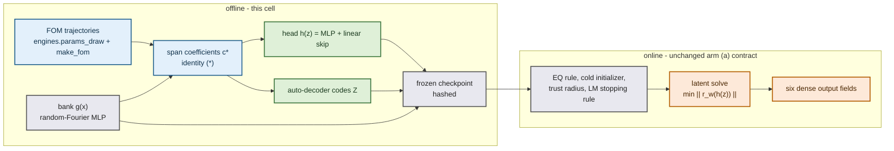

# Can training alone move the Burgers head off its 2.5 % reconstruction?

One frozen separable bank, one architecture, three training levers: how much data the head sees, what it is asked to minimise, and how many latent coordinates it has. Every number below is **final for the 6 development cases at 256 intervals** and **provisional as a paper claim**: one mesh, one training seed per arm, final cohort sealed. The predeclared protocol is `DESIGN.md`; the incumbent checkpoint is arm (a) and was re-run in the evaluation job as the control.

Training job `3745912` on `NVIDIA A100-PCIE-40GB` (3.11 h) and evaluation job `3749074` on `NVIDIA A100-PCIE-40GB` (0.67 h), source commits `0f0c56f7dc411b4e42fd8beb8271a1a567cea332` and `2b9e7ee756428a4f9dc5c2105e6803adb9dd9837`, JAX 0.10.2, backend `gpu`, float64, matmul precision `highest`.

## The answer

**Pre-registered success** required a frozen checkpoint with best-found reconstruction worst $< 1.0\,\%$, solved worst same-grid $< 1.3\,\%$, every solve stationary, at $\le 1.5\times$ the incumbent's median GPU query cost. **No arm passes.** 26 arms were evaluated.

The best best-found reconstruction reached by a TRAINED checkpoint is `best_d2048k32w_eq` at 2.8289 % against the incumbent's 2.5447 % and the frozen bank's projection floor of 0.3918 %. Its solved worst same-grid error is 3.1275 % against the incumbent's 2.5629 %, at 1.132x the incumbent's cost.

**The sharpest comparison in the cell is the like-for-like retrain.** `d4608k16rec_eq` is fitted on the same 4608 trajectories as the incumbent, at the same $K = 16$ and $R = 512$, with the same head shape (512 wide, 2 layers), the same 200000-step budget, the same learning rate 0.001 and the same batch 4096 that the incumbent's own refit used. It reaches 3.9616 % best-found against the incumbent's 2.5447 % -- 1.56$\times$ worse, not better. **So the residual head gap is not a shortage of trajectories:** given the incumbent's own data, this pipeline does not recover the incumbent, and adding data to a pipeline that cannot match it at full data is not the lever.

One difference between the two runs is recorded in their configurations and is worth naming rather than hiding: this arm expands those 4608 trajectories into 235008 auto-decoder codes (stride 1, every state of every trajectory), where the incumbent checkpoint carries 131072 -- a factor 1.79 more states at the SAME step budget, so each of this arm's states receives that factor less optimisation. That, and the fixed step budget itself, are the two candidates this cell can see for the remaining distance; neither is data volume. Varying the budget and the snapshot subsample at fixed data is the first thing a follow-up should do.

**Data-vs-capacity diagnostic: mixed.** At fixed $K = 16$ the held-out representation oracle's worst value along $N_{\rm traj} = [128, 512, 2048, 4608]$ is [0.511157, 0.33283, 0.090369, 0.098793]; monotone decreasing: no; relative improvement from the 512-trajectory rung to 2048 is 72.85 % and to 4608 is 70.32 %, against a declared saturation threshold of 10 %.

## The incumbent head was trained on 4608 trajectories, not 128

This has to come before any density number, because the lab log and the framing of this question both assumed 128. **128 is the head-ablation configuration's snapshot draw** (`config-ablation.json: train_trajectories = 128`), used there to build POD bases, to fit the linear and quadratic coefficient maps, and to fit the empirical-quadrature rule. It is not what trained the head. The incumbent checkpoint `sep_hfit_dense_mid_N256_dense.pkl` carries its own training record: `hfit_n_traj = 4608`, `hfit_extra_seed = 1000`, `hfit_extra_traj = 4032`, `hfit_arm = 'mid'`, `hfit_source_ckpt = 'sep_burgers_r3_N256_K16_R512.pkl'` — that is the canonical `sample_params(seed=0)` draw of 576 plus 4032 appended from seed 1000, and it carries 131072 auto-decoder codes, one per fitted state.

`burgers2d_film.sample_params` and `engines.params_draw` are the *same* sequential RNG draw over the *same* ranges, so that data set is reproducible in this lane, and the density ladder here is a **nested prefix** of it at [128, 512, 2048, 4608] trajectories. Two consequences for how the numbers below should be read. First, density is the only variable across the rungs, and the top rung is a like-for-like retrain of the incumbent inside this pipeline rather than a different experiment. Second, the incumbent's 2.5447 % best-found reconstruction is **not** the result of a data-starved fit: it is what 4608 trajectories already bought. Any reading of the head gap that assumed 128 trajectories — including the expectation that simply adding data would close it — has to be revisited against the ladder below.

## What is being trained, and what is frozen at query time

With the bank $G$ frozen, $\Gamma = G^\top G = \Lambda\Lambda^\top$ and $a_i = \Lambda^\top c^\ast_i$, the exact identity

$$\|G h - u_i\|_2^2 = \|\Lambda^\top h - a_i\|_2^2 + f_i^2$$

makes fitting the head against full fields and fitting the whitened head against precomputed span coefficients the same problem. The trained objective is

$$\mathcal L = \mathcal L_{\rm rec} + \beta_W \mathcal L_{\rm W} + \beta_T \mathcal L_{\rm T} + \gamma\,\mathcal L_{\rm Z},$$

$$\mathcal L_{\rm rec}=\frac1{|\mathcal B|}\sum_{i\in\mathcal B}\frac{\|q_\theta(z_i)-a_i\|_2^2}{\|u_i\|_2^2},\qquad r_w(c;p,\nu)=\frac{Ac-p+\Delta t\big(\Phi^\top\mathcal N(Gc)+\nu\lambda\odot Ac\big)}{1+\Delta t\,\nu\lambda},$$

$$\mathcal L_{\rm W}=\frac1{|\mathcal B_r|}\sum_i\frac{\|r_w(h_\theta(z_i);Ac^\ast_{i-1},\nu_i)\|_2^2}{\|Ac^\ast_i\|_2^2},\qquad \mathcal L_{\rm T}=\frac1{|\mathcal B_r|}\sum_i\frac{\|r_w(h_\theta(z_i);Ah_\theta(z_{i-1}),\nu_i)\|_2^2}{\|Ac^\ast_i\|_2^2},$$

$$\mathcal L_{\rm Z}=\frac1{|\mathcal B|}\sum_i\frac{\|z_i-z_{i-1}\|_2^2+\|z_i-z_{\pi(i)}\|_2^2}{\sigma_z^2}.$$

The weights were fixed once, before any arm ran, by the declared scale rule (weight = rho * L_rec / L_term at the INCUMBENT head on a training-cohort calibration batch; rho = 0.1. No accuracy number is consulted.): $\beta_W = \beta_T = 0.0999108$ and $\gamma = 0.0194783$, from $\mathcal L_{\rm rec} = 6.14924$, $\mathcal L_{\rm W} = 6.15473$, $\mathcal L_{\rm Z} = 31.5697$ on 512 training-cohort calibration states.

> **The calibration point is weaker than DESIGN.md §3 declared, and this is the cell's main recorded flaw.** The rule says "at the incumbent head". What the driver actually evaluated is the incumbent head at 512 of its own training codes paired with 512 *unrelated* snapshots' targets: the incumbent's codes index its own dense pick of states, and the driver strided both arrays independently instead of joining them. The pairing was recoverable — the checkpoint carries `hfit_pick`, the global state ids its codes belong to, in exactly the trajectory-major order this lane uses — and was not used. The consequence is bounded but real: $\beta_W$ and $\gamma$ are a RATIO of two terms evaluated at the same arbitrary point on the manifold, so they put the terms on a common scale there rather than at the incumbent's own operating point. Because it is a ratio at a shared point, the arms remain well defined at fixed, declared, reported weights; what is NOT licensed is the claim that the added term contributes a tenth of the loss at the incumbent's fit. The realised balance at the END of training is measured rather than assumed and is in the table below, so a weight that turned out to be uninformative is visible instead of hidden.

## Gates

| gate | value | tolerance | passed |
|---|---:|---:|---|
| whitening round trip $h\to q\to h$ | 4.859e-15 | 1e-10 | yes |
| identity $(\ast)$ against regenerated fields | 1.374e-13 | 1e-9 | yes |
| `incumbent_eq` reproduces abl01 `a_neural_eq` on 6 cases | 5.491e-13 | 1e-09 | yes |
| recorded errors recomputed from saved fields | 5.170e-16 | 1e-9 | yes |
| same grid recomputed from saved fields | 5.607e-16 | 1e-9 | yes |

Every other audit check, both jobs: `complete` pass, `backend_gpu` pass, `x64` pass, `precision_highest` pass, `source_checkpoint_unchanged` pass, `archived_draws_match_the_recorded_hashes` pass, `archived_draws_reproduce_locally_to_one_ulp` pass, `draws_inside_the_declared_ranges` pass, `cohorts_disjoint` pass, `state_stride_is_one_so_pairs_are_one_step_apart` pass, `training_data_converged` pass, `every_checkpoint_present_hashed_and_shaped` pass, `frozen_bank_arms_share_one_bank` pass, `density_curve_matches` pass, `diagnostic_verdict_reproduced` pass, `best_density_reproduced` pass, `best_objective_reproduced` pass, `bank_rank_arm_condition` pass, `objective_weights_recorded` pass, `objective_weights_reproduce_the_declared_ratio` pass, `complete` pass, `backend_gpu` pass, `x64` pass, `precision_highest` pass, `bank_and_weights_frozen` pass, `final_cohort_unopened` pass, `checkpoints_unchanged` pass, `cohort_reproduced` pass, `cohort_is_bitwise_abl01s` pass, `reference_hashes` pass, `same_grid_reference_hashes` pass, `every_subject_case_has_all_reps` pass, `repetition_output_identical` pass, `incumbent_reproduces_abl01` pass, `success_criteria_evaluated` pass, `evaluated_checkpoints_are_the_trained_ones` pass.

## The trained checkpoints

Data: nested prefixes of the incumbent's own 576 + 4032 trajectory draw, state stride 1, 51 states per trajectory, worst FOM relative residual 1.00e-09. Held-out generalisation cohort: 64 trajectories from seed 20260916, 3264 states, span floor 0.0461 % mean / 2.2351 % worst.

| arm | traj | states | $K$ | $R$ | bank | objective | steps | recon (train) mean | held-out oracle mean % | held-out worst % | mean-code-only mean % | $\times$ its own span floor | realised term share | train GPU h |
|---|---:|---:|---:|---:|---|---|---:|---:|---:|---:|---:|---:|---|---:|
| `d128k16rec` | 128 | 6528 | 16 | 512 | frozen | rec | 200000 | 0.001047 | 4.5139 | 51.1157 | 4.5144 | 97.8 | 0 | 0.094 |
| `d512k16rec` | 512 | 26112 | 16 | 512 | frozen | rec | 200000 | 0.002833 | 1.1547 | 33.2830 | 1.1547 | 25.0 | 0 | 0.098 |
| `d2048k16rec` | 2048 | 104448 | 16 | 512 | frozen | rec | 200000 | 0.005625 | 0.6225 | 9.0369 | 0.6392 | 13.5 | 0 | 0.100 |
| `d4608k16rec` | 4608 | 235008 | 16 | 512 | frozen | rec | 200000 | 0.008626 | 0.7480 | 9.8793 | 0.7520 | 16.2 | 0 | 0.108 |
| `d128k32rec` | 128 | 6528 | 32 | 512 | frozen | rec | 200000 | 0.0007301 | 3.3347 | 50.4581 | 3.3348 | 72.3 | 0 | 0.095 |
| `d2048k32rec` | 2048 | 104448 | 32 | 512 | frozen | rec | 200000 | 0.003554 | 0.4063 | 9.6784 | 0.4063 | 8.8 | 0 | 0.105 |
| `d128k16w` | 128 | 6528 | 16 | 512 | frozen | w | 200000 | 0.001052 | 4.5558 | 50.6708 | 4.5561 | 98.7 | 0.0205 | 0.376 |
| `d128k16t` | 128 | 6528 | 16 | 512 | frozen | t | 200000 | 0.001065 | 4.6145 | 51.6931 | 4.6149 | 100.0 | 0.00811 | 0.378 |
| `d128k16z` | 128 | 6528 | 16 | 512 | frozen | z | 200000 | 0.002372 | 10.2889 | 65.2325 | 11.1365 | 223.0 | 0.531 | 0.094 |
| `best_d2048k32w` | 2048 | 104448 | 32 | 512 | frozen | w | 200000 | 0.003536 | 0.4097 | 7.8591 | 0.4097 | 8.9 | 0.0429 | 0.405 |
| `joint_d2048k32r512` | 2048 | 104448 | 32 | 512 | joint | rec_field | 120000 | -- | 0.6374 | 11.0957 | 0.6374 | 3.6 | -- | 0.367 |
| `joint_d2048k32r1024` | 2048 | 104448 | 32 | 1024 | joint | rec_field | 120000 | -- | 25.1341 | 73.9358 | 25.1341 | 1.6 | -- | 0.593 |

The held-out oracle columns use two initialisations (the mean training code and a training-only encoder) for the frozen-bank arms and the mean training code alone for the joint arms, which have no whitened training block in their own bank. The **mean-code-only column is the like-for-like one across the two families**; selection happened among frozen-bank arms only, where the two-initialisation column exists for all of them. The joint arms also have their own span floor, because their bank moved.

Selection was by the declared rule (held-out representation-oracle WORST, declared in DESIGN.md before any run): best density 2048, best $K$ 32, best objective `w`, combination arm `best_d2048k32w`; the joint bank+head arms continue from `best_d2048k32w`.

Latent-dimension curve (held-out worst): [(16, 0.511157), (32, 0.504581)]. Objective curve: [('rec', 0.511157), ('w', 0.506708), ('t', 0.516931), ('z', 0.652325)].

The latent-dimension curve's full spread at 128 trajectories is 1.3\% relative (best `32` at 50.458\%, worst `16` at 51.116\% held-out worst), against the density curve's 465.6\%. What decides the selection is not that spread but the **margin over the runner-up**, `16`, which is 1.3\% relative. That margin is smaller than any resolution this cell can claim from one training seed per arm, so the selected value is reported as the declared rule's output, not as a demonstrated effect.

The objective curve's full spread at 128 trajectories is 28.7\% relative (best `w` at 50.671\%, worst `z` at 65.232\% held-out worst), against the density curve's 465.6\%. What decides the selection is not that spread but the **margin over the runner-up**, `rec`, which is 0.9\% relative. That margin is smaller than any resolution this cell can claim from one training seed per arm, so the selected value is reported as the declared rule's output, not as a demonstrated effect.

### What happened inside the joint bank+head arms

These arms unfreeze the bank, so identity $(\ast)$ does not apply to them and they optimise raw field values at a fixed seeded point subset. Both were warm started from `best_d2048k32w`; the wider one first passes through `widen`, which keeps the incumbent's $R$ feature columns exactly and initialises the new ones at random. The warm-start data term below says how much of the warm start survived that widening, and $\lambda_{\mathrm{orth}}$ was calibrated at that same point.

| arm | $R$ | warm-start data term | final data term | final total loss | $\lambda_{\mathrm{orth}}$ | feature-Gram dev. start | feature-Gram dev. end | bank Gram cond. | own span floor mean % | own span floor worst % | held-out worst % |
|---|---:|---:|---:|---:|---:|---:|---:|---:|---:|---:|---:|
| `joint_d2048k32r512` | 512 | 1.461e-05 | 6.395e-05 | 6.545e-05 | 0.0007687 | 0.0019 | 0.001952 | 8.92e+15 | 0.1790 | 3.4585 | 11.0957 |
| `joint_d2048k32r1024` | 1024 | 43.18 | 0.0009441 | 0.2218 | 4541 | 0.0009509 | 4.864e-05 | 3.71e+18 | 15.6071 | 28.3590 | 73.9358 |

- `joint_d2048k32r512` inherited its warm start intact (data term 1.461e-05 at step 1) and ended at 6.395e-05, with the orthonormality penalty at 0.023$\times$ the data term. Its span floor moved because its bank moved, so it must be read against its own floor column, not the frozen one.
- `joint_d2048k32r1024` did **not** inherit a usable warm start: its data term at the warm start is 43.18, so widening the bank to $R = 1024$ discarded the head's fit and this arm is effectively a cold start under a 120000-step budget. Because $\lambda_{\mathrm{orth}}$ is calibrated *at the warm start*, it was set against that large value, and at the end the orthonormality penalty is 234.9$\times$ the data term -- this arm was orthonormalising its bank, not fitting the data. **It is reported but it does not answer the rank question**; a fair $R = 1024$ arm needs a widening that preserves the warm start (new columns at zero head weight) and a penalty calibrated after the widening. That is a defect of this run, recorded in `DESIGN.md` as A4.

## The three layers, per checkpoint

The primary metric is the same-grid discrepancy against the converged same-mesh full-order solve, because the refined-reference metric also contains this mesh's discretisation error. The $t=0$ column is the model's own compression of the supplied initial field; on the incumbent it is the largest of the six output times, which is why the worst-over-all-times number cannot be moved by any inference-time knob.

| arm | $K$ | $R$ | $M$ | $m$ | quad. | bank floor % | best-found % | best-found $t{=}0$ % | best-found evolved % | solved same-grid % | solved evolved % | solved $t{=}0$ % | worst reference % | median iters/step | budget exits | stationary | completed | median GPU ms | median host ms | cost vs incumbent |
|---|---:|---:|---:|---:|---|---:|---:|---:|---:|---:|---:|---:|---:|---:|---:|---|---|---:|---:|---:|
| `best_d2048k32w_dense` | 32 | 512 | 128 | -- | dense | 0.3918 | 2.8289 | 2.8289 | 1.2424 | 2.8294 | 2.3680 | 2.8294 | 4.0369 | 3.0 | 0 | yes | yes | 343.679 | 346.859 | 7.055 |
| `best_d2048k32w_eq` | 32 | 512 | 128 | 512 | eq | 0.3918 | 2.8289 | 2.8289 | 1.2424 | 3.1275 | 3.1275 | 2.8294 | 4.0616 | 3.0 | 0 | yes | yes | 55.142 | 57.765 | 1.132 |
| `d128k16rec_dense` | 16 | 512 | 64 | -- | dense | 0.3918 | 12.6496 | 12.6496 | 7.2839 | 12.6496 | 7.0409 | 12.6496 | 12.6496 | 3.0 | 0 | yes | yes | 277.004 | 279.850 | 5.687 |
| `d128k16rec_eq` | 16 | 512 | 64 | 256 | eq | 0.3918 | 12.6496 | 12.6496 | 7.2839 | 12.6496 | 7.2529 | 12.6496 | 12.6496 | 3.0 | 0 | yes | yes | 45.429 | 48.279 | 0.933 |
| `d128k16t_dense` | 16 | 512 | 64 | -- | dense | 0.3918 | 12.8237 | 12.8237 | 8.1219 | 12.8238 | 7.9334 | 12.8238 | 12.8238 | 3.0 | 0 | yes | yes | 283.500 | 286.134 | 5.820 |
| `d128k16t_eq` | 16 | 512 | 64 | 256 | eq | 0.3918 | 12.8237 | 12.8237 | 8.1219 | 12.8238 | 7.8543 | 12.8238 | 12.8238 | 3.0 | 0 | yes | yes | 42.750 | 45.587 | 0.878 |
| `d128k16w_dense` | 16 | 512 | 64 | -- | dense | 0.3918 | 14.2164 | 14.2164 | 7.7135 | 14.2165 | 7.5119 | 14.2165 | 14.2165 | 3.0 | 0 | yes | yes | 288.365 | 291.212 | 5.920 |
| `d128k16w_eq` | 16 | 512 | 64 | 256 | eq | 0.3918 | 14.2164 | 14.2164 | 7.7135 | 14.2165 | 7.5935 | 14.2165 | 14.2165 | 3.0 | 0 | yes | yes | 43.882 | 46.336 | 0.901 |
| `d128k16z_dense` | 16 | 512 | 64 | -- | dense | 0.3918 | 13.6497 | 13.6497 | 11.7703 | 13.7978 | 13.7978 | 13.6505 | 14.2436 | 3.0 | 0 | yes | yes | 253.377 | 256.998 | 5.202 |
| `d128k16z_eq` | 16 | 512 | 64 | 256 | eq | 0.3918 | 13.6497 | 13.6497 | 11.7703 | 13.6505 | 13.4135 | 13.6505 | 13.8719 | 3.0 | 0 | yes | yes | 36.817 | 39.576 | 0.756 |
| `d128k32rec_dense` | 32 | 512 | 128 | -- | dense | 0.3918 | 8.8489 | 8.8489 | 6.6714 | 8.8496 | 6.2352 | 8.8496 | 8.8496 | 3.0 | 0 | yes | yes | 460.978 | 463.836 | 9.463 |
| `d128k32rec_eq` | 32 | 512 | 128 | 512 | eq | 0.3918 | 8.8489 | 8.8489 | 6.6714 | 8.8496 | 6.2351 | 8.8496 | 8.8496 | 3.0 | 0 | yes | yes | 80.716 | 83.590 | 1.657 |
| `d2048k16rec_dense` | 16 | 512 | 64 | -- | dense | 0.3918 | 3.5570 | 3.5570 | 1.5024 | 3.5574 | 2.2235 | 3.5574 | 4.0933 | 3.0 | 0 | yes | yes | 328.472 | 332.228 | 6.743 |
| `d2048k16rec_eq` | 16 | 512 | 64 | 256 | eq | 0.3918 | 3.5570 | 3.5570 | 1.5024 | 3.5574 | 1.8752 | 3.5574 | 4.1086 | 3.0 | 0 | yes | yes | 46.615 | 49.508 | 0.957 |
| `d2048k32rec_dense` | 32 | 512 | 128 | -- | dense | 0.3918 | 3.1132 | 3.1132 | 1.0732 | 3.1137 | 2.0479 | 3.1137 | 4.0434 | 3.0 | 0 | yes | yes | 344.701 | 347.546 | 7.076 |
| `d2048k32rec_eq` | 32 | 512 | 128 | 512 | eq | 0.3918 | 3.1132 | 3.1132 | 1.0732 | 3.1137 | 2.4882 | 3.1137 | 4.0475 | 3.0 | 0 | yes | yes | 54.502 | 57.220 | 1.119 |
| `d4608k16rec_dense` | 16 | 512 | 64 | -- | dense | 0.3918 | 3.9616 | 3.9616 | 2.2926 | 3.9710 | 1.8878 | 3.9710 | 4.4576 | 3.5 | 0 | yes | yes | 363.502 | 365.961 | 7.462 |
| `d4608k16rec_eq` | 16 | 512 | 64 | 256 | eq | 0.3918 | 3.9616 | 3.9616 | 2.2926 | 3.9710 | 1.9522 | 3.9710 | 4.6181 | 3.0 | 0 | yes | yes | 59.069 | 62.859 | 1.213 |
| `d512k16rec_dense` | 16 | 512 | 64 | -- | dense | 0.3918 | 6.8202 | 6.8202 | 2.2544 | 6.8204 | 2.4044 | 6.8204 | 6.8204 | 3.0 | 0 | yes | yes | 267.587 | 270.774 | 5.493 |
| `d512k16rec_eq` | 16 | 512 | 64 | 256 | eq | 0.3918 | 6.8202 | 6.8202 | 2.2544 | 6.8204 | 3.7153 | 6.8204 | 6.8204 | 3.0 | 0 | yes | yes | 39.339 | 42.305 | 0.808 |
| `incumbent_dense` | 16 | 512 | 64 | -- | dense | 0.3918 | 2.5447 | 2.5447 | 2.0854 | 2.5629 | 1.8890 | 2.5629 | 4.5575 | 3.0 | 0 | yes | yes | 332.593 | 335.269 | 6.828 |
| `incumbent_eq` | 16 | 512 | 64 | 256 | eq | 0.3918 | 2.5447 | 2.5447 | 2.0854 | 2.5629 | 1.9002 | 2.5629 | 4.5546 | 3.0 | 0 | yes | yes | 48.712 | 51.573 | 1.000 |
| `joint_d2048k32r1024_dense` | 32 | 1024 | 128 | -- | dense | 23.1437 | 44.2457 | 44.2457 | 31.9439 | 44.5686 | 34.1020 | 44.5686 | 44.5686 | 2.0 | 0 | yes | yes | 400.286 | 403.323 | 8.217 |
| `joint_d2048k32r1024_eq` | 32 | 1024 | 128 | 512 | eq | 23.1437 | 44.2457 | 44.2457 | 31.9439 | 44.5686 | 33.9541 | 44.5686 | 44.5686 | 2.0 | 0 | yes | yes | 46.379 | 49.309 | 0.952 |
| `joint_d2048k32r512_dense` | 32 | 512 | 128 | -- | dense | 2.8517 | 5.0383 | 5.0383 | 1.6570 | 5.0471 | 1.7317 | 5.0471 | 5.0471 | 2.0 | 0 | yes | yes | 284.585 | 287.199 | 5.842 |
| `joint_d2048k32r512_eq` | 32 | 512 | 128 | 512 | eq | 2.8517 | 5.0383 | 5.0383 | 1.6570 | 5.0471 | 2.4399 | 5.0471 | 5.0471 | 2.0 | 0 | yes | yes | 46.344 | 49.276 | 0.951 |

Same-job full-order controls (context only; no cross-job ratio is taken):

| method | worst same-grid % | worst reference % | median GPU ms | median host ms |
|---|---:|---:|---:|---:|
| `fft_loose` | 3.7127 | 2.4737 | 15.818 | 18.594 |
| `fft_tight` | 0.0000 | 4.0265 | 90.979 | 93.919 |

## Verdict against the pre-registered criteria

All four must hold: best-found $< 1.0$ %, solved same-grid $< 1.3$ %, every solve stationary and completed, cost $\le 1.5\times$ the incumbent.

| arm | best-found % | same-grid % | stationary | completed | cost factor | success |
|---|---:|---:|---|---|---:|---|
| `best_d2048k32w_dense` | 2.8289 | 2.8294 | yes | yes | 7.055 | no |
| `best_d2048k32w_eq` | 2.8289 | 3.1275 | yes | yes | 1.132 | no |
| `d128k16rec_dense` | 12.6496 | 12.6496 | yes | yes | 5.687 | no |
| `d128k16rec_eq` | 12.6496 | 12.6496 | yes | yes | 0.933 | no |
| `d128k16t_dense` | 12.8237 | 12.8238 | yes | yes | 5.820 | no |
| `d128k16t_eq` | 12.8237 | 12.8238 | yes | yes | 0.878 | no |
| `d128k16w_dense` | 14.2164 | 14.2165 | yes | yes | 5.920 | no |
| `d128k16w_eq` | 14.2164 | 14.2165 | yes | yes | 0.901 | no |
| `d128k16z_dense` | 13.6497 | 13.7978 | yes | yes | 5.202 | no |
| `d128k16z_eq` | 13.6497 | 13.6505 | yes | yes | 0.756 | no |
| `d128k32rec_dense` | 8.8489 | 8.8496 | yes | yes | 9.463 | no |
| `d128k32rec_eq` | 8.8489 | 8.8496 | yes | yes | 1.657 | no |
| `d2048k16rec_dense` | 3.5570 | 3.5574 | yes | yes | 6.743 | no |
| `d2048k16rec_eq` | 3.5570 | 3.5574 | yes | yes | 0.957 | no |
| `d2048k32rec_dense` | 3.1132 | 3.1137 | yes | yes | 7.076 | no |
| `d2048k32rec_eq` | 3.1132 | 3.1137 | yes | yes | 1.119 | no |
| `d4608k16rec_dense` | 3.9616 | 3.9710 | yes | yes | 7.462 | no |
| `d4608k16rec_eq` | 3.9616 | 3.9710 | yes | yes | 1.213 | no |
| `d512k16rec_dense` | 6.8202 | 6.8204 | yes | yes | 5.493 | no |
| `d512k16rec_eq` | 6.8202 | 6.8204 | yes | yes | 0.808 | no |
| `incumbent_dense` | 2.5447 | 2.5629 | yes | yes | 6.828 | no |
| `incumbent_eq` | 2.5447 | 2.5629 | yes | yes | 1.000 | no |
| `joint_d2048k32r1024_dense` | 44.2457 | 44.5686 | yes | yes | 8.217 | no |
| `joint_d2048k32r1024_eq` | 44.2457 | 44.5686 | yes | yes | 0.952 | no |
| `joint_d2048k32r512_dense` | 5.0383 | 5.0471 | yes | yes | 5.842 | no |
| `joint_d2048k32r512_eq` | 5.0383 | 5.0471 | yes | yes | 0.951 | no |

## Recorded deviations and limitations

- **The density ladder is nested inside the incumbent's own draw** rather than three independent `params_draw(0, n)` draws, and a 4608-trajectory rung was added to the brief's three, so that density is the only variable and the top rung is the incumbent's own data (DESIGN.md deviation D1).
- **A first training submission, job `3745663`, was CANCELLED while still PENDING.** It never started, consumed no GPU time and produced no output. It was cancelled because two defects in the joint bank+head arms were found after submission: the sampled-point data term was a factor $n/P \approx 15$ below the relative MSE it claimed to be, which also put every fixed regulariser weight that factor too high against it; and the orthonormality penalty inherited from `sep_common.train_autodecoder` exists to condition a *freshly initialised* bank, while these arms warm start from a trained bank whose Gram is far from the identity, so it drowned the data term. Both are fixed and recorded as dated amendments A1-A3 in `DESIGN.md`, made before any evaluation number existed. The executed jobs are the training and evaluation jobs named at the top of this report.
- **The byte-exact draw hash is not portable across NumPy versions, and three audit gates failed on it before being replaced by a stronger check.** The cluster runs NumPy 2.5.0 and this machine runs a different one; a direct probe shows their `default_rng` streams are identical for `random`, `uniform`, `integers`, `choice`, `permutation` and `normal`, and the entire disagreement is one unit in the last place of `np.exp`, which only the viscosity column passes through. The train draw differs in 201 rows, column(s) [4], at most 1 ULP (2.22e-16 relative). The holdout draw differs in 3 rows, column(s) [4], at most 1 ULP (2.17e-16 relative). The eval draw differs in 1 rows, column(s) [4], at most 1 ULP (1.97e-16 relative). The audit therefore gates on values: the attempt's own draws are regenerated in the cluster interpreter, accepted only because each hashes to exactly the value the job recorded, committed as `artifacts/<attempt>/draws.npz`, and then checked against a local re-derivation to $\le 1$ ULP, against the declared ranges, and for cohort disjointness on the actual values. On the evaluation side the binding check is not a seed at all: the six development cases are asserted **bitwise** equal to abl01's own recorded cases, in the job and again in the audit. A 1-ULP change in $\nu$ moves a solution by $O(10^{-16})$ relative, far below every tolerance here, so no reported number is affected. Recorded as amendment A5 in `DESIGN.md`.
- **The joint bank+head arms cannot use identity $(\ast)$**, because their bank moves. They train against a fixed seeded subset of 4096 of the 65025 interior points, at a capped density, continuing from the selected frozen-bank arm; their orthonormality weight is calibrated at the warm start rather than inherited, and their held-out oracle uses the mean-code initialisation only. They also have their own span floor.
- **The solve-aware training terms use the exact dense advection**, not the empirical-quadrature rule, because that rule is fitted at a fixed head and would drift as $\theta$ moves.
- **The step budget is held fixed at 200000 for every frozen-bank arm**, so the low-density arms see far more epochs than the high-density ones. That is what isolates density, and it is also why the low-density arms are the ones most exposed to overfitting.
- **A compile-time note worth carrying forward.** `common.make_projector` jits a closure over the cached bank, so XLA reports a large captured constant (the padded $512\times65025$ bank) during the first projection compile. At this bank size it costs compile time only and the job runs at full speed, but the same pattern at a larger bank or a finer mesh is the captured-constant landmine `CLAUDE.md` warns about, and the bank should be passed as an explicit jit argument if this code is reused there.
- **One mesh, one training seed per arm, development cohort only.** The final cohort stays sealed and no new case was opened. Nothing here is a speed claim against a full-order solver: the same-job full-order rows are context only.

## Plain-language glossary

- **arm:** one configuration under test; everything except the named difference is held fixed.
- **bank / $G$:** the fixed set of spatial fields the reduced state is built from. Here it is a coordinate network evaluated once on the grid and cached as a matrix.
- **head / $h_\theta$:** the small network turning the few solved coordinates into bank coefficients. This is the object being trained.
- **auto-decoder codes / $Z$:** one latent vector per training snapshot, optimised jointly with the head instead of produced by an encoder.
- **$K$:** latent dimension: how many numbers the online solver actually solves for.
- **$R$:** bank rank: how many spatial fields the bank offers.
- **$M$ / test modes:** the smooth functions the PDE residual is averaged against; there must be more of them than solved unknowns or the objective collapses.
- **$m$ / empirical quadrature (EQ):** a learned weighted subset of $m$ grid points standing in for a full grid sum; "dense" means no such approximation.
- **span floor / bank projection:** the best any coefficients at all could do in that bank -- a floor no head can beat.
- **best-found reconstruction:** the best that arm's own manifold can do on the reference field with no PDE involved, found by seeded multistart; it separates representation from dynamics.
- **held-out representation oracle:** the same quantity on trajectories no arm ever fitted, drawn from a separate seed. It is the generalisation measure and the only selection statistic used.
- **same-grid error:** difference from the converged full-order solve on the same mesh, so it contains no discretisation error.
- **reference error:** difference from a much finer, much smaller-step full-order solve; it contains this mesh's discretisation error as well.
- **evolved times:** the five output times after $t=0$.
- **$t=0$ compression:** the model's own reconstruction error on the supplied initial field, before any time stepping.
- **stationary / completed:** two separate exit statuses: the normalized-gradient stationarity test, and finishing under the shared stopping rule with no iteration-budget or rejected-step exit. Completion is the honest status; stationarity alone is not a quality ranking.
- **cost factor:** median GPU query milliseconds divided by the incumbent's, measured in the same job on the same GPU with burn-in before every timed block.
- **realised term share:** at the END of training, the added objective term times its weight, divided by the total loss. It measures what the weight calibration actually bought: a share near zero means the added term was numerically inert and its arm is a null about the weight, not about the idea.
- **development / final cohort:** cases usable for method selection / cases kept unopened.
- **frozen-bank vs joint arm:** a frozen-bank arm retrains only the head and the codes, so every such arm shares one span floor; a joint arm also moves the bank, so it has its own floor.

