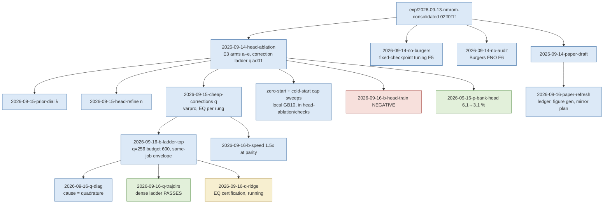

# Tunability campaign handoff, 15–16 September 2026

What was asked, what was run, what is now established about "tunability" for the separable NM-ROM, what was retracted, and what the next session should pick up. Numbers are **development-cohort, single-seed, one frozen checkpoint per PDE**, and every one of them is quoted from a generated lane report listed in the provenance manifest beside this file (`2026-09-16-tunability-campaign-handoff.manifest.md`, regenerated by `generate_handoff_manifest.py`). One lane (EQ rule certification) was still running when this was written; its status is marked *in progress*.

## 1. The question and the answer

The user's standing decision (15 Sep): **tunability stays a core paper claim.** Tunability means one trained model exposing, at inference time and without retraining, a family of operating points that trades accuracy for cost.

The pre-registered bar, written before any run: error monotone in the setting; at least three non-dominated points; at least $2\times$ span in cost **and** in error; no early-stopped point counted.

**Where it stands at handoff.**

| Object | Verdict against the bar | Source |
|---|---|---|
| Old three solver knobs (GN cap, tolerance, EQ count), both PDEs | **Fail.** Cost band of ~25–30 % at flat error, then a cliff below ~3 iterations/step. | fixed-checkpoint tuning; Poisson online tuning (11 Sep); cold-start cap sweeps |
| λ prior dial (solve all $R$ coefficients, penalised toward the head) | **Fail.** Poisson: accuracy $6.09\to2.33$ % for $1.16\times$ cost. Burgers: cost $8$–$43\times$ for $<1.8\times$ error, budget exits. | prior-dial |
| $n$ per-query head refinement | **Fail.** Burgers pinned by $t{=}0$ compression; Poisson monotone only from $n{=}2$. | head-refine |
| $q$ correction ladder, Burgers 256², **EQ rules** | **Fail** on the evolved-times metric ($q{=}16$ worse than $q{=}0$); span $1.4\times$. Cause found: the quadrature, see §4. | cheap-corrections; b-ladder-top; q-diag |
| $q$ correction ladder, Burgers 256², **dense quadrature, budget 600** | **PASS.** Six converged rungs $q\in\{0,16,32,64,128,256\}$, evolved worst $1.89/1.40/1.23/1.08/0.89/0.52$ %, GPU $333\to4355$ ms; monotone on both metrics; error span $3.64\times$, cost span $13.1\times$. | q-trajdirs (job 3757505) |
| $q$ ladder, Poisson 1024² | Monotone and converged ($6.09\to4.18$ % to $q{=}64$; $2.33$ % at $q{=}R$) but cost span $\le1.4\times$: a free accuracy setting, not a trade. | cheap-corrections; prior-dial |
| Certified EQ twins of the dense rungs | *In progress* (q-ridge, job 3768168 running at handoff). | q-ridge |

**One-sentence claim the evidence supports:** a single frozen decoder exposes a monotone family of offline-prepared inference-time operating points (correction rungs; EQ rules and tolerance as cost levers) that dominates the POD rank ladder on Burgers; it does not beat an efficient full-order solver at 256², reaches parity with it at 1024², and on linear PDEs the top rung is a linear reduced model that is also the cheapest point, so there the nonlinear head is dominated.

## 2. What was run, in order

Every lane: own worktree, own cluster namespace, `DESIGN.md` committed before any run, off-setting reproduces the audited baseline (typically $\le10^{-12}$), same-job FOM controls, three timed repetitions with burn-in, independent NumPy audit of every reported error from saved fields, checksum-collected archives in Git chunks, remote attempt directory deleted, dated lab-log entry. All branches are **local only** (see §7).

Cluster jobs, all A100: 3733929/3733930 (prior dial), 3733978/3733979 (head refine), 3734084/3734098 (cheap corrections), 3745589/3747245/3749039 (ladder top), 3745655/3745656/3745913 (speed), 3745912/3749074 (head train; 3745663 cancelled pending), 3745606/3748202 (Poisson), 3757505 (dense ladder; 3756800 control OOM'd at compile), q-ridge 3757235/3757237/3764450/3768168 (3759018, 3763371 cancelled and retracted).

## 3. Findings by theme

### 3.1 Error is representation-bound; solver effort is a cost control only

Three-layer decomposition (bank projection floor → head best-found → solved), one checkpoint each:

| PDE | bank floor | head best-found | solved (same-grid worst) |
|---|---|---|---|
| Burgers 256², $K{=}16$, $R{=}512$ | 0.39 % | 2.54 % | 2.56 % |
| Poisson 1024², $K{=}16$, $R{=}128$ | 2.31 % | 6.09 % | 6.09 % |

The solve lands on the head's best fit. Tolerance $10^{-6}\to10^{-3}$ removes 23 % of Burgers GPU time for $+10^{-5}$ pp; the iteration cap is a cliff (cap 8: 4.4 %; caps 4, 2: 75 %, no accepted step). From $z{=}0$ the Poisson cap traces a curve (median 54 → 1.24 % over caps 6–20) but every point is dominated by the nearest-code start (cap 2 at a third of the cost); on Burgers a zero start per step is hopeless. The old paper's knob regime is reproduced and explained: under-converged solves at tolerances $10^{-2}$–$10^{-1}$ plus capacity changes ($k$, $R$, EQ refits, training recipe) between its two operating points.

### 3.2 The nonlinear head is necessary at matched $K$ on Burgers, not on Poisson

Head ablation (E3): Burgers neural 2.56 % vs optimal linear map 56.9 %, quadratic 31.8 %, POD-LSPG $k'{=}16$ 61.7 %, $k'{=}128$ 10.1 % at $7\times$ cost. Poisson: neural 6.09 % vs linear 17.3 %, but POD-128 4.35 % at the same cost. Free-bank endpoints: 0.60 % (Burgers, 2.4 s) and 2.33 % (Poisson, same cost).

### 3.3 The correction ladder is the accuracy control, and the structural rule for when it trades

$u = G\,(h_\theta(z) + C_q y)$, directions fixed offline, nested in $q$. Cheap-corrections made $q\le128$ converge at 3 it/step (block-damped variable projection; per-rung EQ $4.7$–$6.4\times$ cheaper than dense). b-ladder-top made $q{=}256$ converge by raising the per-step budget $180\to600$ at $0.988\times$ cost; conditioning and damping fixes were inert; a coarse-to-fine warm start was harmful. The dense ladder passes the bar (§1).

**Where the trade exists.** Only where the projected residual is nonlinear in the bank coefficients. On Burgers the full-bank solve is a 512-unknown nonlinear iteration (2.4 s), so the head's compression to 16 unknowns saves real cost and each rung spends some of it back. On Poisson the solve is tiny either way (cost span $\le1.4\times$). On heat (10 Sep) the full bank evolved linearly is $0.56$ ms / 1.7 % against the head's $12$ ms / 4.6 %: the top rung is the cheapest point. This answers reviewer 5mgh's "when is the nonlinear manifold needed" with data: Burgers positive, Poisson and heat negative. EQ is **not** the condition; it is one way (with the precomputed tensor the other) to pay for the nonlinear term.

### 3.4 Speed

b-speed: $1.52\times$ at 256², $1.47\times$ at 1024², at parity (identical iteration counts and exit reasons; fields $\le10^{-12}$). Fused residual+Jacobian $1.25\times$; head output layer folded into the bank $1.15\times$; block Gauss–Jordan **loses** at $K{=}16$. The query is launch-bound: $17\,\mu$s/step $+\,141\,\mu$s/iteration; past $1.5\times$ needs fewer iterations. Against the cheapest fair Newton control (nt $10^{-2}$, $\Delta t\,0.01$): $3.45\times$ slower at 256², $2.27\times$ at 512², $0.98$–$1.01\times$ at 1024² (parity reached, not cleared). Batched throughput 12 ms/query, FOM unbatched. The same-job envelope at 256² has only FOM controls on its non-dominated set (nt $10^{-4}$: 0.034 % at 38 ms).

### 3.5 Training (negative, with a caveat) and Poisson bank/head

b-head-train: no retrained Burgers head beats the incumbent (best 2.83 % vs 2.54 %); the like-for-like retrain of the incumbent's own recipe lands $1.56\times$ worse, so **this pipeline does not reproduce the incumbent** (1.8× more states at the same step budget) and no training verdict on Burgers is safe until it does. Corrected fact: the incumbent head was trained on **4608** trajectories, not 128. Code-smoothness penalty harmful; $K$ and objective within noise; the $R{=}1024$ joint arm is retracted (warm start never took).

p-bank-head: Poisson $6.09\to3.11$ % worst at 1024² with $R{=}512$, $K{=}32$ (bank floor 0.74 %; $+32$ corrections 2.46 %; $1.33\times$ cost; all stationary; beats POD at $k'{=}K$). The head **underfits its own training data** (bank 1.93 % vs head 4.68 % on training sources, codes converged): function-class/objective-limited, not data; a better bank widens the head's relative gap ($2.6\to4.2\times$). POD-128 on the same snapshots (2.50 % at 6.2 ms) dominates every neural checkpoint; DST is exact at 4.5 ms. Poisson is the correctness case; no speedup.

## 4. Retractions and corrections made in this window

- **"The head gap is sparse sampling at 128 trajectories"** (my own reasoning, 15 Sep): wrong; the head was trained on 4608.
- **"The initial fit is 28 of 65 ms"**: wrong; it is ~12 % of the Burgers query (cap sweep). The fixed cost is decode plus per-step overhead.
- **"The $q{=}16$ regression needs trajectory-fitted directions or a ridge"**: both hypotheses refuted by q-diag before their jobs ran (the trajectory-directions control OOM'd and was withdrawn untested; the ridge lane was re-scoped). Cause: **the EQ rule**. 12/12 dense ladders monotone across four jobs; only EQ ladders regress, at fixed $M$ too. Rule error $\rho$ on reachable states rises with $q$ ($0.116\to0.185$) while NNLS rel-fit looks fine; at $q{=}512$ $\rho$ is 8–50 % against a fit of $2\times10^{-4}$. **NNLS rel-fit cannot certify a rule; only $\rho$ on held-out reachable states can.** The direction matrices $C_q$ were never archived and were recovered numerically (held-out reconstruction $\le1.4\times10^{-12}$).
- **b-ladder-top's coverage reading of the $q{=}512$ failure** (node support) is superseded: support is *better* at $q{=}512$; the rule is fitted to the wrong states.
- **"Flattening the direction-fit `while_loop` would remove the compilation-bound setup cost"**: it cost 124 s more, bitwise identical output.
- **Whole-query bitwise parity** across program restructurings: withdrawn (XLA fusion); gate at $10^{-12}$ plus identical integers.
- **Lab log said four commits exceed 2 GB**: there are seven (largest 11.2 GiB), all heat archive parts.
- cheap-corrections' guess that the $q{=}512$ EQ fitter cap was the culprit: a valid untruncated rule still gives 3.65 % vs 0.60 % dense.

## 5. Landmines recorded

- `engines.params_draw` draws column-by-column: drawing 4 cases is not an extension of drawing 2.
- Cluster vs GB10 NumPy differ by 1 ulp in `exp` (viscosity/width columns): use value gates, not hash gates, across machines. `core.source_params` likewise.
- The GB10's first f64 QR of a $64516\times512$ matrix returns NaN; guard with a rank assert.
- A job holding $N$ jitted reduced queries holds $N$ executables and $N$ operator sets on device: 14 fit a 40 GB A100, 34 do not.
- `pax007` fails `cuInit`; exclude it.
- Local runs over the sub-minute rule happened three times (probe, smokes); they are recorded as deviations, and the rule stands.

## 6. Decisions waiting on the user

1. **Burgers headline metric.** Worst over evolved times with the $t{=}0$ compression reported separately (1.90 % at $q{=}0$) vs worst over all times (2.56 %). The dense ladder is monotone on both, so the choice no longer decides the ladder's shape; it moves the headline $\sim2\times$ and decides whether the decoder's compression of the supplied field is charged to the ROM.
2. **GitHub code-only mirror push.** Prepared and dry-run: drops 214 of 215 GiB, keeps every source, report, result/audit JSON and manifest; 170 MiB pack; nothing over 50 MB. Publish command in `worktrees/2026-09-16-paper-refresh/reports/2026-09-16-code-only-github-mirror-plan.md`, targets an **empty new** repository. Not run.
3. **Merge or archive** the fourteen 2026-09-1x worktrees (none merged; the consolidated baseline is the only integration point).
4. **Poisson ladder as the linear-case figure**: one job on the $R{=}512$/$K{=}32$ checkpoint, $q$ to 512, POD ranks 32–512 and DST in-job, proposed and not launched.

## 7. How to resume

- Read `LAB-LOG.md` top block (rewritten 16 Sep) and the dated entries from `## 2026-09-15` onward; this file is a snapshot, the lab log is canonical. `LAB-LOG.md` is modified-uncommitted on `main` by standing instruction.
- Fork new Burgers ladder work from `exp/2026-09-16-q-trajdirs` (dense ladder, budget 600, envelope code, valid EQ fitter) or, once it closes, `exp/2026-09-16-q-ridge` (certified EQ rules). Fork Poisson work from `exp/2026-09-16-p-bank-head` (R=512/K=32 checkpoint, POD ladder, DST control). Never from `main`.
- Every namespace under `/cluster/tufts/paralab/tawal01/*_2026091{4,5,6}` is empty except `no_burgers_20260914/pilot-data01` (Burgers dataset cache) and `q_ridge_20260916` (job running at handoff).
- Nothing from 2026-09-13 onward is on GitHub; the remote refs for those branch names point at a stale partial push. See decision 2.
- Suggested order: (a) close q-ridge and, if the certified EQ ladder is monotone, redraw the tunability figure from one job; (b) three training seeds of the Burgers checkpoint and the sealed cohort before any number enters the paper; (c) the Poisson linear-case figure; (d) reproduce the incumbent Burgers training recipe before any further training claim; (e) the mirror push.

## Glossary

- **Tunability / operating point / family**: the ability to pick, at run time from one trained model, a setting that trades accuracy for cost; one such setting; the set of them.
- **Bank $G$, head $h_\theta$, latent $z$, $K$, $R$**: the fixed spatial shapes the decoder combines; the small network mapping the $K$ latent numbers to $R$ coefficients; the unknowns solved per query; their count; the bank size.
- **Correction ladder, $q$, directions $C_q$**: letting the solver add $q$ extra fixed coefficient directions on top of $h_\theta(z)$; the number of them; the fixed matrix holding them.
- **Bank floor / best-found / solved**: the best any coefficients in the bank could do; the best point on the head's surface fitting the reference directly; what the online solve delivers.
- **Same-grid error / evolved-times / all-times / $t{=}0$ compression**: error against the converged full-order solve on the same mesh; worst over output times after the start; worst including the start; the decoder's own error reproducing the supplied initial field.
- **EQ, dense, $m$, $M$, NNLS rel-fit, $\rho$**: empirical quadrature (sampling the nonlinear term at $m$ weighted nodes); using the full grid instead; the node count; the number of weak test modes; the fitting score of a rule on its own snapshots; the rule's true relative error on states the solver reaches.
- **Variable projection / block-damped**: eliminating the corrections $y$ inside the solve so the nonlinear iteration stays $K$-dimensional; the damping variant kept.
- **Converged / early-stopped / budget exit**: the solve met its stopping rule; it hit its iteration cap; the count of steps that did.
- **Non-dominated**: no other point is both cheaper and more accurate.
- **FOM controls**: the full-order Newton solves timed in the same job at named tolerances; DST is the direct sine-transform solve for Poisson and heat.
- **POD-LSPG $k'$**: the classical linear reduced model at rank $k'$ solved with the same weak objective.
- **Development cohort / sealed cohort / seed**: cases used for diagnosis and selection; cases reserved unopened for final confirmation; the training-run randomness (one seed everywhere here).
- **Worktree / namespace / lane**: an isolated checkout and branch; the cluster directory owned by one experiment; one experiment run by one agent.
