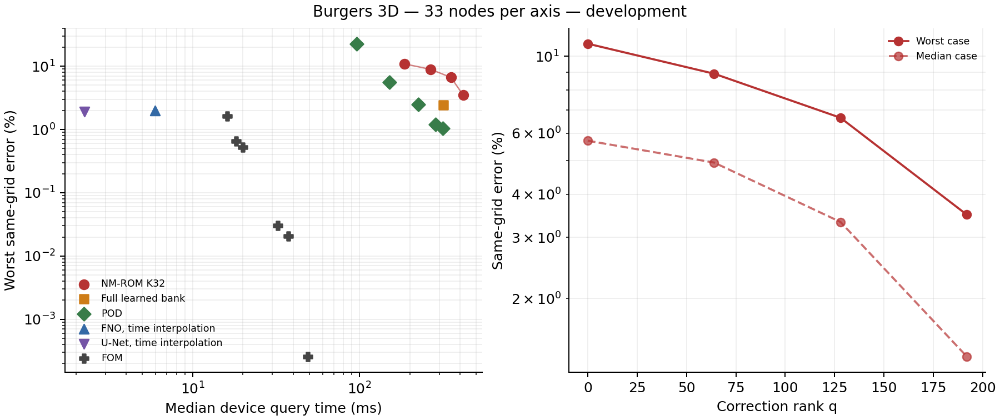
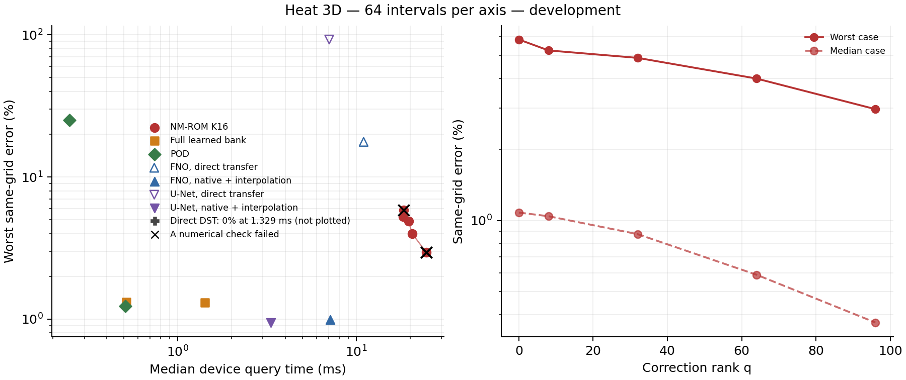
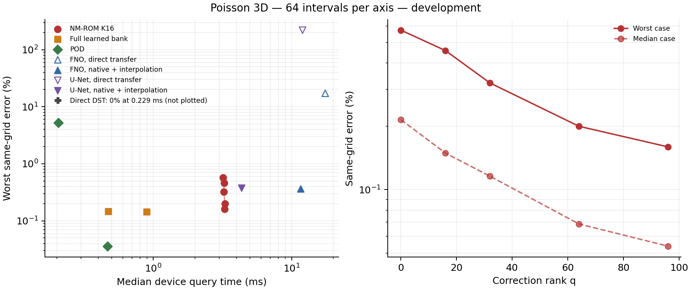

# Three-dimensional comparison panels for the manuscript

These generated tables and vector figures are provisional development material. They show the explicitly selected audited comparisons; independent final evaluation remains pending.

Explicit diagnostic panels. Show a fixed-head correction ladder, the full learned-bank control, POD controls at the latent and full-bank dimensions, all measured operator variants, and full-order controls. No timing or error optimum is selected automatically.

## Burgers 3D — b3d003 — 33 nodes per axis

**Provisional:** Audited development data, same training membership. Errors use the initial-field norm and exclude time zero. Operator predictions interpolate the trained time knots to the common output times. Physical refinement covers only two cases; this panel supports same-grid comparisons only.

Each method is evaluated on 8 distinct cases; all timed repetitions are retained. 

Source `dc91edb2c81712fde9d1b05fec7028c47bd213b4`; job `3992083`; GPU `NVIDIA A100 80GB PCIe`. [LaTeX table](burgers3d-b3d003-n33.tex), [CSV](burgers3d-b3d003-n33.csv), [vector figure](burgers3d-b3d003-n33.pdf).

| Method | Median error (%) | Worst error (%) | GPU median (ms) | GPU p95 (ms) | NF / NS cases | Outliers / calls |
| --- | ---: | ---: | ---: | ---: | --- | --- |
| NM-ROM K32, q0 | 5.7071 | 10.8780 | 185.964 | 230.676 | 0 / 0 | 0 / 24 |
| NM-ROM K32, q64 | 4.9359 | 8.9108 | 267.228 | 324.793 | 0 / 0 | 0 / 24 |
| NM-ROM K32, q128 | 3.3258 | 6.6491 | 352.971 | 427.954 | 0 / 0 | 0 / 24 |
| NM-ROM K32, q192 | 1.3600 | 3.4908 | 417.752 | 619.396 | 0 / 0 | 0 / 24 |
| Full learned bank R256 | 0.8437 | 2.4345 | 316.894 | 317.808 | 0 / 0 | 0 / 24 |
| POD32 | 9.5224 | 22.6947 | 95.765 | 96.092 | 0 / 0 | 0 / 24 |
| POD96 | 1.9855 | 5.5785 | 150.552 | 151.571 | 0 / 0 | 0 / 24 |
| POD160 | 0.7675 | 2.5057 | 224.232 | 224.922 | 0 / 0 | 0 / 24 |
| POD224 | 0.3988 | 1.2100 | 284.363 | 285.417 | 0 / 0 | 0 / 24 |
| POD256 | 0.3292 | 1.0363 | 315.911 | 317.242 | 0 / 0 | 0 / 24 |
| FNO, time interpolation | 1.6413 | 1.9979 | 5.959 | 6.426 | 0 / 0 | 0 / 24 |
| U-Net, time interpolation | 1.6239 | 1.9129 | 2.242 | 2.508 | 0 / 0 | 0 / 24 |
| FOM n1e-02, l5e-01 | 1.2739 | 1.6185 | 16.141 | 16.597 | 0 / 0 | 0 / 24 |
| FOM n1e-02, l5e-03 | 0.0382 | 0.6543 | 18.239 | 21.011 | 0 / 0 | 0 / 24 |
| FOM n1e-03, l5e-01 | 0.4692 | 0.5248 | 19.954 | 21.066 | 0 / 0 | 0 / 24 |
| FOM n1e-04, l5e-01 | 0.0267 | 0.0303 | 32.302 | 34.894 | 0 / 0 | 0 / 24 |
| FOM n1e-04, l1e-06 | 0.0188 | 0.0207 | 37.326 | 41.866 | 0 / 0 | 0 / 24 |
| FOM n1e-06, l1e-01 | 0.0002 | 0.0003 | 48.915 | 50.783 | 0 / 0 | 0 / 24 |

All timed method arms in this attempt are included. Representation fits and the two-case refinement screen are retained in the complete source records. FOM labels identify nonlinear (n) and inner linear (l) tolerances.

## Heat 3D — tune02 — 64 intervals per axis

**Provisional:** Audited development data. Errors use the current reference-field norm and exclude time zero. Some initial fits miss their stopping budget; evolved solves are stationary. Direct operator transfer and all quadrature certificates fail. Native-grid interpolation is charged separately.

Each method is evaluated on 16 distinct cases; all timed repetitions are retained. 

Source `4a93e5868acf83cbe07d84e6c451dc50ffbd9ea2`; job `3990698`; GPU `NVIDIA A100 80GB PCIe`. [LaTeX table](heat3d-tune02-n64.tex), [CSV](heat3d-tune02-n64.csv), [vector figure](heat3d-tune02-n64.pdf).

| Method | Median error (%) | Worst error (%) | GPU median (ms) | GPU p95 (ms) | NF / NS cases | Outliers / calls |
| --- | ---: | ---: | ---: | ---: | --- | --- |
| NM-ROM K16, q0 | 1.0804 | 5.8427 | 18.392 | 36.053 | 0 / 2 | 6 / 48 |
| NM-ROM K16, q8 | 1.0426 | 5.2535 | 18.294 | 23.042 | 0 / 0 | 0 / 48 |
| NM-ROM K16, q32 | 0.8752 | 4.8852 | 19.608 | 21.957 | 0 / 0 | 0 / 48 |
| NM-ROM K16, q64 | 0.5892 | 3.9930 | 20.528 | 24.009 | 0 / 0 | 0 / 48 |
| NM-ROM K16, q96 | 0.3697 | 2.9628 | 24.581 | 37.254 | 0 / 1 | 3 / 48 |
| Full bank, exact Galerkin | 0.2563 | 1.3166 | 0.514 | 0.782 | 0 / 0 | 3 / 48 |
| Full bank, exact weak | 0.2542 | 1.3113 | 1.421 | 1.702 | 0 / 0 | 0 / 48 |
| POD16 | 8.6633 | 25.1877 | 0.248 | 0.731 | 0 / 0 | 12 / 48 |
| POD128 | 0.1414 | 1.2338 | 0.507 | 0.758 | 0 / 0 | 3 / 48 |
| FNO, direct transfer | 15.1234 | 17.6641 | 10.981 | 11.366 | 0 / 0 | 0 / 48 |
| FNO, native + interpolation | 0.7669 | 0.9891 | 7.140 | 7.855 | 0 / 0 | 0 / 48 |
| U-Net, direct transfer | 75.7115 | 92.6756 | 7.047 | 7.567 | 0 / 0 | 0 / 48 |
| U-Net, native + interpolation | 0.7512 | 0.9468 | 3.319 | 3.703 | 0 / 0 | 0 / 48 |
| Direct DST | 0.0000 | 0.0000 | 1.329 | 1.757 | 0 / 0 | 1 / 48 |

The complete audited report retains the K8 ladder, intermediate POD ranks, time-step and failed sampled-quadrature diagnostics.

## Poisson 3D — tuned02 — 64 intervals per axis

**Provisional:** Development data. Static head-parameter transfers are included in this implementation's timings; the next paired panel corrects their placement. Direct operator transfer and quadrature certification failed. All measurements below share one allocation.

Each method is evaluated on 16 distinct cases; all timed repetitions are retained. 

Source `68fd0cca50c44b8c866986d1fcbf44d9ee8b4c1b`; job `3990494`; GPU `NVIDIA A100 80GB PCIe`. [LaTeX table](poisson3d-tuned02-n64.tex), [CSV](poisson3d-tuned02-n64.csv), [vector figure](poisson3d-tuned02-n64.pdf).

| Method | Median error (%) | Worst error (%) | GPU median (ms) | GPU p95 (ms) | NF / NS cases | Outliers / calls |
| --- | ---: | ---: | ---: | ---: | --- | --- |
| NM-ROM K16, q0 | 0.2149 | 0.5726 | 3.191 | 3.954 | 0 / 0 | 0 / 48 |
| NM-ROM K16, q16 | 0.1492 | 0.4580 | 3.252 | 4.189 | 0 / 0 | 0 / 48 |
| NM-ROM K16, q32 | 0.1159 | 0.3215 | 3.230 | 3.980 | 0 / 0 | 0 / 48 |
| NM-ROM K16, q64 | 0.0687 | 0.2001 | 3.287 | 3.984 | 0 / 0 | 0 / 48 |
| NM-ROM K16, q96 | 0.0539 | 0.1598 | 3.282 | 4.097 | 0 / 0 | 0 / 48 |
| Full bank, weak solve | 0.0520 | 0.1444 | 0.894 | 1.021 | 0 / 0 | 1 / 48 |
| Full bank, Galerkin | 0.0530 | 0.1474 | 0.473 | 0.726 | 0 / 0 | 3 / 48 |
| POD16 | 1.8304 | 5.2702 | 0.206 | 0.673 | 0 / 0 | 8 / 48 |
| POD128 | 0.0066 | 0.0360 | 0.465 | 0.764 | 0 / 0 | 5 / 48 |
| FNO, direct transfer | 16.0680 | 17.1866 | 17.493 | 18.200 | 0 / 0 | 0 / 48 |
| FNO, native + interpolation | 0.2852 | 0.3656 | 11.579 | 12.243 | 0 / 0 | 0 / 48 |
| U-Net, direct transfer | 168.0982 | 219.8928 | 11.985 | 12.627 | 0 / 0 | 0 / 48 |
| U-Net, native + interpolation | 0.2828 | 0.3769 | 4.328 | 4.887 | 0 / 0 | 0 / 48 |
| Direct DST | 0.0000 | 0.0000 | 0.229 | 0.581 | 0 / 0 | 10 / 48 |

The complete audited report retains the K8 ladder, intermediate POD ranks, and failed sampled-quadrature diagnostics. They are not presented as missing experiments.

## Navier–Stokes 3D — comparison02 — 32 periodic points per axis

**Provisional:** Audited negative development result on a fixed interacting three-dimensional flow family. Errors use the initial vector norm and exclude time zero. Projected operator variants charge the divergence-free projection; raw outputs are separate diagnostics. Full-bank/POD Galerkin controls are distinct reduced equations from the weak correction objective. Evolution stopping records have no saved latent history in this attempt.

Each method is evaluated on 8 distinct cases; all timed repetitions are retained. 

Source `23932ac4eca33075fc43b4e10e9d3ca24ee2a388`; job `3993021`; GPU `NVIDIA A100-PCIE-40GB, 40960 MiB`. [LaTeX table](ns3d-comparison02-n32.tex), [CSV](ns3d-comparison02-n32.csv), [vector figure](ns3d-comparison02-n32.pdf).

| Method | Median error (%) | Worst error (%) | GPU median (ms) | GPU p95 (ms) | NF / NS cases | Outliers / calls |
| --- | ---: | ---: | ---: | ---: | --- | --- |
| NM-ROM K16, q0 | 28.5319 | 50.4758 | 901.362 | 903.780 | 0 / 0 | 0 / 24 |
| NM-ROM K16, q16 | 28.2539 | 49.9583 | 969.484 | 973.404 | 0 / 0 | 0 / 24 |
| NM-ROM K16, q32 | 27.8899 | 49.2381 | 1092.342 | 1096.646 | 0 / 0 | 0 / 24 |
| NM-ROM K16, q64 | 27.0931 | 47.6297 | 1588.925 | 1594.383 | 0 / 0 | 0 / 24 |
| NM-ROM K16, q128 | 25.2664 | 45.3348 | 2226.148 | 2240.061 | 0 / 0 | 0 / 24 |
| Full bank, Galerkin R512 | 13.4503 | 24.2696 | 49.405 | 49.601 | 0 / 0 | 0 / 24 |
| POD16, weak solve | 87.7996 | 91.9857 | 24.465 | 25.741 | 0 / 0 | 0 / 24 |
| POD32, weak solve | 78.1203 | 85.5263 | 27.381 | 28.384 | 0 / 0 | 0 / 24 |
| POD48, weak solve | 67.3545 | 76.1070 | 35.558 | 36.246 | 0 / 0 | 0 / 24 |
| POD128, Galerkin | 34.5481 | 47.3334 | 5.889 | 6.076 | 0 / 0 | 0 / 24 |
| POD256, Galerkin | 24.8410 | 36.0594 | 12.233 | 12.500 | 0 / 0 | 0 / 24 |
| POD512, Galerkin | 15.2837 | 27.7537 | 49.327 | 49.543 | 0 / 0 | 0 / 24 |
| FOM, dt 0.001 | 0.0031 | 0.0051 | 25.763 | 26.674 | 0 / 0 | 0 / 24 |
| FOM, dt 0.002 | 0.0130 | 0.0213 | 13.268 | 13.717 | 0 / 0 | 0 / 24 |
| FOM, dt 0.004 | 0.0524 | 0.0866 | 7.056 | 7.507 | 0 / 0 | 0 / 24 |
| FOM, dt 0.008 | 0.2125 | 0.3598 | 3.936 | 4.361 | 0 / 0 | 0 / 24 |
| FNO, raw | 1.3422 | 1.7664 | 9.554 | 10.080 | 0 / 0 | 0 / 24 |
| FNO, projected | 1.0974 | 1.5121 | 9.596 | 10.390 | 0 / 0 | 0 / 24 |
| U-Net, raw | 3.4540 | 4.6468 | 2.019 | 2.373 | 0 / 0 | 0 / 24 |
| U-Net, projected | 3.0414 | 4.2830 | 2.128 | 2.751 | 0 / 0 | 1 / 24 |

All timed arms are shown. Full-cohort representation/training-validation diagnostics are retained separately and are not substituted for the measured errors of this timing subset.

## Glossary

- **Development / provisional:** data used during model selection / evidence awaiting final confirmation.
- **NM-ROM, K, q:** neural-manifold reduced model, latent dimension, and added correction rank.
- **Bank / full bank:** learned spatial functions / a model with all their coefficients free.
- **POD / Galerkin / weak:** a linear basis learned from snapshots / projection against basis functions / a residual projected against smooth test functions.
- **FOM / DST:** a full-grid solver / a direct solver using discrete sine transforms.
- **FNO / U-Net / DeepONet / Transolver:** Fourier, convolutional, branch–trunk and transformer solution-map models.
- **Direct transfer / native plus interpolation:** evaluating frozen model weights on a changed grid / evaluating on the training grid and interpolating the prediction, with interpolation cost included.
- **Median / worst error:** median or maximum across cases of each case's largest error over the requested evolved times; Poisson has one stationary output. Norms are defined in the complete audited report. The worst repeated invocation is retained.
- **GPU median / p95:** median / empirical 95th percentile of all retained device query times. The latter is a descriptive tail statistic, not a confidence interval.
- **NF / NS cases:** cases with at least one nonfinite output / failed iterative stopping check. Direct models require no iterative stopping test.
- **Outliers / calls:** timings above one and a half times that method's median / all timed repetitions, including those outliers.
- **Source / job / GPU:** pinned code revision / allocation identifier / graphics processor. Cost comparisons stay within an allocation.
- **All-times / initial / physical errors (CSV):** errors including time zero / initial compression / comparison against a refined numerical reference. A blank cell is unmeasured, not zero.
