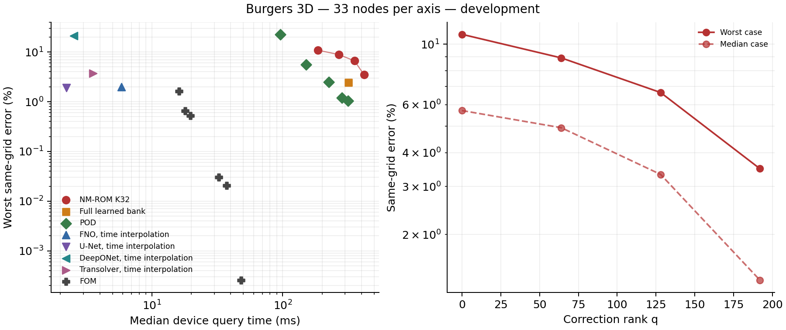
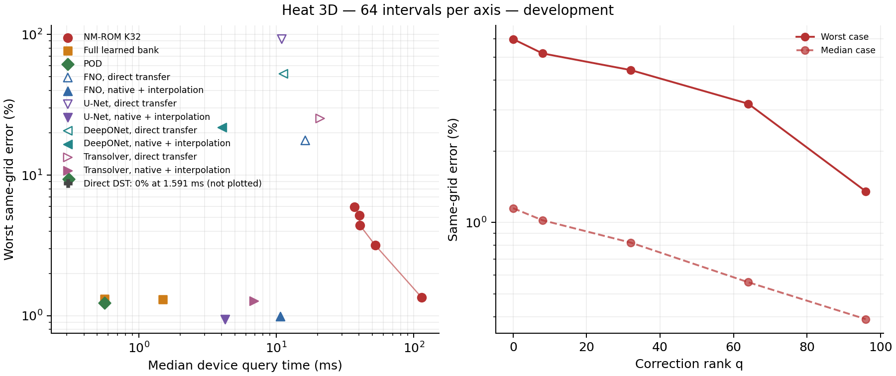
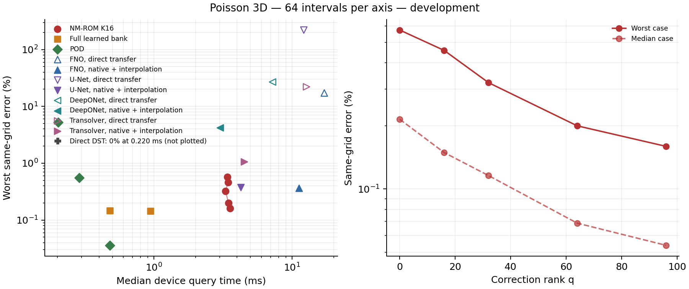
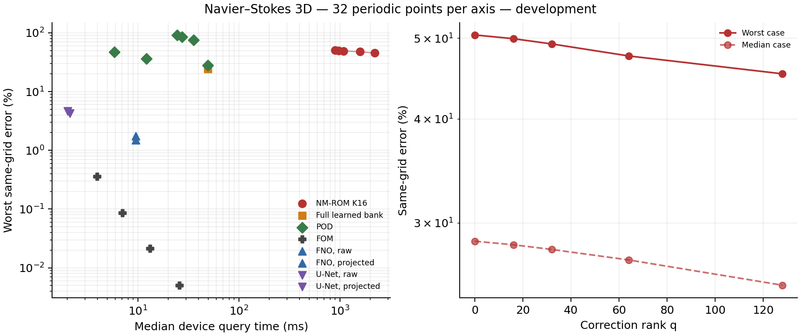

# Three-dimensional comparison panels for the manuscript

These generated tables and vector figures are provisional development material. They show the explicitly selected audited comparisons; independent final evaluation remains pending.

Explicit diagnostic panels. Show a fixed-head correction ladder, the full learned-bank control, POD controls at the latent and full-bank dimensions, all measured operator variants, and full-order controls. No timing or error optimum is selected automatically.

## Burgers 3D — b3d004 — 33 nodes per axis

**Provisional:** Audited development data with all four operator families and the same training membership. Errors use the initial-field norm and exclude time zero. Operator predictions interpolate trained time knots to the common output times. The newer operator schedules are still under evaluation. Physical refinement covers only two cases; this panel supports same-grid comparisons only.

Each method is evaluated on 8 distinct cases; all timed repetitions are retained. 

Source `c026d56b83905293e71268c249b57324c7d01baf`; job `3995688`; GPU `NVIDIA A100 80GB PCIe`. [LaTeX table](burgers3d-b3d004-n33.tex), [CSV](burgers3d-b3d004-n33.csv), [vector figure](burgers3d-b3d004-n33.pdf).

| Method | Median error (%) | Worst error (%) | GPU median (ms) | GPU p95 (ms) | NF / NS cases | Outliers / calls |
| --- | ---: | ---: | ---: | ---: | --- | --- |
| NM-ROM K32, q0 | 5.7071 | 10.8780 | 186.364 | 230.973 | 0 / 0 | 0 / 24 |
| NM-ROM K32, q64 | 4.9359 | 8.9108 | 267.817 | 325.616 | 0 / 0 | 0 / 24 |
| NM-ROM K32, q128 | 3.3258 | 6.6491 | 353.542 | 428.614 | 0 / 0 | 0 / 24 |
| NM-ROM K32, q192 | 1.3600 | 3.4908 | 418.712 | 620.808 | 0 / 0 | 0 / 24 |
| Full learned bank R256 | 0.8437 | 2.4345 | 316.964 | 317.629 | 0 / 0 | 0 / 24 |
| POD32 | 9.5224 | 22.6947 | 95.738 | 96.211 | 0 / 0 | 0 / 24 |
| POD96 | 1.9855 | 5.5785 | 151.273 | 152.382 | 0 / 0 | 0 / 24 |
| POD160 | 0.7675 | 2.5057 | 224.346 | 225.287 | 0 / 0 | 0 / 24 |
| POD224 | 0.3988 | 1.2100 | 284.540 | 285.347 | 0 / 0 | 0 / 24 |
| POD256 | 0.3292 | 1.0363 | 316.567 | 317.512 | 0 / 0 | 0 / 24 |
| FNO, time interpolation | 1.6413 | 1.9979 | 5.862 | 6.687 | 0 / 0 | 0 / 24 |
| U-Net, time interpolation | 1.6239 | 1.9129 | 2.212 | 2.633 | 0 / 0 | 0 / 24 |
| DeepONet, time interpolation | 7.9145 | 21.1988 | 2.534 | 3.009 | 0 / 0 | 0 / 24 |
| Transolver, time interpolation | 1.8700 | 3.7391 | 3.545 | 3.888 | 0 / 0 | 0 / 24 |
| FOM n1e-02, l5e-01 | 1.2739 | 1.6185 | 16.068 | 16.725 | 0 / 0 | 0 / 24 |
| FOM n1e-02, l5e-03 | 0.0382 | 0.6543 | 17.940 | 20.571 | 0 / 0 | 0 / 24 |
| FOM n1e-03, l5e-01 | 0.4692 | 0.5248 | 19.753 | 21.495 | 0 / 0 | 0 / 24 |
| FOM n1e-04, l5e-01 | 0.0267 | 0.0303 | 32.494 | 34.086 | 0 / 0 | 0 / 24 |
| FOM n1e-04, l1e-06 | 0.0188 | 0.0207 | 37.394 | 41.505 | 0 / 0 | 0 / 24 |
| FOM n1e-06, l1e-01 | 0.0002 | 0.0003 | 48.156 | 50.230 | 0 / 0 | 0 / 24 |

All timed arms in the main panel are included. The separately measured larger-head candidate on the same allocation is retained in the complete report, alongside representation and limited refinement diagnostics. FOM labels identify nonlinear (n) and inner linear (l) tolerances.

## Heat 3D — extra03 — 64 intervals per axis

**Provisional:** Audited development data with all four operator families. Errors use the current reference-field norm and exclude time zero. All recorded fits and evolved solves are stationary. The larger head improves the high-correction endpoint but retains a generalization gap; improved initialization and longer operator schedules are under evaluation. Failed direct transfer variants are retained; native-grid interpolation is charged separately.

Each method is evaluated on 16 distinct cases; all timed repetitions are retained. 

Source `4ac8b16455f5b71bcdd560df3432cac43b8816d9`; job `3995709`; GPU `NVIDIA A100-PCIE-40GB`. [LaTeX table](heat3d-extra03-n64.tex), [CSV](heat3d-extra03-n64.csv), [vector figure](heat3d-extra03-n64.pdf).

| Method | Median error (%) | Worst error (%) | GPU median (ms) | GPU p95 (ms) | NF / NS cases | Outliers / calls |
| --- | ---: | ---: | ---: | ---: | --- | --- |
| NM-ROM K32, q0 | 1.1494 | 5.9683 | 37.143 | 48.919 | 0 / 0 | 0 / 48 |
| NM-ROM K32, q8 | 1.0223 | 5.1921 | 40.126 | 80.283 | 0 / 0 | 5 / 48 |
| NM-ROM K32, q32 | 0.8224 | 4.4151 | 40.445 | 56.685 | 0 / 0 | 1 / 48 |
| NM-ROM K32, q64 | 0.5591 | 3.1815 | 52.322 | 92.258 | 0 / 0 | 5 / 48 |
| NM-ROM K32, q96 | 0.3903 | 1.3555 | 113.590 | 151.651 | 0 / 0 | 1 / 48 |
| Full bank, exact Galerkin | 0.2563 | 1.3166 | 0.564 | 0.766 | 0 / 0 | 1 / 48 |
| Full bank, exact weak | 0.2542 | 1.3113 | 1.495 | 1.694 | 0 / 0 | 0 / 48 |
| POD32 | 3.0811 | 9.3730 | 0.311 | 0.647 | 0 / 0 | 9 / 48 |
| POD128 | 0.1414 | 1.2338 | 0.565 | 0.616 | 0 / 0 | 0 / 48 |
| FNO, direct transfer | 15.1234 | 17.6641 | 16.246 | 17.031 | 0 / 0 | 0 / 48 |
| FNO, native + interpolation | 0.7669 | 0.9891 | 10.681 | 11.592 | 0 / 0 | 0 / 48 |
| U-Net, direct transfer | 75.7115 | 92.6756 | 10.960 | 11.808 | 0 / 0 | 0 / 48 |
| U-Net, native + interpolation | 0.7512 | 0.9468 | 4.240 | 4.764 | 0 / 0 | 0 / 48 |
| DeepONet, direct transfer | 33.8829 | 52.5118 | 11.270 | 12.017 | 0 / 0 | 0 / 48 |
| DeepONet, native + interpolation | 7.0168 | 21.7903 | 4.029 | 4.545 | 0 / 0 | 0 / 48 |
| Transolver, direct transfer | 19.8616 | 25.2954 | 20.828 | 22.118 | 0 / 0 | 0 / 48 |
| Transolver, native + interpolation | 0.9475 | 1.2766 | 6.854 | 7.952 | 0 / 0 | 0 / 48 |
| Direct DST | 0.0000 | 0.0000 | 1.591 | 1.926 | 0 / 0 | 0 / 48 |

The complete audited report retains smaller-head ladders, intermediate POD ranks and time-step diagnostics. Failed sampled-quadrature certificates remain in the earlier attempt and are not promoted.

## Poisson 3D — extra03 — 64 intervals per axis

**Provisional:** Audited development data with all four operator families. Static weights are placed on the GPU during setup. New operator curves are still improving and longer common schedules are under evaluation. Direct transfer variants and quadrature certificates fail; preserved-domain FNO padding is a pending control. Every measured pair below shares one allocation.

Each method is evaluated on 16 distinct cases; all timed repetitions are retained. 

Source `a50ce0977373977688d73f82700108a6138b433b`; job `3995104`; GPU `NVIDIA A100 80GB PCIe`. [LaTeX table](poisson3d-extra03-n64.tex), [CSV](poisson3d-extra03-n64.csv), [vector figure](poisson3d-extra03-n64.pdf).

| Method | Median error (%) | Worst error (%) | GPU median (ms) | GPU p95 (ms) | NF / NS cases | Outliers / calls |
| --- | ---: | ---: | ---: | ---: | --- | --- |
| NM-ROM K16, q0 | 0.2149 | 0.5726 | 3.390 | 3.965 | 0 / 0 | 0 / 48 |
| NM-ROM K16, q16 | 0.1492 | 0.4580 | 3.435 | 4.269 | 0 / 0 | 0 / 48 |
| NM-ROM K16, q32 | 0.1159 | 0.3215 | 3.301 | 4.113 | 0 / 0 | 0 / 48 |
| NM-ROM K16, q64 | 0.0687 | 0.2001 | 3.465 | 4.269 | 0 / 0 | 0 / 48 |
| NM-ROM K16, q96 | 0.0539 | 0.1598 | 3.566 | 4.219 | 0 / 0 | 0 / 48 |
| Full bank, weak solve | 0.0520 | 0.1444 | 0.944 | 1.049 | 0 / 0 | 0 / 48 |
| Full bank, Galerkin | 0.0530 | 0.1474 | 0.479 | 0.741 | 0 / 0 | 3 / 48 |
| POD16 | 1.8304 | 5.2702 | 0.203 | 0.554 | 0 / 0 | 5 / 48 |
| POD48 | 0.1484 | 0.5576 | 0.287 | 0.403 | 0 / 0 | 2 / 48 |
| POD128 | 0.0066 | 0.0360 | 0.480 | 0.761 | 0 / 0 | 4 / 48 |
| FNO, direct transfer | 16.0680 | 17.1866 | 17.107 | 17.678 | 0 / 0 | 0 / 48 |
| FNO, native + interpolation | 0.2852 | 0.3656 | 11.197 | 11.617 | 0 / 0 | 0 / 48 |
| U-Net, direct transfer | 168.0982 | 219.8928 | 12.157 | 12.513 | 0 / 0 | 0 / 48 |
| U-Net, native + interpolation | 0.2828 | 0.3769 | 4.262 | 4.712 | 0 / 0 | 0 / 48 |
| DeepONet, direct transfer | 16.7244 | 26.8325 | 7.221 | 7.538 | 0 / 0 | 0 / 48 |
| DeepONet, native + interpolation | 2.1141 | 4.2024 | 3.016 | 3.261 | 0 / 0 | 0 / 48 |
| Transolver, direct transfer | 16.9674 | 22.0653 | 12.719 | 13.382 | 0 / 0 | 0 / 48 |
| Transolver, native + interpolation | 0.7201 | 1.0698 | 4.493 | 5.311 | 0 / 0 | 0 / 48 |
| Direct DST | 0.0000 | 0.0000 | 0.220 | 0.501 | 0 / 0 | 6 / 48 |

The complete audited report retains the K8 ladder, intermediate POD ranks, and failed sampled-quadrature diagnostics. They are not presented as missing experiments.

## Navier–Stokes 3D — comparison02 — 32 periodic points per axis

**Provisional:** Audited negative development result on a fixed interacting three-dimensional flow family. Errors use the initial vector norm and exclude time zero. Projected operator variants charge the divergence-free projection; raw outputs are separate diagnostics. Full-bank/POD Galerkin controls are distinct reduced equations from the weak correction objective. Evolution stopping records have no saved latent history in this attempt.

Each method is evaluated on 8 distinct cases; all timed repetitions are retained. 

Source `23932ac4eca33075fc43b4e10e9d3ca24ee2a388`; job `3993021`; GPU `NVIDIA A100-PCIE-40GB, 40960 MiB`. [LaTeX table](ns3d-comparison02-n32.tex), [CSV](ns3d-comparison02-n32.csv), [vector figure](ns3d-comparison02-n32.pdf).

| Method | Median error (%) | Worst error (%) | GPU median (ms) | GPU p95 (ms) | NF / NS cases | Outliers / calls |
| --- | ---: | ---: | ---: | ---: | --- | --- |
| NM-ROM K16, q0 | 28.5319 | 50.4758 | 901.362 | 903.780 | 0 / 0 | 0 / 24 |
| NM-ROM K16, q16 | 28.2539 | 49.9583 | 969.484 | 973.404 | 0 / 0 | 0 / 24 |
| NM-ROM K16, q32 | 27.8899 | 49.2381 | 1092.342 | 1096.646 | 0 / 0 | 0 / 24 |
| NM-ROM K16, q64 | 27.0931 | 47.6297 | 1588.925 | 1594.383 | 0 / 0 | 0 / 24 |
| NM-ROM K16, q128 | 25.2664 | 45.3348 | 2226.148 | 2240.061 | 0 / 0 | 0 / 24 |
| Full bank, Galerkin R512 | 13.4503 | 24.2696 | 49.405 | 49.601 | 0 / 0 | 0 / 24 |
| POD16, weak solve | 87.7996 | 91.9857 | 24.465 | 25.741 | 0 / 0 | 0 / 24 |
| POD32, weak solve | 78.1203 | 85.5263 | 27.381 | 28.384 | 0 / 0 | 0 / 24 |
| POD48, weak solve | 67.3545 | 76.1070 | 35.558 | 36.246 | 0 / 0 | 0 / 24 |
| POD128, Galerkin | 34.5481 | 47.3334 | 5.889 | 6.076 | 0 / 0 | 0 / 24 |
| POD256, Galerkin | 24.8410 | 36.0594 | 12.233 | 12.500 | 0 / 0 | 0 / 24 |
| POD512, Galerkin | 15.2837 | 27.7537 | 49.327 | 49.543 | 0 / 0 | 0 / 24 |
| FOM, dt 0.001 | 0.0031 | 0.0051 | 25.763 | 26.674 | 0 / 0 | 0 / 24 |
| FOM, dt 0.002 | 0.0130 | 0.0213 | 13.268 | 13.717 | 0 / 0 | 0 / 24 |
| FOM, dt 0.004 | 0.0524 | 0.0866 | 7.056 | 7.507 | 0 / 0 | 0 / 24 |
| FOM, dt 0.008 | 0.2125 | 0.3598 | 3.936 | 4.361 | 0 / 0 | 0 / 24 |
| FNO, raw | 1.3422 | 1.7664 | 9.554 | 10.080 | 0 / 0 | 0 / 24 |
| FNO, projected | 1.0974 | 1.5121 | 9.596 | 10.390 | 0 / 0 | 0 / 24 |
| U-Net, raw | 3.4540 | 4.6468 | 2.019 | 2.373 | 0 / 0 | 0 / 24 |
| U-Net, projected | 3.0414 | 4.2830 | 2.128 | 2.751 | 0 / 0 | 1 / 24 |

All timed arms are shown. Full-cohort representation/training-validation diagnostics are retained separately and are not substituted for the measured errors of this timing subset.

## Glossary

- **Development / provisional:** data used during model selection / evidence awaiting final confirmation.
- **NM-ROM, K, q:** neural-manifold reduced model, latent dimension, and added correction rank.
- **Bank / full bank:** learned spatial functions / a model with all their coefficients free.
- **POD / Galerkin / weak:** a linear basis learned from snapshots / projection against basis functions / a residual projected against smooth test functions.
- **FOM / DST:** a full-grid solver / a direct solver using discrete sine transforms.
- **FNO / U-Net / DeepONet / Transolver:** Fourier, convolutional, branch–trunk and transformer solution-map models.
- **Direct transfer / native plus interpolation:** evaluating frozen model weights on a changed grid / evaluating on the training grid and interpolating the prediction, with interpolation cost included.
- **Median / worst error:** median or maximum across cases of each case's largest error over the requested evolved times; Poisson has one stationary output. Norms are defined in the complete audited report. The worst repeated invocation is retained.
- **GPU median / p95:** median / empirical 95th percentile of all retained device query times. The latter is a descriptive tail statistic, not a confidence interval.
- **NF / NS cases:** cases with at least one nonfinite output / failed iterative stopping check. Direct models require no iterative stopping test.
- **Outliers / calls:** timings above one and a half times that method's median / all timed repetitions, including those outliers.
- **Source / job / GPU:** pinned code revision / allocation identifier / graphics processor. Cost comparisons stay within an allocation.
- **All-times / initial / physical errors (CSV):** errors including time zero / initial compression / comparison against a refined numerical reference. A blank cell is unmeasured, not zero.
