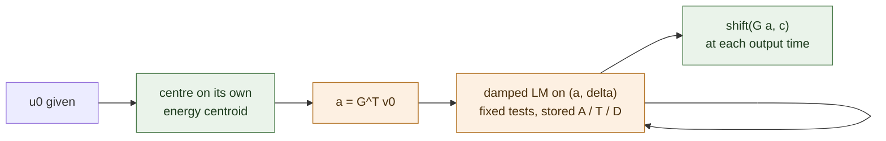

# Solving the translation online for 3D Navier-Stokes

A shift-aware reduced model for the NS3D translation orbit, where the frame is an unknown of the reduced least-squares problem rather than a tracked quantity. It meets the accuracy target comfortably at both meshes tried, loses on speed at $N=32$ and wins on speed at $N=64$. **Every number here is a development measurement and none of it has been through a sealed cohort**: the pre-registered speed bar failed at the design mesh, stop rule 3 forbade the sealed draw, and the larger-mesh result comes from an explicitly exploratory amendment that carries no licence to open one either. Generated from the run JSONs by `reports/build_2026-09-22-ns3d-shift-decoder.py`; no number here is hand-typed.

## What was asked and what came back

`ns3d-grok` had established that NS3D at $N=32$ in this project fails on *representation*: the family is a translation orbit of localized vortices, a fixed-span bank must rebuild every shifted state, and re-centring a **stored** POD basis each step costs more than the FOM it is trying to beat. This cell asked whether the translation can instead be solved online, and it has two answers.

**Accuracy: yes, decisively.** The solved frame reaches **0.449% evolved worst** on the development cohort, 0 of 16 cases over the 5 % target, against **2.538%** for the centroid tracker measured on the same cohort in the same job, and **234.855%** for the same model with the frame frozen. It is also more accurate than the FOM at the same step: CNAB2 at $\Delta t=0.01$ gives 0.788%.

**Speed: no, and the cost sweep says why.** The pilot's complete query costs **23.875 ms** against a **5.537 ms** comparator, a paired speedup of **0.232x**; the best setting found anywhere in the sweep is M292, dt0.04 at 8.282 ms. The interesting part is the split. The grid-sized work the ROM cannot avoid -- one initial centering and projection at 0.264 ms plus 5 laboratory-frame output reconstructions at 0.171 ms each -- is only 1.117 ms in total, about 13 % of that best query. **Roughly nine tenths of the cost is the reduced rollout itself**, and its arithmetic -- an $M\times r\times r$ contraction and a 67-unknown least squares, a few times per step -- is two orders of magnitude below what it is being charged. The reduced model is not paying for physics; it is paying for a generic damped Levenberg-Marquardt driver dispatched as hundreds of tiny sequential GPU kernels per trajectory, against a FOM whose whole step is three large FFTs.

That matters because the rollout's cost contains no $N$: $A$, $\mathsf T$ and $D_d$ are sized by the rank and the test count, not by the mesh. The FOM's cost does contain $N$. So the losing margin at $N=32$ is a statement about this mesh and this solver, not about the idea.

**And at $N=64$ it crosses.** Same reduced model, same stored operators, same checks: 2.073% evolved worst, 0/16 over 5 %, 10.831 ms against a 19.372 ms comparator -- **1.789x**, at $\Delta t=0.04$. That is the first reduced model in this NS3D line that is both inside the accuracy target and faster than the FOM it is measured against. It is a **development measurement on an explicitly exploratory amendment**, written before the job and carrying no licence to open a sealed cohort, and it should be treated as a reason to design that experiment rather than as a result to quote.

## The mechanism

Write $u(x,t) = v(x - c(t), t)$. Because the nonlinearity, the Laplacian and the Leray projector all commute with translation on the periodic box, the moving frame satisfies

$$\partial_t v \;=\; \dot c\cdot\nabla v \;+\; \mathcal P[N(v)] \;+\; \nu\Delta v .$$

With $v = Ga$ in a fixed **centered** bank and the project's fixed solenoidal Fourier tests $\Phi$, the per-step weak residual is the project's usual one plus a single term linear in the frame increment $\delta = c^{n+1}-c^{n}$:

$$r(a,\delta) = \frac{A(a^{n+1}-a^{n}) - \Delta t\big(\mathsf T(\bar a,\bar a) - \nu\lambda A\bar a\big) - \sum_{d}\delta_d D_d\bar a}{1+\tfrac12\Delta t\,\nu\lambda}, \qquad \bar a = \tfrac12(a^{n+1}+a^{n}),$$

with $A=\Phi^{\mathsf T}G$, $\mathsf T_{mjk}=\langle\phi_m,G_j\times\operatorname{curl}G_k\rangle$ and $D_d=\Phi^{\mathsf T}\partial_d G$ **all precomputed offline**. The unknown is $(a,\delta)\in\mathbb R^{r+3}$, solved by the same damped Levenberg-Marquardt used everywhere in this repository.

**The decisive structural point: nothing is shifted at run time.** The 9222-term Fourier phase sum that made the tracker slow does not appear anywhere. And that is true for *any* fixed bank, POD included -- so **a coordinate network is not what makes the translation cheap; the co-moving formulation is**. The cell was opened on the premise that a pointwise decoder `g(x-c)` is what buys free shifts. That premise is wrong, which is why the learned-bank arm was deferred and never run.

## Floors: rank vs floor

| rank | fixed bank (uncentred POD) | over 5 % | re-centred bank, oracle per-time shift | over 5 % |
|---:|---:|---:|---:|---:|
| 32 | 85.413% | 16/16 | 0.737% | 0/16 |
| 64 | 70.027% | 16/16 | 0.128% | 0/16 |
| 128 | 47.119% | 16/16 | 0.020% | 0/16 |

The floor collapses by a factor of 549 at rank 64. The rank-64 oracle figure, 0.128%, independently reproduces diag01's 0.128 % from a different job and a different code path.

The fixed-bank column here is **higher** than diag01's 53.860 % because this fit omits diag01's 4-copy integer-translation augmentation, so the fixed span covers the orbit less well. That makes it a stricter must-fail control, not a contradiction. The **coordinate-network bank floor was not measured**: the design deferred it once the freezing form showed the architecture is not what buys the cheap shift, and the speed result then closed the cell before it was reached.

## Does the solve recover the frame without an oracle?

Yes, and it is genuinely identified rather than merely chosen by a gauge.

| quantity | no gauge | with gauge |
|---|---:|---:|
| smallest / largest singular value of the full Jacobian | 3.526e-05 | 3.859e-05 |
| condition number of the full Jacobian | 2.836e+04 | 2.591e+04 |
| largest singular value of the coefficient block | 1.001e+00 | 1.421e+00 |
| **deflated** smallest singular value of $(I-J_aJ_a^{\dagger})J_\delta$, over the largest of $J_a$ | 2.995e+01 | 5.073e+01 |
| analytic $J_\delta$ column vs automatic differentiation | 5.612e-17 | 5.612e-17 |

The deflated ratio is **2.995e+01** with no gauge at all, against a pre-registered threshold of $10^{-6}$: the shift carries information that no coefficient update can absorb. Translation tangents $\partial_d(Ga)$ are 0.818, 0.845, 0.889 captured inside $\operatorname{span}(G)$ (rank 3 of 3), so the coefficient/shift redundancy is real but partial -- which is exactly why the residual can still see the frame. The solved frame tracks the truth: the worst gap between the reconstructed field's centroid and the true field's is 0.00006 of the box, against 0.04647 for the frozen frame.

Levenberg-Marquardt converges cleanly: median 3 iterations per step, 0.0% of steps exiting on budget, stopping reasons {'budget': 0, 'rejected': 0, 'stationary': 320, 'tiny_step': 0, 'tolerance': 0}.

## Every arm, development cohort

| arm | rank | M | dt | gauge | evolved worst | evolved median | over 5 % | median ms | comparator | paired speedup |
|---|---:|---:|---:|---:|---:|---:|---:|---:|---|---:|
| B0 frozen frame | 64 | 292 | 0.01 | 0.0 | 234.855% | 192.284% | 16/16 | 93.346 | CNAB2 dt=0.02 | 0.021x |
| **B1 solved frame** | 64 | 292 | 0.01 | 0.0 | 0.449% | 0.286% | 0/16 | 23.875 | CNAB2 dt=0.005 | 0.232x |
| B2 solved frame + gauge | 64 | 292 | 0.01 | 1.0 | 20.500% | 16.222% | 16/16 | 24.700 | CNAB2 dt=0.01 | 0.127x |
| C centroid tracker (grid form) | 64 | - | 0.01 | - | 2.538% | 1.661% | 0/16 | 14.865 | CNAB2 dt=0.01 | 0.211x |
| CNAB2 dt=0.002 | - | - | 0.002 | - | 0.019% | 0.011% | 0/16 | 12.818 | - | - |
| CNAB2 dt=0.004 | - | - | 0.004 | - | 0.094% | 0.055% | 0/16 | 6.741 | - | - |
| CNAB2 dt=0.005 | - | - | 0.005 | - | 0.152% | 0.089% | 0/16 | 5.537 | - | - |
| CNAB2 dt=0.01 | - | - | 0.01 | - | 0.788% | 0.382% | 0/16 | 3.131 | - | - |
| CNAB2 dt=0.02 | - | - | 0.02 | - | 76.694% | 9.942% | 10/16 | 1.919 | - | - |

Accuracy is the full 16-case cohort; timing is one case, 7 interleaved repetitions after burn-in, complete queries with the initial centering and every output reconstruction inside the timed call. Grok's coefficient-space tracker reached 4.799 % at 0.468x on **sealed seed 202609211** (diag07, job 4148215); that is a different cohort and a different job, so it is quoted here for orientation and is not a paired ratio against anything above.

## The gauge was a mistake, and that is a finding

The design added the standard freezing phase condition $\langle\partial_d v^n, v^{n+1}-v^n\rangle = 0$ as weighted rows, expecting it to remove a degeneracy. It does the opposite at every weight tried:

| gauge weight | evolved worst | over 5 % |
|---:|---:|---:|
| 0.0 | 0.449% | 0/16 |
| 0.1 | 10.320% | 15/16 |
| 1.0 | 20.500% | 16/16 |
| 10.0 | 20.802% | 16/16 |

Damped Levenberg-Marquardt alone is the right treatment, which is consistent with the deflated-Jacobian measurement: there was no degeneracy severe enough to need fixing, and the penalty rows simply pull the solve away from the residual. The one-factor ladder over rank, $M$, $\Delta t$ and the LM budget was, unfortunately, built around the gauged arm, so **those pilot rows are uninformative** and were re-run at gauge 0 in the cost sweep below. That is the main thing this cell got wrong and had to redo.

## Where the time goes

Rank 64, gauge 0.0, same allocation, interleaved repetitions.

| piece | median ms |
|---|---:|
| initial centering + projection of $u_0$ | 0.264 |
| one laboratory-frame output reconstruction | 0.171 |
| the six-output contract in total (5 evolved + the initial) | 1.117 |

| M | dt | steps | evolved worst | over 5 % | median LM iters | query ms | outputs ms | comparator | paired speedup |
|---:|---:|---:|---:|---:|---:|---:|---:|---|---:|
| 96 | 0.04 | 5 | 4.751% | 0/16 | 4.0 | 13.446 | 0.802 | CNAB2 dt=0.01 | 0.378x |
| 96 | 0.02 | 10 | 3.427% | 0/16 | 4.0 | 14.267 | 0.654 | CNAB2 dt=0.01 | 0.215x |
| 96 | 0.01 | 20 | 3.891% | 0/16 | 3.0 | 21.566 | 0.710 | CNAB2 dt=0.01 | 0.145x |
| 292 | 0.04 | 5 | 2.164% | 0/16 | 4.0 | 8.282 | 0.587 | CNAB2 dt=0.01 | 0.378x |
| 292 | 0.02 | 10 | 0.639% | 0/16 | 3.0 | 13.073 | 0.659 | CNAB2 dt=0.005 | 0.422x |
| 292 | 0.01 | 20 | 0.449% | 0/16 | 3.0 | 23.918 | 0.815 | CNAB2 dt=0.005 | 0.231x |
| 1024 | 0.04 | 5 | 1.181% | 0/16 | 4.0 | 9.736 | 0.454 | CNAB2 dt=0.01 | 0.323x |
| 1024 | 0.02 | 10 | 0.337% | 0/16 | 3.0 | 16.241 | 0.621 | CNAB2 dt=0.005 | 0.341x |
| 1024 | 0.01 | 20 | 0.217% | 0/16 | 3.0 | 30.256 | 0.714 | CNAB2 dt=0.005 | 0.183x |

The *outputs* column is the whole query minus the same trajectory asked for one output instead of five, so it isolates the four extra reconstructions.

The cheapest setting that still meets the 5 % bar is **M=292, $\Delta t=0.04$** (5 steps): 2.164% evolved worst at 8.282 ms, comparator CNAB2 dt=0.01 at 3.130 ms, **0.378x**.

## Does it cross at a larger mesh? ($N=64$, exploratory)

The cost sweep above says the reduced rollout carries no $N$ in its shapes while the FOM's cost does, so the losing margin should shrink with the mesh. This was written into `DESIGN.md` as an explicitly exploratory amendment **before** the job, with a stated crossover bar and no licence to draw a sealed cohort whatever it showed. Rank 64, gauge 0.0, $M=292$, same development seed, same checks.

| dt | steps | evolved worst | over 5 % | query ms | comparator | comparator ms | paired speedup |
|---:|---:|---:|---:|---:|---|---:|---:|
| 0.04 | 5 | 2.073% | 0/16 | 10.831 | CNAB2 dt=0.005 | 19.372 | 1.789x |
| 0.02 | 10 | 0.644% | 0/16 | 15.116 | CNAB2 dt=0.005 | 19.371 | 1.281x |
| 0.01 | 20 | 0.494% | 0/16 | 25.910 | CNAB2 dt=0.005 | 19.251 | 0.743x |

| CNAB2 dt | evolved worst | over 5 % | median ms |
|---:|---:|---:|---:|
| 0.004 | 0.093% | 0/16 | 23.658 |
| 0.005 | 0.382% | 0/16 | 19.251 |
| 0.01 | 686.143% | 6/16 | 10.410 |
| 0.02 | 272.038% | 12/16 | 5.741 |

Grid-sized pieces at this mesh: initial centering and projection 0.542 ms, one output reconstruction 0.449 ms (against 0.264 ms and 0.171 ms at $N=32$).

This job landed on a different card from the other two (`NVIDIA A100 80GB PCIe, GPU-eb7290b8-220f-9aa0-5ebb-01d7b49f2bb5, 81920 MiB` against `NVIDIA A100-PCIE-40GB, GPU-a840f593-3e39-4ee0-681d-f3898b49b09b, 40960 MiB`). Every ratio in this section is paired **within** this job's own interleaved timing blocks, so the comparison is unaffected; but no millisecond here should be put beside a millisecond from the $N=32$ tables.

**It crosses.** The best row is $\Delta t=0.04$ at 2.073% evolved worst, 0/16 over 5 %, **1.789x** its comparator. This is a development measurement on an exploratory amendment: it is a reason to design the experiment properly, not a result to quote.

## What failed, and what was retracted

- **The framing the cell was opened with.** A coordinate network is not what makes the shift free. Any fixed bank gets free shifts in the co-moving form, so the architecture argument does not survive. The learned-bank floor was never measured.

- **The gauge.** The phase-condition penalty was expected to help and made the error 46 times worse at weight 1.0. Every one-factor ladder row built on the gauged arm is uninformative and was re-run.

- **Four design blockers, caught by an independent audit before any GPU time.** `codex exec -m gpt-6-astra` (two passes, kept at `experiments/ns3d-shift/results/codex-design-audit-pass{1,2}.md`) found that the design conflated the gauge frame with the physical centroid frame and had a stop rule comparing $c$ to a truth centroid; that the identifiability test could pass on nonzero shift columns alone; that the "must-fail" control B0 is really an *initially centered, frozen-frame* ROM and might legitimately pass; and that a solved oracle-$\delta$ arm is not a ceiling and would have needed per-step increments the six saved frames do not supply. All four were fixed before submitting: the oracle arm was **removed entirely**, the identifiability measure became the deflated Jacobian block, the fixed uncentred bank A0 became the must-fail control, and the multi-structure escalation was withdrawn.

- **Nothing measured was retracted after the fact.** Both jobs' numbers were recomputed independently in NumPy from the saved fields (worst disagreement 8.882e-16 and 1.735e-17).

## Judgement, and the experiment I would run next

**A shift-aware decoder is the right direction, but not for the reason the cell was opened.** What earns its keep is the *co-moving formulation*: once the frame is an unknown of the same least-squares problem, a rank-64 linear bank represents and integrates a family whose fixed-span floor is two orders of magnitude worse, the frame is recovered from the residual with no oracle and no gauge, and the whole thing stays exactly translation-equivariant. That is a real mechanism and it generalises to any PDE whose family is an orbit of a continuous symmetry -- translation here, but rotation and dilation enter the residual the same way, as extra columns.

What does **not** survive is the architectural claim. A coordinate network was supposed to be what makes `g(x - c)` cheap. It is not: the freezing form never evaluates the bank at shifted coordinates at all, so a stored POD basis is equally free. Anyone writing this up should lead with the symmetry, not the decoder.

On speed the picture changed twice. At $N=32$ the method loses by about a factor of two and a half, and the cost sweep showed why: nine tenths of the query is a generic damped Levenberg-Marquardt driver whose arithmetic is two orders of magnitude cheaper than its wall time -- hundreds of tiny sequential GPU kernels per trajectory -- against a FOM whose whole step is three large FFTs. Because that overhead is mesh-independent and the FOM's cost is not, the exploratory $N=64$ probe crosses. So the right statement is not "the shift ROM is slow"; it is **"at $N=32$ this FOM is too cheap for any reduced model carrying a generic nonlinear solver, and the crossover is already at $N=64$"**. Neither half of that has been through a sealed cohort.

The next experiment, in order:

1. **Make the reduced solve cost what its arithmetic costs.** Analytic Jacobian (it is one contraction; the analytic $J_\delta$ column already matches AD to $10^{-17}$), a fixed small iteration count instead of a data-dependent `while_loop`, and the whole step fused. If a 67-unknown least squares still costs 1.5 ms after that, the conclusion changes; until then the speed number is a statement about `make_lm`, not about the method. This is the cheapest and highest-leverage thing left.

2. **Settle the mesh scaling properly**, with a pre-registered ladder over $N$ (64, 96, 128), its own sealed cohort, and timing on more than one case. The one probe run here says the crossover is real at $N=64$; it does not say where the curve goes, and an exploratory amendment is not the evidence a claim should rest on. Note also that the FOM at $N=64$ is unstable at $\Delta t \ge 0.01$ while the reduced implicit-midpoint solve is not, so part of the margin comes from the ROM taking steps the FOM cannot -- that deserves to be stated separately rather than folded into a speedup number.

3. **Then, and only then, the sealed draw.** Seed 202609221 is named and unopened.

Two things I would *not* do next. A multi-structure version ($u=\sum_j g(x-c_j)a_j$) is not indicated: the single-shift representation floor is already far below the bar, so a shortfall in the solved trajectory points at the dynamics or the solver, not at needing several frames -- and several frames bring back relative-shift-dependent interaction terms that destroy the one thing that makes this cheap, a constant stored tensor. And I would not retrain a coordinate bank to chase a free shift it does not provide.

## Integrity record

| item | pilot01 | cost02 | mesh03 |
|---|---|---|---|
| job | 4176514 | 4176596 | 4176669 |
| commit | `76ecd68722b007065a192a05b87d51d9c73224f1` | `dc8eb9f7b274736f0134742345ae32243fe44051` | `cd44b0e0e2d1e5a45fa471939b6fc285af001f51` |
| GPU | NVIDIA A100-PCIE-40GB, GPU-a840f593-3e39-4ee0-681d-f3898b49b09b, 40960 MiB | NVIDIA A100-PCIE-40GB, GPU-a840f593-3e39-4ee0-681d-f3898b49b09b, 40960 MiB | NVIDIA A100 80GB PCIe, GPU-eb7290b8-220f-9aa0-5ebb-01d7b49f2bb5, 81920 MiB |
| backend | [CudaDevice(id=0)] | [CudaDevice(id=0)] | [CudaDevice(id=0)] |
| `summary.json` | `experiments/ns3d-shift/runs/pilot01/summary.json` | `experiments/ns3d-shift/runs/cost02/summary.json` | `experiments/ns3d-shift/runs/mesh03/summary.json` |
| independent recomputation | 8.9e-16 | 1.7e-17 | 3.5e-18 |

Harness checks, all from `pilot01`: the co-moving residual with $\delta\equiv0$ reproduces `ns3d_rom.make_run` to 5.669e-15; a complete solved query is translation-equivariant to 1.120e-15 including a torus-boundary-crossing shift; the analytic $J_\delta$ column matches automatic differentiation to 5.612e-17; the finite-difference shift sign check against the FFT helper is 3.709e-11; $S_d$ is skew to 1.568e-14; the advection tensor matches a full-grid evaluation to 1.452e-14. f64 throughout, `JAX_DEFAULT_MATMUL_PRECISION=highest`, `jax_backend=gpu` asserted, one job directory per job, remote directories deleted after a checksum-verified pull.

**The sealed cohort was not drawn.** Seed 202609221 is named in `DESIGN.md` and remains unopened; seeds 202609203 and 202609211 stay closed. Development seed 202609202 only.

## Glossary

- **frame, shift $c$** — the translation of the vortex structure on the periodic box.
- **co-moving / freezing form** — solving for the field in a frame that travels with the structure, with the frame speed as an extra unknown.
- **centered bank** — a basis fit on snapshots each moved so its own energy centroid sits at the origin.
- **fixed bank** — the ordinary basis, fit on the snapshots where they are.
- **oracle shift** — a translation read from the true field; a representation ceiling, never a model.
- **floor** — the error of the best possible reconstruction inside a basis, before any time stepping.
- **evolved worst** — for each case the worst error over the output times after $t=0$, then the worst over cases.
- **gauge / phase condition** — an extra equation fixing the split between moving the frame and changing the coefficients.
- **$M$** — the number of fixed Fourier test functions the residual is tested against.
- **$r$ (rank)** — the number of basis vectors in the reduced bank.
- **LSPG** — least-squares Petrov-Galerkin: the reduced equation is solved by minimising the residual against a fixed test space.
- **LM (Levenberg-Marquardt)** — the damped nonlinear least-squares solver used at every step.
- **deflated Jacobian block** — the part of the residual's sensitivity to the shift that survives after projecting out everything a coefficient change could have produced; it is what shows the frame is really identified.
- **comparator** — the fastest tested FOM time step whose error is no worse than the reduced model's; the paper's rule for choosing what a ROM must beat.
- **paired speedup** — comparator time divided by ROM time, both measured in the same allocation with interleaved repetitions.
- **complete query** — everything from the given initial field to the output fields, including the initial projection and every reconstruction.
- **development / sealed cohort** — the cases used to choose settings, and the untouched cases used once to report a final number.

