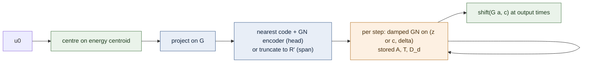

# NS3D: the paper's head and the importance-ordered bank inside the co-moving frame

Lane `exp/2026-09-23-ns3d-shift-head` (forked from the co-moving-frame lane `exp/2026-09-22-ns3d-shift-decoder`). It runs the paper's nonlinear head inside the parent's co-moving frame, and the paper's importance-ordered bank span as the tunability ladder, on 3D periodic Navier–Stokes at three meshes, each paired with a spectral FOM (CNAB2) and an iterative finite-difference FOM (FD-CG) in the same allocation. Development numbers are final for meshes 32^3, 64^3, 96^3. The held-out seed has **not** been opened. Generated by `reports/build_2026-09-23-ns3d-shift-head.py`.

## What was run

The parent lane writes the state as $u(x,t)=v(x-c(t),t)$ with $v$ in a fixed centered rank-64 POD bank $G$, and solves the frame increment $\delta=c^{n+1}-c^n$ online from the same weak residual; all reduced tensors are offline. This lane keeps that bank and frame and changes only the trial set of $v$. After a direction change from the user (correction directions removed from the paper), the two arms are:

- **(a) head only:** $v=G\,h_\theta(z)$, unknowns $(z,\delta)\in\mathbb R^{k+3}$. $h_\theta$ is the paper's head (two hidden SiLU layers of width 256 plus a linear skip), trained as an auto-decoder on the centred bank coefficients of training-seed states only. $k\in\{8,16,32\}$; $k$ is selected on development by a rule fixed in advance.
- **(b) bank span:** the bank is rotated once offline to importance order, $G_r=GV$ with $V$ the eigenvectors of the training coefficients' second moment $\Sigma$ (equivalently the SVD of $G\Sigma^{1/2}$), and $v=G_r[:, :R']\,c$ with unknowns $(c,\delta)\in\mathbb R^{R'+3}$, $R'\in\{64,48,32,16,8\}$. $R'$ is the tunability knob; $R'=64$ is the parent's linear arm in rotated coordinates.

Both are solved with the parent's fixed-sweep damped Gauss–Newton (analytic Jacobian, Cholesky); the head's Jacobian is the parent's coefficient Jacobian chained with $\partial h/\partial z$.

## Headline — the tunability ladder at every mesh

Ladder setting (dt and sweeps fixed in DESIGN.md). Worst/median = development evolved worst / median. Comparator = fastest stable FOM setting of the family no less accurate than the arm; FD-CG ratios are fast-block / after-heavy (conservative). † = no tested FD-CG setting is as accurate as the arm; the ratio is against the most accurate one, a lower bound only if a finer FD-CG setting would be slower (every tested refinement was).

| mesh | arm | unknowns | worst | median | GPU ms | CNAB2 comparator | vs CNAB2 | FD-CG comparator | vs FD-CG | job |
|---:|---|---:|---:|---:|---:|---|---:|---|---:|---|
| 32^3 | bank span R'=64 | 67 | 0.602% | 0.474% | 5.808 | CNAB2 40 steps (dt=0.005) (0.152%, 5.600 ms) | **0.96x** | none as accurate; most accurate is FD-CG 64^3, 40 steps, rtol 1e-06 (1.249%, 227.063 ms) | ≥39.10x / ≥39.49x† | 4198840 |
| 32^3 | bank span R'=48 | 51 | 0.944% | 0.654% | 4.350 | CNAB2 20 steps (dt=0.01) (0.788%, 3.230 ms) | **0.74x** | none as accurate; most accurate is FD-CG 64^3, 40 steps, rtol 1e-06 (1.249%, 227.063 ms) | ≥52.20x / ≥53.96x† | 4198840 |
| 32^3 | bank span R'=32 | 35 | 1.257% | 0.714% | 4.185 | CNAB2 20 steps (dt=0.01) (0.788%, 3.230 ms) | **0.77x** | FD-CG 64^3, 40 steps, rtol 1e-06 (1.249%, 227.063 ms) | **54.25x / 56.02x** | 4198840 |
| 32^3 | bank span R'=16 | 19 | 2.956% | 2.016% | 3.654 | CNAB2 20 steps (dt=0.01) (0.788%, 3.230 ms) | **0.88x** | FD-CG 64^3, 40 steps, rtol 1e-06 (1.249%, 227.063 ms) | **62.13x / 64.84x** | 4198840 |
| 32^3 | bank span R'=8 | 11 | 5.549% | 3.592% | 3.395 | CNAB2 20 steps (dt=0.01) (0.788%, 3.230 ms) | **0.95x** | FD-CG 32^3, 20 steps, rtol 0.0001 (4.814%, 26.016 ms) | **7.66x / 8.00x** | 4198840 |
| 32^3 | head k=8 | 11 | 0.151% | 0.090% | 6.264 | CNAB2 50 steps (dt=0.004) (0.094%, 6.837 ms) | **1.09x** | none as accurate; most accurate is FD-CG 64^3, 40 steps, rtol 1e-06 (1.249%, 227.063 ms) | ≥36.25x / ≥37.01x† | 4198840 |
| 64^3 | bank span R'=64 | 67 | 0.616% | 0.489% | 7.841 | CNAB2 40 steps (dt=0.005) (0.382%, 19.271 ms) | **2.46x** | FD-CG 128^3, 40 steps, rtol 1e-06 (0.292%, 1348.889 ms) | **172.03x / 169.04x** | 4198090 |
| 64^3 | bank span R'=48 | 51 | 1.005% | 0.635% | 5.799 | CNAB2 40 steps (dt=0.005) (0.382%, 19.271 ms) | **3.32x** | FD-CG 128^3, 40 steps, rtol 1e-06 (0.292%, 1348.889 ms) | **232.62x / 228.72x** | 4198090 |
| 64^3 | bank span R'=32 | 35 | 1.262% | 0.712% | 5.456 | CNAB2 40 steps (dt=0.005) (0.382%, 19.271 ms) | **3.53x** | FD-CG 64^3, 40 steps, rtol 0.0001 (1.152%, 98.437 ms) | **18.04x / 17.65x** | 4198090 |
| 64^3 | bank span R'=16 | 19 | 2.959% | 2.016% | 4.641 | CNAB2 40 steps (dt=0.005) (0.382%, 19.271 ms) | **4.15x** | FD-CG 64^3, 40 steps, rtol 0.0001 (1.152%, 98.437 ms) | **21.21x / 20.55x** | 4198090 |
| 64^3 | bank span R'=8 | 11 | 5.549% | 3.592% | 4.179 | CNAB2 40 steps (dt=0.005) (0.382%, 19.271 ms) | **4.61x** | FD-CG 64^3, 20 steps, rtol 0.0001 (4.889%, 57.189 ms) | **13.69x / 13.30x** | 4198090 |
| 64^3 | head k=8 | 11 | 0.152% | 0.092% | 8.194 | CNAB2 50 steps (dt=0.004) (0.093%, 23.646 ms) | **2.89x** | none as accurate; most accurate is FD-CG 128^3, 50 steps, rtol 1e-06 (0.260%, 1643.291 ms) | ≥200.55x / ≥189.84x† | 4198090 |
| 96^3 | bank span R'=64 | 67 | 0.616% | 0.489% | 15.391 | CNAB2 60 steps (dt=0.0033333) (0.063%, 106.431 ms) | **6.92x** | FD-CG 96^3, 40 steps, rtol 0.0001 (0.471%, 346.206 ms) | **22.49x / 22.15x** | 4198101 |
| 96^3 | bank span R'=48 | 51 | 1.005% | 0.635% | 12.870 | CNAB2 60 steps (dt=0.0033333) (0.063%, 106.431 ms) | **8.27x** | FD-CG 96^3, 40 steps, rtol 0.0001 (0.471%, 346.206 ms) | **26.90x / 26.98x** | 4198101 |
| 96^3 | bank span R'=32 | 35 | 1.262% | 0.712% | 11.638 | CNAB2 50 steps (dt=0.004) (1.048%, 89.528 ms) | **7.69x** | FD-CG 96^3, 40 steps, rtol 0.0001 (0.471%, 346.206 ms) | **29.75x / 29.71x** | 4198101 |
| 96^3 | bank span R'=16 | 19 | 2.959% | 2.016% | 9.158 | CNAB2 50 steps (dt=0.004) (1.048%, 89.528 ms) | **9.78x** | FD-CG 96^3, 40 steps, rtol 0.0001 (0.471%, 346.206 ms) | **37.80x / 36.79x** | 4198101 |
| 96^3 | bank span R'=8 | 11 | 5.549% | 3.592% | 8.160 | CNAB2 50 steps (dt=0.004) (1.048%, 89.528 ms) | **10.97x** | FD-CG 96^3, 40 steps, rtol 0.0001 (0.471%, 346.206 ms) | **42.42x / 41.76x** | 4198101 |
| 96^3 | head k=8 | 11 | 0.153% | 0.093% | 15.956 | CNAB2 60 steps (dt=0.0033333) (0.063%, 106.431 ms) | **6.67x** | none as accurate; most accurate is FD-CG 192^3, 50 steps, rtol 1e-06 (0.277%, 7675.730 ms) | ≥481.06x / ≥474.04x† | 4198101 |

## Findings

**32^3 (job 4198840).** The selected head (k=8) reaches 0.151% evolved worst against a head floor of 0.126%, at 6.264 ms (1.09x CNAB2). The span ladder runs from R'=64 at 0.602% / 5.808 ms (0.96x) to R'=8 at 5.549% / 3.395 ms (0.95x). Monotone in error: **True**; in cost: **True**. At equal size (R'=k=8) the span's error is 37x the head's, and the head costs 1.85x the span's time.

**64^3 (job 4198090).** The selected head (k=8) reaches 0.152% evolved worst against a head floor of 0.130%, at 8.194 ms (2.89x CNAB2). The span ladder runs from R'=64 at 0.616% / 7.841 ms (2.46x) to R'=8 at 5.549% / 4.179 ms (4.61x). Monotone in error: **True**; in cost: **True**. At equal size (R'=k=8) the span's error is 37x the head's, and the head costs 1.96x the span's time.

**96^3 (job 4198101).** The selected head (k=8) reaches 0.153% evolved worst against a head floor of 0.130%, at 15.956 ms (6.67x CNAB2). The span ladder runs from R'=64 at 0.616% / 15.391 ms (6.92x) to R'=8 at 5.549% / 8.160 ms (10.97x). Monotone in error: **True**; in cost: **True**. At equal size (R'=k=8) the span's error is 36x the head's, and the head costs 1.96x the span's time.

**Why the head is so much more accurate than the full span.** The span's error at $R'=64$ is several times its own representation floor; the gap is reduced-dynamics error in 64 linear directions (the parent lane saw the same). The head's trial set is a $k$-dimensional manifold fitted to true centred states, so the Gauss–Newton solve can only return states near that manifold, and its solved error sits close to its floor. The family is low-dimensional once translation is factored out (separation, strength, viscosity and time), which is why $k=8$ is enough and larger $k$ does not help. This is a development finding on one parametric family; it says the head removes the spurious reduced dynamics, not that it generalises beyond the family it was trained on.

**What the head costs.** It is the most expensive reduced arm per query: its unknown count is small, but each sweep evaluates the network and its Jacobian and chains it through the $M\times R$ coefficient Jacobian, and the query is launch-bound, so fewer unknowns do not buy time. The span ladder is the cost knob; the head is the accuracy end.

## The FOM solvers

**CNAB2 is spectral and performs no linear solve.** `experiments/ns3d/ns3d_fom.py:make_solver` is a Fourier pseudo-spectral Galerkin method with 2/3 dealiasing: the Crank–Nicolson viscous step is a pointwise division by $1+\tfrac12\Delta t\,\nu|k|^2$ in Fourier space, and the pressure is removed by the Leray projector $\hat u-k(k\cdot\hat u)/|k|^2$, also pointwise. Every "solve" is an FFT pair. Under the project's rule against featuring spectral/direct solvers as the comparator, it is not a rule-compliant FOM.

**FD-CG (added here) is.** `experiments/ns3d-shift-head/fd_fom.py`: second-order central differences on the same periodic grid, rotational advection with AB2, Crank–Nicolson viscous step solved by conjugate gradients, and an exact discrete projection whose central-difference Poisson problem is solved by (warm-started) conjugate gradients. It is tested at the job's mesh over steps × CG tolerances and on finer meshes ($2n$, and $3n$ at $96^3$) injected onto the coarse grid. Its error against the spectral truth is dominated by its own second-order spatial error, so matching the head's accuracy needs a much finer grid, and unpreconditioned CG on the pressure Poisson problem costs tens to hundreds of iterations per step. FD-CG speedups are therefore large and should be read as "against a plain iterative solver", not as a statement about an efficient FOM; the CNAB2 column is the honest efficiency comparison.

| mesh | cheapest FD-CG setting within 5 % | its worst | ms | most accurate FD-CG | its worst | ms | CNAB2 at similar or better accuracy | ms |
|---:|---|---:|---:|---|---:|---:|---|---:|
| 32^3 | FD-CG 32^3, 20 steps, rtol 0.0001 | 4.814% | 26.016 | FD-CG 64^3, 40 steps, rtol 1e-06 | 1.249% | 227.063 | CNAB2 20 steps (dt=0.01) | 3.230 |
| 64^3 | FD-CG 64^3, 20 steps, rtol 0.0001 | 4.889% | 57.189 | FD-CG 128^3, 50 steps, rtol 1e-06 | 0.260% | 1643.291 | CNAB2 50 steps (dt=0.004) | 23.646 |
| 96^3 | FD-CG 96^3, 40 steps, rtol 0.0001 | 0.471% | 346.206 | FD-CG 192^3, 50 steps, rtol 1e-06 | 0.277% | 7675.730 | CNAB2 60 steps (dt=0.0033333) | 106.431 |

## Held-out evaluation

Not opened.

## Gates, controls and what went wrong

- **32^3:** frozen-frame control 39.762% (16/16 over 5 %, must fail); head driver parity vs generic LM at 3 sweeps 6.9e-10; rotation gate 9.6e-16; timing gates fast-block True, after-cool-down True; NumPy audit gap 3.1e-16 (control rejected: True); timed-output agreement 0.0e+00.
- **64^3:** frozen-frame control 39.807% (16/16 over 5 %, must fail); head driver parity vs generic LM at 3 sweeps 6.3e-10; rotation gate 7.8e-16; timing gates fast-block True, after-cool-down True; NumPy audit gap 1.1e-15 (control rejected: True); timed-output agreement 0.0e+00.
- **96^3:** frozen-frame control 40.146% (16/16 over 5 %, must fail); head driver parity vs generic LM at 3 sweeps 6.7e-10; rotation gate 1.1e-15; timing gates fast-block True, after-cool-down True; NumPy audit gap 1.7e-15 (control rejected: True); timed-output agreement 0.0e+00.
- **Retracted: the v1 FD-CG timings.** `a1_h64` (job 4197294) failed the pre-registered neighbour gate: ladder arms were 17–23 % slower when timed right after the seconds-long FD-CG arm at $128^3$, while staying within 2.3 % inside the randomised fast block. Its accuracy stands (reproduced exactly by `a2_h64`); its FD-CG ratios do not. Timing v2 (DESIGN amendment 2) was introduced and every mesh rerun; the 96^3 v1 job was cancelled before timing. `a1_h32` passed the v1 gate and is kept only as a record.
- **Design changed mid-lane, before any job:** the correction directions $C_q$ were dropped at the user's direction and replaced by the importance-ordered span ladder (DESIGN amendment 1).
- **Comparator granularity.** The CNAB2 grid has no step between 40 and 50 steps at the finer meshes, and FD-CG accuracy jumps between meshes, so a comparator can be much more accurate (and slower) than the arm it is matched to; comparators, their errors and times are printed beside every ratio.

## Provenance

| job | mesh | slurm id | GPU | commit | summary.json | sha256 |
|---|---:|---:|---|---|---|---|
| a2_h32 | 32^3 | 4198840 | NVIDIA A100-PCIE-40GB | `e94d398e2f` | `experiments/ns3d-shift-head/runs/a2_h32/output/summary.json` | `301df68a58d29310e78bd64e24555ec6c2c078202c4de789800602207898c10c` |
| a2_h64 | 64^3 | 4198090 | NVIDIA A100 80GB PCIe | `229cbc5ff5` | `experiments/ns3d-shift-head/runs/a2_h64/output/summary.json` | `05b79b91a4fe94574fd1e7f4c74f6839797377549bc07eccc142d3addc27900f` |
| a3_h96 | 96^3 | 4198101 | NVIDIA A100 80GB PCIe | `229cbc5ff5` | `experiments/ns3d-shift-head/runs/a3_h96/output/summary.json` | `4217f379fd91555045f005a0f8c38b40082b565d7e336c549be77d73b8b061af` |

Per-mesh detail (floors, full frontier, FOM grids, head training, gates): `experiments/ns3d-shift-head/results/<job>.md`.

## Glossary

- **bank $G$** — fixed spatial basis (centred POD, rank 64) the reduced state lives in.
- **importance order / $G_r$, $R'$** — the bank rotated so its columns are ordered by training energy; $R'$ is how many leading columns are used.
- **head $h_\theta$, $k$** — small network mapping a $k$-number code to bank coefficients.
- **co-moving frame, $\delta$** — the vortex's translation, solved each step alongside the coefficients.
- **floor** — error of the best reconstruction a trial set allows, with the true frame, before any time stepping.
- **evolved worst / median** — per case, worst relative $L^2$ error over output times after $t=0$ (relative to $\lVert u_0\rVert$); then the worst / median over cases.
- **over 5 %** — number of cases whose evolved worst exceeds 5 %.
- **GPU ms** — median wall time of one complete query (initial centring, solve, all output fields) in the job's randomised interleaved timing block.
- **after heavy** — the same arm timed immediately after the heaviest FD-CG run; the conservative time for FD-CG ratios.
- **CNAB2** — the spectral FOM (Crank–Nicolson viscous, Adams–Bashforth-2 advection); no linear solve.
- **FD-CG** — the finite-difference FOM whose viscous and pressure systems are solved by conjugate gradients.
- **comparator** — the fastest stable FOM setting (of one family) at least as accurate as the arm; speedup = its time / the arm's time, same job.
- **sweeps** — fixed Gauss–Newton iterations per time step.
- **development / held-out** — cases used to choose settings / never-seen cases evaluated once with frozen settings.
