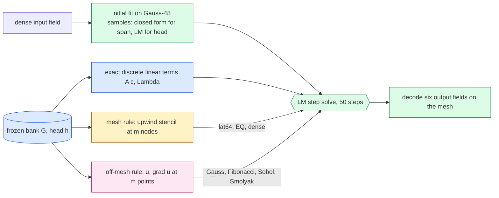

# Off-mesh quadrature for the tested advection of the full-scale Burgers 2D model

Replication of Hari's off-mesh quadrature study on the frozen Table-1 Burgers 2D model ($R=512$ bank, $K=16$ head, $256^2$–$4096^2$). Status: **PROVISIONAL: development/validation only; the test-cohort section is not yet generated**. Every number below is generated by `reports/make_report.py` from the NumPy-audited job summaries in `experiments/quadrature-study/checks/`; the pre-registration is `experiments/quadrature-study/DESIGN.md` (amendments A0–A2 and later dated inside).

## 1. What ran

| job | role | mesh | cohorts | GPU | job id | elapsed (h) | accepted | failed gates |
|---|---|---|---|---|---|---|---|---|
| `dv256` | dev | $256^2$ | dev6, val32 | NVIDIA A100 80GB PCIe | 4735696 | 0.48 | yes | none |
| `dv1024` | dev | $1024^2$ | dev6, val32 | NVIDIA A100 80GB PCIe | 4735709 | 0.83 | yes | none |
| `dv4096` | dev | $4096^2$ | dev6, val32 | NVIDIA H200 | 4735717 | 0.79 | yes | none |
| `refdv` | reference (FOM only) | $8192^2$ | dev6, val32 | NVIDIA A100 80GB PCIe | 4734273 | 4.62 | yes | none |

## 2. The hybrid reduced solve

One backward-Euler step solves for the bank coefficients $c$ (linear rung: $c=w$; head: $c=h(z)$):

$$ r(c) = S\Big(A c - p + \Delta t\,\big(N(c) + \nu\Lambda A c\big)\Big),\qquad S=(1+\Delta t\,\nu\Lambda)^{-1}. $$

The linear terms ($A=\Phi^{\mathsf T}G'$, $\Lambda$) are the exact discrete ones of the project's solver. Only the tested advection $N(c)$ changes between arms: the FOM's upwind stencil on all mesh nodes (`dense`) or on $m$ of them (mesh rules), or Hari's off-mesh form $N(c)=L\sum_q w_q\,\psi(x_q)\,u\,(u_x+u_y)(x_q)$ with the bank and its gradient decoded at the rule's points (or the flux form $-L\sum_q w_q(\psi_x+\psi_y)\,u^2/2$).

## 3. Results — development and validation (dev6 ∪ val32)

### D1. Continuum target (gate G6)

| mesh | setting | population | $\rho_{\max}$ Gauss $640^2$ vs $768^2$ | $\rho_{\max}$ flux vs point | passed |
|---|---|---|---|---|---|
| $256^2$ | acc | lat64 (1900 states) | 3.3e-08 | 3.1e-08 | yes |
| $256^2$ | acc | gref (1900 states) | 3.2e-08 | 2.9e-08 | yes |
| $256^2$ | fast | lat64 (1900 states) | 2.9e-08 | 3.2e-08 | yes |
| $256^2$ | fast | gref (1900 states) | 2.9e-08 | 3.2e-08 | yes |
| $256^2$ | head | lat64 (1900 states) | 6.1e-09 | 6.1e-09 | yes |
| $256^2$ | head | gref (1900 states) | 6.1e-09 | 6.1e-09 | yes |
| $1024^2$ | acc | lat64 (1900 states) | 4.3e-08 | 3.9e-08 | yes |
| $1024^2$ | acc | gref (1900 states) | 4.1e-08 | 3.8e-08 | yes |
| $1024^2$ | fast | lat64 (1900 states) | 3.2e-08 | 3.5e-08 | yes |
| $1024^2$ | fast | gref (1900 states) | 3.2e-08 | 3.5e-08 | yes |
| $1024^2$ | head | lat64 (1900 states) | 8.3e-09 | 8.3e-09 | yes |
| $1024^2$ | head | gref (1900 states) | 8.3e-09 | 8.3e-09 | yes |
| $4096^2$ | acc | lat64 (1900 states) | 4.3e-08 | 4.0e-08 | yes |
| $4096^2$ | acc | gref (1900 states) | 4.3e-08 | 3.9e-08 | yes |
| $4096^2$ | fast | lat64 (1900 states) | 3.3e-08 | 3.6e-08 | yes |
| $4096^2$ | fast | gref (1900 states) | 3.3e-08 | 3.6e-08 | yes |
| $4096^2$ | head | lat64 (1900 states) | 8.8e-09 | 8.9e-09 | yes |
| $4096^2$ | head | gref (1900 states) | 8.8e-09 | 8.8e-09 | yes |

### D2. $\rho$ ladders on reached states (question ii)

Worst and median $\rho$ over the states $k=1..50$ reached by the deployed `lat64` arm. *cont* = against the continuum target (Gauss $640^2$); *mesh* = against the dense upwind stencil at that mesh. Bars: 0.116 (paper primary), 0.06.

**accurate (span $R'=384$, $M=1536$)**

| rule | $m$ | cont worst / median $256^2$ | cont worst / median $1024^2$ | cont worst / median $4096^2$ | mesh worst $256^2$ | mesh worst $1024^2$ | mesh worst $4096^2$ | Hari cont worst ($M=320$) |
|---|---|---|---|---|---|---|---|---|
| dense (all mesh nodes) | mesh | 1.2e-01 / 3.3e-02 | 3.5e-02 / 8.3e-03 | 9.2e-03 / 2.1e-03 | 0.0e+00 | 0.0e+00 | 0.0e+00 | — |
| mesh lattice $15^2$ | 225 | 2.5e+00 / 2.4e+00 | 2.5e+00 / 2.4e+00 | 2.5e+00 / 2.4e+00 | 2.5e+00 | 2.5e+00 | 2.5e+00 | — |
| mesh lattice $31^2$ | 961 | 7.4e-01 / 3.5e-02 | 7.8e-01 / 1.1e-02 | 8.0e-01 / 6.0e-03 | 7.3e-01 | 7.8e-01 | 8.0e-01 | — |
| mesh lattice $63^2$ | 3969 | 1.4e-01 / 3.3e-02 | 7.1e-02 / 8.3e-03 | 5.7e-02 / 2.1e-03 | 8.6e-02 | 5.4e-02 | 5.1e-02 | — |
| mesh lattice $127^2$ | 16129 | 1.2e-01 / 3.3e-02 | 7.1e-02 / 8.4e-03 | 6.4e-02 / 2.2e-03 | 3.2e-02 | 8.4e-02 | 6.7e-02 | — |
| Gauss $8^2$ | 64 | 1.4e+01 / 6.1e+00 | 1.4e+01 / 6.1e+00 | 1.5e+01 / 6.1e+00 | 1.4e+01 | 1.4e+01 | 1.5e+01 | 4.5e+00 ($m$=64) |
| Gauss $16^2$ | 256 | 4.2e+00 / 3.1e+00 | 4.2e+00 / 3.1e+00 | 4.2e+00 / 3.1e+00 | 4.3e+00 | 4.3e+00 | 4.2e+00 | 1.5e+00 ($m$=256) |
| Gauss $24^2$ | 576 | 2.4e+00 / 2.0e+00 | 2.4e+00 / 2.0e+00 | 2.4e+00 / 2.0e+00 | 2.5e+00 | 2.5e+00 | 2.4e+00 | 3.8e-01 ($m$=576) |
| Gauss $32^2$ | 1024 | 1.6e+00 / 1.3e+00 | 1.6e+00 / 1.3e+00 | 1.6e+00 / 1.3e+00 | 1.6e+00 | 1.6e+00 | 1.6e+00 | 3.6e-02 ($m$=1024) |
| Gauss $48^2$ | 2304 | 1.5e-01 / 1.7e-03 | 1.8e-01 / 1.7e-03 | 1.9e-01 / 1.7e-03 | 1.7e-01 | 1.9e-01 | 1.9e-01 | 1.8e-04 ($m$=2304) |
| Gauss $64^2$ | 4096 | 1.2e-02 / 8.0e-04 | 1.9e-02 / 8.0e-04 | 2.3e-02 / 8.1e-04 | 1.4e-01 | 3.7e-02 | 2.6e-02 | 5.1e-06 ($m$=4096) |
| Gauss $80^2$ | 6400 | 4.7e-03 / 2.7e-04 | 5.8e-03 / 2.7e-04 | 6.8e-03 / 2.8e-04 | 1.4e-01 | 3.6e-02 | 9.9e-03 | — |
| Gauss $96^2$ | 9216 | 4.9e-03 / 4.8e-05 | 4.6e-03 / 4.8e-05 | 7.6e-03 / 4.9e-05 | 1.4e-01 | 3.7e-02 | 9.7e-03 | — |
| Gauss $128^2$ | 16384 | 2.2e-03 / 1.8e-05 | 2.1e-03 / 1.8e-05 | 5.1e-03 / 1.8e-05 | 1.4e-01 | 3.6e-02 | 9.3e-03 | — |
| Gauss $160^2$ | 25600 | 5.5e-04 / 6.5e-06 | 7.7e-04 / 6.5e-06 | 2.0e-03 / 6.6e-06 | 1.4e-01 | 3.6e-02 | 9.3e-03 | — |
| Gauss $192^2$ | 36864 | 4.7e-04 / 2.4e-06 | 4.4e-04 / 2.4e-06 | 5.0e-04 / 2.5e-06 | 1.4e-01 | 3.6e-02 | 9.2e-03 | — |
| Gauss $200^2$ | 40000 | 4.5e-04 / 1.9e-06 | 4.3e-04 / 2.0e-06 | 3.3e-04 / 2.0e-06 | 1.4e-01 | 3.6e-02 | 9.3e-03 | — |
| Gauss $256^2$ | 65536 | 7.9e-05 / 3.9e-07 | 7.3e-05 / 4.0e-07 | 7.3e-05 / 4.1e-07 | 1.4e-01 | 3.6e-02 | 9.3e-03 | — |
| Gauss $320^2$ | 102400 | 3.1e-05 / 7.2e-08 | 2.9e-05 / 7.4e-08 | 1.1e-05 / 7.6e-08 | 1.4e-01 | 3.6e-02 | 9.3e-03 | — |
| Gauss $400^2$ | 160000 | 4.1e-06 / 7.7e-09 | 3.8e-06 / 8.6e-09 | 3.5e-06 / 8.9e-09 | 1.4e-01 | 3.6e-02 | 9.3e-03 | — |
| Gauss $512^2$ | 262144 | 3.8e-07 / 6.3e-10 | 4.8e-07 / 6.6e-10 | 4.9e-07 / 6.8e-10 | 1.4e-01 | 3.6e-02 | 9.3e-03 | — |
| Fibonacci 987 | 987 | 5.0e-01 / 2.3e-02 | 5.2e-01 / 2.4e-02 | 5.3e-01 / 2.4e-02 | 5.8e-01 | 5.4e-01 | 5.4e-01 | 4.2e-02 ($m$=987) |
| Fibonacci 1597 | 1597 | 1.2e-01 / 2.4e-03 | 1.3e-01 / 2.5e-03 | 1.4e-01 / 2.5e-03 | 1.9e-01 | 1.4e-01 | 1.4e-01 | 3.0e-02 ($m$=1597) |
| Fibonacci 2584 | 2584 | 2.9e-02 / 5.4e-04 | 3.7e-02 / 5.6e-04 | 4.5e-02 / 5.6e-04 | 1.4e-01 | 5.0e-02 | 4.4e-02 | 9.8e-03 ($m$=2584) |
| Fibonacci 4181 | 4181 | 2.6e-02 / 2.3e-04 | 3.3e-02 / 2.3e-04 | 3.1e-02 / 2.4e-04 | 1.4e-01 | 3.9e-02 | 3.1e-02 | 2.0e-03 ($m$=4181) |
| Fibonacci 6765 | 6765 | 1.1e-02 / 1.2e-04 | 1.6e-02 / 1.2e-04 | 2.1e-02 / 1.2e-04 | 1.4e-01 | 3.8e-02 | 2.2e-02 | 4.5e-04 ($m$=6765) |
| Fibonacci 10946 | 10946 | 4.4e-03 / 4.1e-05 | 5.2e-03 / 4.3e-05 | 7.7e-03 / 4.4e-05 | 1.4e-01 | 3.6e-02 | 9.6e-03 | — |
| Fibonacci 17711 | 17711 | 1.1e-03 / 1.1e-05 | 1.7e-03 / 1.1e-05 | 1.9e-03 / 1.2e-05 | 1.4e-01 | 3.6e-02 | 9.0e-03 | — |
| Fibonacci 28657 | 28657 | 1.1e-03 / 2.2e-06 | 1.8e-03 / 2.3e-06 | 2.0e-03 / 2.4e-06 | 1.4e-01 | 3.6e-02 | 9.1e-03 | — |
| Fibonacci 46368 | 46368 | 2.3e-04 / 4.5e-07 | 3.1e-04 / 4.8e-07 | 3.3e-04 / 4.9e-07 | 1.4e-01 | 3.6e-02 | 9.2e-03 | — |
| Fibonacci 75025 | 75025 | 1.4e-04 / 1.6e-07 | 2.3e-04 / 1.7e-07 | 2.5e-04 / 1.7e-07 | 1.4e-01 | 3.6e-02 | 9.3e-03 | — |
| Fibonacci 121393 | 121393 | 8.2e-05 / 4.1e-08 | 1.3e-04 / 4.3e-08 | 1.5e-04 / 4.3e-08 | 1.4e-01 | 3.6e-02 | 9.3e-03 | — |
| Sobol 1024 | 1024 | 1.2e+00 / 9.7e-01 | 1.2e+00 / 9.7e-01 | 1.2e+00 / 9.7e-01 | 1.2e+00 | 1.2e+00 | 1.2e+00 | 2.2e-01 ($m$=1024) |
| Sobol 4096 | 4096 | 2.4e-01 / 2.0e-01 | 2.5e-01 / 2.0e-01 | 2.5e-01 / 2.0e-01 | 2.7e-01 | 2.5e-01 | 2.5e-01 | 2.7e-02 ($m$=4096) |
| Sobol 16384 | 16384 | 2.7e-02 / 2.1e-02 | 2.8e-02 / 2.1e-02 | 3.0e-02 / 2.1e-02 | 1.4e-01 | 4.8e-02 | 2.9e-02 | — |
| Sobol 65536 | 65536 | 5.9e-03 / 4.9e-03 | 6.0e-03 / 4.9e-03 | 6.0e-03 / 4.9e-03 | 1.4e-01 | 3.7e-02 | 1.0e-02 | — |
| Halton 4096 | 4096 | 3.2e-01 / 2.5e-01 | 3.3e-01 / 2.5e-01 | 3.3e-01 / 2.5e-01 | 3.5e-01 | 3.3e-01 | 3.3e-01 | — |
| Smolyak CC 6 | 193 | 4.4e+01 / 1.2e+01 | 4.5e+01 / 1.2e+01 | 4.5e+01 / 1.2e+01 | 4.5e+01 | 4.5e+01 | 4.5e+01 | — |
| Smolyak CC 7 | 449 | 2.1e+01 / 7.9e+00 | 2.2e+01 / 7.8e+00 | 2.2e+01 / 7.8e+00 | 2.1e+01 | 2.2e+01 | 2.2e+01 | — |
| Smolyak CC 8 | 1025 | 9.3e+00 / 5.1e+00 | 9.5e+00 / 5.1e+00 | 9.5e+00 / 5.0e+00 | 9.4e+00 | 9.5e+00 | 9.5e+00 | — |
| Smolyak CC 9 | 2305 | 4.0e+00 / 2.7e+00 | 4.1e+00 / 2.7e+00 | 4.2e+00 / 2.7e+00 | 4.1e+00 | 4.1e+00 | 4.2e+00 | — |
| Gauss $64^2$ (flux) | 4096 | 6.8e-03 / 4.3e-04 | 8.4e-03 / 4.3e-04 | 8.9e-03 / 4.4e-04 | 1.4e-01 | 3.6e-02 | 9.6e-03 | — |
| Gauss $128^2$ (flux) | 16384 | 6.5e-05 / 4.2e-07 | 1.1e-04 / 4.3e-07 | 1.0e-04 / 4.4e-07 | 1.4e-01 | 3.6e-02 | 9.3e-03 | — |
| Gauss $256^2$ (flux) | 65536 | 2.3e-06 / 6.3e-09 | 2.0e-06 / 6.4e-09 | 1.1e-06 / 6.5e-09 | 1.4e-01 | 3.6e-02 | 9.3e-03 | — |
| Fibonacci 6765 (flux) | 6765 | 2.9e-03 / 2.0e-05 | 4.9e-03 / 2.1e-05 | 6.0e-03 / 2.1e-05 | 1.4e-01 | 3.6e-02 | 9.2e-03 | — |
| Fibonacci 17711 (flux) | 17711 | 1.2e-04 / 1.1e-06 | 2.1e-04 / 1.2e-06 | 4.1e-04 / 1.3e-06 | 1.4e-01 | 3.6e-02 | 9.3e-03 | — |
| Sobol 4096 (flux) | 4096 | 4.1e+00 / 2.4e+00 | 4.1e+00 / 2.4e+00 | 4.1e+00 / 2.4e+00 | 4.1e+00 | 4.1e+00 | 4.1e+00 | — |

**fast (span $R'=128$, $M=512$)**

| rule | $m$ | cont worst / median $256^2$ | cont worst / median $1024^2$ | cont worst / median $4096^2$ | mesh worst $256^2$ | mesh worst $1024^2$ | mesh worst $4096^2$ | Hari cont worst ($M=320$) |
|---|---|---|---|---|---|---|---|---|
| dense (all mesh nodes) | mesh | 1.2e-01 / 3.3e-02 | 3.4e-02 / 8.3e-03 | 8.9e-03 / 2.1e-03 | 0.0e+00 | 0.0e+00 | 0.0e+00 | — |
| mesh lattice $15^2$ | 225 | 9.7e-01 / 4.2e-01 | 9.7e-01 / 4.3e-01 | 9.7e-01 / 4.3e-01 | 9.5e-01 | 9.7e-01 | 9.7e-01 | — |
| mesh lattice $31^2$ | 961 | 3.4e-01 / 3.3e-02 | 3.2e-01 / 8.6e-03 | 3.1e-01 / 2.6e-03 | 2.6e-01 | 3.0e-01 | 3.0e-01 | — |
| mesh lattice $63^2$ | 3969 | 1.3e-01 / 3.3e-02 | 4.9e-02 / 8.3e-03 | 4.4e-02 / 2.1e-03 | 9.0e-02 | 4.6e-02 | 4.0e-02 | — |
| mesh lattice $127^2$ | 16129 | 1.2e-01 / 3.3e-02 | 8.4e-02 / 8.3e-03 | 8.3e-02 / 2.2e-03 | 7.2e-02 | 9.9e-02 | 8.7e-02 | — |
| Gauss $8^2$ | 64 | 6.8e+00 / 3.5e+00 | 7.0e+00 / 3.5e+00 | 7.0e+00 / 3.5e+00 | 7.0e+00 | 7.0e+00 | 7.0e+00 | — |
| Gauss $16^2$ | 256 | 2.1e+00 / 1.7e+00 | 2.1e+00 / 1.7e+00 | 2.2e+00 / 1.7e+00 | 2.2e+00 | 2.2e+00 | 2.2e+00 | — |
| Gauss $24^2$ | 576 | 8.7e-01 / 2.2e-01 | 8.7e-01 / 2.2e-01 | 8.7e-01 / 2.2e-01 | 8.7e-01 | 8.7e-01 | 8.7e-01 | — |
| Gauss $32^2$ | 1024 | 1.1e-01 / 2.8e-03 | 1.1e-01 / 2.9e-03 | 1.1e-01 / 2.9e-03 | 1.4e-01 | 1.1e-01 | 1.1e-01 | — |
| Gauss $48^2$ | 2304 | 3.1e-02 / 8.4e-04 | 3.4e-02 / 8.4e-04 | 3.4e-02 / 8.4e-04 | 1.4e-01 | 4.4e-02 | 3.7e-02 | — |
| Gauss $64^2$ | 4096 | 2.0e-02 / 3.3e-04 | 2.3e-02 / 3.3e-04 | 2.4e-02 / 3.3e-04 | 1.4e-01 | 3.8e-02 | 2.6e-02 | — |
| Gauss $80^2$ | 6400 | 1.1e-02 / 5.0e-05 | 1.3e-02 / 5.0e-05 | 1.3e-02 / 5.0e-05 | 1.4e-01 | 3.6e-02 | 1.3e-02 | — |
| Gauss $96^2$ | 9216 | 9.9e-03 / 2.4e-05 | 1.1e-02 / 2.5e-05 | 1.2e-02 / 2.5e-05 | 1.3e-01 | 3.5e-02 | 9.5e-03 | — |
| Gauss $128^2$ | 16384 | 5.8e-03 / 1.4e-05 | 6.5e-03 / 1.4e-05 | 6.7e-03 / 1.4e-05 | 1.3e-01 | 3.5e-02 | 9.0e-03 | — |
| Gauss $160^2$ | 25600 | 1.4e-03 / 5.1e-06 | 1.5e-03 / 5.2e-06 | 1.6e-03 / 5.3e-06 | 1.4e-01 | 3.5e-02 | 9.0e-03 | — |
| Gauss $192^2$ | 36864 | 1.3e-03 / 2.3e-06 | 1.5e-03 / 2.3e-06 | 1.6e-03 / 2.3e-06 | 1.3e-01 | 3.5e-02 | 9.0e-03 | — |
| Gauss $200^2$ | 40000 | 1.3e-03 / 1.8e-06 | 1.4e-03 / 1.8e-06 | 1.5e-03 / 1.8e-06 | 1.3e-01 | 3.5e-02 | 9.0e-03 | — |
| Gauss $256^2$ | 65536 | 2.0e-04 / 2.9e-07 | 2.2e-04 / 3.0e-07 | 2.3e-04 / 3.0e-07 | 1.3e-01 | 3.5e-02 | 9.0e-03 | — |
| Gauss $320^2$ | 102400 | 8.0e-05 / 5.9e-08 | 9.0e-05 / 6.0e-08 | 9.3e-05 / 6.0e-08 | 1.3e-01 | 3.5e-02 | 9.0e-03 | — |
| Gauss $400^2$ | 160000 | 1.0e-05 / 5.2e-09 | 1.2e-05 / 5.3e-09 | 1.2e-05 / 5.3e-09 | 1.3e-01 | 3.5e-02 | 9.0e-03 | — |
| Gauss $512^2$ | 262144 | 8.7e-07 / 4.6e-10 | 9.8e-07 / 4.7e-10 | 1.0e-06 / 4.7e-10 | 1.3e-01 | 3.5e-02 | 9.0e-03 | — |
| Fibonacci 987 | 987 | 7.4e-02 / 1.5e-03 | 8.5e-02 / 1.6e-03 | 8.7e-02 / 1.6e-03 | 1.2e-01 | 9.0e-02 | 8.8e-02 | — |
| Fibonacci 1597 | 1597 | 5.6e-02 / 6.8e-04 | 6.5e-02 / 6.9e-04 | 6.6e-02 / 6.9e-04 | 1.4e-01 | 6.7e-02 | 6.7e-02 | — |
| Fibonacci 2584 | 2584 | 3.0e-02 / 1.5e-04 | 3.4e-02 / 1.6e-04 | 3.5e-02 / 1.6e-04 | 1.4e-01 | 3.9e-02 | 3.6e-02 | — |
| Fibonacci 4181 | 4181 | 1.6e-02 / 6.7e-05 | 1.8e-02 / 6.8e-05 | 1.8e-02 / 6.9e-05 | 1.3e-01 | 3.5e-02 | 1.9e-02 | — |
| Fibonacci 6765 | 6765 | 7.2e-03 / 2.6e-05 | 8.1e-03 / 2.8e-05 | 8.3e-03 / 2.8e-05 | 1.3e-01 | 3.5e-02 | 8.9e-03 | — |
| Fibonacci 10946 | 10946 | 3.0e-03 / 8.5e-06 | 3.4e-03 / 8.7e-06 | 3.4e-03 / 8.8e-06 | 1.3e-01 | 3.5e-02 | 8.6e-03 | — |
| Fibonacci 17711 | 17711 | 4.9e-04 / 1.3e-06 | 5.8e-04 / 1.4e-06 | 6.0e-04 / 1.4e-06 | 1.3e-01 | 3.5e-02 | 9.0e-03 | — |
| Fibonacci 28657 | 28657 | 1.9e-04 / 3.7e-07 | 2.3e-04 / 3.8e-07 | 2.4e-04 / 3.9e-07 | 1.3e-01 | 3.5e-02 | 8.9e-03 | — |
| Fibonacci 46368 | 46368 | 1.0e-04 / 1.1e-07 | 1.3e-04 / 1.2e-07 | 1.3e-04 / 1.2e-07 | 1.3e-01 | 3.5e-02 | 9.0e-03 | — |
| Fibonacci 75025 | 75025 | 4.0e-05 / 4.9e-08 | 4.8e-05 / 5.0e-08 | 5.0e-05 / 5.0e-08 | 1.3e-01 | 3.5e-02 | 9.0e-03 | — |
| Fibonacci 121393 | 121393 | 2.7e-05 / 1.9e-08 | 3.2e-05 / 1.9e-08 | 3.3e-05 / 1.9e-08 | 1.3e-01 | 3.5e-02 | 9.0e-03 | — |
| Sobol 1024 | 1024 | 4.0e-01 / 2.8e-01 | 4.2e-01 / 2.8e-01 | 4.2e-01 / 2.8e-01 | 4.4e-01 | 4.2e-01 | 4.2e-01 | — |
| Sobol 4096 | 4096 | 1.1e-01 / 3.1e-02 | 1.2e-01 / 3.2e-02 | 1.2e-01 / 3.2e-02 | 2.0e-01 | 1.4e-01 | 1.3e-01 | — |
| Sobol 16384 | 16384 | 8.4e-03 / 3.0e-03 | 9.6e-03 / 3.0e-03 | 1.0e-02 / 3.0e-03 | 1.4e-01 | 3.9e-02 | 1.5e-02 | — |
| Sobol 65536 | 65536 | 2.0e-03 / 1.2e-03 | 2.2e-03 / 1.2e-03 | 2.2e-03 / 1.2e-03 | 1.3e-01 | 3.5e-02 | 8.9e-03 | — |
| Halton 4096 | 4096 | 1.3e-01 / 9.9e-02 | 1.4e-01 / 9.9e-02 | 1.5e-01 / 9.9e-02 | 2.0e-01 | 1.4e-01 | 1.5e-01 | — |
| Smolyak CC 6 | 193 | 2.0e+01 / 5.9e+00 | 2.0e+01 / 5.9e+00 | 2.0e+01 / 5.9e+00 | 2.0e+01 | 2.0e+01 | 2.0e+01 | — |
| Smolyak CC 7 | 449 | 8.3e+00 / 3.7e+00 | 8.5e+00 / 3.7e+00 | 8.5e+00 / 3.7e+00 | 8.4e+00 | 8.5e+00 | 8.5e+00 | — |
| Smolyak CC 8 | 1025 | 3.0e+00 / 2.0e+00 | 3.0e+00 / 2.0e+00 | 3.1e+00 / 2.0e+00 | 3.0e+00 | 3.1e+00 | 3.1e+00 | — |
| Smolyak CC 9 | 2305 | 1.1e+00 / 3.5e-01 | 1.1e+00 / 3.5e-01 | 1.1e+00 / 3.6e-01 | 1.1e+00 | 1.1e+00 | 1.1e+00 | — |
| Gauss $64^2$ (flux) | 4096 | 2.3e-03 / 8.6e-05 | 2.6e-03 / 8.7e-05 | 2.7e-03 / 8.7e-05 | 1.4e-01 | 3.6e-02 | 9.1e-03 | — |
| Gauss $128^2$ (flux) | 16384 | 1.7e-04 / 4.6e-07 | 1.9e-04 / 4.7e-07 | 1.9e-04 / 4.7e-07 | 1.3e-01 | 3.5e-02 | 9.0e-03 | — |
| Gauss $256^2$ (flux) | 65536 | 7.2e-06 / 6.6e-09 | 8.1e-06 / 6.9e-09 | 8.3e-06 / 6.9e-09 | 1.3e-01 | 3.5e-02 | 9.0e-03 | — |
| Fibonacci 6765 (flux) | 6765 | 6.5e-04 / 2.4e-06 | 7.8e-04 / 2.5e-06 | 8.1e-04 / 2.6e-06 | 1.3e-01 | 3.5e-02 | 8.9e-03 | — |
| Fibonacci 17711 (flux) | 17711 | 4.4e-05 / 1.1e-07 | 5.4e-05 / 1.1e-07 | 5.6e-05 / 1.1e-07 | 1.3e-01 | 3.5e-02 | 9.0e-03 | — |
| Sobol 4096 (flux) | 4096 | 3.7e-01 / 2.0e-01 | 3.7e-01 / 2.0e-01 | 3.7e-01 / 2.0e-01 | 3.7e-01 | 3.7e-01 | 3.7e-01 | — |

**head ($k=16$, $q=0$, $M=64$)**

| rule | $m$ | cont worst / median $256^2$ | cont worst / median $1024^2$ | cont worst / median $4096^2$ | mesh worst $256^2$ | mesh worst $1024^2$ | mesh worst $4096^2$ | Hari cont worst ($M=320$) |
|---|---|---|---|---|---|---|---|---|
| dense (all mesh nodes) | mesh | 1.4e-01 / 3.2e-02 | 4.0e-02 / 8.2e-03 | 1.0e-02 / 2.0e-03 | 0.0e+00 | 0.0e+00 | 0.0e+00 | — |
| mesh lattice $15^2$ | 225 | 8.4e-01 / 3.3e-02 | 8.8e-01 / 9.3e-03 | 8.9e-01 / 3.9e-03 | 7.1e-01 | 8.4e-01 | 8.8e-01 | — |
| mesh lattice $31^2$ | 961 | 2.5e-01 / 3.3e-02 | 1.7e-01 / 8.3e-03 | 1.5e-01 / 2.1e-03 | 1.1e-01 | 1.3e-01 | 1.4e-01 | — |
| mesh lattice $63^2$ | 3969 | 1.5e-01 / 3.2e-02 | 4.6e-02 / 8.2e-03 | 1.7e-02 / 2.1e-03 | 2.6e-02 | 1.2e-02 | 1.1e-02 | — |
| mesh lattice $127^2$ | 16129 | 1.5e-01 / 3.2e-02 | 4.0e-02 / 8.2e-03 | 4.1e-02 / 2.1e-03 | 2.2e-02 | 3.9e-02 | 4.3e-02 | — |
| fitted EQ rule (q0scaled) | 1024 | 2.2e-01 / 3.2e-02 | 1.4e-01 / 8.3e-03 | 1.1e-01 / 2.2e-03 | 8.2e-02 | 1.0e-01 | 1.1e-01 | — |
| Gauss $8^2$ | 64 | 2.3e+00 / 8.9e-01 | 2.4e+00 / 8.9e-01 | 2.4e+00 / 8.9e-01 | 2.4e+00 | 2.4e+00 | 2.4e+00 | — |
| Gauss $16^2$ | 256 | 4.3e-01 / 1.3e-02 | 4.3e-01 / 1.4e-02 | 4.3e-01 / 1.4e-02 | 4.9e-01 | 4.4e-01 | 4.3e-01 | — |
| Gauss $24^2$ | 576 | 2.8e-02 / 1.4e-03 | 2.8e-02 / 1.5e-03 | 2.8e-02 / 1.5e-03 | 1.4e-01 | 3.3e-02 | 2.5e-02 | — |
| Gauss $32^2$ | 1024 | 2.2e-02 / 7.3e-04 | 3.4e-02 / 7.6e-04 | 3.7e-02 / 7.8e-04 | 1.5e-01 | 4.0e-02 | 3.8e-02 | — |
| Gauss $48^2$ | 2304 | 1.0e-02 / 3.0e-04 | 1.5e-02 / 3.0e-04 | 1.6e-02 / 3.0e-04 | 1.5e-01 | 4.2e-02 | 1.7e-02 | — |
| Gauss $64^2$ | 4096 | 7.3e-03 / 4.3e-05 | 9.4e-03 / 4.5e-05 | 1.0e-02 / 4.5e-05 | 1.5e-01 | 4.1e-02 | 1.1e-02 | — |
| Gauss $80^2$ | 6400 | 4.0e-03 / 7.9e-06 | 6.2e-03 / 8.8e-06 | 6.7e-03 / 9.0e-06 | 1.5e-01 | 4.0e-02 | 1.1e-02 | — |
| Gauss $96^2$ | 9216 | 3.7e-03 / 4.9e-06 | 5.5e-03 / 5.3e-06 | 6.0e-03 / 5.3e-06 | 1.5e-01 | 4.0e-02 | 1.0e-02 | — |
| Gauss $128^2$ | 16384 | 2.1e-03 / 3.0e-06 | 3.1e-03 / 3.6e-06 | 3.4e-03 / 3.6e-06 | 1.5e-01 | 4.0e-02 | 1.0e-02 | — |
| Gauss $160^2$ | 25600 | 4.7e-04 / 1.1e-06 | 6.7e-04 / 1.3e-06 | 7.2e-04 / 1.3e-06 | 1.5e-01 | 4.0e-02 | 1.0e-02 | — |
| Gauss $192^2$ | 36864 | 4.7e-04 / 4.1e-07 | 6.9e-04 / 4.4e-07 | 7.4e-04 / 4.5e-07 | 1.5e-01 | 4.0e-02 | 1.0e-02 | — |
| Gauss $200^2$ | 40000 | 4.5e-04 / 3.2e-07 | 6.6e-04 / 3.5e-07 | 7.1e-04 / 3.6e-07 | 1.5e-01 | 4.0e-02 | 1.0e-02 | — |
| Gauss $256^2$ | 65536 | 6.1e-05 / 5.0e-08 | 8.7e-05 / 5.4e-08 | 9.3e-05 / 5.4e-08 | 1.5e-01 | 4.0e-02 | 1.0e-02 | — |
| Gauss $320^2$ | 102400 | 2.6e-05 / 1.0e-08 | 3.7e-05 / 1.1e-08 | 4.0e-05 / 1.2e-08 | 1.5e-01 | 4.0e-02 | 1.0e-02 | — |
| Gauss $400^2$ | 160000 | 3.3e-06 / 9.8e-10 | 4.7e-06 / 1.1e-09 | 5.1e-06 / 1.1e-09 | 1.5e-01 | 4.0e-02 | 1.0e-02 | — |
| Gauss $512^2$ | 262144 | 2.1e-07 / 6.4e-11 | 3.0e-07 / 6.8e-11 | 3.2e-07 / 6.8e-11 | 1.5e-01 | 4.0e-02 | 1.0e-02 | — |
| Fibonacci 987 | 987 | 1.9e-02 / 5.1e-04 | 2.8e-02 / 5.2e-04 | 3.1e-02 / 5.3e-04 | 1.4e-01 | 3.3e-02 | 3.2e-02 | — |
| Fibonacci 1597 | 1597 | 8.4e-03 / 1.3e-04 | 1.2e-02 / 1.4e-04 | 1.3e-02 / 1.4e-04 | 1.5e-01 | 4.1e-02 | 1.4e-02 | — |
| Fibonacci 2584 | 2584 | 3.8e-03 / 1.0e-05 | 5.0e-03 / 1.1e-05 | 5.3e-03 / 1.1e-05 | 1.5e-01 | 4.0e-02 | 1.0e-02 | — |
| Fibonacci 4181 | 4181 | 1.7e-03 / 3.7e-06 | 2.5e-03 / 4.2e-06 | 2.7e-03 / 4.2e-06 | 1.5e-01 | 4.0e-02 | 1.0e-02 | — |
| Fibonacci 6765 | 6765 | 3.7e-04 / 1.1e-06 | 4.7e-04 / 1.1e-06 | 4.9e-04 / 1.1e-06 | 1.5e-01 | 4.0e-02 | 1.0e-02 | — |
| Fibonacci 10946 | 10946 | 1.4e-04 / 3.6e-07 | 2.0e-04 / 4.0e-07 | 2.1e-04 / 4.0e-07 | 1.5e-01 | 4.0e-02 | 1.0e-02 | — |
| Fibonacci 17711 | 17711 | 5.4e-05 / 9.7e-08 | 7.0e-05 / 1.0e-07 | 7.2e-05 / 1.1e-07 | 1.5e-01 | 4.0e-02 | 1.0e-02 | — |
| Fibonacci 28657 | 28657 | 2.9e-05 / 3.0e-08 | 3.9e-05 / 3.3e-08 | 4.0e-05 / 3.5e-08 | 1.5e-01 | 4.0e-02 | 1.0e-02 | — |
| Fibonacci 46368 | 46368 | 2.1e-05 / 9.5e-09 | 2.6e-05 / 1.1e-08 | 2.8e-05 / 1.1e-08 | 1.5e-01 | 4.0e-02 | 1.0e-02 | — |
| Fibonacci 75025 | 75025 | 3.8e-06 / 3.6e-09 | 5.3e-06 / 4.0e-09 | 5.7e-06 / 4.2e-09 | 1.5e-01 | 4.0e-02 | 1.0e-02 | — |
| Fibonacci 121393 | 121393 | 2.3e-06 / 1.3e-09 | 3.4e-06 / 1.6e-09 | 3.6e-06 / 1.7e-09 | 1.5e-01 | 4.0e-02 | 1.0e-02 | — |
| Sobol 1024 | 1024 | 1.1e-01 / 2.2e-02 | 1.1e-01 / 2.2e-02 | 1.1e-01 / 2.2e-02 | 1.5e-01 | 1.1e-01 | 1.1e-01 | — |
| Sobol 4096 | 4096 | 1.5e-02 / 4.5e-03 | 1.6e-02 / 4.5e-03 | 1.6e-02 / 4.5e-03 | 1.5e-01 | 4.9e-02 | 2.1e-02 | — |
| Sobol 16384 | 16384 | 1.2e-03 / 1.5e-04 | 1.4e-03 / 1.5e-04 | 1.5e-03 / 1.5e-04 | 1.5e-01 | 3.9e-02 | 9.6e-03 | — |
| Sobol 65536 | 65536 | 4.5e-04 / 4.0e-05 | 5.6e-04 / 4.0e-05 | 5.9e-04 / 4.0e-05 | 1.5e-01 | 4.0e-02 | 9.8e-03 | — |
| Halton 4096 | 4096 | 5.9e-02 / 1.4e-02 | 6.1e-02 / 1.4e-02 | 6.1e-02 / 1.4e-02 | 2.0e-01 | 9.8e-02 | 7.1e-02 | — |
| Smolyak CC 6 | 193 | 3.7e+00 / 1.1e+00 | 3.8e+00 / 1.1e+00 | 3.8e+00 / 1.1e+00 | 3.8e+00 | 3.8e+00 | 3.8e+00 | — |
| Smolyak CC 7 | 449 | 1.3e+00 / 1.9e-01 | 1.3e+00 / 2.0e-01 | 1.3e+00 / 2.0e-01 | 1.2e+00 | 1.3e+00 | 1.3e+00 | — |
| Smolyak CC 8 | 1025 | 3.3e-01 / 1.3e-02 | 3.6e-01 / 1.4e-02 | 3.7e-01 / 1.4e-02 | 3.6e-01 | 3.6e-01 | 3.7e-01 | — |
| Smolyak CC 9 | 2305 | 6.0e-02 / 2.7e-03 | 6.3e-02 / 2.8e-03 | 6.3e-02 / 2.9e-03 | 1.4e-01 | 6.3e-02 | 6.3e-02 | — |
| Gauss $64^2$ (flux) | 4096 | 9.4e-04 / 4.3e-06 | 1.4e-03 / 4.5e-06 | 1.5e-03 / 4.5e-06 | 1.5e-01 | 4.0e-02 | 1.0e-02 | — |
| Gauss $128^2$ (flux) | 16384 | 6.4e-05 / 1.0e-07 | 9.4e-05 / 1.2e-07 | 1.0e-04 / 1.2e-07 | 1.5e-01 | 4.0e-02 | 1.0e-02 | — |
| Gauss $256^2$ (flux) | 65536 | 2.6e-06 / 1.2e-09 | 3.8e-06 / 1.3e-09 | 4.1e-06 / 1.3e-09 | 1.5e-01 | 4.0e-02 | 1.0e-02 | — |
| Fibonacci 6765 (flux) | 6765 | 2.8e-05 / 1.0e-07 | 4.0e-05 / 1.0e-07 | 4.4e-05 / 1.0e-07 | 1.5e-01 | 4.0e-02 | 1.0e-02 | — |
| Fibonacci 17711 (flux) | 17711 | 6.1e-06 / 7.3e-09 | 7.7e-06 / 7.7e-09 | 8.0e-06 / 7.8e-09 | 1.5e-01 | 4.0e-02 | 1.0e-02 | — |
| Sobol 4096 (flux) | 4096 | 2.0e-02 / 9.1e-03 | 2.0e-02 / 9.1e-03 | 2.0e-02 / 9.0e-03 | 1.4e-01 | 3.5e-02 | 2.1e-02 | — |

### D3. End-to-end rollouts (question i)

**Matched comparison on the cases where dense ran** (worst over those cases, %): the off-mesh arms against dense, against both refined references. B1 is the pre-registered two-sided bar (within $\max(0.02$ pp$, 2\,\%)$ of dense on ST).

| setting | arm | ST $256^2$ | S $256^2$ | ST $1024^2$ | S $1024^2$ | ST $4096^2$ | S $4096^2$ | B1 at $256^2$, $1024^2$, $4096^2$ |
|---|---|---|---|---|---|---|---|---|
| acc | dense (all mesh nodes) | 6.205 | 4.158 | 3.383 | 1.345 | 1.913 | 0.239 | —, —, — |
| acc | mesh lattice $63^2$ | 6.205 | 4.157 | 3.384 | 1.347 | 1.913 | 0.239 | yes, yes, yes |
| acc | continuum rollout (Gauss $640^2$) | 2.747 | 1.060 | 2.747 | 1.046 | 1.820 | 0.240 | **no**, **no**, **no** |
| acc | Gauss $32^2$ | 9.862 | 7.982 | 9.659 | 7.780 | 4.302 | 3.378 | **no**, **no**, **no** |
| acc | Gauss $64^2$ | 2.747 | 1.060 | 2.746 | 1.046 | 1.819 | 0.240 | **no**, **no**, **no** |
| acc | Gauss $96^2$ | 2.747 | 1.078 | 2.747 | 1.064 | 1.820 | 0.240 | **no**, **no**, **no** |
| acc | Gauss $128^2$ | 2.747 | 1.064 | 2.747 | 1.049 | 1.820 | 0.240 | **no**, **no**, **no** |
| acc | Fibonacci 1597 | 2.755 | 1.203 | 2.754 | 1.178 | 1.818 | 0.240 | **no**, **no**, **no** |
| acc | Fibonacci 6765 | 2.747 | 1.047 | 2.746 | 1.031 | 1.820 | 0.240 | **no**, **no**, **no** |
| acc | Fibonacci 17711 | 2.747 | 1.057 | 2.747 | 1.043 | 1.820 | 0.240 | **no**, **no**, **no** |
| acc | Sobol 4096 | 2.872 | 1.515 | 2.870 | 1.516 | 1.910 | 0.537 | **no**, **no**, yes |
| acc | Gauss $64^2$ (flux) | 2.747 | 1.060 | 2.747 | 1.046 | 1.820 | 0.240 | **no**, **no**, **no** |
| fast | dense (all mesh nodes) | 6.923 | 4.974 | 5.032 | 3.480 | 2.914 | 1.899 | —, —, — |
| fast | mesh lattice $63^2$ | 6.924 | 4.974 | 5.033 | 3.480 | 2.914 | 1.899 | yes, yes, yes |
| fast | continuum rollout (Gauss $640^2$) | 4.641 | 3.464 | 4.637 | 3.451 | 2.862 | 1.907 | **no**, **no**, yes |
| fast | Gauss $32^2$ | 4.596 | 3.442 | 4.594 | 3.430 | 2.859 | 1.907 | **no**, **no**, yes |
| fast | Gauss $64^2$ | 4.640 | 3.486 | 4.636 | 3.473 | 2.862 | 1.908 | **no**, **no**, yes |
| fast | Gauss $96^2$ | 4.640 | 3.462 | 4.637 | 3.449 | 2.862 | 1.907 | **no**, **no**, yes |
| fast | Gauss $128^2$ | 4.641 | 3.464 | 4.637 | 3.451 | 2.862 | 1.907 | **no**, **no**, yes |
| fast | Fibonacci 1597 | 4.641 | 3.456 | 4.637 | 3.445 | 2.858 | 1.908 | **no**, **no**, yes |
| fast | Fibonacci 6765 | 4.641 | 3.464 | 4.637 | 3.451 | 2.862 | 1.907 | **no**, **no**, yes |
| fast | Fibonacci 17711 | 4.641 | 3.464 | 4.637 | 3.451 | 2.862 | 1.907 | **no**, **no**, yes |
| fast | Sobol 4096 | 4.651 | 3.491 | 4.647 | 3.477 | 2.881 | 1.911 | **no**, **no**, yes |
| fast | Gauss $64^2$ (flux) | 4.640 | 3.466 | 4.637 | 3.452 | 2.862 | 1.907 | **no**, **no**, yes |
| head | dense (all mesh nodes) | 7.475 | 5.534 | 5.929 | 4.374 | 3.348 | 2.429 | —, —, — |
| head | mesh lattice $63^2$ | 7.474 | 5.533 | 5.928 | 4.373 | 3.348 | 2.429 | yes, yes, yes |
| head | fitted EQ rule (q0scaled) | 7.481 | 5.540 | 5.931 | 4.376 | 3.345 | 2.428 | yes, yes, yes |
| head | continuum rollout (Gauss $640^2$) | 5.658 | 4.365 | 5.631 | 4.349 | 3.307 | 2.449 | **no**, **no**, yes |
| head | Gauss $32^2$ | 5.676 | 4.385 | 5.644 | 4.367 | 3.314 | 2.455 | **no**, **no**, yes |
| head | Gauss $64^2$ | 5.657 | 4.364 | 5.630 | 4.348 | 3.307 | 2.449 | **no**, **no**, yes |
| head | Gauss $96^2$ | 5.658 | 4.365 | 5.631 | 4.349 | 3.307 | 2.449 | **no**, **no**, yes |
| head | Gauss $128^2$ | 5.658 | 4.365 | 5.631 | 4.349 | 3.307 | 2.449 | **no**, **no**, yes |
| head | Fibonacci 1597 | 5.659 | 4.365 | 5.632 | 4.350 | 3.310 | 2.453 | **no**, **no**, yes |
| head | Fibonacci 6765 | 5.658 | 4.365 | 5.631 | 4.349 | 3.307 | 2.449 | **no**, **no**, yes |
| head | Fibonacci 17711 | 5.658 | 4.365 | 5.631 | 4.349 | 3.307 | 2.449 | **no**, **no**, yes |
| head | Sobol 4096 | 5.665 | 4.352 | 5.640 | 4.336 | 3.182 | 2.384 | **no**, **no**, **no** |
| head | Gauss $64^2$ (flux) | 5.658 | 4.365 | 5.631 | 4.349 | 3.307 | 2.449 | **no**, **no**, yes |

Worst over cases of the maximum over the five evolved output times, % of $\lVert u_0\rVert$. **ST** = against the refined reference ($8192^2$, $\Delta t/16$; primary), **S** = against the space-only refined reference ($8192^2$, $\Delta t$), **vs dense** = distance from our own dense rollout, **vs gref** = distance from the continuum rollout, **sg** = same-grid error against `fft_tight`. B1/B3 are the pre-registered bars (DESIGN §8). Refined-reference errors are scored on the $257^2$ nodes shared by every mesh (the references are stored there); same-grid and vs-dense/vs-gref errors on the full mesh. Rows have different case counts (column *cases*; dense and the Gauss-$768^2$ check run on fewer cases), so compare arms across rows only in the matched table above.

**accurate (span $R'=384$, $M=1536$) — $256^2$** (dense on 38 cases; FOM `fft_tight` vs ST worst 6.169 %, vs S worst 4.116 %)

| arm | $m$ | cases | ST worst | ST median | S worst | vs dense worst (cases) | vs gref worst | sg worst | B1 | B3 | LM its/query | non-stationary exits |
|---|---|---|---|---|---|---|---|---|---|---|---|---|
| dense (all mesh nodes) | mesh | 38 | 6.205 | 1.255 | 4.158 | — (0) | 4.258 | 0.673 | yes | — | 54 | 0 |
| mesh lattice $63^2$ | 3969 | 38 | 6.205 | 1.255 | 4.157 | 0.133 (38) | 4.257 | 0.674 | yes | **no** | 54 | 0 |
| Gauss $32^2$ | 1024 | 38 | 9.862 | 1.105 | 7.982 | 5.048 (38) | 7.864 | 5.160 | **no** | **no** | 41 | 0 |
| Gauss $48^2$ | 2304 | 38 | 2.781 | 0.909 | 1.060 | 4.261 (38) | 0.233 | 4.343 | **no** | **no** | 55 | 0 |
| Gauss $64^2$ | 4096 | 38 | 2.747 | 0.909 | 1.060 | 4.257 (38) | 0.072 | 4.336 | **no** | **no** | 55 | 0 |
| Gauss $96^2$ | 9216 | 38 | 2.747 | 0.909 | 1.078 | 4.258 (38) | 0.030 | 4.336 | **no** | yes | 54 | 0 |
| Gauss $128^2$ | 16384 | 38 | 2.747 | 0.909 | 1.064 | 4.258 (38) | 0.010 | 4.336 | **no** | yes | 55 | 0 |
| Gauss $192^2$ | 36864 | 38 | 2.747 | 0.909 | 1.061 | 4.258 (38) | 0.002 | 4.336 | **no** | yes | 55 | 0 |
| Gauss $256^2$ | 65536 | 38 | 2.747 | 0.909 | 1.060 | 4.258 (38) | 0.000 | 4.336 | **no** | yes | 55 | 0 |
| Fibonacci 1597 | 1597 | 38 | 2.755 | 0.908 | 1.203 | 4.254 (38) | 0.615 | 4.330 | **no** | **no** | 54 | 0 |
| Fibonacci 4181 | 4181 | 38 | 2.746 | 0.909 | 0.980 | 4.258 (38) | 0.174 | 4.336 | **no** | **no** | 55 | 0 |
| Fibonacci 6765 | 6765 | 38 | 2.747 | 0.909 | 1.047 | 4.257 (38) | 0.063 | 4.335 | **no** | **no** | 55 | 0 |
| Fibonacci 17711 | 17711 | 38 | 2.747 | 0.909 | 1.057 | 4.258 (38) | 0.016 | 4.336 | **no** | yes | 55 | 0 |
| Fibonacci 46368 | 46368 | 38 | 2.747 | 0.909 | 1.060 | 4.258 (38) | 0.002 | 4.336 | **no** | yes | 55 | 0 |
| Sobol 4096 | 4096 | 38 | 2.872 | 0.906 | 1.515 | 4.055 (38) | 1.557 | 4.113 | **no** | **no** | 52 | 0 |
| Gauss $64^2$ (flux) | 4096 | 38 | 2.747 | 0.909 | 1.060 | 4.258 (38) | 0.013 | 4.337 | **no** | yes | 55 | 0 |
| Fibonacci 6765 (flux) | 6765 | 38 | 2.747 | 0.909 | 1.059 | 4.258 (38) | 0.008 | 4.336 | **no** | yes | 55 | 0 |
| continuum rollout (Gauss $640^2$) | 409600 | 38 | 2.747 | 0.909 | 1.060 | — (0) | — | 4.336 | **no** | — | 55 | 0 |
| control: Smolyak CC 8 | 1025 | 38 | 43.745 | 4.792 | 42.261 | 39.641 (38) | 42.335 | 39.652 | **no** | **no** | 36 | 0 |
| control: Gauss $8^2$ | 64 | 38 | 64.667 | 17.701 | 63.465 | 61.451 (38) | 63.535 | 61.453 | **no** | **no** | 36 | 0 |

**accurate (span $R'=384$, $M=1536$) — $1024^2$** (dense on 38 cases; FOM `fft_tight` vs ST worst 3.214 %, vs S worst 1.011 %)

| arm | $m$ | cases | ST worst | ST median | S worst | vs dense worst (cases) | vs gref worst | sg worst | B1 | B3 | LM its/query | non-stationary exits |
|---|---|---|---|---|---|---|---|---|---|---|---|---|
| dense (all mesh nodes) | mesh | 38 | 3.383 | 0.982 | 1.345 | — (0) | 1.155 | 0.940 | yes | — | 55 | 0 |
| mesh lattice $63^2$ | 3969 | 38 | 3.384 | 0.982 | 1.347 | 0.267 (38) | 1.155 | 0.910 | yes | **no** | 54 | 0 |
| Gauss $32^2$ | 1024 | 38 | 9.659 | 1.107 | 7.780 | 6.814 (38) | 7.685 | 7.030 | **no** | **no** | 41 | 0 |
| Gauss $48^2$ | 2304 | 38 | 2.767 | 0.906 | 1.031 | 1.171 (38) | 0.231 | 1.546 | **no** | **no** | 55 | 0 |
| Gauss $64^2$ | 4096 | 38 | 2.746 | 0.906 | 1.046 | 1.155 (38) | 0.069 | 1.526 | **no** | **no** | 55 | 0 |
| Gauss $96^2$ | 9216 | 38 | 2.747 | 0.906 | 1.064 | 1.156 (38) | 0.029 | 1.524 | **no** | yes | 55 | 0 |
| Gauss $128^2$ | 16384 | 38 | 2.747 | 0.906 | 1.049 | 1.155 (38) | 0.010 | 1.523 | **no** | yes | 55 | 0 |
| Gauss $192^2$ | 36864 | 38 | 2.747 | 0.906 | 1.047 | 1.155 (38) | 0.002 | 1.523 | **no** | yes | 55 | 0 |
| Gauss $256^2$ | 65536 | 38 | 2.747 | 0.906 | 1.046 | 1.155 (38) | 0.000 | 1.523 | **no** | yes | 55 | 0 |
| Fibonacci 1597 | 1597 | 38 | 2.754 | 0.905 | 1.178 | 1.154 (38) | 0.606 | 1.514 | **no** | **no** | 55 | 0 |
| Fibonacci 4181 | 4181 | 38 | 2.745 | 0.906 | 0.988 | 1.155 (38) | 0.171 | 1.523 | **no** | **no** | 55 | 0 |
| Fibonacci 6765 | 6765 | 38 | 2.746 | 0.906 | 1.031 | 1.155 (38) | 0.063 | 1.519 | **no** | **no** | 55 | 0 |
| Fibonacci 17711 | 17711 | 38 | 2.747 | 0.906 | 1.043 | 1.155 (38) | 0.016 | 1.523 | **no** | yes | 55 | 0 |
| Fibonacci 46368 | 46368 | 38 | 2.747 | 0.906 | 1.046 | 1.155 (38) | 0.002 | 1.523 | **no** | yes | 55 | 0 |
| Sobol 4096 | 4096 | 38 | 2.870 | 0.905 | 1.516 | 1.722 (38) | 1.581 | 1.793 | **no** | **no** | 52 | 0 |
| Gauss $64^2$ (flux) | 4096 | 38 | 2.747 | 0.906 | 1.046 | 1.155 (38) | 0.012 | 1.522 | **no** | yes | 55 | 0 |
| Fibonacci 6765 (flux) | 6765 | 38 | 2.747 | 0.906 | 1.045 | 1.156 (38) | 0.009 | 1.524 | **no** | yes | 55 | 0 |
| continuum rollout (Gauss $640^2$) | 409600 | 38 | 2.747 | 0.906 | 1.046 | — (0) | — | 1.523 | **no** | — | 55 | 0 |
| Gauss $768^2$ rollout (G6 check) | 589824 | 6 | 1.820 | 1.240 | 0.240 | 0.834 (6) | 0.000 | 0.844 | — | yes | 54 | 0 |
| control: Smolyak CC 8 | 1025 | 38 | 43.649 | 4.773 | 42.163 | 41.528 (38) | 42.243 | 41.539 | **no** | **no** | 36 | 0 |
| control: Gauss $8^2$ | 64 | 38 | 64.651 | 17.663 | 63.449 | 62.959 (38) | 63.513 | 62.960 | **no** | **no** | 36 | 0 |

**accurate (span $R'=384$, $M=1536$) — $4096^2$** (dense on 6 cases; FOM `fft_tight` vs ST worst 2.698 %, vs S worst 0.148 %)

| arm | $m$ | cases | ST worst | ST median | S worst | vs dense worst (cases) | vs gref worst | sg worst | B1 | B3 | LM its/query | non-stationary exits |
|---|---|---|---|---|---|---|---|---|---|---|---|---|
| dense (all mesh nodes) | mesh | 6 | 1.913 | 1.231 | 0.239 | — (0) | 0.212 | 0.224 | yes | — | 54 | 0 |
| mesh lattice $63^2$ | 3969 | 38 | 2.831 | 0.926 | 0.971 | 0.013 (6) | 0.451 | 0.996 | yes | yes | 54 | 0 |
| Gauss $32^2$ | 1024 | 38 | 9.655 | 1.107 | 7.775 | 3.355 (6) | 7.680 | 7.688 | **no** | **no** | 41 | 0 |
| Gauss $48^2$ | 2304 | 38 | 2.767 | 0.906 | 1.031 | 0.209 (6) | 0.231 | 1.097 | **no** | **no** | 55 | 0 |
| Gauss $64^2$ | 4096 | 38 | 2.746 | 0.906 | 1.044 | 0.211 (6) | 0.068 | 1.077 | **no** | **no** | 55 | 0 |
| Gauss $96^2$ | 9216 | 38 | 2.747 | 0.906 | 1.062 | 0.212 (6) | 0.029 | 1.094 | **no** | yes | 55 | 0 |
| Gauss $128^2$ | 16384 | 38 | 2.747 | 0.906 | 1.048 | 0.212 (6) | 0.010 | 1.079 | **no** | yes | 55 | 0 |
| Gauss $192^2$ | 36864 | 38 | 2.747 | 0.906 | 1.045 | 0.212 (6) | 0.002 | 1.077 | **no** | yes | 55 | 0 |
| Gauss $256^2$ | 65536 | 38 | 2.747 | 0.906 | 1.044 | 0.212 (6) | 0.000 | 1.076 | **no** | yes | 55 | 0 |
| Fibonacci 1597 | 1597 | 38 | 2.754 | 0.905 | 1.177 | 0.210 (6) | 0.606 | 1.213 | **no** | **no** | 55 | 0 |
| Fibonacci 4181 | 4181 | 38 | 2.745 | 0.906 | 0.988 | 0.212 (6) | 0.170 | 1.058 | **no** | **no** | 55 | 0 |
| Fibonacci 6765 | 6765 | 38 | 2.747 | 0.906 | 1.030 | 0.212 (6) | 0.063 | 1.064 | **no** | **no** | 55 | 0 |
| Fibonacci 17711 | 17711 | 38 | 2.747 | 0.906 | 1.041 | 0.212 (6) | 0.016 | 1.073 | **no** | yes | 55 | 0 |
| Fibonacci 46368 | 46368 | 38 | 2.747 | 0.906 | 1.044 | 0.212 (6) | 0.002 | 1.076 | **no** | yes | 55 | 0 |
| Sobol 4096 | 4096 | 38 | 2.871 | 0.905 | 1.516 | 0.517 (6) | 1.581 | 1.574 | yes | **no** | 52 | 0 |
| Gauss $64^2$ (flux) | 4096 | 38 | 2.747 | 0.906 | 1.044 | 0.212 (6) | 0.012 | 1.076 | **no** | yes | 55 | 0 |
| Fibonacci 6765 (flux) | 6765 | 38 | 2.747 | 0.906 | 1.043 | 0.212 (6) | 0.009 | 1.075 | **no** | yes | 55 | 0 |
| continuum rollout (Gauss $640^2$) | 409600 | 38 | 2.747 | 0.906 | 1.044 | — (0) | — | 1.076 | **no** | — | 55 | 0 |
| control: Smolyak CC 8 | 1025 | 38 | 43.649 | 4.773 | 42.163 | 25.340 (6) | 42.242 | 42.073 | **no** | **no** | 36 | 0 |
| control: Gauss $8^2$ | 64 | 38 | 64.650 | 17.670 | 63.448 | 45.384 (6) | 63.510 | 63.370 | **no** | **no** | 36 | 0 |

**fast (span $R'=128$, $M=512$) — $256^2$** (dense on 38 cases; FOM `fft_tight` vs ST worst 6.169 %, vs S worst 4.116 %)

| arm | $m$ | cases | ST worst | ST median | S worst | vs dense worst (cases) | vs gref worst | sg worst | B1 | B3 | LM its/query | non-stationary exits |
|---|---|---|---|---|---|---|---|---|---|---|---|---|
| dense (all mesh nodes) | mesh | 38 | 6.923 | 1.292 | 4.974 | — (0) | 4.053 | 3.028 | yes | — | 51 | 0 |
| mesh lattice $63^2$ | 3969 | 38 | 6.924 | 1.292 | 4.974 | 0.117 (38) | 4.053 | 3.028 | yes | yes | 51 | 0 |
| Gauss $32^2$ | 1024 | 38 | 4.596 | 1.032 | 3.442 | 4.097 (38) | 0.280 | 5.145 | **no** | **no** | 51 | 0 |
| Gauss $48^2$ | 2304 | 38 | 4.638 | 1.035 | 3.504 | 4.065 (38) | 0.121 | 5.142 | **no** | yes | 51 | 0 |
| Gauss $64^2$ | 4096 | 38 | 4.640 | 1.036 | 3.486 | 4.054 (38) | 0.066 | 5.133 | **no** | yes | 51 | 0 |
| Gauss $96^2$ | 9216 | 38 | 4.640 | 1.036 | 3.462 | 4.053 (38) | 0.008 | 5.132 | **no** | yes | 51 | 0 |
| Gauss $128^2$ | 16384 | 38 | 4.641 | 1.036 | 3.464 | 4.053 (38) | 0.006 | 5.132 | **no** | yes | 51 | 0 |
| Gauss $192^2$ | 36864 | 38 | 4.641 | 1.036 | 3.464 | 4.053 (38) | 0.001 | 5.132 | **no** | yes | 51 | 0 |
| Gauss $256^2$ | 65536 | 38 | 4.641 | 1.036 | 3.464 | 4.053 (38) | 0.000 | 5.132 | **no** | yes | 51 | 0 |
| Fibonacci 1597 | 1597 | 38 | 4.641 | 1.036 | 3.456 | 4.053 (38) | 0.069 | 5.132 | **no** | yes | 51 | 0 |
| Fibonacci 4181 | 4181 | 38 | 4.640 | 1.036 | 3.462 | 4.053 (38) | 0.011 | 5.132 | **no** | yes | 51 | 0 |
| Fibonacci 6765 | 6765 | 38 | 4.641 | 1.036 | 3.464 | 4.053 (38) | 0.012 | 5.132 | **no** | yes | 51 | 0 |
| Fibonacci 17711 | 17711 | 38 | 4.641 | 1.036 | 3.464 | 4.053 (38) | 0.001 | 5.132 | **no** | yes | 51 | 0 |
| Fibonacci 46368 | 46368 | 38 | 4.641 | 1.036 | 3.464 | 4.053 (38) | 0.001 | 5.132 | **no** | yes | 51 | 0 |
| Sobol 4096 | 4096 | 38 | 4.651 | 1.029 | 3.491 | 4.005 (38) | 0.483 | 5.088 | **no** | **no** | 51 | 0 |
| Gauss $64^2$ (flux) | 4096 | 38 | 4.640 | 1.036 | 3.466 | 4.053 (38) | 0.006 | 5.132 | **no** | yes | 51 | 0 |
| Fibonacci 6765 (flux) | 6765 | 38 | 4.641 | 1.036 | 3.464 | 4.053 (38) | 0.001 | 5.132 | **no** | yes | 51 | 0 |
| continuum rollout (Gauss $640^2$) | 409600 | 38 | 4.641 | 1.036 | 3.464 | — (0) | — | 5.132 | **no** | — | 51 | 0 |
| control: Smolyak CC 8 | 1025 | 38 | 16.775 | 1.754 | 14.847 | 11.489 (38) | 14.955 | 11.447 | **no** | **no** | 34 | 0 |
| control: Gauss $8^2$ | 64 | 38 | 57.914 | 13.185 | 56.658 | 54.482 (38) | 56.691 | 54.485 | **no** | **no** | 33 | 0 |

**fast (span $R'=128$, $M=512$) — $1024^2$** (dense on 38 cases; FOM `fft_tight` vs ST worst 3.214 %, vs S worst 1.011 %)

| arm | $m$ | cases | ST worst | ST median | S worst | vs dense worst (cases) | vs gref worst | sg worst | B1 | B3 | LM its/query | non-stationary exits |
|---|---|---|---|---|---|---|---|---|---|---|---|---|
| dense (all mesh nodes) | mesh | 38 | 5.032 | 1.041 | 3.480 | — (0) | 1.087 | 3.308 | yes | — | 51 | 0 |
| mesh lattice $63^2$ | 3969 | 38 | 5.033 | 1.041 | 3.480 | 0.133 (38) | 1.087 | 3.308 | yes | yes | 51 | 0 |
| Gauss $32^2$ | 1024 | 38 | 4.594 | 1.031 | 3.430 | 1.146 (38) | 0.281 | 3.505 | **no** | **no** | 51 | 0 |
| Gauss $48^2$ | 2304 | 38 | 4.634 | 1.035 | 3.490 | 1.099 (38) | 0.122 | 3.541 | **no** | yes | 51 | 0 |
| Gauss $64^2$ | 4096 | 38 | 4.636 | 1.035 | 3.473 | 1.088 (38) | 0.067 | 3.529 | **no** | yes | 51 | 0 |
| Gauss $96^2$ | 9216 | 38 | 4.637 | 1.035 | 3.449 | 1.087 (38) | 0.008 | 3.530 | **no** | yes | 51 | 0 |
| Gauss $128^2$ | 16384 | 38 | 4.637 | 1.035 | 3.451 | 1.087 (38) | 0.006 | 3.530 | **no** | yes | 51 | 0 |
| Gauss $192^2$ | 36864 | 38 | 4.637 | 1.035 | 3.451 | 1.087 (38) | 0.001 | 3.530 | **no** | yes | 51 | 0 |
| Gauss $256^2$ | 65536 | 38 | 4.637 | 1.035 | 3.451 | 1.087 (38) | 0.000 | 3.530 | **no** | yes | 51 | 0 |
| Fibonacci 1597 | 1597 | 38 | 4.637 | 1.035 | 3.445 | 1.087 (38) | 0.069 | 3.530 | **no** | yes | 51 | 0 |
| Fibonacci 4181 | 4181 | 38 | 4.637 | 1.035 | 3.449 | 1.087 (38) | 0.011 | 3.530 | **no** | yes | 51 | 0 |
| Fibonacci 6765 | 6765 | 38 | 4.637 | 1.035 | 3.451 | 1.087 (38) | 0.011 | 3.530 | **no** | yes | 51 | 0 |
| Fibonacci 17711 | 17711 | 38 | 4.637 | 1.035 | 3.451 | 1.087 (38) | 0.001 | 3.530 | **no** | yes | 51 | 0 |
| Fibonacci 46368 | 46368 | 38 | 4.637 | 1.035 | 3.451 | 1.087 (38) | 0.001 | 3.530 | **no** | yes | 51 | 0 |
| Sobol 4096 | 4096 | 38 | 4.647 | 1.027 | 3.477 | 1.047 (38) | 0.483 | 3.540 | **no** | **no** | 51 | 0 |
| Gauss $64^2$ (flux) | 4096 | 38 | 4.637 | 1.035 | 3.452 | 1.087 (38) | 0.006 | 3.529 | **no** | yes | 51 | 0 |
| Fibonacci 6765 (flux) | 6765 | 38 | 4.637 | 1.035 | 3.451 | 1.087 (38) | 0.001 | 3.530 | **no** | yes | 51 | 0 |
| continuum rollout (Gauss $640^2$) | 409600 | 38 | 4.637 | 1.035 | 3.451 | — (0) | — | 3.530 | **no** | — | 51 | 0 |
| Gauss $768^2$ rollout (G6 check) | 589824 | 6 | 2.862 | 1.295 | 1.907 | 0.827 (6) | 0.000 | 1.942 | — | yes | 52 | 0 |
| control: Smolyak CC 8 | 1025 | 38 | 16.765 | 1.753 | 14.836 | 14.006 (38) | 14.946 | 13.995 | **no** | **no** | 35 | 0 |
| control: Gauss $8^2$ | 64 | 38 | 57.906 | 13.180 | 56.650 | 56.095 (38) | 56.680 | 56.122 | **no** | **no** | 33 | 0 |

**fast (span $R'=128$, $M=512$) — $4096^2$** (dense on 6 cases; FOM `fft_tight` vs ST worst 2.698 %, vs S worst 0.148 %)

| arm | $m$ | cases | ST worst | ST median | S worst | vs dense worst (cases) | vs gref worst | sg worst | B1 | B3 | LM its/query | non-stationary exits |
|---|---|---|---|---|---|---|---|---|---|---|---|---|
| dense (all mesh nodes) | mesh | 6 | 2.914 | 1.286 | 1.899 | — (0) | 0.210 | 1.894 | yes | — | 52 | 0 |
| mesh lattice $63^2$ | 3969 | 38 | 4.717 | 1.029 | 3.422 | 0.047 (6) | 0.296 | 3.413 | yes | yes | 51 | 0 |
| Gauss $32^2$ | 1024 | 38 | 4.594 | 1.031 | 3.429 | 0.216 (6) | 0.280 | 3.432 | yes | **no** | 52 | 0 |
| Gauss $48^2$ | 2304 | 38 | 4.634 | 1.035 | 3.489 | 0.207 (6) | 0.123 | 3.495 | yes | yes | 51 | 0 |
| Gauss $64^2$ | 4096 | 38 | 4.636 | 1.035 | 3.472 | 0.209 (6) | 0.067 | 3.477 | yes | yes | 51 | 0 |
| Gauss $96^2$ | 9216 | 38 | 4.637 | 1.036 | 3.449 | 0.210 (6) | 0.008 | 3.453 | yes | yes | 51 | 0 |
| Gauss $128^2$ | 16384 | 38 | 4.637 | 1.036 | 3.450 | 0.210 (6) | 0.006 | 3.454 | yes | yes | 51 | 0 |
| Gauss $192^2$ | 36864 | 38 | 4.637 | 1.036 | 3.451 | 0.210 (6) | 0.001 | 3.454 | yes | yes | 51 | 0 |
| Gauss $256^2$ | 65536 | 38 | 4.637 | 1.036 | 3.451 | 0.210 (6) | 0.000 | 3.454 | yes | yes | 51 | 0 |
| Fibonacci 1597 | 1597 | 38 | 4.637 | 1.035 | 3.445 | 0.208 (6) | 0.069 | 3.448 | yes | yes | 51 | 0 |
| Fibonacci 4181 | 4181 | 38 | 4.637 | 1.036 | 3.448 | 0.210 (6) | 0.011 | 3.452 | yes | yes | 51 | 0 |
| Fibonacci 6765 | 6765 | 38 | 4.637 | 1.036 | 3.450 | 0.210 (6) | 0.011 | 3.454 | yes | yes | 51 | 0 |
| Fibonacci 17711 | 17711 | 38 | 4.637 | 1.036 | 3.450 | 0.210 (6) | 0.001 | 3.454 | yes | yes | 51 | 0 |
| Fibonacci 46368 | 46368 | 38 | 4.637 | 1.036 | 3.451 | 0.210 (6) | 0.001 | 3.454 | yes | yes | 51 | 0 |
| Sobol 4096 | 4096 | 38 | 4.647 | 1.028 | 3.477 | 0.394 (6) | 0.483 | 3.485 | yes | **no** | 51 | 0 |
| Gauss $64^2$ (flux) | 4096 | 38 | 4.637 | 1.036 | 3.452 | 0.210 (6) | 0.006 | 3.456 | yes | yes | 51 | 0 |
| Fibonacci 6765 (flux) | 6765 | 38 | 4.637 | 1.036 | 3.450 | 0.210 (6) | 0.001 | 3.454 | yes | yes | 51 | 0 |
| continuum rollout (Gauss $640^2$) | 409600 | 38 | 4.637 | 1.036 | 3.451 | — (0) | — | 3.454 | yes | — | 51 | 0 |
| control: Smolyak CC 8 | 1025 | 38 | 16.765 | 1.753 | 14.837 | 10.678 (6) | 14.946 | 14.712 | **no** | **no** | 35 | 0 |
| control: Gauss $8^2$ | 64 | 38 | 57.906 | 13.180 | 56.650 | 39.701 (6) | 56.678 | 56.566 | **no** | **no** | 33 | 0 |

**head ($k=16$, $q=0$, $M=64$) — $256^2$** (dense on 38 cases; FOM `fft_tight` vs ST worst 6.169 %, vs S worst 4.116 %)

| arm | $m$ | cases | ST worst | ST median | S worst | vs dense worst (cases) | vs gref worst | sg worst | B1 | B3 | LM its/query | non-stationary exits |
|---|---|---|---|---|---|---|---|---|---|---|---|---|
| dense (all mesh nodes) | mesh | 38 | 7.475 | 1.437 | 5.534 | — (0) | 3.801 | 3.483 | yes | — | 85 | 0 |
| mesh lattice $63^2$ | 3969 | 38 | 7.474 | 1.437 | 5.533 | 0.085 (38) | 3.801 | 3.482 | yes | yes | 85 | 0 |
| fitted EQ rule (q0scaled) | 1024 | 38 | 7.481 | 1.437 | 5.540 | 0.646 (38) | 3.807 | 3.489 | yes | **no** | 85 | 0 |
| Gauss $32^2$ | 1024 | 38 | 5.676 | 1.323 | 4.385 | 3.775 (38) | 0.108 | 5.432 | **no** | yes | 85 | 0 |
| Gauss $48^2$ | 2304 | 38 | 5.653 | 1.324 | 4.365 | 3.820 (38) | 0.078 | 5.450 | **no** | yes | 85 | 0 |
| Gauss $64^2$ | 4096 | 38 | 5.657 | 1.325 | 4.364 | 3.802 (38) | 0.057 | 5.436 | **no** | yes | 85 | 0 |
| Gauss $96^2$ | 9216 | 38 | 5.658 | 1.325 | 4.365 | 3.801 (38) | 0.006 | 5.437 | **no** | yes | 85 | 0 |
| Gauss $128^2$ | 16384 | 38 | 5.658 | 1.325 | 4.365 | 3.801 (38) | 0.003 | 5.437 | **no** | yes | 85 | 0 |
| Gauss $192^2$ | 36864 | 38 | 5.658 | 1.325 | 4.365 | 3.801 (38) | 0.001 | 5.437 | **no** | yes | 85 | 0 |
| Gauss $256^2$ | 65536 | 38 | 5.658 | 1.325 | 4.365 | 3.801 (38) | 0.000 | 5.437 | **no** | yes | 85 | 0 |
| Fibonacci 1597 | 1597 | 38 | 5.659 | 1.325 | 4.365 | 3.802 (38) | 0.056 | 5.437 | **no** | yes | 85 | 0 |
| Fibonacci 4181 | 4181 | 38 | 5.658 | 1.325 | 4.365 | 3.801 (38) | 0.006 | 5.437 | **no** | yes | 85 | 0 |
| Fibonacci 6765 | 6765 | 38 | 5.658 | 1.325 | 4.365 | 3.801 (38) | 0.003 | 5.437 | **no** | yes | 85 | 0 |
| Fibonacci 17711 | 17711 | 38 | 5.658 | 1.325 | 4.365 | 3.801 (38) | 0.000 | 5.437 | **no** | yes | 85 | 0 |
| Fibonacci 46368 | 46368 | 38 | 5.658 | 1.325 | 4.365 | 3.801 (38) | 0.000 | 5.437 | **no** | yes | 85 | 0 |
| Sobol 4096 | 4096 | 38 | 5.665 | 1.310 | 4.352 | 3.749 (38) | 0.295 | 5.385 | **no** | yes | 84 | 0 |
| Gauss $64^2$ (flux) | 4096 | 38 | 5.658 | 1.325 | 4.365 | 3.801 (38) | 0.006 | 5.437 | **no** | yes | 85 | 0 |
| Fibonacci 6765 (flux) | 6765 | 38 | 5.658 | 1.325 | 4.365 | 3.801 (38) | 0.000 | 5.437 | **no** | yes | 85 | 0 |
| continuum rollout (Gauss $640^2$) | 409600 | 38 | 5.658 | 1.325 | 4.365 | — (0) | — | 5.437 | **no** | — | 85 | 0 |
| control: Smolyak CC 8 | 1025 | 38 | 8.455 | 1.339 | 6.639 | 4.793 (38) | 5.355 | 6.066 | **no** | **no** | 87 | 0 |
| control: Gauss $8^2$ | 64 | 38 | 61.074 | 8.672 | 59.807 | 59.500 (38) | 59.370 | 59.780 | **no** | **no** | 203 | 0 |

**head ($k=16$, $q=0$, $M=64$) — $1024^2$** (dense on 38 cases; FOM `fft_tight` vs ST worst 3.214 %, vs S worst 1.011 %)

| arm | $m$ | cases | ST worst | ST median | S worst | vs dense worst (cases) | vs gref worst | sg worst | B1 | B3 | LM its/query | non-stationary exits |
|---|---|---|---|---|---|---|---|---|---|---|---|---|
| dense (all mesh nodes) | mesh | 38 | 5.929 | 1.383 | 4.374 | — (0) | 1.006 | 4.110 | yes | — | 85 | 0 |
| mesh lattice $63^2$ | 3969 | 38 | 5.928 | 1.390 | 4.373 | 0.068 (38) | 1.006 | 4.109 | yes | yes | 86 | 0 |
| fitted EQ rule (q0scaled) | 1024 | 38 | 5.931 | 1.388 | 4.376 | 0.808 (38) | 1.304 | 4.112 | yes | **no** | 86 | 0 |
| Gauss $32^2$ | 1024 | 38 | 5.644 | 1.404 | 4.367 | 0.994 (38) | 0.148 | 4.320 | **no** | yes | 86 | 0 |
| Gauss $48^2$ | 2304 | 38 | 5.625 | 1.390 | 4.349 | 1.026 (38) | 0.106 | 4.309 | **no** | yes | 86 | 0 |
| Gauss $64^2$ | 4096 | 38 | 5.630 | 1.387 | 4.348 | 1.007 (38) | 0.076 | 4.304 | **no** | yes | 86 | 0 |
| Gauss $96^2$ | 9216 | 38 | 5.631 | 1.386 | 4.349 | 1.006 (38) | 0.007 | 4.305 | **no** | yes | 85 | 0 |
| Gauss $128^2$ | 16384 | 38 | 5.631 | 1.386 | 4.349 | 1.006 (38) | 0.004 | 4.305 | **no** | yes | 85 | 0 |
| Gauss $192^2$ | 36864 | 38 | 5.631 | 1.386 | 4.349 | 1.006 (38) | 0.001 | 4.305 | **no** | yes | 85 | 0 |
| Gauss $256^2$ | 65536 | 38 | 5.631 | 1.386 | 4.349 | 1.006 (38) | 0.000 | 4.305 | **no** | yes | 85 | 0 |
| Fibonacci 1597 | 1597 | 38 | 5.632 | 1.384 | 4.350 | 1.007 (38) | 0.058 | 4.305 | **no** | yes | 85 | 0 |
| Fibonacci 4181 | 4181 | 38 | 5.631 | 1.387 | 4.349 | 1.006 (38) | 0.007 | 4.305 | **no** | yes | 85 | 0 |
| Fibonacci 6765 | 6765 | 38 | 5.631 | 1.386 | 4.349 | 1.006 (38) | 0.005 | 4.305 | **no** | yes | 85 | 0 |
| Fibonacci 17711 | 17711 | 38 | 5.631 | 1.386 | 4.349 | 1.006 (38) | 0.001 | 4.305 | **no** | yes | 85 | 0 |
| Fibonacci 46368 | 46368 | 38 | 5.631 | 1.386 | 4.349 | 1.006 (38) | 0.000 | 4.305 | **no** | yes | 85 | 0 |
| Sobol 4096 | 4096 | 38 | 5.640 | 1.375 | 4.336 | 0.954 (38) | 0.205 | 4.279 | **no** | yes | 85 | 0 |
| Gauss $64^2$ (flux) | 4096 | 38 | 5.631 | 1.386 | 4.349 | 1.006 (38) | 0.008 | 4.305 | **no** | yes | 85 | 0 |
| Fibonacci 6765 (flux) | 6765 | 38 | 5.631 | 1.386 | 4.349 | 1.006 (38) | 0.000 | 4.305 | **no** | yes | 85 | 0 |
| continuum rollout (Gauss $640^2$) | 409600 | 38 | 5.631 | 1.386 | 4.349 | — (0) | — | 4.305 | **no** | — | 85 | 0 |
| Gauss $768^2$ rollout (G6 check) | 589824 | 6 | 3.308 | 1.597 | 2.449 | 0.818 (6) | 0.000 | 2.462 | — | yes | 86 | 0 |
| control: Smolyak CC 8 | 1025 | 38 | 8.443 | 1.365 | 6.620 | 5.010 (38) | 5.394 | 6.181 | **no** | **no** | 88 | 0 |
| control: Gauss $8^2$ | 64 | 38 | 61.151 | 8.540 | 59.885 | 59.471 (38) | 59.446 | 59.867 | **no** | **no** | 199 | 0 |

**head ($k=16$, $q=0$, $M=64$) — $4096^2$** (dense on 6 cases; FOM `fft_tight` vs ST worst 2.698 %, vs S worst 0.148 %)

| arm | $m$ | cases | ST worst | ST median | S worst | vs dense worst (cases) | vs gref worst | sg worst | B1 | B3 | LM its/query | non-stationary exits |
|---|---|---|---|---|---|---|---|---|---|---|---|---|
| dense (all mesh nodes) | mesh | 6 | 3.348 | 1.604 | 2.429 | — (0) | 0.207 | 2.415 | yes | — | 84 | 0 |
| mesh lattice $63^2$ | 3969 | 38 | 5.684 | 1.417 | 4.327 | 0.045 (6) | 0.255 | 4.299 | yes | yes | 85 | 0 |
| fitted EQ rule (q0scaled) | 1024 | 38 | 5.685 | 1.412 | 4.329 | 0.057 (6) | 0.976 | 4.300 | yes | yes | 85 | 0 |
| Gauss $32^2$ | 1024 | 38 | 5.637 | 1.428 | 4.362 | 0.196 (6) | 0.156 | 4.341 | yes | yes | 85 | 0 |
| Gauss $48^2$ | 2304 | 38 | 5.619 | 1.419 | 4.344 | 0.201 (6) | 0.113 | 4.324 | yes | yes | 85 | 0 |
| Gauss $64^2$ | 4096 | 38 | 5.624 | 1.415 | 4.343 | 0.206 (6) | 0.080 | 4.322 | yes | yes | 85 | 0 |
| Gauss $96^2$ | 9216 | 38 | 5.625 | 1.414 | 4.344 | 0.207 (6) | 0.008 | 4.323 | yes | yes | 85 | 0 |
| Gauss $128^2$ | 16384 | 38 | 5.625 | 1.414 | 4.344 | 0.207 (6) | 0.005 | 4.323 | yes | yes | 85 | 0 |
| Gauss $192^2$ | 36864 | 38 | 5.625 | 1.415 | 4.344 | 0.207 (6) | 0.001 | 4.323 | yes | yes | 85 | 0 |
| Gauss $256^2$ | 65536 | 38 | 5.625 | 1.415 | 4.344 | 0.207 (6) | 0.000 | 4.323 | yes | yes | 85 | 0 |
| Fibonacci 1597 | 1597 | 38 | 5.626 | 1.412 | 4.345 | 0.208 (6) | 0.059 | 4.324 | yes | yes | 85 | 0 |
| Fibonacci 4181 | 4181 | 38 | 5.625 | 1.415 | 4.344 | 0.207 (6) | 0.008 | 4.323 | yes | yes | 85 | 0 |
| Fibonacci 6765 | 6765 | 38 | 5.625 | 1.415 | 4.344 | 0.207 (6) | 0.006 | 4.323 | yes | yes | 85 | 0 |
| Fibonacci 17711 | 17711 | 38 | 5.625 | 1.415 | 4.344 | 0.207 (6) | 0.001 | 4.323 | yes | yes | 85 | 0 |
| Fibonacci 46368 | 46368 | 38 | 5.625 | 1.415 | 4.344 | 0.207 (6) | 0.000 | 4.323 | yes | yes | 85 | 0 |
| Sobol 4096 | 4096 | 38 | 5.634 | 1.403 | 4.332 | 0.343 (6) | 0.211 | 4.310 | **no** | yes | 85 | 0 |
| Gauss $64^2$ (flux) | 4096 | 38 | 5.625 | 1.414 | 4.344 | 0.207 (6) | 0.008 | 4.324 | yes | yes | 85 | 0 |
| Fibonacci 6765 (flux) | 6765 | 38 | 5.625 | 1.415 | 4.344 | 0.207 (6) | 0.000 | 4.323 | yes | yes | 85 | 0 |
| continuum rollout (Gauss $640^2$) | 409600 | 38 | 5.625 | 1.415 | 4.344 | — (0) | — | 4.323 | yes | — | 85 | 0 |
| control: Smolyak CC 8 | 1025 | 38 | 8.438 | 1.384 | 6.614 | 2.745 (6) | 5.394 | 6.546 | **no** | **no** | 88 | 0 |
| control: Gauss $8^2$ | 64 | 38 | 61.156 | 8.522 | 59.890 | 29.940 (6) | 59.451 | 59.887 | **no** | **no** | 196 | 0 |

### D4. Mesh invariance (B2) and the recommended rule

| setting | arm | worst ST $256^2$ | $1024^2$ | $4096^2$ | max/min | B2 |
|---|---|---|---|---|---|---|
| acc | dense (all mesh nodes) | 6.205 | 3.383 | 1.913 | 3.2432 | **no** |
| acc | mesh lattice $63^2$ | 6.205 | 3.384 | 2.831 | 2.1915 | **no** |
| acc | Gauss $32^2$ | 9.862 | 9.659 | 9.655 | 1.0214 | **no** |
| acc | Gauss $48^2$ | 2.781 | 2.767 | 2.767 | 1.0048 | yes |
| acc | Gauss $64^2$ | 2.747 | 2.746 | 2.746 | 1.0005 | yes |
| acc | Gauss $96^2$ | 2.747 | 2.747 | 2.747 | 1.0003 | yes |
| acc | Gauss $128^2$ | 2.747 | 2.747 | 2.747 | 1.0003 | yes |
| acc | Gauss $192^2$ | 2.747 | 2.747 | 2.747 | 1.0003 | yes |
| acc | Gauss $256^2$ | 2.747 | 2.747 | 2.747 | 1.0003 | yes |
| acc | Fibonacci 1597 | 2.755 | 2.754 | 2.754 | 1.0002 | yes |
| acc | Fibonacci 4181 | 2.746 | 2.745 | 2.745 | 1.0003 | yes |
| acc | Fibonacci 6765 | 2.747 | 2.746 | 2.747 | 1.0003 | yes |
| acc | Fibonacci 17711 | 2.747 | 2.747 | 2.747 | 1.0003 | yes |
| acc | Fibonacci 46368 | 2.747 | 2.747 | 2.747 | 1.0003 | yes |
| acc | Sobol 4096 | 2.872 | 2.870 | 2.871 | 1.0006 | yes |
| acc | Gauss $64^2$ (flux) | 2.747 | 2.747 | 2.747 | 1.0001 | yes |
| acc | Fibonacci 6765 (flux) | 2.747 | 2.747 | 2.747 | 1.0003 | yes |
| acc | continuum rollout (Gauss $640^2$) | 2.747 | 2.747 | 2.747 | 1.0003 | yes |
| acc | control: Smolyak CC 8 | 43.745 | 43.649 | 43.649 | 1.0022 | yes |
| acc | control: Gauss $8^2$ | 64.667 | 64.651 | 64.650 | 1.0003 | yes |
| fast | dense (all mesh nodes) | 6.923 | 5.032 | 2.914 | 2.3758 | **no** |
| fast | mesh lattice $63^2$ | 6.924 | 5.033 | 4.717 | 1.4679 | **no** |
| fast | Gauss $32^2$ | 4.596 | 4.594 | 4.594 | 1.0006 | yes |
| fast | Gauss $48^2$ | 4.638 | 4.634 | 4.634 | 1.0008 | yes |
| fast | Gauss $64^2$ | 4.640 | 4.636 | 4.636 | 1.0008 | yes |
| fast | Gauss $96^2$ | 4.640 | 4.637 | 4.637 | 1.0008 | yes |
| fast | Gauss $128^2$ | 4.641 | 4.637 | 4.637 | 1.0008 | yes |
| fast | Gauss $192^2$ | 4.641 | 4.637 | 4.637 | 1.0008 | yes |
| fast | Gauss $256^2$ | 4.641 | 4.637 | 4.637 | 1.0008 | yes |
| fast | Fibonacci 1597 | 4.641 | 4.637 | 4.637 | 1.0008 | yes |
| fast | Fibonacci 4181 | 4.640 | 4.637 | 4.637 | 1.0008 | yes |
| fast | Fibonacci 6765 | 4.641 | 4.637 | 4.637 | 1.0008 | yes |
| fast | Fibonacci 17711 | 4.641 | 4.637 | 4.637 | 1.0008 | yes |
| fast | Fibonacci 46368 | 4.641 | 4.637 | 4.637 | 1.0008 | yes |
| fast | Sobol 4096 | 4.651 | 4.647 | 4.647 | 1.0008 | yes |
| fast | Gauss $64^2$ (flux) | 4.640 | 4.637 | 4.637 | 1.0008 | yes |
| fast | Fibonacci 6765 (flux) | 4.641 | 4.637 | 4.637 | 1.0008 | yes |
| fast | continuum rollout (Gauss $640^2$) | 4.641 | 4.637 | 4.637 | 1.0008 | yes |
| fast | control: Smolyak CC 8 | 16.775 | 16.765 | 16.765 | 1.0006 | yes |
| fast | control: Gauss $8^2$ | 57.914 | 57.906 | 57.906 | 1.0001 | yes |
| head | dense (all mesh nodes) | 7.475 | 5.929 | 3.348 | 2.2326 | **no** |
| head | mesh lattice $63^2$ | 7.474 | 5.928 | 5.684 | 1.3149 | **no** |
| head | fitted EQ rule (q0scaled) | 7.481 | 5.931 | 5.685 | 1.3158 | **no** |
| head | Gauss $32^2$ | 5.676 | 5.644 | 5.637 | 1.0068 | yes |
| head | Gauss $48^2$ | 5.653 | 5.625 | 5.619 | 1.0060 | yes |
| head | Gauss $64^2$ | 5.657 | 5.630 | 5.624 | 1.0060 | yes |
| head | Gauss $96^2$ | 5.658 | 5.631 | 5.625 | 1.0060 | yes |
| head | Gauss $128^2$ | 5.658 | 5.631 | 5.625 | 1.0060 | yes |
| head | Gauss $192^2$ | 5.658 | 5.631 | 5.625 | 1.0060 | yes |
| head | Gauss $256^2$ | 5.658 | 5.631 | 5.625 | 1.0060 | yes |
| head | Fibonacci 1597 | 5.659 | 5.632 | 5.626 | 1.0059 | yes |
| head | Fibonacci 4181 | 5.658 | 5.631 | 5.625 | 1.0060 | yes |
| head | Fibonacci 6765 | 5.658 | 5.631 | 5.625 | 1.0060 | yes |
| head | Fibonacci 17711 | 5.658 | 5.631 | 5.625 | 1.0060 | yes |
| head | Fibonacci 46368 | 5.658 | 5.631 | 5.625 | 1.0060 | yes |
| head | Sobol 4096 | 5.665 | 5.640 | 5.634 | 1.0056 | yes |
| head | Gauss $64^2$ (flux) | 5.658 | 5.631 | 5.625 | 1.0060 | yes |
| head | Fibonacci 6765 (flux) | 5.658 | 5.631 | 5.625 | 1.0060 | yes |
| head | continuum rollout (Gauss $640^2$) | 5.658 | 5.631 | 5.625 | 1.0060 | yes |
| head | control: Smolyak CC 8 | 8.455 | 8.443 | 8.438 | 1.0020 | yes |
| head | control: Gauss $8^2$ | 61.074 | 61.151 | 61.156 | 1.0013 | yes |

**Pre-registered recommended off-mesh rule** (smallest $m$ passing B1, B3 and B5 at all three meshes, fixed before the test jobs): acc: none; fast: none; head: none.

**Post hoc (not pre-registered; fixed before the test jobs, DESIGN A3)** — with B1 read one-sided (not worse than dense): acc: Gauss $96^2$; fast: Fibonacci 1597; head: Gauss $32^2$.

| setting | arm | $m$ | B1 (two-sided) at $256^2/1024^2/4096^2$ | B1′ one-sided | B3 | B5 | continuum $\rho_{\max}$ at $4096^2$ |
|---|---|---|---|---|---|---|---|
| acc | mesh lattice $63^2$ | 3969 | y/y/y | y/y/y | n/n/y | **no** | 5.7e-02 |
| acc | Gauss $32^2$ | 1024 | n/n/n | n/n/n | n/n/n | **no** | 1.6e+00 |
| acc | Gauss $48^2$ | 2304 | n/n/n | y/y/y | n/n/n | **no** | 1.9e-01 |
| acc | Gauss $64^2$ | 4096 | n/n/n | y/y/y | n/n/n | yes | 2.3e-02 |
| acc | Gauss $96^2$ | 9216 | n/n/n | y/y/y | y/y/y | yes | 7.6e-03 |
| acc | Gauss $128^2$ | 16384 | n/n/n | y/y/y | y/y/y | yes | 5.1e-03 |
| acc | Gauss $192^2$ | 36864 | n/n/n | y/y/y | y/y/y | yes | 5.0e-04 |
| acc | Gauss $256^2$ | 65536 | n/n/n | y/y/y | y/y/y | yes | 7.3e-05 |
| acc | Fibonacci 1597 | 1597 | n/n/n | y/y/y | n/n/n | **no** | 1.4e-01 |
| acc | Fibonacci 4181 | 4181 | n/n/n | y/y/y | n/n/n | yes | 3.1e-02 |
| acc | Fibonacci 6765 | 6765 | n/n/n | y/y/y | n/n/n | yes | 2.1e-02 |
| acc | Fibonacci 17711 | 17711 | n/n/n | y/y/y | y/y/y | yes | 1.9e-03 |
| acc | Fibonacci 46368 | 46368 | n/n/n | y/y/y | y/y/y | yes | 3.3e-04 |
| acc | Sobol 4096 | 4096 | n/n/y | y/y/y | n/n/n | **no** | 2.5e-01 |
| acc | Gauss $64^2$ (flux) | 4096 | n/n/n | y/y/y | y/y/y | yes | 8.9e-03 |
| acc | Fibonacci 6765 (flux) | 6765 | n/n/n | y/y/y | y/y/y | yes | 6.0e-03 |
| acc | control: Smolyak CC 8 | 1025 | n/n/n | n/n/n | n/n/n | **no** | 9.5e+00 |
| acc | control: Gauss $8^2$ | 64 | n/n/n | n/n/n | n/n/n | **no** | 1.5e+01 |
| fast | mesh lattice $63^2$ | 3969 | y/y/y | y/y/y | y/y/y | **no** | 4.4e-02 |
| fast | Gauss $32^2$ | 1024 | n/n/y | y/y/y | n/n/n | yes | 1.1e-01 |
| fast | Gauss $48^2$ | 2304 | n/n/y | y/y/y | y/y/y | yes | 3.4e-02 |
| fast | Gauss $64^2$ | 4096 | n/n/y | y/y/y | y/y/y | yes | 2.4e-02 |
| fast | Gauss $96^2$ | 9216 | n/n/y | y/y/y | y/y/y | yes | 1.2e-02 |
| fast | Gauss $128^2$ | 16384 | n/n/y | y/y/y | y/y/y | yes | 6.7e-03 |
| fast | Gauss $192^2$ | 36864 | n/n/y | y/y/y | y/y/y | yes | 1.6e-03 |
| fast | Gauss $256^2$ | 65536 | n/n/y | y/y/y | y/y/y | yes | 2.3e-04 |
| fast | Fibonacci 1597 | 1597 | n/n/y | y/y/y | y/y/y | yes | 6.6e-02 |
| fast | Fibonacci 4181 | 4181 | n/n/y | y/y/y | y/y/y | yes | 1.8e-02 |
| fast | Fibonacci 6765 | 6765 | n/n/y | y/y/y | y/y/y | yes | 8.3e-03 |
| fast | Fibonacci 17711 | 17711 | n/n/y | y/y/y | y/y/y | yes | 6.0e-04 |
| fast | Fibonacci 46368 | 46368 | n/n/y | y/y/y | y/y/y | yes | 1.3e-04 |
| fast | Sobol 4096 | 4096 | n/n/y | y/y/y | n/n/n | **no** | 1.2e-01 |
| fast | Gauss $64^2$ (flux) | 4096 | n/n/y | y/y/y | y/y/y | yes | 2.7e-03 |
| fast | Fibonacci 6765 (flux) | 6765 | n/n/y | y/y/y | y/y/y | yes | 8.1e-04 |
| fast | control: Smolyak CC 8 | 1025 | n/n/n | n/n/n | n/n/n | **no** | 3.1e+00 |
| fast | control: Gauss $8^2$ | 64 | n/n/n | n/n/n | n/n/n | **no** | 7.0e+00 |
| head | mesh lattice $63^2$ | 3969 | y/y/y | y/y/y | y/y/y | **no** | 1.7e-02 |
| head | fitted EQ rule (q0scaled) | 1024 | y/y/y | y/y/y | n/n/y | **no** | 1.1e-01 |
| head | Gauss $32^2$ | 1024 | n/n/y | y/y/y | y/y/y | yes | 3.7e-02 |
| head | Gauss $48^2$ | 2304 | n/n/y | y/y/y | y/y/y | yes | 1.6e-02 |
| head | Gauss $64^2$ | 4096 | n/n/y | y/y/y | y/y/y | yes | 1.0e-02 |
| head | Gauss $96^2$ | 9216 | n/n/y | y/y/y | y/y/y | yes | 6.0e-03 |
| head | Gauss $128^2$ | 16384 | n/n/y | y/y/y | y/y/y | yes | 3.4e-03 |
| head | Gauss $192^2$ | 36864 | n/n/y | y/y/y | y/y/y | yes | 7.4e-04 |
| head | Gauss $256^2$ | 65536 | n/n/y | y/y/y | y/y/y | yes | 9.3e-05 |
| head | Fibonacci 1597 | 1597 | n/n/y | y/y/y | y/y/y | yes | 1.3e-02 |
| head | Fibonacci 4181 | 4181 | n/n/y | y/y/y | y/y/y | yes | 2.7e-03 |
| head | Fibonacci 6765 | 6765 | n/n/y | y/y/y | y/y/y | yes | 4.9e-04 |
| head | Fibonacci 17711 | 17711 | n/n/y | y/y/y | y/y/y | yes | 7.2e-05 |
| head | Fibonacci 46368 | 46368 | n/n/y | y/y/y | y/y/y | yes | 2.8e-05 |
| head | Sobol 4096 | 4096 | n/n/n | y/y/y | y/y/y | yes | 1.6e-02 |
| head | Gauss $64^2$ (flux) | 4096 | n/n/y | y/y/y | y/y/y | yes | 1.5e-03 |
| head | Fibonacci 6765 (flux) | 6765 | n/n/y | y/y/y | y/y/y | yes | 4.4e-05 |
| head | control: Smolyak CC 8 | 1025 | n/n/n | n/n/n | n/n/n | **no** | 3.7e-01 |
| head | control: Gauss $8^2$ | 64 | n/n/n | n/n/n | n/n/n | **no** | 2.4e+00 |

### D5. Cost (question iii)

Same-GPU cross-mesh panel inside `dv4096` (NVIDIA H200): median solve time (median query minus median decode, ms; 6 cases × 3 repetitions) of each arm at $256^2$, $1024^2$, $4096^2$, and the pre-registered flat-cost bar B4 (ratio $4096^2/256^2\in[0.8,1.25]$). The full query also decodes six output fields on the mesh, which grows with $N$ (decode column), so full-query time is not flat.

| setting | arm | $256^2$ | $1024^2$ | $4096^2$ | ratio | B4 |
|---|---|---|---|---|---|---|
| acc | mesh lattice $63^2$ | 46.9 | 47.1 | 46.3 | 0.988 | yes |
| acc | Gauss $32^2$ | 24.5 | 24.4 | 23.3 | 0.952 | yes |
| acc | Gauss $48^2$ | 33.1 | 33.6 | 32.7 | 0.990 | yes |
| acc | Gauss $64^2$ | 40.2 | 40.5 | 39.7 | 0.986 | yes |
| acc | Gauss $96^2$ | 55.7 | 55.8 | 54.5 | 0.977 | yes |
| acc | Gauss $128^2$ | 79.5 | 78.7 | 78.2 | 0.984 | yes |
| acc | Gauss $192^2$ | 145.2 | 145.2 | 144.6 | 0.996 | yes |
| acc | Gauss $256^2$ | 240.8 | 239.8 | 239.1 | 0.993 | yes |
| acc | Fibonacci 1597 | 31.5 | 31.5 | 30.9 | 0.979 | yes |
| acc | Fibonacci 4181 | 45.6 | 45.5 | 44.2 | 0.970 | yes |
| acc | Fibonacci 6765 | 54.0 | 54.0 | 53.3 | 0.988 | yes |
| acc | Fibonacci 17711 | 106.7 | 107.1 | 105.4 | 0.988 | yes |
| acc | Fibonacci 46368 | 182.4 | 181.9 | 182.1 | 0.999 | yes |
| fast | mesh lattice $63^2$ | 18.7 | 18.6 | 18.7 | 1.000 | yes |
| fast | Gauss $32^2$ | 11.7 | 11.8 | 11.7 | 0.998 | yes |
| fast | Gauss $48^2$ | 13.4 | 14.4 | 14.2 | 1.060 | yes |
| fast | Gauss $64^2$ | 16.3 | 16.3 | 16.4 | 1.003 | yes |
| fast | Gauss $96^2$ | 18.6 | 18.9 | 18.9 | 1.011 | yes |
| fast | Gauss $128^2$ | 22.9 | 23.1 | 23.1 | 1.009 | yes |
| fast | Gauss $192^2$ | 33.9 | 33.9 | 33.9 | 1.000 | yes |
| fast | Gauss $256^2$ | 49.0 | 49.0 | 49.0 | 1.001 | yes |
| fast | Fibonacci 1597 | 13.3 | 13.4 | 13.3 | 1.001 | yes |
| fast | Fibonacci 4181 | 17.0 | 17.1 | 17.3 | 1.021 | yes |
| fast | Fibonacci 6765 | 19.9 | 19.9 | 20.0 | 1.005 | yes |
| fast | Fibonacci 17711 | 29.5 | 29.6 | 29.4 | 0.995 | yes |
| fast | Fibonacci 46368 | 53.8 | 53.9 | 53.9 | 1.003 | yes |
| head | mesh lattice $63^2$ | 39.5 | 40.4 | 40.6 | 1.029 | yes |
| head | fitted EQ rule (q0scaled) | 23.3 | 25.3 | 22.5 | 0.963 | yes |
| head | Gauss $32^2$ | 22.8 | 22.8 | 22.3 | 0.978 | yes |
| head | Gauss $48^2$ | 26.1 | 27.5 | 24.5 | 0.937 | yes |
| head | Gauss $64^2$ | 27.9 | 29.1 | 28.8 | 1.029 | yes |
| head | Gauss $96^2$ | 32.7 | 33.8 | 32.6 | 0.996 | yes |
| head | Gauss $128^2$ | 37.1 | 37.6 | 36.6 | 0.985 | yes |
| head | Gauss $192^2$ | 52.1 | 53.6 | 52.2 | 1.002 | yes |
| head | Gauss $256^2$ | 73.4 | 73.4 | 72.6 | 0.989 | yes |
| head | Fibonacci 1597 | 28.0 | 27.6 | 27.5 | 0.981 | yes |
| head | Fibonacci 4181 | 31.7 | 32.2 | 30.9 | 0.975 | yes |
| head | Fibonacci 6765 | 36.1 | 36.5 | 36.1 | 0.999 | yes |
| head | Fibonacci 17711 | 49.5 | 51.5 | 49.1 | 0.992 | yes |
| head | Fibonacci 46368 | 90.4 | 88.5 | 87.3 | 0.966 | yes |

**Cost beside the deployed `lat64` (post hoc rules of D4)**, same H200 job at $4096^2$: solve and full-query ms, hyper-reduction error (the B3 metric) and worst same-grid error. Caveat: this is not a matched equal-accuracy comparison — the B3 metric is measured against different targets (off-mesh: the continuum rollout, all cases; `lat64`: the dense rollout, the six dense cases), and the two families converge to different solutions (the continuum vs the upwind stencil).

| setting | arm | $m$ | solve ms | query ms | B3 metric worst % | sg worst % |
|---|---|---|---|---|---|---|
| acc | mesh lattice $63^2$ | 3969 | 46.3 | 60.1 | 0.013 | 0.996 |
| acc | Gauss $96^2$ | 9216 | 54.5 | 68.3 | 0.029 | 1.094 |
| fast | mesh lattice $63^2$ | 3969 | 18.7 | 23.5 | 0.047 | 3.413 |
| fast | Fibonacci 1597 | 1597 | 13.3 | 18.1 | 0.069 | 3.448 |
| head | mesh lattice $63^2$ | 3969 | 40.6 | 58.7 | 0.045 | 4.299 |
| head | Gauss $32^2$ | 1024 | 22.3 | 40.4 | 0.156 | 4.341 |

Per-mesh query time (dense input field on the GPU → six output fields), decode time, and the two full-order settings, each from its own job (medians; same-job comparisons only):

| mesh | GPU | setting | lat64 query ms | decode ms | Gauss $64^2$ query ms | Fibonacci 6765 query ms | Gauss $128^2$ query ms | Fibonacci 17711 query ms | FOM `lean_tight` ms | FOM `lean_nt3e-3_l3e-3_dt005` ms (worst sg %) |
|---|---|---|---|---|---|---|---|---|---|---|
| $256^2$ | NVIDIA A100 80GB PCIe | acc | 80.8 | 0.2 | 76.7 | 117.1 | 200.6 | 250.0 | 88.7 | 18.1 (0.048) |
| $256^2$ | NVIDIA A100 80GB PCIe | fast | 31.1 | 0.1 | 27.6 | 34.4 | 43.5 | 58.1 | 88.7 | 18.1 (0.048) |
| $256^2$ | NVIDIA A100 80GB PCIe | head | 60.5 | 0.3 | 40.2 | 56.7 | 62.2 | 82.6 | 88.7 | 18.1 (0.048) |
| $1024^2$ | NVIDIA A100 80GB PCIe | acc | 82.3 | 2.1 | 79.0 | 119.7 | 203.5 | 254.8 | 444.5 | 71.4 (0.048) |
| $1024^2$ | NVIDIA A100 80GB PCIe | fast | 31.6 | 0.8 | 27.6 | 34.8 | 43.9 | 58.9 | 444.5 | 71.4 (0.048) |
| $1024^2$ | NVIDIA A100 80GB PCIe | head | 64.6 | 2.8 | 44.6 | 60.3 | 64.4 | 86.3 | 444.5 | 71.4 (0.048) |
| $4096^2$ | NVIDIA H200 | acc | 60.1 | 13.8 | 53.5 | 67.2 | 92.0 | 119.2 | 3280 | 525.0 (0.050) |
| $4096^2$ | NVIDIA H200 | fast | 23.5 | 4.8 | 21.1 | 24.8 | 27.9 | 34.2 | 3280 | 525.0 (0.050) |
| $4096^2$ | NVIDIA H200 | head | 58.7 | 18.1 | 46.9 | 54.2 | 54.7 | 67.2 | 3280 | 525.0 (0.050) |

### D6. Where the worst states are (question iv)

For each rule, the state with the largest continuum $\rho$: its case's bump width $w$, amplitude $a$, viscosity $\nu$ and step $k$; the Spearman correlation between a case's largest $\rho$ and $w$ (negative = narrower bumps are worse); and the share of the top 1 % of states that are within the first five steps. Columns marked † were added after the first development job and are descriptive, not pre-registered.

| mesh | setting | rule | worst $\rho$ | case | $w$ | $a$ | $\nu$ | $k$ | Spearman($\rho$, $w$) | top-1 % with $k\le5$ | Spearman($\rho$, $\nu$)† | median $k$ of top 1 %† |
|---|---|---|---|---|---|---|---|---|---|---|---|---|
| $256^2$ | acc | Gauss $64^2$ | 1.2e-02 | val3219 | 0.158 | 1.87 | 0.011 | 50 | +0.25 | 11 % | -0.65 | 41 |
| $256^2$ | acc | Gauss $128^2$ | 2.2e-03 | dev63 | 0.136 | 1.28 | 0.018 | 1 | +0.44 | 53 % | -0.29 | 1 |
| $256^2$ | acc | Fibonacci 6765 | 1.1e-02 | dev63 | 0.136 | 1.28 | 0.018 | 1 | +0.52 | 26 % | -0.38 | 23 |
| $256^2$ | acc | Fibonacci 17711 | 1.1e-03 | val325 | 0.111 | 1.93 | 0.012 | 33 | +0.47 | 11 % | -0.35 | 33 |
| $256^2$ | acc | Sobol 4096 | 2.4e-01 | val321 | 0.071 | 0.76 | 0.051 | 1 | -0.33 | 26 % | -0.33 | 19 |
| $256^2$ | acc | mesh lattice $63^2$ | 1.4e-01 | val3211 | 0.182 | 0.60 | 0.018 | 1 | -0.29 | 5 % | -0.42 | 29 |
| $256^2$ | fast | Gauss $64^2$ | 2.0e-02 | val327 | 0.188 | 1.81 | 0.016 | 1 | +0.60 | 100 % | -0.35 | 1 |
| $256^2$ | fast | Gauss $128^2$ | 5.8e-03 | val3231 | 0.168 | 0.83 | 0.046 | 1 | +0.62 | 100 % | -0.19 | 1 |
| $256^2$ | fast | Fibonacci 6765 | 7.2e-03 | val3231 | 0.168 | 0.83 | 0.046 | 1 | +0.63 | 100 % | -0.26 | 1 |
| $256^2$ | fast | Fibonacci 17711 | 4.9e-04 | val3210 | 0.188 | 1.17 | 0.063 | 1 | +0.56 | 100 % | -0.30 | 1 |
| $256^2$ | fast | Sobol 4096 | 1.1e-01 | val325 | 0.111 | 1.93 | 0.012 | 30 | -0.44 | 0 % | -0.33 | 32 |
| $256^2$ | fast | mesh lattice $63^2$ | 1.3e-01 | val325 | 0.111 | 1.93 | 0.012 | 28 | -0.48 | 0 % | -0.37 | 30 |
| $256^2$ | head | Gauss $64^2$ | 7.3e-03 | val327 | 0.188 | 1.81 | 0.016 | 1 | +0.63 | 95 % | -0.26 | 1 |
| $256^2$ | head | Gauss $128^2$ | 2.1e-03 | val3231 | 0.168 | 0.83 | 0.046 | 1 | +0.58 | 100 % | -0.14 | 1 |
| $256^2$ | head | Fibonacci 6765 | 3.7e-04 | val327 | 0.188 | 1.81 | 0.016 | 1 | +0.56 | 21 % | -0.23 | 34 |
| $256^2$ | head | Fibonacci 17711 | 5.4e-05 | val3211 | 0.182 | 0.60 | 0.018 | 1 | +0.51 | 63 % | -0.25 | 2 |
| $256^2$ | head | Sobol 4096 | 1.5e-02 | val3218 | 0.140 | 1.76 | 0.021 | 40 | -0.39 | 0 % | -0.26 | 41 |
| $256^2$ | head | mesh lattice $63^2$ | 1.5e-01 | val325 | 0.111 | 1.93 | 0.012 | 32 | -0.63 | 0 % | -0.36 | 34 |
| $1024^2$ | acc | Gauss $64^2$ | 1.9e-02 | val325 | 0.111 | 1.93 | 0.012 | 1 | +0.35 | 16 % | -0.62 | 41 |
| $1024^2$ | acc | Gauss $128^2$ | 2.1e-03 | val320 | 0.194 | 0.92 | 0.018 | 1 | +0.48 | 47 % | -0.32 | 29 |
| $1024^2$ | acc | Fibonacci 6765 | 1.6e-02 | val3211 | 0.182 | 0.60 | 0.018 | 1 | +0.55 | 37 % | -0.41 | 29 |
| $1024^2$ | acc | Fibonacci 17711 | 1.7e-03 | val325 | 0.111 | 1.93 | 0.012 | 32 | +0.47 | 5 % | -0.40 | 34 |
| $1024^2$ | acc | Sobol 4096 | 2.5e-01 | val3217 | 0.153 | 1.86 | 0.025 | 20 | -0.38 | 21 % | -0.31 | 20 |
| $1024^2$ | acc | mesh lattice $63^2$ | 7.1e-02 | val325 | 0.111 | 1.93 | 0.012 | 29 | +0.00 | 5 % | -0.52 | 30 |
| $1024^2$ | fast | Gauss $64^2$ | 2.3e-02 | val327 | 0.188 | 1.81 | 0.016 | 1 | +0.61 | 100 % | -0.35 | 1 |
| $1024^2$ | fast | Gauss $128^2$ | 6.5e-03 | val3231 | 0.168 | 0.83 | 0.046 | 1 | +0.64 | 100 % | -0.18 | 1 |
| $1024^2$ | fast | Fibonacci 6765 | 8.1e-03 | val3231 | 0.168 | 0.83 | 0.046 | 1 | +0.64 | 100 % | -0.26 | 1 |
| $1024^2$ | fast | Fibonacci 17711 | 5.8e-04 | val3210 | 0.188 | 1.17 | 0.063 | 1 | +0.56 | 100 % | -0.31 | 1 |
| $1024^2$ | fast | Sobol 4096 | 1.2e-01 | val325 | 0.111 | 1.93 | 0.012 | 29 | -0.41 | 0 % | -0.38 | 32 |
| $1024^2$ | fast | mesh lattice $63^2$ | 4.9e-02 | val3211 | 0.182 | 0.60 | 0.018 | 1 | -0.01 | 5 % | -0.49 | 29 |
| $1024^2$ | head | Gauss $64^2$ | 9.4e-03 | val3223 | 0.196 | 0.79 | 0.019 | 1 | +0.64 | 95 % | -0.23 | 1 |
| $1024^2$ | head | Gauss $128^2$ | 3.1e-03 | val3231 | 0.168 | 0.83 | 0.046 | 1 | +0.60 | 100 % | -0.14 | 1 |
| $1024^2$ | head | Fibonacci 6765 | 4.7e-04 | val327 | 0.188 | 1.81 | 0.016 | 1 | +0.58 | 32 % | -0.21 | 35 |
| $1024^2$ | head | Fibonacci 17711 | 7.0e-05 | val3211 | 0.182 | 0.60 | 0.018 | 1 | +0.53 | 74 % | -0.23 | 2 |
| $1024^2$ | head | Sobol 4096 | 1.6e-02 | val3218 | 0.140 | 1.76 | 0.021 | 40 | -0.34 | 0 % | -0.29 | 41 |
| $1024^2$ | head | mesh lattice $63^2$ | 4.6e-02 | val325 | 0.111 | 1.93 | 0.012 | 32 | -0.53 | 0 % | -0.41 | 34 |
| $4096^2$ | acc | Gauss $64^2$ | 2.3e-02 | val3211 | 0.182 | 0.60 | 0.018 | 1 | +0.45 | 26 % | -0.59 | 40 |
| $4096^2$ | acc | Gauss $128^2$ | 5.1e-03 | val320 | 0.194 | 0.92 | 0.018 | 1 | +0.50 | 47 % | -0.30 | 29 |
| $4096^2$ | acc | Fibonacci 6765 | 2.1e-02 | val3211 | 0.182 | 0.60 | 0.018 | 1 | +0.62 | 42 % | -0.36 | 28 |
| $4096^2$ | acc | Fibonacci 17711 | 1.9e-03 | val325 | 0.111 | 1.93 | 0.012 | 32 | +0.55 | 5 % | -0.33 | 34 |
| $4096^2$ | acc | Sobol 4096 | 2.5e-01 | val3217 | 0.153 | 1.86 | 0.025 | 20 | -0.37 | 21 % | -0.32 | 20 |
| $4096^2$ | acc | mesh lattice $63^2$ | 5.7e-02 | val325 | 0.111 | 1.93 | 0.012 | 29 | +0.32 | 16 % | -0.52 | 29 |
| $4096^2$ | fast | Gauss $64^2$ | 2.4e-02 | val327 | 0.188 | 1.81 | 0.016 | 1 | +0.61 | 100 % | -0.35 | 1 |
| $4096^2$ | fast | Gauss $128^2$ | 6.7e-03 | val3231 | 0.168 | 0.83 | 0.046 | 1 | +0.64 | 100 % | -0.19 | 1 |
| $4096^2$ | fast | Fibonacci 6765 | 8.3e-03 | val3231 | 0.168 | 0.83 | 0.046 | 1 | +0.65 | 100 % | -0.27 | 1 |
| $4096^2$ | fast | Fibonacci 17711 | 6.0e-04 | val3210 | 0.188 | 1.17 | 0.063 | 1 | +0.56 | 100 % | -0.32 | 1 |
| $4096^2$ | fast | Sobol 4096 | 1.2e-01 | val325 | 0.111 | 1.93 | 0.012 | 29 | -0.40 | 0 % | -0.38 | 32 |
| $4096^2$ | fast | mesh lattice $63^2$ | 4.4e-02 | val3211 | 0.182 | 0.60 | 0.018 | 1 | +0.40 | 42 % | -0.43 | 24 |
| $4096^2$ | head | Gauss $64^2$ | 1.0e-02 | val3223 | 0.196 | 0.79 | 0.019 | 1 | +0.65 | 95 % | -0.22 | 2 |
| $4096^2$ | head | Gauss $128^2$ | 3.4e-03 | val3231 | 0.168 | 0.83 | 0.046 | 1 | +0.61 | 100 % | -0.13 | 1 |
| $4096^2$ | head | Fibonacci 6765 | 4.9e-04 | val327 | 0.188 | 1.81 | 0.016 | 1 | +0.59 | 32 % | -0.22 | 35 |
| $4096^2$ | head | Fibonacci 17711 | 7.2e-05 | val3211 | 0.182 | 0.60 | 0.018 | 1 | +0.53 | 79 % | -0.23 | 2 |
| $4096^2$ | head | Sobol 4096 | 1.6e-02 | val3218 | 0.140 | 1.76 | 0.021 | 40 | -0.34 | 0 % | -0.32 | 41 |
| $4096^2$ | head | mesh lattice $63^2$ | 1.7e-02 | val325 | 0.111 | 1.93 | 0.012 | 32 | +0.10 | 0 % | -0.45 | 33 |

## Glossary

| term | meaning |
|---|---|
| accurate / fast / head | the three deployment settings of the frozen model: the linear rung on the first $R'=384$ or $R'=128$ columns of the rotated bank (the coefficients are solved directly), or the $k=16$ nonlinear head on the full bank. |
| bank, rotated bank | the frozen coordinate network $G(x)$ ($R=512$ smooth functions of position); rotated = multiplied by a fixed matrix so its leading columns are the most useful ones. |
| tested advection $N(c)$ | the nonlinear term $u(u_x+u_y)$ projected on the $M$ sine test functions — the only term that needs quadrature. |
| dense | evaluating the tested advection with the full-order upwind stencil at every mesh node (no hyper-reduction). |
| mesh rule / lat64 | a rule that evaluates the upwind stencil at $m$ mesh nodes only; lat64 is the deployed uniform $63\times63$ sub-lattice with equal weights. |
| EQ, q0scaled | empirical quadrature: mesh nodes and non-negative weights fitted to stored states (NNLS); q0scaled is the head's fitted rule ($m=1024$). |
| off-mesh rule | a classical quadrature rule on the unit square whose points need not be mesh nodes; the bank is decoded there with its exact gradient. |
| Gauss $p^2$ | tensor Gauss–Legendre rule with $p$ points per axis ($m=p^2$). |
| Fibonacci $n$ | rank-1 lattice rule with $n$ (a Fibonacci number) points and a random shift. |
| Sobol / Halton | scrambled quasi-Monte Carlo point sets (typical error decay about $1/m$, not a guarantee). |
| $m$ / $M$ | $m$ = number of quadrature points (or mesh nodes) of a rule; $M$ = number of sine test functions. |
| pp | percentage points (an absolute difference of two percentages). |
| Spearman | rank correlation over the cases between a case's largest $\rho$ and a case parameter ($-1$ to $+1$). |
| top 1 % | the 1 % of reached states (of all cases together) with the largest $\rho$ for that rule. |
| cases (n) | the number of cases a statistic is taken over; dense runs on fewer cases at $4096^2$ (dev6 / the first six test cases). |
| Smolyak CC | sparse-grid rule built from nested Clenshaw–Curtis rules; a must-fail control here. |
| point / flux form | Hari's two off-mesh forms: $\psi\,u(u_x+u_y)$ (needs $\nabla u$) or the integrated-by-parts $-(\psi_x+\psi_y)u^2/2$ (needs $u$ only). |
| gref | the continuum rollout: the off-mesh solve with a converged Gauss $640^2$ rule; the off-mesh analogue of dense. |
| $\rho$ | relative error of a rule's tested advection against a target on one state (paper eq. 13); *cont* = against the continuum target (Gauss $640^2$), *mesh* = against dense. |
| reached states | the 50 internal states per case that the deployed lat64 solve passes through. |
| ST / S reference | refined full-order solutions at $8192^2$: ST with $\Delta t/16$ (space and time refined; primary), S with the same $\Delta t$ (space only). |
| vs dense / vs gref | distance of an arm's rollout from the dense / continuum rollout of the same model — the hyper-reduction error proper. |
| same-grid error (sg) | error against the converged full-order solve (`fft_tight`) on the same mesh. |
| worst / median | over the cases of the cohort, of the maximum over the five evolved output times $t=0.05..0.25$, normalised by the initial field norm. |
| dev6, val32, test64 | the 6 development, 32 validation and 64 test cases (Gaussian-bump initial conditions with random centre, width $w$, amplitude $a$ and viscosity $\nu$). test64 is a reused historical cohort: earlier lanes evaluated fixed settings on it; nothing in this lane was chosen from it. |
| B1–B5 | pre-registered bars: B1 reproduces dense against ST, B2 mesh invariance, B3 hyper-reduction error, B4 flat cost, B5 $\rho\le0.116$. |
| G1–G8 | acceptance gates of a job (GPU backend, cohort, parity with earlier records, truth convergence, references, continuum target, must-fail controls, independent NumPy audit). |
| solve time | median query time minus median decode time (the six-field output decode is mesh-dependent). |
| LM its/query | Levenberg–Marquardt iterations summed over the 50 time steps of one query, averaged over the cases. |
| non-stationary exits | total over all cases of time steps whose solve stopped on the budget, a tiny step or the damping limit instead of the stationarity test. |
