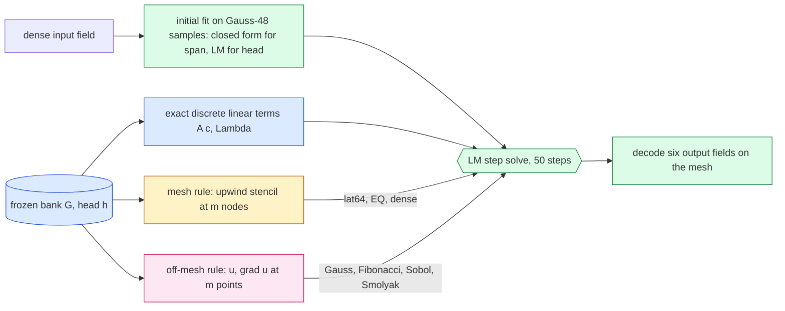

# Off-mesh quadrature for the tested advection of the full-scale Burgers 2D model

Replication of Hari's off-mesh quadrature study on the frozen Table-1 Burgers 2D model ($R=512$ bank, $K=16$ head, $256^2$–$4096^2$). Status: **final: development/validation (dev6 ∪ val32) and the frozen held-out test cohort (test64)**. Every number below is generated by `reports/make_report.py` from the NumPy-audited job summaries in `experiments/quadrature-study/checks/`; the pre-registration is `experiments/quadrature-study/DESIGN.md` (amendments A0–A2 and later dated inside).

## 1. What ran

| job | role | mesh | cohorts | GPU | job id | elapsed (h) | accepted | failed gates |
|---|---|---|---|---|---|---|---|---|
| `dv256` | dev | $256^2$ | dev6, val32 | NVIDIA A100 80GB PCIe | 4735696 | 0.48 | yes | none |
| `dv1024` | dev | $1024^2$ | dev6, val32 | NVIDIA A100 80GB PCIe | 4735709 | 0.83 | yes | none |
| `dv4096` | dev | $4096^2$ | dev6, val32 | NVIDIA H200 | 4735717 | 0.79 | yes | none |
| `t256` | test | $256^2$ | test64 | NVIDIA A100 80GB PCIe | 4739520 | 0.53 | yes | none |
| `t1024` | test | $1024^2$ | test64 | NVIDIA A100 80GB PCIe | 4739521 | 1.01 | yes | none |
| `t4096` | test | $4096^2$ | test64 | NVIDIA H200 | 4739522 | 0.84 | yes | none |
| `refdv` | reference (FOM only) | $8192^2$ | dev6, val32 | NVIDIA A100 80GB PCIe | 4734273 | 4.62 | yes | none |
| `reft` | reference (FOM only) | $8192^2$ | test64 | NVIDIA A100 80GB PCIe | 4734276 | 7.91 | yes | none |

## 2. The hybrid reduced solve

One backward-Euler step solves for the bank coefficients $c$ (linear rung: $c=w$; head: $c=h(z)$):

$$ r(c) = D\Big(A c - p + \Delta t\,\big(N(c) + \nu\Lambda A c\big)\Big),\qquad D=(1+\Delta t\,\nu\Lambda)^{-1}. $$

Here $L$ is the number of mesh intervals per axis, $G'$ the rotated bank on the mesh, $\Phi$ the $M$ mesh-orthonormal sine tests $\tfrac{2}{L}\sin(a\pi x)\sin(b\pi y)$, $\psi=2\sin(a\pi x)\sin(b\pi y)$ their continuum counterparts, $\Lambda$ their discrete eigenvalues, $p=Ac_n$ the previous step, $\nu$ the viscosity, $\Delta t=0.005$, and $(x_q,w_q)$ the $m$ points and weights of a rule. "Hari's study" is `external/quadrature-study-2026-09-30/quadrature/results/SUMMARY.md`; $\rho$ is eq. 13 of the project's NM-ROM paper draft, the relative error of a rule's tested advection against a target (defined in the rho sections).

The linear terms ($A=\Phi^{\mathsf T}G'$, $\Lambda$) are the exact discrete ones of the project's solver. Only the tested advection $N(c)$ changes between arms: the FOM's upwind stencil on all mesh nodes (`dense`) or on $m$ of them (mesh rules), or Hari's off-mesh form $N(c)=L\sum_q w_q\,\psi(x_q)\,u\,(u_x+u_y)(x_q)$ with the bank and its gradient decoded at the rule's points (or the flux form $-L\sum_q w_q(\psi_x+\psi_y)\,u^2/2$).

## Answers in brief

**Development/validation cohorts.**

- **(i) Reproduce dense against the refined reference, mesh-invariantly?** In the linear-rung settings (`acc`, `fast`) the resolved off-mesh rules give one mesh-invariant solution (case by case to ≤0.02 pp, table below); in the `head` setting a few cases move between meshes for every arm, dense included (table below). The dense mesh solve carries the upwind stencil error, which shrinks with the mesh. On the cases where dense ran (worst over those cases; the case set is smaller at $4096^2$, so the columns are not one population): acc: continuum rollout ST 2.75/2.75/1.82 %, S 1.06/1.05/0.24 % at $256^2/1024^2/4096^2$; dense ST 6.21/3.38/1.91 %, S 4.16/1.34/0.24 % (on 38/38/6 cases); fast: continuum rollout ST 4.64/4.64/2.86 %, S 3.46/3.45/1.91 % at $256^2/1024^2/4096^2$; dense ST 6.92/5.03/2.91 %, S 4.97/3.48/1.90 % (on 38/38/6 cases); head: continuum rollout ST 5.66/5.63/3.31 %, S 4.37/4.35/2.45 % at $256^2/1024^2/4096^2$; dense ST 7.48/5.93/3.35 %, S 5.53/4.37/2.43 % (on 38/38/6 cases). In cohort-worst terms the resolved off-mesh rules are more accurate than dense at the coarse meshes against both references (not case-by-case dominance), and at $4096^2$ the worst errors are close: slightly lower than dense against ST, slightly higher against S. The two-sided B1 therefore fails for the resolved linear-rung arms at the coarse meshes in the favourable direction; under-resolved rules (e.g. accurate Gauss $32^2$) fail it by being worse.
  Mesh invariance (B2, worst ST max/min over the three meshes): off-mesh Gauss/Fibonacci/flux rules except accurate-setting Gauss $32^2$ between 1.0001 and 1.0060; the deployed lattice 1.31–2.19.
- **(ii) $\rho$ ladder vs the $63^2$ lattice and EQ at approximately matched $m$ ($1024^2$, worst over reached states; the mesh rules are measured against their own target, the upwind stencil, and the off-mesh rules against theirs, the continuum — different discrepancies):** acc: lat64 ($m$=3969) 5.4e-02 against its mesh target, Gauss $64^2$ ($m$=4096) 1.9e-02 and Fibonacci 4181 3.3e-02 against the continuum; fast: lat64 ($m$=3969) 4.6e-02 against its mesh target, Gauss $64^2$ ($m$=4096) 2.3e-02 and Fibonacci 4181 1.8e-02 against the continuum; head: lat64 ($m$=3969) 1.2e-02 against its mesh target, Gauss $64^2$ ($m$=4096) 9.4e-03 and Fibonacci 4181 2.5e-03 against the continuum, fitted EQ ($m$=1024) 1.0e-01 vs Gauss $32^2$ 3.4e-02. Our bank converges much more slowly in the number of points than Hari's (different bank and test space; cause not isolated; Gauss $128^2$: acc 2.1e-03, fast 6.5e-03, head 3.1e-03); Sobol 4096 stays at acc 2.5e-01, fast 1.2e-01, head 1.6e-02 and Smolyak CC 8 at acc 9.5e+00, fast 3.0e+00, head 3.6e-01.
- **(iii) Cost flat in $N$?** Solve time (query minus decode) is flat on one GPU: B4 ratios $4096^2/256^2$ between 0.937 and 1.060 for all 40 measured arms; it grows with $m$. The full query is not flat because the six-field output decode grows with $N$. At $4096^2$, solve time of the post-hoc rules vs the deployed lattice: acc: Gauss $96^2$ 54.5 ms vs lat64 46.3 ms; fast: Fibonacci 1597 13.3 ms vs lat64 18.7 ms; head: Gauss $32^2$ 22.3 ms vs lat64 40.6 ms (not a matched equal-accuracy comparison; §D5).
- **(iv) Narrow early bumps the worst case?** Not in the way Hari found. At $1024^2$: acc: Gauss $64^2$ worst state at $k$=1 (width 0.111; Spearman of case-max $\\rho$ with width +0.35; median $k$ of its top 1 % (19 states) 41.0); lat64 worst at $k$=29 (width 0.111, Spearman +0.00); fast: Gauss $64^2$ worst state at $k$=1 (width 0.188; Spearman of case-max $\\rho$ with width +0.61; median $k$ of its top 1 % (19 states) 1.0); lat64 worst at $k$=1 (width 0.182, Spearman -0.01); head: Gauss $64^2$ worst state at $k$=1 (width 0.196; Spearman of case-max $\\rho$ with width +0.64; median $k$ of its top 1 % (19 states) 1.0); lat64 worst at $k$=32 (width 0.111, Spearman -0.53). For the off-mesh Gauss/Fibonacci rules the cases with the largest $\rho$ tend to be the *wider* bumps (positive Spearman), and the single worst state is often an early step, while the top-1 % tail spreads over later steps; Sobol and some rules are exceptions (§D6). The cause is not tested here.

**Test cohort.**

- **(i) Reproduce dense against the refined reference, mesh-invariantly?** In the linear-rung settings (`acc`, `fast`) the resolved off-mesh rules give one mesh-invariant solution (case by case to ≤0.02 pp, table below); in the `head` setting a few cases move between meshes for every arm, dense included (table below). The dense mesh solve carries the upwind stencil error, which shrinks with the mesh. On the cases where dense ran (worst over those cases; the case set is smaller at $4096^2$, so the columns are not one population): acc: continuum rollout ST 2.64/2.65/1.57 %, S 1.34/1.36/0.10 % at $256^2/1024^2/4096^2$; dense ST 5.58/3.27/1.62 %, S 3.71/1.53/0.10 % (on 64/64/6 cases); fast: continuum rollout ST 4.36/4.36/1.68 %, S 3.15/3.15/0.71 % at $256^2/1024^2/4096^2$; dense ST 6.28/4.67/1.72 %, S 4.46/3.18/0.71 % (on 64/64/6 cases); head: continuum rollout ST 4.92/8.79/1.87 %, S 4.18/8.45/1.35 % at $256^2/1024^2/4096^2$; dense ST 6.59/8.84/1.90 %, S 4.74/8.49/1.35 % (on 64/64/6 cases). In cohort-worst terms the resolved off-mesh rules are more accurate than dense at the coarse meshes against both references (not case-by-case dominance), and at $4096^2$ the worst errors are close: slightly lower than dense against ST, slightly higher against S. The two-sided B1 therefore fails for the resolved linear-rung arms at the coarse meshes in the favourable direction; under-resolved rules (e.g. accurate Gauss $32^2$) fail it by being worse.
- **(ii) $\rho$ ladder vs the $63^2$ lattice and EQ at approximately matched $m$ ($1024^2$, worst over reached states; the mesh rules are measured against their own target, the upwind stencil, and the off-mesh rules against theirs, the continuum — different discrepancies):** acc: lat64 ($m$=3969) 7.8e-02 against its mesh target, Gauss $64^2$ ($m$=4096) 2.4e-02 and Fibonacci 4181 7.6e-02 against the continuum; fast: lat64 ($m$=3969) 6.1e-02 against its mesh target, Gauss $64^2$ ($m$=4096) 2.7e-02 and Fibonacci 4181 2.3e-02 against the continuum; head: lat64 ($m$=3969) 2.1e-02 against its mesh target, Gauss $64^2$ ($m$=4096) 1.8e-02 and Fibonacci 4181 2.5e-03 against the continuum, fitted EQ ($m$=1024) 2.8e-02 vs Gauss $32^2$ 5.8e-02. Our bank converges much more slowly in the number of points than Hari's (different bank and test space; cause not isolated; Gauss $128^2$: acc 3.0e-03, fast 6.9e-03, head 2.8e-03); Sobol 4096 stays at acc 2.4e-01, fast 7.1e-02, head 1.7e-02 and Smolyak CC 8 at acc 9.5e+00, fast 3.0e+00, head 4.4e-01.
- **(iii) Cost flat in $N$?** Solve time (query minus decode) is flat on one GPU: B4 ratios $4096^2/256^2$ between 0.972 and 1.040 for all 40 measured arms; it grows with $m$. The full query is not flat because the six-field output decode grows with $N$. At $4096^2$, solve time of the post-hoc rules vs the deployed lattice: acc: Gauss $96^2$ 55.4 ms vs lat64 46.6 ms; fast: Fibonacci 1597 13.4 ms vs lat64 19.1 ms; head: Gauss $32^2$ 21.7 ms vs lat64 40.2 ms (not a matched equal-accuracy comparison; §T5).
- **(iv) Narrow early bumps the worst case?** Not in the way Hari found. At $1024^2$: acc: Gauss $64^2$ worst state at $k$=1 (width 0.159; Spearman of case-max $\\rho$ with width +0.26; median $k$ of its top 1 % (32 states) 42.5); lat64 worst at $k$=1 (width 0.169, Spearman -0.07); fast: Gauss $64^2$ worst state at $k$=1 (width 0.164; Spearman of case-max $\\rho$ with width +0.61; median $k$ of its top 1 % (32 states) 1.5); lat64 worst at $k$=1 (width 0.169, Spearman -0.08); head: Gauss $64^2$ worst state at $k$=1 (width 0.164; Spearman of case-max $\\rho$ with width +0.55; median $k$ of its top 1 % (32 states) 2.0); lat64 worst at $k$=31 (width 0.169, Spearman -0.45). For the off-mesh Gauss/Fibonacci rules the cases with the largest $\rho$ tend to be the *wider* bumps (positive Spearman), and the single worst state is often an early step, while the top-1 % tail spreads over later steps; Sobol and some rules are exceptions (§T6). The cause is not tested here.

**Did the frozen post-hoc rules confirm on test64?** (one-sided B1′, B3 and B5 recomputed from the test summaries exactly as on development):

| setting | rule | B1′ at $256^2/1024^2/4096^2$ | B3 worst % at $256^2/1024^2/4096^2$ (bar) | continuum $\rho_{\max}$ at $256^2/1024^2/4096^2$ | confirmed |
|---|---|---|---|---|---|
| acc | Gauss $96^2$ | y/y/y | 0.017/0.017/0.017 (0.05) | 4.3e-03/3.4e-03/3.6e-03 | yes |
| fast | Fibonacci 1597 | y/y/y | 0.140/0.139/0.139 (0.20) | 6.9e-02/8.1e-02/8.3e-02 | yes |
| head | Gauss $32^2$ | y/y/y | 0.585/1.105/1.258 (0.50) | 5.0e-02/5.8e-02/6.0e-02 | **no** |

**Mesh invariance on test64** (B2: worst ST % over all 64 cases at each mesh; dense omitted, 6 cases at $4096^2$):

| setting | arm | $256^2$ | $1024^2$ | $4096^2$ | max/min | B2 ($\le1.02$) |
|---|---|---|---|---|---|---|
| acc | continuum rollout (Gauss $640^2$) | 2.638 | 2.647 | 2.647 | 1.0034 | yes |
| acc | Gauss $32^2$ | 9.036 | 8.813 | 8.809 | 1.0259 | **no** |
| acc | Gauss $64^2$ | 2.641 | 2.649 | 2.649 | 1.0031 | yes |
| acc | Gauss $96^2$ | 2.638 | 2.647 | 2.647 | 1.0034 | yes |
| acc | Gauss $128^2$ | 2.638 | 2.647 | 2.647 | 1.0034 | yes |
| acc | Fibonacci 1597 | 2.597 | 2.603 | 2.604 | 1.0024 | yes |
| acc | Fibonacci 6765 | 2.637 | 2.645 | 2.645 | 1.0033 | yes |
| acc | Fibonacci 17711 | 2.638 | 2.647 | 2.647 | 1.0034 | yes |
| acc | mesh lattice $63^2$ | 5.578 | 3.269 | 2.787 | 2.0017 | **no** |
| fast | continuum rollout (Gauss $640^2$) | 4.360 | 4.358 | 4.358 | 1.0007 | yes |
| fast | Gauss $32^2$ | 4.349 | 4.347 | 4.347 | 1.0006 | yes |
| fast | Gauss $64^2$ | 4.360 | 4.357 | 4.357 | 1.0006 | yes |
| fast | Gauss $96^2$ | 4.360 | 4.358 | 4.357 | 1.0007 | yes |
| fast | Gauss $128^2$ | 4.360 | 4.358 | 4.358 | 1.0007 | yes |
| fast | Fibonacci 1597 | 4.361 | 4.358 | 4.358 | 1.0007 | yes |
| fast | Fibonacci 6765 | 4.360 | 4.358 | 4.358 | 1.0007 | yes |
| fast | Fibonacci 17711 | 4.360 | 4.358 | 4.358 | 1.0007 | yes |
| fast | mesh lattice $63^2$ | 6.283 | 4.666 | 4.404 | 1.4266 | **no** |
| head | continuum rollout (Gauss $640^2$) | 4.916 | 8.794 | 9.377 | 1.9074 | **no** |
| head | Gauss $32^2$ | 4.920 | 8.747 | 9.354 | 1.9011 | **no** |
| head | Gauss $64^2$ | 4.917 | 8.765 | 9.347 | 1.9009 | **no** |
| head | Gauss $96^2$ | 4.916 | 8.812 | 9.392 | 1.9104 | **no** |
| head | Gauss $128^2$ | 4.916 | 8.800 | 9.382 | 1.9084 | **no** |
| head | Fibonacci 1597 | 4.917 | 8.840 | 9.457 | 1.9232 | **no** |
| head | Fibonacci 6765 | 4.916 | 8.790 | 9.373 | 1.9065 | **no** |
| head | Fibonacci 17711 | 4.916 | 8.796 | 9.380 | 1.9078 | **no** |
| head | mesh lattice $63^2$ | 6.588 | 8.882 | 9.442 | 1.4333 | **no** |

**Per-case mesh invariance** (generated from the job result files: for each case, the spread of its worst ST error across $256^2/1024^2/4096^2$; cases moving by more than 0.5 pp listed):

| cohort | setting | arm | cases | largest per-case spread (pp) | cases moving > 0.5 pp |
|---|---|---|---|---|---|
| dev6 ∪ val32 | acc | continuum rollout (Gauss $640^2$) | 38 | 0.012 | none |
| dev6 ∪ val32 | acc | Gauss $64^2$ | 38 | 0.014 | none |
| dev6 ∪ val32 | acc | Fibonacci 6765 | 38 | 0.012 | none |
| dev6 ∪ val32 | acc | mesh lattice $63^2$ | 38 | 3.374 | dev6:0, dev6:2, dev6:3, dev6:4, val32:0, val32:3, val32:4, val32:5, val32:6, val32:7, val32:8, val32:11, val32:13, val32:14, val32:17, val32:18, val32:19, val32:23, val32:25, val32:26, val32:28, val32:29, val32:30 |
| dev6 ∪ val32 | fast | continuum rollout (Gauss $640^2$) | 38 | 0.020 | none |
| dev6 ∪ val32 | fast | Gauss $64^2$ | 38 | 0.020 | none |
| dev6 ∪ val32 | fast | Fibonacci 6765 | 38 | 0.020 | none |
| dev6 ∪ val32 | fast | mesh lattice $63^2$ | 38 | 2.207 | dev6:0, dev6:2, dev6:3, dev6:4, val32:0, val32:4, val32:5, val32:6, val32:7, val32:8, val32:13, val32:14, val32:17, val32:18, val32:19, val32:23, val32:25, val32:26, val32:28, val32:29, val32:30 |
| dev6 ∪ val32 | head | continuum rollout (Gauss $640^2$) | 38 | 1.221 | val32:20 |
| dev6 ∪ val32 | head | Gauss $64^2$ | 38 | 1.219 | val32:20 |
| dev6 ∪ val32 | head | Fibonacci 6765 | 38 | 1.219 | val32:20 |
| dev6 ∪ val32 | head | mesh lattice $63^2$ | 38 | 1.790 | dev6:2, dev6:3, val32:5, val32:6, val32:7, val32:8, val32:17, val32:18, val32:19, val32:20, val32:25, val32:30 |
| test64 | acc | continuum rollout (Gauss $640^2$) | 64 | 0.009 | none |
| test64 | acc | Gauss $64^2$ | 64 | 0.009 | none |
| test64 | acc | Fibonacci 6765 | 64 | 0.009 | none |
| test64 | acc | mesh lattice $63^2$ | 64 | 2.791 | test64:0, test64:1, test64:2, test64:3, test64:5, test64:6, test64:7, test64:9, test64:13, test64:16, test64:20, test64:22, test64:26, test64:27, test64:28, test64:29, test64:31, test64:32, test64:33, test64:34, test64:35, test64:36, test64:37, test64:39, test64:40, test64:42, test64:43, test64:45, test64:48, test64:53, test64:55, test64:60 |
| test64 | fast | continuum rollout (Gauss $640^2$) | 64 | 0.011 | none |
| test64 | fast | Gauss $64^2$ | 64 | 0.011 | none |
| test64 | fast | Fibonacci 6765 | 64 | 0.011 | none |
| test64 | fast | mesh lattice $63^2$ | 64 | 2.167 | test64:0, test64:1, test64:2, test64:3, test64:5, test64:6, test64:7, test64:9, test64:13, test64:16, test64:20, test64:22, test64:26, test64:27, test64:28, test64:29, test64:31, test64:32, test64:33, test64:35, test64:39, test64:40, test64:42, test64:43, test64:45, test64:53, test64:55, test64:60 |
| test64 | head | continuum rollout (Gauss $640^2$) | 64 | 4.715 | test64:36, test64:48, test64:60 |
| test64 | head | Gauss $64^2$ | 64 | 4.693 | test64:27, test64:36, test64:48, test64:60 |
| test64 | head | Fibonacci 6765 | 64 | 4.710 | test64:36, test64:48, test64:60 |
| test64 | head | mesh lattice $63^2$ | 64 | 4.606 | test64:0, test64:2, test64:3, test64:5, test64:6, test64:7, test64:9, test64:13, test64:16, test64:20, test64:22, test64:28, test64:29, test64:31, test64:32, test64:33, test64:35, test64:36, test64:39, test64:40, test64:43, test64:53, test64:55 |

The linear rungs (`acc`, `fast`) are invariant case by case for the off-mesh rules. In the `head` setting a few cases move for *every* arm, the dense mesh solve and `lat64` included, so that spread comes from the nonlinear head solve (it lands on a different trajectory at another mesh), not from the quadrature; the cause is not isolated here.

Pre-registered recommended off-mesh rule: acc none, fast none, head none. Post hoc (one-sided B1′, fixed before the test jobs): acc Gauss $96^2$, fast Fibonacci 1597, head Gauss $32^2$.

## 3. Results — development and validation (dev6 ∪ val32)

### D1. Continuum target (gate G6)

| mesh | setting | population | $\rho_{\max}$ Gauss $640^2$ vs $768^2$ | $\rho_{\max}$ flux vs point | passed |
|---|---|---|---|---|---|
| $256^2$ | acc | lat64 (1900 states) | 3.3e-08 | 3.1e-08 | yes |
| $256^2$ | acc | gref (1900 states) | 3.2e-08 | 2.9e-08 | yes |
| $256^2$ | fast | lat64 (1900 states) | 2.9e-08 | 3.2e-08 | yes |
| $256^2$ | fast | gref (1900 states) | 2.9e-08 | 3.2e-08 | yes |
| $256^2$ | head | lat64 (1900 states) | 6.1e-09 | 6.1e-09 | yes |
| $256^2$ | head | gref (1900 states) | 6.1e-09 | 6.1e-09 | yes |
| $1024^2$ | acc | lat64 (1900 states) | 4.3e-08 | 3.9e-08 | yes |
| $1024^2$ | acc | gref (1900 states) | 4.1e-08 | 3.8e-08 | yes |
| $1024^2$ | fast | lat64 (1900 states) | 3.2e-08 | 3.5e-08 | yes |
| $1024^2$ | fast | gref (1900 states) | 3.2e-08 | 3.5e-08 | yes |
| $1024^2$ | head | lat64 (1900 states) | 8.3e-09 | 8.3e-09 | yes |
| $1024^2$ | head | gref (1900 states) | 8.3e-09 | 8.3e-09 | yes |
| $4096^2$ | acc | lat64 (1900 states) | 4.3e-08 | 4.0e-08 | yes |
| $4096^2$ | acc | gref (1900 states) | 4.3e-08 | 3.9e-08 | yes |
| $4096^2$ | fast | lat64 (1900 states) | 3.3e-08 | 3.6e-08 | yes |
| $4096^2$ | fast | gref (1900 states) | 3.3e-08 | 3.6e-08 | yes |
| $4096^2$ | head | lat64 (1900 states) | 8.8e-09 | 8.9e-09 | yes |
| $4096^2$ | head | gref (1900 states) | 8.8e-09 | 8.8e-09 | yes |

### D2. $\rho$ ladders on reached states (question ii)

Worst and median $\rho$ over the states $k=1..50$ reached by the deployed `lat64` arm. *cont* = against the continuum target (Gauss $640^2$); *mesh* = against the dense upwind stencil at that mesh. Bars: 0.116 (paper primary), 0.06.

**accurate (span $R'=384$, $M=1536$)**

| rule | $m$ | cont worst / median $256^2$ | cont worst / median $1024^2$ | cont worst / median $4096^2$ | mesh worst $256^2$ | mesh worst $1024^2$ | mesh worst $4096^2$ | Hari cont worst ($M=320$) |
|---|---|---|---|---|---|---|---|---|
| dense (all mesh nodes) | mesh | 1.2e-01 / 3.3e-02 | 3.5e-02 / 8.3e-03 | 9.2e-03 / 2.1e-03 | 0.0e+00 | 0.0e+00 | 0.0e+00 | — |
| mesh lattice $15^2$ | 225 | 2.5e+00 / 2.4e+00 | 2.5e+00 / 2.4e+00 | 2.5e+00 / 2.4e+00 | 2.5e+00 | 2.5e+00 | 2.5e+00 | — |
| mesh lattice $31^2$ | 961 | 7.4e-01 / 3.5e-02 | 7.8e-01 / 1.1e-02 | 8.0e-01 / 6.0e-03 | 7.3e-01 | 7.8e-01 | 8.0e-01 | — |
| mesh lattice $63^2$ | 3969 | 1.4e-01 / 3.3e-02 | 7.1e-02 / 8.3e-03 | 5.7e-02 / 2.1e-03 | 8.6e-02 | 5.4e-02 | 5.1e-02 | — |
| mesh lattice $127^2$ | 16129 | 1.2e-01 / 3.3e-02 | 7.1e-02 / 8.4e-03 | 6.4e-02 / 2.2e-03 | 3.2e-02 | 8.4e-02 | 6.7e-02 | — |
| Gauss $8^2$ | 64 | 1.4e+01 / 6.1e+00 | 1.4e+01 / 6.1e+00 | 1.5e+01 / 6.1e+00 | 1.4e+01 | 1.4e+01 | 1.5e+01 | 4.5e+00 ($m$=64) |
| Gauss $16^2$ | 256 | 4.2e+00 / 3.1e+00 | 4.2e+00 / 3.1e+00 | 4.2e+00 / 3.1e+00 | 4.3e+00 | 4.3e+00 | 4.2e+00 | 1.5e+00 ($m$=256) |
| Gauss $24^2$ | 576 | 2.4e+00 / 2.0e+00 | 2.4e+00 / 2.0e+00 | 2.4e+00 / 2.0e+00 | 2.5e+00 | 2.5e+00 | 2.4e+00 | 3.8e-01 ($m$=576) |
| Gauss $32^2$ | 1024 | 1.6e+00 / 1.3e+00 | 1.6e+00 / 1.3e+00 | 1.6e+00 / 1.3e+00 | 1.6e+00 | 1.6e+00 | 1.6e+00 | 3.6e-02 ($m$=1024) |
| Gauss $48^2$ | 2304 | 1.5e-01 / 1.7e-03 | 1.8e-01 / 1.7e-03 | 1.9e-01 / 1.7e-03 | 1.7e-01 | 1.9e-01 | 1.9e-01 | 1.8e-04 ($m$=2304) |
| Gauss $64^2$ | 4096 | 1.2e-02 / 8.0e-04 | 1.9e-02 / 8.0e-04 | 2.3e-02 / 8.1e-04 | 1.4e-01 | 3.7e-02 | 2.6e-02 | 5.1e-06 ($m$=4096) |
| Gauss $80^2$ | 6400 | 4.7e-03 / 2.7e-04 | 5.8e-03 / 2.7e-04 | 6.8e-03 / 2.8e-04 | 1.4e-01 | 3.6e-02 | 9.9e-03 | — |
| Gauss $96^2$ | 9216 | 4.9e-03 / 4.8e-05 | 4.6e-03 / 4.8e-05 | 7.6e-03 / 4.9e-05 | 1.4e-01 | 3.7e-02 | 9.7e-03 | — |
| Gauss $128^2$ | 16384 | 2.2e-03 / 1.8e-05 | 2.1e-03 / 1.8e-05 | 5.1e-03 / 1.8e-05 | 1.4e-01 | 3.6e-02 | 9.3e-03 | — |
| Gauss $160^2$ | 25600 | 5.5e-04 / 6.5e-06 | 7.7e-04 / 6.5e-06 | 2.0e-03 / 6.6e-06 | 1.4e-01 | 3.6e-02 | 9.3e-03 | — |
| Gauss $192^2$ | 36864 | 4.7e-04 / 2.4e-06 | 4.4e-04 / 2.4e-06 | 5.0e-04 / 2.5e-06 | 1.4e-01 | 3.6e-02 | 9.2e-03 | — |
| Gauss $200^2$ | 40000 | 4.5e-04 / 1.9e-06 | 4.3e-04 / 2.0e-06 | 3.3e-04 / 2.0e-06 | 1.4e-01 | 3.6e-02 | 9.3e-03 | — |
| Gauss $256^2$ | 65536 | 7.9e-05 / 3.9e-07 | 7.3e-05 / 4.0e-07 | 7.3e-05 / 4.1e-07 | 1.4e-01 | 3.6e-02 | 9.3e-03 | — |
| Gauss $320^2$ | 102400 | 3.1e-05 / 7.2e-08 | 2.9e-05 / 7.4e-08 | 1.1e-05 / 7.6e-08 | 1.4e-01 | 3.6e-02 | 9.3e-03 | — |
| Gauss $400^2$ | 160000 | 4.1e-06 / 7.7e-09 | 3.8e-06 / 8.6e-09 | 3.5e-06 / 8.9e-09 | 1.4e-01 | 3.6e-02 | 9.3e-03 | — |
| Gauss $512^2$ | 262144 | 3.8e-07 / 6.3e-10 | 4.8e-07 / 6.6e-10 | 4.9e-07 / 6.8e-10 | 1.4e-01 | 3.6e-02 | 9.3e-03 | — |
| Fibonacci 987 | 987 | 5.0e-01 / 2.3e-02 | 5.2e-01 / 2.4e-02 | 5.3e-01 / 2.4e-02 | 5.8e-01 | 5.4e-01 | 5.4e-01 | 4.2e-02 ($m$=987) |
| Fibonacci 1597 | 1597 | 1.2e-01 / 2.4e-03 | 1.3e-01 / 2.5e-03 | 1.4e-01 / 2.5e-03 | 1.9e-01 | 1.4e-01 | 1.4e-01 | 3.0e-02 ($m$=1597) |
| Fibonacci 2584 | 2584 | 2.9e-02 / 5.4e-04 | 3.7e-02 / 5.6e-04 | 4.5e-02 / 5.6e-04 | 1.4e-01 | 5.0e-02 | 4.4e-02 | 9.8e-03 ($m$=2584) |
| Fibonacci 4181 | 4181 | 2.6e-02 / 2.3e-04 | 3.3e-02 / 2.3e-04 | 3.1e-02 / 2.4e-04 | 1.4e-01 | 3.9e-02 | 3.1e-02 | 2.0e-03 ($m$=4181) |
| Fibonacci 6765 | 6765 | 1.1e-02 / 1.2e-04 | 1.6e-02 / 1.2e-04 | 2.1e-02 / 1.2e-04 | 1.4e-01 | 3.8e-02 | 2.2e-02 | 4.5e-04 ($m$=6765) |
| Fibonacci 10946 | 10946 | 4.4e-03 / 4.1e-05 | 5.2e-03 / 4.3e-05 | 7.7e-03 / 4.4e-05 | 1.4e-01 | 3.6e-02 | 9.6e-03 | — |
| Fibonacci 17711 | 17711 | 1.1e-03 / 1.1e-05 | 1.7e-03 / 1.1e-05 | 1.9e-03 / 1.2e-05 | 1.4e-01 | 3.6e-02 | 9.0e-03 | — |
| Fibonacci 28657 | 28657 | 1.1e-03 / 2.2e-06 | 1.8e-03 / 2.3e-06 | 2.0e-03 / 2.4e-06 | 1.4e-01 | 3.6e-02 | 9.1e-03 | — |
| Fibonacci 46368 | 46368 | 2.3e-04 / 4.5e-07 | 3.1e-04 / 4.8e-07 | 3.3e-04 / 4.9e-07 | 1.4e-01 | 3.6e-02 | 9.2e-03 | — |
| Fibonacci 75025 | 75025 | 1.4e-04 / 1.6e-07 | 2.3e-04 / 1.7e-07 | 2.5e-04 / 1.7e-07 | 1.4e-01 | 3.6e-02 | 9.3e-03 | — |
| Fibonacci 121393 | 121393 | 8.2e-05 / 4.1e-08 | 1.3e-04 / 4.3e-08 | 1.5e-04 / 4.3e-08 | 1.4e-01 | 3.6e-02 | 9.3e-03 | — |
| Sobol 1024 | 1024 | 1.2e+00 / 9.7e-01 | 1.2e+00 / 9.7e-01 | 1.2e+00 / 9.7e-01 | 1.2e+00 | 1.2e+00 | 1.2e+00 | 2.2e-01 ($m$=1024) |
| Sobol 4096 | 4096 | 2.4e-01 / 2.0e-01 | 2.5e-01 / 2.0e-01 | 2.5e-01 / 2.0e-01 | 2.7e-01 | 2.5e-01 | 2.5e-01 | 2.7e-02 ($m$=4096) |
| Sobol 16384 | 16384 | 2.7e-02 / 2.1e-02 | 2.8e-02 / 2.1e-02 | 3.0e-02 / 2.1e-02 | 1.4e-01 | 4.8e-02 | 2.9e-02 | — |
| Sobol 65536 | 65536 | 5.9e-03 / 4.9e-03 | 6.0e-03 / 4.9e-03 | 6.0e-03 / 4.9e-03 | 1.4e-01 | 3.7e-02 | 1.0e-02 | — |
| Halton 4096 | 4096 | 3.2e-01 / 2.5e-01 | 3.3e-01 / 2.5e-01 | 3.3e-01 / 2.5e-01 | 3.5e-01 | 3.3e-01 | 3.3e-01 | — |
| Smolyak CC 6 | 193 | 4.4e+01 / 1.2e+01 | 4.5e+01 / 1.2e+01 | 4.5e+01 / 1.2e+01 | 4.5e+01 | 4.5e+01 | 4.5e+01 | — |
| Smolyak CC 7 | 449 | 2.1e+01 / 7.9e+00 | 2.2e+01 / 7.8e+00 | 2.2e+01 / 7.8e+00 | 2.1e+01 | 2.2e+01 | 2.2e+01 | — |
| Smolyak CC 8 | 1025 | 9.3e+00 / 5.1e+00 | 9.5e+00 / 5.1e+00 | 9.5e+00 / 5.0e+00 | 9.4e+00 | 9.5e+00 | 9.5e+00 | — |
| Smolyak CC 9 | 2305 | 4.0e+00 / 2.7e+00 | 4.1e+00 / 2.7e+00 | 4.2e+00 / 2.7e+00 | 4.1e+00 | 4.1e+00 | 4.2e+00 | — |
| Gauss $64^2$ (flux) | 4096 | 6.8e-03 / 4.3e-04 | 8.4e-03 / 4.3e-04 | 8.9e-03 / 4.4e-04 | 1.4e-01 | 3.6e-02 | 9.6e-03 | — |
| Gauss $128^2$ (flux) | 16384 | 6.5e-05 / 4.2e-07 | 1.1e-04 / 4.3e-07 | 1.0e-04 / 4.4e-07 | 1.4e-01 | 3.6e-02 | 9.3e-03 | — |
| Gauss $256^2$ (flux) | 65536 | 2.3e-06 / 6.3e-09 | 2.0e-06 / 6.4e-09 | 1.1e-06 / 6.5e-09 | 1.4e-01 | 3.6e-02 | 9.3e-03 | — |
| Fibonacci 6765 (flux) | 6765 | 2.9e-03 / 2.0e-05 | 4.9e-03 / 2.1e-05 | 6.0e-03 / 2.1e-05 | 1.4e-01 | 3.6e-02 | 9.2e-03 | — |
| Fibonacci 17711 (flux) | 17711 | 1.2e-04 / 1.1e-06 | 2.1e-04 / 1.2e-06 | 4.1e-04 / 1.3e-06 | 1.4e-01 | 3.6e-02 | 9.3e-03 | — |
| Sobol 4096 (flux) | 4096 | 4.1e+00 / 2.4e+00 | 4.1e+00 / 2.4e+00 | 4.1e+00 / 2.4e+00 | 4.1e+00 | 4.1e+00 | 4.1e+00 | — |

**fast (span $R'=128$, $M=512$)**

| rule | $m$ | cont worst / median $256^2$ | cont worst / median $1024^2$ | cont worst / median $4096^2$ | mesh worst $256^2$ | mesh worst $1024^2$ | mesh worst $4096^2$ | Hari cont worst ($M=320$) |
|---|---|---|---|---|---|---|---|---|
| dense (all mesh nodes) | mesh | 1.2e-01 / 3.3e-02 | 3.4e-02 / 8.3e-03 | 8.9e-03 / 2.1e-03 | 0.0e+00 | 0.0e+00 | 0.0e+00 | — |
| mesh lattice $15^2$ | 225 | 9.7e-01 / 4.2e-01 | 9.7e-01 / 4.3e-01 | 9.7e-01 / 4.3e-01 | 9.5e-01 | 9.7e-01 | 9.7e-01 | — |
| mesh lattice $31^2$ | 961 | 3.4e-01 / 3.3e-02 | 3.2e-01 / 8.6e-03 | 3.1e-01 / 2.6e-03 | 2.6e-01 | 3.0e-01 | 3.0e-01 | — |
| mesh lattice $63^2$ | 3969 | 1.3e-01 / 3.3e-02 | 4.9e-02 / 8.3e-03 | 4.4e-02 / 2.1e-03 | 9.0e-02 | 4.6e-02 | 4.0e-02 | — |
| mesh lattice $127^2$ | 16129 | 1.2e-01 / 3.3e-02 | 8.4e-02 / 8.3e-03 | 8.3e-02 / 2.2e-03 | 7.2e-02 | 9.9e-02 | 8.7e-02 | — |
| Gauss $8^2$ | 64 | 6.8e+00 / 3.5e+00 | 7.0e+00 / 3.5e+00 | 7.0e+00 / 3.5e+00 | 7.0e+00 | 7.0e+00 | 7.0e+00 | — |
| Gauss $16^2$ | 256 | 2.1e+00 / 1.7e+00 | 2.1e+00 / 1.7e+00 | 2.2e+00 / 1.7e+00 | 2.2e+00 | 2.2e+00 | 2.2e+00 | — |
| Gauss $24^2$ | 576 | 8.7e-01 / 2.2e-01 | 8.7e-01 / 2.2e-01 | 8.7e-01 / 2.2e-01 | 8.7e-01 | 8.7e-01 | 8.7e-01 | — |
| Gauss $32^2$ | 1024 | 1.1e-01 / 2.8e-03 | 1.1e-01 / 2.9e-03 | 1.1e-01 / 2.9e-03 | 1.4e-01 | 1.1e-01 | 1.1e-01 | — |
| Gauss $48^2$ | 2304 | 3.1e-02 / 8.4e-04 | 3.4e-02 / 8.4e-04 | 3.4e-02 / 8.4e-04 | 1.4e-01 | 4.4e-02 | 3.7e-02 | — |
| Gauss $64^2$ | 4096 | 2.0e-02 / 3.3e-04 | 2.3e-02 / 3.3e-04 | 2.4e-02 / 3.3e-04 | 1.4e-01 | 3.8e-02 | 2.6e-02 | — |
| Gauss $80^2$ | 6400 | 1.1e-02 / 5.0e-05 | 1.3e-02 / 5.0e-05 | 1.3e-02 / 5.0e-05 | 1.4e-01 | 3.6e-02 | 1.3e-02 | — |
| Gauss $96^2$ | 9216 | 9.9e-03 / 2.4e-05 | 1.1e-02 / 2.5e-05 | 1.2e-02 / 2.5e-05 | 1.3e-01 | 3.5e-02 | 9.5e-03 | — |
| Gauss $128^2$ | 16384 | 5.8e-03 / 1.4e-05 | 6.5e-03 / 1.4e-05 | 6.7e-03 / 1.4e-05 | 1.3e-01 | 3.5e-02 | 9.0e-03 | — |
| Gauss $160^2$ | 25600 | 1.4e-03 / 5.1e-06 | 1.5e-03 / 5.2e-06 | 1.6e-03 / 5.3e-06 | 1.4e-01 | 3.5e-02 | 9.0e-03 | — |
| Gauss $192^2$ | 36864 | 1.3e-03 / 2.3e-06 | 1.5e-03 / 2.3e-06 | 1.6e-03 / 2.3e-06 | 1.3e-01 | 3.5e-02 | 9.0e-03 | — |
| Gauss $200^2$ | 40000 | 1.3e-03 / 1.8e-06 | 1.4e-03 / 1.8e-06 | 1.5e-03 / 1.8e-06 | 1.3e-01 | 3.5e-02 | 9.0e-03 | — |
| Gauss $256^2$ | 65536 | 2.0e-04 / 2.9e-07 | 2.2e-04 / 3.0e-07 | 2.3e-04 / 3.0e-07 | 1.3e-01 | 3.5e-02 | 9.0e-03 | — |
| Gauss $320^2$ | 102400 | 8.0e-05 / 5.9e-08 | 9.0e-05 / 6.0e-08 | 9.3e-05 / 6.0e-08 | 1.3e-01 | 3.5e-02 | 9.0e-03 | — |
| Gauss $400^2$ | 160000 | 1.0e-05 / 5.2e-09 | 1.2e-05 / 5.3e-09 | 1.2e-05 / 5.3e-09 | 1.3e-01 | 3.5e-02 | 9.0e-03 | — |
| Gauss $512^2$ | 262144 | 8.7e-07 / 4.6e-10 | 9.8e-07 / 4.7e-10 | 1.0e-06 / 4.7e-10 | 1.3e-01 | 3.5e-02 | 9.0e-03 | — |
| Fibonacci 987 | 987 | 7.4e-02 / 1.5e-03 | 8.5e-02 / 1.6e-03 | 8.7e-02 / 1.6e-03 | 1.2e-01 | 9.0e-02 | 8.8e-02 | — |
| Fibonacci 1597 | 1597 | 5.6e-02 / 6.8e-04 | 6.5e-02 / 6.9e-04 | 6.6e-02 / 6.9e-04 | 1.4e-01 | 6.7e-02 | 6.7e-02 | — |
| Fibonacci 2584 | 2584 | 3.0e-02 / 1.5e-04 | 3.4e-02 / 1.6e-04 | 3.5e-02 / 1.6e-04 | 1.4e-01 | 3.9e-02 | 3.6e-02 | — |
| Fibonacci 4181 | 4181 | 1.6e-02 / 6.7e-05 | 1.8e-02 / 6.8e-05 | 1.8e-02 / 6.9e-05 | 1.3e-01 | 3.5e-02 | 1.9e-02 | — |
| Fibonacci 6765 | 6765 | 7.2e-03 / 2.6e-05 | 8.1e-03 / 2.8e-05 | 8.3e-03 / 2.8e-05 | 1.3e-01 | 3.5e-02 | 8.9e-03 | — |
| Fibonacci 10946 | 10946 | 3.0e-03 / 8.5e-06 | 3.4e-03 / 8.7e-06 | 3.4e-03 / 8.8e-06 | 1.3e-01 | 3.5e-02 | 8.6e-03 | — |
| Fibonacci 17711 | 17711 | 4.9e-04 / 1.3e-06 | 5.8e-04 / 1.4e-06 | 6.0e-04 / 1.4e-06 | 1.3e-01 | 3.5e-02 | 9.0e-03 | — |
| Fibonacci 28657 | 28657 | 1.9e-04 / 3.7e-07 | 2.3e-04 / 3.8e-07 | 2.4e-04 / 3.9e-07 | 1.3e-01 | 3.5e-02 | 8.9e-03 | — |
| Fibonacci 46368 | 46368 | 1.0e-04 / 1.1e-07 | 1.3e-04 / 1.2e-07 | 1.3e-04 / 1.2e-07 | 1.3e-01 | 3.5e-02 | 9.0e-03 | — |
| Fibonacci 75025 | 75025 | 4.0e-05 / 4.9e-08 | 4.8e-05 / 5.0e-08 | 5.0e-05 / 5.0e-08 | 1.3e-01 | 3.5e-02 | 9.0e-03 | — |
| Fibonacci 121393 | 121393 | 2.7e-05 / 1.9e-08 | 3.2e-05 / 1.9e-08 | 3.3e-05 / 1.9e-08 | 1.3e-01 | 3.5e-02 | 9.0e-03 | — |
| Sobol 1024 | 1024 | 4.0e-01 / 2.8e-01 | 4.2e-01 / 2.8e-01 | 4.2e-01 / 2.8e-01 | 4.4e-01 | 4.2e-01 | 4.2e-01 | — |
| Sobol 4096 | 4096 | 1.1e-01 / 3.1e-02 | 1.2e-01 / 3.2e-02 | 1.2e-01 / 3.2e-02 | 2.0e-01 | 1.4e-01 | 1.3e-01 | — |
| Sobol 16384 | 16384 | 8.4e-03 / 3.0e-03 | 9.6e-03 / 3.0e-03 | 1.0e-02 / 3.0e-03 | 1.4e-01 | 3.9e-02 | 1.5e-02 | — |
| Sobol 65536 | 65536 | 2.0e-03 / 1.2e-03 | 2.2e-03 / 1.2e-03 | 2.2e-03 / 1.2e-03 | 1.3e-01 | 3.5e-02 | 8.9e-03 | — |
| Halton 4096 | 4096 | 1.3e-01 / 9.9e-02 | 1.4e-01 / 9.9e-02 | 1.5e-01 / 9.9e-02 | 2.0e-01 | 1.4e-01 | 1.5e-01 | — |
| Smolyak CC 6 | 193 | 2.0e+01 / 5.9e+00 | 2.0e+01 / 5.9e+00 | 2.0e+01 / 5.9e+00 | 2.0e+01 | 2.0e+01 | 2.0e+01 | — |
| Smolyak CC 7 | 449 | 8.3e+00 / 3.7e+00 | 8.5e+00 / 3.7e+00 | 8.5e+00 / 3.7e+00 | 8.4e+00 | 8.5e+00 | 8.5e+00 | — |
| Smolyak CC 8 | 1025 | 3.0e+00 / 2.0e+00 | 3.0e+00 / 2.0e+00 | 3.1e+00 / 2.0e+00 | 3.0e+00 | 3.1e+00 | 3.1e+00 | — |
| Smolyak CC 9 | 2305 | 1.1e+00 / 3.5e-01 | 1.1e+00 / 3.5e-01 | 1.1e+00 / 3.6e-01 | 1.1e+00 | 1.1e+00 | 1.1e+00 | — |
| Gauss $64^2$ (flux) | 4096 | 2.3e-03 / 8.6e-05 | 2.6e-03 / 8.7e-05 | 2.7e-03 / 8.7e-05 | 1.4e-01 | 3.6e-02 | 9.1e-03 | — |
| Gauss $128^2$ (flux) | 16384 | 1.7e-04 / 4.6e-07 | 1.9e-04 / 4.7e-07 | 1.9e-04 / 4.7e-07 | 1.3e-01 | 3.5e-02 | 9.0e-03 | — |
| Gauss $256^2$ (flux) | 65536 | 7.2e-06 / 6.6e-09 | 8.1e-06 / 6.9e-09 | 8.3e-06 / 6.9e-09 | 1.3e-01 | 3.5e-02 | 9.0e-03 | — |
| Fibonacci 6765 (flux) | 6765 | 6.5e-04 / 2.4e-06 | 7.8e-04 / 2.5e-06 | 8.1e-04 / 2.6e-06 | 1.3e-01 | 3.5e-02 | 8.9e-03 | — |
| Fibonacci 17711 (flux) | 17711 | 4.4e-05 / 1.1e-07 | 5.4e-05 / 1.1e-07 | 5.6e-05 / 1.1e-07 | 1.3e-01 | 3.5e-02 | 9.0e-03 | — |
| Sobol 4096 (flux) | 4096 | 3.7e-01 / 2.0e-01 | 3.7e-01 / 2.0e-01 | 3.7e-01 / 2.0e-01 | 3.7e-01 | 3.7e-01 | 3.7e-01 | — |

**head ($k=16$, $q=0$, $M=64$)**

| rule | $m$ | cont worst / median $256^2$ | cont worst / median $1024^2$ | cont worst / median $4096^2$ | mesh worst $256^2$ | mesh worst $1024^2$ | mesh worst $4096^2$ | Hari cont worst ($M=320$) |
|---|---|---|---|---|---|---|---|---|
| dense (all mesh nodes) | mesh | 1.4e-01 / 3.2e-02 | 4.0e-02 / 8.2e-03 | 1.0e-02 / 2.0e-03 | 0.0e+00 | 0.0e+00 | 0.0e+00 | — |
| mesh lattice $15^2$ | 225 | 8.4e-01 / 3.3e-02 | 8.8e-01 / 9.3e-03 | 8.9e-01 / 3.9e-03 | 7.1e-01 | 8.4e-01 | 8.8e-01 | — |
| mesh lattice $31^2$ | 961 | 2.5e-01 / 3.3e-02 | 1.7e-01 / 8.3e-03 | 1.5e-01 / 2.1e-03 | 1.1e-01 | 1.3e-01 | 1.4e-01 | — |
| mesh lattice $63^2$ | 3969 | 1.5e-01 / 3.2e-02 | 4.6e-02 / 8.2e-03 | 1.7e-02 / 2.1e-03 | 2.6e-02 | 1.2e-02 | 1.1e-02 | — |
| mesh lattice $127^2$ | 16129 | 1.5e-01 / 3.2e-02 | 4.0e-02 / 8.2e-03 | 4.1e-02 / 2.1e-03 | 2.2e-02 | 3.9e-02 | 4.3e-02 | — |
| fitted EQ rule (q0scaled) | 1024 | 2.2e-01 / 3.2e-02 | 1.4e-01 / 8.3e-03 | 1.1e-01 / 2.2e-03 | 8.2e-02 | 1.0e-01 | 1.1e-01 | — |
| Gauss $8^2$ | 64 | 2.3e+00 / 8.9e-01 | 2.4e+00 / 8.9e-01 | 2.4e+00 / 8.9e-01 | 2.4e+00 | 2.4e+00 | 2.4e+00 | — |
| Gauss $16^2$ | 256 | 4.3e-01 / 1.3e-02 | 4.3e-01 / 1.4e-02 | 4.3e-01 / 1.4e-02 | 4.9e-01 | 4.4e-01 | 4.3e-01 | — |
| Gauss $24^2$ | 576 | 2.8e-02 / 1.4e-03 | 2.8e-02 / 1.5e-03 | 2.8e-02 / 1.5e-03 | 1.4e-01 | 3.3e-02 | 2.5e-02 | — |
| Gauss $32^2$ | 1024 | 2.2e-02 / 7.3e-04 | 3.4e-02 / 7.6e-04 | 3.7e-02 / 7.8e-04 | 1.5e-01 | 4.0e-02 | 3.8e-02 | — |
| Gauss $48^2$ | 2304 | 1.0e-02 / 3.0e-04 | 1.5e-02 / 3.0e-04 | 1.6e-02 / 3.0e-04 | 1.5e-01 | 4.2e-02 | 1.7e-02 | — |
| Gauss $64^2$ | 4096 | 7.3e-03 / 4.3e-05 | 9.4e-03 / 4.5e-05 | 1.0e-02 / 4.5e-05 | 1.5e-01 | 4.1e-02 | 1.1e-02 | — |
| Gauss $80^2$ | 6400 | 4.0e-03 / 7.9e-06 | 6.2e-03 / 8.8e-06 | 6.7e-03 / 9.0e-06 | 1.5e-01 | 4.0e-02 | 1.1e-02 | — |
| Gauss $96^2$ | 9216 | 3.7e-03 / 4.9e-06 | 5.5e-03 / 5.3e-06 | 6.0e-03 / 5.3e-06 | 1.5e-01 | 4.0e-02 | 1.0e-02 | — |
| Gauss $128^2$ | 16384 | 2.1e-03 / 3.0e-06 | 3.1e-03 / 3.6e-06 | 3.4e-03 / 3.6e-06 | 1.5e-01 | 4.0e-02 | 1.0e-02 | — |
| Gauss $160^2$ | 25600 | 4.7e-04 / 1.1e-06 | 6.7e-04 / 1.3e-06 | 7.2e-04 / 1.3e-06 | 1.5e-01 | 4.0e-02 | 1.0e-02 | — |
| Gauss $192^2$ | 36864 | 4.7e-04 / 4.1e-07 | 6.9e-04 / 4.4e-07 | 7.4e-04 / 4.5e-07 | 1.5e-01 | 4.0e-02 | 1.0e-02 | — |
| Gauss $200^2$ | 40000 | 4.5e-04 / 3.2e-07 | 6.6e-04 / 3.5e-07 | 7.1e-04 / 3.6e-07 | 1.5e-01 | 4.0e-02 | 1.0e-02 | — |
| Gauss $256^2$ | 65536 | 6.1e-05 / 5.0e-08 | 8.7e-05 / 5.4e-08 | 9.3e-05 / 5.4e-08 | 1.5e-01 | 4.0e-02 | 1.0e-02 | — |
| Gauss $320^2$ | 102400 | 2.6e-05 / 1.0e-08 | 3.7e-05 / 1.1e-08 | 4.0e-05 / 1.2e-08 | 1.5e-01 | 4.0e-02 | 1.0e-02 | — |
| Gauss $400^2$ | 160000 | 3.3e-06 / 9.8e-10 | 4.7e-06 / 1.1e-09 | 5.1e-06 / 1.1e-09 | 1.5e-01 | 4.0e-02 | 1.0e-02 | — |
| Gauss $512^2$ | 262144 | 2.1e-07 / 6.4e-11 | 3.0e-07 / 6.8e-11 | 3.2e-07 / 6.8e-11 | 1.5e-01 | 4.0e-02 | 1.0e-02 | — |
| Fibonacci 987 | 987 | 1.9e-02 / 5.1e-04 | 2.8e-02 / 5.2e-04 | 3.1e-02 / 5.3e-04 | 1.4e-01 | 3.3e-02 | 3.2e-02 | — |
| Fibonacci 1597 | 1597 | 8.4e-03 / 1.3e-04 | 1.2e-02 / 1.4e-04 | 1.3e-02 / 1.4e-04 | 1.5e-01 | 4.1e-02 | 1.4e-02 | — |
| Fibonacci 2584 | 2584 | 3.8e-03 / 1.0e-05 | 5.0e-03 / 1.1e-05 | 5.3e-03 / 1.1e-05 | 1.5e-01 | 4.0e-02 | 1.0e-02 | — |
| Fibonacci 4181 | 4181 | 1.7e-03 / 3.7e-06 | 2.5e-03 / 4.2e-06 | 2.7e-03 / 4.2e-06 | 1.5e-01 | 4.0e-02 | 1.0e-02 | — |
| Fibonacci 6765 | 6765 | 3.7e-04 / 1.1e-06 | 4.7e-04 / 1.1e-06 | 4.9e-04 / 1.1e-06 | 1.5e-01 | 4.0e-02 | 1.0e-02 | — |
| Fibonacci 10946 | 10946 | 1.4e-04 / 3.6e-07 | 2.0e-04 / 4.0e-07 | 2.1e-04 / 4.0e-07 | 1.5e-01 | 4.0e-02 | 1.0e-02 | — |
| Fibonacci 17711 | 17711 | 5.4e-05 / 9.7e-08 | 7.0e-05 / 1.0e-07 | 7.2e-05 / 1.1e-07 | 1.5e-01 | 4.0e-02 | 1.0e-02 | — |
| Fibonacci 28657 | 28657 | 2.9e-05 / 3.0e-08 | 3.9e-05 / 3.3e-08 | 4.0e-05 / 3.5e-08 | 1.5e-01 | 4.0e-02 | 1.0e-02 | — |
| Fibonacci 46368 | 46368 | 2.1e-05 / 9.5e-09 | 2.6e-05 / 1.1e-08 | 2.8e-05 / 1.1e-08 | 1.5e-01 | 4.0e-02 | 1.0e-02 | — |
| Fibonacci 75025 | 75025 | 3.8e-06 / 3.6e-09 | 5.3e-06 / 4.0e-09 | 5.7e-06 / 4.2e-09 | 1.5e-01 | 4.0e-02 | 1.0e-02 | — |
| Fibonacci 121393 | 121393 | 2.3e-06 / 1.3e-09 | 3.4e-06 / 1.6e-09 | 3.6e-06 / 1.7e-09 | 1.5e-01 | 4.0e-02 | 1.0e-02 | — |
| Sobol 1024 | 1024 | 1.1e-01 / 2.2e-02 | 1.1e-01 / 2.2e-02 | 1.1e-01 / 2.2e-02 | 1.5e-01 | 1.1e-01 | 1.1e-01 | — |
| Sobol 4096 | 4096 | 1.5e-02 / 4.5e-03 | 1.6e-02 / 4.5e-03 | 1.6e-02 / 4.5e-03 | 1.5e-01 | 4.9e-02 | 2.1e-02 | — |
| Sobol 16384 | 16384 | 1.2e-03 / 1.5e-04 | 1.4e-03 / 1.5e-04 | 1.5e-03 / 1.5e-04 | 1.5e-01 | 3.9e-02 | 9.6e-03 | — |
| Sobol 65536 | 65536 | 4.5e-04 / 4.0e-05 | 5.6e-04 / 4.0e-05 | 5.9e-04 / 4.0e-05 | 1.5e-01 | 4.0e-02 | 9.8e-03 | — |
| Halton 4096 | 4096 | 5.9e-02 / 1.4e-02 | 6.1e-02 / 1.4e-02 | 6.1e-02 / 1.4e-02 | 2.0e-01 | 9.8e-02 | 7.1e-02 | — |
| Smolyak CC 6 | 193 | 3.7e+00 / 1.1e+00 | 3.8e+00 / 1.1e+00 | 3.8e+00 / 1.1e+00 | 3.8e+00 | 3.8e+00 | 3.8e+00 | — |
| Smolyak CC 7 | 449 | 1.3e+00 / 1.9e-01 | 1.3e+00 / 2.0e-01 | 1.3e+00 / 2.0e-01 | 1.2e+00 | 1.3e+00 | 1.3e+00 | — |
| Smolyak CC 8 | 1025 | 3.3e-01 / 1.3e-02 | 3.6e-01 / 1.4e-02 | 3.7e-01 / 1.4e-02 | 3.6e-01 | 3.6e-01 | 3.7e-01 | — |
| Smolyak CC 9 | 2305 | 6.0e-02 / 2.7e-03 | 6.3e-02 / 2.8e-03 | 6.3e-02 / 2.9e-03 | 1.4e-01 | 6.3e-02 | 6.3e-02 | — |
| Gauss $64^2$ (flux) | 4096 | 9.4e-04 / 4.3e-06 | 1.4e-03 / 4.5e-06 | 1.5e-03 / 4.5e-06 | 1.5e-01 | 4.0e-02 | 1.0e-02 | — |
| Gauss $128^2$ (flux) | 16384 | 6.4e-05 / 1.0e-07 | 9.4e-05 / 1.2e-07 | 1.0e-04 / 1.2e-07 | 1.5e-01 | 4.0e-02 | 1.0e-02 | — |
| Gauss $256^2$ (flux) | 65536 | 2.6e-06 / 1.2e-09 | 3.8e-06 / 1.3e-09 | 4.1e-06 / 1.3e-09 | 1.5e-01 | 4.0e-02 | 1.0e-02 | — |
| Fibonacci 6765 (flux) | 6765 | 2.8e-05 / 1.0e-07 | 4.0e-05 / 1.0e-07 | 4.4e-05 / 1.0e-07 | 1.5e-01 | 4.0e-02 | 1.0e-02 | — |
| Fibonacci 17711 (flux) | 17711 | 6.1e-06 / 7.3e-09 | 7.7e-06 / 7.7e-09 | 8.0e-06 / 7.8e-09 | 1.5e-01 | 4.0e-02 | 1.0e-02 | — |
| Sobol 4096 (flux) | 4096 | 2.0e-02 / 9.1e-03 | 2.0e-02 / 9.1e-03 | 2.0e-02 / 9.0e-03 | 1.4e-01 | 3.5e-02 | 2.1e-02 | — |

### D3. End-to-end rollouts (question i)

**Matched comparison on the cases where dense ran** (worst over those cases, %): the off-mesh arms against dense, against both refined references (% of the initial-field norm). B1 is the pre-registered two-sided bar: within the larger of 0.02 pp and 2 % of dense's worst ST error.

| setting | arm | ST $256^2$ | S $256^2$ | ST $1024^2$ | S $1024^2$ | ST $4096^2$ | S $4096^2$ | B1 at $256^2$, $1024^2$, $4096^2$ |
|---|---|---|---|---|---|---|---|---|
| acc | dense (all mesh nodes) | 6.205 | 4.158 | 3.383 | 1.345 | 1.913 | 0.239 | —, —, — |
| acc | mesh lattice $63^2$ | 6.205 | 4.157 | 3.384 | 1.347 | 1.913 | 0.239 | yes, yes, yes |
| acc | continuum rollout (Gauss $640^2$) | 2.747 | 1.060 | 2.747 | 1.046 | 1.820 | 0.240 | **no**, **no**, **no** |
| acc | Gauss $32^2$ | 9.862 | 7.982 | 9.659 | 7.780 | 4.302 | 3.378 | **no**, **no**, **no** |
| acc | Gauss $64^2$ | 2.747 | 1.060 | 2.746 | 1.046 | 1.819 | 0.240 | **no**, **no**, **no** |
| acc | Gauss $96^2$ | 2.747 | 1.078 | 2.747 | 1.064 | 1.820 | 0.240 | **no**, **no**, **no** |
| acc | Gauss $128^2$ | 2.747 | 1.064 | 2.747 | 1.049 | 1.820 | 0.240 | **no**, **no**, **no** |
| acc | Fibonacci 1597 | 2.755 | 1.203 | 2.754 | 1.178 | 1.818 | 0.240 | **no**, **no**, **no** |
| acc | Fibonacci 6765 | 2.747 | 1.047 | 2.746 | 1.031 | 1.820 | 0.240 | **no**, **no**, **no** |
| acc | Fibonacci 17711 | 2.747 | 1.057 | 2.747 | 1.043 | 1.820 | 0.240 | **no**, **no**, **no** |
| acc | Sobol 4096 | 2.872 | 1.515 | 2.870 | 1.516 | 1.910 | 0.537 | **no**, **no**, yes |
| acc | Gauss $64^2$ (flux) | 2.747 | 1.060 | 2.747 | 1.046 | 1.820 | 0.240 | **no**, **no**, **no** |
| fast | dense (all mesh nodes) | 6.923 | 4.974 | 5.032 | 3.480 | 2.914 | 1.899 | —, —, — |
| fast | mesh lattice $63^2$ | 6.924 | 4.974 | 5.033 | 3.480 | 2.914 | 1.899 | yes, yes, yes |
| fast | continuum rollout (Gauss $640^2$) | 4.641 | 3.464 | 4.637 | 3.451 | 2.862 | 1.907 | **no**, **no**, yes |
| fast | Gauss $32^2$ | 4.596 | 3.442 | 4.594 | 3.430 | 2.859 | 1.907 | **no**, **no**, yes |
| fast | Gauss $64^2$ | 4.640 | 3.486 | 4.636 | 3.473 | 2.862 | 1.908 | **no**, **no**, yes |
| fast | Gauss $96^2$ | 4.640 | 3.462 | 4.637 | 3.449 | 2.862 | 1.907 | **no**, **no**, yes |
| fast | Gauss $128^2$ | 4.641 | 3.464 | 4.637 | 3.451 | 2.862 | 1.907 | **no**, **no**, yes |
| fast | Fibonacci 1597 | 4.641 | 3.456 | 4.637 | 3.445 | 2.858 | 1.908 | **no**, **no**, yes |
| fast | Fibonacci 6765 | 4.641 | 3.464 | 4.637 | 3.451 | 2.862 | 1.907 | **no**, **no**, yes |
| fast | Fibonacci 17711 | 4.641 | 3.464 | 4.637 | 3.451 | 2.862 | 1.907 | **no**, **no**, yes |
| fast | Sobol 4096 | 4.651 | 3.491 | 4.647 | 3.477 | 2.881 | 1.911 | **no**, **no**, yes |
| fast | Gauss $64^2$ (flux) | 4.640 | 3.466 | 4.637 | 3.452 | 2.862 | 1.907 | **no**, **no**, yes |
| head | dense (all mesh nodes) | 7.475 | 5.534 | 5.929 | 4.374 | 3.348 | 2.429 | —, —, — |
| head | mesh lattice $63^2$ | 7.474 | 5.533 | 5.928 | 4.373 | 3.348 | 2.429 | yes, yes, yes |
| head | fitted EQ rule (q0scaled) | 7.481 | 5.540 | 5.931 | 4.376 | 3.345 | 2.428 | yes, yes, yes |
| head | continuum rollout (Gauss $640^2$) | 5.658 | 4.365 | 5.631 | 4.349 | 3.307 | 2.449 | **no**, **no**, yes |
| head | Gauss $32^2$ | 5.676 | 4.385 | 5.644 | 4.367 | 3.314 | 2.455 | **no**, **no**, yes |
| head | Gauss $64^2$ | 5.657 | 4.364 | 5.630 | 4.348 | 3.307 | 2.449 | **no**, **no**, yes |
| head | Gauss $96^2$ | 5.658 | 4.365 | 5.631 | 4.349 | 3.307 | 2.449 | **no**, **no**, yes |
| head | Gauss $128^2$ | 5.658 | 4.365 | 5.631 | 4.349 | 3.307 | 2.449 | **no**, **no**, yes |
| head | Fibonacci 1597 | 5.659 | 4.365 | 5.632 | 4.350 | 3.310 | 2.453 | **no**, **no**, yes |
| head | Fibonacci 6765 | 5.658 | 4.365 | 5.631 | 4.349 | 3.307 | 2.449 | **no**, **no**, yes |
| head | Fibonacci 17711 | 5.658 | 4.365 | 5.631 | 4.349 | 3.307 | 2.449 | **no**, **no**, yes |
| head | Sobol 4096 | 5.665 | 4.352 | 5.640 | 4.336 | 3.182 | 2.384 | **no**, **no**, **no** |
| head | Gauss $64^2$ (flux) | 5.658 | 4.365 | 5.631 | 4.349 | 3.307 | 2.449 | **no**, **no**, yes |

Worst over cases of the maximum over the five evolved output times, % of $\lVert u_0\rVert$. **ST** = against the refined reference ($8192^2$, $\Delta t/16$; primary), **S** = against the space-only refined reference ($8192^2$, $\Delta t$), **vs dense** = distance from our own dense rollout, **vs gref** = distance from the continuum rollout, **sg** = same-grid error against `fft_tight`. B1/B3 are the pre-registered bars (DESIGN §8). Refined-reference errors are scored on the $257^2$ nodes shared by every mesh (the references are stored there); same-grid and vs-dense/vs-gref errors on the full mesh. Rows have different case counts (column *cases*; dense and the Gauss-$768^2$ check run on fewer cases), so compare arms across rows only in the matched table above.

**accurate (span $R'=384$, $M=1536$) — $256^2$** (dense on 38 cases; FOM `fft_tight` vs ST worst 6.169 %, vs S worst 4.116 %)

| arm | $m$ | cases | ST worst | ST median | S worst | vs dense worst (cases) | vs gref worst | sg worst | B1 | B3 | LM its/query | non-stationary exits |
|---|---|---|---|---|---|---|---|---|---|---|---|---|
| dense (all mesh nodes) | mesh | 38 | 6.205 | 1.255 | 4.158 | — (0) | 4.258 | 0.673 | yes | — | 54 | 0 |
| mesh lattice $63^2$ | 3969 | 38 | 6.205 | 1.255 | 4.157 | 0.133 (38) | 4.257 | 0.674 | yes | **no** | 54 | 0 |
| Gauss $32^2$ | 1024 | 38 | 9.862 | 1.105 | 7.982 | 5.048 (38) | 7.864 | 5.160 | **no** | **no** | 41 | 0 |
| Gauss $48^2$ | 2304 | 38 | 2.781 | 0.909 | 1.060 | 4.261 (38) | 0.233 | 4.343 | **no** | **no** | 55 | 0 |
| Gauss $64^2$ | 4096 | 38 | 2.747 | 0.909 | 1.060 | 4.257 (38) | 0.072 | 4.336 | **no** | **no** | 55 | 0 |
| Gauss $96^2$ | 9216 | 38 | 2.747 | 0.909 | 1.078 | 4.258 (38) | 0.030 | 4.336 | **no** | yes | 54 | 0 |
| Gauss $128^2$ | 16384 | 38 | 2.747 | 0.909 | 1.064 | 4.258 (38) | 0.010 | 4.336 | **no** | yes | 55 | 0 |
| Gauss $192^2$ | 36864 | 38 | 2.747 | 0.909 | 1.061 | 4.258 (38) | 0.002 | 4.336 | **no** | yes | 55 | 0 |
| Gauss $256^2$ | 65536 | 38 | 2.747 | 0.909 | 1.060 | 4.258 (38) | 0.000 | 4.336 | **no** | yes | 55 | 0 |
| Fibonacci 1597 | 1597 | 38 | 2.755 | 0.908 | 1.203 | 4.254 (38) | 0.615 | 4.330 | **no** | **no** | 54 | 0 |
| Fibonacci 4181 | 4181 | 38 | 2.746 | 0.909 | 0.980 | 4.258 (38) | 0.174 | 4.336 | **no** | **no** | 55 | 0 |
| Fibonacci 6765 | 6765 | 38 | 2.747 | 0.909 | 1.047 | 4.257 (38) | 0.063 | 4.335 | **no** | **no** | 55 | 0 |
| Fibonacci 17711 | 17711 | 38 | 2.747 | 0.909 | 1.057 | 4.258 (38) | 0.016 | 4.336 | **no** | yes | 55 | 0 |
| Fibonacci 46368 | 46368 | 38 | 2.747 | 0.909 | 1.060 | 4.258 (38) | 0.002 | 4.336 | **no** | yes | 55 | 0 |
| Sobol 4096 | 4096 | 38 | 2.872 | 0.906 | 1.515 | 4.055 (38) | 1.557 | 4.113 | **no** | **no** | 52 | 0 |
| Gauss $64^2$ (flux) | 4096 | 38 | 2.747 | 0.909 | 1.060 | 4.258 (38) | 0.013 | 4.337 | **no** | yes | 55 | 0 |
| Fibonacci 6765 (flux) | 6765 | 38 | 2.747 | 0.909 | 1.059 | 4.258 (38) | 0.008 | 4.336 | **no** | yes | 55 | 0 |
| continuum rollout (Gauss $640^2$) | 409600 | 38 | 2.747 | 0.909 | 1.060 | — (0) | — | 4.336 | **no** | — | 55 | 0 |
| control: Smolyak CC 8 | 1025 | 38 | 43.745 | 4.792 | 42.261 | 39.641 (38) | 42.335 | 39.652 | **no** | **no** | 36 | 0 |
| control: Gauss $8^2$ | 64 | 38 | 64.667 | 17.701 | 63.465 | 61.451 (38) | 63.535 | 61.453 | **no** | **no** | 36 | 0 |

**accurate (span $R'=384$, $M=1536$) — $1024^2$** (dense on 38 cases; FOM `fft_tight` vs ST worst 3.214 %, vs S worst 1.011 %)

| arm | $m$ | cases | ST worst | ST median | S worst | vs dense worst (cases) | vs gref worst | sg worst | B1 | B3 | LM its/query | non-stationary exits |
|---|---|---|---|---|---|---|---|---|---|---|---|---|
| dense (all mesh nodes) | mesh | 38 | 3.383 | 0.982 | 1.345 | — (0) | 1.155 | 0.940 | yes | — | 55 | 0 |
| mesh lattice $63^2$ | 3969 | 38 | 3.384 | 0.982 | 1.347 | 0.267 (38) | 1.155 | 0.910 | yes | **no** | 54 | 0 |
| Gauss $32^2$ | 1024 | 38 | 9.659 | 1.107 | 7.780 | 6.814 (38) | 7.685 | 7.030 | **no** | **no** | 41 | 0 |
| Gauss $48^2$ | 2304 | 38 | 2.767 | 0.906 | 1.031 | 1.171 (38) | 0.231 | 1.546 | **no** | **no** | 55 | 0 |
| Gauss $64^2$ | 4096 | 38 | 2.746 | 0.906 | 1.046 | 1.155 (38) | 0.069 | 1.526 | **no** | **no** | 55 | 0 |
| Gauss $96^2$ | 9216 | 38 | 2.747 | 0.906 | 1.064 | 1.156 (38) | 0.029 | 1.524 | **no** | yes | 55 | 0 |
| Gauss $128^2$ | 16384 | 38 | 2.747 | 0.906 | 1.049 | 1.155 (38) | 0.010 | 1.523 | **no** | yes | 55 | 0 |
| Gauss $192^2$ | 36864 | 38 | 2.747 | 0.906 | 1.047 | 1.155 (38) | 0.002 | 1.523 | **no** | yes | 55 | 0 |
| Gauss $256^2$ | 65536 | 38 | 2.747 | 0.906 | 1.046 | 1.155 (38) | 0.000 | 1.523 | **no** | yes | 55 | 0 |
| Fibonacci 1597 | 1597 | 38 | 2.754 | 0.905 | 1.178 | 1.154 (38) | 0.606 | 1.514 | **no** | **no** | 55 | 0 |
| Fibonacci 4181 | 4181 | 38 | 2.745 | 0.906 | 0.988 | 1.155 (38) | 0.171 | 1.523 | **no** | **no** | 55 | 0 |
| Fibonacci 6765 | 6765 | 38 | 2.746 | 0.906 | 1.031 | 1.155 (38) | 0.063 | 1.519 | **no** | **no** | 55 | 0 |
| Fibonacci 17711 | 17711 | 38 | 2.747 | 0.906 | 1.043 | 1.155 (38) | 0.016 | 1.523 | **no** | yes | 55 | 0 |
| Fibonacci 46368 | 46368 | 38 | 2.747 | 0.906 | 1.046 | 1.155 (38) | 0.002 | 1.523 | **no** | yes | 55 | 0 |
| Sobol 4096 | 4096 | 38 | 2.870 | 0.905 | 1.516 | 1.722 (38) | 1.581 | 1.793 | **no** | **no** | 52 | 0 |
| Gauss $64^2$ (flux) | 4096 | 38 | 2.747 | 0.906 | 1.046 | 1.155 (38) | 0.012 | 1.522 | **no** | yes | 55 | 0 |
| Fibonacci 6765 (flux) | 6765 | 38 | 2.747 | 0.906 | 1.045 | 1.156 (38) | 0.009 | 1.524 | **no** | yes | 55 | 0 |
| continuum rollout (Gauss $640^2$) | 409600 | 38 | 2.747 | 0.906 | 1.046 | — (0) | — | 1.523 | **no** | — | 55 | 0 |
| Gauss $768^2$ rollout (G6 check) | 589824 | 6 | 1.820 | 1.240 | 0.240 | 0.834 (6) | 0.000 | 0.844 | — | yes | 54 | 0 |
| control: Smolyak CC 8 | 1025 | 38 | 43.649 | 4.773 | 42.163 | 41.528 (38) | 42.243 | 41.539 | **no** | **no** | 36 | 0 |
| control: Gauss $8^2$ | 64 | 38 | 64.651 | 17.663 | 63.449 | 62.959 (38) | 63.513 | 62.960 | **no** | **no** | 36 | 0 |

**accurate (span $R'=384$, $M=1536$) — $4096^2$** (dense on 6 cases; FOM `fft_tight` vs ST worst 2.698 %, vs S worst 0.148 %)

| arm | $m$ | cases | ST worst | ST median | S worst | vs dense worst (cases) | vs gref worst | sg worst | B1 | B3 | LM its/query | non-stationary exits |
|---|---|---|---|---|---|---|---|---|---|---|---|---|
| dense (all mesh nodes) | mesh | 6 | 1.913 | 1.231 | 0.239 | — (0) | 0.212 | 0.224 | yes | — | 54 | 0 |
| mesh lattice $63^2$ | 3969 | 38 | 2.831 | 0.926 | 0.971 | 0.013 (6) | 0.451 | 0.996 | yes | yes | 54 | 0 |
| Gauss $32^2$ | 1024 | 38 | 9.655 | 1.107 | 7.775 | 3.355 (6) | 7.680 | 7.688 | **no** | **no** | 41 | 0 |
| Gauss $48^2$ | 2304 | 38 | 2.767 | 0.906 | 1.031 | 0.209 (6) | 0.231 | 1.097 | **no** | **no** | 55 | 0 |
| Gauss $64^2$ | 4096 | 38 | 2.746 | 0.906 | 1.044 | 0.211 (6) | 0.068 | 1.077 | **no** | **no** | 55 | 0 |
| Gauss $96^2$ | 9216 | 38 | 2.747 | 0.906 | 1.062 | 0.212 (6) | 0.029 | 1.094 | **no** | yes | 55 | 0 |
| Gauss $128^2$ | 16384 | 38 | 2.747 | 0.906 | 1.048 | 0.212 (6) | 0.010 | 1.079 | **no** | yes | 55 | 0 |
| Gauss $192^2$ | 36864 | 38 | 2.747 | 0.906 | 1.045 | 0.212 (6) | 0.002 | 1.077 | **no** | yes | 55 | 0 |
| Gauss $256^2$ | 65536 | 38 | 2.747 | 0.906 | 1.044 | 0.212 (6) | 0.000 | 1.076 | **no** | yes | 55 | 0 |
| Fibonacci 1597 | 1597 | 38 | 2.754 | 0.905 | 1.177 | 0.210 (6) | 0.606 | 1.213 | **no** | **no** | 55 | 0 |
| Fibonacci 4181 | 4181 | 38 | 2.745 | 0.906 | 0.988 | 0.212 (6) | 0.170 | 1.058 | **no** | **no** | 55 | 0 |
| Fibonacci 6765 | 6765 | 38 | 2.747 | 0.906 | 1.030 | 0.212 (6) | 0.063 | 1.064 | **no** | **no** | 55 | 0 |
| Fibonacci 17711 | 17711 | 38 | 2.747 | 0.906 | 1.041 | 0.212 (6) | 0.016 | 1.073 | **no** | yes | 55 | 0 |
| Fibonacci 46368 | 46368 | 38 | 2.747 | 0.906 | 1.044 | 0.212 (6) | 0.002 | 1.076 | **no** | yes | 55 | 0 |
| Sobol 4096 | 4096 | 38 | 2.871 | 0.905 | 1.516 | 0.517 (6) | 1.581 | 1.574 | yes | **no** | 52 | 0 |
| Gauss $64^2$ (flux) | 4096 | 38 | 2.747 | 0.906 | 1.044 | 0.212 (6) | 0.012 | 1.076 | **no** | yes | 55 | 0 |
| Fibonacci 6765 (flux) | 6765 | 38 | 2.747 | 0.906 | 1.043 | 0.212 (6) | 0.009 | 1.075 | **no** | yes | 55 | 0 |
| continuum rollout (Gauss $640^2$) | 409600 | 38 | 2.747 | 0.906 | 1.044 | — (0) | — | 1.076 | **no** | — | 55 | 0 |
| control: Smolyak CC 8 | 1025 | 38 | 43.649 | 4.773 | 42.163 | 25.340 (6) | 42.242 | 42.073 | **no** | **no** | 36 | 0 |
| control: Gauss $8^2$ | 64 | 38 | 64.650 | 17.670 | 63.448 | 45.384 (6) | 63.510 | 63.370 | **no** | **no** | 36 | 0 |

**fast (span $R'=128$, $M=512$) — $256^2$** (dense on 38 cases; FOM `fft_tight` vs ST worst 6.169 %, vs S worst 4.116 %)

| arm | $m$ | cases | ST worst | ST median | S worst | vs dense worst (cases) | vs gref worst | sg worst | B1 | B3 | LM its/query | non-stationary exits |
|---|---|---|---|---|---|---|---|---|---|---|---|---|
| dense (all mesh nodes) | mesh | 38 | 6.923 | 1.292 | 4.974 | — (0) | 4.053 | 3.028 | yes | — | 51 | 0 |
| mesh lattice $63^2$ | 3969 | 38 | 6.924 | 1.292 | 4.974 | 0.117 (38) | 4.053 | 3.028 | yes | yes | 51 | 0 |
| Gauss $32^2$ | 1024 | 38 | 4.596 | 1.032 | 3.442 | 4.097 (38) | 0.280 | 5.145 | **no** | **no** | 51 | 0 |
| Gauss $48^2$ | 2304 | 38 | 4.638 | 1.035 | 3.504 | 4.065 (38) | 0.121 | 5.142 | **no** | yes | 51 | 0 |
| Gauss $64^2$ | 4096 | 38 | 4.640 | 1.036 | 3.486 | 4.054 (38) | 0.066 | 5.133 | **no** | yes | 51 | 0 |
| Gauss $96^2$ | 9216 | 38 | 4.640 | 1.036 | 3.462 | 4.053 (38) | 0.008 | 5.132 | **no** | yes | 51 | 0 |
| Gauss $128^2$ | 16384 | 38 | 4.641 | 1.036 | 3.464 | 4.053 (38) | 0.006 | 5.132 | **no** | yes | 51 | 0 |
| Gauss $192^2$ | 36864 | 38 | 4.641 | 1.036 | 3.464 | 4.053 (38) | 0.001 | 5.132 | **no** | yes | 51 | 0 |
| Gauss $256^2$ | 65536 | 38 | 4.641 | 1.036 | 3.464 | 4.053 (38) | 0.000 | 5.132 | **no** | yes | 51 | 0 |
| Fibonacci 1597 | 1597 | 38 | 4.641 | 1.036 | 3.456 | 4.053 (38) | 0.069 | 5.132 | **no** | yes | 51 | 0 |
| Fibonacci 4181 | 4181 | 38 | 4.640 | 1.036 | 3.462 | 4.053 (38) | 0.011 | 5.132 | **no** | yes | 51 | 0 |
| Fibonacci 6765 | 6765 | 38 | 4.641 | 1.036 | 3.464 | 4.053 (38) | 0.012 | 5.132 | **no** | yes | 51 | 0 |
| Fibonacci 17711 | 17711 | 38 | 4.641 | 1.036 | 3.464 | 4.053 (38) | 0.001 | 5.132 | **no** | yes | 51 | 0 |
| Fibonacci 46368 | 46368 | 38 | 4.641 | 1.036 | 3.464 | 4.053 (38) | 0.001 | 5.132 | **no** | yes | 51 | 0 |
| Sobol 4096 | 4096 | 38 | 4.651 | 1.029 | 3.491 | 4.005 (38) | 0.483 | 5.088 | **no** | **no** | 51 | 0 |
| Gauss $64^2$ (flux) | 4096 | 38 | 4.640 | 1.036 | 3.466 | 4.053 (38) | 0.006 | 5.132 | **no** | yes | 51 | 0 |
| Fibonacci 6765 (flux) | 6765 | 38 | 4.641 | 1.036 | 3.464 | 4.053 (38) | 0.001 | 5.132 | **no** | yes | 51 | 0 |
| continuum rollout (Gauss $640^2$) | 409600 | 38 | 4.641 | 1.036 | 3.464 | — (0) | — | 5.132 | **no** | — | 51 | 0 |
| control: Smolyak CC 8 | 1025 | 38 | 16.775 | 1.754 | 14.847 | 11.489 (38) | 14.955 | 11.447 | **no** | **no** | 34 | 0 |
| control: Gauss $8^2$ | 64 | 38 | 57.914 | 13.185 | 56.658 | 54.482 (38) | 56.691 | 54.485 | **no** | **no** | 33 | 0 |

**fast (span $R'=128$, $M=512$) — $1024^2$** (dense on 38 cases; FOM `fft_tight` vs ST worst 3.214 %, vs S worst 1.011 %)

| arm | $m$ | cases | ST worst | ST median | S worst | vs dense worst (cases) | vs gref worst | sg worst | B1 | B3 | LM its/query | non-stationary exits |
|---|---|---|---|---|---|---|---|---|---|---|---|---|
| dense (all mesh nodes) | mesh | 38 | 5.032 | 1.041 | 3.480 | — (0) | 1.087 | 3.308 | yes | — | 51 | 0 |
| mesh lattice $63^2$ | 3969 | 38 | 5.033 | 1.041 | 3.480 | 0.133 (38) | 1.087 | 3.308 | yes | yes | 51 | 0 |
| Gauss $32^2$ | 1024 | 38 | 4.594 | 1.031 | 3.430 | 1.146 (38) | 0.281 | 3.505 | **no** | **no** | 51 | 0 |
| Gauss $48^2$ | 2304 | 38 | 4.634 | 1.035 | 3.490 | 1.099 (38) | 0.122 | 3.541 | **no** | yes | 51 | 0 |
| Gauss $64^2$ | 4096 | 38 | 4.636 | 1.035 | 3.473 | 1.088 (38) | 0.067 | 3.529 | **no** | yes | 51 | 0 |
| Gauss $96^2$ | 9216 | 38 | 4.637 | 1.035 | 3.449 | 1.087 (38) | 0.008 | 3.530 | **no** | yes | 51 | 0 |
| Gauss $128^2$ | 16384 | 38 | 4.637 | 1.035 | 3.451 | 1.087 (38) | 0.006 | 3.530 | **no** | yes | 51 | 0 |
| Gauss $192^2$ | 36864 | 38 | 4.637 | 1.035 | 3.451 | 1.087 (38) | 0.001 | 3.530 | **no** | yes | 51 | 0 |
| Gauss $256^2$ | 65536 | 38 | 4.637 | 1.035 | 3.451 | 1.087 (38) | 0.000 | 3.530 | **no** | yes | 51 | 0 |
| Fibonacci 1597 | 1597 | 38 | 4.637 | 1.035 | 3.445 | 1.087 (38) | 0.069 | 3.530 | **no** | yes | 51 | 0 |
| Fibonacci 4181 | 4181 | 38 | 4.637 | 1.035 | 3.449 | 1.087 (38) | 0.011 | 3.530 | **no** | yes | 51 | 0 |
| Fibonacci 6765 | 6765 | 38 | 4.637 | 1.035 | 3.451 | 1.087 (38) | 0.011 | 3.530 | **no** | yes | 51 | 0 |
| Fibonacci 17711 | 17711 | 38 | 4.637 | 1.035 | 3.451 | 1.087 (38) | 0.001 | 3.530 | **no** | yes | 51 | 0 |
| Fibonacci 46368 | 46368 | 38 | 4.637 | 1.035 | 3.451 | 1.087 (38) | 0.001 | 3.530 | **no** | yes | 51 | 0 |
| Sobol 4096 | 4096 | 38 | 4.647 | 1.027 | 3.477 | 1.047 (38) | 0.483 | 3.540 | **no** | **no** | 51 | 0 |
| Gauss $64^2$ (flux) | 4096 | 38 | 4.637 | 1.035 | 3.452 | 1.087 (38) | 0.006 | 3.529 | **no** | yes | 51 | 0 |
| Fibonacci 6765 (flux) | 6765 | 38 | 4.637 | 1.035 | 3.451 | 1.087 (38) | 0.001 | 3.530 | **no** | yes | 51 | 0 |
| continuum rollout (Gauss $640^2$) | 409600 | 38 | 4.637 | 1.035 | 3.451 | — (0) | — | 3.530 | **no** | — | 51 | 0 |
| Gauss $768^2$ rollout (G6 check) | 589824 | 6 | 2.862 | 1.295 | 1.907 | 0.827 (6) | 0.000 | 1.942 | — | yes | 52 | 0 |
| control: Smolyak CC 8 | 1025 | 38 | 16.765 | 1.753 | 14.836 | 14.006 (38) | 14.946 | 13.995 | **no** | **no** | 35 | 0 |
| control: Gauss $8^2$ | 64 | 38 | 57.906 | 13.180 | 56.650 | 56.095 (38) | 56.680 | 56.122 | **no** | **no** | 33 | 0 |

**fast (span $R'=128$, $M=512$) — $4096^2$** (dense on 6 cases; FOM `fft_tight` vs ST worst 2.698 %, vs S worst 0.148 %)

| arm | $m$ | cases | ST worst | ST median | S worst | vs dense worst (cases) | vs gref worst | sg worst | B1 | B3 | LM its/query | non-stationary exits |
|---|---|---|---|---|---|---|---|---|---|---|---|---|
| dense (all mesh nodes) | mesh | 6 | 2.914 | 1.286 | 1.899 | — (0) | 0.210 | 1.894 | yes | — | 52 | 0 |
| mesh lattice $63^2$ | 3969 | 38 | 4.717 | 1.029 | 3.422 | 0.047 (6) | 0.296 | 3.413 | yes | yes | 51 | 0 |
| Gauss $32^2$ | 1024 | 38 | 4.594 | 1.031 | 3.429 | 0.216 (6) | 0.280 | 3.432 | yes | **no** | 52 | 0 |
| Gauss $48^2$ | 2304 | 38 | 4.634 | 1.035 | 3.489 | 0.207 (6) | 0.123 | 3.495 | yes | yes | 51 | 0 |
| Gauss $64^2$ | 4096 | 38 | 4.636 | 1.035 | 3.472 | 0.209 (6) | 0.067 | 3.477 | yes | yes | 51 | 0 |
| Gauss $96^2$ | 9216 | 38 | 4.637 | 1.036 | 3.449 | 0.210 (6) | 0.008 | 3.453 | yes | yes | 51 | 0 |
| Gauss $128^2$ | 16384 | 38 | 4.637 | 1.036 | 3.450 | 0.210 (6) | 0.006 | 3.454 | yes | yes | 51 | 0 |
| Gauss $192^2$ | 36864 | 38 | 4.637 | 1.036 | 3.451 | 0.210 (6) | 0.001 | 3.454 | yes | yes | 51 | 0 |
| Gauss $256^2$ | 65536 | 38 | 4.637 | 1.036 | 3.451 | 0.210 (6) | 0.000 | 3.454 | yes | yes | 51 | 0 |
| Fibonacci 1597 | 1597 | 38 | 4.637 | 1.035 | 3.445 | 0.208 (6) | 0.069 | 3.448 | yes | yes | 51 | 0 |
| Fibonacci 4181 | 4181 | 38 | 4.637 | 1.036 | 3.448 | 0.210 (6) | 0.011 | 3.452 | yes | yes | 51 | 0 |
| Fibonacci 6765 | 6765 | 38 | 4.637 | 1.036 | 3.450 | 0.210 (6) | 0.011 | 3.454 | yes | yes | 51 | 0 |
| Fibonacci 17711 | 17711 | 38 | 4.637 | 1.036 | 3.450 | 0.210 (6) | 0.001 | 3.454 | yes | yes | 51 | 0 |
| Fibonacci 46368 | 46368 | 38 | 4.637 | 1.036 | 3.451 | 0.210 (6) | 0.001 | 3.454 | yes | yes | 51 | 0 |
| Sobol 4096 | 4096 | 38 | 4.647 | 1.028 | 3.477 | 0.394 (6) | 0.483 | 3.485 | yes | **no** | 51 | 0 |
| Gauss $64^2$ (flux) | 4096 | 38 | 4.637 | 1.036 | 3.452 | 0.210 (6) | 0.006 | 3.456 | yes | yes | 51 | 0 |
| Fibonacci 6765 (flux) | 6765 | 38 | 4.637 | 1.036 | 3.450 | 0.210 (6) | 0.001 | 3.454 | yes | yes | 51 | 0 |
| continuum rollout (Gauss $640^2$) | 409600 | 38 | 4.637 | 1.036 | 3.451 | — (0) | — | 3.454 | yes | — | 51 | 0 |
| control: Smolyak CC 8 | 1025 | 38 | 16.765 | 1.753 | 14.837 | 10.678 (6) | 14.946 | 14.712 | **no** | **no** | 35 | 0 |
| control: Gauss $8^2$ | 64 | 38 | 57.906 | 13.180 | 56.650 | 39.701 (6) | 56.678 | 56.566 | **no** | **no** | 33 | 0 |

**head ($k=16$, $q=0$, $M=64$) — $256^2$** (dense on 38 cases; FOM `fft_tight` vs ST worst 6.169 %, vs S worst 4.116 %)

| arm | $m$ | cases | ST worst | ST median | S worst | vs dense worst (cases) | vs gref worst | sg worst | B1 | B3 | LM its/query | non-stationary exits |
|---|---|---|---|---|---|---|---|---|---|---|---|---|
| dense (all mesh nodes) | mesh | 38 | 7.475 | 1.437 | 5.534 | — (0) | 3.801 | 3.483 | yes | — | 85 | 0 |
| mesh lattice $63^2$ | 3969 | 38 | 7.474 | 1.437 | 5.533 | 0.085 (38) | 3.801 | 3.482 | yes | yes | 85 | 0 |
| fitted EQ rule (q0scaled) | 1024 | 38 | 7.481 | 1.437 | 5.540 | 0.646 (38) | 3.807 | 3.489 | yes | **no** | 85 | 0 |
| Gauss $32^2$ | 1024 | 38 | 5.676 | 1.323 | 4.385 | 3.775 (38) | 0.108 | 5.432 | **no** | yes | 85 | 0 |
| Gauss $48^2$ | 2304 | 38 | 5.653 | 1.324 | 4.365 | 3.820 (38) | 0.078 | 5.450 | **no** | yes | 85 | 0 |
| Gauss $64^2$ | 4096 | 38 | 5.657 | 1.325 | 4.364 | 3.802 (38) | 0.057 | 5.436 | **no** | yes | 85 | 0 |
| Gauss $96^2$ | 9216 | 38 | 5.658 | 1.325 | 4.365 | 3.801 (38) | 0.006 | 5.437 | **no** | yes | 85 | 0 |
| Gauss $128^2$ | 16384 | 38 | 5.658 | 1.325 | 4.365 | 3.801 (38) | 0.003 | 5.437 | **no** | yes | 85 | 0 |
| Gauss $192^2$ | 36864 | 38 | 5.658 | 1.325 | 4.365 | 3.801 (38) | 0.001 | 5.437 | **no** | yes | 85 | 0 |
| Gauss $256^2$ | 65536 | 38 | 5.658 | 1.325 | 4.365 | 3.801 (38) | 0.000 | 5.437 | **no** | yes | 85 | 0 |
| Fibonacci 1597 | 1597 | 38 | 5.659 | 1.325 | 4.365 | 3.802 (38) | 0.056 | 5.437 | **no** | yes | 85 | 0 |
| Fibonacci 4181 | 4181 | 38 | 5.658 | 1.325 | 4.365 | 3.801 (38) | 0.006 | 5.437 | **no** | yes | 85 | 0 |
| Fibonacci 6765 | 6765 | 38 | 5.658 | 1.325 | 4.365 | 3.801 (38) | 0.003 | 5.437 | **no** | yes | 85 | 0 |
| Fibonacci 17711 | 17711 | 38 | 5.658 | 1.325 | 4.365 | 3.801 (38) | 0.000 | 5.437 | **no** | yes | 85 | 0 |
| Fibonacci 46368 | 46368 | 38 | 5.658 | 1.325 | 4.365 | 3.801 (38) | 0.000 | 5.437 | **no** | yes | 85 | 0 |
| Sobol 4096 | 4096 | 38 | 5.665 | 1.310 | 4.352 | 3.749 (38) | 0.295 | 5.385 | **no** | yes | 84 | 0 |
| Gauss $64^2$ (flux) | 4096 | 38 | 5.658 | 1.325 | 4.365 | 3.801 (38) | 0.006 | 5.437 | **no** | yes | 85 | 0 |
| Fibonacci 6765 (flux) | 6765 | 38 | 5.658 | 1.325 | 4.365 | 3.801 (38) | 0.000 | 5.437 | **no** | yes | 85 | 0 |
| continuum rollout (Gauss $640^2$) | 409600 | 38 | 5.658 | 1.325 | 4.365 | — (0) | — | 5.437 | **no** | — | 85 | 0 |
| control: Smolyak CC 8 | 1025 | 38 | 8.455 | 1.339 | 6.639 | 4.793 (38) | 5.355 | 6.066 | **no** | **no** | 87 | 0 |
| control: Gauss $8^2$ | 64 | 38 | 61.074 | 8.672 | 59.807 | 59.500 (38) | 59.370 | 59.780 | **no** | **no** | 203 | 0 |

**head ($k=16$, $q=0$, $M=64$) — $1024^2$** (dense on 38 cases; FOM `fft_tight` vs ST worst 3.214 %, vs S worst 1.011 %)

| arm | $m$ | cases | ST worst | ST median | S worst | vs dense worst (cases) | vs gref worst | sg worst | B1 | B3 | LM its/query | non-stationary exits |
|---|---|---|---|---|---|---|---|---|---|---|---|---|
| dense (all mesh nodes) | mesh | 38 | 5.929 | 1.383 | 4.374 | — (0) | 1.006 | 4.110 | yes | — | 85 | 0 |
| mesh lattice $63^2$ | 3969 | 38 | 5.928 | 1.390 | 4.373 | 0.068 (38) | 1.006 | 4.109 | yes | yes | 86 | 0 |
| fitted EQ rule (q0scaled) | 1024 | 38 | 5.931 | 1.388 | 4.376 | 0.808 (38) | 1.304 | 4.112 | yes | **no** | 86 | 0 |
| Gauss $32^2$ | 1024 | 38 | 5.644 | 1.404 | 4.367 | 0.994 (38) | 0.148 | 4.320 | **no** | yes | 86 | 0 |
| Gauss $48^2$ | 2304 | 38 | 5.625 | 1.390 | 4.349 | 1.026 (38) | 0.106 | 4.309 | **no** | yes | 86 | 0 |
| Gauss $64^2$ | 4096 | 38 | 5.630 | 1.387 | 4.348 | 1.007 (38) | 0.076 | 4.304 | **no** | yes | 86 | 0 |
| Gauss $96^2$ | 9216 | 38 | 5.631 | 1.386 | 4.349 | 1.006 (38) | 0.007 | 4.305 | **no** | yes | 85 | 0 |
| Gauss $128^2$ | 16384 | 38 | 5.631 | 1.386 | 4.349 | 1.006 (38) | 0.004 | 4.305 | **no** | yes | 85 | 0 |
| Gauss $192^2$ | 36864 | 38 | 5.631 | 1.386 | 4.349 | 1.006 (38) | 0.001 | 4.305 | **no** | yes | 85 | 0 |
| Gauss $256^2$ | 65536 | 38 | 5.631 | 1.386 | 4.349 | 1.006 (38) | 0.000 | 4.305 | **no** | yes | 85 | 0 |
| Fibonacci 1597 | 1597 | 38 | 5.632 | 1.384 | 4.350 | 1.007 (38) | 0.058 | 4.305 | **no** | yes | 85 | 0 |
| Fibonacci 4181 | 4181 | 38 | 5.631 | 1.387 | 4.349 | 1.006 (38) | 0.007 | 4.305 | **no** | yes | 85 | 0 |
| Fibonacci 6765 | 6765 | 38 | 5.631 | 1.386 | 4.349 | 1.006 (38) | 0.005 | 4.305 | **no** | yes | 85 | 0 |
| Fibonacci 17711 | 17711 | 38 | 5.631 | 1.386 | 4.349 | 1.006 (38) | 0.001 | 4.305 | **no** | yes | 85 | 0 |
| Fibonacci 46368 | 46368 | 38 | 5.631 | 1.386 | 4.349 | 1.006 (38) | 0.000 | 4.305 | **no** | yes | 85 | 0 |
| Sobol 4096 | 4096 | 38 | 5.640 | 1.375 | 4.336 | 0.954 (38) | 0.205 | 4.279 | **no** | yes | 85 | 0 |
| Gauss $64^2$ (flux) | 4096 | 38 | 5.631 | 1.386 | 4.349 | 1.006 (38) | 0.008 | 4.305 | **no** | yes | 85 | 0 |
| Fibonacci 6765 (flux) | 6765 | 38 | 5.631 | 1.386 | 4.349 | 1.006 (38) | 0.000 | 4.305 | **no** | yes | 85 | 0 |
| continuum rollout (Gauss $640^2$) | 409600 | 38 | 5.631 | 1.386 | 4.349 | — (0) | — | 4.305 | **no** | — | 85 | 0 |
| Gauss $768^2$ rollout (G6 check) | 589824 | 6 | 3.308 | 1.597 | 2.449 | 0.818 (6) | 0.000 | 2.462 | — | yes | 86 | 0 |
| control: Smolyak CC 8 | 1025 | 38 | 8.443 | 1.365 | 6.620 | 5.010 (38) | 5.394 | 6.181 | **no** | **no** | 88 | 0 |
| control: Gauss $8^2$ | 64 | 38 | 61.151 | 8.540 | 59.885 | 59.471 (38) | 59.446 | 59.867 | **no** | **no** | 199 | 0 |

**head ($k=16$, $q=0$, $M=64$) — $4096^2$** (dense on 6 cases; FOM `fft_tight` vs ST worst 2.698 %, vs S worst 0.148 %)

| arm | $m$ | cases | ST worst | ST median | S worst | vs dense worst (cases) | vs gref worst | sg worst | B1 | B3 | LM its/query | non-stationary exits |
|---|---|---|---|---|---|---|---|---|---|---|---|---|
| dense (all mesh nodes) | mesh | 6 | 3.348 | 1.604 | 2.429 | — (0) | 0.207 | 2.415 | yes | — | 84 | 0 |
| mesh lattice $63^2$ | 3969 | 38 | 5.684 | 1.417 | 4.327 | 0.045 (6) | 0.255 | 4.299 | yes | yes | 85 | 0 |
| fitted EQ rule (q0scaled) | 1024 | 38 | 5.685 | 1.412 | 4.329 | 0.057 (6) | 0.976 | 4.300 | yes | yes | 85 | 0 |
| Gauss $32^2$ | 1024 | 38 | 5.637 | 1.428 | 4.362 | 0.196 (6) | 0.156 | 4.341 | yes | yes | 85 | 0 |
| Gauss $48^2$ | 2304 | 38 | 5.619 | 1.419 | 4.344 | 0.201 (6) | 0.113 | 4.324 | yes | yes | 85 | 0 |
| Gauss $64^2$ | 4096 | 38 | 5.624 | 1.415 | 4.343 | 0.206 (6) | 0.080 | 4.322 | yes | yes | 85 | 0 |
| Gauss $96^2$ | 9216 | 38 | 5.625 | 1.414 | 4.344 | 0.207 (6) | 0.008 | 4.323 | yes | yes | 85 | 0 |
| Gauss $128^2$ | 16384 | 38 | 5.625 | 1.414 | 4.344 | 0.207 (6) | 0.005 | 4.323 | yes | yes | 85 | 0 |
| Gauss $192^2$ | 36864 | 38 | 5.625 | 1.415 | 4.344 | 0.207 (6) | 0.001 | 4.323 | yes | yes | 85 | 0 |
| Gauss $256^2$ | 65536 | 38 | 5.625 | 1.415 | 4.344 | 0.207 (6) | 0.000 | 4.323 | yes | yes | 85 | 0 |
| Fibonacci 1597 | 1597 | 38 | 5.626 | 1.412 | 4.345 | 0.208 (6) | 0.059 | 4.324 | yes | yes | 85 | 0 |
| Fibonacci 4181 | 4181 | 38 | 5.625 | 1.415 | 4.344 | 0.207 (6) | 0.008 | 4.323 | yes | yes | 85 | 0 |
| Fibonacci 6765 | 6765 | 38 | 5.625 | 1.415 | 4.344 | 0.207 (6) | 0.006 | 4.323 | yes | yes | 85 | 0 |
| Fibonacci 17711 | 17711 | 38 | 5.625 | 1.415 | 4.344 | 0.207 (6) | 0.001 | 4.323 | yes | yes | 85 | 0 |
| Fibonacci 46368 | 46368 | 38 | 5.625 | 1.415 | 4.344 | 0.207 (6) | 0.000 | 4.323 | yes | yes | 85 | 0 |
| Sobol 4096 | 4096 | 38 | 5.634 | 1.403 | 4.332 | 0.343 (6) | 0.211 | 4.310 | **no** | yes | 85 | 0 |
| Gauss $64^2$ (flux) | 4096 | 38 | 5.625 | 1.414 | 4.344 | 0.207 (6) | 0.008 | 4.324 | yes | yes | 85 | 0 |
| Fibonacci 6765 (flux) | 6765 | 38 | 5.625 | 1.415 | 4.344 | 0.207 (6) | 0.000 | 4.323 | yes | yes | 85 | 0 |
| continuum rollout (Gauss $640^2$) | 409600 | 38 | 5.625 | 1.415 | 4.344 | — (0) | — | 4.323 | yes | — | 85 | 0 |
| control: Smolyak CC 8 | 1025 | 38 | 8.438 | 1.384 | 6.614 | 2.745 (6) | 5.394 | 6.546 | **no** | **no** | 88 | 0 |
| control: Gauss $8^2$ | 64 | 38 | 61.156 | 8.522 | 59.890 | 29.940 (6) | 59.451 | 59.887 | **no** | **no** | 196 | 0 |

### D4. Mesh invariance (B2) and the recommended rule

Worst ST error (%) over all 38 cases at each mesh; dense is omitted (it ran on 6 cases at $4096^2$).

| setting | arm | worst ST % $256^2$ | $1024^2$ | $4096^2$ | max/min | B2 ($\le1.02$) |
|---|---|---|---|---|---|---|
| acc | mesh lattice $63^2$ | 6.205 | 3.384 | 2.831 | 2.1915 | **no** |
| acc | Gauss $32^2$ | 9.862 | 9.659 | 9.655 | 1.0214 | **no** |
| acc | Gauss $48^2$ | 2.781 | 2.767 | 2.767 | 1.0048 | yes |
| acc | Gauss $64^2$ | 2.747 | 2.746 | 2.746 | 1.0005 | yes |
| acc | Gauss $96^2$ | 2.747 | 2.747 | 2.747 | 1.0003 | yes |
| acc | Gauss $128^2$ | 2.747 | 2.747 | 2.747 | 1.0003 | yes |
| acc | Gauss $192^2$ | 2.747 | 2.747 | 2.747 | 1.0003 | yes |
| acc | Gauss $256^2$ | 2.747 | 2.747 | 2.747 | 1.0003 | yes |
| acc | Fibonacci 1597 | 2.755 | 2.754 | 2.754 | 1.0002 | yes |
| acc | Fibonacci 4181 | 2.746 | 2.745 | 2.745 | 1.0003 | yes |
| acc | Fibonacci 6765 | 2.747 | 2.746 | 2.747 | 1.0003 | yes |
| acc | Fibonacci 17711 | 2.747 | 2.747 | 2.747 | 1.0003 | yes |
| acc | Fibonacci 46368 | 2.747 | 2.747 | 2.747 | 1.0003 | yes |
| acc | Sobol 4096 | 2.872 | 2.870 | 2.871 | 1.0006 | yes |
| acc | Gauss $64^2$ (flux) | 2.747 | 2.747 | 2.747 | 1.0001 | yes |
| acc | Fibonacci 6765 (flux) | 2.747 | 2.747 | 2.747 | 1.0003 | yes |
| acc | continuum rollout (Gauss $640^2$) | 2.747 | 2.747 | 2.747 | 1.0003 | yes |
| acc | control: Smolyak CC 8 | 43.745 | 43.649 | 43.649 | 1.0022 | yes |
| acc | control: Gauss $8^2$ | 64.667 | 64.651 | 64.650 | 1.0003 | yes |
| fast | mesh lattice $63^2$ | 6.924 | 5.033 | 4.717 | 1.4679 | **no** |
| fast | Gauss $32^2$ | 4.596 | 4.594 | 4.594 | 1.0006 | yes |
| fast | Gauss $48^2$ | 4.638 | 4.634 | 4.634 | 1.0008 | yes |
| fast | Gauss $64^2$ | 4.640 | 4.636 | 4.636 | 1.0008 | yes |
| fast | Gauss $96^2$ | 4.640 | 4.637 | 4.637 | 1.0008 | yes |
| fast | Gauss $128^2$ | 4.641 | 4.637 | 4.637 | 1.0008 | yes |
| fast | Gauss $192^2$ | 4.641 | 4.637 | 4.637 | 1.0008 | yes |
| fast | Gauss $256^2$ | 4.641 | 4.637 | 4.637 | 1.0008 | yes |
| fast | Fibonacci 1597 | 4.641 | 4.637 | 4.637 | 1.0008 | yes |
| fast | Fibonacci 4181 | 4.640 | 4.637 | 4.637 | 1.0008 | yes |
| fast | Fibonacci 6765 | 4.641 | 4.637 | 4.637 | 1.0008 | yes |
| fast | Fibonacci 17711 | 4.641 | 4.637 | 4.637 | 1.0008 | yes |
| fast | Fibonacci 46368 | 4.641 | 4.637 | 4.637 | 1.0008 | yes |
| fast | Sobol 4096 | 4.651 | 4.647 | 4.647 | 1.0008 | yes |
| fast | Gauss $64^2$ (flux) | 4.640 | 4.637 | 4.637 | 1.0008 | yes |
| fast | Fibonacci 6765 (flux) | 4.641 | 4.637 | 4.637 | 1.0008 | yes |
| fast | continuum rollout (Gauss $640^2$) | 4.641 | 4.637 | 4.637 | 1.0008 | yes |
| fast | control: Smolyak CC 8 | 16.775 | 16.765 | 16.765 | 1.0006 | yes |
| fast | control: Gauss $8^2$ | 57.914 | 57.906 | 57.906 | 1.0001 | yes |
| head | mesh lattice $63^2$ | 7.474 | 5.928 | 5.684 | 1.3149 | **no** |
| head | fitted EQ rule (q0scaled) | 7.481 | 5.931 | 5.685 | 1.3158 | **no** |
| head | Gauss $32^2$ | 5.676 | 5.644 | 5.637 | 1.0068 | yes |
| head | Gauss $48^2$ | 5.653 | 5.625 | 5.619 | 1.0060 | yes |
| head | Gauss $64^2$ | 5.657 | 5.630 | 5.624 | 1.0060 | yes |
| head | Gauss $96^2$ | 5.658 | 5.631 | 5.625 | 1.0060 | yes |
| head | Gauss $128^2$ | 5.658 | 5.631 | 5.625 | 1.0060 | yes |
| head | Gauss $192^2$ | 5.658 | 5.631 | 5.625 | 1.0060 | yes |
| head | Gauss $256^2$ | 5.658 | 5.631 | 5.625 | 1.0060 | yes |
| head | Fibonacci 1597 | 5.659 | 5.632 | 5.626 | 1.0059 | yes |
| head | Fibonacci 4181 | 5.658 | 5.631 | 5.625 | 1.0060 | yes |
| head | Fibonacci 6765 | 5.658 | 5.631 | 5.625 | 1.0060 | yes |
| head | Fibonacci 17711 | 5.658 | 5.631 | 5.625 | 1.0060 | yes |
| head | Fibonacci 46368 | 5.658 | 5.631 | 5.625 | 1.0060 | yes |
| head | Sobol 4096 | 5.665 | 5.640 | 5.634 | 1.0056 | yes |
| head | Gauss $64^2$ (flux) | 5.658 | 5.631 | 5.625 | 1.0060 | yes |
| head | Fibonacci 6765 (flux) | 5.658 | 5.631 | 5.625 | 1.0060 | yes |
| head | continuum rollout (Gauss $640^2$) | 5.658 | 5.631 | 5.625 | 1.0060 | yes |
| head | control: Smolyak CC 8 | 8.455 | 8.443 | 8.438 | 1.0020 | yes |
| head | control: Gauss $8^2$ | 61.074 | 61.151 | 61.156 | 1.0013 | yes |

**Pre-registered recommended off-mesh rule** (smallest $m$ passing B1, B3 and B5 at all three meshes, fixed before the test jobs): acc: none; fast: none; head: none.

**Post hoc (not pre-registered; fixed before the test jobs, DESIGN A3)** — with B1 read one-sided (not worse than dense): acc: Gauss $96^2$; fast: Fibonacci 1597; head: Gauss $32^2$.

| setting | arm | $m$ | B1 (two-sided) at $256^2/1024^2/4096^2$ | B1′ one-sided | B3 | B5 | continuum $\rho_{\max}$ at $4096^2$ |
|---|---|---|---|---|---|---|---|
| acc | mesh lattice $63^2$ | 3969 | y/y/y | y/y/y | n/n/y | **no** | 5.7e-02 |
| acc | Gauss $32^2$ | 1024 | n/n/n | n/n/n | n/n/n | **no** | 1.6e+00 |
| acc | Gauss $48^2$ | 2304 | n/n/n | y/y/y | n/n/n | **no** | 1.9e-01 |
| acc | Gauss $64^2$ | 4096 | n/n/n | y/y/y | n/n/n | yes | 2.3e-02 |
| acc | Gauss $96^2$ | 9216 | n/n/n | y/y/y | y/y/y | yes | 7.6e-03 |
| acc | Gauss $128^2$ | 16384 | n/n/n | y/y/y | y/y/y | yes | 5.1e-03 |
| acc | Gauss $192^2$ | 36864 | n/n/n | y/y/y | y/y/y | yes | 5.0e-04 |
| acc | Gauss $256^2$ | 65536 | n/n/n | y/y/y | y/y/y | yes | 7.3e-05 |
| acc | Fibonacci 1597 | 1597 | n/n/n | y/y/y | n/n/n | **no** | 1.4e-01 |
| acc | Fibonacci 4181 | 4181 | n/n/n | y/y/y | n/n/n | yes | 3.1e-02 |
| acc | Fibonacci 6765 | 6765 | n/n/n | y/y/y | n/n/n | yes | 2.1e-02 |
| acc | Fibonacci 17711 | 17711 | n/n/n | y/y/y | y/y/y | yes | 1.9e-03 |
| acc | Fibonacci 46368 | 46368 | n/n/n | y/y/y | y/y/y | yes | 3.3e-04 |
| acc | Sobol 4096 | 4096 | n/n/y | y/y/y | n/n/n | **no** | 2.5e-01 |
| acc | Gauss $64^2$ (flux) | 4096 | n/n/n | y/y/y | y/y/y | yes | 8.9e-03 |
| acc | Fibonacci 6765 (flux) | 6765 | n/n/n | y/y/y | y/y/y | yes | 6.0e-03 |
| acc | control: Smolyak CC 8 | 1025 | n/n/n | n/n/n | n/n/n | **no** | 9.5e+00 |
| acc | control: Gauss $8^2$ | 64 | n/n/n | n/n/n | n/n/n | **no** | 1.5e+01 |
| fast | mesh lattice $63^2$ | 3969 | y/y/y | y/y/y | y/y/y | **no** | 4.4e-02 |
| fast | Gauss $32^2$ | 1024 | n/n/y | y/y/y | n/n/n | yes | 1.1e-01 |
| fast | Gauss $48^2$ | 2304 | n/n/y | y/y/y | y/y/y | yes | 3.4e-02 |
| fast | Gauss $64^2$ | 4096 | n/n/y | y/y/y | y/y/y | yes | 2.4e-02 |
| fast | Gauss $96^2$ | 9216 | n/n/y | y/y/y | y/y/y | yes | 1.2e-02 |
| fast | Gauss $128^2$ | 16384 | n/n/y | y/y/y | y/y/y | yes | 6.7e-03 |
| fast | Gauss $192^2$ | 36864 | n/n/y | y/y/y | y/y/y | yes | 1.6e-03 |
| fast | Gauss $256^2$ | 65536 | n/n/y | y/y/y | y/y/y | yes | 2.3e-04 |
| fast | Fibonacci 1597 | 1597 | n/n/y | y/y/y | y/y/y | yes | 6.6e-02 |
| fast | Fibonacci 4181 | 4181 | n/n/y | y/y/y | y/y/y | yes | 1.8e-02 |
| fast | Fibonacci 6765 | 6765 | n/n/y | y/y/y | y/y/y | yes | 8.3e-03 |
| fast | Fibonacci 17711 | 17711 | n/n/y | y/y/y | y/y/y | yes | 6.0e-04 |
| fast | Fibonacci 46368 | 46368 | n/n/y | y/y/y | y/y/y | yes | 1.3e-04 |
| fast | Sobol 4096 | 4096 | n/n/y | y/y/y | n/n/n | **no** | 1.2e-01 |
| fast | Gauss $64^2$ (flux) | 4096 | n/n/y | y/y/y | y/y/y | yes | 2.7e-03 |
| fast | Fibonacci 6765 (flux) | 6765 | n/n/y | y/y/y | y/y/y | yes | 8.1e-04 |
| fast | control: Smolyak CC 8 | 1025 | n/n/n | n/n/n | n/n/n | **no** | 3.1e+00 |
| fast | control: Gauss $8^2$ | 64 | n/n/n | n/n/n | n/n/n | **no** | 7.0e+00 |
| head | mesh lattice $63^2$ | 3969 | y/y/y | y/y/y | y/y/y | **no** | 1.7e-02 |
| head | fitted EQ rule (q0scaled) | 1024 | y/y/y | y/y/y | n/n/y | **no** | 1.1e-01 |
| head | Gauss $32^2$ | 1024 | n/n/y | y/y/y | y/y/y | yes | 3.7e-02 |
| head | Gauss $48^2$ | 2304 | n/n/y | y/y/y | y/y/y | yes | 1.6e-02 |
| head | Gauss $64^2$ | 4096 | n/n/y | y/y/y | y/y/y | yes | 1.0e-02 |
| head | Gauss $96^2$ | 9216 | n/n/y | y/y/y | y/y/y | yes | 6.0e-03 |
| head | Gauss $128^2$ | 16384 | n/n/y | y/y/y | y/y/y | yes | 3.4e-03 |
| head | Gauss $192^2$ | 36864 | n/n/y | y/y/y | y/y/y | yes | 7.4e-04 |
| head | Gauss $256^2$ | 65536 | n/n/y | y/y/y | y/y/y | yes | 9.3e-05 |
| head | Fibonacci 1597 | 1597 | n/n/y | y/y/y | y/y/y | yes | 1.3e-02 |
| head | Fibonacci 4181 | 4181 | n/n/y | y/y/y | y/y/y | yes | 2.7e-03 |
| head | Fibonacci 6765 | 6765 | n/n/y | y/y/y | y/y/y | yes | 4.9e-04 |
| head | Fibonacci 17711 | 17711 | n/n/y | y/y/y | y/y/y | yes | 7.2e-05 |
| head | Fibonacci 46368 | 46368 | n/n/y | y/y/y | y/y/y | yes | 2.8e-05 |
| head | Sobol 4096 | 4096 | n/n/n | y/y/y | y/y/y | yes | 1.6e-02 |
| head | Gauss $64^2$ (flux) | 4096 | n/n/y | y/y/y | y/y/y | yes | 1.5e-03 |
| head | Fibonacci 6765 (flux) | 6765 | n/n/y | y/y/y | y/y/y | yes | 4.4e-05 |
| head | control: Smolyak CC 8 | 1025 | n/n/n | n/n/n | n/n/n | **no** | 3.7e-01 |
| head | control: Gauss $8^2$ | 64 | n/n/n | n/n/n | n/n/n | **no** | 2.4e+00 |

### D5. Cost (question iii)

Same-GPU cross-mesh panel inside `dv4096` (NVIDIA H200): median solve time (median query minus median decode, ms; 6 cases × 3 repetitions) of each arm at $256^2$, $1024^2$, $4096^2$, and the pre-registered flat-cost bar B4 (ratio $4096^2/256^2\in[0.8,1.25]$). The full query also decodes six output fields on the mesh, which grows with $N$ (decode column), so full-query time is not flat.

| setting | arm | $256^2$ | $1024^2$ | $4096^2$ | ratio | B4 |
|---|---|---|---|---|---|---|
| acc | mesh lattice $63^2$ | 46.9 | 47.1 | 46.3 | 0.988 | yes |
| acc | Gauss $32^2$ | 24.5 | 24.4 | 23.3 | 0.952 | yes |
| acc | Gauss $48^2$ | 33.1 | 33.6 | 32.7 | 0.990 | yes |
| acc | Gauss $64^2$ | 40.2 | 40.5 | 39.7 | 0.986 | yes |
| acc | Gauss $96^2$ | 55.7 | 55.8 | 54.5 | 0.977 | yes |
| acc | Gauss $128^2$ | 79.5 | 78.7 | 78.2 | 0.984 | yes |
| acc | Gauss $192^2$ | 145.2 | 145.2 | 144.6 | 0.996 | yes |
| acc | Gauss $256^2$ | 240.8 | 239.8 | 239.1 | 0.993 | yes |
| acc | Fibonacci 1597 | 31.5 | 31.5 | 30.9 | 0.979 | yes |
| acc | Fibonacci 4181 | 45.6 | 45.5 | 44.2 | 0.970 | yes |
| acc | Fibonacci 6765 | 54.0 | 54.0 | 53.3 | 0.988 | yes |
| acc | Fibonacci 17711 | 106.7 | 107.1 | 105.4 | 0.988 | yes |
| acc | Fibonacci 46368 | 182.4 | 181.9 | 182.1 | 0.999 | yes |
| fast | mesh lattice $63^2$ | 18.7 | 18.6 | 18.7 | 1.000 | yes |
| fast | Gauss $32^2$ | 11.7 | 11.8 | 11.7 | 0.998 | yes |
| fast | Gauss $48^2$ | 13.4 | 14.4 | 14.2 | 1.060 | yes |
| fast | Gauss $64^2$ | 16.3 | 16.3 | 16.4 | 1.003 | yes |
| fast | Gauss $96^2$ | 18.6 | 18.9 | 18.9 | 1.011 | yes |
| fast | Gauss $128^2$ | 22.9 | 23.1 | 23.1 | 1.009 | yes |
| fast | Gauss $192^2$ | 33.9 | 33.9 | 33.9 | 1.000 | yes |
| fast | Gauss $256^2$ | 49.0 | 49.0 | 49.0 | 1.001 | yes |
| fast | Fibonacci 1597 | 13.3 | 13.4 | 13.3 | 1.001 | yes |
| fast | Fibonacci 4181 | 17.0 | 17.1 | 17.3 | 1.021 | yes |
| fast | Fibonacci 6765 | 19.9 | 19.9 | 20.0 | 1.005 | yes |
| fast | Fibonacci 17711 | 29.5 | 29.6 | 29.4 | 0.995 | yes |
| fast | Fibonacci 46368 | 53.8 | 53.9 | 53.9 | 1.003 | yes |
| head | mesh lattice $63^2$ | 39.5 | 40.4 | 40.6 | 1.029 | yes |
| head | fitted EQ rule (q0scaled) | 23.3 | 25.3 | 22.5 | 0.963 | yes |
| head | Gauss $32^2$ | 22.8 | 22.8 | 22.3 | 0.978 | yes |
| head | Gauss $48^2$ | 26.1 | 27.5 | 24.5 | 0.937 | yes |
| head | Gauss $64^2$ | 27.9 | 29.1 | 28.8 | 1.029 | yes |
| head | Gauss $96^2$ | 32.7 | 33.8 | 32.6 | 0.996 | yes |
| head | Gauss $128^2$ | 37.1 | 37.6 | 36.6 | 0.985 | yes |
| head | Gauss $192^2$ | 52.1 | 53.6 | 52.2 | 1.002 | yes |
| head | Gauss $256^2$ | 73.4 | 73.4 | 72.6 | 0.989 | yes |
| head | Fibonacci 1597 | 28.0 | 27.6 | 27.5 | 0.981 | yes |
| head | Fibonacci 4181 | 31.7 | 32.2 | 30.9 | 0.975 | yes |
| head | Fibonacci 6765 | 36.1 | 36.5 | 36.1 | 0.999 | yes |
| head | Fibonacci 17711 | 49.5 | 51.5 | 49.1 | 0.992 | yes |
| head | Fibonacci 46368 | 90.4 | 88.5 | 87.3 | 0.966 | yes |

**Cost beside the deployed `lat64` (post hoc rules of D4)**, same H200 job at $4096^2$: solve and full-query ms, hyper-reduction error (the B3 metric) and worst same-grid error. Caveat: this is not a matched equal-accuracy comparison — the B3 metric is measured against different targets (off-mesh: the continuum rollout, all cases; `lat64`: the dense rollout, the six dense cases), and the two families converge to different solutions (the continuum vs the upwind stencil).

| setting | arm | $m$ | solve ms | query ms | B3 metric worst % | sg worst % |
|---|---|---|---|---|---|---|
| acc | mesh lattice $63^2$ | 3969 | 46.3 | 60.1 | 0.013 | 0.996 |
| acc | Gauss $96^2$ | 9216 | 54.5 | 68.3 | 0.029 | 1.094 |
| fast | mesh lattice $63^2$ | 3969 | 18.7 | 23.5 | 0.047 | 3.413 |
| fast | Fibonacci 1597 | 1597 | 13.3 | 18.1 | 0.069 | 3.448 |
| head | mesh lattice $63^2$ | 3969 | 40.6 | 58.7 | 0.045 | 4.299 |
| head | Gauss $32^2$ | 1024 | 22.3 | 40.4 | 0.156 | 4.341 |

Per-mesh query time (dense input field on the GPU → six output fields), decode time, and the two full-order settings, each from its own job (medians; same-job comparisons only):

| mesh | GPU | setting | lat64 query ms | decode ms | Gauss $64^2$ query ms | Fibonacci 6765 query ms | Gauss $128^2$ query ms | Fibonacci 17711 query ms | FOM `lean_tight` ms | FOM `lean_nt3e-3_l3e-3_dt005` ms (worst sg %) |
|---|---|---|---|---|---|---|---|---|---|---|
| $256^2$ | NVIDIA A100 80GB PCIe | acc | 80.8 | 0.2 | 76.7 | 117.1 | 200.6 | 250.0 | 88.7 | 18.1 (0.048) |
| $256^2$ | NVIDIA A100 80GB PCIe | fast | 31.1 | 0.1 | 27.6 | 34.4 | 43.5 | 58.1 | 88.7 | 18.1 (0.048) |
| $256^2$ | NVIDIA A100 80GB PCIe | head | 60.5 | 0.3 | 40.2 | 56.7 | 62.2 | 82.6 | 88.7 | 18.1 (0.048) |
| $1024^2$ | NVIDIA A100 80GB PCIe | acc | 82.3 | 2.1 | 79.0 | 119.7 | 203.5 | 254.8 | 444.5 | 71.4 (0.048) |
| $1024^2$ | NVIDIA A100 80GB PCIe | fast | 31.6 | 0.8 | 27.6 | 34.8 | 43.9 | 58.9 | 444.5 | 71.4 (0.048) |
| $1024^2$ | NVIDIA A100 80GB PCIe | head | 64.6 | 2.8 | 44.6 | 60.3 | 64.4 | 86.3 | 444.5 | 71.4 (0.048) |
| $4096^2$ | NVIDIA H200 | acc | 60.1 | 13.8 | 53.5 | 67.2 | 92.0 | 119.2 | 3280 | 525.0 (0.050) |
| $4096^2$ | NVIDIA H200 | fast | 23.5 | 4.8 | 21.1 | 24.8 | 27.9 | 34.2 | 3280 | 525.0 (0.050) |
| $4096^2$ | NVIDIA H200 | head | 58.7 | 18.1 | 46.9 | 54.2 | 54.7 | 67.2 | 3280 | 525.0 (0.050) |

### D6. Where the worst states are (question iv)

For each rule, the state with the largest continuum $\rho$: its case's bump width $w$, amplitude $a$, viscosity $\nu$ and step $k$; the Spearman correlation between a case's largest $\rho$ and $w$ (negative = narrower bumps are worse); and the share of the top 1 % of states that are within the first five steps. Columns marked † were added after the first development job and are descriptive, not pre-registered.

| mesh | setting | rule | worst $\rho$ | case | $w$ | $a$ | $\nu$ | $k$ | Spearman($\rho$, $w$) | top-1 % with $k\le5$ | Spearman($\rho$, $\nu$)† | median $k$ of top 1 %† |
|---|---|---|---|---|---|---|---|---|---|---|---|---|
| $256^2$ | acc | Gauss $64^2$ | 1.2e-02 | val32:19 | 0.158 | 1.87 | 0.011 | 50 | +0.25 | 11 % | -0.65 | 41 |
| $256^2$ | acc | Gauss $128^2$ | 2.2e-03 | dev6:3 | 0.136 | 1.28 | 0.018 | 1 | +0.44 | 53 % | -0.29 | 1 |
| $256^2$ | acc | Fibonacci 6765 | 1.1e-02 | dev6:3 | 0.136 | 1.28 | 0.018 | 1 | +0.52 | 26 % | -0.38 | 23 |
| $256^2$ | acc | Fibonacci 17711 | 1.1e-03 | val32:5 | 0.111 | 1.93 | 0.012 | 33 | +0.47 | 11 % | -0.35 | 33 |
| $256^2$ | acc | Sobol 4096 | 2.4e-01 | val32:1 | 0.071 | 0.76 | 0.051 | 1 | -0.33 | 26 % | -0.33 | 19 |
| $256^2$ | acc | mesh lattice $63^2$ | 1.4e-01 | val32:11 | 0.182 | 0.60 | 0.018 | 1 | -0.29 | 5 % | -0.42 | 29 |
| $256^2$ | fast | Gauss $64^2$ | 2.0e-02 | val32:7 | 0.188 | 1.81 | 0.016 | 1 | +0.60 | 100 % | -0.35 | 1 |
| $256^2$ | fast | Gauss $128^2$ | 5.8e-03 | val32:31 | 0.168 | 0.83 | 0.046 | 1 | +0.62 | 100 % | -0.19 | 1 |
| $256^2$ | fast | Fibonacci 6765 | 7.2e-03 | val32:31 | 0.168 | 0.83 | 0.046 | 1 | +0.63 | 100 % | -0.26 | 1 |
| $256^2$ | fast | Fibonacci 17711 | 4.9e-04 | val32:10 | 0.188 | 1.17 | 0.063 | 1 | +0.56 | 100 % | -0.30 | 1 |
| $256^2$ | fast | Sobol 4096 | 1.1e-01 | val32:5 | 0.111 | 1.93 | 0.012 | 30 | -0.44 | 0 % | -0.33 | 32 |
| $256^2$ | fast | mesh lattice $63^2$ | 1.3e-01 | val32:5 | 0.111 | 1.93 | 0.012 | 28 | -0.48 | 0 % | -0.37 | 30 |
| $256^2$ | head | Gauss $64^2$ | 7.3e-03 | val32:7 | 0.188 | 1.81 | 0.016 | 1 | +0.63 | 95 % | -0.26 | 1 |
| $256^2$ | head | Gauss $128^2$ | 2.1e-03 | val32:31 | 0.168 | 0.83 | 0.046 | 1 | +0.58 | 100 % | -0.14 | 1 |
| $256^2$ | head | Fibonacci 6765 | 3.7e-04 | val32:7 | 0.188 | 1.81 | 0.016 | 1 | +0.56 | 21 % | -0.23 | 34 |
| $256^2$ | head | Fibonacci 17711 | 5.4e-05 | val32:11 | 0.182 | 0.60 | 0.018 | 1 | +0.51 | 63 % | -0.25 | 2 |
| $256^2$ | head | Sobol 4096 | 1.5e-02 | val32:18 | 0.140 | 1.76 | 0.021 | 40 | -0.39 | 0 % | -0.26 | 41 |
| $256^2$ | head | mesh lattice $63^2$ | 1.5e-01 | val32:5 | 0.111 | 1.93 | 0.012 | 32 | -0.63 | 0 % | -0.36 | 34 |
| $1024^2$ | acc | Gauss $64^2$ | 1.9e-02 | val32:5 | 0.111 | 1.93 | 0.012 | 1 | +0.35 | 16 % | -0.62 | 41 |
| $1024^2$ | acc | Gauss $128^2$ | 2.1e-03 | val32:0 | 0.194 | 0.92 | 0.018 | 1 | +0.48 | 47 % | -0.32 | 29 |
| $1024^2$ | acc | Fibonacci 6765 | 1.6e-02 | val32:11 | 0.182 | 0.60 | 0.018 | 1 | +0.55 | 37 % | -0.41 | 29 |
| $1024^2$ | acc | Fibonacci 17711 | 1.7e-03 | val32:5 | 0.111 | 1.93 | 0.012 | 32 | +0.47 | 5 % | -0.40 | 34 |
| $1024^2$ | acc | Sobol 4096 | 2.5e-01 | val32:17 | 0.153 | 1.86 | 0.025 | 20 | -0.38 | 21 % | -0.31 | 20 |
| $1024^2$ | acc | mesh lattice $63^2$ | 7.1e-02 | val32:5 | 0.111 | 1.93 | 0.012 | 29 | +0.00 | 5 % | -0.52 | 30 |
| $1024^2$ | fast | Gauss $64^2$ | 2.3e-02 | val32:7 | 0.188 | 1.81 | 0.016 | 1 | +0.61 | 100 % | -0.35 | 1 |
| $1024^2$ | fast | Gauss $128^2$ | 6.5e-03 | val32:31 | 0.168 | 0.83 | 0.046 | 1 | +0.64 | 100 % | -0.18 | 1 |
| $1024^2$ | fast | Fibonacci 6765 | 8.1e-03 | val32:31 | 0.168 | 0.83 | 0.046 | 1 | +0.64 | 100 % | -0.26 | 1 |
| $1024^2$ | fast | Fibonacci 17711 | 5.8e-04 | val32:10 | 0.188 | 1.17 | 0.063 | 1 | +0.56 | 100 % | -0.31 | 1 |
| $1024^2$ | fast | Sobol 4096 | 1.2e-01 | val32:5 | 0.111 | 1.93 | 0.012 | 29 | -0.41 | 0 % | -0.38 | 32 |
| $1024^2$ | fast | mesh lattice $63^2$ | 4.9e-02 | val32:11 | 0.182 | 0.60 | 0.018 | 1 | -0.01 | 5 % | -0.49 | 29 |
| $1024^2$ | head | Gauss $64^2$ | 9.4e-03 | val32:23 | 0.196 | 0.79 | 0.019 | 1 | +0.64 | 95 % | -0.23 | 1 |
| $1024^2$ | head | Gauss $128^2$ | 3.1e-03 | val32:31 | 0.168 | 0.83 | 0.046 | 1 | +0.60 | 100 % | -0.14 | 1 |
| $1024^2$ | head | Fibonacci 6765 | 4.7e-04 | val32:7 | 0.188 | 1.81 | 0.016 | 1 | +0.58 | 32 % | -0.21 | 35 |
| $1024^2$ | head | Fibonacci 17711 | 7.0e-05 | val32:11 | 0.182 | 0.60 | 0.018 | 1 | +0.53 | 74 % | -0.23 | 2 |
| $1024^2$ | head | Sobol 4096 | 1.6e-02 | val32:18 | 0.140 | 1.76 | 0.021 | 40 | -0.34 | 0 % | -0.29 | 41 |
| $1024^2$ | head | mesh lattice $63^2$ | 4.6e-02 | val32:5 | 0.111 | 1.93 | 0.012 | 32 | -0.53 | 0 % | -0.41 | 34 |
| $4096^2$ | acc | Gauss $64^2$ | 2.3e-02 | val32:11 | 0.182 | 0.60 | 0.018 | 1 | +0.45 | 26 % | -0.59 | 40 |
| $4096^2$ | acc | Gauss $128^2$ | 5.1e-03 | val32:0 | 0.194 | 0.92 | 0.018 | 1 | +0.50 | 47 % | -0.30 | 29 |
| $4096^2$ | acc | Fibonacci 6765 | 2.1e-02 | val32:11 | 0.182 | 0.60 | 0.018 | 1 | +0.62 | 42 % | -0.36 | 28 |
| $4096^2$ | acc | Fibonacci 17711 | 1.9e-03 | val32:5 | 0.111 | 1.93 | 0.012 | 32 | +0.55 | 5 % | -0.33 | 34 |
| $4096^2$ | acc | Sobol 4096 | 2.5e-01 | val32:17 | 0.153 | 1.86 | 0.025 | 20 | -0.37 | 21 % | -0.32 | 20 |
| $4096^2$ | acc | mesh lattice $63^2$ | 5.7e-02 | val32:5 | 0.111 | 1.93 | 0.012 | 29 | +0.32 | 16 % | -0.52 | 29 |
| $4096^2$ | fast | Gauss $64^2$ | 2.4e-02 | val32:7 | 0.188 | 1.81 | 0.016 | 1 | +0.61 | 100 % | -0.35 | 1 |
| $4096^2$ | fast | Gauss $128^2$ | 6.7e-03 | val32:31 | 0.168 | 0.83 | 0.046 | 1 | +0.64 | 100 % | -0.19 | 1 |
| $4096^2$ | fast | Fibonacci 6765 | 8.3e-03 | val32:31 | 0.168 | 0.83 | 0.046 | 1 | +0.65 | 100 % | -0.27 | 1 |
| $4096^2$ | fast | Fibonacci 17711 | 6.0e-04 | val32:10 | 0.188 | 1.17 | 0.063 | 1 | +0.56 | 100 % | -0.32 | 1 |
| $4096^2$ | fast | Sobol 4096 | 1.2e-01 | val32:5 | 0.111 | 1.93 | 0.012 | 29 | -0.40 | 0 % | -0.38 | 32 |
| $4096^2$ | fast | mesh lattice $63^2$ | 4.4e-02 | val32:11 | 0.182 | 0.60 | 0.018 | 1 | +0.40 | 42 % | -0.43 | 24 |
| $4096^2$ | head | Gauss $64^2$ | 1.0e-02 | val32:23 | 0.196 | 0.79 | 0.019 | 1 | +0.65 | 95 % | -0.22 | 2 |
| $4096^2$ | head | Gauss $128^2$ | 3.4e-03 | val32:31 | 0.168 | 0.83 | 0.046 | 1 | +0.61 | 100 % | -0.13 | 1 |
| $4096^2$ | head | Fibonacci 6765 | 4.9e-04 | val32:7 | 0.188 | 1.81 | 0.016 | 1 | +0.59 | 32 % | -0.22 | 35 |
| $4096^2$ | head | Fibonacci 17711 | 7.2e-05 | val32:11 | 0.182 | 0.60 | 0.018 | 1 | +0.53 | 79 % | -0.23 | 2 |
| $4096^2$ | head | Sobol 4096 | 1.6e-02 | val32:18 | 0.140 | 1.76 | 0.021 | 40 | -0.34 | 0 % | -0.32 | 41 |
| $4096^2$ | head | mesh lattice $63^2$ | 1.7e-02 | val32:5 | 0.111 | 1.93 | 0.012 | 32 | +0.10 | 0 % | -0.45 | 33 |

## 4. Results — held-out test (test64, frozen)

### T1. Continuum target (gate G6)

| mesh | setting | population | $\rho_{\max}$ Gauss $640^2$ vs $768^2$ | $\rho_{\max}$ flux vs point | passed |
|---|---|---|---|---|---|
| $256^2$ | acc | lat64 (3200 states) | 1.8e-08 | 1.7e-08 | yes |
| $256^2$ | acc | gref (3200 states) | 1.8e-08 | 1.7e-08 | yes |
| $256^2$ | fast | lat64 (3200 states) | 1.9e-08 | 1.9e-08 | yes |
| $256^2$ | fast | gref (3200 states) | 1.9e-08 | 1.9e-08 | yes |
| $256^2$ | head | lat64 (3200 states) | 5.5e-09 | 5.5e-09 | yes |
| $256^2$ | head | gref (3200 states) | 5.5e-09 | 5.5e-09 | yes |
| $1024^2$ | acc | lat64 (3200 states) | 2.3e-08 | 2.2e-08 | yes |
| $1024^2$ | acc | gref (3200 states) | 2.3e-08 | 2.2e-08 | yes |
| $1024^2$ | fast | lat64 (3200 states) | 2.2e-08 | 2.2e-08 | yes |
| $1024^2$ | fast | gref (3200 states) | 2.2e-08 | 2.2e-08 | yes |
| $1024^2$ | head | lat64 (3200 states) | 7.6e-09 | 7.6e-09 | yes |
| $1024^2$ | head | gref (3200 states) | 7.6e-09 | 7.6e-09 | yes |
| $4096^2$ | acc | lat64 (3200 states) | 3.9e-08 | 3.7e-08 | yes |
| $4096^2$ | acc | gref (3200 states) | 3.9e-08 | 3.7e-08 | yes |
| $4096^2$ | fast | lat64 (3200 states) | 2.3e-08 | 2.3e-08 | yes |
| $4096^2$ | fast | gref (3200 states) | 2.2e-08 | 2.2e-08 | yes |
| $4096^2$ | head | lat64 (3200 states) | 8.0e-09 | 8.0e-09 | yes |
| $4096^2$ | head | gref (3200 states) | 8.0e-09 | 8.0e-09 | yes |

### T2. $\rho$ ladders on reached states (question ii)

Worst and median $\rho$ over the states $k=1..50$ reached by the deployed `lat64` arm. *cont* = against the continuum target (Gauss $640^2$); *mesh* = against the dense upwind stencil at that mesh. Bars: 0.116 (paper primary), 0.06.

**accurate (span $R'=384$, $M=1536$)**

| rule | $m$ | cont worst / median $256^2$ | cont worst / median $1024^2$ | cont worst / median $4096^2$ | mesh worst $256^2$ | mesh worst $1024^2$ | mesh worst $4096^2$ |
|---|---|---|---|---|---|---|---|
| dense (all mesh nodes) | mesh | 1.1e-01 / 3.4e-02 | 3.3e-02 / 8.6e-03 | 8.6e-03 / 2.2e-03 | 0.0e+00 | 0.0e+00 | 0.0e+00 |
| mesh lattice $15^2$ | 225 | 2.4e+00 / 2.4e+00 | 2.5e+00 / 2.4e+00 | 2.5e+00 / 2.4e+00 | 2.5e+00 | 2.5e+00 | 2.5e+00 |
| mesh lattice $31^2$ | 961 | 7.1e-01 / 3.5e-02 | 7.6e-01 / 1.0e-02 | 7.7e-01 / 5.7e-03 | 7.0e-01 | 7.6e-01 | 7.7e-01 |
| mesh lattice $63^2$ | 3969 | 2.0e-01 / 3.4e-02 | 1.0e-01 / 8.6e-03 | 7.7e-02 / 2.2e-03 | 1.0e-01 | 7.8e-02 | 7.0e-02 |
| mesh lattice $127^2$ | 16129 | 1.2e-01 / 3.4e-02 | 1.5e-01 / 8.6e-03 | 1.8e-01 / 2.2e-03 | 3.1e-02 | 1.2e-01 | 1.7e-01 |
| Gauss $8^2$ | 64 | 1.2e+01 / 6.0e+00 | 1.2e+01 / 6.0e+00 | 1.2e+01 / 6.0e+00 | 1.2e+01 | 1.2e+01 | 1.2e+01 |
| Gauss $16^2$ | 256 | 4.7e+00 / 3.1e+00 | 4.7e+00 / 3.1e+00 | 4.8e+00 / 3.1e+00 | 4.8e+00 | 4.8e+00 | 4.8e+00 |
| Gauss $24^2$ | 576 | 2.5e+00 / 2.0e+00 | 2.5e+00 / 2.0e+00 | 2.5e+00 / 2.0e+00 | 2.5e+00 | 2.5e+00 | 2.5e+00 |
| Gauss $32^2$ | 1024 | 1.7e+00 / 1.3e+00 | 1.7e+00 / 1.3e+00 | 1.7e+00 / 1.3e+00 | 1.7e+00 | 1.7e+00 | 1.7e+00 |
| Gauss $48^2$ | 2304 | 1.4e-01 / 2.1e-03 | 1.5e-01 / 2.1e-03 | 1.5e-01 / 2.2e-03 | 1.5e-01 | 1.5e-01 | 1.5e-01 |
| Gauss $64^2$ | 4096 | 1.8e-02 / 8.4e-04 | 2.4e-02 / 8.5e-04 | 2.4e-02 / 8.5e-04 | 1.3e-01 | 4.0e-02 | 2.7e-02 |
| Gauss $80^2$ | 6400 | 6.2e-03 / 3.0e-04 | 7.5e-03 / 3.0e-04 | 7.9e-03 / 3.0e-04 | 1.3e-01 | 3.5e-02 | 1.1e-02 |
| Gauss $96^2$ | 9216 | 4.3e-03 / 5.0e-05 | 3.4e-03 / 5.0e-05 | 3.6e-03 / 5.0e-05 | 1.3e-01 | 3.4e-02 | 1.0e-02 |
| Gauss $128^2$ | 16384 | 3.3e-03 / 1.1e-05 | 3.0e-03 / 1.2e-05 | 2.1e-03 / 1.2e-05 | 1.3e-01 | 3.4e-02 | 9.0e-03 |
| Gauss $160^2$ | 25600 | 1.3e-03 / 5.1e-06 | 1.3e-03 / 5.1e-06 | 1.1e-03 / 5.2e-06 | 1.3e-01 | 3.4e-02 | 8.5e-03 |
| Gauss $192^2$ | 36864 | 4.9e-04 / 2.0e-06 | 4.3e-04 / 2.0e-06 | 3.7e-04 / 2.0e-06 | 1.3e-01 | 3.4e-02 | 8.6e-03 |
| Gauss $200^2$ | 40000 | 4.5e-04 / 1.8e-06 | 3.5e-04 / 1.8e-06 | 2.8e-04 / 1.7e-06 | 1.3e-01 | 3.4e-02 | 8.7e-03 |
| Gauss $256^2$ | 65536 | 9.9e-05 / 3.2e-07 | 7.0e-05 / 3.1e-07 | 7.6e-05 / 3.1e-07 | 1.3e-01 | 3.4e-02 | 8.7e-03 |
| Gauss $320^2$ | 102400 | 3.1e-05 / 6.1e-08 | 2.1e-05 / 6.4e-08 | 2.3e-05 / 6.5e-08 | 1.3e-01 | 3.4e-02 | 8.7e-03 |
| Gauss $400^2$ | 160000 | 3.7e-06 / 5.0e-09 | 3.0e-06 / 5.3e-09 | 3.5e-06 / 5.6e-09 | 1.3e-01 | 3.4e-02 | 8.7e-03 |
| Gauss $512^2$ | 262144 | 3.1e-07 / 3.4e-10 | 3.2e-07 / 3.6e-10 | 4.8e-07 / 3.7e-10 | 1.3e-01 | 3.4e-02 | 8.7e-03 |
| Fibonacci 987 | 987 | 4.5e-01 / 2.6e-02 | 4.9e-01 / 2.8e-02 | 5.0e-01 / 2.8e-02 | 5.1e-01 | 5.1e-01 | 5.1e-01 |
| Fibonacci 1597 | 1597 | 1.2e-01 / 2.2e-03 | 1.5e-01 / 2.3e-03 | 1.5e-01 / 2.3e-03 | 1.9e-01 | 1.5e-01 | 1.5e-01 |
| Fibonacci 2584 | 2584 | 5.1e-02 / 4.6e-04 | 1.2e-01 / 4.6e-04 | 1.3e-01 / 4.6e-04 | 1.3e-01 | 1.3e-01 | 1.3e-01 |
| Fibonacci 4181 | 4181 | 3.4e-02 / 1.8e-04 | 7.6e-02 / 1.8e-04 | 8.1e-02 / 1.8e-04 | 1.3e-01 | 8.2e-02 | 8.1e-02 |
| Fibonacci 6765 | 6765 | 1.6e-02 / 8.5e-05 | 2.9e-02 / 8.8e-05 | 3.2e-02 / 8.9e-05 | 1.3e-01 | 4.2e-02 | 3.3e-02 |
| Fibonacci 10946 | 10946 | 5.6e-03 / 3.0e-05 | 6.9e-03 / 3.1e-05 | 7.8e-03 / 3.1e-05 | 1.3e-01 | 3.4e-02 | 1.1e-02 |
| Fibonacci 17711 | 17711 | 1.8e-03 / 8.4e-06 | 2.0e-03 / 8.5e-06 | 2.0e-03 / 8.5e-06 | 1.3e-01 | 3.4e-02 | 8.7e-03 |
| Fibonacci 28657 | 28657 | 1.8e-04 / 1.5e-06 | 3.0e-04 / 1.6e-06 | 6.6e-04 / 1.6e-06 | 1.3e-01 | 3.4e-02 | 8.7e-03 |
| Fibonacci 46368 | 46368 | 1.0e-04 / 3.8e-07 | 2.8e-04 / 3.7e-07 | 3.9e-04 / 3.8e-07 | 1.3e-01 | 3.4e-02 | 8.7e-03 |
| Fibonacci 75025 | 75025 | 2.2e-05 / 1.1e-07 | 5.3e-05 / 1.2e-07 | 8.4e-05 / 1.2e-07 | 1.3e-01 | 3.4e-02 | 8.7e-03 |
| Fibonacci 121393 | 121393 | 1.5e-05 / 2.8e-08 | 3.9e-05 / 2.9e-08 | 4.2e-05 / 3.0e-08 | 1.3e-01 | 3.4e-02 | 8.7e-03 |
| Sobol 1024 | 1024 | 1.3e+00 / 9.6e-01 | 1.3e+00 / 9.6e-01 | 1.3e+00 / 9.6e-01 | 1.3e+00 | 1.3e+00 | 1.3e+00 |
| Sobol 4096 | 4096 | 2.4e-01 / 2.0e-01 | 2.4e-01 / 2.0e-01 | 2.4e-01 / 2.0e-01 | 2.8e-01 | 2.4e-01 | 2.4e-01 |
| Sobol 16384 | 16384 | 3.6e-02 / 2.1e-02 | 4.9e-02 / 2.1e-02 | 5.1e-02 / 2.1e-02 | 1.3e-01 | 5.6e-02 | 5.1e-02 |
| Sobol 65536 | 65536 | 6.5e-03 / 4.9e-03 | 9.6e-03 / 4.9e-03 | 9.7e-03 / 4.9e-03 | 1.3e-01 | 3.4e-02 | 1.3e-02 |
| Halton 4096 | 4096 | 3.4e-01 / 2.6e-01 | 3.5e-01 / 2.6e-01 | 3.5e-01 / 2.6e-01 | 3.6e-01 | 3.5e-01 | 3.5e-01 |
| Smolyak CC 6 | 193 | 4.4e+01 / 1.2e+01 | 4.5e+01 / 1.2e+01 | 4.5e+01 / 1.2e+01 | 4.5e+01 | 4.5e+01 | 4.5e+01 |
| Smolyak CC 7 | 449 | 2.1e+01 / 7.9e+00 | 2.2e+01 / 7.8e+00 | 2.2e+01 / 7.8e+00 | 2.1e+01 | 2.2e+01 | 2.2e+01 |
| Smolyak CC 8 | 1025 | 9.4e+00 / 5.0e+00 | 9.5e+00 / 5.0e+00 | 9.6e+00 / 5.0e+00 | 9.5e+00 | 9.5e+00 | 9.6e+00 |
| Smolyak CC 9 | 2305 | 4.0e+00 / 2.7e+00 | 4.1e+00 / 2.7e+00 | 4.1e+00 / 2.7e+00 | 4.1e+00 | 4.1e+00 | 4.1e+00 |
| Gauss $64^2$ (flux) | 4096 | 6.6e-03 / 4.5e-04 | 7.7e-03 / 4.6e-04 | 8.0e-03 / 4.6e-04 | 1.3e-01 | 3.4e-02 | 1.1e-02 |
| Gauss $128^2$ (flux) | 16384 | 6.8e-05 / 4.3e-07 | 9.1e-05 / 4.3e-07 | 9.9e-05 / 4.3e-07 | 1.3e-01 | 3.4e-02 | 8.7e-03 |
| Gauss $256^2$ (flux) | 65536 | 2.2e-06 / 4.8e-09 | 1.5e-06 / 4.9e-09 | 1.5e-06 / 5.1e-09 | 1.3e-01 | 3.4e-02 | 8.7e-03 |
| Fibonacci 6765 (flux) | 6765 | 4.4e-03 / 1.4e-05 | 9.4e-03 / 1.4e-05 | 1.0e-02 / 1.4e-05 | 1.3e-01 | 3.4e-02 | 1.3e-02 |
| Fibonacci 17711 (flux) | 17711 | 1.5e-04 / 8.8e-07 | 3.9e-04 / 9.2e-07 | 6.2e-04 / 9.4e-07 | 1.3e-01 | 3.4e-02 | 8.7e-03 |
| Sobol 4096 (flux) | 4096 | 4.1e+00 / 2.3e+00 | 4.1e+00 / 2.3e+00 | 4.1e+00 / 2.3e+00 | 4.1e+00 | 4.1e+00 | 4.1e+00 |

**fast (span $R'=128$, $M=512$)**

| rule | $m$ | cont worst / median $256^2$ | cont worst / median $1024^2$ | cont worst / median $4096^2$ | mesh worst $256^2$ | mesh worst $1024^2$ | mesh worst $4096^2$ |
|---|---|---|---|---|---|---|---|
| dense (all mesh nodes) | mesh | 1.0e-01 / 3.4e-02 | 2.9e-02 / 8.6e-03 | 7.6e-03 / 2.2e-03 | 0.0e+00 | 0.0e+00 | 0.0e+00 |
| mesh lattice $15^2$ | 225 | 9.5e-01 / 4.6e-01 | 9.5e-01 / 4.7e-01 | 9.5e-01 / 4.7e-01 | 9.4e-01 | 9.5e-01 | 9.5e-01 |
| mesh lattice $31^2$ | 961 | 3.2e-01 / 3.4e-02 | 3.0e-01 / 8.8e-03 | 2.9e-01 / 2.6e-03 | 2.5e-01 | 2.8e-01 | 2.9e-01 |
| mesh lattice $63^2$ | 3969 | 1.2e-01 / 3.4e-02 | 8.2e-02 / 8.6e-03 | 7.6e-02 / 2.2e-03 | 8.2e-02 | 6.1e-02 | 7.0e-02 |
| mesh lattice $127^2$ | 16129 | 1.1e-01 / 3.4e-02 | 1.3e-01 / 8.6e-03 | 1.5e-01 / 2.2e-03 | 6.2e-02 | 1.5e-01 | 1.5e-01 |
| Gauss $8^2$ | 64 | 6.4e+00 / 3.4e+00 | 6.4e+00 / 3.4e+00 | 6.4e+00 / 3.4e+00 | 6.4e+00 | 6.4e+00 | 6.4e+00 |
| Gauss $16^2$ | 256 | 2.3e+00 / 1.6e+00 | 2.3e+00 / 1.6e+00 | 2.3e+00 / 1.6e+00 | 2.3e+00 | 2.3e+00 | 2.3e+00 |
| Gauss $24^2$ | 576 | 9.5e-01 / 2.4e-01 | 9.6e-01 / 2.4e-01 | 9.6e-01 / 2.4e-01 | 9.6e-01 | 9.6e-01 | 9.6e-01 |
| Gauss $32^2$ | 1024 | 1.3e-01 / 3.4e-03 | 1.3e-01 / 3.5e-03 | 1.3e-01 / 3.6e-03 | 1.7e-01 | 1.4e-01 | 1.3e-01 |
| Gauss $48^2$ | 2304 | 6.1e-02 / 8.2e-04 | 7.0e-02 / 8.2e-04 | 7.2e-02 / 8.2e-04 | 1.3e-01 | 8.6e-02 | 7.6e-02 |
| Gauss $64^2$ | 4096 | 2.3e-02 / 3.4e-04 | 2.7e-02 / 3.4e-04 | 2.8e-02 / 3.4e-04 | 1.1e-01 | 4.4e-02 | 3.2e-02 |
| Gauss $80^2$ | 6400 | 1.0e-02 / 5.0e-05 | 1.2e-02 / 5.0e-05 | 1.2e-02 / 5.0e-05 | 1.1e-01 | 2.9e-02 | 1.5e-02 |
| Gauss $96^2$ | 9216 | 9.0e-03 / 2.0e-05 | 1.1e-02 / 2.0e-05 | 1.1e-02 / 2.0e-05 | 1.1e-01 | 3.0e-02 | 9.1e-03 |
| Gauss $128^2$ | 16384 | 5.9e-03 / 9.3e-06 | 6.9e-03 / 9.4e-06 | 7.1e-03 / 9.4e-06 | 1.1e-01 | 3.1e-02 | 8.6e-03 |
| Gauss $160^2$ | 25600 | 2.0e-03 / 4.0e-06 | 2.3e-03 / 4.0e-06 | 2.3e-03 / 4.0e-06 | 1.1e-01 | 3.1e-02 | 8.1e-03 |
| Gauss $192^2$ | 36864 | 9.5e-04 / 1.7e-06 | 1.1e-03 / 1.8e-06 | 1.1e-03 / 1.8e-06 | 1.1e-01 | 3.0e-02 | 7.8e-03 |
| Gauss $200^2$ | 40000 | 9.1e-04 / 1.4e-06 | 1.1e-03 / 1.4e-06 | 1.1e-03 / 1.4e-06 | 1.1e-01 | 3.0e-02 | 7.6e-03 |
| Gauss $256^2$ | 65536 | 1.8e-04 / 2.2e-07 | 2.1e-04 / 2.2e-07 | 2.2e-04 / 2.2e-07 | 1.1e-01 | 3.0e-02 | 7.7e-03 |
| Gauss $320^2$ | 102400 | 6.1e-05 / 4.1e-08 | 7.0e-05 / 4.2e-08 | 7.2e-05 / 4.2e-08 | 1.1e-01 | 3.0e-02 | 7.7e-03 |
| Gauss $400^2$ | 160000 | 7.1e-06 / 2.8e-09 | 8.3e-06 / 2.9e-09 | 8.5e-06 / 2.9e-09 | 1.1e-01 | 3.0e-02 | 7.7e-03 |
| Gauss $512^2$ | 262144 | 5.2e-07 / 2.0e-10 | 6.1e-07 / 2.0e-10 | 6.3e-07 / 2.1e-10 | 1.1e-01 | 3.0e-02 | 7.7e-03 |
| Fibonacci 987 | 987 | 8.3e-02 / 1.5e-03 | 9.7e-02 / 1.5e-03 | 1.0e-01 / 1.5e-03 | 1.2e-01 | 9.5e-02 | 9.9e-02 |
| Fibonacci 1597 | 1597 | 6.9e-02 / 7.4e-04 | 8.1e-02 / 7.5e-04 | 8.3e-02 / 7.5e-04 | 1.1e-01 | 8.4e-02 | 8.3e-02 |
| Fibonacci 2584 | 2584 | 5.0e-02 / 1.2e-04 | 5.8e-02 / 1.3e-04 | 6.0e-02 / 1.3e-04 | 1.1e-01 | 6.1e-02 | 6.0e-02 |
| Fibonacci 4181 | 4181 | 2.0e-02 / 6.0e-05 | 2.3e-02 / 6.1e-05 | 2.4e-02 / 6.1e-05 | 1.1e-01 | 3.1e-02 | 2.4e-02 |
| Fibonacci 6765 | 6765 | 7.4e-03 / 2.2e-05 | 8.6e-03 / 2.2e-05 | 8.8e-03 / 2.2e-05 | 1.1e-01 | 3.0e-02 | 1.0e-02 |
| Fibonacci 10946 | 10946 | 2.6e-03 / 5.9e-06 | 3.0e-03 / 5.9e-06 | 3.1e-03 / 5.9e-06 | 1.1e-01 | 3.0e-02 | 7.7e-03 |
| Fibonacci 17711 | 17711 | 4.8e-04 / 9.6e-07 | 5.5e-04 / 9.9e-07 | 5.7e-04 / 1.0e-06 | 1.1e-01 | 3.0e-02 | 7.7e-03 |
| Fibonacci 28657 | 28657 | 1.9e-04 / 3.0e-07 | 2.2e-04 / 3.0e-07 | 2.3e-04 / 3.0e-07 | 1.1e-01 | 3.0e-02 | 7.7e-03 |
| Fibonacci 46368 | 46368 | 9.7e-05 / 9.4e-08 | 1.1e-04 / 9.5e-08 | 1.2e-04 / 9.6e-08 | 1.1e-01 | 3.0e-02 | 7.7e-03 |
| Fibonacci 75025 | 75025 | 4.2e-05 / 3.2e-08 | 5.0e-05 / 3.3e-08 | 5.2e-05 / 3.3e-08 | 1.1e-01 | 3.0e-02 | 7.7e-03 |
| Fibonacci 121393 | 121393 | 3.4e-05 / 1.1e-08 | 4.0e-05 / 1.1e-08 | 4.1e-05 / 1.2e-08 | 1.1e-01 | 3.0e-02 | 7.7e-03 |
| Sobol 1024 | 1024 | 4.4e-01 / 2.8e-01 | 4.4e-01 / 2.8e-01 | 4.4e-01 / 2.8e-01 | 4.5e-01 | 4.4e-01 | 4.4e-01 |
| Sobol 4096 | 4096 | 6.7e-02 / 3.2e-02 | 7.1e-02 / 3.2e-02 | 7.1e-02 / 3.2e-02 | 1.3e-01 | 7.2e-02 | 7.0e-02 |
| Sobol 16384 | 16384 | 1.2e-02 / 3.1e-03 | 1.4e-02 / 3.2e-03 | 1.5e-02 / 3.2e-03 | 1.1e-01 | 3.1e-02 | 1.5e-02 |
| Sobol 65536 | 65536 | 2.8e-03 / 1.2e-03 | 3.1e-03 / 1.2e-03 | 3.2e-03 / 1.2e-03 | 1.1e-01 | 3.0e-02 | 7.6e-03 |
| Halton 4096 | 4096 | 1.3e-01 / 1.0e-01 | 1.3e-01 / 1.0e-01 | 1.3e-01 / 1.0e-01 | 1.6e-01 | 1.3e-01 | 1.3e-01 |
| Smolyak CC 6 | 193 | 2.0e+01 / 5.8e+00 | 2.0e+01 / 5.7e+00 | 2.0e+01 / 5.7e+00 | 2.0e+01 | 2.0e+01 | 2.0e+01 |
| Smolyak CC 7 | 449 | 8.2e+00 / 3.7e+00 | 8.3e+00 / 3.7e+00 | 8.4e+00 / 3.7e+00 | 8.3e+00 | 8.3e+00 | 8.4e+00 |
| Smolyak CC 8 | 1025 | 3.0e+00 / 1.9e+00 | 3.0e+00 / 1.9e+00 | 3.1e+00 / 1.9e+00 | 3.1e+00 | 3.1e+00 | 3.1e+00 |
| Smolyak CC 9 | 2305 | 1.2e+00 / 3.2e-01 | 1.2e+00 / 3.3e-01 | 1.2e+00 / 3.3e-01 | 1.2e+00 | 1.2e+00 | 1.2e+00 |
| Gauss $64^2$ (flux) | 4096 | 2.8e-03 / 9.4e-05 | 3.2e-03 / 9.4e-05 | 3.3e-03 / 9.4e-05 | 1.1e-01 | 3.1e-02 | 8.4e-03 |
| Gauss $128^2$ (flux) | 16384 | 2.1e-04 / 4.3e-07 | 2.4e-04 / 4.3e-07 | 2.5e-04 / 4.3e-07 | 1.1e-01 | 3.0e-02 | 7.7e-03 |
| Gauss $256^2$ (flux) | 65536 | 5.3e-06 / 3.9e-09 | 6.1e-06 / 3.9e-09 | 6.3e-06 / 3.9e-09 | 1.1e-01 | 3.0e-02 | 7.7e-03 |
| Fibonacci 6765 (flux) | 6765 | 6.6e-04 / 1.9e-06 | 7.8e-04 / 1.9e-06 | 8.1e-04 / 1.9e-06 | 1.1e-01 | 3.0e-02 | 7.7e-03 |
| Fibonacci 17711 (flux) | 17711 | 4.8e-05 / 8.5e-08 | 5.4e-05 / 8.7e-08 | 5.6e-05 / 8.8e-08 | 1.1e-01 | 3.0e-02 | 7.7e-03 |
| Sobol 4096 (flux) | 4096 | 4.1e-01 / 1.9e-01 | 4.1e-01 / 1.9e-01 | 4.1e-01 / 1.9e-01 | 4.1e-01 | 4.1e-01 | 4.1e-01 |

**head ($k=16$, $q=0$, $M=64$)**

| rule | $m$ | cont worst / median $256^2$ | cont worst / median $1024^2$ | cont worst / median $4096^2$ | mesh worst $256^2$ | mesh worst $1024^2$ | mesh worst $4096^2$ |
|---|---|---|---|---|---|---|---|
| dense (all mesh nodes) | mesh | 1.0e-01 / 3.4e-02 | 2.8e-02 / 8.5e-03 | 7.2e-03 / 2.1e-03 | 0.0e+00 | 0.0e+00 | 0.0e+00 |
| mesh lattice $15^2$ | 225 | 6.2e-01 / 3.4e-02 | 6.3e-01 / 9.0e-03 | 6.4e-01 / 3.3e-03 | 5.4e-01 | 6.1e-01 | 6.3e-01 |
| mesh lattice $31^2$ | 961 | 1.9e-01 / 3.4e-02 | 1.4e-01 / 8.6e-03 | 1.3e-01 / 2.2e-03 | 9.2e-02 | 1.2e-01 | 1.3e-01 |
| mesh lattice $63^2$ | 3969 | 1.0e-01 / 3.4e-02 | 3.2e-02 / 8.5e-03 | 2.9e-02 / 2.1e-03 | 3.1e-02 | 2.1e-02 | 2.6e-02 |
| mesh lattice $127^2$ | 16129 | 1.0e-01 / 3.4e-02 | 5.5e-02 / 8.5e-03 | 6.8e-02 / 2.1e-03 | 2.5e-02 | 6.2e-02 | 6.6e-02 |
| fitted EQ rule (q0scaled) | 1024 | 1.1e-01 / 3.4e-02 | 4.5e-02 / 8.6e-03 | 2.9e-02 / 2.2e-03 | 4.2e-02 | 2.8e-02 | 2.7e-02 |
| Gauss $8^2$ | 64 | 3.2e+00 / 9.0e-01 | 3.2e+00 / 9.0e-01 | 3.2e+00 / 9.0e-01 | 3.2e+00 | 3.2e+00 | 3.2e+00 |
| Gauss $16^2$ | 256 | 4.3e-01 / 1.5e-02 | 4.5e-01 / 1.6e-02 | 4.5e-01 / 1.6e-02 | 4.9e-01 | 4.6e-01 | 4.5e-01 |
| Gauss $24^2$ | 576 | 2.5e-02 / 1.3e-03 | 2.8e-02 / 1.3e-03 | 2.9e-02 / 1.3e-03 | 1.1e-01 | 3.4e-02 | 2.9e-02 |
| Gauss $32^2$ | 1024 | 5.0e-02 / 7.3e-04 | 5.8e-02 / 7.5e-04 | 6.0e-02 / 7.5e-04 | 1.1e-01 | 5.7e-02 | 5.8e-02 |
| Gauss $48^2$ | 2304 | 2.4e-02 / 2.9e-04 | 2.9e-02 / 3.0e-04 | 3.0e-02 / 3.0e-04 | 1.1e-01 | 3.7e-02 | 3.2e-02 |
| Gauss $64^2$ | 4096 | 1.1e-02 / 5.0e-05 | 1.8e-02 / 5.1e-05 | 1.9e-02 / 5.1e-05 | 1.1e-01 | 2.8e-02 | 2.2e-02 |
| Gauss $80^2$ | 6400 | 4.6e-03 / 7.1e-06 | 7.7e-03 / 7.2e-06 | 8.4e-03 / 7.2e-06 | 1.1e-01 | 2.9e-02 | 1.1e-02 |
| Gauss $96^2$ | 9216 | 3.4e-03 / 3.3e-06 | 4.9e-03 / 3.4e-06 | 5.2e-03 / 3.5e-06 | 1.1e-01 | 2.9e-02 | 7.2e-03 |
| Gauss $128^2$ | 16384 | 2.1e-03 / 1.7e-06 | 2.8e-03 / 1.7e-06 | 3.0e-03 / 1.7e-06 | 1.1e-01 | 2.9e-02 | 7.2e-03 |
| Gauss $160^2$ | 25600 | 6.9e-04 / 7.4e-07 | 8.5e-04 / 7.6e-07 | 8.8e-04 / 7.6e-07 | 1.1e-01 | 2.9e-02 | 7.2e-03 |
| Gauss $192^2$ | 36864 | 4.6e-04 / 2.6e-07 | 5.9e-04 / 2.7e-07 | 6.1e-04 / 2.7e-07 | 1.1e-01 | 2.9e-02 | 7.2e-03 |
| Gauss $200^2$ | 40000 | 4.4e-04 / 2.1e-07 | 5.5e-04 / 2.1e-07 | 5.8e-04 / 2.1e-07 | 1.1e-01 | 2.9e-02 | 7.2e-03 |
| Gauss $256^2$ | 65536 | 5.6e-05 / 3.7e-08 | 8.0e-05 / 3.7e-08 | 8.5e-05 / 3.7e-08 | 1.1e-01 | 2.9e-02 | 7.2e-03 |
| Gauss $320^2$ | 102400 | 2.4e-05 / 6.2e-09 | 3.2e-05 / 6.2e-09 | 3.4e-05 / 6.2e-09 | 1.1e-01 | 2.9e-02 | 7.2e-03 |
| Gauss $400^2$ | 160000 | 3.2e-06 / 5.9e-10 | 4.0e-06 / 5.8e-10 | 4.2e-06 / 5.8e-10 | 1.1e-01 | 2.9e-02 | 7.2e-03 |
| Gauss $512^2$ | 262144 | 2.0e-07 / 4.3e-11 | 2.6e-07 / 4.4e-11 | 2.7e-07 / 4.5e-11 | 1.1e-01 | 2.9e-02 | 7.2e-03 |
| Fibonacci 987 | 987 | 2.5e-02 / 5.3e-04 | 2.8e-02 / 5.4e-04 | 2.9e-02 / 5.5e-04 | 1.1e-01 | 3.1e-02 | 2.8e-02 |
| Fibonacci 1597 | 1597 | 1.0e-02 / 1.4e-04 | 1.3e-02 / 1.4e-04 | 1.4e-02 / 1.4e-04 | 1.1e-01 | 3.0e-02 | 1.4e-02 |
| Fibonacci 2584 | 2584 | 6.4e-03 / 6.8e-06 | 7.8e-03 / 7.0e-06 | 8.1e-03 / 7.0e-06 | 1.1e-01 | 2.9e-02 | 1.0e-02 |
| Fibonacci 4181 | 4181 | 2.1e-03 / 2.0e-06 | 2.5e-03 / 2.1e-06 | 2.6e-03 / 2.2e-06 | 1.1e-01 | 2.9e-02 | 7.3e-03 |
| Fibonacci 6765 | 6765 | 5.4e-04 / 7.1e-07 | 7.7e-04 / 7.0e-07 | 8.3e-04 / 7.1e-07 | 1.1e-01 | 2.9e-02 | 7.3e-03 |
| Fibonacci 10946 | 10946 | 3.9e-04 / 1.8e-07 | 4.8e-04 / 1.8e-07 | 5.0e-04 / 1.8e-07 | 1.1e-01 | 2.9e-02 | 7.3e-03 |
| Fibonacci 17711 | 17711 | 8.5e-05 / 5.6e-08 | 1.1e-04 / 5.9e-08 | 1.2e-04 / 6.0e-08 | 1.1e-01 | 2.9e-02 | 7.2e-03 |
| Fibonacci 28657 | 28657 | 4.1e-05 / 2.1e-08 | 5.5e-05 / 2.2e-08 | 5.9e-05 / 2.2e-08 | 1.1e-01 | 2.9e-02 | 7.3e-03 |
| Fibonacci 46368 | 46368 | 7.4e-06 / 7.1e-09 | 1.2e-05 / 7.5e-09 | 1.3e-05 / 7.6e-09 | 1.1e-01 | 2.9e-02 | 7.2e-03 |
| Fibonacci 75025 | 75025 | 5.7e-06 / 2.5e-09 | 7.3e-06 / 2.8e-09 | 7.8e-06 / 2.8e-09 | 1.1e-01 | 2.9e-02 | 7.2e-03 |
| Fibonacci 121393 | 121393 | 8.9e-06 / 1.0e-09 | 1.1e-05 / 1.0e-09 | 1.2e-05 / 1.1e-09 | 1.1e-01 | 2.9e-02 | 7.2e-03 |
| Sobol 1024 | 1024 | 1.2e-01 / 2.1e-02 | 1.2e-01 / 2.1e-02 | 1.2e-01 / 2.1e-02 | 1.4e-01 | 1.1e-01 | 1.1e-01 |
| Sobol 4096 | 4096 | 1.7e-02 / 4.5e-03 | 1.7e-02 / 4.5e-03 | 1.7e-02 / 4.5e-03 | 1.1e-01 | 3.4e-02 | 2.1e-02 |
| Sobol 16384 | 16384 | 2.2e-03 / 1.5e-04 | 2.7e-03 / 1.5e-04 | 2.8e-03 / 1.5e-04 | 1.1e-01 | 2.9e-02 | 8.4e-03 |
| Sobol 65536 | 65536 | 4.8e-04 / 4.2e-05 | 6.1e-04 / 4.2e-05 | 6.3e-04 / 4.2e-05 | 1.1e-01 | 2.9e-02 | 7.3e-03 |
| Halton 4096 | 4096 | 4.1e-02 / 1.5e-02 | 4.1e-02 / 1.5e-02 | 4.1e-02 / 1.5e-02 | 1.1e-01 | 5.0e-02 | 4.0e-02 |
| Smolyak CC 6 | 193 | 4.3e+00 / 1.0e+00 | 4.3e+00 / 1.0e+00 | 4.4e+00 / 1.0e+00 | 4.3e+00 | 4.3e+00 | 4.3e+00 |
| Smolyak CC 7 | 449 | 1.6e+00 / 2.2e-01 | 1.6e+00 / 2.3e-01 | 1.6e+00 / 2.3e-01 | 1.6e+00 | 1.6e+00 | 1.6e+00 |
| Smolyak CC 8 | 1025 | 4.4e-01 / 1.5e-02 | 4.4e-01 / 1.6e-02 | 4.4e-01 / 1.6e-02 | 5.0e-01 | 4.5e-01 | 4.4e-01 |
| Smolyak CC 9 | 2305 | 6.8e-02 / 2.7e-03 | 7.5e-02 / 3.0e-03 | 7.7e-02 / 3.0e-03 | 1.1e-01 | 8.6e-02 | 8.0e-02 |
| Gauss $64^2$ (flux) | 4096 | 1.3e-03 / 5.0e-06 | 2.0e-03 / 5.1e-06 | 2.1e-03 / 5.2e-06 | 1.1e-01 | 2.9e-02 | 7.2e-03 |
| Gauss $128^2$ (flux) | 16384 | 1.1e-04 / 7.7e-08 | 1.7e-04 / 7.7e-08 | 1.8e-04 / 7.8e-08 | 1.1e-01 | 2.9e-02 | 7.2e-03 |
| Gauss $256^2$ (flux) | 65536 | 2.5e-06 / 6.4e-10 | 3.2e-06 / 6.5e-10 | 3.4e-06 / 6.5e-10 | 1.1e-01 | 2.9e-02 | 7.2e-03 |
| Fibonacci 6765 (flux) | 6765 | 1.5e-04 / 6.6e-08 | 1.8e-04 / 6.9e-08 | 1.9e-04 / 6.9e-08 | 1.1e-01 | 2.9e-02 | 7.3e-03 |
| Fibonacci 17711 (flux) | 17711 | 1.2e-05 / 4.9e-09 | 1.4e-05 / 5.1e-09 | 1.5e-05 / 5.1e-09 | 1.1e-01 | 2.9e-02 | 7.2e-03 |
| Sobol 4096 (flux) | 4096 | 2.4e-02 / 1.0e-02 | 2.5e-02 / 1.0e-02 | 2.5e-02 / 1.0e-02 | 1.2e-01 | 4.4e-02 | 2.9e-02 |

### T3. End-to-end rollouts (question i)

**Matched comparison on the cases where dense ran** (worst over those cases, %): the off-mesh arms against dense, against both refined references (% of the initial-field norm). B1 is the pre-registered two-sided bar: within the larger of 0.02 pp and 2 % of dense's worst ST error.

| setting | arm | ST $256^2$ | S $256^2$ | ST $1024^2$ | S $1024^2$ | ST $4096^2$ | S $4096^2$ | B1 at $256^2$, $1024^2$, $4096^2$ |
|---|---|---|---|---|---|---|---|---|
| acc | dense (all mesh nodes) | 5.577 | 3.714 | 3.265 | 1.525 | 1.619 | 0.097 | —, —, — |
| acc | mesh lattice $63^2$ | 5.578 | 3.715 | 3.269 | 1.534 | 1.619 | 0.099 | yes, yes, yes |
| acc | continuum rollout (Gauss $640^2$) | 2.638 | 1.339 | 2.647 | 1.358 | 1.574 | 0.099 | **no**, **no**, **no** |
| acc | Gauss $32^2$ | 9.036 | 7.286 | 8.813 | 7.045 | 2.700 | 1.782 | **no**, **no**, **no** |
| acc | Gauss $64^2$ | 2.641 | 1.345 | 2.649 | 1.362 | 1.575 | 0.100 | **no**, **no**, **no** |
| acc | Gauss $96^2$ | 2.638 | 1.340 | 2.647 | 1.358 | 1.574 | 0.099 | **no**, **no**, **no** |
| acc | Gauss $128^2$ | 2.638 | 1.339 | 2.647 | 1.358 | 1.574 | 0.099 | **no**, **no**, **no** |
| acc | Fibonacci 1597 | 2.597 | 1.250 | 2.603 | 1.262 | 1.573 | 0.099 | **no**, **no**, **no** |
| acc | Fibonacci 6765 | 2.637 | 1.337 | 2.645 | 1.355 | 1.574 | 0.099 | **no**, **no**, **no** |
| acc | Fibonacci 17711 | 2.638 | 1.339 | 2.647 | 1.358 | 1.574 | 0.099 | **no**, **no**, **no** |
| acc | Sobol 4096 | 2.781 | 1.394 | 2.781 | 1.395 | 1.602 | 0.199 | **no**, **no**, yes |
| acc | Gauss $64^2$ (flux) | 2.633 | 1.331 | 2.644 | 1.351 | 1.574 | 0.099 | **no**, **no**, **no** |
| fast | dense (all mesh nodes) | 6.282 | 4.461 | 4.666 | 3.176 | 1.718 | 0.706 | —, —, — |
| fast | mesh lattice $63^2$ | 6.283 | 4.462 | 4.666 | 3.177 | 1.718 | 0.708 | yes, yes, yes |
| fast | continuum rollout (Gauss $640^2$) | 4.360 | 3.148 | 4.358 | 3.146 | 1.680 | 0.707 | **no**, **no**, **no** |
| fast | Gauss $32^2$ | 4.349 | 3.160 | 4.347 | 3.158 | 1.688 | 0.715 | **no**, **no**, yes |
| fast | Gauss $64^2$ | 4.360 | 3.149 | 4.357 | 3.147 | 1.681 | 0.708 | **no**, **no**, **no** |
| fast | Gauss $96^2$ | 4.360 | 3.148 | 4.358 | 3.146 | 1.680 | 0.707 | **no**, **no**, **no** |
| fast | Gauss $128^2$ | 4.360 | 3.148 | 4.358 | 3.146 | 1.680 | 0.707 | **no**, **no**, **no** |
| fast | Fibonacci 1597 | 4.361 | 3.148 | 4.358 | 3.146 | 1.679 | 0.707 | **no**, **no**, **no** |
| fast | Fibonacci 6765 | 4.360 | 3.148 | 4.358 | 3.146 | 1.680 | 0.707 | **no**, **no**, **no** |
| fast | Fibonacci 17711 | 4.360 | 3.148 | 4.358 | 3.146 | 1.680 | 0.707 | **no**, **no**, **no** |
| fast | Sobol 4096 | 4.363 | 3.152 | 4.360 | 3.150 | 1.690 | 0.720 | **no**, **no**, yes |
| fast | Gauss $64^2$ (flux) | 4.360 | 3.148 | 4.358 | 3.146 | 1.680 | 0.707 | **no**, **no**, **no** |
| head | dense (all mesh nodes) | 6.588 | 4.738 | 8.843 | 8.489 | 1.902 | 1.347 | —, —, — |
| head | mesh lattice $63^2$ | 6.588 | 4.738 | 8.882 | 8.512 | 1.902 | 1.384 | yes, yes, yes |
| head | fitted EQ rule (q0scaled) | 6.585 | 4.736 | 8.783 | 8.398 | 1.904 | 1.333 | yes, yes, yes |
| head | continuum rollout (Gauss $640^2$) | 4.916 | 4.177 | 8.794 | 8.447 | 1.871 | 1.355 | **no**, yes, yes |
| head | Gauss $32^2$ | 4.920 | 4.125 | 8.747 | 8.364 | 1.878 | 1.468 | **no**, yes, yes |
| head | Gauss $64^2$ | 4.917 | 4.164 | 8.765 | 8.415 | 1.872 | 1.375 | **no**, yes, yes |
| head | Gauss $96^2$ | 4.916 | 4.192 | 8.812 | 8.466 | 1.871 | 1.350 | **no**, yes, yes |
| head | Gauss $128^2$ | 4.916 | 4.183 | 8.800 | 8.453 | 1.871 | 1.350 | **no**, yes, yes |
| head | Fibonacci 1597 | 4.917 | 4.175 | 8.840 | 8.485 | 1.871 | 1.356 | **no**, yes, yes |
| head | Fibonacci 6765 | 4.916 | 4.178 | 8.790 | 8.442 | 1.871 | 1.355 | **no**, yes, yes |
| head | Fibonacci 17711 | 4.916 | 4.177 | 8.796 | 8.448 | 1.871 | 1.355 | **no**, yes, yes |
| head | Sobol 4096 | 4.914 | 4.174 | 8.673 | 8.325 | 1.882 | 1.360 | **no**, yes, yes |
| head | Gauss $64^2$ (flux) | 4.916 | 4.182 | 8.799 | 8.452 | 1.871 | 1.352 | **no**, yes, yes |

Worst over cases of the maximum over the five evolved output times, % of $\lVert u_0\rVert$. **ST** = against the refined reference ($8192^2$, $\Delta t/16$; primary), **S** = against the space-only refined reference ($8192^2$, $\Delta t$), **vs dense** = distance from our own dense rollout, **vs gref** = distance from the continuum rollout, **sg** = same-grid error against `fft_tight`. B1/B3 are the pre-registered bars (DESIGN §8). Refined-reference errors are scored on the $257^2$ nodes shared by every mesh (the references are stored there); same-grid and vs-dense/vs-gref errors on the full mesh. Rows have different case counts (column *cases*; dense and the Gauss-$768^2$ check run on fewer cases), so compare arms across rows only in the matched table above.

**accurate (span $R'=384$, $M=1536$) — $256^2$** (dense on 64 cases; FOM `fft_tight` vs ST worst 5.460 %, vs S worst 3.593 %)

| arm | $m$ | cases | ST worst | ST median | S worst | vs dense worst (cases) | vs gref worst | sg worst | B1 | B3 | LM its/query | non-stationary exits |
|---|---|---|---|---|---|---|---|---|---|---|---|---|
| dense (all mesh nodes) | mesh | 64 | 5.577 | 1.351 | 3.714 | — (0) | 3.725 | 0.862 | yes | — | 55 | 0 |
| mesh lattice $63^2$ | 3969 | 64 | 5.578 | 1.351 | 3.715 | 0.146 (64) | 3.724 | 0.867 | yes | **no** | 55 | 0 |
| Gauss $32^2$ | 1024 | 64 | 9.036 | 1.160 | 7.286 | 5.505 (64) | 7.246 | 5.395 | **no** | **no** | 43 | 0 |
| Gauss $48^2$ | 2304 | 64 | 2.575 | 0.975 | 1.232 | 3.734 (64) | 0.270 | 3.876 | **no** | **no** | 55 | 0 |
| Gauss $64^2$ | 4096 | 64 | 2.641 | 0.976 | 1.345 | 3.725 (64) | 0.055 | 3.896 | **no** | **no** | 55 | 0 |
| Gauss $96^2$ | 9216 | 64 | 2.638 | 0.976 | 1.340 | 3.725 (64) | 0.017 | 3.896 | **no** | yes | 55 | 0 |
| Gauss $128^2$ | 16384 | 64 | 2.638 | 0.976 | 1.339 | 3.725 (64) | 0.004 | 3.895 | **no** | yes | 55 | 0 |
| Gauss $192^2$ | 36864 | 64 | 2.638 | 0.976 | 1.339 | 3.725 (64) | 0.001 | 3.895 | **no** | yes | 55 | 0 |
| Gauss $256^2$ | 65536 | 64 | 2.638 | 0.976 | 1.339 | 3.725 (64) | 0.000 | 3.895 | **no** | yes | 55 | 0 |
| Fibonacci 1597 | 1597 | 64 | 2.597 | 0.976 | 1.250 | 3.705 (64) | 0.394 | 3.857 | **no** | **no** | 55 | 0 |
| Fibonacci 4181 | 4181 | 64 | 2.629 | 0.976 | 1.323 | 3.723 (64) | 0.101 | 3.890 | **no** | **no** | 55 | 0 |
| Fibonacci 6765 | 6765 | 64 | 2.637 | 0.976 | 1.337 | 3.724 (64) | 0.043 | 3.895 | **no** | yes | 55 | 0 |
| Fibonacci 17711 | 17711 | 64 | 2.638 | 0.976 | 1.339 | 3.725 (64) | 0.002 | 3.895 | **no** | yes | 55 | 0 |
| Fibonacci 46368 | 46368 | 64 | 2.638 | 0.976 | 1.339 | 3.725 (64) | 0.000 | 3.895 | **no** | yes | 55 | 0 |
| Sobol 4096 | 4096 | 64 | 2.781 | 0.963 | 1.394 | 3.565 (64) | 0.914 | 3.742 | **no** | **no** | 53 | 0 |
| Gauss $64^2$ (flux) | 4096 | 64 | 2.633 | 0.976 | 1.331 | 3.723 (64) | 0.016 | 3.892 | **no** | yes | 55 | 0 |
| Fibonacci 6765 (flux) | 6765 | 64 | 2.638 | 0.976 | 1.339 | 3.725 (64) | 0.002 | 3.895 | **no** | yes | 55 | 0 |
| continuum rollout (Gauss $640^2$) | 409600 | 64 | 2.638 | 0.976 | 1.339 | — (0) | — | 3.895 | **no** | — | 55 | 0 |
| control: Smolyak CC 8 | 1025 | 64 | 44.944 | 6.159 | 43.525 | 41.190 (64) | 43.581 | 41.206 | **no** | **no** | 39 | 0 |
| control: Gauss $8^2$ | 64 | 64 | 63.637 | 16.933 | 62.442 | 60.583 (64) | 62.504 | 60.585 | **no** | **no** | 39 | 0 |

**accurate (span $R'=384$, $M=1536$) — $1024^2$** (dense on 64 cases; FOM `fft_tight` vs ST worst 2.911 %, vs S worst 0.877 %)

| arm | $m$ | cases | ST worst | ST median | S worst | vs dense worst (cases) | vs gref worst | sg worst | B1 | B3 | LM its/query | non-stationary exits |
|---|---|---|---|---|---|---|---|---|---|---|---|---|
| dense (all mesh nodes) | mesh | 64 | 3.265 | 1.059 | 1.525 | — (0) | 1.004 | 1.239 | yes | — | 55 | 0 |
| mesh lattice $63^2$ | 3969 | 64 | 3.269 | 1.059 | 1.534 | 0.204 (64) | 1.003 | 1.250 | yes | **no** | 55 | 0 |
| Gauss $32^2$ | 1024 | 64 | 8.813 | 1.224 | 7.045 | 6.596 (64) | 7.129 | 6.401 | **no** | **no** | 43 | 0 |
| Gauss $48^2$ | 2304 | 64 | 2.604 | 0.974 | 1.291 | 1.038 (64) | 0.272 | 1.621 | **no** | **no** | 55 | 0 |
| Gauss $64^2$ | 4096 | 64 | 2.649 | 0.975 | 1.362 | 1.005 (64) | 0.055 | 1.673 | **no** | **no** | 55 | 0 |
| Gauss $96^2$ | 9216 | 64 | 2.647 | 0.975 | 1.358 | 1.004 (64) | 0.017 | 1.671 | **no** | yes | 55 | 0 |
| Gauss $128^2$ | 16384 | 64 | 2.647 | 0.975 | 1.358 | 1.004 (64) | 0.004 | 1.671 | **no** | yes | 55 | 0 |
| Gauss $192^2$ | 36864 | 64 | 2.647 | 0.975 | 1.358 | 1.004 (64) | 0.001 | 1.671 | **no** | yes | 55 | 0 |
| Gauss $256^2$ | 65536 | 64 | 2.647 | 0.975 | 1.358 | 1.004 (64) | 0.000 | 1.671 | **no** | yes | 55 | 0 |
| Fibonacci 1597 | 1597 | 64 | 2.603 | 0.976 | 1.262 | 0.990 (64) | 0.403 | 1.587 | **no** | **no** | 55 | 0 |
| Fibonacci 4181 | 4181 | 64 | 2.638 | 0.975 | 1.340 | 1.003 (64) | 0.104 | 1.656 | **no** | **no** | 55 | 0 |
| Fibonacci 6765 | 6765 | 64 | 2.645 | 0.975 | 1.355 | 1.004 (64) | 0.044 | 1.668 | **no** | yes | 55 | 0 |
| Fibonacci 17711 | 17711 | 64 | 2.647 | 0.975 | 1.358 | 1.004 (64) | 0.002 | 1.671 | **no** | yes | 55 | 0 |
| Fibonacci 46368 | 46368 | 64 | 2.647 | 0.975 | 1.358 | 1.004 (64) | 0.000 | 1.671 | **no** | yes | 55 | 0 |
| Sobol 4096 | 4096 | 64 | 2.781 | 0.961 | 1.395 | 1.061 (64) | 0.926 | 1.603 | **no** | **no** | 53 | 0 |
| Gauss $64^2$ (flux) | 4096 | 64 | 2.644 | 0.975 | 1.351 | 1.003 (64) | 0.013 | 1.665 | **no** | yes | 55 | 0 |
| Fibonacci 6765 (flux) | 6765 | 64 | 2.647 | 0.975 | 1.358 | 1.004 (64) | 0.002 | 1.671 | **no** | yes | 55 | 0 |
| continuum rollout (Gauss $640^2$) | 409600 | 64 | 2.647 | 0.975 | 1.358 | — (0) | — | 1.671 | **no** | — | 55 | 0 |
| control: Smolyak CC 8 | 1025 | 64 | 44.833 | 6.246 | 43.411 | 42.842 (64) | 43.475 | 42.857 | **no** | **no** | 39 | 0 |
| control: Gauss $8^2$ | 64 | 64 | 63.626 | 16.922 | 62.432 | 61.985 (64) | 62.493 | 61.986 | **no** | **no** | 38 | 0 |

**accurate (span $R'=384$, $M=1536$) — $4096^2$** (dense on 6 cases; FOM `fft_tight` vs ST worst 2.418 %, vs S worst 0.128 %)

| arm | $m$ | cases | ST worst | ST median | S worst | vs dense worst (cases) | vs gref worst | sg worst | B1 | B3 | LM its/query | non-stationary exits |
|---|---|---|---|---|---|---|---|---|---|---|---|---|
| dense (all mesh nodes) | mesh | 6 | 1.619 | 1.028 | 0.097 | — (0) | 0.122 | 0.101 | yes | — | 55 | 0 |
| mesh lattice $63^2$ | 3969 | 64 | 2.787 | 0.993 | 1.343 | 0.014 (6) | 0.334 | 1.350 | yes | yes | 55 | 0 |
| Gauss $32^2$ | 1024 | 64 | 8.809 | 1.224 | 7.041 | 1.765 (6) | 7.125 | 6.964 | **no** | **no** | 43 | 0 |
| Gauss $48^2$ | 2304 | 64 | 2.604 | 0.974 | 1.291 | 0.123 (6) | 0.271 | 1.319 | **no** | **no** | 55 | 0 |
| Gauss $64^2$ | 4096 | 64 | 2.649 | 0.975 | 1.361 | 0.121 (6) | 0.055 | 1.392 | **no** | **no** | 55 | 0 |
| Gauss $96^2$ | 9216 | 64 | 2.647 | 0.975 | 1.358 | 0.122 (6) | 0.017 | 1.389 | **no** | yes | 55 | 0 |
| Gauss $128^2$ | 16384 | 64 | 2.647 | 0.975 | 1.357 | 0.122 (6) | 0.004 | 1.388 | **no** | yes | 55 | 0 |
| Gauss $192^2$ | 36864 | 64 | 2.647 | 0.975 | 1.357 | 0.122 (6) | 0.001 | 1.388 | **no** | yes | 55 | 0 |
| Gauss $256^2$ | 65536 | 64 | 2.647 | 0.975 | 1.357 | 0.122 (6) | 0.000 | 1.388 | **no** | yes | 55 | 0 |
| Fibonacci 1597 | 1597 | 64 | 2.604 | 0.976 | 1.262 | 0.122 (6) | 0.403 | 1.292 | **no** | **no** | 55 | 0 |
| Fibonacci 4181 | 4181 | 64 | 2.638 | 0.975 | 1.340 | 0.122 (6) | 0.104 | 1.370 | **no** | **no** | 55 | 0 |
| Fibonacci 6765 | 6765 | 64 | 2.645 | 0.975 | 1.354 | 0.122 (6) | 0.044 | 1.386 | **no** | yes | 55 | 0 |
| Fibonacci 17711 | 17711 | 64 | 2.647 | 0.975 | 1.357 | 0.122 (6) | 0.002 | 1.388 | **no** | yes | 55 | 0 |
| Fibonacci 46368 | 46368 | 64 | 2.647 | 0.975 | 1.357 | 0.122 (6) | 0.000 | 1.388 | **no** | yes | 55 | 0 |
| Sobol 4096 | 4096 | 64 | 2.781 | 0.961 | 1.395 | 0.192 (6) | 0.927 | 1.408 | yes | **no** | 53 | 0 |
| Gauss $64^2$ (flux) | 4096 | 64 | 2.643 | 0.975 | 1.351 | 0.122 (6) | 0.013 | 1.382 | **no** | yes | 55 | 0 |
| Fibonacci 6765 (flux) | 6765 | 64 | 2.647 | 0.975 | 1.357 | 0.122 (6) | 0.002 | 1.388 | **no** | yes | 55 | 0 |
| continuum rollout (Gauss $640^2$) | 409600 | 64 | 2.647 | 0.975 | 1.357 | — (0) | — | 1.388 | **no** | — | 55 | 0 |
| control: Smolyak CC 8 | 1025 | 64 | 44.831 | 6.248 | 43.408 | 14.872 (6) | 43.472 | 43.329 | **no** | **no** | 39 | 0 |
| control: Gauss $8^2$ | 64 | 64 | 63.625 | 16.921 | 62.430 | 34.117 (6) | 62.491 | 62.364 | **no** | **no** | 39 | 0 |

**fast (span $R'=128$, $M=512$) — $256^2$** (dense on 64 cases; FOM `fft_tight` vs ST worst 5.460 %, vs S worst 3.593 %)

| arm | $m$ | cases | ST worst | ST median | S worst | vs dense worst (cases) | vs gref worst | sg worst | B1 | B3 | LM its/query | non-stationary exits |
|---|---|---|---|---|---|---|---|---|---|---|---|---|
| dense (all mesh nodes) | mesh | 64 | 6.282 | 1.361 | 4.461 | — (0) | 3.562 | 2.547 | yes | — | 52 | 0 |
| mesh lattice $63^2$ | 3969 | 64 | 6.283 | 1.361 | 4.462 | 0.195 (64) | 3.561 | 2.547 | yes | yes | 52 | 0 |
| Gauss $32^2$ | 1024 | 64 | 4.349 | 1.068 | 3.160 | 3.561 (64) | 0.370 | 4.518 | **no** | **no** | 52 | 0 |
| Gauss $48^2$ | 2304 | 64 | 4.355 | 1.068 | 3.151 | 3.586 (64) | 0.234 | 4.535 | **no** | **no** | 52 | 0 |
| Gauss $64^2$ | 4096 | 64 | 4.360 | 1.067 | 3.149 | 3.561 (64) | 0.107 | 4.513 | **no** | yes | 52 | 0 |
| Gauss $96^2$ | 9216 | 64 | 4.360 | 1.068 | 3.148 | 3.562 (64) | 0.011 | 4.514 | **no** | yes | 52 | 0 |
| Gauss $128^2$ | 16384 | 64 | 4.360 | 1.068 | 3.148 | 3.562 (64) | 0.012 | 4.514 | **no** | yes | 52 | 0 |
| Gauss $192^2$ | 36864 | 64 | 4.360 | 1.068 | 3.148 | 3.562 (64) | 0.002 | 4.514 | **no** | yes | 52 | 0 |
| Gauss $256^2$ | 65536 | 64 | 4.360 | 1.068 | 3.148 | 3.562 (64) | 0.000 | 4.514 | **no** | yes | 52 | 0 |
| Fibonacci 1597 | 1597 | 64 | 4.361 | 1.068 | 3.148 | 3.556 (64) | 0.140 | 4.509 | **no** | yes | 52 | 0 |
| Fibonacci 4181 | 4181 | 64 | 4.360 | 1.068 | 3.148 | 3.562 (64) | 0.011 | 4.514 | **no** | yes | 52 | 0 |
| Fibonacci 6765 | 6765 | 64 | 4.360 | 1.068 | 3.148 | 3.562 (64) | 0.006 | 4.514 | **no** | yes | 52 | 0 |
| Fibonacci 17711 | 17711 | 64 | 4.360 | 1.068 | 3.148 | 3.562 (64) | 0.000 | 4.514 | **no** | yes | 52 | 0 |
| Fibonacci 46368 | 46368 | 64 | 4.360 | 1.068 | 3.148 | 3.562 (64) | 0.000 | 4.514 | **no** | yes | 52 | 0 |
| Sobol 4096 | 4096 | 64 | 4.363 | 1.062 | 3.152 | 3.575 (64) | 0.279 | 4.525 | **no** | **no** | 52 | 0 |
| Gauss $64^2$ (flux) | 4096 | 64 | 4.360 | 1.068 | 3.148 | 3.562 (64) | 0.011 | 4.514 | **no** | yes | 52 | 0 |
| Fibonacci 6765 (flux) | 6765 | 64 | 4.360 | 1.068 | 3.148 | 3.562 (64) | 0.000 | 4.514 | **no** | yes | 52 | 0 |
| continuum rollout (Gauss $640^2$) | 409600 | 64 | 4.360 | 1.068 | 3.148 | — (0) | — | 4.514 | **no** | — | 52 | 0 |
| control: Smolyak CC 8 | 1025 | 64 | 16.705 | 2.086 | 14.993 | 11.883 (64) | 14.790 | 12.107 | **no** | **no** | 37 | 0 |
| control: Gauss $8^2$ | 64 | 64 | 58.918 | 14.121 | 57.649 | 55.709 (64) | 57.715 | 55.682 | **no** | **no** | 35 | 0 |

**fast (span $R'=128$, $M=512$) — $1024^2$** (dense on 64 cases; FOM `fft_tight` vs ST worst 2.911 %, vs S worst 0.877 %)

| arm | $m$ | cases | ST worst | ST median | S worst | vs dense worst (cases) | vs gref worst | sg worst | B1 | B3 | LM its/query | non-stationary exits |
|---|---|---|---|---|---|---|---|---|---|---|---|---|
| dense (all mesh nodes) | mesh | 64 | 4.666 | 1.070 | 3.176 | — (0) | 0.951 | 2.959 | yes | — | 52 | 0 |
| mesh lattice $63^2$ | 3969 | 64 | 4.666 | 1.070 | 3.177 | 0.283 (64) | 0.951 | 2.960 | yes | **no** | 52 | 0 |
| Gauss $32^2$ | 1024 | 64 | 4.347 | 1.071 | 3.158 | 0.960 (64) | 0.375 | 3.196 | **no** | **no** | 53 | 0 |
| Gauss $48^2$ | 2304 | 64 | 4.353 | 1.071 | 3.149 | 0.976 (64) | 0.237 | 3.194 | **no** | **no** | 52 | 0 |
| Gauss $64^2$ | 4096 | 64 | 4.357 | 1.070 | 3.147 | 0.951 (64) | 0.105 | 3.185 | **no** | yes | 52 | 0 |
| Gauss $96^2$ | 9216 | 64 | 4.358 | 1.071 | 3.146 | 0.951 (64) | 0.011 | 3.185 | **no** | yes | 52 | 0 |
| Gauss $128^2$ | 16384 | 64 | 4.358 | 1.071 | 3.146 | 0.951 (64) | 0.012 | 3.185 | **no** | yes | 52 | 0 |
| Gauss $192^2$ | 36864 | 64 | 4.358 | 1.071 | 3.146 | 0.951 (64) | 0.002 | 3.185 | **no** | yes | 52 | 0 |
| Gauss $256^2$ | 65536 | 64 | 4.358 | 1.071 | 3.146 | 0.951 (64) | 0.000 | 3.185 | **no** | yes | 52 | 0 |
| Fibonacci 1597 | 1597 | 64 | 4.358 | 1.071 | 3.146 | 0.945 (64) | 0.139 | 3.183 | **no** | yes | 52 | 0 |
| Fibonacci 4181 | 4181 | 64 | 4.358 | 1.071 | 3.146 | 0.951 (64) | 0.011 | 3.185 | **no** | yes | 52 | 0 |
| Fibonacci 6765 | 6765 | 64 | 4.358 | 1.071 | 3.146 | 0.951 (64) | 0.006 | 3.185 | **no** | yes | 52 | 0 |
| Fibonacci 17711 | 17711 | 64 | 4.358 | 1.071 | 3.146 | 0.951 (64) | 0.000 | 3.185 | **no** | yes | 52 | 0 |
| Fibonacci 46368 | 46368 | 64 | 4.358 | 1.071 | 3.146 | 0.951 (64) | 0.000 | 3.185 | **no** | yes | 52 | 0 |
| Sobol 4096 | 4096 | 64 | 4.360 | 1.065 | 3.150 | 0.969 (64) | 0.279 | 3.191 | **no** | **no** | 52 | 0 |
| Gauss $64^2$ (flux) | 4096 | 64 | 4.358 | 1.071 | 3.146 | 0.951 (64) | 0.011 | 3.185 | **no** | yes | 52 | 0 |
| Fibonacci 6765 (flux) | 6765 | 64 | 4.358 | 1.071 | 3.146 | 0.951 (64) | 0.000 | 3.185 | **no** | yes | 52 | 0 |
| continuum rollout (Gauss $640^2$) | 409600 | 64 | 4.358 | 1.071 | 3.146 | — (0) | — | 3.185 | **no** | — | 52 | 0 |
| control: Smolyak CC 8 | 1025 | 64 | 16.692 | 2.078 | 14.980 | 13.998 (64) | 14.781 | 14.274 | **no** | **no** | 37 | 0 |
| control: Gauss $8^2$ | 64 | 64 | 58.912 | 14.125 | 57.643 | 57.181 (64) | 57.710 | 57.171 | **no** | **no** | 35 | 0 |

**fast (span $R'=128$, $M=512$) — $4096^2$** (dense on 6 cases; FOM `fft_tight` vs ST worst 2.418 %, vs S worst 0.128 %)

| arm | $m$ | cases | ST worst | ST median | S worst | vs dense worst (cases) | vs gref worst | sg worst | B1 | B3 | LM its/query | non-stationary exits |
|---|---|---|---|---|---|---|---|---|---|---|---|---|
| dense (all mesh nodes) | mesh | 6 | 1.718 | 1.046 | 0.706 | — (0) | 0.122 | 0.714 | yes | — | 52 | 0 |
| mesh lattice $63^2$ | 3969 | 64 | 4.404 | 1.076 | 3.127 | 0.044 (6) | 0.408 | 3.111 | yes | yes | 52 | 0 |
| Gauss $32^2$ | 1024 | 64 | 4.347 | 1.071 | 3.158 | 0.124 (6) | 0.376 | 3.152 | yes | **no** | 53 | 0 |
| Gauss $48^2$ | 2304 | 64 | 4.353 | 1.071 | 3.149 | 0.123 (6) | 0.238 | 3.143 | **no** | **no** | 52 | 0 |
| Gauss $64^2$ | 4096 | 64 | 4.357 | 1.070 | 3.146 | 0.121 (6) | 0.105 | 3.140 | **no** | yes | 52 | 0 |
| Gauss $96^2$ | 9216 | 64 | 4.357 | 1.071 | 3.146 | 0.122 (6) | 0.011 | 3.139 | **no** | yes | 52 | 0 |
| Gauss $128^2$ | 16384 | 64 | 4.358 | 1.071 | 3.146 | 0.122 (6) | 0.012 | 3.139 | **no** | yes | 52 | 0 |
| Gauss $192^2$ | 36864 | 64 | 4.358 | 1.071 | 3.146 | 0.122 (6) | 0.002 | 3.139 | **no** | yes | 52 | 0 |
| Gauss $256^2$ | 65536 | 64 | 4.358 | 1.071 | 3.146 | 0.122 (6) | 0.000 | 3.139 | **no** | yes | 52 | 0 |
| Fibonacci 1597 | 1597 | 64 | 4.358 | 1.071 | 3.146 | 0.122 (6) | 0.139 | 3.139 | **no** | yes | 52 | 0 |
| Fibonacci 4181 | 4181 | 64 | 4.358 | 1.071 | 3.146 | 0.122 (6) | 0.011 | 3.139 | **no** | yes | 52 | 0 |
| Fibonacci 6765 | 6765 | 64 | 4.358 | 1.071 | 3.146 | 0.122 (6) | 0.006 | 3.139 | **no** | yes | 52 | 0 |
| Fibonacci 17711 | 17711 | 64 | 4.358 | 1.071 | 3.146 | 0.122 (6) | 0.000 | 3.139 | **no** | yes | 52 | 0 |
| Fibonacci 46368 | 46368 | 64 | 4.358 | 1.071 | 3.146 | 0.122 (6) | 0.000 | 3.139 | **no** | yes | 52 | 0 |
| Sobol 4096 | 4096 | 64 | 4.360 | 1.065 | 3.150 | 0.146 (6) | 0.279 | 3.144 | yes | **no** | 52 | 0 |
| Gauss $64^2$ (flux) | 4096 | 64 | 4.358 | 1.071 | 3.146 | 0.122 (6) | 0.011 | 3.139 | **no** | yes | 52 | 0 |
| Fibonacci 6765 (flux) | 6765 | 64 | 4.358 | 1.071 | 3.146 | 0.122 (6) | 0.000 | 3.139 | **no** | yes | 52 | 0 |
| continuum rollout (Gauss $640^2$) | 409600 | 64 | 4.358 | 1.071 | 3.146 | — (0) | — | 3.139 | **no** | — | 52 | 0 |
| control: Smolyak CC 8 | 1025 | 64 | 16.691 | 2.077 | 14.979 | 5.996 (6) | 14.780 | 14.877 | **no** | **no** | 37 | 0 |
| control: Gauss $8^2$ | 64 | 64 | 58.911 | 14.124 | 57.643 | 27.315 (6) | 57.709 | 57.572 | **no** | **no** | 35 | 0 |

**head ($k=16$, $q=0$, $M=64$) — $256^2$** (dense on 64 cases; FOM `fft_tight` vs ST worst 5.460 %, vs S worst 3.593 %)

| arm | $m$ | cases | ST worst | ST median | S worst | vs dense worst (cases) | vs gref worst | sg worst | B1 | B3 | LM its/query | non-stationary exits |
|---|---|---|---|---|---|---|---|---|---|---|---|---|
| dense (all mesh nodes) | mesh | 64 | 6.588 | 1.491 | 4.738 | — (0) | 3.323 | 4.187 | yes | — | 87 | 0 |
| mesh lattice $63^2$ | 3969 | 64 | 6.588 | 1.491 | 4.738 | 0.171 (64) | 3.323 | 4.164 | yes | yes | 87 | 0 |
| fitted EQ rule (q0scaled) | 1024 | 64 | 6.585 | 1.494 | 4.736 | 0.515 (64) | 3.318 | 4.097 | yes | **no** | 88 | 0 |
| Gauss $32^2$ | 1024 | 64 | 4.920 | 1.244 | 4.125 | 3.306 (64) | 0.585 | 4.513 | **no** | **no** | 88 | 0 |
| Gauss $48^2$ | 2304 | 64 | 4.911 | 1.242 | 4.139 | 3.346 (64) | 0.329 | 4.548 | **no** | yes | 88 | 0 |
| Gauss $64^2$ | 4096 | 64 | 4.917 | 1.242 | 4.164 | 3.321 (64) | 0.121 | 4.528 | **no** | yes | 88 | 0 |
| Gauss $96^2$ | 9216 | 64 | 4.916 | 1.243 | 4.192 | 3.323 (64) | 0.020 | 4.530 | **no** | yes | 88 | 0 |
| Gauss $128^2$ | 16384 | 64 | 4.916 | 1.243 | 4.183 | 3.323 (64) | 0.015 | 4.530 | **no** | yes | 87 | 0 |
| Gauss $192^2$ | 36864 | 64 | 4.916 | 1.243 | 4.177 | 3.323 (64) | 0.001 | 4.530 | **no** | yes | 87 | 0 |
| Gauss $256^2$ | 65536 | 64 | 4.916 | 1.243 | 4.177 | 3.323 (64) | 0.001 | 4.530 | **no** | yes | 87 | 0 |
| Fibonacci 1597 | 1597 | 64 | 4.917 | 1.243 | 4.175 | 3.320 (64) | 0.126 | 4.527 | **no** | yes | 87 | 0 |
| Fibonacci 4181 | 4181 | 64 | 4.916 | 1.243 | 4.175 | 3.323 (64) | 0.017 | 4.530 | **no** | yes | 87 | 0 |
| Fibonacci 6765 | 6765 | 64 | 4.916 | 1.243 | 4.178 | 3.323 (64) | 0.004 | 4.530 | **no** | yes | 87 | 0 |
| Fibonacci 17711 | 17711 | 64 | 4.916 | 1.243 | 4.177 | 3.323 (64) | 0.001 | 4.530 | **no** | yes | 87 | 0 |
| Fibonacci 46368 | 46368 | 64 | 4.916 | 1.243 | 4.177 | 3.323 (64) | 0.000 | 4.530 | **no** | yes | 87 | 0 |
| Sobol 4096 | 4096 | 64 | 4.914 | 1.237 | 4.174 | 3.335 (64) | 0.400 | 4.544 | **no** | yes | 88 | 0 |
| Gauss $64^2$ (flux) | 4096 | 64 | 4.916 | 1.243 | 4.182 | 3.323 (64) | 0.013 | 4.530 | **no** | yes | 88 | 0 |
| Fibonacci 6765 (flux) | 6765 | 64 | 4.916 | 1.243 | 4.177 | 3.323 (64) | 0.001 | 4.530 | **no** | yes | 87 | 0 |
| continuum rollout (Gauss $640^2$) | 409600 | 64 | 4.916 | 1.243 | 4.177 | — (0) | — | 4.530 | **no** | — | 87 | 0 |
| control: Smolyak CC 8 | 1025 | 64 | 6.942 | 1.340 | 6.417 | 6.121 (64) | 5.086 | 6.790 | **no** | **no** | 90 | 0 |
| control: Gauss $8^2$ | 64 | 64 | 98.197 | 11.422 | 97.415 | 97.516 (64) | 97.506 | 97.426 | **no** | **no** | 172 | 0 |

**head ($k=16$, $q=0$, $M=64$) — $1024^2$** (dense on 64 cases; FOM `fft_tight` vs ST worst 2.911 %, vs S worst 0.877 %)

| arm | $m$ | cases | ST worst | ST median | S worst | vs dense worst (cases) | vs gref worst | sg worst | B1 | B3 | LM its/query | non-stationary exits |
|---|---|---|---|---|---|---|---|---|---|---|---|---|
| dense (all mesh nodes) | mesh | 64 | 8.843 | 1.386 | 8.489 | — (0) | 0.885 | 8.514 | yes | — | 89 | 0 |
| mesh lattice $63^2$ | 3969 | 64 | 8.882 | 1.386 | 8.512 | 0.360 (64) | 0.885 | 8.536 | yes | yes | 88 | 0 |
| fitted EQ rule (q0scaled) | 1024 | 64 | 8.783 | 1.388 | 8.398 | 0.436 (64) | 0.878 | 8.420 | yes | yes | 88 | 0 |
| Gauss $32^2$ | 1024 | 64 | 8.747 | 1.315 | 8.364 | 1.205 (64) | 1.105 | 8.392 | yes | **no** | 90 | 0 |
| Gauss $48^2$ | 2304 | 64 | 8.729 | 1.330 | 8.367 | 0.909 (64) | 0.620 | 8.398 | yes | **no** | 90 | 0 |
| Gauss $64^2$ | 4096 | 64 | 8.765 | 1.327 | 8.415 | 0.883 (64) | 0.199 | 8.446 | yes | yes | 90 | 0 |
| Gauss $96^2$ | 9216 | 64 | 8.812 | 1.320 | 8.466 | 0.885 (64) | 0.033 | 8.499 | yes | yes | 90 | 0 |
| Gauss $128^2$ | 16384 | 64 | 8.800 | 1.321 | 8.453 | 0.885 (64) | 0.026 | 8.485 | yes | yes | 90 | 0 |
| Gauss $192^2$ | 36864 | 64 | 8.793 | 1.321 | 8.446 | 0.885 (64) | 0.002 | 8.478 | yes | yes | 90 | 0 |
| Gauss $256^2$ | 65536 | 64 | 8.794 | 1.321 | 8.447 | 0.885 (64) | 0.000 | 8.478 | yes | yes | 90 | 0 |
| Fibonacci 1597 | 1597 | 64 | 8.840 | 1.319 | 8.485 | 0.882 (64) | 0.174 | 8.518 | yes | yes | 91 | 0 |
| Fibonacci 4181 | 4181 | 64 | 8.737 | 1.322 | 8.391 | 0.885 (64) | 0.073 | 8.422 | yes | yes | 90 | 0 |
| Fibonacci 6765 | 6765 | 64 | 8.790 | 1.322 | 8.442 | 0.885 (64) | 0.009 | 8.474 | yes | yes | 90 | 0 |
| Fibonacci 17711 | 17711 | 64 | 8.796 | 1.321 | 8.448 | 0.885 (64) | 0.002 | 8.480 | yes | yes | 90 | 0 |
| Fibonacci 46368 | 46368 | 64 | 8.794 | 1.321 | 8.446 | 0.885 (64) | 0.000 | 8.478 | yes | yes | 90 | 0 |
| Sobol 4096 | 4096 | 64 | 8.673 | 1.327 | 8.325 | 0.900 (64) | 0.397 | 8.357 | yes | yes | 89 | 0 |
| Gauss $64^2$ (flux) | 4096 | 64 | 8.799 | 1.322 | 8.452 | 0.885 (64) | 0.021 | 8.484 | yes | yes | 90 | 0 |
| Fibonacci 6765 (flux) | 6765 | 64 | 8.795 | 1.321 | 8.448 | 0.885 (64) | 0.002 | 8.480 | yes | yes | 90 | 0 |
| continuum rollout (Gauss $640^2$) | 409600 | 64 | 8.794 | 1.321 | 8.447 | — (0) | — | 8.478 | yes | — | 90 | 0 |
| control: Smolyak CC 8 | 1025 | 64 | 8.571 | 1.378 | 8.204 | 5.313 (64) | 5.091 | 8.231 | **no** | **no** | 95 | 0 |
| control: Gauss $8^2$ | 64 | 64 | 98.306 | 11.424 | 97.524 | 97.624 (64) | 97.634 | 97.535 | **no** | **no** | 169 | 0 |

**head ($k=16$, $q=0$, $M=64$) — $4096^2$** (dense on 6 cases; FOM `fft_tight` vs ST worst 2.418 %, vs S worst 0.128 %)

| arm | $m$ | cases | ST worst | ST median | S worst | vs dense worst (cases) | vs gref worst | sg worst | B1 | B3 | LM its/query | non-stationary exits |
|---|---|---|---|---|---|---|---|---|---|---|---|---|
| dense (all mesh nodes) | mesh | 6 | 1.902 | 1.293 | 1.347 | — (0) | 0.120 | 1.351 | yes | — | 91 | 0 |
| mesh lattice $63^2$ | 3969 | 64 | 9.442 | 1.354 | 9.088 | 0.070 (6) | 0.511 | 9.113 | yes | yes | 87 | 0 |
| fitted EQ rule (q0scaled) | 1024 | 64 | 9.372 | 1.351 | 9.007 | 0.041 (6) | 0.483 | 9.030 | yes | yes | 88 | 0 |
| Gauss $32^2$ | 1024 | 64 | 9.354 | 1.340 | 8.981 | 0.219 (6) | 1.258 | 9.004 | yes | **no** | 87 | 0 |
| Gauss $48^2$ | 2304 | 64 | 9.319 | 1.356 | 8.967 | 0.133 (6) | 1.075 | 8.990 | yes | **no** | 87 | 0 |
| Gauss $64^2$ | 4096 | 64 | 9.347 | 1.352 | 9.006 | 0.119 (6) | 0.365 | 9.030 | yes | yes | 87 | 0 |
| Gauss $96^2$ | 9216 | 64 | 9.392 | 1.346 | 9.056 | 0.120 (6) | 0.032 | 9.081 | yes | yes | 87 | 0 |
| Gauss $128^2$ | 16384 | 64 | 9.382 | 1.347 | 9.045 | 0.120 (6) | 0.033 | 9.070 | yes | yes | 87 | 0 |
| Gauss $192^2$ | 36864 | 64 | 9.377 | 1.347 | 9.039 | 0.120 (6) | 0.003 | 9.063 | yes | yes | 87 | 0 |
| Gauss $256^2$ | 65536 | 64 | 9.378 | 1.347 | 9.040 | 0.120 (6) | 0.000 | 9.064 | yes | yes | 87 | 0 |
| Fibonacci 1597 | 1597 | 64 | 9.457 | 1.344 | 9.112 | 0.120 (6) | 0.347 | 9.137 | yes | yes | 87 | 0 |
| Fibonacci 4181 | 4181 | 64 | 9.309 | 1.347 | 8.972 | 0.120 (6) | 0.088 | 8.996 | yes | yes | 87 | 0 |
| Fibonacci 6765 | 6765 | 64 | 9.373 | 1.347 | 9.035 | 0.120 (6) | 0.009 | 9.059 | yes | yes | 87 | 0 |
| Fibonacci 17711 | 17711 | 64 | 9.380 | 1.347 | 9.042 | 0.120 (6) | 0.003 | 9.066 | yes | yes | 87 | 0 |
| Fibonacci 46368 | 46368 | 64 | 9.377 | 1.347 | 9.039 | 0.120 (6) | 0.000 | 9.064 | yes | yes | 87 | 0 |
| Sobol 4096 | 4096 | 64 | 9.246 | 1.353 | 8.907 | 0.137 (6) | 0.343 | 8.930 | yes | yes | 87 | 0 |
| Gauss $64^2$ (flux) | 4096 | 64 | 9.381 | 1.347 | 9.044 | 0.120 (6) | 0.022 | 9.068 | yes | yes | 87 | 0 |
| Fibonacci 6765 (flux) | 6765 | 64 | 9.379 | 1.347 | 9.041 | 0.120 (6) | 0.003 | 9.066 | yes | yes | 87 | 0 |
| continuum rollout (Gauss $640^2$) | 409600 | 64 | 9.377 | 1.347 | 9.039 | — (0) | — | 9.064 | yes | — | 87 | 0 |
| control: Smolyak CC 8 | 1025 | 64 | 9.026 | 1.386 | 8.667 | 0.885 (6) | 5.092 | 8.688 | **no** | **no** | 97 | 0 |
| control: Gauss $8^2$ | 64 | 64 | 98.302 | 11.424 | 97.521 | 34.487 (6) | 97.630 | 97.538 | **no** | **no** | 169 | 0 |

### T5. Cost (question iii)

Same-GPU cross-mesh panel inside `t4096` (NVIDIA H200): median solve time (median query minus median decode, ms; 6 cases × 3 repetitions) of each arm at $256^2$, $1024^2$, $4096^2$, and the pre-registered flat-cost bar B4 (ratio $4096^2/256^2\in[0.8,1.25]$). The full query also decodes six output fields on the mesh, which grows with $N$ (decode column), so full-query time is not flat.

| setting | arm | $256^2$ | $1024^2$ | $4096^2$ | ratio | B4 |
|---|---|---|---|---|---|---|
| acc | mesh lattice $63^2$ | 47.7 | 46.9 | 46.6 | 0.976 | yes |
| acc | Gauss $32^2$ | 21.8 | 21.7 | 21.2 | 0.972 | yes |
| acc | Gauss $48^2$ | 33.2 | 33.1 | 32.5 | 0.978 | yes |
| acc | Gauss $64^2$ | 40.5 | 40.5 | 39.7 | 0.980 | yes |
| acc | Gauss $96^2$ | 55.9 | 55.5 | 55.4 | 0.991 | yes |
| acc | Gauss $128^2$ | 79.3 | 79.1 | 78.6 | 0.991 | yes |
| acc | Gauss $192^2$ | 145.9 | 145.8 | 145.2 | 0.995 | yes |
| acc | Gauss $256^2$ | 241.0 | 240.8 | 240.4 | 0.998 | yes |
| acc | Fibonacci 1597 | 31.7 | 31.9 | 31.2 | 0.984 | yes |
| acc | Fibonacci 4181 | 45.3 | 45.3 | 44.7 | 0.988 | yes |
| acc | Fibonacci 6765 | 54.7 | 54.5 | 53.9 | 0.986 | yes |
| acc | Fibonacci 17711 | 107.1 | 107.5 | 106.2 | 0.992 | yes |
| acc | Fibonacci 46368 | 182.7 | 183.2 | 182.2 | 0.997 | yes |
| fast | mesh lattice $63^2$ | 18.9 | 18.8 | 19.1 | 1.015 | yes |
| fast | Gauss $32^2$ | 11.7 | 11.7 | 11.9 | 1.018 | yes |
| fast | Gauss $48^2$ | 14.3 | 13.5 | 14.5 | 1.012 | yes |
| fast | Gauss $64^2$ | 16.4 | 16.5 | 16.7 | 1.016 | yes |
| fast | Gauss $96^2$ | 18.9 | 18.9 | 19.1 | 1.010 | yes |
| fast | Gauss $128^2$ | 23.3 | 23.1 | 23.4 | 1.004 | yes |
| fast | Gauss $192^2$ | 34.1 | 34.0 | 34.1 | 1.002 | yes |
| fast | Gauss $256^2$ | 48.9 | 48.9 | 49.3 | 1.009 | yes |
| fast | Fibonacci 1597 | 13.3 | 13.0 | 13.4 | 1.008 | yes |
| fast | Fibonacci 4181 | 17.0 | 17.3 | 17.3 | 1.016 | yes |
| fast | Fibonacci 6765 | 20.0 | 19.9 | 20.2 | 1.012 | yes |
| fast | Fibonacci 17711 | 29.6 | 29.6 | 29.7 | 1.003 | yes |
| fast | Fibonacci 46368 | 54.2 | 54.2 | 54.2 | 1.000 | yes |
| head | mesh lattice $63^2$ | 40.8 | 41.0 | 40.2 | 0.986 | yes |
| head | fitted EQ rule (q0scaled) | 23.7 | 24.8 | 23.7 | 1.001 | yes |
| head | Gauss $32^2$ | 21.8 | 22.0 | 21.7 | 0.994 | yes |
| head | Gauss $48^2$ | 24.9 | 25.9 | 25.4 | 1.019 | yes |
| head | Gauss $64^2$ | 27.2 | 27.1 | 27.5 | 1.011 | yes |
| head | Gauss $96^2$ | 32.4 | 33.3 | 32.5 | 1.003 | yes |
| head | Gauss $128^2$ | 36.4 | 38.0 | 37.9 | 1.040 | yes |
| head | Gauss $192^2$ | 52.2 | 52.4 | 53.4 | 1.022 | yes |
| head | Gauss $256^2$ | 74.1 | 73.6 | 73.4 | 0.990 | yes |
| head | Fibonacci 1597 | 25.7 | 27.1 | 26.7 | 1.037 | yes |
| head | Fibonacci 4181 | 31.0 | 32.3 | 32.0 | 1.033 | yes |
| head | Fibonacci 6765 | 35.0 | 36.6 | 36.4 | 1.040 | yes |
| head | Fibonacci 17711 | 48.9 | 49.4 | 50.4 | 1.029 | yes |
| head | Fibonacci 46368 | 91.1 | 91.5 | 92.4 | 1.014 | yes |

Per-mesh query time (dense input field on the GPU → six output fields), decode time, and the two full-order settings, each from its own job (medians; same-job comparisons only):

| mesh | GPU | setting | lat64 query ms | decode ms | Gauss $64^2$ query ms | Fibonacci 6765 query ms | Gauss $128^2$ query ms | Fibonacci 17711 query ms | FOM `lean_tight` ms | FOM `lean_nt3e-3_l3e-3_dt005` ms (worst sg %) |
|---|---|---|---|---|---|---|---|---|---|---|
| $256^2$ | NVIDIA A100 80GB PCIe | acc | 80.8 | 0.2 | 76.6 | 116.2 | 197.0 | 246.5 | 100.5 | 21.0 (0.049) |
| $256^2$ | NVIDIA A100 80GB PCIe | fast | 30.5 | 0.1 | 26.9 | 34.0 | 43.0 | 58.8 | 100.5 | 21.0 (0.049) |
| $256^2$ | NVIDIA A100 80GB PCIe | head | 65.7 | 0.3 | 39.5 | 56.9 | 62.4 | 84.9 | 100.5 | 21.0 (0.049) |
| $1024^2$ | NVIDIA A100 80GB PCIe | acc | 82.6 | 2.1 | 82.7 | 120.4 | 204.4 | 255.8 | 510.6 | 93.7 (0.051) |
| $1024^2$ | NVIDIA A100 80GB PCIe | fast | 31.2 | 0.8 | 27.4 | 35.0 | 43.9 | 58.9 | 510.6 | 93.7 (0.051) |
| $1024^2$ | NVIDIA A100 80GB PCIe | head | 68.5 | 2.8 | 42.9 | 59.6 | 65.1 | 86.8 | 510.6 | 93.7 (0.051) |
| $4096^2$ | NVIDIA H200 | acc | 60.4 | 13.9 | 53.6 | 67.8 | 92.5 | 120.1 | 3798 | 689.2 (0.051) |
| $4096^2$ | NVIDIA H200 | fast | 23.9 | 4.8 | 21.4 | 25.0 | 28.1 | 34.5 | 3798 | 689.2 (0.051) |
| $4096^2$ | NVIDIA H200 | head | 58.3 | 18.1 | 45.5 | 54.5 | 55.9 | 68.4 | 3798 | 689.2 (0.051) |

### T6. Where the worst states are (question iv)

For each rule, the state with the largest continuum $\rho$: its case's bump width $w$, amplitude $a$, viscosity $\nu$ and step $k$; the Spearman correlation between a case's largest $\rho$ and $w$ (negative = narrower bumps are worse); and the share of the top 1 % of states that are within the first five steps. Columns marked † were added after the first development job and are descriptive, not pre-registered.

| mesh | setting | rule | worst $\rho$ | case | $w$ | $a$ | $\nu$ | $k$ | Spearman($\rho$, $w$) | top-1 % with $k\le5$ | Spearman($\rho$, $\nu$)† | median $k$ of top 1 %† |
|---|---|---|---|---|---|---|---|---|---|---|---|---|
| $256^2$ | acc | Gauss $64^2$ | 1.8e-02 | test64:1 | 0.159 | 1.01 | 0.018 | 1 | -0.00 | 6 % | -0.48 | 42 |
| $256^2$ | acc | Gauss $128^2$ | 3.3e-03 | test64:1 | 0.159 | 1.01 | 0.018 | 1 | +0.53 | 25 % | -0.09 | 42 |
| $256^2$ | acc | Fibonacci 6765 | 1.6e-02 | test64:1 | 0.159 | 1.01 | 0.018 | 1 | +0.55 | 34 % | -0.12 | 38 |
| $256^2$ | acc | Fibonacci 17711 | 1.8e-03 | test64:1 | 0.159 | 1.01 | 0.018 | 1 | +0.52 | 22 % | -0.11 | 38 |
| $256^2$ | acc | Sobol 4096 | 2.4e-01 | test64:55 | 0.098 | 1.37 | 0.014 | 16 | -0.29 | 0 % | -0.57 | 24 |
| $256^2$ | acc | mesh lattice $63^2$ | 2.0e-01 | test64:27 | 0.169 | 1.91 | 0.014 | 1 | -0.21 | 16 % | -0.18 | 22 |
| $256^2$ | fast | Gauss $64^2$ | 2.3e-02 | test64:1 | 0.159 | 1.01 | 0.018 | 1 | +0.60 | 75 % | -0.25 | 2 |
| $256^2$ | fast | Gauss $128^2$ | 5.9e-03 | test64:1 | 0.159 | 1.01 | 0.018 | 1 | +0.66 | 66 % | -0.05 | 2 |
| $256^2$ | fast | Fibonacci 6765 | 7.4e-03 | test64:1 | 0.159 | 1.01 | 0.018 | 1 | +0.64 | 81 % | -0.06 | 1 |
| $256^2$ | fast | Fibonacci 17711 | 4.8e-04 | test64:61 | 0.141 | 0.90 | 0.039 | 1 | +0.58 | 97 % | -0.07 | 1 |
| $256^2$ | fast | Sobol 4096 | 6.7e-02 | test64:22 | 0.175 | 1.77 | 0.013 | 50 | -0.23 | 38 % | -0.27 | 40 |
| $256^2$ | fast | mesh lattice $63^2$ | 1.2e-01 | test64:27 | 0.169 | 1.91 | 0.014 | 26 | -0.38 | 3 % | -0.17 | 28 |
| $256^2$ | head | Gauss $64^2$ | 1.1e-02 | test64:48 | 0.164 | 1.22 | 0.030 | 1 | +0.54 | 84 % | -0.15 | 2 |
| $256^2$ | head | Gauss $128^2$ | 2.1e-03 | test64:1 | 0.159 | 1.01 | 0.018 | 1 | +0.66 | 84 % | +0.07 | 2 |
| $256^2$ | head | Fibonacci 6765 | 5.4e-04 | test64:57 | 0.158 | 0.95 | 0.048 | 1 | +0.59 | 91 % | -0.01 | 2 |
| $256^2$ | head | Fibonacci 17711 | 8.5e-05 | test64:61 | 0.141 | 0.90 | 0.039 | 1 | +0.54 | 88 % | -0.03 | 2 |
| $256^2$ | head | Sobol 4096 | 1.7e-02 | test64:53 | 0.067 | 1.88 | 0.021 | 1 | -0.16 | 38 % | -0.09 | 26 |
| $256^2$ | head | mesh lattice $63^2$ | 1.0e-01 | test64:27 | 0.169 | 1.91 | 0.014 | 37 | -0.58 | 0 % | -0.20 | 38 |
| $1024^2$ | acc | Gauss $64^2$ | 2.4e-02 | test64:1 | 0.159 | 1.01 | 0.018 | 1 | +0.26 | 16 % | -0.38 | 42 |
| $1024^2$ | acc | Gauss $128^2$ | 3.0e-03 | test64:1 | 0.159 | 1.01 | 0.018 | 1 | +0.57 | 25 % | -0.09 | 42 |
| $1024^2$ | acc | Fibonacci 6765 | 2.9e-02 | test64:27 | 0.169 | 1.91 | 0.014 | 1 | +0.60 | 41 % | -0.11 | 40 |
| $1024^2$ | acc | Fibonacci 17711 | 2.0e-03 | test64:1 | 0.159 | 1.01 | 0.018 | 1 | +0.55 | 41 % | -0.10 | 38 |
| $1024^2$ | acc | Sobol 4096 | 2.4e-01 | test64:55 | 0.098 | 1.37 | 0.014 | 15 | -0.27 | 0 % | -0.59 | 25 |
| $1024^2$ | acc | mesh lattice $63^2$ | 1.0e-01 | test64:27 | 0.169 | 1.91 | 0.014 | 1 | -0.07 | 16 % | -0.19 | 20 |
| $1024^2$ | fast | Gauss $64^2$ | 2.7e-02 | test64:48 | 0.164 | 1.22 | 0.030 | 1 | +0.61 | 66 % | -0.26 | 2 |
| $1024^2$ | fast | Gauss $128^2$ | 6.9e-03 | test64:1 | 0.159 | 1.01 | 0.018 | 1 | +0.67 | 56 % | -0.06 | 3 |
| $1024^2$ | fast | Fibonacci 6765 | 8.6e-03 | test64:1 | 0.159 | 1.01 | 0.018 | 1 | +0.64 | 66 % | -0.06 | 2 |
| $1024^2$ | fast | Fibonacci 17711 | 5.5e-04 | test64:61 | 0.141 | 0.90 | 0.039 | 1 | +0.59 | 81 % | -0.08 | 1 |
| $1024^2$ | fast | Sobol 4096 | 7.1e-02 | test64:22 | 0.175 | 1.77 | 0.013 | 50 | -0.20 | 19 % | -0.30 | 40 |
| $1024^2$ | fast | mesh lattice $63^2$ | 8.2e-02 | test64:27 | 0.169 | 1.91 | 0.014 | 1 | -0.08 | 16 % | -0.13 | 20 |
| $1024^2$ | head | Gauss $64^2$ | 1.8e-02 | test64:48 | 0.164 | 1.22 | 0.030 | 1 | +0.55 | 84 % | -0.15 | 2 |
| $1024^2$ | head | Gauss $128^2$ | 2.8e-03 | test64:15 | 0.160 | 0.78 | 0.085 | 1 | +0.66 | 81 % | +0.08 | 2 |
| $1024^2$ | head | Fibonacci 6765 | 7.7e-04 | test64:48 | 0.164 | 1.22 | 0.030 | 1 | +0.60 | 84 % | +0.00 | 2 |
| $1024^2$ | head | Fibonacci 17711 | 1.1e-04 | test64:61 | 0.141 | 0.90 | 0.039 | 1 | +0.55 | 75 % | -0.04 | 2 |
| $1024^2$ | head | Sobol 4096 | 1.7e-02 | test64:53 | 0.067 | 1.88 | 0.021 | 1 | -0.12 | 34 % | -0.11 | 28 |
| $1024^2$ | head | mesh lattice $63^2$ | 3.2e-02 | test64:27 | 0.169 | 1.91 | 0.014 | 31 | -0.45 | 16 % | -0.21 | 32 |
| $4096^2$ | acc | Gauss $64^2$ | 2.4e-02 | test64:1 | 0.159 | 1.01 | 0.018 | 1 | +0.33 | 16 % | -0.34 | 42 |
| $4096^2$ | acc | Gauss $128^2$ | 2.1e-03 | test64:1 | 0.159 | 1.01 | 0.018 | 1 | +0.57 | 28 % | -0.10 | 42 |
| $4096^2$ | acc | Fibonacci 6765 | 3.2e-02 | test64:27 | 0.169 | 1.91 | 0.014 | 1 | +0.62 | 44 % | -0.11 | 38 |
| $4096^2$ | acc | Fibonacci 17711 | 2.0e-03 | test64:27 | 0.169 | 1.91 | 0.014 | 1 | +0.55 | 44 % | -0.11 | 38 |
| $4096^2$ | acc | Sobol 4096 | 2.4e-01 | test64:55 | 0.098 | 1.37 | 0.014 | 15 | -0.27 | 0 % | -0.60 | 26 |
| $4096^2$ | acc | mesh lattice $63^2$ | 7.7e-02 | test64:27 | 0.169 | 1.91 | 0.014 | 1 | +0.14 | 16 % | -0.15 | 22 |
| $4096^2$ | fast | Gauss $64^2$ | 2.8e-02 | test64:48 | 0.164 | 1.22 | 0.030 | 1 | +0.61 | 59 % | -0.26 | 2 |
| $4096^2$ | fast | Gauss $128^2$ | 7.1e-03 | test64:1 | 0.159 | 1.01 | 0.018 | 1 | +0.67 | 53 % | -0.06 | 3 |
| $4096^2$ | fast | Fibonacci 6765 | 8.8e-03 | test64:1 | 0.159 | 1.01 | 0.018 | 1 | +0.64 | 62 % | -0.06 | 2 |
| $4096^2$ | fast | Fibonacci 17711 | 5.7e-04 | test64:61 | 0.141 | 0.90 | 0.039 | 1 | +0.59 | 78 % | -0.08 | 1 |
| $4096^2$ | fast | Sobol 4096 | 7.1e-02 | test64:22 | 0.175 | 1.77 | 0.013 | 50 | -0.20 | 16 % | -0.30 | 41 |
| $4096^2$ | fast | mesh lattice $63^2$ | 7.6e-02 | test64:27 | 0.169 | 1.91 | 0.014 | 1 | +0.14 | 25 % | -0.02 | 16 |
| $4096^2$ | head | Gauss $64^2$ | 1.9e-02 | test64:48 | 0.164 | 1.22 | 0.030 | 1 | +0.55 | 88 % | -0.15 | 2 |
| $4096^2$ | head | Gauss $128^2$ | 3.0e-03 | test64:15 | 0.160 | 0.78 | 0.085 | 1 | +0.66 | 84 % | +0.08 | 2 |
| $4096^2$ | head | Fibonacci 6765 | 8.3e-04 | test64:48 | 0.164 | 1.22 | 0.030 | 1 | +0.60 | 84 % | +0.00 | 2 |
| $4096^2$ | head | Fibonacci 17711 | 1.2e-04 | test64:61 | 0.141 | 0.90 | 0.039 | 1 | +0.55 | 75 % | -0.04 | 2 |
| $4096^2$ | head | Sobol 4096 | 1.7e-02 | test64:53 | 0.067 | 1.88 | 0.021 | 1 | -0.12 | 34 % | -0.11 | 28 |
| $4096^2$ | head | mesh lattice $63^2$ | 2.9e-02 | test64:27 | 0.169 | 1.91 | 0.014 | 1 | -0.01 | 44 % | -0.03 | 6 |

## What went wrong, what was changed, limitations

- Two Codex design audits (`experiments/quadrature-study/results/codex-design-audit-{1,2}.md`) found 2 + 1 blockers and major issues in the design and code before any ROM job (unvalidated references, a missing audit, timing confounded with GPU type, an ineffective test-freeze gate, acceptance that did not block selection); all were fixed or explicitly dispositioned before any ROM job was submitted (DESIGN A0, A1; the two FOM-only reference jobs were already running).
- The local smoke caught one real bug after the restructuring (an `UnboundLocalError` in the timing accumulator) before any cluster job; a first local calibration probe was silently killed by the 36 GB cgroup and was redone in streamed form.
- B1 was written two-sided; it fails when the off-mesh rules are better than the upwind stencil. It is reported as written; the one-sided reading and the extra worst-state descriptives are post hoc (DESIGN A3), the regenerated summaries with matched-set descriptives (A4) were produced after the test jobs had been submitted (no input changed; selection verified identical), and A3's wording was corrected in A5.
- The continuum target is Gauss $640^2$ (certified against $768^2$ and the flux form, gate G6); certified target, not a demonstrated minimum; our bank converges much more slowly in $p$ than Hari's (§D2, Hari column), cause not isolated.
- Refined-reference errors are measured on the $257^2$ nodes shared by every mesh, not the full mesh; the full-mesh audit recompute covers $256^2$ (audit arms) and $1024^2$ (accurate setting, one case) only.
- Dense at $4096^2$ ran on six cases per cohort (cost); every comparison against dense is on the matched cases.
- Timing: 6 cases × 3 repetitions per subject, medians, one GPU per job; solve time = median(query) − median(decode).
- The FOM-only reference jobs used A100s; ROM jobs: A100-80G at $256^2$/$1024^2$, H200 at $4096^2$. Absolute times are compared only within a job.
- test64 is a historical cohort reused by earlier lanes for fixed settings; nothing here was chosen from it.

## Glossary

| term | meaning |
|---|---|
| accurate / fast / head | the three deployment settings of the frozen model: the linear rung on the first $R'=384$ or $R'=128$ columns of the rotated bank (the bank coefficients are the unknowns of each LM time step), or the $k=16$ nonlinear head on the full bank. |
| bank, rotated bank | the frozen coordinate network $G(x)$ ($R=512$ smooth functions of position); rotated = multiplied by a fixed matrix so its leading columns are the most useful ones. |
| tested advection $N(c)$ | the nonlinear term $u(u_x+u_y)$ projected on the $M$ sine test functions — the only term that needs quadrature. |
| dense | evaluating the tested advection with the full-order upwind stencil at every mesh node (no hyper-reduction). |
| mesh rule / lat64 | a rule that evaluates the upwind stencil at $m$ mesh nodes only; lat64 is the deployed uniform $63\times63$ sub-lattice with equal weights. |
| EQ, q0scaled | empirical quadrature: mesh nodes and non-negative weights fitted to stored states (NNLS); q0scaled is the head's fitted rule ($m=1024$). |
| off-mesh rule | a classical quadrature rule on the unit square whose points need not be mesh nodes; the bank is decoded there with its exact gradient. |
| Gauss $p^2$ | tensor Gauss–Legendre rule with $p$ points per axis ($m=p^2$). |
| Fibonacci $n$ | rank-1 lattice rule with $n$ (a Fibonacci number) points and a random shift. |
| Sobol / Halton | scrambled quasi-Monte Carlo point sets (typical error decay about $1/m$, not a guarantee). |
| $m$ / $M$ | $m$ = number of quadrature points (or mesh nodes) of a rule; $M$ = number of sine test functions. |
| pp | percentage points (an absolute difference of two percentages). |
| Spearman | rank correlation over the cases between a case's largest $\rho$ and a case parameter ($-1$ to $+1$). |
| top 1 % | the 1 % of reached states (of all cases together) with the largest $\rho$ for that rule. |
| cases (n) | the number of cases a statistic is taken over; dense runs on fewer cases at $4096^2$ (dev6 / the first six test cases). |
| Smolyak CC | sparse-grid rule built from nested Clenshaw–Curtis rules; a must-fail control here. |
| point / flux form | Hari's two off-mesh forms: $\psi\,u(u_x+u_y)$ (needs $\nabla u$) or the integrated-by-parts $-(\psi_x+\psi_y)u^2/2$ (needs $u$ only). |
| gref | the continuum rollout: the off-mesh solve with a converged Gauss $640^2$ rule; the off-mesh analogue of dense. |
| $\rho$ | relative error of a rule's tested advection against a target on one state (paper eq. 13); *cont* = against the continuum target (Gauss $640^2$), *mesh* = against dense. |
| reached states | the 50 internal states per case that the deployed lat64 solve passes through. |
| ST / S reference | refined full-order solutions at $8192^2$: ST with $\Delta t/16$ (space and time refined; primary), S with the same $\Delta t$ (space only). |
| vs dense / vs gref | distance of an arm's rollout from the dense / continuum rollout of the same model — the hyper-reduction error proper. |
| same-grid error (sg) | error against the converged full-order solve (`fft_tight`) on the same mesh. |
| worst / median | over the cases of the cohort, of the maximum over the five evolved output times $t=0.05..0.25$, normalised by the initial field norm. |
| dev6, val32, test64 | the 6 development, 32 validation and 64 test cases (Gaussian-bump initial conditions with random centre, width $w$, amplitude $a$ and viscosity $\nu$). test64 is a reused historical cohort: earlier lanes evaluated fixed settings on it; nothing in this lane was chosen from it. |
| B1–B5 | pre-registered bars: B1 reproduces dense against ST, B2 mesh invariance, B3 hyper-reduction error, B4 flat cost, B5 $\rho\le0.116$. |
| G1–G8 | acceptance gates of a job (GPU backend, cohort, parity with earlier records, truth convergence, references, continuum target, must-fail controls, independent NumPy audit). |
| solve time | median query time minus median decode time (the six-field output decode is mesh-dependent). |
| LM its/query | Levenberg–Marquardt iterations summed over the 50 time steps of one query, averaged over the cases. |
| non-stationary exits | total over all cases of time steps whose solve stopped on the budget, a tiny step or the damping limit instead of the stationarity test. |
