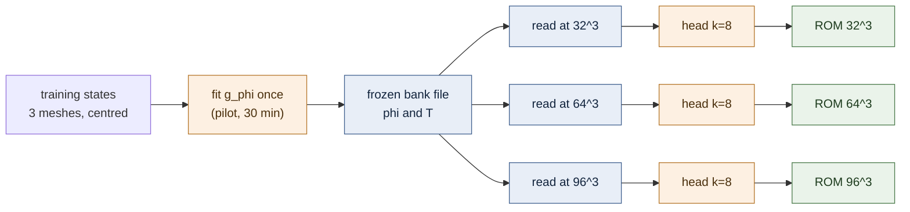

# NS3D: one coordinate-network bank inside the co-moving frame

Lane `exp/2026-10-01-ns3d-coordnet-bank` tests whether **one** trained coordinate-network bank, sampled unchanged at $32^3$, $64^3$ and $96^3$, can serve 3D periodic Navier–Stokes inside the co-moving frame in place of the parent lanes' per-mesh rank-64 centred POD bank, with the same $k=8$ head recipe and solver. Status: development numbers are final for 32^3, 64^3, 96^3; the 32-case test cohort was opened once and its numbers are final. **The bank is a 30-minute pilot fit frozen by a user decision taken after seeing its development floor (DESIGN A4)**, so bar (a) is relaxed and bar (b) is redefined relative to the floor; both deviations are marked where they are used. Generated by `reports/build_2026-10-01-ns3d-coordnet-bank.py` from the run JSONs.

## What was run

The parents' co-moving reduced model is unchanged: $u(x,t)=v(x-c(t),t)$ with $v=G_n a$, the frame increment $\delta=c^{n+1}-c^n$ solved every step from the same weak residual, tests the $M=292$ lowest divergence-free Fourier modes, implicit midpoint with $\Delta t=0.02$ and 3 damped Gauss–Newton sweeps. Only the bank $G_n$ changes. It is one network $g_\phi:\mathbb T^3\to\mathbb R^{3\times 64}$, $g=\nabla\times\psi_\phi$, with $\psi_\phi$ an MLP (4 SiLU layers of width 512) of integer-frequency Fourier features $\sin,\cos(2\pi k\cdot x)$, $\max_i|k_i|\le4$ — periodic by construction and divergence-free in the continuum. At mesh $n$ the bank is read as

$$G_n=\mathrm{L\ddot owdin}\big(P_n\,n^{-3/2}g_\phi(x_n)\,T\big),$$

with $P_n$ the full-order solver's discrete space (two-thirds mask and Leray projection), $T$ the parent lanes' QR+SVD importance ordering computed once from training states, and Löwdin the closest orthonormal matrix. The network was trained once on 3072 centred training states pooled across the three meshes (one third of the 512 trajectories at each mesh), by the variable-projection objective $1-\lVert P_GY\rVert_F^2/\lVert Y\rVert_F^2$ ($Y$ the weighted snapshot matrix compressed to 512 singular pairs). At each mesh the parent lanes' $k=8$ head recipe is trained on $G_n^{\mathsf T}$(centred training states) and the reduced model is run beside the parent lanes' POD-64 head, the CNAB2 ladder and the controls, in one allocation.

## Bar (a): projection floor of the centred states

Oracle-centroid floor: each development state is centred on its own true energy centroid, projected on the bank and shifted back; evolved worst over the 16 development cases. POD-64 is the parent lanes' bank, rebuilt in the same job. Pre-registered bar: coordnet ≤ 1.5 × POD-64 at every mesh. *A4 (user decision after the pilot): the floor is accepted at about 1 %; the pre-registered bar is evaluated and reported, not waived.*

| mesh | coordnet R=64 | POD-64 | ratio | coordnet prefixes R'=48 / 32 / 16 / 8 | job |
|---:|---:|---:|---:|---|---|
| 32^3 | 1.004% | 0.125% | 8.1x | 1.005% / 1.053% / 2.121% / 5.008% | 4713119 |
| 64^3 | 1.243% | 0.129% | 9.6x | 1.244% / 1.270% / 2.204% / 5.038% | 4713141 |
| 96^3 | 1.257% | 0.129% | 9.8x | 1.257% / 1.283% / 2.209% / 5.040% | 4713143 |

Training loss of the frozen fit 5.19e-05 against the optimum 3.73e-07 of the same objective at rank 64 (the weighted POD of the same data); that optimum's own 32³ floor is 0.142% (pilot job), so the gap is the network fit, not the data.
 Independent local recomputation of the pilot's 32³ floors: largest relative gap 2.78e-15 (passed True).

Bar (a) as pre-registered: **FAIL** (worst ratio 9.8x). Accepted at about 1 % by the user decision of A4. The larger ranks that would have answered "R needed to match POD-64" were cancelled by the same decision; that number is **not measured**.

## Does the frozen bank read the same on every mesh?

Sampling-only diagnostics of the frozen bank file (no flow data; `check_bank_meshes.py`) and the same quantities re-measured inside each mesh job.

| mesh | P_n removes (worst column) | pre-Löwdin max abs(GᵀG−I) | Löwdin column change | raw derivative mismatch (autodiff vs FFT) | D_d on the tests, autodiff vs FFT | restricted to 32³ vs read at 32³ (worst column) |
|---:|---:|---:|---:|---:|---:|---:|
| 32^3 | 3.60e-03 | 1.90e-02 | 1.22e-02 | 1.75e-01 | 4.91e-03 | — |
| 64^3 | 2.13e-05 | 1.36e-03 | 7.67e-04 | 2.00e-02 | 3.70e-05 | 1.43e-01 |
| 96^3 | 5.16e-07 | 1.49e-03 | 8.41e-04 | — | 1.51e-07 | 1.43e-01 |

Read at 96³ and restricted to 64³ against read at 64³: worst column 1.14e-02. The network carries energy above what a 32³ grid resolves: the 32³ reading differs from the finer readings by more than the finer ones differ from each other, and the autodiff/FFT derivative disagreement shrinks when the same network is read finer (aliasing, not a derivative error).

**Which derivative the frame uses.** $D_d=\Phi^{\mathsf T}\partial_dG_n$ is the exact spectral derivative of the sampled, projected, Löwdin-orthonormalised bank actually used (on the periodic grid $G_n$ is a trigonometric polynomial). Every job checks it against a dense spectral derivative and against a central difference of the Fourier shift the frame applies:

| mesh | derivative check | shift-sign check | tensor check |
|---:|---:|---:|---:|
| 32^3 | 1.07e-15 | 1.65e-11 | 1.27e-15 |
| 64^3 | 1.34e-15 | 1.60e-11 | 1.16e-15 |
| 96^3 | 4.02e-15 | 1.73e-11 | 1.22e-15 |

## The reduced model with the frozen bank (development, 16 cases)

Ladder setting ($\Delta t=0.02$, 3 sweeps), nothing tuned for the coordnet bank. Comparator = the fastest stable CNAB2 setting whose evolved worst is no larger than the arm's, same job, one randomised interleaved timing block; speedup = its median / the arm's median.

| mesh | arm | unknowns | evolved worst | median | its floor | worst / floor | GPU ms | CNAB2 comparator | speedup |
|---:|---|---:|---:|---:|---:|---:|---:|---|---:|
| 32^3 | coordnet_head_k8 | 11 | 1.022% | 0.753% | 1.004% | 1.02x | 5.71 | CNAB2 20 steps (0.788%, 2.9 ms) | 0.52x |
| 32^3 | coordnet_span16 | 19 | 2.621% | 1.916% | 2.121% | 1.24x | 3.31 | CNAB2 20 steps (0.788%, 2.9 ms) | 0.89x |
| 32^3 | coordnet_span32 | 35 | 1.477% | 0.903% | 1.053% | 1.40x | 3.78 | CNAB2 20 steps (0.788%, 2.9 ms) | 0.78x |
| 32^3 | coordnet_span48 | 51 | 1.652% | 0.923% | 1.005% | 1.64x | 3.90 | CNAB2 20 steps (0.788%, 2.9 ms) | 0.76x |
| 32^3 | coordnet_span64 | 67 | 1.873% | 1.031% | 1.004% | 1.86x | 5.36 | CNAB2 20 steps (0.788%, 2.9 ms) | 0.55x |
| 32^3 | coordnet_span8 | 11 | 5.000% | 3.261% | 5.008% | 1.00x | 3.11 | CNAB2 20 steps (0.788%, 2.9 ms) | 0.95x |
| 32^3 | pod_head_k8 | 11 | 0.151% | 0.090% | 0.125% | 1.21x | 5.70 | CNAB2 50 steps (0.094%, 6.5 ms) | 1.14x |
| 32^3 | pod_linear_R64 | 67 | 0.602% | 0.474% | 0.125% | 4.83x | 5.34 | CNAB2 40 steps (0.152%, 5.4 ms) | 1.02x |
| 64^3 | coordnet_head_k8 | 11 | 1.253% | 0.940% | 1.243% | 1.01x | 7.98 | CNAB2 40 steps (0.382%, 19.1 ms) | 2.40x |
| 64^3 | coordnet_span16 | 19 | 2.699% | 1.998% | 2.204% | 1.22x | 4.45 | CNAB2 40 steps (0.382%, 19.1 ms) | 4.29x |
| 64^3 | coordnet_span32 | 35 | 1.677% | 1.052% | 1.270% | 1.32x | 5.34 | CNAB2 40 steps (0.382%, 19.1 ms) | 3.58x |
| 64^3 | coordnet_span48 | 51 | 1.789% | 1.066% | 1.244% | 1.44x | 5.65 | CNAB2 40 steps (0.382%, 19.1 ms) | 3.38x |
| 64^3 | coordnet_span64 | 67 | 2.003% | 1.165% | 1.243% | 1.61x | 7.58 | CNAB2 40 steps (0.382%, 19.1 ms) | 2.52x |
| 64^3 | coordnet_span8 | 11 | 5.052% | 3.302% | 5.038% | 1.00x | 4.10 | CNAB2 40 steps (0.382%, 19.1 ms) | 4.67x |
| 64^3 | pod_head_k8 | 11 | 0.152% | 0.092% | 0.129% | 1.18x | 7.95 | CNAB2 50 steps (0.093%, 23.5 ms) | 2.96x |
| 64^3 | pod_linear_R64 | 67 | 0.616% | 0.489% | 0.129% | 4.78x | 7.56 | CNAB2 40 steps (0.382%, 19.1 ms) | 2.53x |
| 96^3 | coordnet_head_k8 | 11 | 1.267% | 0.954% | 1.257% | 1.01x | 16.06 | CNAB2 50 steps (1.048%, 92.1 ms) | 5.74x |
| 96^3 | coordnet_span16 | 19 | 2.703% | 2.005% | 2.209% | 1.22x | 8.90 | CNAB2 50 steps (1.048%, 92.1 ms) | 10.35x |
| 96^3 | coordnet_span32 | 35 | 1.687% | 1.064% | 1.283% | 1.31x | 11.19 | CNAB2 50 steps (1.048%, 92.1 ms) | 8.23x |
| 96^3 | coordnet_span48 | 51 | 1.796% | 1.078% | 1.257% | 1.43x | 12.82 | CNAB2 50 steps (1.048%, 92.1 ms) | 7.19x |
| 96^3 | coordnet_span64 | 67 | 2.009% | 1.176% | 1.257% | 1.60x | 15.55 | CNAB2 50 steps (1.048%, 92.1 ms) | 5.92x |
| 96^3 | coordnet_span8 | 11 | 5.056% | 3.306% | 5.040% | 1.00x | 7.95 | CNAB2 50 steps (1.048%, 92.1 ms) | 11.58x |
| 96^3 | pod_head_k8 | 11 | 0.153% | 0.093% | 0.129% | 1.18x | 15.97 | CNAB2 60 steps (0.063%, 109.6 ms) | 6.86x |
| 96^3 | pod_linear_R64 | 67 | 0.616% | 0.489% | 0.129% | 4.78x | 15.52 | CNAB2 60 steps (0.063%, 109.6 ms) | 7.06x |

For the head, "its floor" is the coordnet bank's R=64 floor (the bar (b′) reference); the head's own achieved encoder floor is in the gates section.

Bar (b′) (A4, user decision, fixed before the ROM jobs): **PASS**. Head worst / coordnet floor 32^3 1.02x, 64^3 1.01x, 96^3 1.01x (bar ≤ 1.5x at every mesh); head at 96³ 5.74x CNAB2 (bar ≥ 5x). The original bar (b) (≤ 0.25 % at 96³) fails: 1.267%.

Bar (c) (unchanged, the main question): **FAIL**. One bank file in all three jobs: True. Head evolved worst max/min over meshes 1.239 (≤ 1.25: True). Bank floor max/min 1.252 (≤ 1.25: False). Pre-Löwdin deviation worst 1.90e-02 (≤ 1e-3: False; known to fail before the ROM jobs, A4).

For reference, the parent lanes' per-mesh POD heads in the same jobs: max/min 1.011.

## Test cohort (seed 202609221, 32 cases), opened once

All settings frozen in `experiments/ns3d-coordnet/frozen/frozen_settings.json` (sha256 `aae294efe5a59bb22dcaf06925d3f1997e63347116152f7fca8c46c68415b708`), committed before the job; the per-mesh coordnet heads are the development jobs' heads. Rounded-row overlap with training, development, 202609203 and 202609211: 32^3 {'202609201': 0, '202609202': 0, '202609203': 0, '202609211': 0}, 64^3 {'202609201': 0, '202609202': 0, '202609203': 0, '202609211': 0}, 96^3 {'202609201': 0, '202609202': 0, '202609203': 0, '202609211': 0}.

| mesh | arm | evolved worst | median | over 5 % | worst / floor | GPU ms | CNAB2 comparator | speedup |
|---:|---|---:|---:|---:|---:|---:|---|---:|
| 32^3 | coordnet_head_k8 | 1.085% | 0.724% | 0/32 | 1.01x | 5.72 | CNAB2 40 steps (0.185%) | 0.93x |
| 32^3 | coordnet_span16 | 2.833% | 1.860% | 0/32 | 1.18x | 3.29 | CNAB2 40 steps (0.185%) | 1.62x |
| 32^3 | coordnet_span32 | 1.609% | 0.957% | 0/32 | 1.42x | 3.78 | CNAB2 40 steps (0.185%) | 1.41x |
| 32^3 | coordnet_span48 | 1.626% | 0.974% | 0/32 | 1.51x | 3.85 | CNAB2 40 steps (0.185%) | 1.39x |
| 32^3 | coordnet_span64 | 1.745% | 1.034% | 0/32 | 1.62x | 5.35 | CNAB2 40 steps (0.185%) | 1.00x |
| 32^3 | coordnet_span8 | 6.242% | 3.394% | 4/32 | 0.99x | 3.11 | CNAB2 20 steps (3.251%) | 0.94x |
| 32^3 | pod_head_k8 | 0.206% | 0.088% | 0/32 | 1.09x | 5.69 | CNAB2 40 steps (0.185%) | 0.94x |
| 32^3 | pod_linear_R64 | 1.093% | 0.481% | 0/32 | 5.78x | 5.34 | CNAB2 40 steps (0.185%) | 1.00x |
| 64^3 | coordnet_head_k8 | 1.265% | 0.914% | 0/32 | 1.01x | 7.84 | CNAB2 50 steps (0.123%) | 3.04x |
| 64^3 | coordnet_span16 | 2.902% | 1.950% | 0/32 | 1.17x | 4.49 | CNAB2 50 steps (0.123%) | 5.30x |
| 64^3 | coordnet_span32 | 1.777% | 1.095% | 0/32 | 1.36x | 5.28 | CNAB2 50 steps (0.123%) | 4.51x |
| 64^3 | coordnet_span48 | 1.754% | 1.148% | 0/32 | 1.39x | 5.68 | CNAB2 50 steps (0.123%) | 4.19x |
| 64^3 | coordnet_span64 | 1.865% | 1.174% | 0/32 | 1.48x | 7.46 | CNAB2 50 steps (0.123%) | 3.19x |
| 64^3 | coordnet_span8 | 6.270% | 3.438% | 4/32 | 0.99x | 4.13 | CNAB2 50 steps (0.123%) | 5.77x |
| 64^3 | pod_head_k8 | 0.208% | 0.092% | 0/32 | 1.09x | 7.82 | CNAB2 50 steps (0.123%) | 3.04x |
| 64^3 | pod_linear_R64 | 1.123% | 0.477% | 0/32 | 5.89x | 7.41 | CNAB2 50 steps (0.123%) | 3.21x |
| 96^3 | coordnet_head_k8 | 1.279% | 0.929% | 0/32 | 1.01x | 15.45 | CNAB2 70 steps (0.056%) | 7.92x |
| 96^3 | coordnet_span16 | 2.907% | 1.956% | 0/32 | 1.17x | 8.87 | CNAB2 70 steps (0.056%) | 13.79x |
| 96^3 | coordnet_span32 | 1.785% | 1.106% | 0/32 | 1.35x | 11.22 | CNAB2 70 steps (0.056%) | 10.91x |
| 96^3 | coordnet_span48 | 1.763% | 1.160% | 0/32 | 1.39x | 12.40 | CNAB2 70 steps (0.056%) | 9.87x |
| 96^3 | coordnet_span64 | 1.871% | 1.185% | 0/32 | 1.47x | 15.05 | CNAB2 70 steps (0.056%) | 8.13x |
| 96^3 | coordnet_span8 | 6.272% | 3.441% | 4/32 | 0.99x | 7.89 | CNAB2 60 steps (4.738%) | 13.39x |
| 96^3 | pod_head_k8 | 0.207% | 0.091% | 0/32 | 1.08x | 15.45 | CNAB2 70 steps (0.056%) | 7.92x |
| 96^3 | pod_linear_R64 | 1.123% | 0.477% | 0/32 | 5.89x | 14.96 | CNAB2 70 steps (0.056%) | 8.18x |

Test, coordnet head worst max/min over meshes 1.179; head worst / floor 32^3 1.01x, 64^3 1.01x, 96^3 1.01x.

## Controls (each must fail on real data)

| control | 32^3 | 64^3 | 96^3 | fails as required |
|---|---:|---:|---:|---|
| fixed-frame coordnet bank (trained on uncentred states, R=64, no shift anywhere) | 70.16% | 70.16% | 70.16% | True |
| (reference) same-data POD-64 of the uncentred states | 70.16% | 70.16% | 70.16% | — |
| frozen centred bank, development states not centred (pilot job) | 97.59% | — | — | True |
| coordnet head with the frame frozen (δ ≡ 0), development | 40.19% | 40.27% | 40.36% | True |
| coordnet head with the frame frozen (δ ≡ 0), test | 42.46% | 42.39% | 42.57% | True |

The fixed-frame control was trained with the A3 recipe (band-limit penalty, 1.5 h), not the pilot recipe; it is a control of the frame, not of the fit.

## Gates and audits

- **development 32^3** (job 4713119, NVIDIA A100 80GB PCIe): gates `final`. POD reference reproduces its earlier job: max |Δerror| 6.53e-16 (passed True). POD bank rebuild gap 0.00e+00. Coordnet head encoder floor 1.004%. Fixed-sweep vs generic LM 1.89e-09. Timing gate True; timed outputs vs accuracy pass 0.00e+00. NumPy audit passed True (perturbed copy rejected True; independent floor recomputation gap 0.00e+00). Flags: flag (bar c): orthonormality before Lowdin 1.90e-02; flag: D_d autodiff vs spectral 4.91e-03 > 1e-4.
- **development 64^3** (job 4713141, NVIDIA A100 80GB PCIe): gates `final`. POD reference reproduces its earlier job: max |Δerror| 1.01e-12 (passed True). POD bank rebuild gap 2.19e-13. Coordnet head encoder floor 1.243%. Fixed-sweep vs generic LM 1.44e-09. Timing gate True; timed outputs vs accuracy pass 0.00e+00. NumPy audit passed True (perturbed copy rejected True; independent floor recomputation gap 0.00e+00). Flags: flag (bar c): orthonormality before Lowdin 1.36e-03.
- **development 96^3** (job 4713143, NVIDIA A100 80GB PCIe): gates `final`. POD reference reproduces its earlier job: max |Δerror| 8.93e-13 (passed True). POD bank rebuild gap 1.89e-13. Coordnet head encoder floor 1.257%. Fixed-sweep vs generic LM 8.60e-10. Timing gate True; timed outputs vs accuracy pass 0.00e+00. NumPy audit passed True (perturbed copy rejected True; independent floor recomputation gap 2.21e-15). Flags: flag (bar c): orthonormality before Lowdin 1.49e-03.
- **test 32^3** (job 4717237, NVIDIA A100 80GB PCIe): gates `final`. POD reference reproduces its earlier job: max |Δerror| 1.98e-13 (passed True). POD bank rebuild gap 3.09e-13. Coordnet head encoder floor 1.076%. Fixed-sweep vs generic LM 3.20e-09. Timing gate True; timed outputs vs accuracy pass 0.00e+00. NumPy audit passed True (perturbed copy rejected True; independent floor recomputation gap 0.00e+00). Flags: flag (bar c): orthonormality before Lowdin 1.90e-02; flag: D_d autodiff vs spectral 4.91e-03 > 1e-4.
- **test 64^3** (job 4717237, NVIDIA A100 80GB PCIe): gates `final`. POD reference reproduces its earlier job: max |Δerror| 4.42e-13 (passed True). POD bank rebuild gap 2.82e-13. Coordnet head encoder floor 1.259%. Fixed-sweep vs generic LM 7.50e-10. Timing gate True; timed outputs vs accuracy pass 0.00e+00. NumPy audit passed True (perturbed copy rejected True; independent floor recomputation gap 0.00e+00). Flags: flag (bar c): orthonormality before Lowdin 1.36e-03.
- **test 96^3** (job 4717237, NVIDIA A100 80GB PCIe): gates `final`. POD reference reproduces its earlier job: max |Δerror| 2.89e-13 (passed True). POD bank rebuild gap 2.03e-13. Coordnet head encoder floor 1.272%. Fixed-sweep vs generic LM 1.49e-09. Timing gate True; timed outputs vs accuracy pass 0.00e+00. NumPy audit passed True (perturbed copy rejected True; independent floor recomputation gap 1.64e-15). Flags: flag (bar c): orthonormality before Lowdin 1.49e-03.

## What went wrong, what was changed, what is retracted

- Found by the first Codex audit before any job: the integer Fourier frequencies were in the optimised parameter tree, so Adam would have moved them and broken periodicity without any divergence check noticing. Fixed (gradient zeroed, frequencies asserted at every save/load) before the pilot.
- The pre-registered bank-training plan (5 h, then 10 h fits at R = 64/128/256 with a band-limit penalty) was not carried out: after seeing the pilot's 32³ floor the user froze the 30-minute pilot bank (DESIGN A4). Bar (a) as registered fails; it was relaxed to 'accepted at about 1 %'. Bar (b) (0.25 % at 96³) was replaced by a bar relative to the bank's own floor. The 'R needed to match POD-64' question is unanswered.
- The pilot bank was fitted without the band-limit penalty that the pilot itself showed to be needed: the network has detail finer than a 32³ grid resolves, so the 32³ reading of the bank is a measurably different bank from the 64³/96³ readings (pre-Löwdin deviation and cross-mesh tables). It is the likely cause of the bar (c) failure below (the 32³ reading has the lowest floor; 64³ and 96³ agree closely); this was not tested with a band-limited bank, so it is an inference about this artifact, not a result about the method.
- The autodiff vs FFT derivative disagreement first read as a correctness problem; it is aliasing of the network on the grid (it shrinks when the same network is read finer). The frame uses the exact spectral derivative of the bank actually used, checked in every job; nothing was retracted, but the in-job autodiff comparison remains a flag at 32³.
- One stray, malformed submit command (missing arguments) was issued before the test job; it exited before creating a directory or a job (squeue before and after showed exactly one test job).
- Gate wording: a job's `status: final` means its integrity gates passed; it is not a verdict on the bars, which this report evaluates.
- Pilot job 4708239: three architectures, 30 min each; training losses A 5.19e-05, B 9.81e-05, C 1.72e-04. Its real-mesh gates fired (32³ pre-Löwdin deviation 1.90e-02, raw derivative mismatch 1.75e-01). Architecture A's bank from this job is the frozen bank (A4).

## Answer to the research question

**Yes, mechanically; no, as a drop-in replacement at the POD's accuracy.** One frozen network file, read at 32³, 64³ and 96³ with no per-mesh fitting of the bank, runs the co-moving reduced model at every mesh: the frame solves its shift, the frame-frozen control fails as it must, and the $k=8$ head sits within a few per cent of its bank's floor on development and on test (tables above). At 96³ the head is faster than its CNAB2 comparator by more than the 5x bar on both cohorts.

**Accuracy is set by the bank, and this bank is about an order of magnitude less accurate than the per-mesh POD.** The frozen fit's floor is several times the POD-64 floor at every mesh and its training loss is far above the optimum of its own objective, so this is a fitting shortfall of a 30-minute fit, not a limit shown for the approach. The bars were relaxed after the pilot by the user (A4); judged by the pre-registered bars (a) and (b) the result fails.

**Bar (c), the main question, fails as pre-registered.** The head error and the floor at 64³ and 96³ agree closely, but the 32³ reading is a measurably different bank (lower floor, pre-Löwdin deviation an order of magnitude larger, columns differing by more than ten per cent after restriction), because the unpenalised network carries detail a 32³ grid cannot resolve. The head's max/min ratio passes 1.25 on development, the floor's ratio misses it narrowly, and the orthonormality sub-criterion fails at every mesh. So the statement that holds is: one coordinate-network bank can be read on every mesh that resolves it and gives mesh-consistent errors there; on a mesh that does not resolve it, it becomes a different (here, slightly better) bank. Whether a band-limited fit removes the 32³ discrepancy is open.

## Open

- A bank fitted with the band-limit penalty (or read only at meshes that resolve it) is the direct test of whether bar (c) fails because of this artifact's aliasing or because of the approach; the cancelled production fits would have answered it.
- The floor gap to POD-64 is a fitting gap (the training loss of the frozen fit is far above the optimum of its own objective); longer fits or larger ranks were not run.
- The heads are trained per mesh; a single head shared across meshes was not tested.

## Provenance

| role | run | slurm id | GPU | source commit | summary sha256 |
|---|---|---:|---|---|---|
| pilot (frozen bank) | `pilot` | 4708239 | NVIDIA A100 80GB PCIe | `962be67eda` | `06cd99eba0196535…` |
| fixed-frame control | `ff64b` | 4711021 | NVIDIA A100 80GB PCIe | `c072d8102e` | `6aa13c6bb25a72eb…` |
| development 32^3 | `dev32` | 4713119 | NVIDIA A100 80GB PCIe | `2c15704873` | `5b81ca55b5c3b6c6…` |
| development 64^3 | `dev64` | 4713141 | NVIDIA A100 80GB PCIe | `2c15704873` | `fe1d7788ddf32519…` |
| development 96^3 | `dev96` | 4713143 | NVIDIA A100 80GB PCIe | `2c15704873` | `5dc158115e51efee…` |
| test 32^3 | `test` | 4717237 | NVIDIA A100 80GB PCIe | `a5ed12600d` | `94f0fea69e6927a2…` |
| test 64^3 | `test` | 4717237 | NVIDIA A100 80GB PCIe | `a5ed12600d` | `c21abcd0b49d51fe…` |
| test 96^3 | `test` | 4717237 | NVIDIA A100 80GB PCIe | `a5ed12600d` | `e9babd7715bd644b…` |

Frozen bank file `experiments/ns3d-coordnet/banks/pilot/bank_selected.npz`, sha256 `9a010260de043e95ac4eee72ce9fd85ecdcf920968d4a34a5334f285a6bd648b`.
 Frozen test settings sha256 `aae294efe5a59bb22dcaf06925d3f1997e63347116152f7fca8c46c68415b708`.
 Jobs that never computed: 4711010, 4711011, 4711013, 4711015 (GPU preflight failed on node pax007: no CUDA device; logs in runs/failed_preflight/); 4711018, 4711019, 4711020 (10 h production fits at R=64/128/256, cancelled after about 25 min by the user decision of A4; logs in runs/cancelled/).

## Glossary

- **bank $G_n$** — the fixed spatial basis (here 64 vector fields) the reduced state lives in, read at mesh $n$.
- **coordinate network (coordnet)** — a neural network evaluated at a point $x$; it returns 64 vector fields at once, so reading it on any grid gives a bank.
- **vector potential / curl** — the network outputs $\psi$; the bank is $\nabla\times\psi$, whose divergence is zero.
- **POD-64** — the parent lanes' bank: the best 64-dimensional linear basis, in mean square, of 768 centred training states, rebuilt at each mesh.
- **same-data POD** — the POD of exactly the data the coordnet was trained on: the best any 64-column bank can do on its training objective.
- **centred, co-moving frame, δ** — states are shifted so their energy centroid sits at the origin; the reduced model solves the shift increment δ at every step.
- **floor (oracle-centroid floor)** — error of the best reconstruction of a true state in the bank after centring it on its true centroid. A fixed reference, not a strict lower bound for a model that solves its own shift.
- **evolved worst / median** — per case, the largest relative $L^2$ error (relative to $\lVert u_0\rVert$) over the output times after $t=0$; then the worst / median over cases.
- **worst / floor** — an arm's evolved worst divided by the floor of the bank it lives in; 1 means the solve loses nothing beyond the bank.
- **over 5 %** — number of cases whose evolved worst exceeds 5 %.
- **prefix $R'$, span arm** — the first $R'$ columns of the importance-ordered bank; the span arm is the linear reduced model in them.
- **head $h$, $k$** — small network mapping $k=8$ numbers to the 64 bank coefficients; the nonlinear trial manifold, trained per mesh.
- **Löwdin** — symmetric orthonormalisation $B(B^{\mathsf T}B)^{-1/2}$; how much it changes the sampled bank measures how far that reading is from the trained bank.
- **$P_n$** — projection on the full-order solver's discrete space at mesh $n$: two-thirds dealiasing mask and divergence-free (Leray) projection.
- **pre-Löwdin deviation** — largest entry of $G^{\mathsf T}G-I$ for the sampled bank before orthonormalisation; zero for a bank that reads identically on every mesh.
- **raw derivative mismatch** — relative difference between the network's automatic-differentiation derivatives at the grid nodes and FFT derivatives of its sampled values; large when the network has detail finer than the grid.
- **$D_d$** — the frame operator: tests applied to the $x_d$-derivative of every bank column.
- **CNAB2** — the pseudo-spectral full-order solver (Crank–Nicolson viscous, Adams–Bashforth-2 advection); truth at Δt = 0.001 and the speed comparator.
- **comparator / speedup** — the fastest stable CNAB2 setting at least as accurate as the arm; speedup = its median time / the arm's, from one interleaved timing block in the same job.
- **fixed-sweep vs generic LM** — difference between the 3-sweep Gauss–Newton query and a converged Levenberg–Marquardt reference on the same residual.
- **development / test** — the 16 cases used for every choice / the 32 cases evaluated once with everything frozen.
- **A3, A4** — amendments to the pre-registration; A4 is the user's decision, taken after the pilot, to freeze the pilot bank and change bars (a) and (b).
