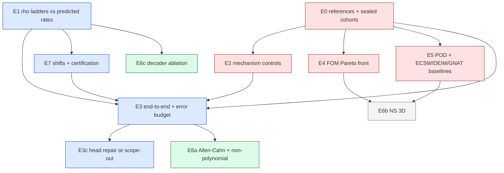

# JCP paper plan: classical quadrature in place of empirical hyper-reduction for neural-field ROMs

This is the plan for a Journal of Computational Physics paper. It combines our Burgers reduced models with Hari's off-mesh quadrature study. Status: **plan, nothing run; revised after an independent Codex audit** (`2026-10-06-jcp-offmesh-paper-plan/06-codex-audit.md`). A five-agent team built it on 2026-10-06; their full notes are in `2026-10-06-jcp-offmesh-paper-plan/01–05-*.md`. **Where this plan and the notes disagree, this plan governs.** The audit found errors in notes 03 (theory) and 04 (experiment design) that are corrected here but not edited in the notes. Every existing number quoted below is copied from `2026-10-01-burgers3d-offmesh-quadrature.md` (3D), `2026-10-01-burgers2d-offmesh-quadrature.md` (2D) or Hari's `SUMMARY.md`, with the source named. None of them is a new result. The paper's own tables must be generated from run JSONs.

## 1. The paper in one paragraph

Our trial space is a smooth function of position: $u(x)=G(x)c$, a frozen coordinate-network bank. Because of that, hyper-reducing the nonlinear term is a **numerical-integration problem with a continuum target**, not a data-fitting problem on the mesh. We replace data-fitted, mesh-node hyper-reduction (NNLS empirical quadrature, sub-lattices, the precomputed quadratic tensor) with fixed classical rules — tensor Gauss–Legendre and rank-1 lattices — evaluated off the mesh with the bank's exact gradient. Three consequences are measured, and each is explained by theory:

1. **The reduced model no longer inherits the mesh stencil's $O(h)$ consistency error.**
2. **No per-mesh or per-state fitting is needed, and storage falls from $MR'^2$ to $m(2R'+M)$.**
3. **Which rule works is explained by the integrand's regularity.** Gauss converges geometrically for an analytic decoder. Lattices have an algebraic upper bound set by how the integrand vanishes at the walls. Sparse grids fail on tensor sine tests.

A rule-doubling and random-shift estimate gives a data-free error indicator online. Whether it is reliable enough to call a certificate is an empirical question (E7), not a theorem.

**What the paper is not:**
- not a speed-up paper;
- not a "first off-mesh ROM" paper (CROM, SNF-ROM and Weder–Schwerdtner–Peherstorfer came first);
- not a nonlinear-manifold paper, unless the head setting is repaired (§5, K5).

## 2. Where the evidence stands today

| claim | status today | source |
|---|---|---|
| Off-mesh ROM error is flat across 64³–256³ (3D); the stencil tensor is not | **solid** (held-out, H200, f64), but measured against a first-order reference | 3D §4 |
| Lattice beats Gauss at equal $m$ in 3D; Smolyak and lattice-256 controls fail | **solid** on one random shift only; ladders are from 24 validation certification cases, not the held-out cohort | 3D §3 |
| Advection memory 4.30 GB → 0.34 GB (gl24) at $R'=512$; query faster than the tensor in all six cells | **solid** | 3D §5 |
| 2D linear settings mesh-invariant case by case (≤ 0.011 pp); solve time flat in $N$ | **solid**, but the rules were chosen after the fact | 2D "Answers in brief" |
| Off-mesh is *more accurate* than the tensor and the same-mesh FOM | **fragile**: holds at 64³/128³ against a first-order reference; at 256³ the best FOM is more accurate, and at 256³, $R'=256$ the tensor gap is inside the reference uncertainty. The bank was trained on finer data and the mechanism is not isolated | 3D §2, §4, §8 |
| Speed-up over the FOM | **weak**: slower at 64³ (same-grid rule); at 256³, $R'=512$, tensor → selected `gl24` is 2.21× → 2.59× under the same-grid rule, or 6.45× under the fragile refined-reference rule | 3D §5 |
| Nonlinear head setting | **negative** in 2D (not mesh-invariant, failed confirmation); never run in 3D | 2D test tables |
| Generality beyond Burgers | **none at full scale**; Hari's Allen–Cahn, HJ and Bratu are CPU runs with $R=128$ | Hari §3 |
| Hyper-reduced POD baselines (ECSW/DEIM/GNAT) | **never run**; past POD-LSPG rows used a dense residual | evidence inventory §4 |
| Theory | **none yet**; drafted in note 03 | — |

## 3. What would get the paper rejected, and the fix for each

The red team (note 05) ranked 23 objections. These are the ones that are fatal unless fixed.

| # | objection | fix (experiment id, §5) |
|---|---|---|
| F1 | "Beats the FOM" is an artefact of a first-order upwind FOM and a first-order reference with 513 nodes per axis | order-verified second-order references **E0**; second-order FOM in the cost panel **E4** |
| F2 | It is super-resolution: the 3D bank saw fields of up to 129 nodes per axis | bank trained only on the coarsest-mesh data **E2c** |
| F3 | The mechanism is the analytic gradient, not off-mesh points | an arm using **mesh nodes + analytic gradient** (equal-weight trapezoid), plus a second-order stencil tensor **E2a/E2b** |
| F4 | No standard hyper-reduced ROM baseline | POD-LSPG/Galerkin at $r=R'$ with ECSW, Q-DEIM and GNAT, plus POD with the exact tensor and best-practice EQ on our bank **E5** |
| F5 | The title says nonlinear manifold, but the head failed | drop the word, or repair the head under pre-registration **E3c** |
| F6 | Burgers is quadratic, so the exact tensor already exists | one full-scale nonlinearity where no tractable tensor exists **E6a** |
| F7 | "A-priori error control" is contradicted by empirical selection and by $\rho$ growing with the mesh | state the theory as conditional bounds, and treat rule doubling plus random shifts as an empirically validated *indicator*, not a certificate **E7** |
| F8 | Speed-up is small, negative, or an artefact of how coarse the FOM settings ladder is | a dense ladder of actually run FOM settings (comparator chosen on validation), the crossover mesh, and never a speed-up without its accuracy pair **E4** |

## 4. Paper outline (≈30 pages, Elsevier preprint format)

1. **Introduction.** Hyper-reduction as data fitting on the mesh, and its costs: per-mesh fits, held-out certification, memory, and inheriting stencil error. Continuous decoders make the nonlinear term an integral. Contributions: (i) fixed classical rules with characterised convergence replace fitted hyper-reduction for the tested term; (ii) mesh-target vs continuum-target analysis; (iii) rule-family characterisation explained by integrand regularity; (iv) a data-free error indicator, validated empirically; (v) full-scale 2D/3D evidence with standard baselines. Limitations stated in the introduction.
2. **Related work.** LSPG and NM-ROMs; hyper-reduction (DEIM, GNAT, ECSW, EQP, ECM, CECM); continuous and neural-field ROMs (CROM, LiCROM, SNF-ROM, Weder et al., Simplicits); quadrature theory (Gauss, lattices, sparse grids); VPINN quadrature analysis. Cite each "first" correctly (note 02 §3).
3. **Reduced model.** Bank, sine tests, backward-Euler tested residual $r(c)=D(Ac-p+\Delta t(N(c)+\nu\Lambda Ac))$, and Levenberg–Marquardt. Use the earlier manuscript's notation.
4. **Hyper-reduction of the tested term.** Mesh-target rules (dense, sub-lattice, EQ/ECSW, tensor) against continuum-target rules (Gauss, lattice, Sobol, Smolyak); the off-mesh assembly $N(c)=P^{\top}[(Bc)\odot(Dc)]$; and the cost model of §4 of note 03, with the crossover $m^\star=4R'F/\mathrm{BW}$ against the tensor.
5. **Analysis** (note 03):
   - Gauss: geometric convergence for an analytic decoder via Bernstein ellipses. The explicit strip-width bound in note 03 is wrong and must be re-derived.
   - Lattice: a *conditional upper bound* from the boundary vanishing order (at least second order, generically giving algebraic Fourier decay). Observed slopes are reported separately and are not called the asymptotic rate.
   - Smolyak: the tensor-exactness node-count lower bound, which is provable. The error lower bound for these integrands is not proved and is stated as such.
   - Upwind expansion: the stencil equals the continuum term minus $O(h)$ numerical diffusion, so the two targets have two plateaus. Rollout mesh invariance additionally needs stability and the same solution branch, which the failed head setting shows is not automatic.
   - Strang-type a-priori ROM error bound, conditional on a measured stability constant.
   - Rule doubling: an error *indicator* with effectivity bounds under a saturation assumption that cannot be verified from the data alone.
6. **Numerical study I: quadrature** (E1, E7). Measured rates against the bounds, decoder ablation, shift distributions, indicator effectivity and coverage.
7. **Numerical study II: mechanism** (E2). Gap rates for first- vs second-order stencils; trapezoid with analytic gradient; coarse-trained bank; all-continuum arm.
8. **Numerical study III: reduced solves** (E3, E5, E6). Burgers 2D/3D and the second nonlinearity, scored against order-verified references on sealed cohorts, with the error budget and the baselines.
9. **Cost** (E4). Per-Jacobian roofline, flat-in-$N$, speed-up against validated FOM settings, offline cost and break-even.
10. **Limitations and discussion.** Box domains, smooth solutions, $O(N)$ projection and decoding unless the all-continuum path is used, slower than the FOM on coarse meshes, and the head setting.
11. **Data and code availability.** Zenodo snapshot of the code mirror, run JSONs, the frozen `selection.json` hashes, and scripts that generate the tables.

**Title (recommended):** *Classical quadrature in place of empirical hyper-reduction for neural-field reduced-order models.*

## 5. Experiment campaign

Full designs are in note 04; the red team's extra controls are folded in here. Every lane follows the existing contract:
- pre-registered `DESIGN.md`, with a Codex audit of the design, the code and the results;
- gates checked at one real mesh before any verdict;
- controls that must fail, and do fail on real data;
- validation-only selection, then sealed test cohorts opened once after the selection hash is committed;
- tables generated by script.

| id | question it answers | key arms and controls | GPU-h |
|---|---|---|---|
| **E0** | Are our references good enough to rank arms? | second-order central + Crank–Nicolson references at three nested levels, with the observed order checked per case; failed cases are reported and refined, never silently dropped; no fallback to two fourth-order levels (it cannot verify order); Richardson uncertainty $\epsilon_{ref}$, with $2\epsilon_{ref}$ as the resolution limit for differences between two arms; pseudo-spectral cross-check; a scoring lattice that is a subset of *every* compared mesh, or audited interpolation; new sealed (2D 128, 3D 64) and out-of-distribution cohorts | 120 |
| **E1** | Do measured $\rho$ rates agree with the theory? | all rule families against the Gauss and lattice bounds; machinery check on a *polynomial* bank with known Gauss exactness (Gauss is not exact on sines); controls lat256, Smolyak 8, Gauss 8², each judged against the converged target; the bank-bandwidth measurement for slow 2D convergence | 15 |
| **E2** | Is the gain from the continuum target, the analytic gradient, or training data? | (a) dense and tensor with a **second-order** stencil (gap slope 2); (b) **mesh-node trapezoid + analytic gradient**; (c) **bank trained on coarsest-mesh data only**; (d) all-continuum arm (mesh touched nowhere); Allen–Cahn as the no-gap control | 50 |
| **E3** | End-to-end accuracy at strong references | 2D 256²–4096² including 512² and 2048²; 3D 64³–256³ (+384³); sealed cohorts; per-case error budget in which every component is measured by its own ablation, none defined as "the remainder"; interactions reported; no ranking claimed inside $2\epsilon_{ref}$ | 80 |
| **E3c** | Can the 2D head be repaired? | hypotheses (initial-fit basin, LM branch, mesh-dependent linear terms), each tested by changing **one ingredient at a time** (removing all mesh dependence at once proves nothing); fixes tried on validation only; scope decided by confirmed accuracy and invariance on the sealed cohort, not by whether the failure is explained | 15 |
| **E4** | Cost, honestly | roofline per Jacobian; flat-$N$ for solve *and* full query; FOM ladder over Δt × tolerances × **FOM mesh** for Newton–BiCGStab, Newton–GMRES, IMEX-CG and a second-order FOM; the comparator FOM setting is chosen on **validation** and the speed-up is read from **actually run** settings, never from interpolation; paired A–B–A timing inside one job; an injected timing fault **larger than the drift gate** must be caught; offline cost and break-even | 60 |
| **E5** | Does a standard hyper-reduced ROM do as well? | POD-LSPG/Galerkin at $r=R'$ and smaller with ECSW, Q-DEIM and GNAT, each run with its **native** solver plus a common-solver ablation; **POD + exact quadratic tensor**; best-practice EQ on our bank; continuum ECSW; CROM-style sampler; POD + interpolation + our rule; equal tuning budgets on validation only | 90 |
| **E6a** | Generality beyond quadratic advection | full-scale 2D banks for **Allen–Cahn** (cubic: a tensor would need $MR'^3$; no stencil gap is predicted, so it tests quadrature and cost only) and the **genuinely non-polynomial** time-dependent $e^u$ reaction–diffusion (Frank-Kamenetskii), with PDE-specific predictions registered beforehand; HJ optional | 120 |
| **E6c** | What does the neural decoder buy? | full-scale decoder ablation: RFF, SIREN, RBF, fixed sine bank, POD + cubic, POD + bilinear | 70 |
| **E7** | Robustness and the error indicator | 64 shifts or scrambles per rule; rule-doubling and shift-spread indicators for the **deployed single shift** (not the shift-average standard error), with a stated safety factor and empirical coverage reported as coverage, not as a bound; a bad generating vector must be caught by an **independent** rule family, since doubling cannot detect it; any rule-size increase is decided on validation only; Δt and $R'$ sweeps; per-mesh checks | 60 |
| E6b | NS 3D (stretch) | only after K2 and K3 pass; predicts no accuracy gain against the spectral FOM, so only cost and mesh independence | 50 |

**Total ≈ 730 GPU-h** (680 without the NS 3D stretch; ≈ 900 with 25 % contingency). At four continuously busy GPUs that is **at least 7.6 days** (9.4 with contingency), before queueing and dependency stalls, so plan on about two to three weeks of wall time plus write-up. Note 04 budgets 715 GPU-h; the difference is the coarse-trained bank and the mesh-node analytic-gradient arm added to E2 here, which note 04 does not cost.

**Sealing is global, not per lane.** Every rule size, baseline setting, FOM comparator and indicator threshold, in every lane, is frozen and hashed before *any* lane opens the shared sealed cohort. Nothing is re-tuned after it is opened. A method changed afterwards needs a fresh cohort. Reference generation and quality control are separated from access to the sealed-case solutions.

Red items can force a reframing, so they run in week 1. E1 and the ρ part of E7 use existing reached states and start immediately.

### Kill criteria (each forces a written reframing before more compute is spent)

All are judged on the sealed cohort with the metrics fixed in the lane's `DESIGN.md`. "Matches" means the paired per-case error difference has a bootstrap interval within $\pm 2\epsilon_{ref}$. The mesh set is fixed in advance: 2D 256²–4096², 3D 64³–256³.

| id | if… | then the paper… |
|---|---|---|
| K0 | any reference case fails order verification after refinement, or the pseudo-spectral cross-check disagrees beyond $2\epsilon_{ref}$ | makes no accuracy ranking on the affected cases (reported, not dropped); uses only $\rho$ and distance from dense there |
| K1 | the second-order mesh tensor **or** the mesh-node trapezoid with analytic gradient matches off-mesh at no more cost, on at least two of the fixed meshes | drops "more accurate than a good mesh method" (the measured gap to the first-order incumbent stays reported); the contribution becomes continuum evaluation, with off-mesh placement a convenience |
| K2 | the speed-up over the best validated FOM setting is below 2× at the largest fixed mesh (4096², 256³) for every linear setting | makes no "substantially faster" claim; reports the speed-up honestly and leads with memory and mesh-independent cost, each backed by E4 |
| K3 | POD-LSPG + ECSW at $r=R'$ matches accuracy at no more online cost on every fixed mesh | does not claim the decoder beats standard ROMs; reports transfer across meshes, storage and offline cost separately; becomes "classical quadrature for smooth continuous bases" |
| K4 | the indicator under-estimates (effectivity < 0.5) on any validation state, or misses the stated coverage | makes no certification claim; deploys rules sized by validation only and says so |
| K5 | the head fails confirmed accuracy or mesh invariance on the sealed cohort | is restricted to linear-span neural-field bases, stated in the abstract, whatever the diagnosis |
| K6 | a second PDE fails its **own** registered prediction (Allen–Cahn: no gap, same rule ranking; $e^u$: convergence and accuracy bars) | narrows generality claims per PDE and per property, in title and abstract |

Reference or indicator failures (K0, K4) can independently remove central claims. Simultaneous K1, K2 and K3 would reduce the work to a short note on quadrature for continuous ROM bases.

## 6. Proposed lanes (not created; need your approval)

All branch from the current fork point `exp/2026-10-01-ns3d-coordnet-bank` @ `21c175a1b`. Each is a sparse worktree with its own `sync_github.sh` and cluster namespace.

| order | worktree `worktrees/…` (branch `exp/…`) | experiments | GPU-h |
|---|---|---|---|
| 1 | `2026-10-07-jcp-references` | E0 (writes the shared, read-only reference store) | 120 |
| 1 | `2026-10-07-jcp-mechanism` | E1, E2 | 65 |
| 2 | `2026-10-07-jcp-fom-pareto` | E4 FOM side and timing harness | 40 |
| 2 | `2026-10-07-jcp-hr-baselines` | E5 | 90 |
| 3 | `2026-10-07-jcp-endtoend` | E3, ROM side of E4 | 100 |
| 3 | `2026-10-07-jcp-head2d` | E3c | 15 |
| 3 | `2026-10-07-jcp-robustness` | E7 | 60 |
| 4 | `2026-10-07-jcp-generality` | E6a, E6c | 190 |
| 5 | `2026-10-07-jcp-ns3d` | E6b, after go/no-go | 50 |

## 7. Theory work (no GPU)

Note 03 drafts every statement and says whether each is provable, conditional or heuristic. Open items to close or scope out:
- the time-stepping stability constant (A4), to be measured rather than proved;
- the saturation assumption behind certification, guarded by a three-level check;
- the Smolyak error lower bound, which is heuristic;
- the tent-transform rate discrepancy against Hari's data;
- non-box domains.

Note 03 §6 lists checks C1–C11. Most are mapped into E1–E7. Still to add to the lane designs:
- C5, a diagonal vs anisotropic test-mode analysis for Smolyak;
- C6, a leading-coefficient comparison for the $O(h)$ plateau;
- C7, injected perturbations of known size with the stability response;
- C9, the $R'=1024$ cost sweep in E4;
- C11, the convergence-slope test.

**On the lattice rate:** existing data (3D, 64³, $R'=512$, one shift, rounded table entries) fall by roughly 8–13× per doubling. That is consistent with an algebraic rate near $m^{-3}$ over this range, but it does not establish an asymptotic rate. The paper reports fitted slopes from JSON over many shifts and states the theory as an upper bound. Hari's "super-algebraic" description of lattices should not be repeated.

Theory items the audit found **wrong** in note 03, to be re-derived before drafting:
- the explicit Gauss strip-width bound (layerwise pole avoidance, ellipse beyond $[0,1]$, $p$ vs $n+1$ points);
- "a sine bank is only $m^{-3}$" (an upper bound is not a lower bound);
- the universal Gauss/lattice crossover and the $2^d$ tent penalty;
- "beating the FOM is possible only because of finer training data".

The tent transform genuinely makes this integrand smoother; Hari's "adds a kink" explanation is wrong here.

## 8. Decisions needed from you

1. **Authorship and Hari.** The paper builds directly on Hari's proposal, code and study. Agree authorship and who writes what with Hari before drafting. His scaled-down CPU numbers should appear only as motivation, never as evidence.
2. **Code provenance.** New lanes either vendor the off-mesh code byte-identically (with `PROVENANCE.json`) from the two unmerged quadrature branches, or fork from those branch tips. Recommendation: **vendor**, because it keeps the fork point uniform.
3. **FOM scope.** The 2026-09-21 rule (named iterative FOMs only, no coarse-grid or spectral controls) was made for the discarded ICLR draft. A JCP referee will ask for a coarse-grid FOM, a second-order FOM, and likely a spectral solver on this box. Recommendation: **run all of them** (E4) and decide later what is printed.
4. **Scope of the non-polynomial case (E6a).** Time-dependent $e^u$ reaction–diffusion is recommended. Porous-medium $u^m$ is an alternative.
5. **Approve the lane names in §6**, and whether to start with the four week-1 kill experiments only (E0, E2, E4, E5 on the 2D 1024² cell; ≈ 300 GPU-h) before committing the rest.
6. **The NS 3D stretch lane (E6b):** keep it or drop it.

## Glossary

- **ROM / reduced model**: solves for a few hundred coefficients instead of one value per mesh node. **FOM**: the full-order solver.
- **bank, $G(x)$, $R'$**: the frozen coordinate network and the number of its outputs used; the field is $u=G(x)c$. **head**: a nonlinear map from a small latent to $c$ (the "nonlinear-manifold" setting). **linear span / linear rung**: solving directly for $c$.
- **tests $\psi_{ab}$, $M$**: sine functions the residual is projected onto; $M\approx 4R'$.
- **tested advection $N(c)$**: $\int\psi_{ab}\,u(u_x+u_y)\,dx$, the nonlinear term needing hyper-reduction.
- **mesh target / continuum target**: the FOM stencil's discrete sum vs the exact integral. **$O(h)$ gap**: their difference for a first-order stencil.
- **hyper-reduction**: evaluating the nonlinear term on few points. **EQ / ECSW / EQP**: point weights fitted by NNLS or LP to snapshots. **DEIM / Q-DEIM / GNAT**: row-sampling methods. **tensor**: exact precomputed quadratic form ($MR'^2$ numbers).
- **off-mesh rule, $m$**: a classical quadrature rule with $m$ points placed independently of the mesh. **Gauss $p^d$**: tensor Gauss–Legendre. **rank-1 / CBC lattice**: equal-weight points $\{kz/m\}$ with a good generating vector. **Sobol / Smolyak**: quasi-random sequence / sparse grid (controls here).
- **$\rho$**: relative error of a rule's $N(c)$ against a target, worst over reached states. **certificate bar 0.116**: the project's acceptance threshold for $\rho$.
- **reference, $\epsilon_{ref}$, observed order**: the converged solution used as truth, its Richardson uncertainty, and its measured convergence order.
- **sealed cohort / held-out**: test cases not opened until the selection is frozen and hashed. **must-fail control**: an arm built to fail, proving the test can discriminate.
- **Pareto front**: FOM settings not beaten in both cost and error; speed-ups are read off it at the ROM's error. **A–B–A**: alternating timed runs in one job.
- **effectivity**: estimated error divided by true error. **kill criterion (K0–K6)**: a result that forces the paper to be reframed.
