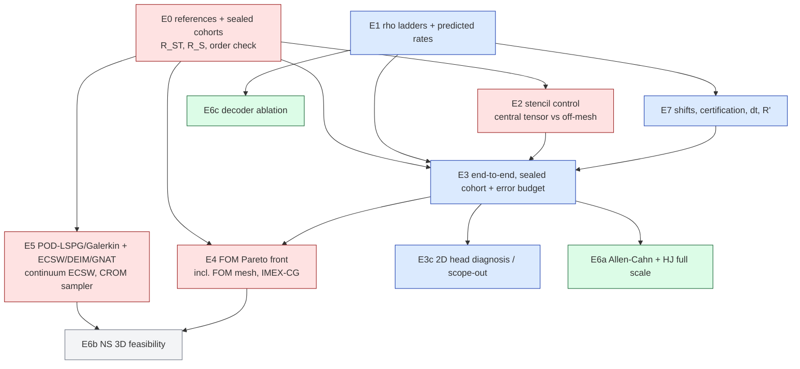

# 04 — Experimental campaign for the JCP paper (pre-registration draft)

Planning document, not a result. It designs the experiments a hostile JCP referee would need before believing
the paper's claims. Nothing here has been run. Every number quoted as "existing" comes from
`reports/2026-10-01-burgers3d-offmesh-quadrature.md`, `reports/2026-10-01-burgers2d-offmesh-quadrature.md`,
Hari's `SUMMARY.md` or the lab log.

## 0. The claims, and what already threatens them

The paper replaces data-fitted, mesh-bound hyper-reduction of the nonlinear term of an LSPG NM-ROM by a **fixed
classical quadrature of the continuum term**. The coordinate-network decoder is evaluated off-mesh, with analytic
gradients, at rank-1 lattice or Gauss points. Candidate claims:

| id | claim | current evidence | what threatens it |
|---|---|---|---|
| C1 | Quadrature error converges at a rate set by integrand smoothness; lattices beat Gauss in 3D, sparse grids fail | 3D: lat32768 ρ 0.9–2.0e-4 vs Gauss 32³ 4.7–6.6e-4; Smolyak ρ 24–45 | Rates measured on one shift only. No *predicted* rate. The 2D bank converges far more slowly than Hari's, cause not isolated |
| C2 | The mesh-target gap is the stencil's O(h) consistency error. Off-mesh ROM error is mesh-invariant | dense-vs-continuum ρ 0.195/0.098/0.052 (3D); off-mesh error ratio 1.003 vs tensor 2.70 | Shown only against **first-order upwind** FOM/tensor and a **first-order reference**. "Better than the mesh" may only mean "upwind is bad" |
| C3 | End-to-end accuracy is at least that of the incumbent tensor/EQ | 3D held-out 2.83 % vs 10.46/6.09/3.87 % | Reference is first-order (Richardson moves arms by ~1.3 pp). 2D **head** setting is not mesh-invariant (B2 1.91) and its rule failed B3 on test |
| C4 | Cost is flat in N and below the tensor. Speedup is real at matched accuracy | 3D solve flat. 256³ speedups 2.6–6.5× vs Newton–BiCGStab | At 64³ every ROM arm is slower than the FOM. Projection and decoding of outputs are O(N). The FOM ladder never varied the **FOM mesh** |
| C5 | Competitive with standard hyper-reduced ROMs | none on this data. Old POD-LSPG16 / QM rows were unhyper-reduced and small-r | The "accurate"/"fast" settings are **linear spans** (R′=384/128). POD-LSPG with R′ modes + ECSW is the obvious rival |
| C6 | General across nonlinearity class and decoder | Hari: scaled-down CPU models only | Full-scale evidence exists only for Burgers |

Design principle: **front-load the experiments that can falsify C2–C5** (sections 9–10).

## 1. Common contract (applies to every experiment)

- **Compute.** Tufts `gpu` partition only. One job per directory, unique namespace per lane. `squeue` is checked
  before and after every submit. `jax_backend=gpu` preflight runs (exit 42 → resubmit on another type). Data is f64
  and `JAX_DEFAULT_MATMUL_PRECISION=highest` is set. Data is regenerated from recorded seeds. Results are pulled and
  the cluster directory is deleted. Local GB10 is for ≤1-min smokes only (≤3 `jaxrun`).
- **Frozen models** are reused by sha256 and never retrained unless the experiment says so. Burgers 2D Table-1 model:
  dn256b, R=512, K=16, rotation_R512; settings accurate R′=384/M=1536, fast R′=128/M=512, head k=16/M=64. Burgers 3D
  M2: bank sha256 `6687f259…`, R=512, R′∈{512,256}. NS 3D coordnet bank: R=64, from
  `exp/2026-10-01-ns3d-coordnet-bank`.
- **Code provenance.** The off-mesh code (`offmesh.py`, `qcore.py`, `rules.py`, audits) lives on the two
  *unmerged* quadrature branches. The user declined merging on 2026-10-05, so every new lane **vendors byte-identical
  copies with a `PROVENANCE.json`**, as the 3D lane did. **Decision for the user:** fork from the quadrature-lane tips
  instead.
- **Pre-registration.** Each lane writes `DESIGN.md` before any GPU job. Amendments are dated and appended, never
  rewritten. A Codex design audit runs before code, a Codex code audit before the first ROM job, and a Codex results
  audit before the report. Each audit gives a per-item CORRECT/WRONG/NEEDS-RESTATEMENT verdict.
- **Gates (inherited, G1–G8).** Analytic derivative vs FD (≤1e-6). Off-mesh assembly fed mesh nodes and stencil
  reproduces the tensor/dense Jacobian (≤1e-12). J vs `jacfwd` (≤1e-12). Solver parity with vendor (≤1e-12).
  Continuum target certified against the next-finer Gauss rule and the flux form. Independent NumPy audit with two
  fault injections (swapped reference case, 1 % perturbed record). **A gate is checked at one real mesh before any
  verdict is read**, never only at smoke size (memory: gates-controls-must-fail-on-real-data).
- **Reports.** Generated from run JSONs by a script in `reports/`. Status line, LaTeX, mermaid, and a closing
  glossary. Provisional numbers are flagged inline.

### 1.1 Cohorts (one policy for the whole paper)

| cohort | 2D Burgers | 3D Burgers | use |
|---|---|---|---|
| dev | dev6 | 4 probe cases (923651) | debugging, smoke, gate tuning |
| val (selection) | val32 | 923801 × 64 | every rule size, tolerance and FOM-setting choice |
| historical test | test64 | 923901 × 32 | **replication only**: already opened by earlier lanes for fixed settings; reported, never headline |
| **sealed test** | new seed, 128 cases | new seed, 64 cases | headline numbers; opened **once** per lane, after `selection.json` sha256 is committed and mirrored |
| OOD | new seed, 32 cases: ν at the lower 10 % of range, widths below training minimum | same, 16 cases | stress; reported separately and never pooled |
| certification draws | 3 × 8 cases | 923811–923813 | ρ on reached states |

The sealed cohorts are generated once by the reference lane (L1). Their references are written to a read-only store
`/cluster/tufts/paralab/tawal01/jcpref/` with a committed sha256 manifest. A final job refuses to run unless the
lane's committed `selection.json` hash matches (freeze gate, tested by a deliberately mismatched hash that must make
the job abort).

### 1.2 Reference solutions: removing the first-order-reference bias

The existing references are the same first-order upwind + backward-Euler scheme on a finer grid: 8192² in 2D, 513³ in
3D. Their bias favours upwind arms. The post-hoc Richardson estimate moved 3D errors by up to 2.28 %. The paper uses
three references, each verified for order:

- **R_ST (primary, continuum in space and time).** Second-order central differences in space and Crank–Nicolson (or
  BDF2) in time, Newton–GMRES with tolerances 1e-11. Cell Péclet $|u|h/\nu < 2$ is checked per case; a case that
  fails it is refined further. Each case is computed at three resolutions $(h, h/2, h/4)$ with $\Delta t \propto h$.
  - 2D: 2048², 4096², 8192².
  - 3D: 129³, 257³, 513³. If 513³ CN does not fit an H200, use fourth-order central at 257³ and 385³ instead.
  - The **observed order** $p_{obs}$ is computed per case from the three solutions. A case is accepted iff
    $p_{obs}\in[1.8, 2.2]$ (worst over output times).
  - Richardson extrapolation uses $p_{obs}$. The reference uncertainty is $\epsilon_{ref}=|u_{h/2}-u_{h/4}|/(2^{p}-1)$.
  - Bar: worst $\epsilon_{ref}$ ≤ 0.1 × the smallest between-arm difference the paper claims. Otherwise that claim is
    reported as unresolved.
- **R_S (space-only, same backward-Euler Δt as the ROM).** The same spatial treatment, but time is integrated by
  backward Euler with the ROM's Δt. It isolates spatial and quadrature effects from the time-discretisation error,
  which is ~1–2 % in 2D (the ST − S gap). C2 is judged against R_S.
- **Independent-family cross-check.** A sine-Galerkin pseudo-spectral solver (2/3 de-aliasing) runs on 8 val cases
  per dimension. It must agree with R_ST within $2\epsilon_{ref}$. If it disagrees, the reference is not accepted.
- **Must-fire control.** The old first-order 8192²/513³ reference must differ from R_ST by more than $\epsilon_{ref}$
  on most cases. If it does not, the first-order bias was never material and §0's threat C2 is moot. That is a finding,
  and it is recorded.

All errors are scored on a lattice whose nodes are shared by every mesh and reference: 257² in 2D, 63³ in 3D.

## 2. E1 — quadrature-error ladders, measured vs predicted rates (C1)

**Claim.** For an analytic decoder, the continuum ρ of the tested nonlinear term converges at a rate predicted *a
priori* from the integrand. The rule size needed scales with the highest test frequency.

**Setup.** Frozen 2D (accurate, fast, head) and 3D (R′ 512, 256) models. Reached states of the certification draws
at every mesh: 2D 256²–4096², 3D 64³–256³.
- Continuum target: Gauss 640² in 2D and 80³ in 3D, certified against the next rule up (≤1e-7 3D; 2D as G6).
- Rule families: tensor Gauss–Legendre $p^d$; rank-1 lattices (2D Fibonacci; 3D CBC-$P_2$ and Korobov); lattice +
  tent; scrambled Sobol and Halton; Smolyak (CC and Gauss growth); plain MC.
- **Must-fail controls:** lat256, Smolyak CC 8, MC 4096, Gauss 8².

**Predictions, registered before measurement:**
- Gauss: $\rho \sim C\,\varrho_E^{-2p}$. $\varrho_E$ is the Bernstein-ellipse parameter fitted to the Chebyshev
  coefficient decay of 1D slices of the integrand $\psi\,u\,\partial u$ on 64 random lines per state, at the highest
  test frequency.
- Lattice: $\rho \sim m^{-\alpha}(\log m)^{d\alpha}$. $\alpha$ is the order of the first derivative of the
  periodised integrand that jumps across the boundary. It is computed symbolically from the Dirichlet factor $\mu$ and
  the sine tests, then checked numerically.
- Sobol: $m^{-1}$ in the worst case, $m^{-3/2}$ RMS (scrambled nets).
- MC: $m^{-1/2}$.
- Smolyak: pre-asymptotic until the level whose 1D rule resolves $a_{max}$, the largest test index ($\approx\sqrt M$
  per axis).
- Rule-size law: the smallest Gauss $p$ reaching ρ ≤ 1e-3 scales linearly with $a_{max}$ + the bank's effective
  bandwidth. Tested across R′ (fast vs accurate, R′=256 vs 512), which changes $M$ and hence $a_{max}$.

**Metrics.**
- Worst / p90 / median ρ over reached states $k \ge 1$, plus $k=0$ separately.
- Fitted rate with a 95 % bootstrap CI over states. The fitting window is fixed in advance: the 4 largest $m$ with
  ρ > 10 × the target-certification floor.
- Spearman correlation of per-state ρ with bump width, ν and step index (the 2D lane found Hari's narrow-bump story
  does not hold).

**Diagnosis of the 2D slow convergence.** This is an open item. Measure the bank's spectral content (2D FFT of $G$
columns on a 2048² sample) and compare it with Hari's bank. The paper's explanation stands only if $\varrho_E$ / the
measured bandwidth predicts the observed slower rate.

**Positive control (exactness).** A fixed sine bank (trigonometric polynomial) must reach ρ ≤ 1e-12 at exactly the
predicted Gauss $p^*$, and not at $p^*-2$. This checks the ρ machinery itself.

**Pass bars.**
- Measured rate within the predicted CI, or within ±25 % of the predicted exponent, for Gauss and lattice in 2D and 3D.
- Lattice beats Gauss at equal $m$ in 3D at all meshes and widths (already true on one shift; re-tested over shift
  distributions in E7).
- Every must-fail control has continuum ρ > 0.116.

**Fail mode.** If a prediction misses, report the empirical law only and drop the word "predicted". This does not
kill the paper.

**Compute.** ~15 GPU-h. ρ ladders are cheap; the 2D 640² target over all reached states dominates.

## 3. E2 — the continuum-vs-mesh-target mechanism (C2)

**Claim.** The mesh-target "error" of a resolved off-mesh rule is the FOM stencil's consistency gap, of order
$O(h^{q})$ with $q$ the stencil order. A ROM that integrates the continuum term therefore has mesh-invariant error.
Mesh-target hyper-reduction (tensor, EQ, sub-lattice) inherits the stencil error.

**Arms (2D 128²–4096², 3D 64³–256³; 512³ for ρ only, since dense stencil evaluation on reached states is cheap):**
- dense first-order upwind
- **dense second-order central** (new stencil control)
- tensor built from upwind
- **tensor built from second-order central** (new)
- EQ / lat64 (2D)
- off-mesh resolved rule (Gauss/lattice at the E1 size for ρ ≤ 1e-4)
- **all-continuum arm** (new): linear terms also continuum, i.e. $A$ by quadrature, $\lambda_{ab} = \pi^2(a^2+b^2)$
  exact; initial projection by quadrature of the analytic IC; outputs at fixed lattice points. The mesh is touched
  nowhere.

**Measurements.**
1. **Gap rate.** ρ(dense stencil vs continuum) over meshes. Fitted slope: predicted 1.0 for upwind (existing 3D:
   0.195 → 0.098 → 0.052), 2.0 for central.
2. **Rollout invariance.** Per-case spread of the error vs R_S over meshes.
   - Bar: max/min worst-case ratio ≤ 1.02 and per-case spread ≤ 0.05 pp for off-mesh and all-continuum arms
     (linear rungs).
   - The tensor's ratio is reported beside it (existing 2.70).
3. **Distance decomposition.** dist(off-mesh, tensor-upwind) should fall with slope 1. dist(off-mesh, tensor-central)
   should fall with slope 2.
4. **Allen–Cahn negative-prediction control** (from E6). The nonlinearity $u - u^3$ is pointwise, so the predicted
   gap is ≈ 0 (Hari: 5e-5). Off-mesh and mesh arms must coincide to within the quadrature error.

**Must-fire controls.**
- The upwind gap must exceed 0.116 at the coarsest mesh (64³ / 128²). At finer meshes it is expected to drop below,
  which is not a failure.
- Gauss 8² / lat256 rollouts must leave the invariance band.

**Kill/reframe test (K1).** Suppose that against R_ST/R_S the **second-order tensor** is as accurate as the off-mesh
rule (difference within $\epsilon_{ref}$) at equal or lower cost, at ≥2 meshes. Then C2 reduces to "first-order
upwind is inaccurate" and the accuracy claim is withdrawn. The paper keeps mesh-independence, memory and cost (C4)
and drops "more accurate than the incumbent".

**Compute.** ~35 GPU-h. The central-tensor tables at 256³ for R′=512 are 4.3 GB each, as for upwind.

## 4. E3 — end-to-end accuracy against strong references (C3)

**Setup.** Frozen models.
- Meshes: 2D 256², 512², 1024², 2048², 4096² (512²/2048² were never run); 3D 64³, 128³, 256³, plus 384³ if the H200
  holds the tensor arm (else off-mesh and FOM only).
- Arms: tensor (3D) / lat64 and EQ (2D head); dense where affordable (2D ≤ 1024² all cases, 4096² on 8 cases; 3D 64³
  all, 128³ 8 cases); the E1-selected off-mesh rule; the converged off-mesh rollout (2D gref Gauss 640², 3D
  lat32768); controls lat256 and smol8.
- Selection: the cheapest eligible rule within 1e-3 of the converged rollout on **val**, frozen per mesh and setting.
  The 3D lane found that re-selecting on held-out data flips gl24 → lat8192, so the paper reports the frozen choice
  and states this sensitivity.

**Metrics.** Primary: worst and median over the sealed test cohort of max-over-output-times relative error vs R_ST.
Also reported: vs R_S; vs the old first-order reference (continuity with earlier reports); same-grid; dist to dense
and to the converged rollout; LM iterations; exit codes (≤1 % non-stationary, zero non-finite). Paired per-case
differences (off-mesh − tensor) with a bootstrap CI. **No ranking is claimed where |difference| < $\epsilon_{ref}$**
(the 3D 256³/R′=256 0.58 pp case today).

**E3b — error budget.** This was not decomposed in either lane. Per case, report:
- bank floor: the best-fit of R_ST in the R′ span at each output time, on a fine Gauss grid;
- time-discretisation error: R_S vs R_ST;
- quadrature error: dist to the converged rollout;
- solver/test-space residual: the remainder.

Bar: the four components sum (in quadrature or triangle bound, stated) to within 10 % of the total. Otherwise a missing
term is declared.

**E3c — the 2D head failure (diagnose, else scope out).**
- Facts: on test64 every head arm, dense and lat64 included, has B2 ≈ 1.9; cases 36/48/60 move up to 4.7 pp between
  meshes; head Gauss 32² failed B3 (0.585/1.105/1.258 % vs 0.5 %). It is a head-solve effect, not a quadrature effect.
- Three pre-registered hypotheses, tested on those cases plus 16 val cases:
  - H1, initial fit: the head LM initial fit on Gauss-48 samples lands in different basins per mesh. Test: compute
    $z_0$ once at 4096² and reuse it at every mesh. If the spread falls below 0.5 pp, H1 is confirmed.
  - H2, LM branch selection along the trajectory: 64 random restarts of the per-step LM at the first step where
    trajectories diverge (located by per-step distance). If multiple stationary points exist with residual gap < LM
    tolerance, H2 is confirmed.
  - H3, mesh-dependent linear terms steering a non-convex head: run the all-continuum arm (E2). If the spread vanishes,
    H3 is confirmed.
- Fix candidates are tried **only on val**: shared $z_0$, continuation from the span solution, tighter gtol. Then they
  are confirmed once on the sealed cohort.
- **Scope-out rule.** If no hypothesis explains ≥ 80 % of the spread, the paper states that the mesh-invariance and
  accuracy claims hold for linear-span settings only. The head appears as a documented limitation with the three
  cases shown, not dropped silently.

**Pass bars (sealed cohort).**
- Off-mesh selected rule: worst error vs R_ST ≤ tensor/lat64 worst error − $\epsilon_{ref}$ at every mesh where C3
  claims superiority. Elsewhere it must be within $\epsilon_{ref}$ ("matches").
- Invariance ratio ≤ 1.02 (linear rungs).
- Controls fire (ρ > 0.116 and dist > 1e-3).

**Compute.** 2D ~45 GPU-h (5 meshes × 3 settings × sealed + val, 4096² on H200). 3D ~35. E3c ~15. Total ≈ 95.

## 5. E4 — cost, flat-in-N, matched-accuracy speedups (C4)

**Timing protocol.** Inherited, then strengthened.
- One GPU model per table (H200 for both 2D and 3D, so rows are comparable). GPU UUID recorded.
- A–B–A within one job: burn-in ≥ 30 s on the timed function (17 % clock-ramp bias seen 2026-08-17). JIT warm, with
  compile time reported separately. `block_until_ready`.
- ≥ 16 cases × 5 repetitions per subject. Every repetition array is persisted; medians are taken; a bootstrap CI is
  reported.
- Gates: drift A2/A1 within 1.10; neighbour ratio in [1/1.10, 1.10]; timed outputs bitwise equal to the untimed run.
- **Must-fire timing control:** an arm with an injected 5 % sleep must be flagged by the drift gate. A CPU-forced run
  must fail the preflight.

**Measurements.**
1. **Per-Jacobian.** ms, flops, bytes moved, memory of the nonlinear-term data. Tensor $8MR'^2$ vs off-mesh
   $8m(2R'+M)$. Includes a roofline prediction. Bar: the measured/roofline ratio is reported. The existing finding to
   confirm is that the GEMM is faster than the tensor despite 27× the flops.
2. **Flat in N.** Solve time and *full query* time for 2D 256²–8192² and 3D 64³–512³, all-continuum arm included.
   - Prediction: solve time slope 0 (bar: max/min ≤ 1.10).
   - Full query: flat for the all-continuum arm, O(N) for the mesh-decoding arms. Reported as stated; the slope is
     fitted.
3. **Matched-accuracy speedup vs NAMED efficient iterative FOMs.**
   - Solvers: (a) Newton–BiCGStab with a stated preconditioner (Jacobi and an ILU(0)/multigrid-preconditioned
     variant); (b) Newton–GMRES(30); (c) **IMEX**: explicit advection plus implicit diffusion by preconditioned CG, at
     its CFL-limited Δt. This is the cheapest standard iterative scheme for advection-diffusion and the first one a
     referee will name.
   - The FOM ladder spans Δt × Newton tol × linear tol **× FOM mesh** (2D 128²–4096², 3D 48³–256³). Every FOM run is
     scored against R_ST.
   - Speedup = FOM cost on its **Pareto front**, interpolated log-log at the ROM's sealed-cohort worst error, divided
     by ROM cost. Interpolation only inside the bracket; "no FOM as accurate" is reported as such, never as ∞.
   - Matching is on worst-case error. Median-matched values are given alongside.
4. **Amortisation.** Offline cost: FOM data generation, bank training, rule construction (≈0 for lattices; NNLS hours
   for EQ/ECSW). Break-even query count against the Pareto-front FOM.

**Notes.**
- The FOM-mesh knob (a coarse-grid FOM) was excluded by the user's 2026-09-21 scope decision for the discarded ICLR
  draft. A JCP referee will compute it themselves, so **it must be run**. Whether it is printed is the user's call.
  Ask before reporting.
- 2D used `fft_tight` (spectral) as its same-grid reference. It is a reference only, never a timed comparator, under
  the named-iterative rule.

**Kill/reframe test (K2).** Suppose the speedup over the Pareto front of (a)–(c) at the largest affordable mesh is
< 2× for every linear-rung setting. Then the paper's cost claim becomes memory/mesh-independence only: no "faster
than FOM". (The 3D lane already found every arm slower than the FOM at 64³, and 2.6–6.5× at 256³ against
fixed-mesh Newton–BiCGStab only.)

**Compute.** ~60 GPU-h. The FOM Pareto ladder over meshes dominates.

## 6. E5 — hyper-reduced ROM baselines a referee will demand (C5)

All baselines use the **same training trajectories** (regenerated from the bank's training seed), the same Δt, the
same output times and the sealed cohort.

| baseline | basis | hyper-reduction | why |
|---|---|---|---|
| POD-LSPG | POD at each mesh, r ∈ {16, 64, 128, 384} (2D) / {64, 256, 512} (3D) | none; ECSW (Farhat NNLS, tolerance ladder 1e-2…1e-4); GNAT with Q-DEIM sampling | standard linear ROM with standard HR; r=R′ removes the "it's just a linear span" objection |
| POD-Galerkin | same | DEIM / Q-DEIM on the nonlinear term | the textbook pairing |
| POD + off-mesh | POD modes cubic-interpolated (C¹) | our Gauss/lattice rule | separates rule from decoder (Hari: algebraic ρ, but rollout fine) |
| tensor / mesh EQ (incumbent) | our bank | quadratic tensor; NNLS EQ on mesh | already in E3 |
| **continuum ECSW** | our bank | NNLS over a 256²/48³ Gauss candidate set, same training states | "is a classical rule enough, or does fitting on the continuum win?" |
| CROM-style sampler | our bank | residual-driven greedy continuum point selection (CROM's sampler) | closest prior art (CROM, ICLR 2023) |
| quadratic manifold | existing QM (Table-3 lane) | ECSW | the nonlinear-manifold rival with classical HR |

**Fair-comparison rules.**
- One solver family: Gauss–Newton/LM with identical gtol, trust radius and exit criteria. LSPG baselines use their
  own standard test space and are also run with our $M$ sine tests, so both variants are visible.
- Equal tuning budget: each baseline gets the same number of val-cohort configurations (≤ 12), chosen by a rule
  written in advance (cheapest within 10 % of its own best val error). Hyper-reduction tolerances are selected on val
  only.
- The same GPU, timing protocol and Pareto plot (error vs R_ST, cost) as E4. Offline costs are reported. The NNLS
  fits on the cluster are timed on CPU and GPU.
- Memory per method is reported, including the snapshot matrix needed to build ECSW at each mesh. Mesh-bound
  baselines need a refit per mesh; that counts as offline cost.

**Must-fire controls.** POD r=4 and ECSW at tolerance 0.5 must fail (error > 3× the best arm). If POD at r=R′
without HR does not beat POD r=16, the snapshot set is suspect.

**Kill/reframe test (K3).** Suppose POD-LSPG+ECSW at r = R′ reaches the off-mesh NM-ROM's sealed worst error within
$\epsilon_{ref}$ at ≤ its online cost at every mesh. Then the coordinate-network decoder buys nothing but off-mesh
evaluability. The paper becomes "classical quadrature for any smooth continuous decoder", with POD+interpolation as
a first-class arm.

**Compute.** ~90 GPU-h. 3D snapshot regeneration and ECSW NNLS are the bulk; the NNLS may need CPU nodes.

## 7. E6 — generality: nonlinearity class and decoder (C6)

**E6a — second and third nonlinearities, full scale (2D).** For Allen–Cahn ($\tau=0.2$, the stable variant; the
stiff $\tau=0.05$ is excluded because the dense ROM itself exceeds 100 %) and viscous Hamilton–Jacobi
$|\nabla u|^2/2$ (Osher–Sethian monotone stencil):
- Train one bank per PDE with the Burgers recipe (R=512, the same training-set size and the same rotation). Hari's
  models were R=128 CPU-scaled.
- Run E1 ladders, E2 (gap: AC predicted ≈ 0; HJ predicted O(h)), E3 (meshes 256²–2048², sealed 64-case cohorts,
  R_ST references) and the E4 per-Jacobian/flat-N panel.
- Bars: as E1–E3. HJ is the hardest integrand (Hari: Gauss 48² 1.7e-2), so its rule-size law is the stringent test.
- **Bratu (steady)** is included only as a one-table appendix check. It has no time stepping and existing code.

**E6b — 3D Navier–Stokes (feasibility; stretch).** NS coordnet bank (R=64, div-free, periodic, co-moving frame;
floor ~1 %, 8–10× POD-64) at 32³/64³/96³.
- The FOM (CNAB2, pseudo-spectral) has no O(h) gap, so the predicted outcome is: off-mesh ≈ mesh in accuracy, and
  only cost and mesh-independence change. On a periodic box the equal-weight trapezoid grid is a rank-1 lattice and
  is predicted to beat Gauss.
- Arms: trapezoid $n^3$, CBC lattice, Gauss, Sobol; controls lat256 and Smolyak.
- It is a confirmation of the *prediction*, not of accuracy superiority. **Go/no-go:** run only if E3/E5 survive. If
  the bank floor (1 %) dominates every comparison, report it as a feasibility row.

**E6c — decoder ablation at full scale (Burgers 2D).** Six banks with the same R=512, data and head: RFF (incumbent),
SIREN, Gaussian RBF (fixed centres), fixed sine bank (untrained), POD + cubic interpolation, POD + bilinear.
- Predicted convergence class: spectral (RBF/sine), super-algebraic (RFF/SIREN), algebraic $m^{-2}$ (cubic) and
  $m^{-1}$ (bilinear) in worst-case ρ.
- Bars: measured class matches the prediction. Every decoder reproduces its own dense rollout to within the O(h) gap
  (end-to-end, Hari). The C¹ requirement is stated as a hypothesis tested by the bilinear arm.

**Compute.** E6a ~120 GPU-h (2 banks × ~25 GPU-h training + data + references + panels). E6b ~50. E6c ~70.

## 8. E7 — robustness (C1, C3)

1. **Shift and scramble distributions.** 64 independent random shifts per lattice size and 64 Owen scrambles per
   Sobol size, at every mesh.
   - Report the distribution (median, p95, max) of worst-state ρ and of rollout dist to the converged run.
   - Bar: the p95 over shifts meets the same bars the single shift met. Otherwise the selected size is raised to the
     smallest size whose p95 passes, and the cost tables are updated.
   - **Bad-vector control:** the generating vector z=(1,1,1) (or z=(1,1) in 2D) must fail.
2. **A-posteriori certification by rule doubling / shift variance.** Estimator $\hat\rho_1 = \lVert a_m -
   a_{2m}\rVert/\lVert a_{2m}\rVert$ (embedded lattice or $p\to2p$). Estimator $\hat\rho_2$ = the standard error over
   8 random shifts.
   - Effectivity $\hat\rho/\rho_{true}$ is computed on all reached states.
   - Bar: effectivity in [1, 10] on ≥ 95 % of states, and never < 0.5 (no dangerous under-estimation).
   - The online certificate in the paper exists only if this passes.
   - Control: the estimator must flag the bad-vector rule.
3. **Time-step sensitivity.** Δt ∈ {Δt/4, Δt/2, Δt, 2Δt} on val + sealed.
   - Prediction: the rule ranking and the mesh-invariance ratio are unchanged. Error vs R_ST tracks BE $O(\Delta t)$.
     Error vs R_S at matched Δt is flat.
   - Bar: the ranking is preserved at every Δt.
4. **R′ sweep.** R′ ∈ {64, 128, 256, 384, 512}. It tests the E1 rule-size law (required $m$ vs $a_{max}$) and the
   cost law $m(2R'+M)$.
5. **Mesh-growth of ρ.** A fixed rule's ρ grows with the mesh: lat4096 crosses 0.116 at 256³, R′=512.
   - Certification is per mesh, and the ρ trend is reported against the reached-state sharpness (a measured gradient
     norm).
   - The rule-size law must absorb this. If ρ keeps growing beyond 512³, report it as a limitation.
6. **Parameter range.** OOD cohort (low ν, narrow bumps): the same panels, reported separately.

**Compute.** ~60 GPU-h. ρ for 64 shifts is cheap; the 64-shift rollouts run on a 16-case subset.

## 9. Dependencies

Red = can force a reframing; blue = core evidence; green = generality; grey = stretch. E1 and E7(1–2) need only
existing reached states, so they start in parallel with L1. E3 needs L1's references, E1's rule sizes and E7(1)'s
shift-robust sizes.

## 10. Lanes (proposed names; NOT created — user approval required)

Each lane is a sparse worktree forked from `21c175a1b`, has its own `sync_github.sh` (LOCAL_BASE `21c175a1b…`,
REMOTE_BASE `1716d80de…`), its own cluster namespace and its own `DESIGN.md`.

| order | worktree / branch `exp/…` | experiments | namespace | GPU-h |
|---|---|---|---|---|
| 1 | `2026-10-07-jcp-references` | E0: R_ST/R_S 2D+3D, order verification, spectral cross-check, sealed + OOD cohorts, read-only store | `jcpref` | 120 |
| 1 | `2026-10-07-jcp-mechanism` | E1 + E2 (stencil control, all-continuum arm) | `jcpmech` | 50 |
| 2 | `2026-10-07-jcp-fom-pareto` | E4 FOM ladders (BiCGStab/GMRES/IMEX-CG × mesh), timing harness | `jcpfom` | 40 |
| 2 | `2026-10-07-jcp-hr-baselines` | E5 | `jcphr` | 90 |
| 3 | `2026-10-07-jcp-endtoend` | E3, E3b, ROM side of E4, final sealed-cohort panels | `jcpe2e` | 100 |
| 3 | `2026-10-07-jcp-head2d` | E3c | `jcphead` | 15 |
| 3 | `2026-10-07-jcp-robustness` | E7 | `jcprob` | 60 |
| 4 | `2026-10-07-jcp-generality` | E6a (AC, HJ) + E6c decoders | `jcpgen` | 190 |
| 5 | `2026-10-07-jcp-ns3d` | E6b (go/no-go after K2/K3) | `jcpns` | 50 |

**Total ≈ 715 GPU-h**, ~900 with a 25 % contingency for reruns and failed preflights. That is roughly 4–6 wall-days
at 4 concurrent single-GPU jobs. The training in E6a/E6c is the elastic part.

`jcp-references` writes the shared store. Every other lane only reads it, by sha256 manifest. That keeps the
one-job-per-directory rule intact. When the lanes finish, ask the user whether to merge them, and log the decision.

## 11. Ordering, and kill criteria

**Order (killers first).**
- Week 1:
  - L1 references (the order-verified R_ST/R_S).
  - In parallel, the E2 stencil control (K1). It only needs the existing first-order refs to start and is re-scored
    on R_ST when ready.
  - The E4 FOM Pareto ladder (K2).
  - E5 POD-ECSW at r=R′ on 2D 1024² first (K3; cheapest decisive cell).
  - E1 ladders (low risk).
- Week 2: E3 sealed panels, E3c, E7. Then E6a/E6c. E6b only on go.

**Kill criteria (each forces a written reframing before more compute is spent):**

| id | result | consequence |
|---|---|---|
| K0 | R_ST fails order verification (p_obs ∉ [1.8, 2.2]) on > 10 % of cases, or disagrees with the spectral cross-check | no accuracy claim against any reference until fixed; paper reverts to ρ and "vs dense" distances only |
| K1 | second-order mesh tensor matches off-mesh vs R_ST/R_S within $\epsilon_{ref}$ at ≤ cost, ≥ 2 meshes | drop "more accurate than incumbent". Keep mesh-independence, memory and flat cost. The O(h) story becomes an explanation of first-order baselines only |
| K2 | Pareto-front speedup < 2× at the largest mesh for every linear-rung setting | drop "faster than FOM". Frame as memory/mesh-free hyper-reduction for many-query use with amortisation numbers |
| K3 | POD-LSPG+ECSW at r = R′ matches accuracy at ≤ online cost at every mesh | decoder is not the contribution. Paper = classical quadrature for smooth continuous decoders, POD+interp first-class |
| K4 | shift p95 fails bars at the selected size, and the effectivity of the a-posteriori estimator < 0.5 on > 5 % of states | no "fixed rule needs no certification" claim. Require online doubling (cost ×2 is reported) |
| K5 | E3c leaves head spread unexplained | head scoped out as a limitation. Claims restricted to linear spans, stated in abstract |
| K6 | AC/HJ full-scale banks do not reproduce Burgers' behaviour (rate class, invariance) | generality claim restricted to Burgers. Title and abstract say so |

**Already known and stated up front (not kill criteria, but they must appear in the paper):** at 64³ every reduced
arm is slower than the FOM; mesh projection and output decoding stay O(N) unless the all-continuum arm is used; the
3D selection is sensitive (gl24 vs lat8192); 2D test64 and 3D 923901 are reused cohorts.

## Glossary

- **ρ**: relative error of a rule's tested nonlinear term against a target on one reduced state. **Continuum target**:
  converged fine Gauss rule. **Mesh target**: the FOM stencil on every node. **Reached states**: states a solve visits.
- **O(h) gap**: first-order stencil minus exact derivative; halves per refinement.
- **R_ST / R_S**: order-verified reference converged in space and time / in space only (ROM's backward-Euler Δt).
  **$\epsilon_{ref}$**: its Richardson uncertainty; **p_obs**: its observed order.
- **tensor**: precomputed quadratic form of the mesh-stencil advection ($MR'^2$ numbers). **EQ / ECSW**: NNLS-fitted
  non-negative point weights. **DEIM / Q-DEIM / GNAT**: row-sampling hyper-reduction. **POD-LSPG / -Galerkin**: SVD
  bases with least-squares Petrov–Galerkin / Galerkin projection. **CROM**: neural-field ROM with residual-driven
  point sampling.
- **R′ / M / m**: bank width / number of sine tests / number of quadrature points. **Linear rung / head**: solving
  for bank coefficients / for a latent of a nonlinear head.
- **Pareto front**: FOM settings not beaten in both cost and error; speedup is read on it at the ROM's error.
  **A–B–A**: ROM, FOM, ROM timed in one job.
- **Sealed cohort**: test cases not read until the selection is hashed. **Must-fail control**: an arm built to fail;
  if it passes, its gate is not discriminating. **Effectivity**: estimated / true error.
- **$\varrho_E$**: Bernstein-ellipse parameter setting Gauss's exponential rate. **CBC lattice**: rank-1 lattice with
  a component-by-component generating vector.
