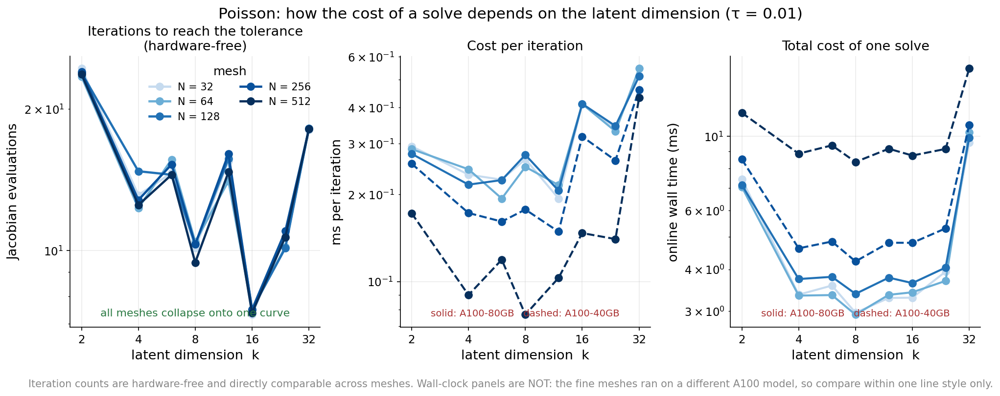
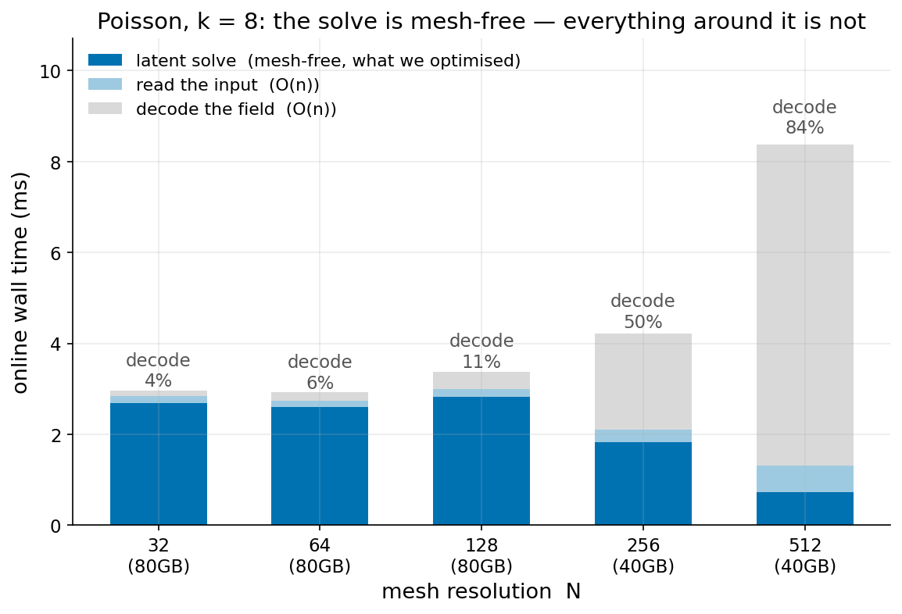
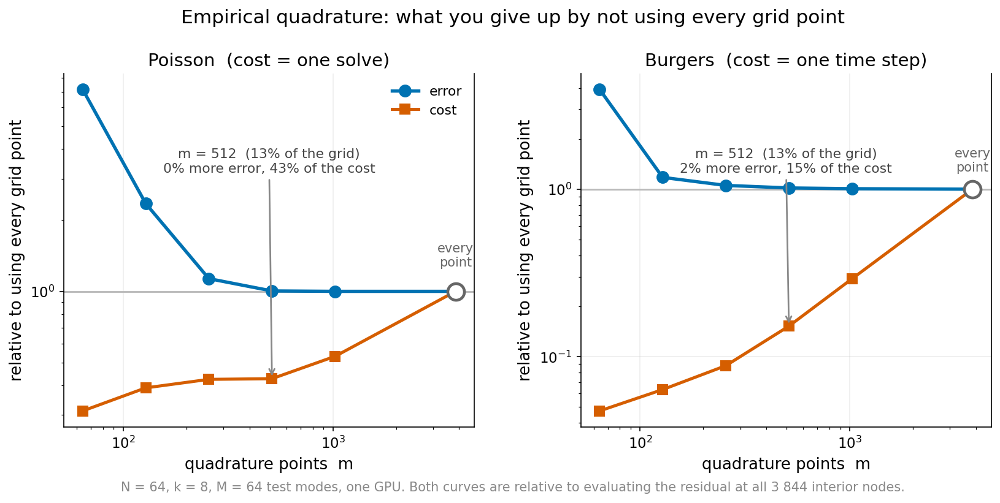

# What a solve costs, and when it is worth it

Poisson and Burgers, 17 August runs. Errors are held-out relative L2. Timings are provisional
until a final single-GPU run lands; the directions won't change.

---

## 1. Cost against latent dimension

Iterations needed to reach the stopping tolerance, at k=8:

| grid | 32 | 64 | 128 | 256 | 512 |
|---|---|---|---|---|---|
| iterations | 10.1 | 10.4 | 10.3 | 10.3 | 9.4 |

Flat across a 256-fold change in the number of unknowns. That is the central claim of the
method, and it holds.

Now the same sweep across k, against what the decoder itself is capable of. "Ceiling" is the
error you would get from the best possible latent, so it is the floor no solver can beat. All
three rows come from the same runs at the tightest setting:

| k | 2 | 4 | 6 | 8 | 12 | 16 | 24 | 32 |
|---|---|---|---|---|---|---|---|---|
| ceiling | 1.24e-1 | 1.55e-2 | 8.84e-3 | 7.04e-3 | 6.24e-3 | 4.13e-3 | 3.98e-3 | 3.28e-3 |
| we get | 5.46e-1 | 1.74e-2 | 5.85e-2 | 8.48e-3 | 4.79e-2 | 6.54e-3 | 1.49e-2 | 4.02e-2 |
| ratio | 4.4 | 1.1 | 6.6 | 1.2 | 7.7 | 1.6 | 3.7 | 12.3 |
| iterations | 23.4 | 15.9 | 29.2 | 28.2 | 34.7 | 29.0 | 37.4 | 39.6 |

The ceiling improves monotonically — every extra dimension genuinely helps the decoder. We
reach it at k=4, 8 and 16, and miss it badly at 6, 12, 24 and 32, where the solve also burns
extra iterations without getting closer. It is not the data and not ill-conditioning: our
optimiser stalls at those latent sizes. It is a defect in our solver and the most useful thing
to fix.

### Where the time goes

We made the solve independent of grid size, and it worked. So the solve is no longer where the
time goes:

| grid | 32 | 64 | 128 | 256 | 512 |
|---|---|---|---|---|---|
| spent decoding | 4% | 6% | 11% | 50% | 84% |

At 512×512 the latent solve — the part we optimised — is 9% of the total.

### How few points the residual actually needs

The solve never touches the whole grid. Empirical quadrature (non-negative least squares)
picks a small set of points and weights that reproduce the residual, and everything above
rests on how few are enough.

At 64×64, k=8, M=64 test modes:

| points | share of grid | error | cost | quadrature fit |
|---|---|---|---|---|
| **Poisson** | | | *ms per solve* | |
| 64 | 2% | 5.48e-2 | 11.1 | 1.4e-1 |
| 128 | 3% | 1.80e-2 | 13.9 | 1.6e-2 |
| 256 | 7% | 8.66e-3 | 15.1 | 2.4e-3 |
| 512 | 13% | 7.68e-3 | 15.2 | 2.4e-4 |
| 1024 | 27% | 7.65e-3 | 18.9 | 1.6e-5 |
| every point | 100% | 7.65e-3 | 35.6 | exact |
| **Burgers** | | | *ms per step* | |
| 256 | 7% | 1.74e-2 | 4.7 | 6.2e-3 |
| 512 | 13% | 1.68e-2 | 7.9 | 1.0e-3 |
| every point | 100% | 1.65e-2 | 46.5 | exact |

Thirteen percent of the points gives the same error as all of them, for 43% of the cost on
Poisson and 17% on Burgers. Error stops improving once the quadrature fit reaches about 1e-3;
below that the decoder's own ceiling binds, not the quadrature. That makes the fit residual a
usable way to choose the number of points without needing held-out error.

The share matters more as the grid grows. Holding the point count at 256 and refining:

| grid | interior nodes | share of grid | error | solve | quadrature fit |
|---|---|---|---|---|---|
| **Poisson** | | | | *ms per solve* | |
| 32×32 | 900 | 28.4% | 1.08e-2 | 8.8 | 1.5e-3 |
| 64×64 | 3,844 | 6.7% | 8.48e-3 | 7.2 | 1.3e-3 |
| 128×128 | 15,876 | 1.6% | 8.40e-3 | 8.3 | 1.5e-3 |
| 256×256 | 64,516 | 0.4% | 8.38e-3 | 6.4 | 1.5e-3 |
| 512×512 | 260,100 | 0.1% | 8.61e-3 | 6.0 | 1.5e-3 |
| **Burgers** | | | | *ms per rollout* | |
| 32×32 | 900 | 28.4% | 1.62e-2 | 331 | 7.0e-3 |
| 64×64 | 3,844 | 6.7% | 1.58e-2 | 307 | 6.7e-3 |
| 128×128 | 15,876 | 1.6% | 1.67e-2 | 304 | 7.4e-3 |
| 256×256 | 64,516 | 0.4% | 1.76e-2 | 362 | 7.3e-3 |

The same 256 points cover 28% of the coarsest grid and 0.1% of the finest, and the error and
the solve cost barely move. That is the mesh-independence result seen from the quadrature side:
the number of points the residual needs is set by the problem, not by the grid.

---

## 2. Speed against accuracy

Poisson, cheapest way to reach about 1% error:

| grid | ours | error | classical solver | error | |
|---|---|---|---|---|---|
| 64×64 | 3.4 ms | 1.16e-2 | 2.2 ms | 5.8e-3 | we are slower, 0.65× |
| 256×256 | 4.8 ms | 1.13e-2 | 7.9 ms | 1.1e-2 | 1.6× faster |
| 512×512 | 8.8 ms | 1.18e-2 | 26.5 ms | 7.1e-3 | 3.0× faster |

Our cost is nearly flat; the classical solver's is not. The advantage only appears on fine
grids.

POD is absent because it cannot reach 1% at all. Its best is 5.10e-2 at 64×64, and more modes
do not help. At 0.37 ms it is roughly ten times cheaper than us where 5% is good enough, so the
two methods do not really compete: POD owns the rough end, we own everything below it.

One trained model, two settings:

| grid | loose | | tight | | |
|---|---|---|---|---|---|
| 64×64 | 1.8 ms | 8.4e-2 | 3.4 ms | 1.16e-2 | 1.9× time, 7.2× accuracy |
| 256×256 | 3.2 ms | 8.3e-2 | 4.8 ms | 1.13e-2 | 1.5× time, 7.4× accuracy |
| 512×512 | 7.3 ms | 9.3e-2 | 8.8 ms | 1.18e-2 | 1.2× time, 7.9× accuracy |

The trade gets better as the grid refines.

**Burgers.** We lose everywhere: 106 ms against 29 ms at 64×64 (error 2.24e-2), 290 ms against
159 ms at 256×256 (error 2.54e-2). The gap narrows with refinement but does not close. The
tolerance dial also saturates here — tightening it past the first step returns an identical
1.6e-2 and never converges.

For reference, at k=8 on a 64×64 grid across the four PDEs we have run:

| | ceiling | ours | POD |
|---|---|---|---|
| Poisson | 7.11e-3 | 7.65e-3 | 1.77e-1 |
| Heat | 1.16e-2 | 1.87e-2 | 1.29e-1 |
| Burgers | 1.15e-2 | 1.65e-2 | 2.09e-1 |
| Wave | 1.72e-1 | 8.78e-1 | 3.42e-1 |

On the three that work we land within 1.1–1.6× of the decoder's own floor, so the solve is
close to as good as the representation allows. Wave fails outright.

---

## 3. Warm-starting the classical solver

Let the reduced model produce a rough answer, hand it to the classical solver to finish. Same
final accuracy, so only cost is in question.

| grid | classical alone | with warm start | iterations, plain → warm | |
|---|---|---|---|---|
| 64×64 | 4.8 ms | 6.8 ms | 158 → 168 | 0.71× |
| 256×256 | 19.9 ms | 22.6 ms | 658 → 616 | 0.88× |
| 512×512 | 61.7 ms | 65.8 ms | 1342 → 1262 | 0.94× |

It never pays. On Burgers it is worse, 0.15× to 0.49×.

The two problems fail differently. On Poisson our answer looks accurate — 9.27e-3 measured the
usual way — but conjugate gradients contracts error in a different norm, and in that norm we
are 4.97e-2 off. So it saves only 1–4% of iterations, and on coarse grids costs more than
starting from zero. On Burgers the guess is genuinely good, cutting Newton iterations from 98
to 92 at every grid size, but it costs 273 ms to produce against a 48–228 ms classical solve.

Extrapolating from the previous two time steps beats our warm start and costs nothing.

---

*Full tables and provenance in `exp/2026-08-17-cost-to-tolerance` and
`exp/2026-08-17-rom-warmstart-fom`.*
